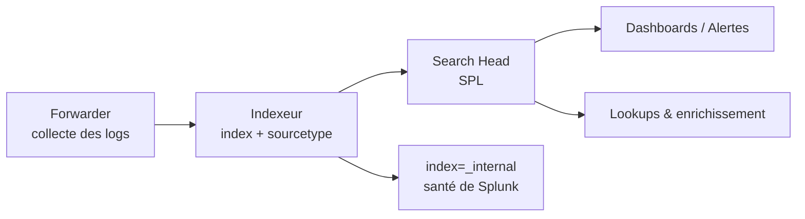

# Splunk — Défense & SIEM

> [!info] **En 1 phrase**
> Splunk est le **SIEM leader du marché** : il ingère des flux de logs, les **indexe** par
> `sourcetype`, et permet de chercher/corréler via le langage **SPL** (Search Processing
> Language) pour produire dashboards et alertes.

---

## Overview

| Champ | Valeur |
|---|---|
| Nom complet | Splunk Enterprise |
| Description | Plateforme de log management et SIEM : ingestion, indexation, recherche SPL, dashboards, alertes |
| Catégorie | IDS / SIEM / EDR |
| Sous-catégorie | SIEM / Log management / Corrélation & Threat detection |
| Fonction principale | Collecter, parser, indexer, rechercher et alerter sur des données machine à grande échelle |
| Type d'outil | Suite de services serveur (indexer, search head, forwarders) + API REST |
| Licence | Propriétaire (licence par GB/jour ; free tier 500 Mo/jour ; apps tierces sur Splunkbase) |
| Open source / propriétaire | Propriétaire (free tier limité, pas de code du moteur) |
| Langage(s) de programmation | C++ (moteur), Python (apps, add-ons), XML/JS (dashboards), SPL |
| Développeur / organisation | Splunk Inc. (filiale Cisco depuis 2024) |
| Projet officiel | Splunk Enterprise |
| Dépôt officiel | https://github.com/splunk (apps et libs) |
| Documentation officielle | https://docs.splunk.com |
| Date de création | 2003 (première version publique 2006) |
| État du projet | actif (ligne 9.4 : 9.4.14 publiée 2026-07-10) |
| Dernière version connue | 9.4.14 (ligne 9.4) |
| Systèmes compatibles | Linux, Windows, macOS (search head), conteneurs ; forwarders sur de nombreuses plateformes |

> [!note] Pour vérifier / compléter
> La ligne 9.4 remplace les 9.0-9.3 ; vérifier la matrice de compatibilité (OS, forwarders) dans les release notes avant upgrade. Splunk peut s'exécuter en mode « Splunk Cloud » managé ou self-hosted.

---

## Concept

Splunk centralise **tous les logs** (systèmes, applications, réseau, endpoints) dans un index, puis les interroge avec **SPL** : une syntaxe pipeline (`|`) proche du shell, qui filtre, enrichit (`lookup`), agrège (`stats`), et visualise. Le **sourcetype** dit à Splunk *comment* parser un log ; l'index délimite les périmètres (index=main, index=security). Les **forwarders** (agents légers) poussent les logs vers l'indexeur ; l'analyse se fait dans la console web avec dashboards et **alertes** (seuils, cron, actions). Splunk est l'outil SOC par défaut des grands comptes : il vaut par la richesse de **SPL** et la **recherche à grande échelle**, et par son écosystème d'apps (Enterprise Security, add-ons par source).

En engagement, Splunk se retrouve aussi du côté **offensif** : un accès à la console ou aux credentials de recherche permet de **chercher les secrets exposés** dans les logs (mots de passe, tokens), de comprendre les règles de détection pour **choisir des techniques moins surveillées**, ou de **masquer ses actions** (avec un risque d'audit très visible dans `index=_internal` et `index=_audit`).

Il se place dans les phases **défense / SOC** d'une infrastructure : agrégation des logs d'authentification, pare-feux, proxys, EDR, SIEM central de corrélation avec alertes et cases d'investigation — le référentiel auquel les alternatives open source ([[Outil - Elastic]], [[Outil - Graylog]], [[Outil - Wazuh]]) sont comparées.



---

## Concepts fondamentaux

| Concept | Explication |
|---|---|
| SPL | Search Processing Language : pipeline de commandes `| search | stats | table` |
| Index | Conteneur logique de données indexées (ex. `index=security`) ; limiter la recherche à un index = performance |
| Sourcetype | Type de source qui définit le parsing (`linux_secure`, `wineventlog`, `iis`, `json`) |
| Source | Fichier/entrée d'origine (`/var/log/auth.log`, `WinEventLog:Security`) |
| Forwarder | Agent léger (Universal Forwarder) qui collecte et pousse les logs vers l'indexeur |
| Indexer | Nœud qui reçoit, parse, indexe et stocke les données ; port 9997 (receiving) |
| Search Head | Nœud de recherche : exécute SPL, dashboards, alertes ; port 8000 (UI) |
| Deployment Server | Distribue apps/configurations aux forwarders (serverclass) |
| HEC | HTTP Event Collector : ingestion par API HTTP JSON (port 8088) avec token |
| Lookup | Enrichissement par fichier CSV / KVStore (ex. `lookup usernames.csv user OUTPUT role`) |
| `_internal` / `_audit` | Index internes : logs de Splunk (`_internal`) et journal d'audit des actions (`_audit`) |
| Scheduling | Alertes planifiées : recherche + condition + actions (email, webhook, script) |
| Enterprise Security (ES) | App SIEM : corrélations, risk-based alerting, cases d'investigation |

---

## Installation

### Serveur Linux (indexer / search head)

```bash
wget -O /tmp/splunk.tgz https://download.splunk.com/products/splunk/releases/9.4.14/linux/splunk-9.4.14-xxxxx-linux-2.6-x86_64.tgz
sudo tar xvzf /tmp/splunk.tgz -C /opt
sudo /opt/splunk/bin/splunk start --accept-license --answer-yes
sudo /opt/splunk/bin/splunk enable boot-start -user splunk
# UI : http://<serveur>:8000 (admin / mot de passe défini à l'installation)
```

### Universal Forwarder (côté endpoints)

```bash
wget -O /tmp/uf.tgz https://download.splunk.com/products/universalforwarder/releases/9.4.14/linux/splunkforwarder-9.4.14-xxxxx-linux-2.6-x86_64.tgz
sudo tar xvzf /tmp/uf.tgz -C /opt
sudo /opt/splunkforwarder/bin/splunk start --accept-license --answer-yes
# Pointe vers l'indexeur : /opt/splunkforwarder/etc/system/local/outputs.conf
#   [tcpout]
#   defaultGroup = primary_indexers
#   [tcpout:primary_indexers]
#   server = 10.10.20.15:9997
```

### Docker

```bash
docker run -p 8000:8000 -p 8088:8088 -e SPLUNK_START_ARGS=--accept-license \
  -e SPLUNK_PASSWORD=ChangeMe123! -v splunk:/opt/splunk/var splunk/splunk:9.4
```

### Windows

```powershell
# Installer le .msi Splunk Enterprise (ou Universal Forwarder) en tant que service
# UI sur http://localhost:8000, forwarder : config outputs.conf vers l'indexeur
```

> [!warning] Prérequis & problèmes potentiels
> - Licence : sans licence, le **free tier 500 Mo/jour** s'arrête à 60 jours (mode trial) ; au-delà, achat par volume.
> - Les indexeurs et search heads doivent être dimensionnés (RAM ≥ 16 Go recommandé, stockage selon le volume).
> - Ports : 8000 (UI), 8088 (HEC), 9997 (forwarder→indexer), 8089 (management), 514 (syslog).
> - Le mot de passe admin initial doit respecter les règles de complexité de Splunk.

---

## Configuration

| Paramètre | Rôle | Valeur possible | Impact | Exemple |
|---|---|---|---|---|
| `inputs.conf` (forwarder) | Définit les entrées à collecter | `monitor://`, `tcp`, `winEventLog` | Quels logs partent vers l'indexeur | `monitor:///var/log/auth.log` |
| `outputs.conf` (forwarder) | Destination des données | `server = <indexer>:9997` | Où partent les logs | `server = 10.10.20.15:9997` |
| `indexes.conf` | Définition des index (rétention, size) | `coldToFrozenDir`, `frozenTimePeriodInSecs` | Rétention et coût de stockage | `frozenTimePeriodInSecs = 2592000` |
| `serverclass.conf` (deployment) | Groupes de forwarders + apps associées | serverclass/whitelist | Déploiement centralisé de configs | `[serverClass:linux]` |
| `web.conf` | Réglages UI (port, TLS, timeout) | `httpport = 8000` | Accès console | `httpport = 8000` |
| `authentication.conf` | Auth (local, LDAP, SAML) | rôles, stratégie | Contrôle d'accès RBAC | `[roleMap_ldap]` |
| `savedsearches.conf` | Alertes planifiées | `earliest`, `latest`, `alert_threshold`, `actions` | Automatisation des détections | `alert.suppress.period = 1h` |
| `props.conf` / `transforms.conf` | Parsing, champs extraits, indexés | `EXTRACT`, `REPORT`, `SEDCMD` | Qualité des champs SPL | `[linux_secure]` `REPORT-auth` |
| `app.conf` | Métadonnées d'une app/TA | `install_state`, `label` | Gestion des apps Splunkbase | `[package]` |

> [!note] À vérifier
> Fichiers : `/opt/splunk/etc/system/local/*.conf` (dépassent les défauts) et `/opt/splunk/etc/apps/<app>/local/`. Toujours tester une config avant restart : `splunk btool <conf> check`.

---

## Architecture interne

Composants et flux à l'exécution :

- **Forwarders** : le Universal Forwarder (léger) collecte (inputs), bufferise et pousse en TCP (9997) ou via Heavy Forwarder (filtres/enrichissement avant indexation). `inputs.conf`/`outputs.conf` définissent les flux.
- **Indexers** : reçoivent les données, appliquent le **parsing** (props/transforms → sourcetype, champs), écrivent les **buckets** (hot/warm/cold/frozen) sur disque et servent les recherches distribuées. En cluster d'indexeurs, chaque événement est répliqué (factor de réplication).
- **Search Heads** : distribuent la recherche aux indexeurs (recherche distribuée via `distributed/peer`), agrègent les résultats, exécutent SPL (moteur C++), hébergent dashboards/alertes/apps.
- **HEC (8088)** : endpoint HTTP JSON — ingestion programmatique (curl, apps) avec token, utile pour les outils sans agent.
- **Scheduling & Alerting** : les recherches planifiées (`savedsearches.conf`) s'exécutent selon cron, déclenchent des actions (email, webhook, script, incident ES).
- **Monitoring Console** : supervise la santé de l'environnement (indexeurs, forwarders, jobs de recherche) via `_internal`.

Flux type : `monitor:///var/log/auth.log` → UF → indexeur (sourcetype `linux_secure`, index `security`) → bucket chaud → recherche SPL `index=security | stats count by user` → dashboard/alerte → action email/webhook.

---

## Commandes

### Commandes principales (SPL — dans Search & Reporting)

```spl
index=main sourcetype=linux_secure action=failure | stats count by user
index=* failed password | timechart count by src_ip
index=_internal | stats count by source
index=main | lookup usernames.csv user OUTPUT role
index=security earliest=-24h latest=now action=failure | stats count by user src_ip
```

| Commande SPL | Objectif | Résultat attendu |
|---|---|---|
| `index=<idx>` | Restreindre la recherche à un index | Performance (évite l'index complet) |
| `sourcetype=<st>` | Filtrer par type de source | Données d'une source précise |
| `earliest/latest` | Fenêtre temporelle | Volume réduit et ciblé |
| `stats count by <champ>` | Agrégation | Table de comptage |
| `timechart count` | Série temporelle | Graphique |
| `lookup <csv> <champ>` | Enrichissement | Champs supplémentaires |
| `| table a b` | Formatage de sortie | Colonnes choisies |
| `| rex` | Extraction de champs par regex | Champs custom |
| `index=_internal` | Logs de fonctionnement | Santé du SIEM |

### Commandes système (shell Splunk)

```bash
/opt/splunk/bin/splunk start | stop | restart
/opt/splunk/bin/splunk status
/opt/splunk/bin/splunk enable boot-start
/opt/splunk/bin/splunk search "index=_internal | head 5"
/opt/splunk/bin/splunk btool inputs list monitor
```

---

## Options et flags

| Option | Description | Exemple | Niveau |
|---|---|---|---|
| `earliest` / `latest` | Fenêtre temporelle de recherche | `earliest=-1h`, `latest=now` | Basic |
| `index=` | Restreindre l'index | `index=security` | Basic |
| `sourcetype=` | Restreindre la source | `sourcetype=linux_secure` | Basic |
| `| head N` | Limiter les résultats | `| head 100` | Basic |
| `| fields a b` | Garder des champs | `| fields user src_ip` | Basic |
| `| stats` | Agrégations (count, sum, avg, values, dc) | `stats count, values(user) by src_ip` | Intermediate |
| `| timechart` | Série temporelle | `timechart span=5m count` | Intermediate |
| `| eval` | Calcul de champs | `eval type=if(_raw LIKE "%Failed%", "fail", "success")` | Intermediate |
| `| rex` | Extraction regex | `rex field=_raw "user=(?<user>\w+)"` | Intermediate |
| `| lookup` | Enrichissement CSV/KVStore | `lookup ioc.csv domain OUTPUT verdict` | Advanced |
| `| transaction` | Regrouper par session | `transaction startswith=... endswith=...` | Advanced |
| `| streamstats` | Statistiques glissantes | `streamstats dc(src_ip) by user` | Advanced |
| `| eventstats` | Stats par groupe | `eventstats count by user` | Intermediate |
| `| top` / `| rare` | Fréquences | `top src_ip limit=10` | Basic |

> [!tip] Options les plus utiles au quotidien
> Toujours `index=` + `sourcetype=` + `earliest/latest` pour cadrer la recherche ; `stats count by` pour l'agrégation ; `rex`/`eval` pour enrichir ; `timechart` pour la visualisation.

---

## Exemples pratiques

### Beginner

```spl
# Objectif : combien d'échecs d'authentification par utilisateur sur 24 h
index=security sourcetype=linux_secure earliest=-24h "Failed password"
| stats count by user

# Objectif : top 10 des IP sources
index=security "Failed password" | top limit=10 src_ip
```

### Intermediate

```spl
# Objectif : répartition des logons réussis/échoués dans le temps
index=security (action=failure OR action=success)
| eval type=if(action=="success", "ok", "fail")
| timechart count by type span=1h

# Objectif : extraire un champ avec rex
index=proxy sourcetype=access_combined | rex field=url "user=(?<compte>\w+)"
| stats count by compte
```

### Advanced

```spl
# Objectif : bruteforce — IP qui échoue > 10 fois puis réussit
index=security "Failed password" earliest=-24h
| stats count by src_ip
| where count > 10
```

```spl
# Objectif : enrichir avec un lookup de IOC
index=proxy | lookup ioc_domains.csv domain OUTPUT verdict
| where verdict="malicious"
| table _time src_ip domain verdict
```

### Expert

```spl
# Objectif : détection de beaconing — régularité des connexions sortantes
index=netflow src_ip=10.10.20.25
| eval hour=_time - (_time % 300)
| stats count by hour dst_ip
| eventstats dc(hour) as nb_heures by dst_ip
| where nb_heures > 20
```

```spl
# Objectif : audit de Splunk — qui a supprimé une alerte ?
index=_audit action=edit object=savedsearch
| table _time user info action object
```

---

## Workflow complet (scénario pas à pas)

1. **Installer un forwarder** sur un serveur Linux, configurer `inputs.conf` :
   `monitor:///var/log/auth.log` avec `index=main sourcetype=linux_secure`.
2. **Ajouter un index** : *Settings → Indexes → New* (ex: `index=security`).
3. **Rechercher les échecs d'authentification** :
   ```spl
   index=security sourcetype=linux_secure | regex _raw="Failed password" | stats count by user src_ip
   ```
4. **Créer un dashboard** : *Save As → Dashboard* sur la recherche, puis panneaux `timechart count by src_ip`.
5. **Déclencher une alerte** : *Save As → Alert* (seuil > 10 échecs en 5 min, action email/webhook).
6. **Vérifier la santé** : `index=_internal | timechart count by sourcetype` pour valider que les données entrent bien (silence = problème !).

---

## Scénarios avancés

### Scénario 1 : détection de bruteforce / credential stuffing

```spl
# Identifier les IP qui échouent massivement puis réussissent
index=security sourcetype=linux_secure
| regex _raw="(Failed|Accepted) password"
| eval type=if(_raw LIKE "%Failed%", "fail", "success")
| stats count by user src_ip type
| table user src_ip type count
# Alerte : plus de 10 échecs en 5 min pour un même user depuis la même IP
```

### Scénario 2 : hunting de C2 / beaconing

```spl
# Chercher un beacon régulier (connexions sortantes périodiques)
index=proxy OR index=netflow src_ip=10.10.20.25
| timechart span=5m count by dst_ip
| where count > 0
# Un pattern très régulier toutes les N minutes = beaconing probable
index=proxy | lookup ioc_domains.csv domain OUTPUT verdict
```

### Scénario 3 : investigation d'un email malveillant de bout en bout

```spl
# Retrouver l'expéditeur et les pièces jointes dans le flux mail
index=mail earliest=-7d subject="*facture*" | table _time src src_user subject
# Retrouver ce que la victime a fait ensuite (connexions, processus, fichiers)
index=wineventlog OR index=sysmon dest_user=SVCT_APP | stats count by CommandLine
# Construire la timeline de l'incident pour le rapport
| sort + _time | table _time user host CommandLine
```

---

## Cybersecurity use cases

| Phase | Utilisation |
|---|---|
| Détection (SOC) | Alertes planifiées, corrélations, risk-based alerting (ES) |
| Investigation | Timeline SPL, cases, lookups IOC, recherche indexée plein texte |
| Log management | Centralisation universelle (systèmes, apps, réseau, endpoint) |
| Threat hunting | Chasse SPL sur l'historique, détection de beaconing, recherche de secrets |
| Conformité | Rétention par index, audit `_audit`, rapports réglementaires |
| Offensif (dans un engagement) | Lecture des logs pour secrets/évasion ; à auditer via `_audit` |

---

## MITRE ATT&CK

| Tactique | Technique / Sub-technique | ID | Raison | Détection | Mitigation |
|---|---|---|---|---|---|
| Initial Access | Valid Accounts | T1078 | Logons avec comptes valides (compromis) | Alertes sur logons anormaux (heure/IP) | MFA, monitoring des logons |
| Credential Access | Brute Force | T1110 | Échecs répétés suivis d'un succès | Corrélation SPL `count by src_ip` | Verrouillage comptes, MFA |
| Command and Control | Application Layer Protocol: Web Protocols | T1071.001 | Beaconing HTTP/HTTPS | `timechart` régularité + lookups IOC | Egress filtering |
| Exfiltration | Exfiltration Over C2 Channel | T1041 | Volumes sortants anormaux | Seuils SPL + corrélation proxy | Quotas, DLP |
| Collection | Email Collection | T1114 | Accès aux boîtes mail | Logs Exchange/O365 analysés en SPL | MFA, alertes accès mail |
| Defense Evasion | Impair Defenses: Disable or Modify Tools | T1562.001 | Arrêt/altération de Splunk ou des forwarders | Alertes `_internal` sur absence de données | Supervision, privilèges minimaux |

> [!note] Ne renseigner que si l'association est réellement pertinente.
> Splunk est la **plateforme de détection** : les techniques listées sont celles qu'il sert à détecter/corréler dans les données ingérées.

---

## Defensive Security

### Signes observables

| Indicateur | Détail |
|---|---|
| Forwarders muets ou logs manquants | Alertes sur `_internal` (silence de sources), heartbeat UF |
| Recherches massives sans fenêtre temporelle | Quotas par rôle, optimisation SPL |
| Alertes modifiées/supprimées | Audit `_audit`, alertes sur changements de config |
| Connexions à la console depuis IP inconnues | Whitelist IP, SSO/MFA, rôles RBAC |
| Volume d'ingestion anormal | Monitoring Console, capacités des indexeurs |

### Règles de détection (Sigma / Suricata / Snort / YARA)

```yaml
# Sigma — plusieurs échecs d'authentification depuis une source unique
title: Multiple Failed Logons From Single Source
id: d4e5f6a7-8b9c-4d0e-8f1a-2b3c4d5e6f7a
status: experimental
logsource:
    product: linux
    service: auth
detection:
    selection:
        action: failure
    condition: selection
    timeframe: 5m
falsepositives:
    - Monitoring et scripts d'administration
level: medium
```

```spl
# SPL équivalent (implémentation directe dans Splunk)
index=security sourcetype=linux_secure "Failed password" earliest=-5m
| stats count by src_ip | where count > 5
```

---

## Automatisation

```bash
# Bash — envoi d'un événement via HEC (port 8088)
curl -k https://10.10.20.15:8088/services/collector \
  -H "Authorization: Splunk <TOKEN_HEC>" \
  -d '{"event":"test_from_cli","sourcetype":"_json","index":"main","host":"lab"}'
```

```spl
# SPL — création d'une alerte planifiée par config (savedsearches.conf)
[SSH Bruteforce (lab)]
search = index=security sourcetype=linux_secure "Failed password"
earliest = -5m
latest = now
alert_threshold = 5
alert_condition = count > 5
actions = email, webhook
```

---

## Output et parsing

Splunk produit des résultats au format **JSON**, **CSV**, **XML** ou tableau dans la console. La sortie SPL (`| table`, `| stats`) est structurée ; les événements bruts restent dans `_raw` et les champs extraits (indexés ou pas) sont accessibles en `field`.

```bash
# Export JSON d'une recherche via l'API
curl -sk https://10.10.20.15:8089/services/search/jobs -u admin:CHANGEME \
  -d 'search=search index=security "Failed password" | stats count by src_ip' \
  -d 'earliest_time=-24h&output_mode=json&exec_mode=oneshot' | jq -r \
  '.results[] | "\(.count)\t\(.src_ip)"' | sort -rn | head
```

---

## Intégrations

```text
Forwarders (Linux/Windows) → Splunk (9997)
HEC (8088) → Splunk : apps, scripts, outils sans agent
Splunk → Enterprise Security (corrélations, cases)
Suricata/Zeek → syslog → Splunk (détection réseau)
Splunk → webhook → Slack / PagerDuty / ServiceNow
```

- [[Tools| Outils]]
- [[Outil - Elastic]] — alternative open source (Elastic Stack) à Splunk
- [[Outil - Graylog]] — alternative open source légère pour log management
- [[Outil - Wazuh]] — XDR open source dont les alertes peuvent alimenter Splunk
- [[Outil - Suricata]] — alertes réseau ingérées et corrélées en SPL
- [[Outil - osquery]] — logs hôte (process, sockets) collectés et analysés
- [[Outil - Sigma]] — règles converties pour le backend Splunk (`sigma convert -t splunk`)
- [[Outil - Velociraptor]] — investigation DFIR approfondie depuis une alerte Splunk

---

## Alternatives

| Outil | Avantages | Inconvénients | Cas d'usage |
|---|---|---|---|
| Elastic Stack | Recherche puissante, Detections Engine, open source | Plus lourd à administrer, moins d'écosystème apps | SOC open source |
| Graylog | Léger, pipeline rules, gratuit | Moins de fonctions SIEM/EDR | PME / log management |
| Wazuh | XDR complet avec agents | Recherche moins riche que SPL | SOC open source consolidé |
| QRadar | Corrélation native, intégrations IBM | Coût, complexité | Entreprises IBM |
| Microsoft Sentinel | Cloud, intégrations Azure/M365 | Cloud uniquement, coût par log | SOC Azure |

> **Quand utiliser Elastic plutôt que Splunk ?** Quand le coût de licence par volume est bloquant et qu'une équipe est prête à administrer Elasticsearch/Kibana. Splunk garde l'avantage sur la richesse de SPL, l'écosystème d'apps (ES) et le support commercial à grande échelle.

---

## Performance

- Le moteur de recherche est **distribué** : les indexeurs exécutent la recherche en parallèle et le search head agrège — dimensionner les indexeurs selon le volume quotidien (ingestion GB/jour).
- Les **buckets** (hot/warm/cold/frozen) gèrent la rétention : le `cold` peut être déplacé vers du stockage lent, `frozen` = suppression/archivage.
- Une recherche sans `index=` ni `earliest/latest` scanne **tout** : lente et coûteuse (jobs, CPU). Toujours borner.
- Le **search head clustering** et l'**indexer clustering** (réplication, factor) offrent HA mais doublent les ressources.
- Forwarders : un UF pèse ~10-20 Mo RAM ; sur gros volume, des Heavy Forwarders filtrent avant indexation.
- HEC : des milliers d'événements/s possibles ; utiliser le mode batch pour du bulk.

> [!note] À vérifier
> Les chiffres de capacité (indexation/s, recherche) dépendent du matériel, de la licence et du volume : référence = documentation « Capacity Planning ».

---

## Troubleshooting

### Common problems

#### Problème : les données n'apparaissent pas dans la recherche

- **Cause** : forwarder mal configuré, mauvaise destination (`outputs.conf`), ou index absent.
- **Solution** : vérifier `outputs.conf`, l'index dans `indexes.conf`, et la connectivité (port 9997).
- **Vérification** : `splunk btool outputs list`, et `index=_internal sourcetype=splunkd | search "tcpout"` dans la console.

#### Problème : recherche très lente

- **Cause** : pas de `index=`, pas de fenêtre temporelle, ou index trop volumineux.
- **Solution** : borner `index=` + `earliest/latest`, utiliser `stats` plutôt que `event`, limiter `fields`.
- **Vérification** : regarder le temps du job dans l'UI et le plan d'exécution (Job Inspector).

#### Problème : la licence est dépassée (ingestion > volume alloué)

- **Cause** : volume quotidien supérieur à la licence, ou forwarders mal filtrés.
- **Solution** : augmenter la licence, filtrer les sources (`inputs.conf`), ou déplacer vers du cold storage.
- **Vérification** : *Settings → Licensing* et `index=_internal | search "license_usage"`.

#### Problème : les champs ne sont pas extraits comme attendu

- **Cause** : mauvais sourcetype ou parsing `props.conf`/`transforms.conf` incomplet.
- **Solution** : tester l'extraction dans l'UI (Extract Fields), vérifier `props.conf` et `field_extractions`.
- **Vérification** : ouvrir un événement et regarder les champs ; `splunk btool props list <sourcetype>`.

#### Problème : accès refusé ou rôles incohérents

- **Cause** : RBAC mal configuré, utilisateurs sans rôles sur un index.
- **Solution** : vérifier les rôles et les permissions d'index (`indexes.conf` `read`), tester en tant que l'utilisateur concerné.
- **Vérification** : *Settings → Access controls* et `splunk show user`.

---

## Sécurité de l'outil

- **Accès console** : port 8000 derrière un reverse-proxy SSO/MFA, whitelist IP, rôles RBAC minimaux (pas de compte admin partagé).
- **Données sensibles** : les logs contiennent des secrets — restreindre les permissions d'index, chiffrer au repos, rotation des tokens HEC.
- **TLS partout** : UI (443/8000 TLS), HEC (8088 TLS), forwarders→indexeurs (9997 TLS ou SSL), management (8089).
- **Audit** : `index=_audit` journalise toutes les actions — le surveiller activement (un attaquant qui « nettoie » laisse des traces massives).
- **Risque offensif** : un accès console = lecture de secrets, évasion de détection, suppression de règles. Restreindre, surveiller, et exiger l'authentification forte.

---

## Limitations

- **Coût** : licence par volume d'ingestion/jour — le principal frein à grande échelle.
- **Moteur fermé** : pas de fork/audit complet du code (contrairement à Elastic/OpenSearch).
- **Complexité d'administration** : indexeurs/search heads/clusters/deployment servers demandent des compétences dédiées.
- **Recherche coûteuse sans bonnes pratiques** : une requête mal écrite scannne l'index complet.
- **Pas d'EDR intégré** : la détection endpoint dépend des apps/add-ons et des données collectées.
- **Parsing** : la qualité des champs dépend des TAs et du sourcetype — un log non modélisé reste brut (`_raw`).

---

## Cheatsheet

```spl
# Recherche cadrée
index=security sourcetype=linux_secure earliest=-24h "Failed password" | stats count by src_ip

# Agrégation et tri
index=proxy | top limit=10 dst_ip
index=proxy | stats sum(bytes) as total by dst_ip | sort - total

# Enrichissement
index=proxy | lookup ioc_domains.csv domain OUTPUT verdict | where verdict="malicious"

# Extraction de champs
index=mail | rex field=_raw "user=(?<compte>\w+)"

# Séries temporelles
index=netflow | timechart span=5m count by dst_ip

# Santé de Splunk
index=_internal | timechart count by sourcetype

# Audit des actions
index=_audit action=edit | table _time user object
```

```bash
# Envoi HEC depuis le shell
curl -k https://10.10.20.15:8088/services/collector \
  -H "Authorization: Splunk TOKEN" -d '{"event":"hello","index":"main"}'
```

---

## Quick reference

| | |
|---|---|
| **À quoi sert-il ?** | SIEM/log management : collecte, indexation, recherche SPL, dashboards, alertes |
| **Quand l'utiliser ?** | Dès qu'il faut un SIEM à grande échelle avec un langage de recherche riche |
| **Commande principale** | `index=<idx> sourcetype=<st> earliest=-24h \| stats count by <champ>` |
| **Alternative principale** | Elastic Stack (open source), Graylog (léger), Wazuh (XDR) |
| **Concepts importants** | SPL, index, sourcetype, forwarder, indexer, search head, HEC, lookups, `_internal`/`_audit` |
| **Liens associés** | [[Outil - Elastic]] · [[Outil - Graylog]] · [[Outil - Wazuh]] · [[Outil - Suricata]] |

---

## Détection & Défense

| Signe | Défense |
|---|---|
| Accès non autorisé à la console web (port 8000) | Réseau dédié, SSO/MFA, whitelist IP, rôles RBAC minimaux |
| Alertes ou recherches supprimées / modifiées par un tiers | Auditer `index=_audit`, activer les alertes sur les changements de configuration |
| Recherches `index=*` sans fenêtre temporelle (consommation) | Quotas de ressources, optimisation des recherches, permissions par rôle |
| Logs manquants ou forwarders muets | Superviser `index=_internal`, alertes de silence, heartbeat des forwarders |
| Secrets dans les logs lus par un attaquant | Permissions d'index, masquage, rotation des tokens |

---

## Tips & Pièges

> [!tip] **Pense « stats » dès le départ**
> La vraie force de SPL est l'agrégation : `index=* | stats count by source` sur 5 minutes donne immédiatement la **couverture** des sources. En investigation, commence toujours par `index=` + `sourcetype=` + une fenêtre temporelle courte, puis élargis.

> [!tip] **Teste tes alertes sur une plage courte**
> Crée la recherche d'alerte avec `earliest=-5m latest=now`, vérifie le volume de résultats dans la console, puis planifie. Une alerte sur un champ mal extrait ne se déclenche jamais.

> [!warning] **Piège** : une recherche sans **fenêtre temporelle** scanne l'index complet.
> Sur un gros SIEM c'est lent et coûteux. Toujours fixer `earliest=-1h` ou une plage précise.

> [!warning] **Piège** : `index=_internal` est trompeur.
> Il contient les logs de Splunk **et** les erreurs de pipeline : ne pas en conclure trop vite sur une « panne » sans filtrer `sourcetype=splunkd`.

> [!warning] **Piège** : les champs ne sont pas tous indexés.
> Par défaut Splunk indexe le texte (`_raw` + champs indexés) ; les champs extraits à la recherche (`EXTRACT`, `rex`) sont plus lents. Modéliser le sourcetype avant les grosses recherches.

---

## References

### Official

- Site officiel : https://www.splunk.com
- Documentation Splunk : https://docs.splunk.com
- Référence SPL : https://docs.splunk.com/Documentation/SCS/current/SearchReference/Overview
- Release notes Splunk Enterprise : https://docs.splunk.com/Documentation/Splunk/latest/ReleaseNotes
- Splunkbase (apps/TA) : https://splunkbase.splunk.com

### Security references

- MITRE ATT&CK T1110 — Brute Force : https://attack.mitre.org/techniques/T1110/
- MITRE ATT&CK T1078 — Valid Accounts : https://attack.mitre.org/techniques/T1078/
- Splunk Security (ES) : https://www.splunk.com/en_us/software/enterprise-security.html

### Community

- Blogs Splunk : https://www.splunk.com/en_us/blog.html
- Splunk User Groups / .conf : https://conf.splunk.com
- Exemples SPL (community) : https://github.com/splunk

---

**Liens :** [[Tools| Outils]] · [[Techniques/Reverse Shells| Reverse Shells]] · [[Techniques/Injection de commandes| Injection de commandes]] · [[Techniques/Privilege Escalation Windows| Privesc Windows]] · [[Outil - Elastic]] · [[Outil - Graylog]] · [[Outil - Wazuh]] · [[Outil - Suricata]] · [[Outil - Sigma]]
