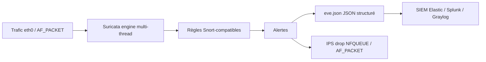

# 🛡️ Suricata — Défense & SIEM

> [!info] **En 1 phrase**
> Suricata est l'IDS/IPS **multi-thread** qui remplace Snort : mêmes règles (compatibles),
> mais plus rapide et capable d'analyse applicative en sortant des **fichiers JSON**
> (`eve.json`) directement exploitables par un SIEM.

---

## 🧾 Overview

| Champ | Valeur |
|---|---|
| Nom complet | Suricata |
| Description | Moteur IDS/IPS réseau multi-thread, compatible règles Snort, avec inspection de protocoles et sortie JSON (eve.json) |
| Catégorie | 🛡️ IDS / SIEM / EDR |
| Sous-catégorie | NIDS / NIPS / Signature-based detection + protocol inspection |
| Fonction principale | Détecter (alert), bloquer (drop) et journaliser le trafic réseau avec des règles et une analyse applicative |
| Type d'outil | Daemon réseau + CLI (suricata, suricata-update) |
| Licence | GPLv2 (moteur) ; règles ET Open GPL, ET Pro commercial |
| Open source / propriétaire | Open source (OISF) ; règles commerciales optionnelles |
| Langage(s) de programmation | C, Rust (nouveaux composants réseau), Python (suricata-update) |
| Développeur / organisation | OISF (Open Information Security Foundation) |
| Projet officiel | Suricata |
| Dépôt officiel | https://github.com/OISF/suricata |
| Documentation officielle | https://docs.suricata.io |
| Date de création | 2010 (première release 1.0 en 2012) |
| État du projet | actif (Suricata 8.0.6 courante ; série 7.0.x EOL) |
| Dernière version connue | 8.0.6 (suricata-update 1.3.8) |
| Systèmes compatibles | Linux (x86_64, aarch64), Windows, macOS, BSD ; captures AF_PACKET/NFQUEUE/nfqueue, netmap, pcap |

> [!note] Pour vérifier / compléter
> Suricata 8.0 remplace la série 7.x (EOL). La config reste un YAML `/etc/suricata/suricata.yaml` ; la sortie principale reste `eve.json`. Vérifier les changements dans les release notes officielles avant migration depuis une 6.x/7.x.

---

## 🎯 Concept

Suricata est un moteur IDS/IPS **multi-threadé** (contrairement à Snort, historiquement mono-thread) qui exploite tous les cœurs CPU : il tient plus de trafic sur le même matériel. Il accepte les règles **au format Snort** mais apporte en plus une inspection de protocoles (HTTP, TLS, DNS, SMB, SSH...) et une sortie **JSON structurée** (`eve.json`) consommable par les SIEM (Elastic, Splunk, Graylog). En mode **IPS**, il s'interface au kernel via **AF_PACKET** (inline) ou **NFQUEUE** (iptables) pour réellement bloquer. Moins médiatisé que Snort, il est pourtant devenu le standard des appliances modernes (Security Onion, pfSense, Wazuh, distributions de détection).

`eve.json` contient les alertes mais aussi les **métadonnées de session** (requêtes HTTP, SNI TLS, requêtes DNS, fichiers extraits) : c'est ce qui en fait un atout pour le SOC au-delà de la simple détection par signatures. Le mot-clé `alert` génère l'alerte, `drop` la bloque (mode IPS), `pass` l'ignore. La validation des règles et de la config se fait avec `suricata -T`, indispensable avant tout déploiement en IPS.



---

## 🧠 Concepts fondamentaux

| Concept | Explication |
|---|---|
| eve.json | Fichier JSON par événement : alertes, dns, http, tls, flow, netflow, fileinfo, stats |
| Worker / auto | Threads de traitement : `auto` calcule le nombre optimal de workers selon les cœurs |
| AF_PACKET | Capture native Linux (inline IPS possible) avec ring buffer |
| NFQUEUE | File de files iptables : trafic renvoyé au userspace pour décision (IPS) |
| Suricata-update | Gestionnaire de règles (ET Open par défaut), sources configurables |
| ET Open / ET Pro | Règles Emerging Threats : Open = gratuites, Pro = commerciales (plus de couverture) |
| Rule keywords | `content`, `pcre`, `flow`, `dns.query`, `http.uri`, `tls.sni`, `app-layer-protocol` |
| Rule action | `alert`, `drop` (IPS), `pass`, `reject`, `file` (extraction) |
| App-layer parser | Décodeurs applicatifs : HTTP/1.x, DNS, TLS, SMB, SSH, SMTP, Modbus, DNP3... |
| File extraction | Extraction des fichiers transférés (`file-store`) vers `/var/lib/suricata/files` |
| `-T` | Test de configuration et des règles sans lancer l'écoute |
| `tcpreplay` | Rejeu de pcaps contre un capteur pour tester les règles hors-ligne |

---

## 🛠️ Installation

### Debian / Ubuntu / Kali Linux

```bash
sudo apt update && sudo apt install -y suricata
sudo suricata-update                 # télécharge les règles (ET Open + nouvelles)
sudo systemctl enable --now suricata
# Vérifier la config et les règles
sudo suricata -T -c /etc/suricata/suricata.yaml
```

### Dernière version (PPA/paquets officiels)

```bash
# Ubuntu : PPA OISF pour des versions plus récentes que les dépôts Debian
sudo add-apt-repository ppa:oisf/suricata-stable
sudo apt update && sudo apt install -y suricata
```

### Fedora / RHEL

```bash
sudo dnf install -y suricata
sudo suricata-update
```

### Docker

```bash
docker run -it --net=host --cap-add=NET_ADMIN --cap-add=SYS_MODULE \
  -v /var/log/suricata:/var/log/suricata jasonish/suricata:latest
```

### Compilation depuis les sources

```bash
git clone https://github.com/OISF/suricata.git && cd suricata
# Dépendances : libpcap, libpcre2, libyaml, zlib, jansson, libhtp...
./autogen.sh && ./configure --enable-af-packet --enable-nfqueue && make -j$(nproc) && sudo make install
```

> [!warning] ⚠️ Prérequis & problèmes potentiels
> - Le paquet Debian officiel peut être plus ancien que la 8.x : utiliser le PPA OISF pour les dernières versions.
> - La capture AF_PACKET nécessite des privilèges root ; en IPS, `iptables`/`nfqueue` ou interfaces en inline.
> - `suricata-update` doit être exécuté après l'installation pour avoir des règles : sans règles, aucun alert.
> - Sur lien rapide, dimensionner le `ring-size` AF_PACKET pour éviter les drops de paquets.

---

## ⚙️ Configuration

| Paramètre | Rôle | Valeur possible | Impact | Exemple |
|---|---|---|---|---|
| `HOME_NET` | Réseaux à surveiller | liste CIDR | Notion interne/externe des règles | `HOME_NET: [10.10.20.0/24]` |
| `EXTERNAL_NET` | Réseau externe | `!$HOME_NET`, `any` | Cible des règles | `EXTERNAL_NET: "!$HOME_NET"` |
| `af-packet.interface` | Interface de capture | `eth0` | Capteur IDS/IPS | `- interface: eth0` |
| `af-packet.ring-size` | Taille du ring buffer | entier (2048, 4096...) | Réduit les drops sous charge | `ring-size: 4096` |
| `eve-log` | Sortie JSON | fichier/type | Journaux structurés pour SIEM | `- eve-log: enabled: yes, types: [alert, dns, http]` |
| `fast.log` / `stats.log` | Logs texte/statistiques | activé/désactivé | Lisibilité et monitoring | `stats.enabled: yes` |
| `default-rule-path` | Dossier des règles | `/etc/suricata/rules` | Où charger les `.rules` | `default-rule-path: /etc/suricata/rules` |
| `rule-files` | Fichiers de règles chargés | liste | Règles actives | `rule-files: [suricata.rules, local.rules]` |
| `threading.cpu-affinity` | Affinité des workers | liste de cœurs | Performance multi-cœur | `- cpu: [0,1,2,3]` |
| `app-layer.protocols.*` | Parser applicatif (enable/disable) | `enabled: yes` | Coût CPU vs couverture | `dns.enabled: yes` |
| `file-store` | Extraction de fichiers | `enabled: yes` | Écriture des fichiers transférés | `- file-store: enabled: yes` |

> [!note] À vérifier
> La config complète (hundreds de paramètres) est documentée dans la doc officielle ; le `suricata.yaml` d'exemple est installé avec le paquet. Utiliser `suricata -T` après chaque modification.

---

## 🏗️ Architecture interne

Composants et flux à l'exécution :

- **Capture** : sources multi-threadées — AF_PACKET (Linux, ring buffer), NFQUEUE (inline via iptables), netmap, pcap (offline `-r`). Chaque **worker** capture/analyse en parallèle (les flux sont répartis par hash, RSS 4-tuple).
- **Décodeurs** : Ethernet, VLAN, IP, TCP/UDP/ICMP, tunnels (GRE, Teredo, VXLAN) — normalisation avant analyse.
- **Moteur de règles** : les règles (syntaxe Snort) sont compilées en groupes, les `content` optimisés (multi-pattern) ; l'évaluation se fait en 2 passes (meta-options puis payload).
- **App-layer parsers** : décodage de HTTP/1.x, DNS, TLS, SMB, SSH, SMTP, Modbus... exposant des mots-clés de règles (`http.uri`, `dns.query`, `tls.sni`) et alimentant les logs structurés.
- **eve-log / outputs** : événements JSON (alert, dns, http, tls, flow, fileinfo, stats) écrits en continu ; `fast.log` texte, `stats.log` périodique (drops, mémoire).
- **Fillets / règles** : sur charge, répartition par flux entre workers ; les règles `alert/drop` s'appliquent au paquet ou au flux (stateful).
- **Suricata-update** : télécharge, fusionne et installe les règles dans `default-rule-path`.

Flux type : paquet entrant → capture AF_PACKET → décodeurs → parsers applicatifs → évaluation des règles → action `alert`/`drop` → événement JSON `eve.json` → Filebeat/SIEM ; en IPS, le paquet `drop` est rejeté via NFQUEUE/AF_PACKET inline.

---

## ⌨️ Commandes

### Commandes principales

```bash
suricata -c /etc/suricata/suricata.yaml -i eth0           # IDS en avant-plan
suricata -c /etc/suricata/suricata.yaml -i eth0 -D        # démon IDS
suricata -r capture.pcap -l /var/log/suricata             # analyse hors-ligne
suricata -T -c /etc/suricata/suricata.yaml                # test config + règles
suricata-update update                                    # met à jour les règles
suricata-update update-list                               # liste des sources de règles
```

| Commande | Objectif | Résultat attendu |
|---|---|---|
| `suricata -T` | Teste config et règles | Aucune erreur, exit code 0 |
| `suricata -i eth0` | IDS sur une interface | Alerts dans eve.json |
| `suricata -r <pcap>` | Mode offline | Analyse d'une capture |
| `suricata -q 0` | IPS via NFQUEUE (queue 0) | Décisions drop appliquées |
| `suricata-update update` | MAJ des règles | Règles à jour dans le rule-path |
| `suricata -V` | Version | Version + features compilées |

### Commandes avancées

```bash
# Lancer en IDS avec un jeu de règles spécifique
suricata -c /etc/suricata/suricata.yaml -i eth0 -S /etc/suricata/rules/local.rules

# IPS inline AF_PACKET (deux interfaces)
suricata -c /etc/suricata/suricata.yaml --af-packet=eth0:eth1 -D

# Afficher les stats en direct depuis eve.json
tail -f /var/log/suricata/eve.json | jq 'select(.event_type=="stats") | .stats'
```

---

## 🎚️ Options et flags

| Option | Description | Exemple | Niveau |
|---|---|---|---|
| `-c <yaml>` | Fichier de configuration | `-c /etc/suricata/suricata.yaml` | Basic |
| `-i <iface>` | Interface à surveiller | `-i eth0` | Basic |
| `-D` | Mode démon | `-D` | Basic |
| `-r <pcap>` | Analyse d'un fichier pcap | `-r capture.pcap` | Basic |
| `-T` | Test de configuration | `-T` | Basic |
| `-l <dir>` | Dossier de logs | `-l /var/log/suricata` | Basic |
| `-S <rules>` | Jeu de règles spécifique | `-S local.rules` | Intermediate |
| `-q <queue>` | Mode NFQUEUE (IPS) | `-q 0` | Advanced |
| `--af-packet=<i1:i2>` | IPS inline AF_PACKET | `--af-packet=eth0:eth1` | Advanced |
| `-k none` | Désactive la validation checksum | `-k none` | Intermediate |
| `--set <k=v>` | Surcharge YAML en CLI | `--set HOME_NET=10.10.20.0/24` | Expert |
| `--runmode auto` | Mode de threading | `--runmode auto` | Advanced |

> [!tip] Options les plus utiles au quotidien
> `-T` avant tout déploiement, `-r` pour tester sur pcap, `-i eth0 -D` en production IDS, `suricata-update update` pour la fraîcheur des règles, et `jq` sur `eve.json` pour l'exploitation.

---

## 🧪 Exemples pratiques

### Beginner

```bash
# Objectif : lancer Suricata en IDS et vérifier les alertes
sudo suricata -c /etc/suricata/suricata.yaml -i eth0 -D
# Déclencher un ping depuis une autre machine
ping -c 1 10.10.20.15
# Lire les alertes
tail -f /var/log/suricata/eve.json | jq 'select(.event_type=="alert") | .alert.signature'
```

### Intermediate

```bash
# Objectif : analyser un pcap hors-ligne et compter les alertes
sudo suricata -r capture.pcap -l /var/log/suricata
jq 'select(.event_type=="alert") | .alert.signature' /var/log/suricata/eve.json | sort | uniq -c | sort -rn
```

---

## 🧪 Workflow complet (scénario pas à pas)

1. **Configurer** `/etc/suricata/suricata.yaml` : définir `HOME_NET` (`10.10.20.0/24`) et vérifier la sortie `eve-log` (activée par défaut sur `/var/log/suricata/eve.json`).
2. **Mettre à jour les règles** : `sudo suricata-update` puis `sudo systemctl restart suricata`.
3. **Lancer en IDS** : `sudo suricata -c /etc/suricata/suricata.yaml -i eth0 -D`.
4. **Déclencher une alerte** : `ping -c 1 8.8.8.8` (règle ICMP echo) ou `curl http://example.com` depuis un hôte externe.
5. **Lire l'alerte** :
   ```bash
   tail -f /var/log/suricata/eve.json | jq 'select(.event_type=="alert") | {sig:.alert.signature, src:.src_ip, dst:.dst_ip}'
   ```
6. **Passer en IPS (blocage)** : activer `af-packet` en mode inline dans le yaml, ou router via NFQUEUE : `iptables -I FORWARD -j NFQUEUE` puis `suricata -q 0 -c /etc/suricata/suricata.yaml`.

---

## 🎬 Scénarios avancés

### Scénario 1 : détection d'exfiltration DNS avec règle maison

```text
# /etc/suricata/rules/local.rules
alert dns any any -> $HOME_NET any (msg:"Possible DNS exfil - long label";
  dns.query; content:"exfil"; nocase; sid:1000001; rev:1;)
```

```bash
# Recharger et vérifier
suricata -T -c /etc/suricata/suricata.yaml
sudo systemctl restart suricata
tail -f /var/log/suricata/eve.json | jq 'select(.dns != null) | .dns'
```

### Scénario 2 : déploiement IPS en NFQUEUE avec exclusion du trafic admin

```bash
# Ne router vers Suricata que le trafic FORWARD (et non le trafic local)
iptables -A FORWARD -j NFQUEUE --queue-num 0
# Ajouter une règle d'exclusion avant pour ne jamais se couper l'accès
iptables -I FORWARD 1 -s 10.10.20.0/24 -d 10.10.20.0/24 -j ACCEPT
suricata -q 0 -c /etc/suricata/suricata.yaml -D
```

### Scénario 3 : chasse de C2 dans eve.json (HTTP + TLS)

```bash
# Rechercher les connexions HTTP sortantes vers domaines inconnus
jq 'select(.event_type=="http" and .http.hostname != null)
   | {ts:.timestamp, host:.http.hostname, url:.http.url, src:.src_ip}' \
   /var/log/suricata/eve.json | grep -vi example.com

# Corréler avec le SNI TLS
jq 'select(.event_type=="tls" and .tls.sni != null) | .tls.sni' \
   /var/log/suricata/eve.json | sort | uniq -c | sort -rn | head
```

### Scénario 4 : extraction de fichiers transférés (malware)

```bash
# Config yaml : file-store enabled + file log eve-log
# Les fichiers extraits arrivent dans /var/lib/suricata/files
find /var/lib/suricata/files -type f -newer /var/lib/suricata/files/.last_tmp 2>/dev/null
# Les métadonnées sont dans eve.json (event_type "fileinfo")
jq 'select(.event_type=="fileinfo") | {sha256:.fileinfo.sha256, size:.fileinfo.size}' \
   /var/log/suricata/eve.json | head
```

---

## 🛡️ Cybersecurity use cases

| Phase | Utilisation |
|---|---|
| Détection réseau | Règles ET/Talos-compatibles : exploits, C2, scans, malware |
| Prévention (IPS) | Mode inline AF_PACKET/NFQUEUE : blocage des flux droppés |
| Analyse de capture | `-r` sur pcaps d'incident pour dater/rejouer une attaque |
| Threat hunting | Chasse sur eve.json (HTTP, TLS SNI, DNS, netflow) |
| Extraction forensique | Récupération des fichiers transférés (file-store) |
| SOC / SIEM | eve.json envoyé à Elastic/Graylog/Splunk pour corrélation |

---

## 🎯 MITRE ATT&CK

| Tactique | Technique / Sub-technique | ID | Raison | Détection | Mitigation |
|---|---|---|---|---|---|
| Reconnaissance | Network Service Discovery | T1046 | Scans de ports détectés (règles ET + état de flux) | Règles portscan, netflow | Limiter l'exposition |
| Initial Access | Exploit Public-Facing Application | T1190 | Exploits HTTP/SMB détectés par signatures | Règles app-layer HTTP/SMB | Patching, WAF |
| Command and Control | Application Layer Protocol: DNS | T1071.004 | C2 DNS (tunneling, DGA) | Règles `dns.query` + corrélation | Filter DNS, sinkhole |
| Command and Control | Application Layer Protocol: Web Protocols | T1071.001 | Beaconing HTTP/HTTPS | eve.json http/tls + régularité | Egress filtering |
| Exfiltration | Exfiltration Over Web Service | T1567 | Uploads vers services web | Règles http + volume sortant | DLP, quotas |
| Defense Evasion | Protocol Tunneling | T1572 | Tunnels ICMP/DNS/SSH | Règles + heuristiques de volume | Restreindre les protocoles |

> [!note] Ne renseigner que si l'association est réellement pertinente.
> Suricata est un capteur **réseau** : les comportements hôtes (processus, registre) nécessitent une couche endpoint (osquery, Wazuh, EDR).

---

## 🛡️ Defensive Security

### Signes observables

| Indicateur | Détail |
|---|---|
| Drops de paquets (stats) | `suricata.stats` : saturation → augmenter ring-size/workers |
| Trafic chiffré sans SNI / IP brute | Logging tls + empreinte JA3/JA4, blocage des certs inconnus |
| Évasions par fragmentation TCP/IP | `defrag`, validation checksums (`-k all`) |
| DNS vers domaines DGA/récents | Règles `dns.query`, corrélation avec algorithmes DGA |
| Règles obsolètes (faux négatifs) | Tester avec `tcpreplay` des pcaps d'attaque connus |

### Règles de détection (Sigma / Suricata / Snort / YARA)

```yaml
# Sigma — trafic DNS vers domaine récent (data Suricata eve.json)
title: Suspicious DNS Query to Recently Registered Domain
id: e1f2a3b4-5c6d-4e7f-8a9b-0c1d2e3f4a5b
status: experimental
logsource:
    category: dns
    product: suricata
detection:
    selection:
        dns.query|endswith: [".xyz", ".top", ".click"]
    condition: selection
falsepositives:
    - Domaines légitimes récents (startups, services)
level: medium
```

```text
# Règle Suricata — reverse shell sortant (à adapter)
alert tcp $HOME_NET any -> $EXTERNAL_NET 4444 (msg:"Possible reverse shell"; flow:established;
  sid:1000003; rev:1;)
```

---

## 🤖 Automatisation

```bash
# Bash — surveillance des drops de paquets (santé du capteur)
tail -f /var/log/suricata/eve.json | jq -r 'select(.event_type=="stats") | "\(.timestamp) drops=\(.stats.capture.kernel_packets - .stats.capture.kernel_drops)"'
```

```python
# Python — parser eve.json et extraire les alertes du jour
import json

with open("/var/log/suricata/eve.json") as f:
    for line in f:
        try:
            ev = json.loads(line)
        except json.JSONDecodeError:
            continue
        if ev.get("event_type") == "alert":
            a = ev["alert"]
            print(ev["timestamp"], ev["src_ip"], "->", ev["dst_ip"], a.get("signature"))
```

```bash
# Bash — rotation et purge des logs eve.json (journald-like)
logrotate -f /etc/logrotate.d/suricata
```

---

## 📤 Output et parsing

`eve.json` est un fichier NDJSON (Newline-Delimited JSON) : **une ligne = un événement** avec `timestamp`, `event_type`, `src_ip`, `dst_ip`, `src_port`, `dst_port`, `proto`, plus le contenu propre au type (`alert`, `dns`, `http`, `tls`, `flow`, `fileinfo`, `stats`).

```bash
# Compter les alertes par gravité
jq -r 'select(.event_type=="alert") | .alert.severity' /var/log/suricata/eve.json \
  | sort | uniq -c | sort -rn

# Extraire les requêtes DNS exotiques
jq -r 'select(.event_type=="dns") | .dns.rrname' /var/log/suricata/eve.json \
  | sort | uniq -c | sort -rn | head -20
```

```python
# Python — statistiques par destination
import json, collections

c = collections.Counter()
with open("/var/log/suricata/eve.json") as f:
    for line in f:
        ev = json.loads(line)
        if ev.get("event_type") == "alert":
            c[(ev["dst_ip"], ev["dst_port"])] += 1
print(c.most_common(10))
```

---

## 🔗 Intégrations

```text
Suricata → eve.json → Filebeat → Elastic (logs-suricata.eve-*) / Graylog / Splunk
Suricata (IPS) → NFQUEUE/iptables → blocage
Suricata + Zeek → métadonnées et alertes complémentaires
Suricata → suricata-update (ET Open) + règles maison
```

- [[Tools|🧰 Outils]]
- [[Outil - Snort]] — moteur historique, mêmes règles, mono-thread
- [[Outil - Zeek]] — métadonnées réseau complémentaires aux alertes
- [[Outil - Elastic]] — eve.json ingéré et corrélé (module Suricata de Filebeat)
- [[Outil - Graylog]] — centralisation des événements Suricata
- [[Outil - Splunk]] — ingestion eve.json et corrélation SPL
- [[Outil - osquery]] — investigation hôte déclenchée par une alerte réseau
- [[Outil - Wazuh]] — XDR hôte couplé au capteur réseau
- [[Outil - Sigma]] — règles converties pour les backends Suricata/Snort

---

## 🔄 Alternatives

| Outil | Avantages | Inconvénients | Cas d'usage |
|---|---|---|---|
| Snort | Écosystème historique, règles Talos | Mono-thread, moins de métadonnées | Détection signature simple |
| Zeek | Métadonnées riches, pas de signatures | Ne bloque pas | Complément à un IDS |
| Falco | Détection runtime (conteneurs/hôtes) | Pas de couche réseau | Cloud/K8s |
| Suricata 7 vs 8 | 8.0 plus rapide, Rust, maintenance | Migration depuis 7.x à planifier | NIDS moderne |
| NIDS commercial | Gestion intégrée, updates | Coût, fermé | Entreprise |

> **Quand utiliser Snort plutôt que Suricata ?** Si l'équipe maîtrise l'écosystème Snort (Talos, Barnyard2) et que le trafic reste modéré. Pour de gros liens, du multi-threading et des métadonnées structurées (`eve.json`), Suricata est le choix actuel.

---

## ⚡ Performance

- **Multi-threading natif** : un worker par cœur ; aligner `cpu-affinity` et le nombre de workers sur la charge (RSS/`auto`).
- AF_PACKET avec **ring-size** adapté (2048-4096) réduit les drops de paquets sous charge.
- Les parsers applicatifs coûtent en CPU : n'activer que les protocoles présents sur la zone.
- En IPS NFQUEUE, la latence ajoutée est plus élevée qu'en AF_PACKET inline (allers-retours userspace).
- `eve.json` génère beaucoup de volume (tous les événements) : prévoir stockage/ingestion SIEM ; filtrer les types inutiles.
- Le **`-T`** et des pcaps de référence permettent de benchmarker avant mise en production.

> [!note] À vérifier
> Les débits soutenus (multi-Gbps) dépendent du matériel, des règles et des parsers : benchmarker avec `--runmode auto` et mesurer les drops dans `stats`.

---

## 🛠️ Troubleshooting

### Common problems

#### Problème : `suricata -T` retourne une erreur de règle

- **Cause** : mot-clé inconnu, `sid` dupliqué, ou syntaxe d'option non supportée.
- **Solution** : corriger la règle, vérifier `sid`/`rev` uniques, s'appuyer sur le message d'erreur (n° de ligne).
- **Vérification** : `suricata -T -c /etc/suricata/suricata.yaml`.

#### Problème : aucun trafic capturé / aucune alerte

- **Cause** : mauvaise interface (`-i`), `HOME_NET` incorrect, ou règles non chargées (rule-files vides).
- **Solution** : vérifier l'interface, les variables réseau et `suricata-update` ; tester avec `suricata -i eth0 -v`.
- **Vérification** : `jq 'select(.event_type=="flow")' eve.json` (le trafic est-il vu ?).

#### Problème : drops de paquets (saturation)

- **Cause** : ring buffer trop petit ou workers insuffisants.
- **Solution** : augmenter `af-packet.ring-size`, aligner `threading`, passer sur des interfaces RSS.
- **Vérification** : `jq 'select(.event_type=="stats") | .stats.capture' eve.json`.

#### Problème : le mode IPS ne bloque pas

- **Cause** : NFQUEUE non configuré (iptables), action `alert` au lieu de `drop`, ou `-q` absent.
- **Solution** : router le trafic (iptables FORWARD), passer les règles ciblées en `drop`, lancer avec `-q 0`.
- **Vérification** : `iptables -L -n` et une règle `drop` de test.

#### Problème : eve.json ne contient que des stats

- **Cause** : types d'événements désactivés dans `eve-log` ou log file incomplet.
- **Solution** : activer `types: [alert, dns, http, tls]` dans la config, redémarrer.
- **Vérification** : `grep -c '"event_type":"alert"' eve.json`.

---

## 🔐 Sécurité de l'outil

- **Privilèges** : Suricata tourne en root pour la capture, puis peut drop vers un utilisateur dédié (`--user`). Ne pas exposer les logs sans contrôle.
- **Config réseau** : en IPS, une règle `drop` mal ciblée coupe la production : déployer en `alert` d'abord, passer en `drop` progressivement, exclure le trafic d'administration.
- **Règles** : ne charger que des sources fiables (ET Open/Pro, règles maison auditées) ; une règle `drop` malveillante = DoS.
- **eve.json sensible** : contient payloads, requêtes, secrets éventuels — restreindre l'accès, chiffrer au repos, purger avec logrotate.
- **Exposition** : ne pas exposer les logs/API de gestion sur Internet ; SIEM en lecture seule.
- **Risque offensif** : un adversaire connaissant les signatures peut les contourner (évasion) — combiner avec les métadonnées et une couche hôte.

---

## ⚠️ Limitations

- **Signature-based** : détecte ce que les règles décrivent, pas les 0-day ni les évassions de signatures.
- **Trafic chiffré** : le TLS légitime n'est pas inspecté sans interception : une partie du C2 passe inaperçue.
- **Faux positifs** : règles larges et environnements bruyants exigent un tuning continu.
- **Pas de corrélation** : Suricata est un capteur ; la corrélation multi-événements est déléguée au SIEM.
- **Charge de gestion** : mise à jour des règles, dimensionnement, logs volumineux.
- **Migration 7.x → 8.x** : certaines options et le modèle de threads ont évolué : tester avant bascule.

---

## 📋 Cheatsheet

```bash
# Test config + règles
sudo suricata -T -c /etc/suricata/suricata.yaml

# IDS sur une interface (démon)
sudo suricata -c /etc/suricata/suricata.yaml -i eth0 -D

# Analyse hors-ligne
sudo suricata -r capture.pcap -l /var/log/suricata

# MAJ des règles
sudo suricata-update update

# IPS NFQUEUE (avec exclusion admin)
iptables -I FORWARD 1 -s 10.10.20.0/24 -d 10.10.20.0/24 -j ACCEPT
iptables -A FORWARD -j NFQUEUE --queue-num 0
sudo suricata -q 0 -c /etc/suricata/suricata.yaml -D

# Lire les alertes
tail -f /var/log/suricata/eve.json | jq 'select(.event_type=="alert") | .alert.signature'

# Top signatures
jq -r 'select(.event_type=="alert") | .alert.signature' /var/log/suricata/eve.json | sort | uniq -c | sort -rn | head

# Règle maison (local.rules)
# alert tcp $HOME_NET any -> $EXTERNAL_NET 4444 (msg:"Reverse shell"; flow:established; sid:1000003; rev:1;)
```

---

## ⚡ Quick reference

| | |
|---|---|
| **À quoi sert-il ?** | IDS/IPS réseau multi-thread : détection par signatures + métadonnées applicatives |
| **Quand l'utiliser ?** | Capteur sur lien rapide, analyse de pcaps, alimentation SIEM via eve.json |
| **Commande principale** | `sudo suricata -c /etc/suricata/suricata.yaml -i eth0 -D` |
| **Alternative principale** | Snort (mono-thread), Zeek (métadonnées) |
| **Concepts importants** | eve.json, AF_PACKET/NFQUEUE, workers, ET Open, file-store, suricata-update |
| **Liens associés** | [[Outil - Snort]] · [[Outil - Zeek]] · [[Outil - Elastic]] · [[Outil - Graylog]] |

---

## 🔍 Détection & Défense

| Signe | Défense |
|---|---|
| Trafic chiffré TLS complet (pas de SNI / IP brute) | Logging tls, empreintes JA3/JA4, blocage des certs inconnus |
| Évasions par fragmentation TCP/IP | `defrag`, checks (`-k all`), normalisation nfqueue |
| DNS vers domaines récents ou DGA | Règles `dns.query` + logging, corrélation DGA |
| Règles obsolètes ou trop permissives | `tcpreplay` de pcaps d'attaque, revue des sources de règles |
| Drops de paquets / capteur saturé | Augmenter ring-size/workers, surveiller `stats` |
| Capteur arrêté ou silencieux | Supervision du process et des logs eve.json |

---

## ⚠️ Tips & Pièges

> [!tip] 💡 **eve.json = langage SIEM universel**
> Écris les alertes en **JSON** (et non en syslog texte) : `jq`, `logstash`, `filebeat` et `splunk` les ingèrent tels quels. Un vrai pipeline de détection exploite la structure, pas des lignes de texte.

> [!tip] 💡 **Teste chaque règle sur un pcap**
> `suricata -r <pcap>` avec des captures d'attaque connues : valide la règle hors-ligne avant production, mesure les faux positifs.

> [!tip] 💡 **Exclut le trafic d'administration en IPS**
> NFQUEUE ne doit jamais inspecter le trafic qui te permet de t'administrer : règle ACCEPT en tête de FORWARD, sinon tu te coupes l'accès.

> [!warning] ⚠️ **Piège** : compatibilité ≠ identité.
> Une règle Snort s'exécute presque toujours sous Suricata, mais les **options avancées** (`flowbits`, `content` spécifiques) peuvent avoir des différences. Valide avec `suricata -T` et des pcaps de test avant migration.

> [!warning] ⚠️ **Piège** : sans règles à jour, aucun alert.
> `suricata-update` doit être lancé régulièrement : des règles obsolètes = faux négatifs massifs (nouveaux exploits).

> [!warning] ⚠️ **Piège** : eve.json est volumineux.
> Tous les types d'événements sont journalisés par défaut : désactive les types inutiles (`eve-log.types`) pour limiter le stockage et l'ingestion SIEM.

---

## 📚 References

### Official

- Site officiel : https://suricata.io
- Documentation : https://docs.suricata.io
- GitHub OISF : https://github.com/OISF/suricata
- suricata-update : https://github.com/OISF/suricata-update
- Format EVE JSON : https://docs.suricata.io/en/latest/output/eve/eve-json-format.html

### Security references

- MITRE ATT&CK T1046 — Network Service Discovery : https://attack.mitre.org/techniques/T1046/
- MITRE ATT&CK T1071.004 — DNS : https://attack.mitre.org/techniques/T1071/004/
- Emerging Threats (règles) : https://rules.emergingthreats.net

### Community

- Security Onion (distribution IDS/NSM) : https://securityonion.net
- Blog OISF : https://blog.suricata.io
- Liste de discussion : https://lists.openinfosecfoundation.org

---

➡️ **Liens :** [[Tools|🧰 Outils]] · [[Techniques/Reverse Shells|🕸️ Reverse Shells]] · [[Techniques/Pivoting et Tunneling|🌉 Pivoting / Tunneling]] · [[Techniques/LLMNR-NBT-NS Poisoning|📡 LLMNR/NBT-NS Poisoning]] · [[Outil - Snort]] · [[Outil - Zeek]] · [[Outil - Elastic]] · [[Outil - Graylog]] · [[Outil - Splunk]]
