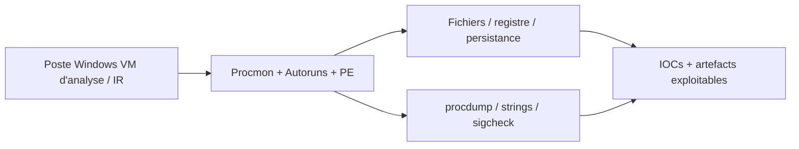
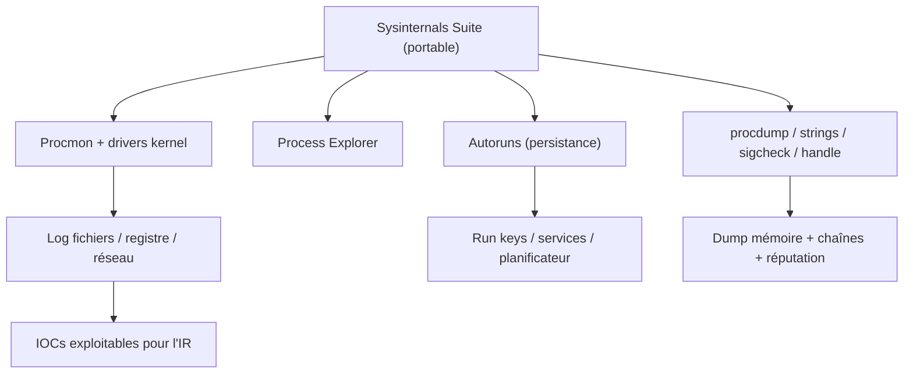

# Sysinternals Suite — Boîte à outils d'analyse système Windows

> [!info] **En 1 phrase**
> Sysinternals Suite regroupe les utilitaires Microsoft (Process Explorer, Procmon, Autoruns, strings, procdump, sigcheck…) qui permettent d'observer en temps réel processus, fichiers, registre et persistance sur Windows — l'équipement de base de toute analyse de malware.

---

## Overview

| Champ | Valeur |
|---|---|
| Nom complet | Sysinternals Suite |
| Description | Collection d'utilitaires système Windows signés Microsoft : observation en temps réel (Procmon, Process Explorer), persistance (Autoruns), mémoire (procdump), chaînes (strings), signatures (sigcheck), connexions (tcpview) et exécution distante (psexec) |
| Catégorie | Malware & Sandbox |
| Sous-catégorie | Analyse dynamique — boîte à outils système Windows |
| Fonction principale | Observer, journaliser et contrôler le système Windows pendant l'analyse de malware ou une réponse à incident |
| Type d'outil | Suite de binaires portables (GUI + CLI) |
| Licence | Licence Microsoft (freeware, binaires signés Microsoft) |
| Open source / propriétaire | Propriétaire mais gratuit (binaires signés) |
| Langage(s) de programmation | C (outils natifs Windows) |
| Développeur / organisation | Mark Russinovich (originel), maintenant édité par Microsoft |
| Projet officiel | Sysinternals (Microsoft Learn) |
| Dépôt officiel | (pas de source publique ; distribution via Microsoft) |
| Documentation officielle | https://learn.microsoft.com/en-us/sysinternals/ |
| Date de création | 1996 (site original Sysinternals de Mark Russinovich) |
| État du projet | actif (mises à jour régulières) |
| Dernière version connue | Suite mise à jour le 2026-07-09 |
| Systèmes compatibles | Windows (client et serveur) ; outils 32 et 64 bits |

> [!note] À vérifier
> La date exacte de la dernière mise à jour se confirme sur la page Microsoft Learn « Sysinternals Suite ». La suite se télécharge sur `https://download.sysinternals.com/files/SysinternalsSuite.zip` ou via winget (`winget install Microsoft.Sysinternals.Suite`).

---

## Concept

La suite Sysinternals est un ensemble d'outils signés Microsoft, gratuits, qui donnent une visibilité kernel sur un système Windows : **Process Explorer** remplace le gestionnaire de tâches (arbres de processus, DLL, handles), **Process Monitor (Procmon)** journalise chaque accès fichier/registre/réseau/processus avec pile d'appels, **Autoruns** liste toutes les persistances (Run, services, planificateur, drivers), et des utilitaires CLI comme `strings`, `sigcheck`, `procdump`, `handle`, `pslist`, `pskill`, `psexec` ou `tcpview` couvrent le triage rapide.

Elle se place dans l'analyse dynamique de malware sur un poste d'analyse (typiquement une VM de travail type **Flare VM**) : pour observer ce que fait un échantillon en temps réel (Procmon), identifier sa persistance (Autoruns), dumper sa mémoire (procdump) ou vérifier sa signature et ses chaînes (sigcheck/strings). C'est aussi la première boîte à outils d'un **incident responder** sur un poste compromis : chaque outil a un équivalent CLI pilotable par script. Depuis PowerShell, l'ensemble se récupère en un seul zip portable.



---

## Concepts fondamentaux

| Concept | Explication |
|---|---|
| Process Explorer | Gestionnaire de processus avancé : arbre, DLL, handles, signature des processus |
| Process Monitor (Procmon) | Journalise chaque opération fichier/registre/réseau/processus avec pile d'appels et résultat |
| Autoruns | Inventaire complet des points de persistance : Run, services, planificateur, drivers, modules |
| procdump | Dump mémoire d'un processus (sur demande ou au crash) pour analyse Volatility |
| strings | Extraction des chaînes ASCII/Unicode d'un binaire ou dump |
| sigcheck | Vérification de la signature Authenticode et de la réputation VirusTotal |
| handle / Handle.exe | Liste les handles ouverts (fichiers, clés, threads) d'un processus |
| psexec | Exécution de commandes à distance avec privilèges (souvent abusé par les attaquants) |
| tcpview / tcpvcon | Visualisation des connexions TCP/UDP et des processus propriétaires |
| accesschk | Audit des permissions NTFS/registre d'un utilisateur ou groupe |
| LiveKD / dump kernel | Analyse de la mémoire kernel (drivers, rootkits) |
| `-accepteula` | Flag qui accepte la licence pour l'automatisation sans invite |

---

## Installation

Téléchargement portable (aucune installation) :

```powershell
# Depuis PowerShell, récupérer la suite et la décompresser
Invoke-WebRequest -Uri "https://download.sysinternals.com/files/SysinternalsSuite.zip" -OutFile SysinternalsSuite.zip
Expand-Archive -Path SysinternalsSuite.zip -DestinationPath C:\Tools\Sysinternals
# Première exécution : accepter la licence une fois (ou utiliser -accepteula)
```

Certains outils (Autoruns, Procmon) nécessitent des droits administrateur.

> [!warning] Prérequis & problèmes potentiels
> - **Administrateur** : Autoruns, Procmon, procdump `-ma` et la plupart des outils kernel exigent des droits admin.
> - **Signature** : vérifier que les binaires sont bien signés Microsoft (sigcheck) après téléchargement.
> - **winget** : la suite s'installe aussi via `winget install Microsoft.Sysinternals.Suite`.
> - **EDR** : ces binaires légitimes sont souvent ignorés par les EDR ; restreindre leur usage sur les postes de production.

---

## Configuration

La suite est utilisable sans configuration globale ; chaque outil prend ses options en arguments :

| Outil | Paramètre | Rôle | Exemple |
|---|---|---|---|
| procmon | `/BackingFile <fichier>` | Journal PML de sortie | `procmon.exe /BackingFile C:\logs\proc.pml` |
| procmon | `/Quiet /Minimized` | Démarrage sans interface | `procmon.exe /Quiet /Minimized` |
| procmon | `/LoadConfig <fichier>` | Charger des filtres sauvegardés | `procmon.exe /LoadConfig filtres.pmc` |
| autorunsc | `-a *` | Toutes les catégories de persistance | `autorunsc64.exe -a *` |
| autorunsc | `-c -h` | Sortie CSV avec en-têtes | `autorunsc64.exe -a * -c -h` |
| autorunsc | `-vt` | Vérification VirusTotal | `autorunsc64.exe -a * -vt` |
| procdump | `-ma -e -w <proc>` | Dump complet au crash du processus | `procdump64.exe -ma -e -w sample.exe` |
| sigcheck | `-v -u` | Réputation VirusTotal | `sigcheck64.exe -v -u malware.exe` |

> [!note] À vérifier
> Les options peuvent varier légèrement entre versions ; chaque outil expose `-?` ou `/help` pour la liste exacte des paramètres.

---

## Architecture interne

- **Drivers kernel** : certains outils (Procmon, Autoruns) installent temporairement des drivers pour observer les appels système en profondeur.
- **Process Explorer** : exploite l'API Windows et les informations kernel pour l'arbre de processus et les handles.
- **Procmon** : journalise via les filtres kernel (fichier/registre/réseau/processus) et enrichit avec les piles d'appels.
- **Autoruns** : lit les points de persistance du registre, du système de fichiers et du planificateur.
- **procdump** : utilise les APIs de debug Windows (MiniDumpWriteDump) pour l'extraction mémoire.
- **psexec** : installe un service Windows temporaire sur la machine cible pour l'exécution distante.



---

## Commandes

### Commandes principales

```powershell
procmon.exe /AcceptEula /Quiet /Minimized /BackingFile C:\logs\proc.pml
autorunsc64.exe -a * -c -h > autoruns.csv
procdump64.exe -ma -e -w notepad.exe dump.dmp
strings64.exe -accepteula -n 8 malware.bin
sigcheck64.exe -accepteula -v -u malware.exe
handle64.exe -accepteula
pslist64.exe -accepteula -x          # arborescence des processus
tcpvcon.exe -accepteula -a -c        # connexions TCP/UDP en CSV
psloggedon.exe -accepteula           # sessions ouvertes sur le réseau
psexec64.exe -accepteula -s cmd.exe  # exécution en tant que SYSTEM
accesschk64.exe -accepteula -uwcqv "Authenticated Users" C:\Windows\System32
```

| Option | Effet |
|---|---|
| `procmon /BackingFile <fichier>` | Enregistre les événements dans un fichier PML |
| `procmon /Quiet` | Démarre sans interface |
| `autorunsc -a *` | Liste toutes les catégories de persistance |
| `autorunsc -c` | Sortie CSV exploitable |
| `procdump -ma -e -w <proc>` | Dump mémoire complet du processus (déclenché au crash) |
| `strings -n <longueur>` | Affiche les chaînes ASCII/Unicode de longueur ≥ n |
| `sigcheck -v -u` | Vérifie la signature et la réputation VirusTotal |
| `handle <chaine>` | Liste les handles ouverts contenant une chaîne |
| `pslist -x` | Liste des processus avec leurs threads |
| `psexec -s` | Exécute une commande en tant que SYSTEM à distance |
| `accesschk -u` | Vérifie les permissions NTFS/registre d'un utilisateur |
| `psloggedon` | Liste les sessions utilisateur sur le réseau |

### Commandes avancées

```powershell
# Dump au crash d'un malware instable
procdump64.exe -ma -e -w -r sample.exe dump.dmp
# Autoruns complet avec réputation VirusTotal
autorunsc64.exe -a * -c -h -vt > autoruns_ir.csv
# Vérification de signature d'un binaire suspect
sigcheck64.exe -accepteula -v -u "C:\ProgramData\svchost.exe"
```

---

## Options et flags

| Outil | Option | Description | Exemple | Niveau |
|---|---|---|---|---|
| procmon | `/BackingFile` | Fichier journal | `procmon.exe /BackingFile p.pml` | Basic |
| procmon | `/Quiet /Minimized` | Sans interface | `procmon.exe /Quiet /Minimized` | Basic |
| procmon | `/LoadConfig` | Filtres sauvegardés | `procmon.exe /LoadConfig f.pmc` | Intermediate |
| autorunsc | `-a *` | Toutes les catégories | `autorunsc64.exe -a *` | Basic |
| autorunsc | `-c -h` | CSV avec en-têtes | `autorunsc64.exe -a * -c -h` | Intermediate |
| autorunsc | `-vt` | Réputation VirusTotal | `autorunsc64.exe -a * -vt` | Advanced |
| procdump | `-ma -e -w` | Dump complet au crash | `procdump64.exe -ma -e -w s.exe` | Intermediate |
| procdump | `-r` | Enveloppe (reste en place) | `procdump64.exe -ma -e -w -r s.exe` | Advanced |
| strings | `-n <n>` | Longueur minimale | `strings64.exe -n 8 s.exe` | Basic |
| sigcheck | `-v -u` | Réputation VirusTotal | `sigcheck64.exe -v -u s.exe` | Intermediate |
| tcpvcon | `-a -c` | Toutes connexions en CSV | `tcpvcon.exe -a -c` | Intermediate |
| psexec | `-s` | En tant que SYSTEM | `psexec64.exe -s cmd.exe` | Expert |

> [!tip] Options les plus utiles au quotidien
> `-accepteula` (automatisation), `procmon /BackingFile` + filtres, `autorunsc -a * -c -h -vt`, `procdump -ma -e -w`, `sigcheck -v -u`, `strings -n 8`.

---

## Exemples pratiques

### Beginner

```powershell
# 1. Lister les processus avec leurs threads
pslist64.exe -accepteula -x
# 2. Vérifier la signature d'un binaire suspect
sigcheck64.exe -accepteula -v -u suspect.exe
# 3. Extraire les chaînes d'un binaire
strings64.exe -accepteula -n 8 suspect.exe > strings.txt
```

### Intermediate

```powershell
# Capturer le comportement d'un échantillon avec Procmon
procmon.exe /AcceptEula /Quiet /BackingFile C:\logs\proc.pml
# ... lancer l'échantillon, puis arrêter la capture et analyser le PML
# Lister les connexions réseau
tcpvcon.exe -accepteula -a -c > connexions.csv
```

### Advanced

```powershell
# Persistance complète + réputation
autorunsc64.exe -accepteula -a * -c -h -vt > autoruns.csv
# Dump au crash
procdump64.exe -ma -e -w sample.exe dump.dmp
# Analyser le dump avec Volatility
python3 vol.py -f dump.dmp windows.pslist
```

### Expert

```powershell
# Audit des permissions d'un dossier avec accesschk
accesschk64.exe -accepteula -uwcqv "Authenticated Users" C:\Windows\System32
# Exécution distante en SYSTEM pour le nettoyage
psexec64.exe -accepteula -s \\10.10.20.15 cmd.exe
```

---

## Workflow complet (scénario pas à pas)

1. **Accepter la licence** — lancer un outil une fois avec l'invite, ou ajouter `-accepteula` systématiquement en script.

2. **Capturer le comportement** — démarrer Procmon en arrière-plan avec un fichier de log dédié.

   ```powershell
   procmon.exe /AcceptEula /Quiet /BackingFile C:\logs\proc.pml
   ```

3. **Lancer l'échantillon** — exécuter le malware dans la VM d'analyse, puis arrêter la capture.

4. **Filtrer et analyser** — dans Procmon, filtrer par processus (ex. `sample.exe`) et parcourir fichiers créés, clés modifiées, ports ouverts.

5. **Vérifier la persistance** — exporter la liste Autoruns pour repérer Run keys et services créés.

   ```powershell
   autorunsc64.exe -a * -c -h > autoruns.csv
   ```

6. **Dumper et identifier** — `procdump` pour la mémoire, `sigcheck -v` pour la réputation, `strings` pour les chaînes d'exfiltration.

---

## Scénarios avancés

### Scénario 1 : Dump mémoire au crash d'un malware instable

`-e -w` surveille le processus et capture un dump complet au premier crash :

```powershell
procdump64.exe -ma -e -w -r sample.exe dump.dmp
# le dump devient l'entrée d'une analyse Volatility
```

### Scénario 2 : Chasse à la persistance avant restauration (IR)

Combiner Autoruns, signature des exécutables et vérification des drivers chargés :

```powershell
autorunsc64.exe -a * -c -h -vt > autoruns_ir.csv
sigcheck64.exe -accepteula -v -u "C:\ProgramData\svchost.exe"
```

### Scénario 3 : Triage rapide d'un binaire suspect (reconnaissance)

```powershell
# Chaînes exploitables + réputation + emplacements éventuels
strings64.exe -accepteula -n 8 suspect.exe > strings.txt
sigcheck64.exe -accepteula -v -u suspect.exe
# Connexions ouvertes par le processus (C2 potentiel)
tcpvcon.exe -accepteula -a | findstr suspect.exe
# Handles vers des fichiers de persistance
handle64.exe -accepteula suspect.exe
```

### Scénario 4 : Analyse d'une injection de DLL via Process Explorer

```powershell
# Process Explorer : ouvrir les propriétés du processus -> onglet DLLs
# Chercher des modules non signés depuis AppData/Temp
# Puis dumper le processus pour l'analyse
procdump64.exe -ma -e -w -r processus.exe process.dmp
```

### Scénario 5 : Collecte des artefacts pour l'IR (timebox)

```powershell
# Sauvegarder les logs pour une analyse différée
procmon.exe /AcceptEula /Quiet /BackingFile C:\ir\proc.pml
autorunsc64.exe -accepteula -a * -c -h > C:\ir\autoruns.csv
tcpvcon.exe -accepteula -a -c > C:\ir\connexions.csv
pslist64.exe -accepteula -x > C:\ir\processus.txt
```

---

## Cybersecurity use cases

| Phase | Utilisation |
|---|---|
| Analyse de malware (dynamique) | Procmon + Process Explorer pendant la détonation |
| Incident Response | Collecte de la persistance, des connexions et des processus |
| DFIR | procdump + Volatility pour l'analyse mémoire |
| Chasse à la persistance | Autoruns avant restauration d'un poste |
| Reconnaissance de binaires | strings, sigcheck, handle sur un échantillon |
| Enseignement | Démonstration du fonctionnement système Windows |

---

## MITRE ATT&CK

| Tactique | Technique / Sub-technique | ID | Raison | Détection | Mitigation |
|---|---|---|---|---|---|
| Discovery | Process Discovery | T1057 | pslist/Process Explorer énumèrent les processus | EDR (process_creation), logs | Restreindre les outils d'admin, WDAC |
| Discovery | System Service Discovery | T1007 | Autoruns/svc listent les services | Logs de service | Surveillance des créations de service |
| Persistence | Create or Modify System Process : Windows Service | T1543.003 | Services créés détectés par Autoruns | Sysmon EventID 7045 | Contrôles des services, GPO |
| Persistence | Boot or Logon Autostart Execution : Registry Run Keys | T1547.001 | Run keys détectées par Autoruns | Sysmon EventID 12/13 | Surveillance du registre |
| Defense Evasion | Process Injection | T1055 | DLL injectées visibles dans Process Explorer | Sysmon EventID 8/10 | Restriction des APIs d'injection |
| Command & Control | Application Layer Protocol | T1071 | Connexions C2 visibles dans tcpview/tcpvcon | NDR/IPS | Filtrage sortant |
| Exfiltration | Exfiltration Over C2 Channel | T1041 | Données exfiltrées observées via les connexions | DLP, NDR | Segmentation, chiffrement |

> [!note] Ne renseigner que si l'association est réellement pertinente.
> Sysinternals est un **outillage d'observation/IR** : les techniques listées sont celles que l'analyste détecte avec ces outils, pas des techniques mises en œuvre par la suite.

---

## Defensive Security

### Signes observables

| Indicateur | Détail |
|---|---|
| Clés Run, services ou planificateurs inattendus (Autoruns) | Supprimer la persistance et restaurer depuis un snapshot propre |
| Processus créant des fichiers dans `AppData` puis s'exécutant | Bloquer via règles d'application (AppLocker/WDAC) et logs Sysmon |
| Driver non signé chargé | Restreindre les drivers via HVCI / signature enforcement |
| Processus légitime détourné (DLL injection visible dans PE) | Quarantaine du poste, analyse du dump avec Volatility |
| Scripts utilisant `psexec -s` de façon non tracée | Journaliser les créations de processus (Sysmon EventID 1), restreindre `psexec` |

### Règles de détection (Sigma / Suricata / Snort / YARA)

```yaml
# Sigma — Windows : exécution de psexec depuis un poste (exemple)
title: PsExec Execution
logsource:
    category: process_creation
    product: windows
detection:
    selection:
        Image|endswith:
            - 'PsExec.exe'
            - 'psexec64.exe'
    condition: selection
level: medium
```

```powershell
# PowerShell — détection d'une exécution Sysinternals non tracée (exemple)
Get-WinEvent -FilterHashtable @{LogName='Security'; Id=4688} |
    Where-Object { $_.Message -match "PsExec|psexec" } |
    Select-Object TimeCreated, Message
```

---

## Automatisation

```powershell
# PowerShell — collecte des artefacts IR en une passe
$out = "C:\ir"
New-Item -ItemType Directory -Force -Path $out | Out-Null

autorunsc64.exe -accepteula -a * -c -h > "$out\autoruns.csv"
tcpvcon.exe -accepteula -a -c > "$out\connexions.csv"
pslist64.exe -accepteula -x > "$out\processus.txt"
sigcheck64.exe -accepteula -v -u -c > "$out\signatures.csv"
```

```bash
# Bash — extraction des chaînes d'un corpus de binaires Windows
for f in /opt/corpus/*.exe; do
    echo "== $f =="
    strings64.exe -accepteula -n 8 "$f" | grep -Ei "https?://" | sort -u
done
```

> [!note] À vérifier
> Les outils CLI s'exécutent sous Windows (wine/VM depuis un hôte Linux). Les exemples ci-dessus supposent un poste Windows d'analyse.

---

## Output et parsing

- **Procmon** : fichiers PML (binaires) exportables en CSV (`File → Save As → CSV`) pour les pipelines.
- **Autoruns** : sortie CSV (`-c`) avec en-têtes — filtrable sur les colonnes.
- **procdump** : fichiers `.dmp` analysables par Volatility.
- **strings / sigcheck / tcpvcon** : texte/CSV directement utilisable.

```powershell
# Exporter les événements Procmon en CSV pour parsing
# Procmon GUI : File -> Save As -> CSV
# Convertir le PML en CSV en CLI (via l'outil procmon)
# pslist en CSV pour comparaison
pslist64.exe -accepteula -x | ConvertFrom-Csv -Delimiter "`t" | Export-Csv processus.csv -NoTypeInformation
```

```python
# Python — parsing du CSV des connexions pour repérer les C2
import csv

with open("connexions.csv") as f:
    for row in csv.DictReader(f):
        if row.get("State") == "ESTABLISHED":
            print(row.get("Process"), row.get("RemoteAddress"), row.get("RemotePort"))
```

---

## Intégrations

- [[Tools| Outils]] global
- [[Outil - Volatility]] — analyse des dumps procdump et de la mémoire
- [[Outil - Process Hacker]] — complément avec contrôle de processus
- [[Outil - Flare VM]] — VM d'analyse avec Sysinternals préinstallé
- [[Outil - YARA]] — signatures sur les binaires collectés
- [[Outil - x64dbg]] — poursuite en débogage du processus d'intérêt
- [[Outil - CAPE]] / [[Outil - Cuckoo Sandbox]] — la sandbox capture les artefacts que Sysinternals aide à trier
- [[09 - Reverse Engineering & Malware| Reverse Engineering & Malware]]

```text
Poste d'analyse → Sysinternals (observation) → artefacts (dumps, CSV, PML) → Volatility + YARA → IR
```

---

## Alternatives

| Outil | Avantages | Inconvénients | Cas d'usage |
|---|---|---|---|
| Process Hacker | Contrôle de processus + strings mémoire | Projet peu actif | Tri rapide avec action |
| System Informer | Fork actif de Process Hacker | Communautaire | Alternative maintenue |
| Wazuh (agent) | Détection centralisée, règles | Lourd, serveur | Supervision permanente |
| Sysmon + Windows Event Log | Télémétrie native, chasse | Logs volumineux | Détection à long terme |
| WinDbg | Débogage kernel profond | Courbe d'apprentissage | Analyse kernel avancée |

> **Quand utiliser Sysinternals plutôt que Process Hacker ?** La suite couvre un spectre plus large (persistance, signatures, réseau, dump) et reste signée Microsoft — Process Hacker excelle sur le contrôle direct des processus.

---

## Performance

- Outils CLI très légers (strings, sigcheck, tcpvcon) : utilisables en masse.
- Procmon journalise massivement (millions d'événements) : filtrer AVANT de lancer l'échantillon, sinon log illisible et disque saturé.
- Autoruns scanne rapidement (quelques secondes) mais `-vt` ajoute des requêtes VirusTotal.
- procdump génère des fichiers de la taille de l'empreinte mémoire du processus.
- En VM d'analyse, prévoir 5-10 Go libres pour les logs Procmon et les dumps.

---

## Troubleshooting

### Common problems

#### Problème : Procmon ne journalise rien

- **Cause** : pas d'administration ou le driver kernel n'a pas été chargé.
- **Solution** : relancer en administrateur et accepter l'invite du driver.
- **Vérification** : l'icône du driver apparaît dans la barre des tâches de Procmon.

#### Problème : Autoruns manque des entrées

- **Cause** : droits insuffisants ou catégories désactivées.
- **Solution** : lancer en admin et utiliser `-a *` pour toutes les catégories.
- **Vérification** : la sortie CSV contient les colonnes `Type` et `Image Path`.

#### Problème : procdump échoue (« Access denied »)

- **Cause** : processus protégé ou droits insuffisants.
- **Solution** : lancer en admin, utiliser l'option kernel si nécessaire.
- **Vérification** : la taille du fichier `.dmp` correspond à l'empreinte mémoire.

#### Problème : l'outil CLI bloque sur l'invite de licence

- **Cause** : `-accepteula` manquant.
- **Solution** : ajouter `-accepteula` dans les scripts.
- **Vérification** : l'invite n'apparaît plus.

#### Problème : l'EDR bloque ou signale Sysinternals

- **Cause** : les drivers kernel (Procmon) sont surveillés.
- **Solution** : autoriser sur le poste d'analyse isolé ; en production, restreindre à des cas d'IR justifiés.
- **Vérification** : exécution réussie sur la VM d'analyse.

---

## Sécurité de l'outil

- **Origine** : télécharger uniquement depuis `download.sysinternals.com` ou Microsoft Learn ; vérifier la signature des binaires (sigcheck).
- **psexec** : puissant et souvent abusé — journaliser son usage (Sysmon EventID 1) et le restreindre.
- **Drivers kernel** : le chargement de drivers est sensible ; à faire uniquement sur le poste d'analyse.
- **Artefacts** : les dumps et logs contiennent des données sensibles (credentials, secrets) — les protéger.
- **Mises à jour** : la suite est mise à jour régulièrement (dernière : 2026-07-09) ; rester à jour pour la compatibilité Windows.

---

## Limitations

- Binaires propriétaires : pas de code source public.
- La plupart des outils exigent des droits administrateur.
- Procmon génère des volumes d'événements énormes sans filtres préalables.
- Les drivers kernel peuvent être bloqués sur les systèmes HVCI/signature enforcement.
- psexec et les capacités kernel font l'objet d'abus : usage à restreindre et journaliser.
- Pas de support officiel Linux/macOS (VM ou wine pour le triage).

---

## Cheatsheet

```powershell
# Capturer le comportement d'un processus
procmon.exe /AcceptEula /Quiet /BackingFile C:\logs\proc.pml

# Lister toute la persistance en CSV
autorunsc64.exe -accepteula -a * -c -h > autoruns.csv

# Dump mémoire au crash
procdump64.exe -ma -e -w sample.exe dump.dmp

# Chaînes ASCII/Unicode
strings64.exe -accepteula -n 8 malware.bin

# Signature et réputation
sigcheck64.exe -accepteula -v -u malware.exe

# Connexions TCP/UDP
tcpvcon.exe -accepteula -a -c

# Liste des processus
pslist64.exe -accepteula -x

# Handles d'un processus
handle64.exe -accepteula malware.exe

# Sessions utilisateur
psloggedon.exe -accepteula

# Exécution en SYSTEM à distance
psexec64.exe -accepteula -s cmd.exe

# Audit de permissions
accesschk64.exe -accepteula -uwcqv "Authenticated Users" C:\Windows\System32
```

---

## Quick reference

| | |
|---|---|
| **À quoi sert-il ?** | Observer et journaliser processus, fichiers, registre, persistance et réseau sous Windows |
| **Quand l'utiliser ?** | Analyse dynamique en VM ou réponse à incident sur un poste compromis |
| **Commande principale** | `procmon.exe /Quiet /BackingFile proc.pml` + `autorunsc64.exe -a * -c -h` |
| **Alternative principale** | Process Hacker · System Informer · Sysmon (télémétrie) |
| **Concepts importants** | Procmon, Autoruns, procdump, sigcheck, strings, psexec, `-accepteula` |
| **Liens associés** | [[Outil - Volatility]] · [[Outil - Process Hacker]] · [[Outil - Flare VM]] |

---

## Détection & Défense

| Signe | Défense |
|---|---|
| Clés Run, services ou planificateurs inattendus (Autoruns) | Supprimer la persistance et restaurer depuis un snapshot propre |
| Processus créant des fichiers dans `AppData` puis s'exécutant | Bloquer via règles d'application (AppLocker/WDAC) et logs Sysmon |
| Driver non signé chargé | Restreindre les drivers via HVCI / signature enforcement |
| Processus légitime détourné (DLL injection visible dans PE) | Quarantaine du poste, analyse du dump avec Volatility |
| Scripts utilisant `psexec -s` de façon non tracée | Journaliser les créations de processus (Sysmon EventID 1), restreindre `psexec` |

---

## Tips & Pièges

> [!tip] **Tips**
> - Ajoutez systématiquement `-accepteula` dans vos scripts pour éviter l'invite de licence qui bloque l'automatisation.
> - Filtrez Procmon par processus ET par intervalle de temps, sinon le log devient illisible en quelques secondes.
> - `procdump -ma -e -w` est votre meilleur ami sur un malware qui crashe : le dump complet permet l'analyse mémoire.
> - Gardez Procmon, Autoruns et les outils CLI dans un même dossier portable : toute la suite se déplace en un zip.

> [!warning] **Pièges**
> - La plupart des outils Sysinternals exigent des droits admin : sans élévation, Autoruns et Procmon voient très peu de choses.
> - Procmon journalise massivement (des millions d'événements) : définissez vos filtres avant de lancer l'échantillon.
> - Ces binaires étant légitimes et signés Microsoft, ils sont souvent ignorés par les EDR : restreignez leur usage sur les postes de production.
> - psexec est régulièrement abusé par les attaquants (lateral movement) : son usage doit être tracé.

---

## References

### Official

- Documentation Microsoft Sysinternals : https://learn.microsoft.com/en-us/sysinternals/
- Page de téléchargement de la suite : https://learn.microsoft.com/en-us/sysinternals/downloads/sysinternals-suite
- Page Procmon : https://learn.microsoft.com/en-us/sysinternals/downloads/procmon
- Page Autoruns : https://learn.microsoft.com/en-us/sysinternals/downloads/autoruns

### Security references

- MITRE ATT&CK T1057 — Process Discovery : https://attack.mitre.org/techniques/T1057/
- MITRE ATT&CK T1547.001 — Registry Run Keys : https://attack.mitre.org/techniques/T1547/001/
- MITRE ATT&CK T1055 — Process Injection : https://attack.mitre.org/techniques/T1055/

### Community

- Blog Sysinternals (Microsoft) : https://learn.microsoft.com/en-us/sysinternals/blog/
- Flare VM (VM d'analyse avec la suite) : https://github.com/mandiant/flare-vm

---

**Liens :** [[Tools| Outils]] · [[Outils/Outil - Volatility| Volatility]] · [[Outils/Outil - Process Hacker| Process Hacker]] · [[Outils/Outil - Flare VM| Flare VM]] · [[Outils/Outil - YARA| YARA]] · [[Techniques/09 - Reverse Engineering & Malware| Reverse Engineering & Malware]]
