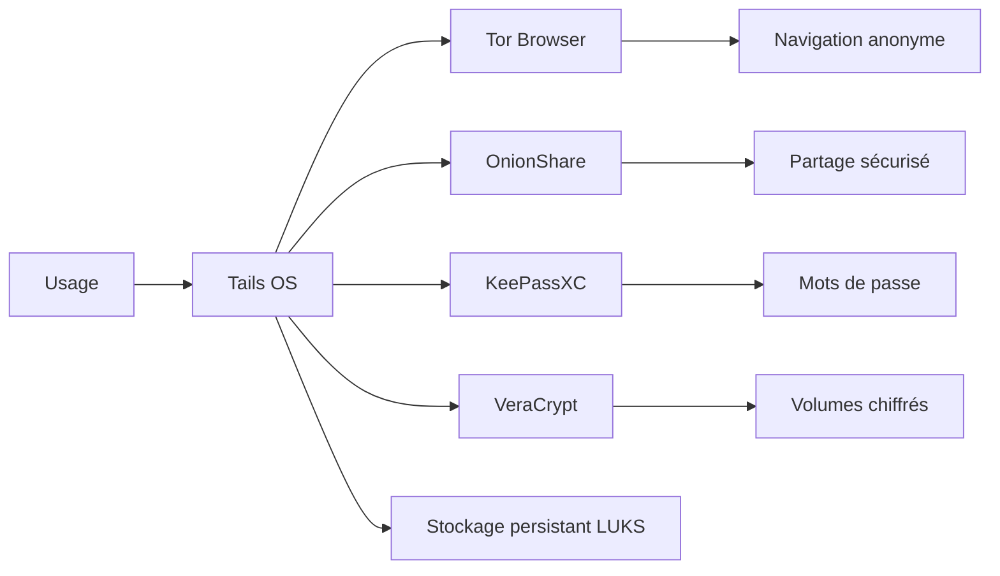

# 🕵️ Tails OS — L'anonymat total sur clé USB (Tor + amnésie)

> [!info] **En 1 phrase**
> Tails OS est un système d'exploitation live USB amnésique basé sur Debian qui achemine tout le trafic via le réseau Tor et ne laisse aucune trace sur la machine hôte : anonymat maximal pour les journalistes, activistes et analystes.

---

## 🧾 Overview

| Champ | Valeur |
|---|---|
| Nom complet | Tails (The Amnesic Incognito Live System) |
| Description | Distribution live USB amnésique : tout le trafic passe par Tor, aucune trace persistée |
| Catégorie | 🐧 Distributions & Lab |
| Sous-catégorie | Distribution d'anonymat / protection de la vie privée |
| Fonction principale | Anonymat et non-traçabilité via Tor pour l'utilisateur |
| Type d'outil | ISO live USB (clé USB amorçable), système Debian complet |
| Licence | GPL-3.0 et licences variées (Debian) |
| Open source / propriétaire | Open source |
| Langage(s) | Shell, Python, C |
| Développeur / organisation | Communauté Tails, soutenue par le Tor Project |
| Projet officiel | tails/tails |
| Dépôt officiel | https://gitlab.tails.boum.org/tails/tails |
| Documentation officielle | https://tails.net/doc/ |
| Date de création | 2009 (basé sur Incognito/Amnesia) |
| État du projet | actif |
| Dernière version connue | 7.10.1 (2026-08-05, version de sécurité) |
| Systèmes compatients | PC x86_64 (USB 4+ Go), dérivation de Debian |

> [!note] Pour vérifier / compléter
> La version 7.10.1 du 5 août 2026 est une version de sécurité : kernel 6.12.100 et expat 2.8.2 corrigeant des vulnérabilités. Il est fortement recommandé de mettre à jour la clé USB dès publication.

---

## 🎯 Concept

Tails est un **système d'exploitation live amnésique** : il s'exécute depuis une clé USB sans rien écrire sur le disque de la machine hôte, et **efface la mémoire RAM** à l'arrêt. Tout le trafic réseau passe obligatoirement par **Tor** (le pare-feu bloque tout ce qui ne passe pas par le circuit Tor). Il embarque un **navigateur Tor**, le gestionnaire de clés **KeePassXC**, l'outil de partage sécurisé **OnionShare**, le client Bitcoin **Electrum** et **VeraCrypt**. Un **stockage persistant chiffré** (LUKS) permet de conserver des documents, mais il reste optionnel.

L'utilisation type : **journalisme d'investigation**, **activisme**, **recherche OSINT** ou toute opération nécessitant de **ne laisser aucune trace** et de **préserver l'anonymat**. Pour l'analyste, Tails sert de poste de travail « jetable » et non traçable, complémentaire des VMs de lab (le réseau Host-Only n'existe pas ici : tout passe par Tor).



---

## 🧠 Concepts fondamentaux

| Concept | Explication |
|---|---|
| Amnésie | Rien n'est écrit sur le disque : tout se passe en RAM, effacée à l'arrêt |
| Live USB | Système complet démarré depuis une clé USB, sans installation |
| Tor | Réseau d'anonymat : trafic chiffré relayé via 3 nœuds |
| Onion services (.onion) | Services Tor accessibles uniquement via le réseau Tor |
| Stockage persistant | Partition chiffrée (LUKS) optionnelle : documents et configuration sauvegardés |
| KeePassXC | Gestionnaire de mots de passe (avec clé dite « passer » en plus du mot de passe) |
| OnionShare | Partage de fichiers et site de journalisme anonyme sur Tor |
| VeraCrypt | Conteneurs chiffrés (en complément du stockage persistant) |
| Non-traçabilité | Impossible de savoir ce qui a été fait et par qui (sous réserve de bonnes pratiques) |
| Whonix / VPN | Alternatives (VM Tor) et compléments (tunnels) à Tails |

---

## 🛠️ Installation

### Téléchargement et vérification

```bash
# Télécharger l'ISO depuis https://tails.net/download/ (via Tor de préférence)
# Vérifier la signature avec l'extension Verifiable Downloads (Chrome) ou GnuPG

gpg --fetch-keys https://tails.net/tails-signing.key
gpg --verify tails-amd64-7.10.1.img.sig tails-amd64-7.10.1.img
```

### Création de la clé USB

```bash
# Sous Linux/Windows/macOS, utiliser l'outil officiel : Balena Etcher
# ou en CLI :
dd if=tails-amd64-7.10.1.img of=/dev/sdX bs=4M status=progress
```

### Configuration initiale (premier démarrage)

```bash
# 1. Démarrer depuis la clé USB (menu boot du BIOS/UEFI)
# 2. Choisir la langue et le fuseau horaire
# 3. Configurer le stockage persistant (si souhaité) :
#    Applications -> Configuration du stockage persistant
# 4. Vérifier l'heure et la connexion Tor (Assistance de connexion)
```

> [!warning] ⚠️ Prérequis & problèmes potentiels
> - **Clé USB 8 Go minimum** et machine compatible x86_64 avec au moins 4 Go de RAM.
> - La machine hôte peut avoir un firmware (UEFI Secure Boot) bloquant le démarrage : désactiver le Secure Boot si besoin.
> - Vérifier toujours la **signature** de l'ISO avant de créer la clé.
> - La première connexion Tor peut nécessiter un réglage (ponts/fuseaux) dans certaines régions.

---

## ⚙️ Configuration

| Paramètre | Rôle | Valeur possible | Impact | Exemple |
|---|---|---|---|---|
| Stockage persistant | Conservation des documents | Actif/Inactif | Conservation des données chiffrées | Activer via le panneau |
| Fuseau horaire | Coherence de l'heure | Pays de l'utilisateur | Pas de fuite d'heure | config initiale |
| Ponts Tor (bridges) | Contourner la censure | obfs4, meek, snowflake | Accès dans les régions censurées | Assistance de connexion |
| Navigateur Tor | Niveau de sécurité | Standard/Safer/Safest | Désactivation JS/plugins | Préférences du navigateur |
| Clavier | Layout | Ex. azerty/fr | Saisie correcte | config initiale |
| OnionShare | Mode de partage | Recevoir/Envoyer | Partage anonyme | interface OnionShare |

---

## 🏗️ Architecture interne

Tails est un **Debian live** dont le boot est piloté par un script init (`tails-unlock` pour le stockage persistant, `tails-autostart`). Le **pare-feu nftables/iptables** ne laisse sortir que les flux Tor (socks 9050, contrôle), et `tor` est configuré pour **forcer l'IsolatedSOCKSAuth** : chaque application utilise un circuit Tor distinct. Le **stockage persistant** est une partition LUKS chiffrée contenant les documents, la configuration de Tor (ponts), les mots de passe KeePassXC, et les « logiciels additionnels » éventuels (APT).

Au runtime, l'utilisateur navigue dans le **Tor Browser**, partage des fichiers via **OnionShare**, et gère ses secrets avec **KeePassXC**. L'absence d'écriture sur le disque hôte et l'effacement RAM au shutdown garantissent l'amnésie.

---

## ⌨️ Commandes

### Commandes principales

```bash
# Vérifier l'état du réseau et de Tor
tails-connectivity-check
tor status / verbose  # via le panneau de contrôle Tor

# Utiliser le réseau Tor en ligne de commande
curl --socks5-hostname 127.0.0.1:9050 https://check.torproject.org

# Gérer le stockage persistant
sudo tails-unlock     # monter le stockage persistant (si chiffré)
```

| Commande | Objectif | Résultat attendu |
|---|---|---|
| `tails-connectivity-check` | Vérifier la connexion Tor | Statut de connectivité |
| `curl --socks5-hostname 127.0.0.1:9050 <url>` | Requête via Tor | Réponse anonymisée |
| `tor` (service) | Démarre Tor en arrière-plan | Circuit Tor actif |
| `tails-unlock` | Monter le stockage persistant | Partition LUKS montée |
| `onionshare` | Lancer OnionShare (GUI) | Partage anonyme |
| `keepassxc` | Gestionnaire de mots de passe | Base de secrets |
| `veracrypt` | Monter un conteneur chiffré | Volume chiffré |

### Commandes avancées

```bash
# Créer un site .onion local pour un partage temporaire
onionshare --website index.html
# Vérifier le circuit Tor actuel
curl --socks5-hostname 127.0.0.1:9050 https://check.torproject.org/api/ip
# Monter un conteneur VeraCrypt en CLI
sudo veracrypt -t --non-interactive /media/cont.vc /mnt/secret
```

---

## 🎚️ Options et flags

| Option | Description | Exemple | Niveau |
|---|---|---|---|
| `--socks5-hostname` (curl) | Passer par le SOCKS Tor | `curl --socks5-hostname 127.0.0.1:9050 ...` | Intermediate |
| `--website` (onionshare) | Mode site web | `onionshare --website index.html` | Intermediate |
| `-t --non-interactive` (veracrypt) | Mode non interactif | `sudo veracrypt -t ... /media/c.vc /mnt/s` | Advanced |
| Niveau de sécurité Tor | Safest (désactive JS) | Préférences navigateur | Basic |
| Ponts obfs4 | Contournement de censure | Assistance de connexion | Intermediate |
| `tails-connectivity-check` | Diagnostic | CLI | Basic |

> [!tip] Options les plus utiles au quotidien
> `--socks5-hostname 127.0.0.1:9050` (tout outil réseau passant par Tor), niveau de sécurité « Safest », et le stockage persistant chiffré pour les documents sensibles.

---

## 🧪 Exemples pratiques

### Beginner

```bash
# Naviguer anonymement : ouvrir le Tor Browser, vérifier l'adresse
# check.torproject.org doit afficher une IP Tor différente de la vôtre.
```

### Intermediate

```bash
# Requête HTTP via Tor (sans navigateur)
curl --socks5-hostname 127.0.0.1:9050 https://check.torproject.org/api/ip
```

### Advanced

```bash
# Partage de fichiers de façon anonyme (OnionShare en CLI)
onionshare /home/amnesia/Documents/rapport.pdf
# -> lien .onion transmis de manière séparée (chat chiffré, etc.)
```

### Expert

```bash
# Monter le stockage persistant puis exporter un document
sudo tails-unlock
cp /home/amnesia/Persistent/rapport.pdf /tmp/
onionshare /tmp/rapport.pdf
```

---

## 🧪 Workflow complet (scénario pas à pas)

1. **Démarrer en amnésie** — brancher la clé USB et démarrer Tails (sans stockage persistant au premier lancement).
   ```bash
   tails-connectivity-check
   ```
2. **Vérifier Tor** — ouvrir check.torproject.org dans le Tor Browser.
3. **Utiliser le réseau** — naviguer ou faire des requêtes CLI via SOCKS.
   ```bash
   curl --socks5-hostname 127.0.0.1:9050 https://check.torproject.org/api/ip
   ```
4. **Partager des documents** — OnionShare génère un lien .onion unique.
   ```bash
   onionshare /home/amnesia/Documents/rapport.pdf
   ```
5. **Éteindre** — l'arrêt efface la RAM : aucune trace sur la machine hôte.

---

## 🎬 Scénarios avancés

### Scénario 1 : Recherche OSINT anonyme

```bash
# Utiliser le Tor Browser au niveau « Safest »
# Requêtes OSINT via CLI passant par Tor :
curl --socks5-hostname 127.0.0.1:9050 "https://api.exemple.com/search?q=..."
# Croiser les résultats avec les outils OSINT habituels, en passant par Tor
```

### Scénario 2 : Partager des documents via OnionShare

```bash
onionshare /home/amnesia/Persistent/investigation/
# Transmettre le lien .onion via un canal séparé (chiffré)
# Le serveur s'arrête dès que le document est téléchargé
```

### Scénario 3 : Préparer une machine de lab non traçable

```bash
# Sur Tails : télécharger l'ISO d'une VM via Tor (ex. Kali/Parrot)
curl --socks5-hostname 127.0.0.1:9050 -O https://cdimage.kali.org/...iso
# Vérifier la signature GPG puis copier l'ISO vers un support
```

---

## 🛡️ Cybersecurity use cases

| Phase | Utilisation |
|---|---|
| Anonymat de l'analyste | Navigation et requêtes via Tor (Tor Browser, curl SOCKS) |
| Journalisme / OSINT | Recherche non traçable, Onion services |
| Partage sécurisé | OnionShare (fichiers, sites) |
| Gestion des secrets | KeePassXC (avec clé « passer ») |
| Stockage chiffré | Stockage persistant LUKS + conteneurs VeraCrypt |
| Contournement de censure | Ponts Tor (obfs4, meek, snowflake) |
| Poste « jetable » | Amnésie : aucune trace sur la machine hôte |

---

## 🎯 MITRE ATT&CK

| Tactique | Technique / Sub-technique | ID | Raison | Détection | Mitigation |
|---|---|---|---|---|---|
| Command & Control | Application Layer Protocol : Web Protocols | T1071.001 | Le trafic sortant passe par Tor (C2 possible des acteurs) | Détection des flux Tor/non standards | Egress filtering |
| Command & Control | Non-Standard Port | T1571 | Trafic vers des nœuds Tor sur ports variés | Analyse des flux, logs | Contrôle des ports |
| Defense Evasion | Obfuscated Files or Information | T1027 | Contenu chiffré (LUKS, VeraCrypt) opaque à l'inspection | Alertes sur volumes chiffrés | EDR, DLP |

> [!note] Ne renseigner que si l'association est réellement pertinente.
> Tails est un outil de **défense de la vie privée**. Le tableau traduit le risque de **mauvaise utilisation** par des acteurs malveillants : en DFIR, la présence de Tails/Tor sur un poste est un artefact à signaler.

---

## 🛡️ Defensive Security

### Signes observables

| Indicateur | Détail |
|---|---|
| Processus Tor/nœuds Tor sur un poste corporate | Présence de Tails/Tor non autorisée : à investiguer |
| Volumes chiffrés (VeraCrypt/LUKS) inattendus | Potentielle dissimulation de données |
| Flux sortants vers les nœuds de garde | Trafic Tor à signaler |
| Clé USB bootable Tails sur le poste | Usage non déclaré : à cadrer |
| OnionShare actif | Partage sortant à surveiller |

### Règles de détection (Sigma / Suricata / Snort / YARA)

```yaml
# Sigma — Windows : Tor Browser détecté sur un poste
title: Tor Browser Present on Endpoint
id: b2c3d4e5-6f7a-4b8c-9d0e-1f2a3b4c5d6e
status: test
logsource:
    category: process_creation
    product: windows
detection:
    selection:
        Image|endswith:
            - '\tor.exe'
            - '\torbrowser\firefox.exe'
    condition: selection
falsepositives:
    - Legitimate use (rare in corporate)
level: high
```

```yaml
# Suricata — flux vers nœuds Tor (exemple, ports/ASN à adapter)
alert tcp any any -> any [9001,9002,9100,9201] \
    (msg:"Possible Tor OR traffic"; \
     threshold: type both, track by_src, count 10, seconds 60; \
     sid: 9000001; rev:1;)
```

---

## 🤖 Automatisation

```bash
# Script — vérification de l'état Tor au démarrage
#!/bin/bash
tails-connectivity-check || { echo "Pas de connexion Tor"; exit 1; }
IP=$(curl --socks5-hostname 127.0.0.1:9050 -s https://check.torproject.org/api/ip)
echo "IP Tor : $IP"
```

```python
# Python — requête via Tor (SOCKS5)
import socks, socket, urllib.request
socks.set_default_proxy(socks.SOCKS5, "127.0.0.1", 9050)
socket.socket = socks.socksocket
print(urllib.request.urlopen("https://check.torproject.org/api/ip").read())
```

---

## 📤 Output et parsing

Les sorties principales sont l'état de Tor et les réponses HTTP des requêtes anonymisées.

```bash
# L'adresse IP publique vue depuis l'extérieur
curl --socks5-hostname 127.0.0.1:9050 -s https://check.torproject.org/api/ip
# -> {"IP":"185.220.101.xxx"}
```

```python
# Python — parsing de la réponse JSON
import json, subprocess
out = subprocess.check_output(
    ["curl", "--socks5-hostname", "127.0.0.1:9050", "-s",
     "https://check.torproject.org/api/ip"])
data = json.loads(out)
print("IP Tor :", data.get("IP"))
```

> [!note] À vérifier
> L'endpoint `check.torproject.org/api/ip` peut varier ; vérifier l'URL courante sur la doc Tor.

---

## 🔗 Intégrations

- [[Tools|🧰 Outils]] global
- **OnionShare** — partage anonyme intégré
- **KeePassXC** — gestionnaire de mots de passe intégré
- **VeraCrypt** — conteneurs chiffrés
- **Whonix** — alternative à base de VMs (Tor Gateway)
- [[Outil - Kali Linux]] — poste d'analyse complémentaire (téléchargé/installé séparément)
- [[Outil - Parrot OS]] — alternative de distribution
- [[Outil - Metasploit]] / [[Outil - Nmap]] — à utiliser dans les VMs du lab, PAS depuis Tails
- [[Outil - Flare VM]] / [[Outil - REMnux]] — lab d'analyse séparé, isolé du réseau

> [!warning] ⚠️ Bonne pratique lab
> Tails et les outils de pentest ne se mélangent pas : les VMs offensives tournent en **Host-Only** sans Tor ; Tails sert de poste de travail anonyme **pour l'opérateur**, jamais pour scanner.

---

## 🔄 Alternatives

| Outil | Avantages | Inconvénients | Cas d'usage |
|---|---|---|---|
| **Whonix** | VMs, pas de boot USB, intégration Kali | Nécessite un hyperviseur | Lab + anonymat |
| VPN + navigateur classique | Simple, performant | Pas d'amnésie, confiance au VPN | Usage quotidien |
| Live USB Ubuntu/Debian | Léger | Pas de Tor par défaut | Utilitaire rapide |
| Qubes OS | Isolation forte | Complexe | Utilisateurs avancés |

> **Quand utiliser Tails plutôt que Whonix ?** Pour un **poste jetable et non traçable** sur un ordinateur quelconque (clé USB), Tails est imbattable. Whonix s'intègre mieux à un **lab de pentest** (VM avec Tor Gateway dédiée). Les deux combinent Tor ; Tails ajoute l'amnésie.

---

## ⚡ Performance

- **Démarrage** : 1-3 minutes selon la clé USB (USB 3.0 recommandé).
- **Navigation** : Tor ralentit le trafic (latence des 3 nœuds) — normal, prévoir de la patience.
- **RAM** : 4 Go minimum ; la navigation lourde peut saturer, fermer les onglets.
- **Amnésie** : l'effacement RAM au shutdown prend quelques secondes.
- **Stockage persistant** : chiffré (LUKS) ; le déchiffrement ajoute un léger coût au démarrage.

> [!note] À vérifier
> Chiffres issus de la documentation officielle et de retours d'usage ; adaptez selon le matériel.

---

## 🛠️ Troubleshooting

### Common problems

#### Problème : Pas de connexion Tor au démarrage

- **Cause** : réseau censuré, nœuds bloqués, ou réglage du fuseau horaire erroné.
- **Solution** : utiliser l'Assistance de connexion pour choisir un pont (obfs4/meek/snowflake).
- **Vérification** : `tails-connectivity-check` renvoie OK.

#### Problème : Le Secure Boot bloque le démarrage

- **Cause** : firmware UEFI verrouillé.
- **Solution** : désactiver le Secure Boot dans le BIOS, ou utiliser une clé USB amorçable compatible.
- **Vérification** : le menu de boot de Tails apparaît.

#### Problème : Le stockage persistant n'est pas monté

- **Cause** : partition chiffrée non déverrouillée (phrase de passe erronée) ou clé USB endommagée.
- **Solution** : vérifier la phrase de passe, refaire l'installation de Tails sur une clé neuve.
- **Vérification** : `ls /home/amnesia/Persistent/` contient les documents.

#### Problème : Certains sites bloquent Tor

- **Cause** : les sites détectent le trafic Tor (listes de sortie publiques).
- **Solution** : changer de circuit Tor (nœud de sortie) ou accepter le blocage ; ne jamais désactiver Tor.
- **Vérification** : le site s'affiche après changement de circuit.

---

## 🔐 Sécurité de l'outil

- **Anonymat ≠ invulnérabilité** : respecter les bonnes pratiques (pas de mots de passe personnels, pas de téléchargement sans signature, pas de dévoilement de l'identité).
- **Amnésie** : ne pas ajouter de stockage persistant si le besoin ne l'exige pas ; il est chiffré mais il EXISTE (traçabilité).
- **Pas de mise en veille** : la RAM contient des secrets — éteindre proprement.
- **Signature de l'ISO** : toujours vérifier la signature GPG (clé Tails).
- **USB et firmware** : la machine hôte peut contenir un firmware malveillant ; Tails protège le système, pas le matériel.
- **Usage légal** : l'anonymat n'autorise pas les actes illégaux ; respecter le droit local.

---

## ⚠️ Limitations

- **Trafic lent** : Tor impose une latence élevée (navigation et transferts).
- **Pas d'installation classique** : Tails ne s'installe pas sur un disque dur comme un OS normal.
- **Amnésie complète** : toute configuration non persistante est perdue à l'arrêt.
- **Matériel limité** : pilotes GPU/imprimantes limités ; certains périphériques peuvent ne pas fonctionner.
- **Blockage de sites** : les services peuvent bloquer les nœuds de sortie Tor.
- **Pas un outil offensif** : l'anonymat protège l'opérateur ; les attaques se font depuis les VMs du lab.

---

## 📋 Cheatsheet

```bash
# Vérifier Tor
tails-connectivity-check
curl --socks5-hostname 127.0.0.1:9050 -s https://check.torproject.org/api/ip

# Requêtes via Tor
curl --socks5-hostname 127.0.0.1:9050 "https://exemple.com/"

# Stockage persistant
sudo tails-unlock

# Partage anonyme
onionshare /home/amnesia/Documents/rapport.pdf

# Conteneur chiffré
sudo veracrypt -t --non-interactive /media/cont.vc /mnt/secret
```

---

## ⚡ Quick reference

| | |
|---|---|
| **À quoi sert-il ?** | OS live amnésique routant tout le trafic via Tor |
| **Quand l'utiliser ?** | Pour un poste anonyme et jetable (journalisme, OSINT, opérateur) |
| **Commande principale** | `curl --socks5-hostname 127.0.0.1:9050 <url>` |
| **Alternative principale** | **Whonix** |
| **Concepts importants** | Amnésie, Tor, OnionShare, KeePassXC, stockage persistant LUKS, VeraCrypt |
| **Liens associés** | OnionShare, KeePassXC, VeraCrypt |

---

## 🔍 Détection & Défense

| Signe | Défense |
|---|---|
| Processus Tor/Tor Browser sur un poste | EDR, blacklist des exécutables, alertes process |
| Flux vers nœuds Tor | Détection réseau, egress filtering, logs |
| Volumes chiffrés inattendus | DLP, inventaire des supports chiffrés |
| Clé USB bootable Tails | Politique de périphériques, contrôle des médias amovibles |
| OnionShare actif | Surveillance des partages sortants, logs proxy |

---

## ⚠️ Tips & Pièges

> [!tip] 💡 **Tips**
> - Utilise le **niveau « Safest »** du Tor Browser pour limiter l'exécution de JavaScript (première défense).
> - Change de **circuit Tor** régulièrement (nouvel identité dans le navigateur) pour réduire la corrélation.
> - Transmets les **liens OnionShare** par un canal séparé et chiffré : le partage n'est anonyme que si le canal l'est.
> - Garde un **snapshot/stockage persistant minimal** : plus il y a de données persistées, plus la non-traçabilité diminue.

> [!warning] ⚠️ **Pièges**
> - Ne **jamais désactiver Tor** « pour aller plus vite » : Tails ne protège alors plus rien.
> - Ne pas connecter de **comptes personnels** (email, réseaux sociaux) depuis Tails : cela lie l'anonymat à votre identité.
> - Les **téléchargements** doivent être **signés et vérifiés** (GPG) : un .exe « sourcé de Tor » reste un malware.
> - Tails n'efface **pas le firmware/matériel** : une machine compromise (UEFI) reste compromettable.

---

## 📚 References

### Official

- Site officiel : https://tails.net/
- Documentation (install, anonymat, ponts) : https://tails.net/doc/
- Dépôt : https://gitlab.tails.boum.org/tails/tails
- Téléchargements et signatures : https://tails.net/download/

### Security references

- Tor Project : https://www.torproject.org/
- MITRE ATT&CK T1071.001 — Web Protocols : https://attack.mitre.org/techniques/T1071/001/
- MITRE ATT&CK T1571 — Non-Standard Port : https://attack.mitre.org/techniques/T1571/

### Community

- Forum Tails : https://tails.net/support/
- Tor Blog (annonces de versions) : https://blog.torproject.org/
- Guides OSINT (les meilleures pratiques) : https://osintframework.com/

---

> [!info] 📚 **Sources**
> - https://tails.net/
> - https://tails.net/download/ (annonce 7.10.1 du 2026-08-05)

➡️ **Liens :** [[Tools|🧰 Outils]] · **OnionShare** · **KeePassXC** · **VeraCrypt** · **Whonix** · [[Outil - Kali Linux|💻 Kali Linux]]
