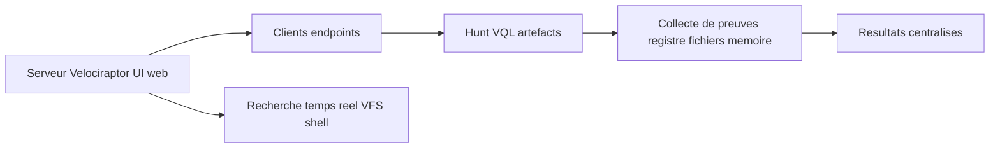

# 🛡️ Velociraptor — Défense & SIEM

> [!info] **En 1 phrase**
> Velociraptor est une plateforme **DFIR/ediscovery** qui collecte des preuves **à grande
> échelle** sur tous les endpoints via des requêtes **VQL**, des **hunts** et des **artefacts**
> — le tout piloté depuis une interface web.

---

## 🧾 Overview

| Champ | Valeur |
|---|---|
| Nom complet | Velociraptor |
| Description | Plateforme de DFIR et d'ediscovery à grande échelle : collecte de preuves sur tous les endpoints via VQL, hunts et artefacts |
| Catégorie | 🛡️ IDS / SIEM / EDR |
| Sous-catégorie | DFIR / EDR / Endpoint visibility / ediscovery |
| Fonction principale | Collecte forensique massive (fichiers, registre, mémoire, événements), hunts parallèles, réponse à incident temps réel |
| Type d'outil | Serveur (frontend + UI web) + agents clients (collecteurs) + CLI |
| Licence | Open source (licence permissive, similaire à Apache) |
| Open source / propriétaire | Open source (Rapid7) |
| Langage(s) de programmation | Go (serveur et clients) ; VQL pour les requêtes |
| Développeur / organisation | Rapid7 (acquisition de Velocidex en 2023) |
| Projet officiel | Velociraptor |
| Dépôt officiel | https://github.com/Velocidex/velociraptor |
| Documentation officielle | https://docs.velociraptor.app |
| Date de création | 2018 (publication open source) |
| État du projet | actif (0.77.1 courante, releases fréquentes) |
| Dernière version connue | 0.77.1 |
| Systèmes compatibles | Serveur : Linux, Windows, macOS ; clients : Windows, Linux, macOS (binaires statiques), collecteurs repackables |

> [!note] Pour vérifier / compléter
> Version courante vérifiée (0.77.1). Velociraptor publie souvent : consulter les release notes officielles pour la toute dernière et les changements de schéma VQL.

---

## 🎯 Concept

Velociraptor fait de la **recherche de preuves** (acquisition forensique) sur des centaines ou milliers de machines en parallèle : on lance une **hunt** (collecte d'un artefact précis) sur un parc entier, et le serveur centralise les résultats. Son langage **VQL** (Velociraptor Query Language) est un SQL adapté au forensique : interroger le registre, les fichiers, la mémoire, les processus, les prefetch... La **UI web** permet la navigation temps réel sur les clients (shell, VFS, téléversement de fichiers) et la **recherche globale** des artefacts. Il couvre l'ediscovery légal et le **DFIR** (volatile analysis) là où osquery fait surtout de la supervision. Moins connu, c'est l'outil de référence du DFIR à l'échelle (Rapid7 l'a racheté en 2023).



---

## 🧠 Concepts fondamentaux

| Concept | Explication |
|---|---|
| VQL | Velociraptor Query Language : SQL adapté au forensique (pslist, glob, hash, yara, sources) |
| Hunt | Campagne de collecte ciblée (artefact + sélection de clients) lancée depuis le serveur |
| Artefact | Pack VQL réutilisable (collection de requêtes) : Windows.System.Autoruns, Linux.System.CronTab... |
| Client / collecteur | Agent Go installé sur l'endpoint, se connecte au serveur (long poll) |
| Repack | Intégration de la config client dans le binaire collecteur → exécutable autonome |
| VFS | Virtual File System : vue du système de fichiers des clients, parcourable dans l'UI |
| Notebook | Carnet d'investigation partagé (cellules VQL, markdown, timeline) |
| Flow | Exécution d'un artefact sur un client donné (résultat d'une hunt ou collecte manuelle) |
| Server-side upload | Les résultats remontent au serveur (fichiers extraits, dumps, archives) |
| Multitenancy / orgs | Découpage du serveur en organisations séparées (isolation des parcs) |
| Dead-drop / collection | Collecte urgente sans agent pré-installé via un binaire one-shot |

---

## 🛠️ Installation

### Serveur (Linux)

```bash
wget -q https://github.com/Velocidex/velociraptor/releases/latest/download/velociraptor_linux_amd64
chmod +x velociraptor_linux_amd64
./velociraptor_linux_amd64 config generate -i   # réponses interactives → server.config.yaml
./velociraptor_linux_amd64 --config server.config.yaml frontend   # démarre le serveur
```

### Collecteur Windows (déploiement classique)

```bash
# Générer une config client, puis l'intégrer dans le binaire collecteur
./velociraptor_linux_amd64 --config server.config.yaml config generate --client \
  --keepsecret > client.config.yaml
./velociraptor_linux_amd64 --config server.config.yaml config repack \
  --exe velociraptor_windows_amd64.exe client.config.yaml collector.exe
# Sur l'endpoint : installer comme service Windows
collector.exe install --service
```

### Conteneur / déploiement rapide

```bash
# docker compose officiel (server + clients de test) fourni dans le dépôt GitHub
git clone https://github.com/Velocidex/velociraptor && cd velociraptor/docker
docker compose up -d
```

> [!warning] ⚠️ Prérequis & problèmes potentiels
> - `config generate -i` demande des réponses interactives (ports, IP publique, mot de passe) : prévoir un nom DNS/HTTPS stable pour le serveur.
> - Le frontend écoute par défaut sur le port **8000** (UI) ; ouvrir ce port uniquement vers les équipes SOC.
> - Les binaires sont statiques : pas de dépendances runtime, mais vérifier l'architecture (amd64 / arm64).
> - Un collecteur repacké embarque la config : ne pas le diffuser hors de l'équipe (il contient les creds client).

---

## ⚙️ Configuration

| Paramètre | Rôle | Valeur possible | Impact | Exemple |
|---|---|---|---|---|
| `GUI.port` | Port de l'interface web | entier | Accès SOC | `GUI.port: 8000` |
| `GUI.bind_address` | Adresse d'écoute UI | IP | Exposition réseau | `0.0.0.0` (derrière reverse proxy) |
| `Frontend.port` | Port des clients (TLS) | entier | Connexion des agents | `Frontend.port: 8000` (même port, proto distinct) |
| `Client.use_self_signed_ssl` | Certificats auto-signés | true/false | Simplicité lab | `true` en lab, PKI en prod |
| `API.bind_address` | API gRPC (automatisation) | IP | Accès scripté | `127.0.0.1` par défaut |
| `orgs` | Organisations / multi-tenant | liste | Isolation des parcs | `orgs: [parc-lab, parc-prod]` |
| `Logging.output_directory` | Logs du serveur | chemin | Supervision | `/var/log/velociraptor` |
| `Frontend.max_upload_size` | Taille max des uploads clients | octets | Volume collecté | `536870912` (512 Mo) |
| `GUI.authentication` | Auth de l'UI | basic / SSO | Sécurité d'accès | `basic` (à passer en SSO en prod) |

> [!note] À vérifier
> Les fichiers de config `server.config.yaml` / `client.config.yaml` sont en YAML, générés et signés par l'outil. Toute modification passe par `config` + redémarrage du frontend ; tester dans un lab avant production.

---

## 🏗️ Architecture interne

Composants et flux à l'exécution :

- **Frontend** : serveur Go exposant la UI web (GUI) et l'API gRPC ; il centralise les connexions des clients (long poll TLS) et les résultats.
- **Clients (collecteurs)** : agents Go installés sur les endpoints ; exécutent les requêtes VQL localement et renvoient uniquement les résultats (pas les données brutes non sélectionnées).
- **VQL engine** : moteur d'exécution des requêtes côté client ; plugins (`pslist`, `glob`, `registry`, `yara`, `hash`...) et accès aux sources (`sources("Artifact.Name")`).
- **Artefacts** : collections VQL packagées (Définition YAML `name`, `parameters`, `sources`) ; distribuées aux clients à la demande.
- **Hunts** : planification d'un artefact sur un ensemble de clients ; les résultats (logs JSON + fichiers uploadés) remontent au serveur en continu.
- **Notebook / VFS** : UI pour naviguer les données collectées, éditer des cellules VQL partagées, téléverser des fichiers depuis un client.
- **API gRPC** : endpoint pour l'automatisation (Python `pyvelociraptor`, scripts), séparé du GUI.

Flux type : hunt lancée → le serveur pousse l'artefact aux clients ciblés → chaque client exécute le VQL localement → les résultats (événements JSON, fichiers extraits) remontent en TLS → le serveur les stocke et les expose dans l'UI / l'API.

---

## ⌨️ Commandes

### Commandes principales

```bash
velociraptor --config server.config.yaml frontend            # démarre le serveur (API + UI)
velociraptor --config server.config.yaml client add --password   # enregistre un client
velociraptor --config server.config.yaml shell                # console VQL interactive
velociraptor --config server.config.yaml query "SELECT * FROM pslist()"   # requête directe
velociraptor --config server.config.yaml hunt list            # liste les hunts
```

| Commande | Objectif | Résultat attendu |
|---|---|---|
| `config generate -i` | Génère configs serveur + client | Deux fichiers YAML signés |
| `config repack --exe <binaire> client.config.yaml out.exe` | Intègre la config dans le collecteur | Exécutable autonome |
| `client add` | Enregistre un nouveau client | Creds/CSR du client |
| `frontend` | Démarre le serveur | UI + API en écoute |
| `shell` | Console VQL interactive | Invite VQL |
| `query "<vql>"` | Requête VQL ponctuelle | Résultats JSON |
| `hunt list` | Liste des hunts | ID, statut, clients |
| `artifact list` | Liste des artefacts disponibles | Noms + descriptions |
| `artifact collect <nom>` | Collecte manuelle d'un artefact | Flow exécuté |

### Commandes avancées

```bash
# Lister les artefacts contenant "Autoruns"
velociraptor --config server.config.yaml artifact list | grep -i autoruns

# Collecter un artefact sur tous les clients en une passe
velociraptor --config server.config.yaml artifact collect \
  --wait Windows.System.Autoruns

# Afficher les clients connectés et leur état
velociraptor --config server.config.yaml client list
```

---

## 🎚️ Options et flags

| Option | Description | Exemple | Niveau |
|---|---|---|---|
| `--config <file>` | Fichier de configuration | `--config server.config.yaml` | Basic |
| `--config generate -i` | Génération interactive | `config generate -i` | Basic |
| `--config generate --client` | Génère uniquement la config client | `config generate --client --keepsecret` | Intermediate |
| `--keepsecret` | Conserve le secret CA dans la config | `config generate --keepsecret` | Advanced |
| `--exe <binaire>` | Binaire à repacker | `config repack --exe velociraptor_windows_amd64.exe ...` | Intermediate |
| `--wait` | Attendre la fin d'une collecte | `artifact collect --wait Foo` | Intermediate |
| `--max_wait <durée>` | Timeout d'attente | `--max_wait 10m` | Advanced |
| `--args key=value` | Paramètres d'artefact en CLI | `artifact collect Foo --args Bar=baz` | Advanced |
| `--verbose` / `-v` | Logs détaillés | `frontend --verbose` | Intermediate |
| `--org <name>` | Cible une organisation | `hunt list --org parc-prod` | Advanced |

> [!tip] Options les plus utiles au quotidien
> `frontend` pour démarrer le serveur, `query`/`shell` pour le VQL rapide, `artifact collect` pour une collecte ciblée, `hunt list` pour suivre les campagnes, et le **notebook** de l'UI pour tout ce qui est investigatif.

---

## 🧪 Exemples pratiques

### Beginner

```sql
-- Objectif : lister les processus d'un client depuis l'UI/console VQL
SELECT Name, Pid, Exe, Username FROM pslist()
```

### Intermediate

```sql
-- Objectif : trouver les connexions réseau sortantes et leurs processus
SELECT ProcessId, Name, LocalAddress, RemoteAddress, State
FROM network_connections()
WHERE State =~ "ESTABLISHED"
```

### Advanced

```sql
-- Objectif : chasser les scripts téléchargés dans les temp des utilisateurs
SELECT FullPath, Size, Mtime FROM glob(globs="C:\\Users\\*\\AppData\\Local\\Temp\\*.ps1")
WHERE Size > 0
-- Croiser avec les processus ayant lancé powershell
SELECT * FROM pslist() WHERE Exe =~ "powershell" AND Cmdline =~ "temp"
```

### Expert

```sql
-- Objectif : scanner un fichier suspect avec YARA (règle embarquée)
SELECT FullPath, hash(path=FullPath) AS H FROM glob(globs="C:\\temp\\*.exe")
WHERE H.SHA256 =~ "a3f2..."
-- puis yara(rule=..., files=...) pour valider l'empreinte
SELECT FullPath, String FROM yara(rules="rule suspect { strings: $a = \"payload\"; condition: $a; }",
  files="C:\\temp\\*.exe")
```

---

## 🧪 Workflow complet (scénario pas à pas)

1. **Générer et démarrer** le serveur, puis créer un client et installer le collecteur sur une machine de test (VM Windows du lab).
2. **Se connecter à la UI web** (`https://<serveur>:8000`) : le client apparaît avec son OS, hostname, IP.
3. **Lancer une hunt** : menu *Hunts → New hunt* → choisir l'artefact `Windows.System.NetworkConnections` (par ex.) → cibler tous les clients.
4. **Exécuter une requête VQL ad-hoc** dans la console du client :
   ```sql
   SELECT Name, Pid, Exe FROM pslist()
   ```
5. **Naviguer dans le VFS** du client : parcourir le système de fichiers, **téléverser** un fichier suspect (`upload`), récupérer des preuves dans *Collected artifacts*.
6. **Recherche globale** : *Search → Glob* pour chercher un fichier par motif sur tout le parc (`**/*.exe`), puis *notebook* pour documenter l'investigation.

---

## 🎬 Scénarios avancés

### Scénario 1 : Hunt de persistance sur un parc Windows

Détecter les mécanismes de persistance (Run keys, services, tâches planifiées) sur tous les clients en une passe.

```sql
-- Via l'artefact officiel Windows.System.Autoruns
SELECT Name, Pid, Args
FROM sources("Windows.System.Autoruns")
WHERE Path =~ "Run"
-- Corrélation : croiser avec un fichier connu suspect
SELECT * FROM glob(globs="C:\\Users\\*\\AppData\\Local\\Temp\\*.exe")
```

### Scénario 2 : Acquisition mémoire d'urgence pendant un incident

Utiliser l'artefact d'acquisition pour récupérer un dump RAM à chaud, avant toute manipulation du poste.

```bash
# Nouvelle hunt → artefact Windows.Memory.Acquisition
# (ou Linux.Memory.Acquisition) → cibler le client compromis
# Les dumps remontent au serveur ; analyser ensuite avec Volatility 3
python vol.py -f client_dump.mem windows.pslist
```

### Scénario 3 : Chasse à la persistance Linux (cron, systemd, shell rc)

Hunt VQL ciblée sur les mécanismes de persistance d'un parc Linux.

```sql
-- Artefacts officiels : Linux.System.CronTab, Linux.System.SystemdUnits
SELECT * FROM sources("Linux.System.CronTab")
WHERE Command =~ "curl|wget|bash|nc|python"
-- Recherche d'un fichier suspect récent dans /tmp
SELECT * FROM glob(globs="/tmp/*", accessor="file")
```

### Scénario 4 : Timeline et corrélation (notebook)

Documenter l'investigation avec le **notebook** : requêtes, résultats et conclusion.

```sql
-- Exemple : fichiers modifiés ces 7 derniers jours sur un client
SELECT FullPath, Size, Mtime FROM glob(globs="C:\\**")
WHERE Mtime > now() - 86400 * 7 AND NOT IsDir
```

---

## 🛡️ Cybersecurity use cases

| Phase | Utilisation |
|---|---|
| DFIR | Acquisition mémoire, artefact hunting, collecte ciblée d'un endpoint compromis |
| ediscovery | Recherche globale de fichiers par motif sur tout le parc (rappel légal) |
| Incident Response | Réponse à chaud via collecteur one-shot (dead-drop), isolation d'endpoints |
| Threat hunting | Hunts périodiques sur persistance, mouvements latéraux, login anormaux |
| Supervision endpoints | Métadonnées continues (processus, connexions) en complément de l'EDR |
| Post-exploitation défensive | Validation de compromission, preuves datées et documentées (notebook) |

---

## 🎯 MITRE ATT&CK

| Tactique | Technique / Sub-technique | ID | Raison | Détection | Mitigation |
|---|---|---|---|---|---|
| Collection | Data from Local System | T1005 | Hunts récupèrent fichiers/registre/mémoire des endpoints | Artefacts VQL ciblés | Privilèges minimaux des comptes DFIR |
| Collection | Automated Collection | T1119 | Hunts programmées sur le parc | Monitoring des hunts | Limiter les artefacts déployés |
| Discovery | File and Directory Discovery | T1083 | Recherches glob massives sur le VFS | Logs des requêtes | Least privilege |
| Credential Access | OS Credential Dumping | T1003 | Artefacts de collecte d'credentials (SAM, LSASS) | Artefacts + supervision | Credential Guard, EDR |
| Execution | Command and Scripting Interpreter | T1059 | Shell VQL / PowerShell lancés depuis l'UI | Journaux d'accès UI | MFA, SSO, audit des comptes |

> [!note] Ne renseigner que si l'association est réellement pertinente.
> Velociraptor est avant tout un outil **défensif** : les mappings ci-dessus couvrent ce que ses artefacts permettent de collecter/détecter, pas une capacité offensive.

---

## 🛡️ Defensive Security

### Signes observables

| Indicateur | Détail |
|---|---|
| Processus `velociraptor.exe` / collecteur non légitime sur un endpoint | Inventaire des binaires DFIR autorisés, allow-list EDR, signature de code |
| Volume de données sortant vers le serveur (hunts massives, VFS upload) | Superviser le trafic, limiter les artefacts lourds, réseau dédié |
| Serveur Velociraptor non autorisé dans le parc (imposture C2) | Contrôler les domaines/IP de connexion, blocage egress |
| Collecteur installé sans cycle de vie (collecteur one-shot oublié) | Politique de retrait post-incident, journalisation des déploiements |
| Requêtes VQL massives répétées sur un même endpoint | Alerter sur les patterns d'interrogation, limiter les droits des comptes DFIR |

### Règles de détection (Sigma / Suricata / Snort / YARA)

```yaml
# Sigma — collecteur Velociraptor inattendu sur un endpoint
title: Suspicious Velociraptor Collector Execution
id: f7a2b3c4-5d6e-4f8a-9b0c-1d2e3f4a5b6c
status: experimental
logsource:
    category: process_creation
    product: windows
detection:
    selection:
        Image|endswith:
            - '\velociraptor.exe'
            - '\collector.exe'
        CommandLine|contains:
            - '--config'
            - 'repack'
    filter_known:
        Signer: 'Rapid7 LLC'
    condition: selection and not filter_known
falsepositives:
    - Déploiement DFIR légitime de l'équipe SOC
level: medium
```

```text
# Règle Suricata — détection du trafic vers un serveur Velociraptor non autorisé
alert tcp $HOME_NET any -> $EXTERNAL_NET 8000 (msg:"Potential Velociraptor C2 traffic";
  flow:to_server,established; sid:2000007; rev:1;)
```

---

## 🤖 Automatisation

```bash
# Bash — lister les clients connectés (via l'API gRPC)
velociraptor --config server.config.yaml client list --format csv \
  | awk -F, '$2 ~ /ONLINE/ {print $1}'
```

```python
# Python — lancer une hunt depuis l'API (client pyvelociraptor)
import grpc
from pyvelociraptor import api_pb2, api_pb2_grpc

stub = api_pb2_grpc.API(grpc.insecure_channel("127.0.0.1:8001"))
req = api_pb2.VQLCollectorArgs(Query=[api_pb2.VQLQuery(Name="Hunt",
      VQL="SELECT * FROM pslist()")])
# Exemple pédagogique : à adapter aux méthodes réelles de l'API
print("Hunt envoyée sur le parc")
```

```bash
# Bash — planifier une hunt quotidienne via cron
0 2 * * * velociraptor --config server.config.yaml artifact collect \
  --wait Windows.System.Autoruns >> /var/log/velociraptor/cron.log 2>&1
```

---

## 📤 Output et parsing

Les résultats d'une collecte sont des **fichiers JSON** (un objet par flux/événement) stockés dans le magasin du serveur, associés à l'ID du flow. Les fichiers extraits (uploads, dumps) sont archivés par client.

```bash
# Extraire les résultats d'un flow depuis le serveur
velociraptor --config server.config.yaml query \
  "SELECT * FROM read_flows(client_id='C.abc...', flow_id='F.123...')"

# Compter les alertes/autoruns par chemin
velociraptor --config server.config.yaml query \
  "SELECT Path, count() FROM read_flows(client_id='C.abc...', flow_id='F.123...') GROUP BY Path" \
  | sort | uniq -c | sort -rn | head
```

```python
# Python — parser un résultat exporté (NDJSON)
import json

with open("hunt_results.jsonl") as f:
    for line in f:
        row = json.loads(line)
        print(row.get("Hostname"), row.get("Path"), row.get("Args", ""))
```

---

## 🔗 Intégrations

```text
Velociraptor (hunts) → exports JSON → Elastic / Splunk / Graylog / SIEM
Velociraptor → Volatility 3 (analyse des dumps mémoire acquis)
Velociraptor → osquery (requêtes croisées, supervision complémentaire)
Velociraptor → API gRPC → scripts SOAR / TheHive / IR automation
```

- [[Tools|🧰 Outils]]
- [[Outil - osquery]] — supervision hôte continue, complément des hunts ponctuelles
- [[Outil - Volatility]] — analyse forensique des dumps mémoire acquis par Velociraptor
- [[Outil - Wazuh]] — XDR hôte, détection en continu vs collecte à la demande
- [[Outil - Elastic]] — centralisation des résultats de hunts dans le SIEM
- [[Outil - Splunk]] — ingestion des exports JSON de collectes
- [[Outil - YARA]] — règles utilisées dans les artefacts VQL (scan de fichiers)

---

## 🔄 Alternatives

| Outil | Avantages | Inconvénients | Cas d'usage |
|---|---|---|---|
| Velociraptor | DFIR massif, VQL, open source | Courbe VQL, scale dépendant de l'infra | DFIR/ediscovery à grande échelle |
| osquery | SQL simple, supervision continue | Peu orienté forensique | Supervision hôte en continu |
| GRR (Google) | Mature, hunting | Plus lourd, moins maintenu | Parcs Windows hérités |
| Wazuh | EDR complet, agents légers | Moins de profondeur forensique | Détection continue + conformité |
| CrowdStrike / EDR commercial | Géré, SOC intégré | Coût, fermé | Entreprise sans équipe DFIR |
| Sysinternals Suite | Gratuit, local | Pas d'échelle, manuel | Analyse ponctuelle d'un poste |

> **Quand ne pas utiliser Velociraptor ?** Pour une **supervision continue** temps réel de type EDR, ou si l'équipe n'a pas de compétences VQL : osquery ou Wazuh suffisent. Velociraptor excelle sur les **investigations à chaud** et les **collectes massives ponctuelles**.

---

## ⚡ Performance

- **Modèle pull/push** : les clients interrogent le serveur (long poll) → pas de connexions entrantes, échelle large sans reverse proxy supplémentaire.
- **VQL exécuté côté client** : seuls les résultats remontent au serveur → le réseau ne transporte pas les données brutes (contrairement à une exfiltration complète).
- **Coût côté client** : une hunt sur MFT/NTFS ou mémoire est gourmande en CPU/IO local : espacer, limiter les globs (`WHERE Mtime > ...`), prévoir des deadlines.
- **Serveur central** : le stockage des résultats (JSON + uploads) et l'indexation sont le goulot : dimensionner le disque et la base (SQLite/PostgreSQL).
- **Taille des uploads** : `Frontend.max_upload_size` à ajuster pour les dumps mémoire (plusieurs Go) et les fichiers extraits.
- **Hunts ciblées** : lancer des hunts sur un sous-ensemble de clients réduit la charge serveur (label-based selection).

> [!note] À vérifier
> Les chiffres de montée en charge dépendent du matériel, du nombre de clients et du volume collecté : benchmarker avec un parc de test avant déploiement complet.

---

## 🛠️ Troubleshooting

### Common problems

#### Problème : le client ne s'affiche pas dans l'UI

- **Cause** : port/frontend inaccessible, certs non générés, config client incorrecte.
- **Solution** : vérifier `Frontend.port` et le nom DNS dans `server.config.yaml`, régénérer le collecteur avec `config repack`.
- **Vérification** : `velociraptor --config server.config.yaml client list`.

#### Problème : une hunt ne renvoie aucun résultat

- **Cause** : sélection de clients vide, artefact paramétré en erreur, ou deadline trop courte.
- **Solution** : vérifier les labels/selection, les paramètres obligatoires de l'artefact (`--args`), augmenter le timeout.
- **Vérification** : regarder le statut du flow dans l'UI (colonne *Errors*).

#### Problème : requête VQL trop lente ou saturant un endpoint

- **Cause** : glob sans filtre sur tout le disque, artefact mémoire/ MFT lourd.
- **Solution** : filtrer en amont (`WHERE Mtime > now() - 86400`), utiliser `accessor`, réduire le périmètre.
- **Vérification** : observer le CPU/IO du client pendant la collecte.

#### Problème : l'UI ne se connecte pas (TLS)

- **Cause** : certs auto-signés non acceptés par le navigateur, ou reverse proxy mal configuré.
- **Solution** : ajouter le CA du serveur au navigateur, ou exposer via HTTPS derrière un proxy.
- **Vérification** : `curl -k https://<serveur>:8000/` doit répondre.

#### Problème : upload volumineux refusé

- **Cause** : `Frontend.max_upload_size` trop petit pour un dump/archive.
- **Solution** : augmenter la limite côté serveur, redémarrer le frontend.
- **Vérification** : consulter les logs serveur (`Logging.output_directory`).

---

## 🔐 Sécurité de l'outil

- **Accès UI** : l'UI contrôle la collecte de preuves sur tout le parc : protéger par MFA/SSO, restreindre les IP, auditer les connexions.
- **Clés & certs** : les configs (surtout avec `--keepsecret`) contiennent le CA : ne jamais les committer ni les diffuser.
- **Collecteurs one-shot** : un binaire repacké embarque des creds clients : le traiter comme secret, le retirer après incident.
- **Données collectées** : les preuves (mots de passe hashés, fichiers, mémoire) sont très sensibles : chiffrer le stockage serveur, purger après affaire.
- **Exposition réseau** : n'exposer que le port frontend (TLS) et jamais l'API gRPC brute sur Internet ; passer par un VPN/zero-trust.
- **Posture défensive** : Velociraptor étant utilisé par les SOC, un attaquant peut l'imiter (fake server) : contrôler les domaines de connexion.

---

## ⚠️ Limitations

- **Pas un EDR temps réel** : la supervision est à la demande (hunts) ou intermittente, pas une détection continue auto-répondante.
- **Latence de collecte** : les résultats dépendent du long poll des clients (les données ne sont pas streamées en temps réel strict).
- **Courbe d'apprentissage VQL** : le langage et le modèle d'artefacts demandent de la formation.
- **Scale serveur** : le stockage et l'indexation centralisés sont un point de dimensionnement critique.
- **Évitement** : un attaquant ayant les droits admin peut désactiver/supprimer le collecteur ou forger des résultats.
- **Windows uniquement pour certains artefacts** : le support Linux/macOS est bon mais moins fourni que la couverture Windows.

---

## 📋 Cheatsheet

```bash
# Démarrer le serveur
velociraptor --config server.config.yaml frontend

# Générer config + repack collecteur
velociraptor --config server.config.yaml config generate -i
velociraptor --config server.config.yaml config repack --exe velociraptor_windows_amd64.exe client.config.yaml collector.exe

# Requête VQL directe
velociraptor --config server.config.yaml query "SELECT Name, Pid FROM pslist()"

# Console VQL interactive
velociraptor --config server.config.yaml shell

# Collecter un artefact sur tout le parc
velociraptor --config server.config.yaml artifact collect --wait Windows.System.Autoruns

# Suivre les hunts
velociraptor --config server.config.yaml hunt list
```

```sql
-- VQL utiles
SELECT * FROM pslist() WHERE Name =~ "cmd"
SELECT FullPath, Size, Mtime FROM glob(globs="C:\\temp\\*")
SELECT * FROM sources("Windows.System.Autoruns")
SELECT Hostname, Username, ClientId FROM clients() WHERE LastSeenAt > now() - 3600
```

---

## ⚡ Quick reference

| | |
|---|---|
| **À quoi sert-il ?** | Plateforme DFIR/ediscovery : collecte de preuves massive sur les endpoints via VQL, hunts et artefacts |
| **Quand l'utiliser ?** | Investigation à chaud, recherche globale, collecte mémoire, ediscovery, corrélation multi-endpoints |
| **Commande principale** | `velociraptor --config server.config.yaml frontend` puis `hunt`/`query` depuis l'UI |
| **Alternative principale** | osquery (supervision), Wazuh (EDR), GRR (hunting DFIR) |
| **Concepts importants** | VQL, hunt, artefact, repack, VFS, notebook, flow |
| **Liens associés** | [[Outil - osquery]] · [[Outil - Volatility]] · [[Outil - Wazuh]] |

---

## 🔍 Détection & Défense

| Signe | Défense |
|---|---|
| Binaire collecteur non autorisé sur un endpoint | Inventaire des binaires DFIR, allow-list EDR, signature de code |
| Connexions sortantes vers un faux serveur (imposture) | Contrôler domaines/IP, blocage egress vers domaines inconnus |
| Hunts massives anormales (tous les clients, artefacts lourds) | Supervision des activités du serveur, alerte sur les flows géants |
| Collecteur one-shot resté actif après incident | Cycle de vie documenté, retrait planifié, journalisation |
| Compte DFIR compromis utilisant l'UI | MFA/SSO, rotation des creds, audit des actions notebook |

---

## ⚠️ Tips & Pièges

> [!tip] 💡 **Pense binaires de collecte « one-shot »**
> Le **repack** du collecteur avec config intégrée permet de déployer sans pré-installation : parfait pour une **réponse à incident d'urgence** (drop un exe, il se connecte au serveur, on collecte) sans toucher au parc.
>
> **Artefacts utiles à connaître** : `Windows.System.Autoruns`, `Windows.Network.NetworkConnectionList`, `Windows.Forensics.Prefetch`, `Windows.EventLogs.Evtx`, `Windows.Sys.StartupItems`, `Linux.System.CronTab`.

> [!warning] ⚠️ **Piège** : les requêtes sur de **grosses données** (MFT, NTFS, mémoire) peuvent saturer le client et le réseau. Toujours **limiter par deadline**, filtrer en VQL (`WHERE Size > ...`) et éviter les collections massives sans nécessité.

> [!warning] ⚠️ **Piège** : un collecteur repacké embarque des **credentials**.
> Traite chaque binaire déployé comme un secret : sans rotation/retrait, un incident de diffusion compromet tout le parc.

> [!warning] ⚠️ **Piège** : la config serveur contient la **CA**.
> `config generate` produit des certificats signés par une CA maison : ne partage jamais `server.config.yaml` (ou une config `--keepsecret`) hors de l'équipe.

---

## 📚 References

### Official

- Site officiel : https://www.velociraptor.app
- Documentation : https://docs.velociraptor.app
- GitHub Velocidex : https://github.com/Velocidex/velociraptor
- Documentation VQL : https://docs.velociraptor.app/vql/
- Artefacts (exchange) : https://docs.velociraptor.app/artifact_references/

### Security references

- MITRE ATT&CK T1005 — Data from Local System : https://attack.mitre.org/techniques/T1005/
- MITRE ATT&CK T1003 — OS Credential Dumping : https://attack.mitre.org/techniques/T1003/
- MITRE ATT&CK T1059 — Command and Scripting Interpreter : https://attack.mitre.org/techniques/T1059/

### Community

- Velociraptor Academy (formations) : https://docs.velociraptor.app/academy/
- Blog Rapid7 : https://www.rapid7.com/blog/
- Discussion (Discord/GitHub) : https://github.com/Velocidex/velociraptor/discussions

---

➡️ **Liens :** [[Tools|🧰 Outils]] · [[Techniques/Privilege Escalation Windows|🕹️ Privesc Windows]] · [[Techniques/Privilege Escalation Linux|🕹️ Privesc Linux]] · [[Techniques/Pivoting et Tunneling|🌉 Pivoting / Tunneling]]
