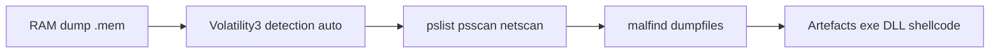

# 🔎 Volatility — Forensics, Threat Intel & Honeypots

> [!info] **En 1 phrase**
> Volatility est le framework de référence pour l'analyse de la mémoire vive (RAM dump), permettant de lister processus, connexions réseau, fichiers ouverts et d'extraire des artefacts de malwares directement depuis un dump mémoire.

---

## 🧾 Overview

| Champ | Valeur |
|---|---|
| Nom complet | Volatility Framework |
| Description | Framework d'analyse de la mémoire vive (RAM dump) : processus, réseau, fichiers, injections, registre |
| Catégorie | 🔎 Forensics, Threat Intel & Honeypots |
| Sous-catégorie | Memory Forensics / Malware Analysis |
| Fonction principale | Reconstruire l'état du système depuis un dump mémoire : processus, connexions, artefacts de malwares |
| Type d'outil | CLI Python (vol.py / vol) + bibliothèque |
| Licence | GPL-2.0 (v2) ; GPL-3.0 (v3) |
| Open source / propriétaire | Open source |
| Langage(s) de programmation | Python 3.x ; C pour la génération de symboles |
| Développeur / organisation | Volatility Foundation (ex-Volatile Systems) |
| Projet officiel | Volatility |
| Dépôt officiel | https://github.com/volatilityfoundation/volatility3 |
| Documentation officielle | https://volatility3.readthedocs.io |
| Date de création | 2007 (v1) ; v3 en 2019 |
| État du projet | actif (v3 2.28.0) |
| Dernière version connue | 2.28.0 (série v3) |
| Systèmes compatients | Linux, macOS, Windows ; Windows, Linux, macOS (analyse) |

> [!note] Pour vérifier / compléter
> Volatility 3 est en développement actif : vérifier la dernière version sur le dépôt officiel ; Volatility 2 reste utile pour les anciens systèmes à profils.

---

## 🎯 Concept

Volatility analyse un fichier `.mem` (dump RAM) produit par FTK Imager, WinPmem, LiME ou autres : il interprète la structure mémoire de l'OS et expose des « plugins » qui reconstruisent l'état du système au moment de la capture. On l'utilise quand le malware vit uniquement en mémoire (fileless), pour retrouver un processus caché, une charge utile injectée ou une clé de chiffrement volatile.

La version 3 (Volatility3) abandonne le profil par OS au profit de la détection automatique via des symboles ; la syntaxe diffère de la version 2 (`vol.py -f dump.mem --profile=... plugin`). Les plugins stars : `windows.info`, `windows.pslist`, `windows.psscan`, `windows.netscan`, `windows.dumpfiles`, `windows.malfind` et `windows.memmap`. Des plugins Linux/macOS existent également (`linux.pslist`, `linux.bash`, `mac.pslist`). C'est l'outil central de toute investigation mémoire en SOC/DFIR.



---

## 🧠 Concepts fondamentaux

| Concept | Explication |
|---|---|
| Dump mémoire | Capture de la RAM (`.mem`) via FTK Imager, WinPmem, LiME, VMWare... |
| Plugin | Analyseur ciblé (windows.pslist, windows.malfind...) |
| Table de symboles | Structure du noyau (ISF) permettant la détection automatique |
| EPROCESS | Structure noyau décrivant un processus Windows |
| pslist | Processus vus via la liste chaînée EPROCESS |
| psscan | Processus détectés par scan de la mémoire brute (anti-DKOM) |
| netscan | Sockets et connexions TCP/UDP depuis la mémoire |
| malfind | Recherche de régions mémoire exécutables non mappées (injection) |
| dumpfiles | Extraction des fichiers mappés en mémoire d'un processus |
| VAD | Virtual Address Descriptor : gestion des plages d'adresses virtuelles |
| memmap | Cartographie des pages physiques d'un processus |
| Volatility 2 vs 3 | v2 : profils (`--profile`) ; v3 : détection auto des symboles |

---

## 🛠️ Installation

Installation via pip (recommandée) ou dépôt git pour les développeurs :

```bash
# Volatility 3 (recommandé)
pip install volatility3
# Clone du dépôt pour exécuter vol.py directement
git clone https://github.com/volatilityfoundation/volatility3.git
cd volatility3 && python vol.py -h
# Volatility 2 (ancien, profils) : pip install volatility

# Sous Kali : sudo apt install volatility3
# Sous Windows : python vol.py fonctionne aussi (pas de compilation requise)
```

Attention à la distinction `vol` (v2) / `vol.py` (v3).

> [!warning] ⚠️ Prérequis & problèmes potentiels
> - Volatility 3 nécessite Python 3.8+ ; installer dans un environnement virtuel pour éviter les conflits.
> - Les tables de symboles sont téléchargées à la première exécution : nécessite un accès réseau ou un téléchargement manuel.
> - Vérifier l'architecture du dump (x86/x64) avant analyse : une erreur de binaires donne des résultats faux.

---

## ⚙️ Configuration

| Paramètre | Rôle | Valeur possible | Impact | Exemple |
|---|---|---|---|---|
| `-f <fichier>` | Dump mémoire à analyser | chemin | Cible de l'analyse | `-f dump.mem` |
| `-o <répertoire>` | Dossier des fichiers extraits | chemin | Sortie des artefacts | `-o /tmp/extract` |
| `--output <format>` | Format de sortie | text/csv/json/... | Exploitation des résultats | `--output csv` |
| `--output-file <f>` | Fichier de sortie | chemin | Export des résultats | `--output-file results.csv` |
| `--pid <pid>` | Processus ciblé | entier | Restreindre l'analyse | `--pid 4812` |
| `--virtaddr <addr>` | Adresse virtuelle ciblée | hexadécimale | Analyse fine | `--virtaddr 0x7fff...` |
| `--physaddr <addr>` | Adresse physique ciblée | hexadécimale | Analyse fine | `--physaddr 0x10000` |
| `-r/--renderer` | Rendu des sorties | pretty/csv/json | Lisibilité | `--renderer csv` |
| `--cache-directory` | Cache des symboles | chemin | Réutiliser les tables | `--cache-directory /tmp/symbols` |
| `--yara-rules <f>` | Règles YARA pour les scans | chemin | Scan ciblé | `--yara-rules mal.yar` |

> [!note] À vérifier
> Les options exactes dépendent de la version installée ; `python vol.py <plugin> -h` liste les paramètres propres à chaque plugin.

---

## 🏗️ Architecture interne

Composants et flux à l'exécution :

- **Moteur de symboles (ISF)** : tables de symboles (JSON) décrivant les structures du noyau (EPROCESS, LIST_ENTRY...) pour chaque OS/version ; détection automatique de l'OS et de l'architecture depuis le dump.
- **Interface mémoire** : abstraction des espaces (physique, virtuel, par processus) permettant de lire les données du dump comme un système vivant.
- **Plugins** : modules Python exposant chacun une analyse (`windows.pslist`, `linux.bash`, `mac.pslist`...).
- **Layer stack** : les couches (physique → virtuelle → par processus) sont empilées pour l'analyse ciblée d'un processus.
- **Rendu** : sorties texte/CSV/JSON pour la consommation par d'autres outils (timeliner, corrélation).

Flux type : `vol.py -f dump.mem windows.pslist` → détection automatique des symboles → lecture de la liste EPROCESS → sortie tabulaire des processus (PID, PPID, chemin, timestamps) → analyse croisée avec psscan/netscan/malfind pour l'investigation.

---

## ⌨️ Commandes

### Commandes principales

```bash
# Volatility 3 : détection automatique + premier plugin
python vol.py -f dump.mem windows.info
python vol.py -f dump.mem -o /tmp/extract windows.pslist --pid 4812
```

| Commande | Effet |
|---|---|
| `windows.info` | Version de l'OS, adresse des structures, heure du dump (premier réflexe) |
| `windows.pslist` | Liste les processus actifs à partir de la liste chaînée EPROCESS |
| `windows.psscan` | Scanne la mémoire brute : détecte les processus cachés (détachés de la liste) |
| `windows.netscan` | Connections TCP/UDP et sockets du système |
| `windows.dumpfiles --pid <pid>` | Extrait les fichiers mappés en mémoire du processus |
| `windows.malfind` | Recherche des régions mémoire exécutables non mappées (injection shellcode) |
| `windows.memmap --pid <pid>` | Cartographie les pages physiques d'un processus |
| `windows.cmdline` | Ligne de commande de chaque processus (arguments utiles) |
| `windows.registry.printkey` | Lit les clés de registre (autorun, Run keys) |
| `windows.envars` | Variables d'environnement des processus (chemins exfiltrés, proxies) |
| `linux.pslist` / `linux.bash` | Équivalents Linux (processus, historique bash) |

### Commandes avancées

```bash
# Lister tous les plugins disponibles
python vol.py -h

# Export CSV pour corrélation
python vol.py -f dump.mem windows.pslist --output csv --output-file pslist.csv

# Scan YARA sur l'ensemble de la mémoire
python vol.py -f dump.mem windows.yarascan --yara-rules mal.yar
```

---

## 🎚️ Options et flags

| Option | Description | Exemple | Niveau |
|---|---|---|---|
| `-f <fichier>` | Dump à analyser | `-f dump.mem` | Basic |
| `-o <répertoire>` | Dossier des fichiers extraits | `-o /tmp/extract` | Basic |
| `--pid <pid>` | Cible un processus | `--pid 4812` | Basic |
| `--output csv` | Sortie CSV | `--output csv` | Intermediate |
| `--output-file <f>` | Fichier de sortie | `--output-file out.csv` | Intermediate |
| `--virtaddr <addr>` | Adresse virtuelle | `--virtaddr 0x7fff...` | Advanced |
| `--physaddr <addr>` | Adresse physique | `--physaddr 0x10000` | Advanced |
| `--yara-rules <f>` | Règles YARA | `--yara-rules mal.yar` | Advanced |
| `--cache-directory <dir>` | Cache des symboles | `--cache-directory /tmp/sym` | Expert |
| `-r json` | Rendu JSON | `-r json` | Intermediate |

> [!tip] Options les plus utiles au quotidien
> `windows.info` d'abord, `-o` pour extraire proprement, `--output csv` pour corréler, `--pid` pour cibler un processus suspect, et `--yara-rules` pour scanner les régions.

---

## 🧪 Exemples pratiques

### Beginner

```bash
# Objectif : valider le dump et identifier l'OS
python vol.py -f physicalmemory.mem windows.info

# Objectif : lister les processus
python vol.py -f physicalmemory.mem windows.pslist
```

### Intermediate

```bash
# Objectif : exporter les connexions réseau d'un processus en CSV
python vol.py -f dump.mem windows.netscan --pid 4812 --output csv --output-file netscan.csv
```

### Advanced

```bash
# Objectif : scanner les régions mémoire du processus avec YARA
python vol.py -f dump.mem windows.vadyarascan --pid 4812 --yara-rules /tmp/malware.yar
```

### Expert

```bash
# Objectif : extraire un fichier par adresse virtuelle précise
python vol.py -f dump.mem windows.dumpfiles --pid 4812 --virtaddr 0x7fff... -o /tmp/extract
# Puis hasher et soumettre pour triage
sha256sum /tmp/extract/*.dmp
```

---

## 🧪 Workflow complet (scénario pas à pas)

1. Récupérer un dump : `File → Capture Memory` (FTK Imager) sur le poste compromis → `physicalmemory.mem`.
2. Valider le dump : `python vol.py -f physicalmemory.mem windows.info` → confirmer l'OS et l'architecture détectés.
3. Lister les processus : `windows.pslist` et noter les PID inhabituels (mauvais chemin, case étrange, `-1` en ParentPID).
4. Rechercher les processus cachés : `windows.psscan` → comparer avec `pslist` ; un processus absent de pslist est suspect.
5. Inspecter les connexions : `windows.netscan` → identifier le C2 (IP:port) vers lequel le processus écrit.
6. Extraire la charge : `windows.dumpfiles --pid <pid>` vers `/tmp/extract`, puis hasher et interroger VirusTotal.
7. Détecter l'injection : `windows.malfind` → régions PAGE_EXECUTE_READWRITE + contenu → confirme un shellcode.
8. Corréler la timeline : `windows.registry.printkey --key "Software\Microsoft\Windows\CurrentVersion\Run"` pour retrouver la persistance.

---

## 🎬 Scénarios avancés

### Scénario 1 : Analyse ciblée d'un malware injecté (malfind + yarascan)

Confirmer l'injection, extraire le binaire et scanner les régions avec YARA.

```bash
python vol.py -f dump.mem windows.malfind --pid 4812
python vol.py -f dump.mem windows.vadyarascan --yara-rules /tmp/malware.yar
python vol.py -f dump.mem windows.dumpfiles --pid 4812 -o /tmp/extract
# Puis hash + triage : sha256sum /tmp/extract/*.dmp ; analyse sandbox
```

### Scénario 2 : Reprise d'une investigation C2 (netscan + cmdline + dlllist)

Retracer le chemin complet : processus → socket → DLL chargée → commande lancée.

```bash
python vol.py -f dump.mem windows.netscan | grep -i 10.10.14.5
python vol.py -f dump.mem windows.cmdline --pid <pid>
python vol.py -f dump.mem windows.dlllist --pid <pid>
```

### Scénario 3 : Analyse mémoire Linux (post-exploitation)

```bash
python vol.py -f linux.mem linux.info
python vol.py -f linux.mem linux.pslist
python vol.py -f linux.mem linux.bash     # historique des commandes
```

### Scénario 4 : Extraction des artefacts de connexion (persistance et secrets)

Retrouver la persistance et les secrets volatils pour nourrir le rapport.

```bash
python vol.py -f dump.mem windows.registry.printkey --key "Software\Microsoft\Windows\CurrentVersion\Run"
python vol.py -f dump.mem windows.handles --pid <pid>          # objets ouverts (fichiers, mutex)
python vol.py -f dump.mem windows.dumpfiles --pid <pid> --virtaddr <adresse>
# Les secrets extraits sont des artefacts sensibles : les stocker chiffrés.
```

---

## 🛡️ Cybersecurity use cases

| Phase | Utilisation |
|---|---|
| DFIR | Analyse de la RAM après compromission : processus, réseau, persistance |
| Malware analysis | Détection d'injections, extraction de binaires et de shellcode |
| Chasse fileless | Détection de malwares résidant uniquement en mémoire |
| Recovery | Extraction de clés, secrets et artefacts volatils |
| Linux/macOS | Équivalents de plugins (bash history, processus, modules) |
| Corrélation | Sorties CSV/JSON alimentant la timeline et le rapport |

---

## 🎯 MITRE ATT&CK

| Tactique | Technique / Sub-technique | ID | Raison | Détection | Mitigation |
|---|---|---|---|---|---|
| Defense Evasion | Process Injection | T1055 | Régions PAGE_EXECUTE_READWRITE détectées par malfind | windows.malfind + vadyarascan | EDR, contrôles d'intégrité |
| Credential Access | OS Credential Dumping | T1003.001 | Secrets LSASS/hashs récupérables en mémoire | Analyse mémoire | Credential Guard |
| Discovery | Query Registry | T1012 | Persistance/autorun retrouvés dans le registre | windows.registry.printkey | Audits |
| Execution | Command and Scripting Interpreter | T1059 | Lignes de commande et historique récupérés | windows.cmdline / linux.bash | Logging des commandes |
| Defense Evasion | Indicator Removal | T1070 | DKOM/rootkits détectés par scan mémoire | windows.psscan / psxview | Monitoring noyau |
| Discovery | System Information Discovery | T1082 | OS, architecture, environnement extraits | windows.info / envars | Least privilege |

> [!note] Ne renseigner que si l'association est réellement pertinente.
> Volatility est un outil **défensif** (forensique) : les mappings décrivent les artefacts qu'il permet de détecter et de récupérer.

---

## 🛡️ Defensive Security

### Signes observables

| Indicateur | Détail |
|---|---|
| Outil de dump mémoire (WinPmem, FTK Imager) détecté sur des postes de prod | Restreindre les outils forensiques, journaliser leur exécution, allow-list |
| Processus cachés (DKOM) ou listes chaînées altérées | Volatility3 `psscan`/`psxview` : croiser les sources pour contrer l'anti-forensics |
| Secrets en clair (LSASS, clés) récupérables en mémoire | Credential Guard, minimiser les creds en mémoire, protections LSASS |
| Plugins Volatility exécutés hors cadre (revente de données) | Contrôle des accès aux dumps (fichiers .mem = données sensibles), DLP |
| Dumps sans horodatage ni hash (chaîne de preuve cassée) | Signer et hasher les dumps dès la collecte, documenter le poste |

### Règles de détection (Sigma / Suricata / Snort / YARA)

```yaml
# Sigma — outil de dump mémoire lancé sur un poste de production
title: Suspicious Memory Dump Tool Execution
id: b6c7d8e9-f0a1-4b2c-8d3e-4f5a6b7c8d9e
status: experimental
logsource:
    category: process_creation
    product: windows
detection:
    selection:
        Image|endswith:
            - '\WinPmem.exe'
            - '\FTK Imager.exe'
            - '\mimikatz.exe'
    condition: selection
falsepositives:
    - Acquisition forensique légitime par l'équipe DFIR
level: high
```

```text
# Règle YARA — signature de shellcode injecté (post-dump Volatility)
rule Suspicious_Executable_Region {
    strings:
        $crypto = "GetProcAddress" ascii nocase
        $load = "LoadLibraryA" ascii nocase
        $mz = { 4D 5A }
    condition:
        $mz at 0 and ($crypto or $load)
}
```

---

## 🤖 Automatisation

```bash
# Bash — pipeline complet d'analyse mémoire
python vol.py -f dump.mem windows.pslist --output csv > pslist.csv
python vol.py -f dump.mem windows.netscan --output csv > netscan.csv
python vol.py -f dump.mem -o /tmp/extract windows.dumpfiles --pid 4812
find /tmp/extract -type f -exec sha256sum {} + > hashs.txt
```

```python
# Python — post-traitement des résultats CSV de Volatility
import csv

with open("pslist.csv") as f:
    for row in csv.DictReader(f):
        pid = row.get("PID"); ppid = row.get("PPID")
        name = row.get("ImageFileName", "")
        if pid and int(pid) > 1000 and "svchost" not in name.lower():
            print(pid, ppid, name)
```

---

## 📤 Output et parsing

Les sorties sont des tableaux texte par défaut, exportables en **CSV/JSON** (`--output csv`). Chaque plugin a ses colonnes (PID, PPID, ImageFileName pour pslist ; LocalAddr, RemoteAddr pour netscan).

```bash
# Exporter et filtrer les processus
python vol.py -f dump.mem windows.pslist --output csv --output-file ps.csv
awk -F, '$6 !~ /System|svchost|csrss/ {print $1, $2, $6}' ps.csv | head

# Compter les connexions vers une IP
python vol.py -f dump.mem windows.netscan --output csv | grep -c "10.10.14.5"
```

```python
# Python — parser les connexions réseau extraites
import csv

with open("netscan.csv") as f:
    for row in csv.DictReader(f):
        print(row.get("PID"), row.get("Proto"), row.get("LocalAddr"),
              "->", row.get("RemoteAddr"))
```

---

## 🔗 Intégrations

```text
Volatility ← dumps : FTK Imager, WinPmem, LiME, VMWare .vmem
Volatility → extraction → hash → VirusTotal / MISP / sandbox
Volatility → sorties CSV/JSON → timeline et rapport d'incident
Volatility ↔ YARA (scans de régions) ↔ Sigma (détection hôte en amont)
Volatility → Velociraptor (acquisition mémoire à distance pour analyse locale)
```

- [[Tools|🧰 Outils]]
- [[Outils/Outil - FTK Imager|🔎 FTK Imager]] — capture de la RAM avant analyse
- [[Outil - Velociraptor]] — acquisition mémoire distante (artefacts Memory.Acquisition)
- [[Outils/Outil - YARA|🔎 YARA]] — règles pour scanner les régions mémoire
- [[Outils/Outil - Autopsy|🔎 Autopsy]] — analyse disque complémentaire à la mémoire
- [[Outil - MISP]] — corrélation des hash/artefacts extraits
- [[Outil - Elastic]] — centralisation des résultats d'analyse

---

## 🔄 Alternatives

| Outil | Avantages | Inconvénients | Cas d'usage |
|---|---|---|---|
| Volatility | Standard open source, multi-OS | Courbe d'apprentissage des plugins | Analyse mémoire complète |
| Rekall | Analyse mémoire open source | Moins maintenu récemment | Parcours historiques |
| MemProcFS | Analyse en temps réel, montage FS | Windows surtout, propriétaire | Analyse live Windows |
| Redline (Mandiant) | GUI, rapide | Moins profond, Windows | Triage rapide |
| Magnet IEF/Responder | GUI commerciale | Coût, fermé | Lab forensique |
| windbg | Débogage noyau | Pas orienté forensique | Débug kernel |

> **Quand utiliser Volatility plutôt qu'un autre ?** Pour une **analyse mémoire open source complète** (Windows/Linux/macOS) avec un maximum de plugins : c'est l'outil de référence du DFIR.

---

## ⚡ Performance

- **Détection auto (v3)** : plus simple que les profils v2 mais nécessite des tables de symboles (téléchargement initial).
- **Scan mémoire** : les plugins de scan (psscan, yarascan) parcourent tout le dump : lents sur les dumps volumineux (plusieurs Go) — cibler avec `--pid` quand possible.
- **Extraction** : dumpfiles écrit des artefacts volumineux : prévoir l'espace disque de `-o`.
- **Rendu CSV** : plus rapide et plus léger que le rendu texte pour les gros volumes.
- **Multi-cœurs** : certains plugins se parallélisent ; les plus lourds restent séquentiels.

> [!note] À vérifier
> Les temps dépendent de la taille du dump et du plugin : commencer par `windows.info`, cibler les processus suspects, et paralléliser les analyses sur plusieurs postes si nécessaire.

---

## 🛠️ Troubleshooting

### Common problems

#### Problème : `windows.info` échoue (symboles introuvables)

- **Cause** : dump corrompu, OS non supporté, pas d'accès réseau pour télécharger les symboles.
- **Solution** : vérifier l'intégrité du dump, forcer les symboles (téléchargement manuel), mettre à jour Volatility.
- **Vérification** : `python vol.py -f dump.mem windows.info` sans `--quiet`.

#### Problème : résultats incohérents (processus illogiques)

- **Cause** : mauvais binaires, dump incomplet, architecture erronée.
- **Solution** : vérifier l'architecture (x86/x64) et refaire une capture propre.
- **Vérification** : recouper avec `windows.pslist` et `windows.psscan`.

#### Problème : un processus manque dans `pslist`

- **Cause** : détachement de la liste chaînée (DKOM) ou fin de vie du processus.
- **Solution** : utiliser `windows.psscan` (scan mémoire brute) et comparer.
- **Vérification** : croiser les deux plugins (`psxview`).

#### Problème : `windows.dumpfiles` ne sort rien

- **Cause** : mauvais PID, page non présente, permissions.
- **Solution** : cibler l'adresse virtuelle (`--virtaddr`), vérifier le PID via pslist.
- **Vérification** : `windows.memmap --pid <pid>` pour la cartographie.

#### Problème : la sortie CSV est vide

- **Cause** : plugin sans résultat ou `--output-file` mal paramétré.
- **Solution** : tester sans CSV, vérifier le nom du plugin.
- **Vérification** : `python vol.py -f dump.mem windows.pslist | head`.

---

## 🔐 Sécurité de l'outil

- **Données sensibles** : un dump mémoire contient des secrets, hashs, documents en clair : le protéger comme une pièce de preuve (chiffrement, ACL).
- **Accès** : limiter l'installation de Volatility aux postes d'analyse forensique autorisés.
- **Extraction** : les artefacts extraits (binaires, shellcode) sont potentiellement malveillants : les analyser dans un sandbox, jamais sur le poste de travail.
- **Chaîne de custody** : hasher le dump à la collecte, documenter le poste et l'heure.
- **Anti-forensics** : les dumps peuvent être altérés (mémoire modifiée par un rootkit) : croiser les plugins et les sources.
- **Posture** : Volatility est défensif, mais un attaquant peut l'utiliser pour extraire des secrets en mémoire : surveiller son exécution.

---

## ⚠️ Limitations

- **Dépend du dump** : la qualité de l'analyse dépend de la capture (complétude, intégrité).
- **Symboles** : OS/versions non couvertes par les tables de symboles = échec de l'analyse.
- **Anti-forensics** : DKOM, process hollowing et altérations peuvent tromper certains plugins.
- **Performance** : scans lents sur les gros dumps, ciblage nécessaire.
- **Windows au cœur** : les plugins Linux/macOS sont moins riches que la couverture Windows.
- **Interprétation** : nécessite un analyste pour distinguer le bruit légitime du malveillant.

---

## 📋 Cheatsheet

```bash
# Premier réflexe
python vol.py -f dump.mem windows.info

# Processus
python vol.py -f dump.mem windows.pslist
python vol.py -f dump.mem windows.psscan

# Réseau
python vol.py -f dump.mem windows.netscan

# Commande + DLL
python vol.py -f dump.mem windows.cmdline --pid 4812
python vol.py -f dump.mem windows.dlllist --pid 4812

# Injection
python vol.py -f dump.mem windows.malfind --pid 4812
python vol.py -f dump.mem windows.vadyarascan --pid 4812 --yara-rules mal.yar

# Extraction
python vol.py -f dump.mem -o /tmp/extract windows.dumpfiles --pid 4812

# Registre
python vol.py -f dump.mem windows.registry.printkey \
  --key "Software\Microsoft\Windows\CurrentVersion\Run"

# Export CSV
python vol.py -f dump.mem windows.pslist --output csv --output-file ps.csv

# Linux
python vol.py -f linux.mem linux.pslist
python vol.py -f linux.mem linux.bash
```

---

## ⚡ Quick reference

| | |
|---|---|
| **À quoi sert-il ?** | Analyse de la mémoire vive : processus, réseau, injections, artefacts |
| **Quand l'utiliser ?** | DFIR, malware fileless, récupération de secrets, corrélation d'incident |
| **Commande principale** | `python vol.py -f dump.mem windows.info` puis plugins ciblés |
| **Alternative principale** | Rekall, MemProcFS, Redline |
| **Concepts importants** | Dump mémoire, symboles, plugins (pslist/psscan/netscan/malfind), VAD |
| **Liens associés** | [[Outils/Outil - FTK Imager|🔎 FTK Imager]] · [[Outil - Velociraptor]] |

---

## 🔍 Détection & Défense

| Signe | Défense |
|---|---|
| Injection de shellcode (PAGE_EXECUTE_READWRITE) | windows.malfind + yarascan |
| Processus détaché de la liste (DKOM) | windows.psscan / psxview |
| Secrets LSASS en mémoire | Credential Guard, protections LSASS |
| C2 actif dans les sockets | windows.netscan + corrélation |
| Persistance dans le registre | windows.registry.printkey |

---

## ⚠️ Tips & Pièges

> [!tip] 💡 Lancez toujours `windows.info` en premier : il valide que le dump est exploitable et donne l'adresse de base nécessaire aux analyses approfondies.

> [!warning] ⚠️ `windows.pslist` ne voit que la liste chaînée : un malware qui se détache de cette liste (DKOM) n'y apparaît pas. `windows.psscan` (scan mémoire brute) est le plugin anti-contournement.

> [!tip] 💡 Utilisez `-o <répertoire>` pour écrire les artefacts extraits dans un dossier propre, et `--output csv` pour alimenter des tableaux de corrélation.

> [!warning] ⚠️ Volatility 2 et 3 ne sont pas interchangeables : la v2 exige un profil exact (`--profile=Win10x64_...`) sinon tout résultat est faux ; préférez la v3 pour les systèmes récents.

> [!tip] 💡 Comparez toujours `pslist` et `psscan` : un PID présent en psscan mais absent de pslist est un processus détaché de la liste (indicateur fort de malware).

---

## 📚 References

### Official

- Volatility 3 — GitHub officiel : https://github.com/volatilityfoundation/volatility3
- Documentation Volatility : https://volatility3.readthedocs.io/en/latest/
- Volatility 2 — GitHub : https://github.com/volatilityfoundation/volatility
- Volatility Foundation : https://www.volatilityfoundation.org

### Security references

- MITRE ATT&CK T1055 — Process Injection : https://attack.mitre.org/techniques/T1055/
- MITRE ATT&CK T1003.001 — LSASS Memory : https://attack.mitre.org/techniques/T1003/001/
- MITRE ATT&CK T1012 — Query Registry : https://attack.mitre.org/techniques/T1012/

### Community

- Volatility Plugin Exchange : https://github.com/volatilityfoundation/volatility3/wiki
- Memory forensics training (507) : https://www.sans.org/cyber-security-courses/memory-forensics-in-depth/
- DFIR community : https://www.forensicfocus.com

---

➡️ **Liens :** [[Tools|🧰 Outils]] · [[Outils/Outil - FTK Imager|🔎 FTK Imager]] · [[Techniques/09 - Reverse Engineering & Malware|🔬 Reverse Engineering & Malware]] · [[Techniques/10 - Cheatsheets|📜 Cheatsheets]]
