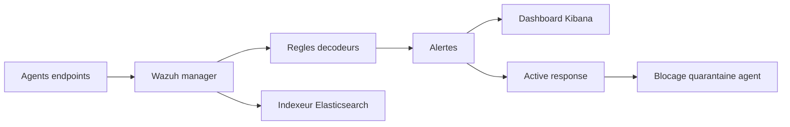

# 🛡️ Wazuh — Défense & SIEM

> [!info] **En 1 phrase**
> Wazuh est une plateforme **XDR/SIEM open source** (agent + manager) qui collecte logs,
> surveille l'intégrité des fichiers (**FIM**), détecte les anomalies et **réagit
> automatiquement** via des règles de décodage et des actions actives.

---

## 🧾 Overview

| Champ | Valeur |
|---|---|
| Nom complet | Wazuh Platform |
| Description | Plateforme XDR/SIEM open source : collecte de logs, FIM, détection de vulnérabilités, active response |
| Catégorie | 🛡️ IDS / SIEM / EDR |
| Sous-catégorie | SIEM / EDR / XDR |
| Fonction principale | Centraliser et corréler les événements de sécurité des endpoints (agent + manager) |
| Type d'outil | Serveur (manager) + agents + dashboard Kibana (WUI) |
| Licence | GPL-2.0 |
| Open source / propriétaire | Open source |
| Langage(s) de programmation | C, Python, Shell |
| Développeur / organisation | Wazuh Inc. |
| Projet officiel | Wazuh |
| Dépôt officiel | https://github.com/wazuh/wazuh |
| Documentation officielle | https://documentation.wazuh.com/current/ |
| Date de création | 2015 (fork d'OSSEC) |
| État du projet | actif (4.14.7 ; 5.0.0 Beta) |
| Dernière version connue | 4.14.7 (série 4.x) |
| Systèmes compatients | Linux, macOS, Windows (agents) ; manager sur Linux |
| Licences de la stack | GPL-2.0 (manager/agent), licence propre pour indexeur/dashboard |

> [!note] Pour vérifier / compléter
> Vérifier la dernière version stable (4.x) sur le site officiel ; la série 5.0 est en bêta et modifie l'architecture (indexeur et dashboard).

---

## 🎯 Concept

Wazuh = fork de **OSSEC** modernisé : un **manager** centralise les événements des **agents** installés sur les endpoints (Linux, Windows, macOS). Il combine : collecte de **logs** (`/var/log/auth.log`, Sysmon, Windows EventLog...), **FIM** (surveillance des fichiers sensibles : `/etc/passwd`, binaires, registre), détection de **vulnérabilités** (via les CVEs), **collecte de commandes** (règles qui exécutent des commandes et parsent la sortie) et **active response** (réaction automatique : bloquer une IP, tuer un processus). L'ensemble est visualisé dans un **tableau de bord Kibana** (dashboards SOC, décodage des événements). C'est la plateforme SIEM self-hosted la plus déployée du monde opensource.



---

## 🧠 Concepts fondamentaux

| Concept | Explication |
|---|---|
| Agent | Programme déployé sur l'endpoint qui collecte et envoie les événements |
| Manager | Serveur central qui décode, corrèle et alerte |
| Décodeur | Règle qui transforme un log brut en champs structurés |
| Règle | Condition (sur champs, regex PCRE2, groupes) qui déclenche une alerte |
| Niveau (level) | Gravité de l'alerte (0-15), pilote le tri et les réponses |
| FIM | File Integrity Monitoring : surveillance des fichiers/registre |
| Active response | Réaction automatique (blocage IP, kill process) déclenchée par une règle |
| Vulnerability detector | Module qui compare les paquets de l'agent à la base CVE |
| Groupes d'agents | Regroupement pour pousser des configurations différentes |
| ossec-logtest | Outil de test des logs contre les règles/décodeurs |
| SCA | Security Configuration Assessment : audit de configuration CIS |
| Cluster | Plusieurs managers reliés pour la haute disponibilité |

---

## 🛠️ Installation

### Manager (VM dédiée, Ubuntu/Debian — 8 Go RAM minimum)

```bash
# Installeur officiel : génère la config, puis -a pour tout déployer
curl -s https://packages.wazuh.com/4.x/wazuh-install.sh -o wazuh-install.sh
bash wazuh-install.sh --generate-config-files
bash wazuh-install.sh --install wazuh-indexer
bash wazuh-install.sh --install wazuh-server
bash wazuh-install.sh --install wazuh-dashboard
# Plus simple : bash wazuh-install.sh -a (all-in-one)
```

### Agent (à déployer sur les endpoints)

```bash
# Linux (apt)
curl -s https://packages.wazuh.com/4.x/apt/install.sh | bash
# configurer l'adresse du manager dans /var/ossec/etc/ossec.conf :
#   <server><address>10.10.20.15</address><port>1514</port><protocol>tcp</protocol></server>
sudo systemctl enable --now wazuh-agent
# Agent Windows : installer wazuh-agent.msi puis renseigner l'adresse du manager
# Agent macOS : .pkg via https://packages.wazuh.com/4.x/macos/
```

> [!warning] ⚠️ L'installeur officiel est **tout-en-un** (manager + indexeur + dashboard) : prévoir une VM dédiée (8 Go RAM minimum), sinon Elasticsearch sature et tout tombe.

---

## ⚙️ Configuration

| Fichier | Rôle | Emplacement | Exemple clé |
|---|---|---|---|
| `ossec.conf` (agent) | Configuration locale de l'agent | `/var/ossec/etc/ossec.conf` | `<directories>` FIM, `<localfile>` logs |
| `ossec.conf` (manager) | Modules, règles, active response | `/var/ossec/etc/ossec.conf` | `<command>`, `<active-response>` |
| `local_rules.xml` | Règles personnalisées | `/var/ossec/etc/rules/` | `<rule id="100050">` |
| `local_decoder.xml` | Décodeurs personnalisés | `/var/ossec/etc/decoders/` | `<decoder name="...">` |
| `agent.conf` (groupe) | Configs poussées aux agents | `/var/ossec/etc/shared/<groupe>/` | `<syscheck>` commun |
| `client.keys` | Identifiants des agents | `/var/ossec/etc/` | ID, name, key (secret) |

| Paramètre | Rôle | Exemple |
|---|---|---|
| `<directories check_all="yes">` | Chemins surveillés par le FIM | `/etc,/usr/bin,/usr/sbin` |
| `<localfile logformat="...">` | Sources de logs collectées | `syslog`, `eventchannel` |
| `<vulnerability-detector>` | Comparaison des paquets aux CVEs | `<provider name="canonical">` |
| `<active-response>` | Réaction automatique | `firewall-drop`, `restart-ossec` |
| `<command>` | Définition d'une réponse | `<executable>firewall-drop.sh</executable>` |
| `<cluster>` | Mode cluster du manager | `<name>wazuh-cluster</name>` |

---

## 🏗️ Architecture interne

Composants et flux :

- **Agent** : collecte (logs, FIM, commandes, SCA), chiffre et envoie vers le manager (port 1514/tcp).
- **Manager** : reçoit les événements, les décode (décodeurs), les matche contre les règles (moteur OSSEC), génère des **alertes** JSON et applique l'**active response**.
- **Indexeur (Elasticsearch)** : stocke et indexe les alertes.
- **Dashboard (Kibana)** : visualisation, dashboards SOC, alertes.
- **Filebeat** : transporte les alertes du manager vers l'indexeur.
- **Modules** : `wodles` (vulnerability-detector, syscollector, SCA), `syscheck` (FIM), `analysisd` (décodage), `remoted` (réception), `execd` (active response), `wazuh-db`.

Flux type : agent → remoted → analysisd (décodage + règles) → alerte JSON → filebeat → indexeur → dashboard. L'active response est déclenchée par analysisd via execd.

---

## ⌨️ Commandes

### Commandes principales (manager)

```bash
sudo wazuh-remoted --config          # état du manager (remote)
sudo /var/ossec/bin/agent_control -l   # liste des agents connectés
sudo tail -f /var/ossec/logs/alerts/alerts.json   # alertes en temps réel
sudo /var/ossec/bin/ossec-logtest     # tester un log contre règles/décodeurs
sudo systemctl status wazuh-manager wazuh-indexer wazuh-dashboard
```

### Commandes principales (agent)

```bash
sudo wazuh-agent -t                   # test de la configuration de l'agent
sudo systemctl status wazuh-agent     # état du service
sudo tail -f /var/ossec/logs/ossec.log
```

| Commande | Effet |
|---|---|
| `agent_control -l` | Liste les agents, leur ID, IP et statut de connexion |
| `agent_control -a -A <name> -I <ip>` | Ajouter un agent (Wazuh < 4.2) |
| `agent_control -r -u <agent_id>` | Re-déployer un agent |
| `agent_control -R -a` | Redémarrer tous les agents |
| `agent_groups -a -g <groupe> -q` | Assigner un agent à un groupe |
| `ossec-logtest` | Tester un log : règles et décodeurs déclenchés |
| `tail -f alerts.json` | Visualiser les alertes brutes (JSON) |

---

## 🎚️ Options et flags

| Option | Description | Exemple | Niveau |
|---|---|---|---|
| `-a` (installeur) | Installation all-in-one | `bash wazuh-install.sh -a` | Basic |
| `-l` (agent_control) | Lister les agents | `agent_control -l` | Basic |
| `-a -A -I` (agent_control) | Ajouter un agent | `agent_control -a -A web01 -I 10.10.20.20` | Basic |
| `-r -u <id>` | Re-déployer un agent | `agent_control -r -u 003` | Intermediate |
| `-g` (agent_groups) | Gérer les groupes | `agent_groups -l -g DMZ` | Intermediate |
| `-t` (wazuh-agent) | Tester la config | `wazuh-agent -t` | Basic |
| `--generate-config-files` | Générer la config | `wazuh-install.sh --generate-config-files` | Intermediate |
| `--install <component>` | Installer un composant | `--install wazuh-indexer` | Expert |

> [!tip] Options les plus utiles au quotidien
> `agent_control -l` pour le parc, `ossec-logtest` avant toute écriture de règle, `tail -f alerts.json` pour la supervision en direct.

---

## 🧪 Exemples pratiques

### Beginner

```bash
# Objectif : vérifier que l'agent est bien connecté
sudo /var/ossec/bin/agent_control -l
# Objectif : voir les alertes en direct
sudo tail -f /var/ossec/logs/alerts/alerts.json
```

### Intermediate

```bash
# Objectif : tester une règle personnalisée avant déploiement
sudo /var/ossec/bin/ossec-logtest
#   coller un log, Ctrl+D pour quitter
# Objectif : assigner un agent à un groupe
sudo /var/ossec/bin/agent_groups -a -g DMZ -q 003
```

### Advanced

```bash
# Objectif : extraire les alertes du jour pour un agent précis
sudo grep -i "10.10.20.20" /var/ossec/logs/alerts/alerts.json | head -50
# Objectif : relancer un agent à distance
sudo /var/ossec/bin/agent_control -r -u 003
```

### Expert

```bash
# Objectif : tester le décodeur d'un log format maison
sudo /var/ossec/bin/ossec-logtest -d apache-custom
# Objectif : purger un agent décommissionné
sudo /var/ossec/bin/manage_agents -r 003
```

---

## 🧪 Workflow complet (scénario pas à pas)

1. **Déployer le manager** (installeur officiel) puis **un agent** sur un poste.
2. **Activer le FIM** dans `/var/ossec/etc/ossec.conf` de l'agent :
   ```xml
   <syscheck>
     <directories check_all="yes">/etc,/usr/bin,/usr/sbin</directories>
   </syscheck>
   ```
3. **L'agent rapporte** les changements ; le manager décode et déclenche l'alerte (`syscheck: file changed`).
4. **Configurer l'active response** : sur le manager, une règle comme `active-response` dans `/var/ossec/etc/ossec.conf` :
   ```xml
   <command><name>firewall-drop</name><executable>firewall-drop.sh</executable></command>
   ```
   puis associer la réponse à une règle de détection (`<rule id="100001" level="6">`).
5. **Tester** : modifier `/etc/passwd` sur l'agent → voir l'alerte dans le dashboard Kibana et la réaction automatique (firewall-drop) si configurée.
6. **Intégrer des logs Windows** : activer Sysmon et configurer `<localfile>` pour `Microsoft-Windows-Sysmon/Operational`.

---

## 🎬 Scénarios avancés

### Scénario 1 : Détection de persistance via FIM ciblé
Surveiller les chemins où un post-exploit laisse des traces, et déclencher une alerte de niveau élevé.
```xml
<syscheck>
  <directories check_all="yes">/etc/systemd/system,/etc/cron.d,/var/spool/cron</directories>
  <directories check_all="yes">HKLM\SOFTWARE\Microsoft\Windows\CurrentVersion\Run</directories>
</syscheck>
```
Corréler avec une règle custom (niveau 10) pour remonter immédiatement en supervision.

### Scénario 2 : Règle personnalisée sur les événements Sysmon (Windows)
Détecter la création de processus PowerShell avec arguments suspects (Event ID 1).
```xml
<rule id="100050" level="8">
  <field name="win.eventdata.image">powershell.exe</field>
  <field name="win.eventdata.commandLine" type="pcre2">-enc |DownloadString|IEX\(</field>
  <description>PowerShell suspect</description>
</rule>
```
Activer le canal `Microsoft-Windows-Sysmon/Operational` dans le `<localfile>` de l'agent puis tester avec `ossec-logtest`.

### Scénario 3 : Détection de vulnérabilités sur les paquets installés
Le module `vulnerability-detector` compare les paquets de l'agent à la base CVE.
```xml
<vulnerability-detector>
  <enabled>yes</enabled>
  <interval>24h</interval>
  <provider name="canonical">
    <enabled>yes</enabled>
    <os>trusty,xenial,bionic,focal,jammy</os>
  </provider>
</vulnerability-detector>
```
Les alertes remontent les paquets vulnérables avec leurs CVE ; exporter la liste via la recherche du dashboard pour prioriser le patching.

### Scénario 4 : Supervision d'un parc avec groupes d'agents
Grouper les agents par zone (DMZ, prod, postes) pour pousser des configs différentes (FIM, active response).
```bash
sudo /var/ossec/bin/agent_groups -a -g DMZ -q        # assigner un groupe
sudo /var/ossec/bin/agent_groups -l -g DMZ           # lister les agents du groupe
# Les configs par groupe se placent dans /var/ossec/etc/shared/<groupe>/agent.conf
```

---

## 🛡️ Cybersecurity use cases

| Phase | Utilisation |
|---|---|
| SOC / Monitoring | Collecte et corrélation des logs de tous les endpoints |
| Détection | Règles et décodeurs sur les événements (auth, Sysmon, réseau) |
| DFIR | Recherche rapide dans les alertes, timeline d'incident |
| Compliance | SCA (audit CIS), FIM, rapports réglementaires |
| Patching | Vulnerability detector : priorisation des CVE |
| Réponse | Active response (blocage IP, quarantaine) |

---

## 🎯 MITRE ATT&CK

| Tactique | Technique / Sub-technique | ID | Raison | Détection | Mitigation |
|---|---|---|---|---|---|
| Initial Access | Valid Accounts | T1078 | Connexions anormales détectées dans auth.log/4625 | Règles brute force, geo-IP | MFA, contrôle des comptes |
| Execution | Command and Scripting Interpreter | T1059.001 | PowerShell/Shell suspects détectés (Sysmon, audit) | Règles PCRE2 sur commandLine | Application control |
| Persistence | Boot or Logon Autostart Execution | T1547.001 | Surveillance Run keys / systemd / cron | FIM sur ces chemins | Durcissement |
| Persistence | Event Triggered Execution | T1546 | Fichiers cron/systemd modifiés (crontab) | FIM + règle niveau 10 | Durcissement |
| Defense Evasion | Impair Defenses | T1562 | Agent désinstallé, service arrêté | agent_control, heartbeat, alertes déconnexion | Protection des agents |
| Discovery | Query Registry | T1012 | Lecture/écriture suspecte du registre | FIM HKLM, audit | Surveillance du registre |

> [!note] Ne renseigner que si l'association est réellement pertinente.
> Wazuh est un outil **défensif** : les mappings décrivent les attaques qu'il permet de détecter et de mitiger.

---

## 🛡️ Defensive Security

### Signes observables

| Indicateur | Détail |
|---|---|
| Agent Wazuh désinstallé ou service arrêté (trous de détection) | Supervision `agent_control -l`, alertes « agent disconnected », heartbeat |
| Règles/décodeurs non testés qui produisent des faux positifs | Tester avec `ossec-logtest`, versionner le ruleset, revue avant déploiement |
| Active response trop agressif (blocage IP légitime) | Passer en mode simulation d'abord, whitelist des IP critiques |
| Saturation de l'indexeur Elasticsearch | Planifier les ressources, gérer les index (rotation), séparer les rôles |
| Paquets vulnérables non patchés remontés par le module | Intégrer un processus de priorisation CVE + fenêtre de patch |
| Logs Windows non collectés (canal Sysmon absent) | Configurer `<localfile>` eventchannel + activer Sysmon |

### Règles de détection (Sigma)

```yaml
# Sigma — détection d'un brute force SSH côté agent Wazuh
title: SSH Brute Force Multiple Failed Logins
id: 1f2a3b4c-5d6e-7f80-9a1b-2c3d4e5f6a7b
status: experimental
logsource:
    category: authentication
    product: linux
detection:
    selection:
        process: sshd
        message|contains: 'Failed password'
    condition: selection | count() > 5
falsepositives:
    - Scripts de supervision
level: medium
```

---

## 🤖 Automatisation

```bash
# Bash — relancer tous les agents et extraire le parc
sudo /var/ossec/bin/agent_control -R -a
sudo /var/ossec/bin/agent_control -l | awk '{print $1, $2}' > agents.txt
```

```python
# Python — analyser les alertes JSON du manager
import json

with open("alerts.json") as f:
    for line in f:
        try:
            a = json.loads(line)
            if a.get("rule", {}).get("level", 0) >= 10:
                print(a["timestamp"], a["rule"]["id"], a["agent"]["name"])
        except ValueError:
            pass
```

```bash
# Intégration alertes → webhook (ex : Slack, Mattermost)
# dans ossec.conf du manager
<active-response>
  <command>curl</command>
  <executable>curl -k -H 'Content-Type: application/json' \
    -d @/var/ossec/tmp/alert.json https://hooks.slack.com/services/xxx</executable>
  <rules>100050</rules>
</active-response>
```

---

## 📤 Output et parsing

Les alertes sont écrites en **JSON** dans `/var/ossec/logs/alerts/alerts.json` (chaque ligne = une alerte) et indexées dans Elasticsearch. Chaque alerte contient : `timestamp`, `rule` (id, level, description), `agent` (name, id, ip), `data` (champs décodés), `location`.

```bash
# Filtrer les alertes critiques de la dernière heure
sudo grep '"level":1[0-9]' /var/ossec/logs/alerts/alerts.json | tail -20
# Compter les alertes par ID
sudo jq -r '.rule.id' /var/ossec/logs/alerts/alerts.json | sort | uniq -c | sort -rn
```

```python
# Python — parser les alertes
import json

with open("alerts.json") as f:
    for line in f:
        a = json.loads(line)
        if a["rule"]["level"] >= 12:
            print(a["agent"]["name"], a["rule"]["id"], a.get("full_log", "")[:100])
```

---

## 🔗 Intégrations

```text
Wazuh agent → manager (1514/tcp) → Filebeat → Elasticsearch (indexeur) → Kibana
Wazuh ← virus total (hash lookup) ← virustotal module
Wazuh → MITRE ATT&CK (cartes de couverture des règles)
Wazuh → MISP (échange d'IOCs via API) → corrélation
Wazuh → YARA (scan de fichiers via module intégré) → détection
Wazuh → Suricata (intégration des alertes IDS réseau)
Wazuh → API REST (agents, règles, recherche) → automatisation
```

- [[Tools|🧰 Outils]]
- [[Outil - Elastic]] — indexation et recherche des alertes
- [[Outil - Suricata]] — alertes réseau intégrées dans le dashboard
- [[Outil - YARA]] — module de scan de fichiers sur les agents
- [[Outil - MISP]] — échange d'IOCs
- [[Outil - Sigma]] — règles génériques transposables dans Wazuh
- [[Outil - osquery]] — inventaire et interrogation des endpoints
- [[Techniques/Privilege Escalation Windows|🕹️ Privesc Windows]] · [[Techniques/Privilege Escalation Linux|🕹️ Privesc Linux]] · [[Techniques/Reverse Shells|🕸️ Reverse Shells]]

---

## 🔄 Alternatives

| Outil | Avantages | Inconvénients | Cas d'usage |
|---|---|---|---|
| Wazuh | Open source, agent+manager complet, FIM+SIEM | Courbe d'apprentissage, ressources indexeur | SIEM/EDR self-hosted |
| Splunk | Puissant, écosystème, apps | Coût par volume de données | Grande entreprise |
| Elastic SIEM | Intégration Elasticsearch/Kibana | Détections à construire | Lab Elastic |
| Graylog | Centralisation logs rapide | Peu de fonctions FIM/EDR | Log management |
| osquery | Interrogation en temps réel | Pas de règles natives | Inventaire |

> **Quand utiliser Wazuh plutôt qu'un autre ?** Pour une **plateforme SIEM/EDR open source complète** avec FIM, vulnérabilités et active response dans un seul produit.

---

## ⚡ Performance

- **Ressources manager** : 8 Go RAM minimum recommandés (indexeur + dashboard + manager).
- **Agents** : légers en collecte ; le FIM sur de gros répertoires consomme du CPU/IO (intervalle de scan à régler).
- **Indexeur** : le volume d'alertes (et de logs) détermine l'espace disque ; prévoir la rotation des index.
- **Cluster** : les gros parcs nécessitent plusieurs nœuds (indexeur, manager, dashboard séparés).
- **Fréquence FIM** : réduire `<directories>` à l'essentiel pour limiter la charge.
- **Active response** : s'applique par agent : éviter les commandes lourdes côté manager.

> [!note] À vérifier
> Les besoins réels dépendent du nombre d'agents et du volume de logs : tester en lab avec un volume représentatif avant production.

---

## 🛠️ Troubleshooting

### Common problems

#### Problème : l'agent ne se connecte pas au manager

- **Cause** : mauvaise adresse/port dans `<server>`, clé non enregistrée, pare-feu.
- **Solution** : vérifier `ossec.conf`, enregistrer l'agent (`manage_agents`), ouvrir le port 1514.
- **Vérification** : `sudo /var/ossec/bin/agent_control -l` et `tail -f /var/ossec/logs/ossec.log`.

#### Problème : l'installeur échoue (composants partiels)

- **Cause** : ressources insuffisantes, version incompatible, installation non atomique.
- **Solution** : purger et relancer sur une VM dédiée avec la RAM requise.
- **Vérification** : `systemctl status wazuh-manager wazuh-indexer wazuh-dashboard`.

#### Problème : aucune alerte FIM

- **Cause** : FIM désactivé, chemin incorrect, niveaux de règle trop bas.
- **Solution** : vérifier `<syscheck>`, tester avec `ossec-logtest`.
- **Vérification** : modifier un fichier surveillé et observer `alerts.json`.

#### Problème : fausses alertes (faux positifs)

- **Cause** : règles trop larges, décodeurs erronés, bruit légitime.
- **Solution** : ajuster avec `ossec-logtest`, affiner les règles (id, level).
- **Vérification** : compter les alertes par ID (`jq`).

#### Problème : le dashboard ne charge pas

- **Cause** : indexeur HS, filebeat arrêté, certificats expirés.
- **Solution** : vérifier les services et la génération des certificats (`wazuh-install.sh --generate-certificates`).
- **Vérification** : `systemctl status wazuh-filebeat` et les logs Kibana.

---

## 🔐 Sécurité de l'outil

- **Réseau** : le port 1514 (agents→manager) doit être restreint aux IP des agents.
- **Certificats** : l'installeur génère des certificats ; surveiller leur expiration.
- **`client.keys`** : les clés des agents sont sensibles ; protéger `/var/ossec/etc/client.keys`.
- **API** : activer l'authentification et limiter les accès au dashboard (IP + MFA).
- **Dashboard** : ne jamais exposer Kibana sur l'Internet ; utiliser un reverse proxy + TLS.
- **Données** : les alertes contiennent des logs potentiellement sensibles : protéger les backups de l'indexeur.
- **Posture** : Wazuh est défensif, mais son API peut être abusée si exposée : surveiller l'accès.

---

## ⚠️ Limitations

- **Ressources** : l'indexeur Elasticsearch exige une VM dédiée et dimensionnée.
- **FIM sur gros volumes** : scan coûteux si les chemins surveillés sont trop larges.
- **Décodage** : les formats de logs non couverts nécessitent des décodeurs maison (fragiles).
- **Active response** : limité aux actions prédéfinies ; risque de faux positifs.
- **Vulnerability detector** : dépend de la fraîcheur des bases CVE (légère latence).
- **Windows profond** : moins riche que des EDR commerciaux (règle Sigma/Sysmon à écrire soi-même).
- **5.0 en bêta** : la nouvelle architecture (indexeur remplacé par Wazuh Indexer) peut comporter des régressions.

---

## 📋 Cheatsheet

```bash
# État et parc
sudo systemctl status wazuh-manager wazuh-indexer wazuh-dashboard
sudo /var/ossec/bin/agent_control -l
sudo /var/ossec/bin/agent_control -R -a

# Alertes
sudo tail -f /var/ossec/logs/alerts/alerts.json
sudo jq -r '.rule.id' /var/ossec/logs/alerts/alerts.json | sort | uniq -c

# Test règles
sudo /var/ossec/bin/ossec-logtest

# Groupes
sudo /var/ossec/bin/agent_groups -a -g DMZ -q 003
sudo /var/ossec/bin/agent_groups -l -g DMZ

# Agent
sudo wazuh-agent -t
sudo systemctl restart wazuh-agent
sudo tail -f /var/ossec/logs/ossec.log

# FIM (agent)
# <syscheck><directories check_all="yes">/etc,/usr/bin,/usr/sbin</directories></syscheck>
```

---

## ⚡ Quick reference

| | |
|---|---|
| **À quoi sert-il ?** | SIEM/EDR open source : logs, FIM, vulnérabilités, active response |
| **Quand l'utiliser ?** | SOC, supervision de parc, compliance, détection hôte |
| **Commande principale** | `agent_control -l` + `tail -f alerts.json` |
| **Alternative principale** | Splunk, Elastic SIEM, Graylog |
| **Concepts importants** | Agent, manager, décodeur, règle, FIM, active response, vulnérabilités |
| **Liens associés** | [[Outil - Elastic]] · [[Outil - Suricata]] · [[Outil - YARA]] · [[Outil - MISP]] |

---

## 🔍 Détection & Défense

| Signe | Défense |
|---|---|
| Agent Wazuh désinstallé ou service arrêté (trous de détection) | Supervision `agent_control -l`, alertes « agent disconnected », heartbeat |
| Règles/décodeurs non testés qui produisent des faux positifs | Tester avec `ossec-logtest`, versionner le ruleset, revue avant déploiement |
| Active response trop agressif (blocage IP légitime) | Passer en mode simulation d'abord, whitelist des IP critiques |
| Saturation de l'indexeur Elasticsearch | Planifier les ressources, gérer les index (rotation), séparer les rôles |
| Paquets vulnérables non patchés remontés par le module | Intégrer un processus de priorisation CVE + fenêtre de patch |

---

## ⚠️ Tips & Pièges

> [!tip] 💡 **FIM = détecter la persistance**
> Surveille les fichiers de **persistance** (`/etc/systemd/system`, `HKCU\...\Run`, crontab) : c'est là qu'un post-exploit laisse ses traces. Ajoute-les à `<directories>` dès le premier jour.
>
> **Débugguer une règle** : `sudo /var/ossec/bin/ossec-logtest` permet de coller un log et de voir quelle règle il déclenche — indispensable avant d'écrire un décodeur maison.

> [!warning] ⚠️ **Piège** : l'installeur officiel est **tout-en-un** (manager + Elasticsearch + Kibana). Ne pas le lancer sur une VM de prod partagée : la charge Elasticsearch + indexeur exige une VM dédiée (8 Go RAM minimum), sinon tout tombe.

---

## 📚 References

### Official

- Site officiel Wazuh : https://wazuh.com/
- Documentation Wazuh (4.x) : https://documentation.wazuh.com/current/
- Règles et décodeurs par défaut : https://github.com/wazuh/wazuh-ruleset
- Dépôt GitHub : https://github.com/wazuh/wazuh

### Security references

- MITRE ATT&CK T1078 — Valid Accounts : https://attack.mitre.org/techniques/T1078/
- MITRE ATT&CK T1059.001 — PowerShell : https://attack.mitre.org/techniques/T1059/001/
- MITRE ATT&CK T1547.001 — Registry Run Keys : https://attack.mitre.org/techniques/T1547/001/

### Community

- Wazuh Community : https://wazuh.com/community/
- Wazuh RSS feed des alertes : https://github.com/wazuh/wazuh-ruleset/tree/master/rules

---

➡️ **Liens :** [[Tools|🧰 Outils]] · [[Techniques/Privilege Escalation Windows|🕹️ Privesc Windows]] · [[Techniques/Privilege Escalation Linux|🕹️ Privesc Linux]] · [[Techniques/Reverse Shells|🕸️ Reverse Shells]]
