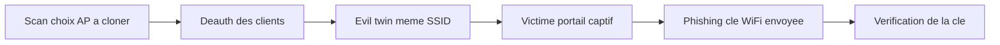

# 📡 Wifiphisher — Wireless & Réseau

> [!info] **En 1 phrase**
> Outil d'**evil twin / rogue AP** qui clône un réseau WiFi et sert un **portail captif de phishing** (templates de « mise à jour du routeur », de login, etc.) pour voler la passphrase WPA ou des identifiants — la pièce maîtresse du social engineering WiFi.

---

## 🧾 Overview

| Champ | Valeur |
|---|---|
| Nom complet | wifiphisher |
| Description | Framework de rogue AP / evil twin : clône le SSID d'une cible, déauthentifie ses clients et sert un portail captif de phishing (templates « firmware update », login, connectivity check…) |
| Catégorie | 📡 Wireless & Réseau |
| Sous-catégorie | Attaque WiFi (social engineering / evil twin) |
| Fonction principale | Vol de passphrase WPA/WPA2 et d'identifiants via portail captif |
| Type d'outil | Framework (Python + binaires externes hostapd/dnsmasq/aircrack-ng) |
| Licence | GPL-3.0 |
| Open source / propriétaire | Open source |
| Langage(s) de programmation | Python 3 (PyRIC pour la gestion des interfaces) |
| Développeur / organisation | George Chatzisofroniou (sophron) et contributeurs |
| Projet officiel | Wifiphisher (wifiphisher/wifiphisher) |
| Dépôt officiel | https://github.com/wifiphisher/wifiphisher |
| Documentation officielle | https://wifiphisher.org/ |
| Date de création | 2014 (premières versions publiques) |
| État du projet | maintenu (paquet Kali `1.4+git20260522` en 2026) |
| Dernière version connue | v1.4 (Kali : 1.4+git20260522) |
| Systèmes compatibles | Linux (Kali, Arch, Debian…) ; macOS partiel via brew (hostapd/dnsmasq) |

> [!note] Pour vérifier / compléter
> Wifiphisher est développé et maintenu côté `wifiphisher/wifiphisher` (dépôt actif) ; l'historique du projet est lié à `sophron/wifiphisher`. Vérifier la version avec `wifiphisher --version` et la liste des templates dans `templates/`.

---

## 🎯 Concept

`wifiphisher` crée un **point d'accès jumeau** portant le SSID de la victime : le client se connecte au faux AP (souvent via une deauth du vrai) et reçoit un **portail captif** prêt à l'emploi. Les **templates** (`firmware-update`, `login`, `connectivity-check`, `wifi-password`, `oauth-login`, …) imitent les messages légitimes (ex: « firmware du routeur à mettre à jour, entrez la clé WiFi »). Une fois la passphrase récoltée, il vérifie qu'elle correspond bien au vrai réseau avant de l'afficher.

Complémentaire d'`airbase-ng`/`hostapd` manuels, il automatise tout le scénario : scan, deauth, hostapd, dnsmasq, iptables et le portail. Dans un pentest, c'est la pièce de **social engineering** du WiFi : on n'attaque pas le protocole mais l'utilisateur. Deux grandes familles de cibles : la **passphrase WPA** (templates `firmware-update`, `wifi-password`) et les **identifiants de comptes** (templates `login`, `oauth-login`).



---

## 🧠 Concepts fondamentaux

| Concept | Explication |
|---|---|
| Rogue AP | Point d'accès non autorisé créé par l'attaquant (même SSID que la cible) |
| Evil twin | Rogue AP « jumeau » : même ESSID, BSSID différent → le client ne distingue pas |
| Portail captif | Page web affichée avant l'accès réseau (login, mise à jour, acceptation) |
| Deauth / association flooding | Déconnecte les clients du vrai AP pour les faire basculer sur le faux |
| hostapd | Démon qui transforme l'interface en point d'accès (WPA-PSK, WPA2) |
| dnsmasq | Serveur DNS/DHCP du faux réseau : redirige tout vers le portail |
| iptables / netfilter | Redirection/routage du trafic des clients du rogue AP |
| Template | Scénario de phishing prêt à l'emploi dans `templates/` (HTML + config) |
| Connectivity check | Sonde réseau (Android/Apple) que Wifiphisher imite pour ouvrir le portail automatiquement |
| PyRIC | Librairie Python de contrôle des interfaces réseau (modes, canaux) |
| Vérification de clé | Après récolte, Wifiphisher teste la passphrase contre le vrai AP (handshake) avant de l'afficher |

---

## 🛠️ Installation

### Debian / Ubuntu / Kali Linux

```bash
sudo apt update && sudo apt install -y wifiphisher
# Kali : souvent préinstallé ; dépendances : hostapd, dnsmasq, aircrack-ng, iptables
wifiphisher --version
```

### Arch Linux

```bash
sudo pacman -S wifiphisher
```

### Fedora / RHEL

```bash
sudo dnf install wifiphisher
```

### macOS

```bash
# macOS n'est pas la cible principale : installer hostapd + dnsmasq via brew,
# puis exécuter depuis le dépôt (fonctionnalité variable selon le driver)
brew install hostapd dnsmasq
git clone https://github.com/wifiphisher/wifiphisher.git && cd wifiphisher
sudo python3 setup.py install
```

### Windows

```powershell
# Non supporté : pas de mode moniteur/hostapd fiable sous Windows
# Utiliser Kali native ou une VM avec une carte USB compatible
```

### Docker

```bash
# Déconseillé : wifiphisher pilote directement les interfaces radio (hostapd/dnsmasq sur la machine hôte)
```

### Compilation depuis les sources

```bash
git clone https://github.com/wifiphisher/wifiphisher.git && cd wifiphisher
sudo python3 setup.py install
# vérifier : wifiphisher --version
```

> [!warning] ⚠️ Prérequis & problèmes potentiels
> - Deux cartes Wi-Fi recommandées : une pour le rogue AP (`-aI`), une pour la deauth/écoute (`-eI`).
> - Dépendances `hostapd`, `dnsmasq`, `aircrack-ng`, `iptables` : le `setup.py` les installe sur Kali.
> - Driver compatible **monitor mode + AP mode** (hostapd) : toutes les cartes ne supportent pas le mode AP simultané.
> - La vérification de la clé récoltée nécessite `aircrack-ng` fonctionnel.

---

## ⚙️ Configuration

Wifiphisher se configure **en ligne de commande** ; les templates (textes, langues, pages) sont **personnalisables** dans `templates/`.

| Paramètre | Rôle | Valeur possible | Impact | Exemple |
|---|---|---|---|---|
| `-aI <iface>` | Interface du rogue AP | `wlan0` | Porte le faux SSID | `-aI wlan0` |
| `-eI <iface>` | Interface de deauth/écoute | `wlan1` | Stabilise la deauth | `-eI wlan1` |
| `-e <essid>` | SSID à cloner | nom | Cible directe (sinon menu) | `-e "Freebox-ABC"` |
| `-p <template>` | Template du portail | `firmware-update`, `login`, … | Type de phishing | `-p firmware-update` |
| `--essids <liste>` | Plusieurs SSID clonés | `A,B,C` | Capture multi-cibles | `--essids "Box-A,Box-B"` |
| `--dns <ip>` | DNS servi aux clients | IP | Résolution du portail | `--dns 8.8.8.8` |
| `--logging` | Journalise creds + appareils | on/off | Rapport d'audit | `--logging` |
| `--no-deauth` | Pas de perturbation du vrai AP | on/off | Capture passive | `--no-deauth` |
| `-q` | Mode silencieux | on/off | Moins de sortie | `-q` |
| `-h / --help` | Aide | — | Options et exemples | `wifiphisher -h` |

---

## 🏗️ Architecture interne

Wifiphisher orchestre un ensemble de binaires Linux autour d'un noyau Python :

1. **Scan & sélection** — PyRIC passe la carte en mode moniteur, scanne les AP (beacons/probes) et présente les cibles (ou `-e` fixe directement le SSID).
2. **Création du rogue AP** — `hostapd` configure la carte en mode AP avec le **même ESSID** que la cible (le BSSID diffère : MAC de l'attaquant). Le faux réseau peut être en clair ou WPA-PSK selon le template.
3. **DHCP/DNS** — `dnsmasq` sert le réseau du rogue AP : les clients reçoivent une IP, et **toutes** leurs requêtes DNS pointent vers le portail captif.
4. **Deauth** — `aireplay-ng` (sur l'interface `-eI`) déconnecte les clients du vrai AP pour les forcer à se connecter au jumeau. `--no-deauth` désactive cette étape.
5. **Portail captif** — un serveur web Python sert le template choisi : chaque requête renvoie la page de phishing (firmware-update, login, connectivity-check…).
6. **Capture & vérification** — les données saisies (passphrase ou identifiants) sont enregistrées (`--logging`). Pour la passphrase, wifiphisher capture le handshake du vrai réseau et **teste la clé** ; si valide, il l'affiche (et peut mettre fin au portail).
7. **Nettoyage** — à l'arrêt (Ctrl-C), les règles iptables, hostapd et dnsmasq sont restaurés proprement.

Les templates sont des dossiers HTML statiques + fichiers de config (langues, prix, captures) interprétés par le serveur du portail.

---

## ⌨️ Commandes

### Commandes principales

```bash
sudo wifiphisher
sudo wifiphisher -aI wlan0 -e "Freebox-ABC" -p firmware-update
```

| Commande | Objectif | Résultat attendu |
|---|---|---|
| `wifiphisher` | Assistant interactif complet | Menu scan → cible → template → attaque |
| `wifiphisher -aI wlan0 -e <ssid> -p <template>` | Cible + template directs | Rogue AP actif, portail servi |
| `wifiphisher … --logging` | Journaliser creds/appareils | Fichier de rapport détaillé |
| `wifiphisher … --no-deauth` | Sans perturbation du vrai AP | Capture passive (client volontaire) |
| `wifiphisher … --essids A,B,C` | Multi-SSID | Plusieurs jumeaux simultanés |
| `wifiphisher --help` | Aide | Liste des options et templates |

### Commandes avancées

```bash
# Deux cartes : AP sur wlan0, deauth sur wlan1, template oauth
sudo wifiphisher -aI wlan0 -eI wlan1 -e "Espresso-2.4GHz" -p oauth-login --logging

# Template wifi-password sans deauth (scope restrictif)
sudo wifiphisher -aI wlan0 -e "Freebox-ABC" -p wifi-password --no-deauth
```

---

## 🎚️ Options et flags

| Option | Description | Exemple | Niveau |
|---|---|---|---|
| `-aI <iface>` | Interface rogue AP | `-aI wlan0` | Basic |
| `-e <essid>` | SSID cible | `-e "Box-1234"` | Basic |
| `-p <template>` | Template du portail | `-p firmware-update` | Basic |
| `-eI <iface>` | Interface deauth | `-eI wlan1` | Intermediate |
| `--essids <liste>` | Multi-SSID | `--essids "A,B"` | Intermediate |
| `--dns <ip>` | DNS du portail | `--dns 8.8.8.8` | Intermediate |
| `--logging` | Journalisation | `--logging` | Intermediate |
| `--no-deauth` | Pas de deauth | `--no-deauth` | Advanced |
| `-q` | Silencieux | `-q` | Advanced |
| `--options` | Options avancées du portail | `--options` | Expert |
| `-h` | Aide | `-h` | Basic |

> [!tip] Options les plus utiles au quotidien
> - `-aI` + `-eI` : deux cartes pour un scénario stable (AP et deauth séparés).
> - `-p` : le choix du template détermine le type de cible (clé WiFi vs comptes).
> - `--logging` : à activer systématiquement pour documenter un test autorisé.
> - `--no-deauth` : quand le scope interdit la perturbation du réseau réel.

---

## 🧪 Exemples pratiques

### Beginner

```bash
# Objectif : premier lancement interactif
sudo wifiphisher
# Suivre l'assistant : choisir l'AP cible, puis un template
```

Résultat attendu : création d'un AP jumeau et d'un portail ; tout client qui s'y connecte reçoit la page de phishing. Erreur fréquente : une seule carte → l'AP et la deauth se disputent l'interface (utiliser `-eI` ou `--no-deauth`).

### Intermediate

```bash
# Objectif : clé WPA2 d'une box via template « firmware update »
sudo wifiphisher -aI wlan0 -e "Box SFR-4567" -p firmware-update --logging
# Quand la victime entre la clé, wifiphisher vérifie puis affiche : WPA key: ********
```

### Advanced

```bash
# Objectif : voler des identifiants de comptes via un faux login
sudo wifiphisher -aI wlan0 -eI wlan1 -e "Corporate-Guest" -p oauth-login --logging
# Le portail imite une connexion sociale ; les identifiants + MAC sont journalisés
```

### Expert

```bash
# Objectif : personnaliser un template (langue, fournisseur)
cp -r /usr/share/wifiphisher/templates/firmware-update ~/templates/freebox-update
# Éditer les fichiers HTML/JS du template copié, puis :
sudo wifiphisher -aI wlan0 -e "Freebox-ABC" -p freebox-update --logging
```

---

## 🧪 Workflow complet (scénario pas à pas)

**Scénario : récupérer la clé WPA2 d'une "Box SFR-4567".**

1. **Lancer wifiphisher** en choisissant la cible et le template « update firmware » :
   ```bash
   sudo wifiphisher -aI wlan0 -e "Box SFR-4567" -p firmware-update
   ```
2. Wifiphisher crée le **même SSID**, déauthentifie les clients du vrai AP et attend les connexions.
3. Un client se connecte au faux AP et voit le portail « firmware à mettre à jour ».
4. La victime saisit sa **passphrase WiFi** → wifiphisher vérifie la clé contre le vrai AP puis affiche :
   ```
   WPA key: ********
   ```
5. Arrêter proprement l'outil (Ctrl-C) : il restaure iptables, hostapd et dnsmasq.

---

## 🎬 Scénarios avancés

### Scénario 1 : Template « oauth-login » pour voler des identifiants de comptes

Au lieu de la passphrase, le portail imite un écran de connexion Google/Office 365 pour récolter login + mot de passe.

```bash
sudo wifiphisher -aI wlan0 -e "Espresso-2.4GHz" -p oauth-login --logging
# Les identifiants sont journalisés avec l'adresse MAC de l'appareil
```

### Scénario 2 : Attaque multi-SSID (capture en masse)

Cloner plusieurs SSID simultanément pour augmenter les chances d'attraper un client.

```bash
sudo wifiphisher -aI wlan0 -eI wlan1 --essids "Box-A,Box-B,Box-C" -p wifi-password
# Utiliser -eI pour stabiliser la deauth sur une seconde carte
```

### Scénario 3 : Contournement de la page « connectivity-check »

Forcer les clients (smartphones surtout) à passer par le portail en imitant la sonde de connectivité Android/Apple.

```bash
sudo wifiphisher -aI wlan0 -e "Livebox-ABCD" -p connectivity-check
# Le téléphone considère le réseau "captif" et ouvre automatiquement le portail
```

### Scénario 4 : Template « firmware-update » sur un réseau entreprise

Cloner le SSID du bureau et demander la clé sous prétexte d'une mise à jour de sécurité.

```bash
sudo wifiphisher -aI wlan0 -e "Corporate-Corp" -p firmware-update --essids "Corporate-Corp,Corporate" --logging
# Les appareils en roaming (après deauth) retombent sur le faux AP
# --logging journalise appareils + credentials pour le rapport de test
```

### Scénario 5 : Template « wifi-password » sans deauth (capture passive)

```bash
sudo wifiphisher -aI wlan0 -e "Freebox-ABC" -p wifi-password --no-deauth
# Pas de perturbation du vrai AP : on attend qu'un client se connecte au faux réseau
# Utile si l'attaque active est interdite par le scope
```

---

## 🛡️ Cybersecurity use cases

| Phase | Utilisation |
|---|---|
| Reconnaissance | Scan des AP voisins (beacons, clients) pour choisir la cible |
| Exploitation | Rogue AP / evil twin : portail captif de phishing |
| Credential access | Vol de passphrase WPA ou d'identifiants (login/OAuth) |
| Initial access | Connexion au réseau de la victime avec la clé obtenue |
| Red team | Simulation de scénarios de social engineering réalistes |

---

## 🎯 MITRE ATT&CK

| Tactique | Technique / Sub-technique | ID | Raison | Détection | Mitigation |
|---|---|---|---|---|---|
| Initial Access | Phishing : Service de phishing (faux AP) | T1566.002 | Portail captif imitant un fournisseur/logiciel | WIDS (AP jumeau), sensibilisation | WIDS, avertissements utilisateurs |
| Credential Access | Input Capture : Web Portal Capture | T1056.003 | Le portail capte la saisie de la passphrase/identifiants | Détection AP rogue, revue des certificats | Sensibilisation, 802.1X |
| Collection | Data from Local System / réseau | T1005 | Journalisation des identifiants et MAC capturés | DLP, journaux | Politique de mots de passe, MFA |
| Impact | Wi-Fi Disassociation | T1466 | Deauth des clients du vrai AP (etape de bascule) | WIDS : spikes de deauth | WIDS, WPA3/SAE |
| Command & Control (adjacent) | Rogue AP pour interception | T1557 (AiTM) | Le rogue AP permet un MITM complet des clients | WIDS, contrôle des BSSID | WPA3/SAE, 802.1X |

> [!note] Ne renseigner que si l'association est réellement pertinente.
> Wifiphisher est du **phishing WiFi** : T1566.002 (faux service web) et T1056.003 (capture de saisie) sont ses associations centrales, avec T1466 pour la bascule.

---

## 🛡️ Defensive Security

### Signes observables

| Indicateur | Détail |
|---|---|
| Deux AP avec le même ESSID mais des BSSID différents | Signature d'evil twin (détection par WIDS/inventaire) |
| Deauth massives répétées sur le réseau | Phase de bascule des clients |
| Portail captif demandant la passphrase WiFi | Jamais légitime en entreprise/domicile |
| Certificat TLS invalide ou domaine inhabituel sur le portail | Contrôle des certificats |
| OUI inconnu sur un BSSID « jumeau » | Comparer l'OUI avec l'inventaire des AP |
| SSID dupliqués observés lors d'un scan WiFi | Chasse aux AP jumeaux régulière |

### Règles de détection (Sigma / Suricata / Snort / YARA)

```yaml
# Exemple Sigma : détection d'un portail captif inattendu (réseau interne)
title: Rogue AP / Wifiphisher Captive Portal
id: c3d4e5f6-0006-4c00-d000-000000000006
status: experimental
description: Réponse HTTP de type portail captif (début de session) vers un client interne
logsource:
  category: proxy
  product: suricata
detection:
  selection:
    http.status_code: 200
    http.response_body|contains: ["firmware", "update", "password", "key"]
  condition: selection and event_type == http
level: medium
```

```bash
# Exemple Suricata/Snort : tentative de connexion à un AP non référencé
alert wlan any any -> any any (msg:"Possible evil twin - SSID duplication"; \
  wlan.fc.type_subtype:8; classtype:attempted-recon; sid:1000006; rev:1;)
```

---

## 🤖 Automatisation

```bash
# Exemple : script d'audit social engineering (test autorisé, période contrôlée)
#!/bin/bash
# /usr/local/bin/evil-twin-audit.sh <essid> <template>
ESSID=$1; TEMPLATE=$2
echo "[*] Lancement du rogue AP sur $ESSID (template $TEMPLATE)"
timeout 3600 sudo wifiphisher -aI wlan0 -eI wlan1 \
  -e "$ESSID" -p "$TEMPLATE" --logging
echo "[*] Fin de session - rapports dans le dossier de logs wifiphisher"
```

```python
#!/usr/bin/env python3
# Objectif : vérifier la présence d'un AP « jumeau » pendant un test
import subprocess

def scan_essids(iface="wlan1mon"):
    out = subprocess.check_output(
        ["airodump-ng", iface], text=True, timeout=30, stderr=subprocess.DEVNULL
    )
    seen = {}
    for line in out.splitlines():
        if "," in line and "ESSID" not in line:
            parts = [p.strip() for p in line.split(",")]
            if len(parts) >= 14:
                bssid, _, channel, _, _, enc, _, essid = parts[0], parts[1], parts[3], parts[4], parts[5], parts[6], parts[7], parts[13]
                seen.setdefault(essid, []).append((bssid, channel))
    for essid, aps in seen.items():
        if len(aps) > 1:
            print(f"[!] ESSID dupliqué : {essid} -> {aps}")

scan_essids()
```

---

## 📤 Output et parsing

La sortie console donne l'état de l'attaque ; les **credentials et appareils** sont journalisés avec `--logging` (fichiers texte/dossier de logs). La passphrase trouvée est **vérifiée** puis affichée :

```text
[+] WPA key: ********
[+] Confirmed on target network
```

```bash
# Lire les logs de la session (Kali)
ls /usr/share/wifiphisher/ 2>/dev/null
find / -name "*wifiphisher*log*" 2>/dev/null

# Extraire les clés capturées d'un rapport
grep -r "WPA key" /var/log/wifiphisher/ 2>/dev/null
```

```python
# Exemple de parsing : identifier les appareils (MAC) capturés dans les logs
import re
with open("wifiphisher.log") as fh:
    macs = sorted(set(re.findall(r"([0-9A-F]{2}(?::[0-9A-F]{2}){5})", fh.read())))
for mac in macs:
    print(mac)
```

---

## 🔗 Intégrations

```text
wifiphisher (rogue AP) → portail captif → passphrase → connexion au réseau cible
wifiphisher (deauth) ← aireplay-ng / mdk4 → bascule des clients
wifiphisher (templates) ← personalisation → scripts d'audit social engineering
wifiphisher → rapport (--logging) → SIEM / documentation d'audit
```

- [[Tools|🧰 Outils]]
- [[Outil - aircrack-ng]] — capture/vérification du handshake (validation de la clé récoltée)
- [[Outil - mdk4]] — deauth massive en amont de la bascule
- [[Outil - bettercap]] — MITM/appui du scénario (dns.spoof vers le portail)
- [[Outil - Wifite]] — automatisation d'autres vecteurs (WPS, handshake)

---

## 🔄 Alternatives

| Outil | Avantages | Inconvénients | Cas d'usage |
|---|---|---|---|
| airbase-ng + hostapd manuel | Contrôle total, binaire stable | Config complexe, pas de portail | Scénarios sur mesure |
| fluxion | Rogue AP + portail intégré | Projet en pause, moins de templates | Evil twin classique |
| hostapd + custom portal (HTML) | Libre choix du portail | Assemblage manuel | Portails personnalisés |
| bettercap `wifi.ap` | Intégré au framework | Portail moins riche | MITM combiné |

> **Quand utiliser wifiphisher plutôt qu'airbase-ng ?** Quand il faut un **portail de phishing prêt à l'emploi** et la vérification de la clé automatique : wifiphisher automatise ce qu'airbase-ng laisse à l'opérateur.

---

## ⚡ Performance

- Charge CPU faible : le gros du travail (hostapd, dnsmasq, serveur web) est léger sur un poste standard.
- Le **nombre de clients** simultanés dépend de la carte AP (hostapd) — quelques dizaines réalistes en USB.
- La **deauth** est la phase la plus coûteuse en radio : elle consomme du spectre et du CPU de la carte `-eI`.
- Le timing prime sur la performance : sans client au bon moment, l'attaque échoue quelle que soit la vitesse.
- Pas de chiffres officiels : les limites réelles sont matérielles (driver AP, qualité de l'interface).

---

## 🛠️ Troubleshooting

### Common problems

#### Problème : le rogue AP ne démarre pas (hostapd en échec)

- **Cause** : la carte ne supporte pas le mode AP, ou une autre interface l'utilise.
- **Solution** : vérifier le chipset (support hostapd), libérer l'interface (`airmon-ng check kill`), utiliser `-aI` dédié.
- **Vérification** : `sudo hostapd -dd /tmp/hostapd.conf` fonctionne en test manuel.

#### Problème : aucun client ne se connecte au faux AP

- **Cause** : deauth inefficace (mauvaise interface `-eI`) ou clients en roaming vers d'autres AP.
- **Solution** : intensifier/rapprocher la deauth, cloner aussi les SSID voisins (`--essids`), cibler un moment d'activité.
- **Vérification** : `airodump-ng` montre les clients déconnectés du vrai AP.

#### Problème : la clé saisie n'est pas validée

- **Cause** : mauvaise saisie par la victime, ou aircrack-ng non fonctionnel pour la vérification.
- **Solution** : réessayer avec un autre client ; vérifier `aircrack-ng` et le handshake du vrai réseau.
- **Vérification** : la sortie indique si la clé a été confirmée sur le réseau cible.

#### Problème : pas d'Internet pour l'attaquant pendant l'attaque

- **Cause** : les règles iptables redirigent tout le trafic vers le portail (comportement normal).
- **Solution** : prévoir un accès filaire indépendant ou une interface hors scope pour l'opérateur.
- **Vérification** : `iptables -t nat -L` montre la redirection vers le portail.

#### Problème : `--no-deauth` ne piège personne

- **Cause** : sans bascule forcée, les clients restent sur le vrai AP.
- **Solution** : utiliser un template `connectivity-check` et du social engineering préalable (autocollants, emails).
- **Vérification** : le scan montre des clients connectés au faux SSID.

---

## 🔐 Sécurité de l'outil

- Wifiphisher est un outil de **phishing actif** : son usage sans autorisation est illégal dans la plupart des juridictions.
- Il manipule **iptables, hostapd, dnsmasq** en root : à ne lancer que sur un système dédié ou une VM contrôlée.
- Les **logs (`--logging`)** contiennent des données personnelles (identifiants, adresses MAC) : à chiffrer et détruire après le test.
- La deauth perturbe le réseau légitime : impact de disponibilité à documenter dans l'autorisation.
- Détectable par WIDS (AP jumeau, deauth) : en environnement surveillé, l'activité est identifiable.
- Ne jamais faire transiter le portail par le réseau d'entreprise (risque de fuite).

---

## ⚠️ Limitations

- Nécessite un **client connecté au moment de l'attaque** : sans victime, pas de capture.
- L'**evil twin** est détectable par WIDS/inventaire (BSSID différent, OUI inconnu).
- Les templates sont en anglais par défaut (personnalisation requise pour un ciblage local efficace).
- Pas de support des réseaux **802.1X/Enterprise** pour la passphrase : le portail WPA-PSK ne s'y applique pas.
- Deux cartes Wi-Fi conseillées ; certaines cartes ne supportent pas le mode AP simultané.
- La vérification de la clé dépend de `aircrack-ng` (capture d'un handshake du vrai réseau).

---

## 📋 Cheatsheet

```bash
# Assistant interactif complet
sudo wifiphisher

# Cible + template direct
sudo wifiphisher -aI wlan0 -e "Freebox-ABC" -p firmware-update

# Deux cartes + oauth-login + logs
sudo wifiphisher -aI wlan0 -eI wlan1 -e "Espresso-2.4GHz" -p oauth-login --logging

# Multi-SSID
sudo wifiphisher -aI wlan0 -eI wlan1 --essids "Box-A,Box-B,Box-C" -p wifi-password

# Sans deauth (passif)
sudo wifiphisher -aI wlan0 -e "Freebox-ABC" -p wifi-password --no-deauth

# Connectivity-check (smartphones)
sudo wifiphisher -aI wlan0 -e "Livebox-ABCD" -p connectivity-check

# DNS personnalisé
sudo wifiphisher -aI wlan0 -e "Box-1234" -p firmware-update --dns 8.8.8.8
```

---

## ⚡ Quick reference

| | |
|---|---|
| **À quoi sert-il ?** | Créer un evil twin (rogue AP) et phisher la passphrase ou les identifiants via un portail captif |
| **Quand l'utiliser ?** | Tests d'intrusion WiFi / social engineering sur périmètre autorisé |
| **Commande principale** | `sudo wifiphisher -aI wlan0 -e "Box-1234" -p firmware-update` |
| **Alternative principale** | fluxion / airbase-ng + hostapd manuel |
| **Concepts importants** | Rogue AP, evil twin, portail captif, deauth, hostapd/dnsmasq, templates |
| **Liens associés** | [[Techniques/Attaques WiFi - Rogue AP\|🎭 Rogue AP & MITM]] · [[Outil - mdk4]] · [[Outil - aircrack-ng]] |

---

## 🔍 Détection & Défense

| Signe | Défense |
|---|---|
| Portail captif demandant la passphrase WiFi | Ne jamais saisir de passphrase via un portail captif ou une « mise à jour » |
| BSSID différent du vrai AP (même ESSID, OUI inconnu) | Comparer le BSSID, WIDS qui détecte les AP « jumeaux » |
| Deauth massives répétées (le vrai réseau tombe) | Détection de deauth + corrélation des alertes WIDS |
| Templates sans certificat HTTPS valide | Vérifier le certificat et le domaine avant toute saisie |
| Réseau WPA-PSK vs 802.1X/Enterprise | Le portail captif WPA-PSK ne s'applique pas aux réseaux EAP (autre fiche) |
| Beacons ou SSID dupliqués observés en scan | Scan WiFi régulier, chasse aux AP jumeaux (WIDS/WIPS) |

---

## ⚠️ Tips & Pièges

> [!tip] 💡 Les **templates** sont dupliquables et personnalisables dans `wifiphisher/templates/` : adapter le texte au contexte (langue, fournisseur) multiplie le taux de succès. `-eI` avec une seconde carte stabilise la deauth.

> [!tip] 💡 Utilise `--logging` systématiquement : le rapport final (appareils capturés, clés, timestamps) est indispensable pour un test autorisé.

> [!warning] ⚠️ L'attaque est **bruyante** (le vrai AP est perturbé par les deauth) et peut déclencher des alarmes WIDS. Sans client connecté au moment de l'attaque, le portail ne sert à rien — le timing doit cibler un moment d'activité. Ne pas oublier que c'est du phishing : rester strictement dans le cadre d'un **test autorisé**.

---

## 📚 References

### Official

- GitHub officiel : https://github.com/wifiphisher/wifiphisher
- Site officiel : https://wifiphisher.org/
- Templates & exemples : https://wifiphisher.org/ps/

### Security references

- MITRE ATT&CK T1566 — Phishing : https://attack.mitre.org/techniques/T1566/
- MITRE ATT&CK T1056 — Input Capture : https://attack.mitre.org/techniques/T1056/
- MITRE ATT&CK T1557 — Adversary-in-the-Middle : https://attack.mitre.org/techniques/T1557/
- MITRE ATT&CK T1466 — Wi-Fi Disassociation : https://attack.mitre.org/techniques/T1466/

### Community

- Write-ups evil twin / wifiphisher : https://wifiphisher.org/ps/firmware-update/
- HackTricks — rogue AP : https://book.hacktricks.xyz/wifi-cracking
- Forums Kali — wifiphisher : https://forums.kali.org/

---

> [!info] 📚 **Sources**
> - [GitHub officiel wifiphisher](https://github.com/wifiphisher/wifiphisher)
> - [Kali Package Tracker — wifiphisher (1.4+git20260522)](https://pkg.kali.org/pkg/wifiphisher)

➡️ **Liens :** [[Tools|🧰 Outils]] · [[Techniques/Attaques WiFi - Rogue AP|🎭 Rogue AP & MITM]] · [[Techniques/Attaques WiFi - Enterprise|🏢 Enterprise (EAP)]] · [[Techniques/Attaques WiFi - WPA2 PSK|🔐 WPA2-PSK]] · [[Outil - mdk4]] · [[Outil - aircrack-ng]]
