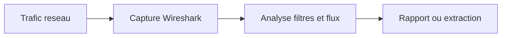

# Wireshark — Analyseur de paquets réseau

> [!info] **En 1 phrase**
> Wireshark est l'analyseur de protocoles de référence pour inspecter en profondeur chaque paquet capturé sur le réseau.

---

## Overview

| Champ | Valeur |
|---|---|
| Description | Analyseur de protocoles : capture en direct (libpcap/Npcap) ou lecture de fichiers (pcap/pcapng), décodage de centaines de protocoles, filtres d'affichage, suivi de flux, export d'objets |
| Catégorie | Réseau & Capture |
| Sous-catégorie | Analyse de trafic / Forensic réseau |
| Type d'outil | GUI (Wireshark) + CLI (tshark) |
| Licence | GPLv2 (open source) |
| Langage(s) | C, C++ (interface Qt 6), scripts Lua, Python |
| Développeur | Gerald Combs (créateur, 1998) — The Wireshark Foundation |
| Dépôt | https://gitlab.com/wireshark/wireshark |
| Documentation | https://www.wireshark.org/docs/ |
| Date de création | 1998 (sous le nom Ethereal, renommé Wireshark en 2006) |
| État | actif |
| Dernière version connue | 4.6.8 (stable) — 4.4.18 (old stable) — 4.7.2 (développement) |
| Systèmes compatibles | Windows (Npcap), macOS, Linux, BSD |

> [!note] À vérifier
> La suite inclut aussi tshark (CLI), dumpcap (capture), editcap/mergecap (manipulation), capinfos et rawshark. Depuis 4.6, WinPcap n'est plus supporté : Npcap est requis sur Windows.

---

## Concept

Wireshark capture le trafic en direct (libpcap/Npcap) ou lit des fichiers `.pcap`/`.pcapng` et décode **plus de 2000 protocoles** champ par champ (IP, ports, flags TCP, HTTP, TLS…). Les **filtres d'affichage** isolent finement les paquets, le **suivi de flux** reconstruit un échange complet, et l'**export d'objets** réassemble les fichiers transférés. En offensive, il sert à extraire des credentials HTTP, valider un callback de payload ou inspecter un canal C2 ; en défensif, à analyser des captures malwares (DNS exfil, SMB). Sa version CLI, tshark, permet l'analyse en script. Le modèle d'analyse est tri-panneau (liste de paquets, arborescence des champs décodés, hexadécimal) ; chaque champ est filtrable par clic droit → « Apply as filter ». Les profils sauvegardent colonnes, filtres et coloration par usage. Historique : Ethereal (Gerald Combs, 1998) renommé Wireshark en 2006 ; hébergé par la Wireshark Foundation. La version 4.6 (octobre 2025) apporte installeurs macOS universels, Qt 6.9, « Plots » et décryptage NTP via NTS.



---

## Concepts fondamentaux

| Concept | Explication |
|---|---|
| pcap / pcapng | Formats de fichiers de capture : pcap (ancien) et pcapng (moderne, multi-interfaces, métadonnées) |
| Capture filter vs display filter | Capture filter (BPF, `-f`) : filtre à la capture, CPU léger ; display filter (`-Y`) : filtre d'affichage riche |
| Libpcap / Npcap | Bibliothèques de capture : libpcap (Linux/Unix), Npcap (Windows, remplace WinPcap depuis 4.6) |
| Dissectors | Décodeurs de protocoles en C ou Lua, organisés en arborescence de champs filtrables |
| Follow stream | Reconstruction d'un flux TCP/UDP/HTTP/TLS complet |
| Export objects | Réassemblage des objets transférés via HTTP, SMB, TFTP, etc. |
| SSLKEYLOGFILE | Fichier des clés de session TLS (Firefox/Chrome) → décryptage TLS |

---

## Installation

```bash
# Debian / Ubuntu / Kali
sudo apt update && sudo apt install -y wireshark
# Arch
sudo pacman -S wireshark-qt
# Fedora / RHEL
sudo dnf install wireshark
# macOS
brew install --cask wireshark
# Docker (tshark via image Kali)
docker run --rm -it kalilinux/kali-rolling bash -c "apt update && apt install -y tshark"
# Windows : choco install wireshark (avec Npcap) — https://www.wireshark.org/download.html
```

```bash
# Compilation depuis les sources (cmake, ninja, libpcap-dev, qt6-base-dev, glib2.0-dev)
git clone https://gitlab.com/wireshark/wireshark
cd wireshark
cmake -B build && cmake --build build && sudo cmake --install build
```

> [!warning] Prérequis & problèmes potentiels
> - Windows : **Npcap** doit être installé (fourni avec l'installeur officiel), sinon aucune capture possible.
> - Linux : la capture sans root nécessite le groupe `wireshark` (`sudo usermod -aG wireshark $USER`) ou `sudo` ; la lecture de `.pcap` ne nécessite aucun privilège.
> - macOS : privilèges d'accès aux interfaces à valider dans les réglages.

---

## Configuration

Préférences dans `$XDG_CONFIG_HOME/wireshark` (Linux), `%APPDATA%\Wireshark` (Windows), `~/Library/Preferences/Wireshark` (macOS).

| Paramètre | Rôle | Exemple |
|---|---|---|
| `preferences` | Préférences globales (couleurs, décodage, colonnes) | `tls.keylog_file: /tmp/keys.log` |
| `capture_filters` / `display_filters` | Filtres prédéfinis nommés | `"POST" http.request.method == "POST"` |
| `colorfilters` | Règles de coloration des paquets | `tcp` rouge / `udp` bleu |
| `disabled_protos` | Protocoles désactivés (évite les faux décodages) | `data` |
| `SSLKEYLOGFILE` | Variable (Firefox/Chrome) : clés de session TLS | `export SSLKEYLOGFILE=/tmp/keys.log` |
| `-o <clé>:<valeur>` | Surcharge d'une préférence en CLI | `tshark -o tls.keylog_file:/tmp/keys.log -r cap.pcapng` |

---

## Architecture interne

- **Capture** : `dumpcap` effectue la capture réelle (libpcap/Npcap), Wireshark/tshark s'y connectent pour l'analyse en temps réel. Les filtres de capture sont compilés en **BPF**.
- **Dissection** : chaque protocole a un dissector (C ou Lua) qui enregistre des champs (FT_*) dans un arbre, accessibles par nom filtre (`ip.src`, `http.file_data`).
- **Filtres d'affichage** : compilés en arbre d'analyse syntaxique, évalués sur chaque trame ; passage multiple (`-2`) pour les statistiques.
- **Réassemblage** : les dissectors reconstruisent les fragments IP/TCP (streams) — suivi de flux, export d'objets.
- **Statistiques** : passes sur la capture (`-z io,phs`, `-z conv,tcp`, I/O Graphs, endpoints).
- **Décryptage** : moteurs TLS, IPsec, Kerberos, WPA/WPA2, SSH — alimentés par clés (SSLKEYLOGFILE, PSK).

tshark partage 100 % des dissectors et filtres avec la GUI : c'est le même moteur sans interface.

---

## Commandes

### GUI (raccourcis clés)

| Option | Effet |
|---|---|
| `Ctrl+E` | démarrer / arrêter la capture |
| `Ctrl+K` | options de capture (filtre de capture) |
| `Ctrl+F` | recherche dans les paquets affichés |
| `Ctrl+Shift+E` | suivre un flux TCP / HTTP |
| `Statistiques → Hiérarchie de protocoles` | vue d'ensemble des protocoles et volumétrie |
| `Fichier → Exporter des objets → HTTP` | extraire fichiers/objets transférés |
| Clic droit → `Apply as filter` | créer un filtre depuis le champ sélectionné |

### tshark (CLI)

```bash
tshark -r capture.pcapng -Y 'http' -T fields -e ip.src -e ip.dst -e http.host
```

| Commande | Résultat |
|---|---|
| `tshark -i eth0 -w capture.pcapng` | Capturer en direct vers un fichier |
| `tshark -r f -Y 'tcp.port == 80'` | Filtrer l'affichage |
| `tshark -r f -f 'tcp port 80'` | Filtre de capture (BPF) |
| `tshark -r f -T fields -e ip.src -e frame.len` | Sortie champs sélectionnés |
| `tshark -r f -T json` | Sortie JSON par trame |
| `tshark -r f -q -z io,phs` | Hiérarchie de protocoles |
| `tshark -r f -q -z conv,tcp` | Conversations TCP (volume) |
| `capinfos capture.pcapng` | Métadonnées de la capture |
| `editcap -c 1000 in.pcapng out.pcapng` | Découper en fichiers de 1000 trames |

Exemples de **filtres d'affichage** :

```bash
ip.addr == 10.10.14.5             # tout le trafic vers/depuis cette IP
tcp.port == 80 || udp.port == 53  # trafic HTTP et DNS
http.request.method == "POST"     # requêtes POST (credentials possibles)
tls.handshake.type == 1           # ClientHello TLS
frame contains "password"         # recherche d'une chaîne dans le payload
dns.qry.name contains "pastebin"  # requêtes DNS contenant un domaine
```

```bash
# Décryptage TLS + export objets
tshark -r cap.pcapng -o tls.keylog_file:/tmp/keys.log -Y 'tls && http'
tshark -r cap.pcapng --export-objects http,./objets/
```

---

## Options et flags

### GUI

| Option | Description | Niveau |
|---|---|---|
| `-i <interface>` | Interface de capture | Basic |
| `-r <fichier>` | Lecture d'un fichier de capture | Basic |
| `-Y <filtre>` | Filtre d'affichage initial | Intermediate |
| `-f <filtre>` | Filtre de capture (BPF) | Intermediate |
| `-k` | Démarrer la capture immédiatement | Intermediate |
| `-o <clé>:<valeur>` | Surcharge une préférence | Advanced |
| `-C <profil>` | Profil de configuration | Advanced |
| `-p` | Pas de mode promiscuous | Intermediate |

### tshark

| Option | Description | Niveau |
|---|---|---|
| `-i <if>` / `-r <f>` | Interface ou fichier de capture | Basic |
| `-Y <filtre>` / `-f <BPF>` | Filtre d'affichage / de capture | Basic |
| `-T fields -e <champ>` | Sortie en champs (pipeline) | Intermediate |
| `-T json` | Sortie JSON | Advanced |
| `-V` / `-O <proto>` | Vue détaillée / d'un protocole | Intermediate |
| `-q -z <stat>` | Mode silencieux + statistiques (`io,phs`, `conv,tcp`) | Intermediate |
| `-w <fichier>` / `-F <format>` | Écriture / format (pcapng, pcap) | Basic |
| `--export-objects <proto>,<dir>` | Export des objets (http, smb, tftp) | Advanced |

> [!tip] Options les plus utiles
> `-r` (lire un pcap), `-Y` (filtre d'affichage), `-T fields -e …` (sortie propre pour scripts), `-q -z conv,tcp` (repérer les gros flux), `-w` (sauvegarder). En GUI : `Suivre le flux TCP` et `Exporter des objets → HTTP`.

---

## Exemples pratiques

### Beginner

```bash
tshark -i eth0 -c 100 -w mini.pcapng
tshark -r mini.pcapng -Y 'http'
# Recherche de chaîne : frame contains "password"
```

### Intermediate

```bash
# Isoler les POST et extraire host/URI/body
tshark -r capture.pcapng -Y 'http.request.method == "POST"' -T fields -e http.host -e http.request.uri -e http.file_data
```

### Advanced

```bash
# Décryptage TLS avec les clés de session
export SSLKEYLOGFILE=/tmp/keys.log
firefox https://cible.example.com &
tshark -r capture.pcapng -o tls.keylog_file:/tmp/keys.log -Y 'tls && http'
```

### Expert

```bash
# Extraction automatisée des objets HTTP (exfil)
tshark -r capture.pcapng --export-objects http,./objets/
# Analyse malware réseau (DNS exfil + SMB)
tshark -r sample.pcapng -Y 'dns.qry.name contains "pastebin" || smb2.cmd == 4' -T fields -e frame.time -e ip.src -e dns.qry.name
# Handshake Wi-Fi EAPOL (pour aircrack-ng / hashcat -m 22000 via hcxpcapngtool) : eapol.type == 3
```

---

## Workflow complet (scénario pas à pas)

1. **Lancer la capture** — ouvrir Wireshark, double-cliquer sur l'interface, capturer pendant une action ciblée. CLI : `tshark -i eth0 -w action.pcapng`.
2. **Filtrer** — `http` puis `http.request.method == "POST"` pour isoler les soumissions de formulaires.
3. **Suivre le flux** — clic droit → `Suivre → Flux TCP` pour lire l'échange HTTP complet.
4. **Extraire les credentials** — chercher `user`, `pass`, `Authorization: Basic` dans le flux.
   ```bash
   tshark -r action.pcapng -Y 'frame contains "pass"' -T fields -e ip.src -e frame.number
   ```
5. **Exporter les objets** — `Fichier → Exporter des objets → HTTP` pour récupérer les fichiers téléchargés.
   ```bash
   tshark -r action.pcapng --export-objects http,./objets/
   ```

---

## Scénarios avancés

### Scénario 1 : extraction de fichiers via HTTP

```bash
tshark -r capture.pcapng -Y 'http.response' -T fields -e http.content_type -e http.file_data
# GUI : Fichier > Exporter des objets > HTTP puis "Save All"
```

Permet de récupérer des exécutables, archives ou documents exfiltrés.

### Scénario 2 : analyse d'un malware réseau (SMB / DNS exfil)

```bash
tshark -r sample.pcapng -Y 'dns.qry.name contains "pastebin" || smb2.cmd == 4' -T fields -e frame.time -e ip.src -e dns.qry.name
# Suivre le flux et identifier les données exfiltrées via des requêtes DNS
```

## Cybersecurity use cases

| Phase | Utilisation |
|---|---|
| Reconnaissance passive | Observation des protocoles, topologie, résolution de noms |
| Analyse de trafic | Extraction de credentials en clair (HTTP POST, FTP, telnet, IMAP) |
| Exploitation / validation | Vérification du callback d'un reverse shell, du contenu d'un payload |
| Post-exploitation | Contrôle du trafic d'un canal C2 (fréquence, volume, payloads) |
| Forensic réseau | Analyse de captures fournies, reconstruction d'objets |
| Blue team | Analyse d'incident : malware network, exfiltration DNS/HTTP, C2 |
| Wireless | Analyse de handshakes WPA2/PMKID pour le cracking |

---

## MITRE ATT&CK

| Tactique | Technique / Sub-technique | ID | Raison | Détection | Mitigation |
|---|---|---|---|---|---|
| Credential Access | Network Sniffing | T1040 | Capture du trafic pour extraire credentials (HTTP, telnet, FTP en clair) | Sigma `proc_creation_win_susp_network_sniffing` (ba1f7802) | Segmentation, TLS, interdiction des protocoles en clair |
| Discovery | Network Sniffing | T1040 | La capture révèle topologie, services et configuration | Npcap/wpcap.dll chargés par un processus non Wireshark (Sysmon EID 7) | Restriction d'installation des outils de capture |
| Collection | Network Sniffing | T1040 | Récupération passive de données transitant sur le réseau | Mode promiscuous non justifié, gros fichiers pcap écrits | Monitoring des interfaces en promiscuité, DLP pcap |
| Command and Control (analyse) | Application Layer Protocol | T1071 | Analyse des flux C2 (HTTP/DNS) à partir des captures | Corrélation des flux sortants inhabituels | Egress filtering, TLS inspection |
| Exfiltration (analyse) | Exfiltration Over C2 Channel | T1041 | Reconstruction des objets exfiltrés via Export Objects | Export d'objets HTTP/SMB inattendus | DLP, surveillance des transferts volumineux |

> [!note] Ne renseigner que si l'association est réellement pertinente.
> Wireshark est un outil d'analyse passive : la technique directement mappée est **T1040 (Network Sniffing)**. Les deux dernières lignes décrivent des usages d'analyse (blue team).

---

## Defensive Security

### Signes observables

| Indicateur | Détail |
|---|---|
| Exécution de `tshark.exe`/`windump.exe` avec `-i` | Sigma `proc_creation_win_susp_network_sniffing` (ba1f7802) |
| Chargement de `wpcap.dll`/`npcap.dll` par un processus inattendu | Sysmon Event ID 7 |
| Installation du driver NPF/Npcap (`npf.sys`, `npcap.sys`) | Event 7045 (nouveau service) |
| Mode promiscuous actif sur une interface | Audit `ip link`, vérification des interfaces |
| Fichiers `.pcap`/`.pcapng` volumineux écrits sur disque | DLP sur extensions, contrôle de l'exfiltration |

### Règles de détection (Sigma / Suricata / Snort)

```yaml
# Sigma — Potentielle capture réseau avec tshark/windump
# Source : SigmaHQ — proc_creation_win_susp_network_sniffing
title: Potential Network Sniffing Activity Using Network Tools
id: ba1f7802-adc7-48b4-9ecb-81e227fddfd5
status: test
description: Detects potential network sniffing via use of network tools such as tshark, windump
logsource:
    category: process_creation
    product: windows
detection:
    selection_tshark:
        Image|endswith: '\tshark.exe'
        CommandLine|contains: '-i'
    selection_windump:
        Image|endswith: '\windump.exe'
    condition: 1 of selection_*
falsepositives:
    - Legitimate administration activity to troubleshoot network issues
level: medium
```

```yaml
# Sigma — Capture réseau démarrée via netsh (sans installation d'outil)
# Source : SigmaHQ — proc_creation_win_netsh_packet_capture
title: New Network Trace Capture Started Via Netsh.EXE
id: d3c3861d-c504-4c77-ba55-224ba82d0118
status: test
description: Detects the execution of netsh with the trace flag to start a network capture
logsource:
    category: process_creation
    product: windows
detection:
    selection_img:
        Image|endswith: '\netsh.exe'
    selection_cli:
        CommandLine|contains|all:
            - 'trace'
            - 'start'
    condition: all of selection_*
level: medium
```

> [!note] À vérifier
> Les deux règles Sigma sont issues du dépôt SigmaHQ (identifiants vérifiés). Les alertes Suricata sur l'exfiltration `.pcap` restent un exemple pédagogique à adapter.

---

## Automatisation

```bash
# Bash — boucle de capture par tranche de 5 minutes (rotation)
for i in {1..12}; do
    timeout 300 tshark -i eth0 -w "segment_$(date +%H%M%S).pcapng"
done
# Extraction des requêtes DNS d'une capture
tshark -r capture.pcapng -Y 'dns.qry.name' -T fields -e dns.qry.name | sort -u | head -50
```

---

## Output et parsing

tshark produit des sorties texte, détaillées (`-V`), champs (`-T fields`), JSON (`-T json`), EK (Elastic), PDML et CSV. Les statistiques (`-z`) sortent en tableau.

```bash
# Sortie champs pour pipeline (credentials HTTP)
tshark -r cap.pcapng -Y 'http.request.method == "POST"' \
  -T fields -E header=y -e frame.time -e ip.src -e http.host -e http.request.uri -e http.file_data
# Liste des hôtes visités (par domaine)
tshark -r cap.pcapng -Y 'dns.qr == 1' -T fields -e dns.qry.name | sort | uniq -c | sort -rn
# Sortie JSON (par trame)
tshark -r cap.pcapng -Y 'dns' -T json | jq '.[] | ._source.layers.dns.dns.qry_name // empty' | head -20
```

> [!note] À vérifier
> La structure exacte du JSON varie selon les versions de tshark (chemins `dns.qry_name` vs `dns.qry.name`). Tester la sortie avant de la parser.

---

## Intégrations

- [[Tools| Outils]] global
- [[Outil - tshark]] — version CLI du même moteur (analyse en script)
- [[Outil - tcpdump]] — capture légère sur machine cible, analysée ensuite dans Wireshark
- [[Outil - Scapy]] — crafting de paquets et capture en Python
- [[Outil - Zeek]] / [[Outil - Suricata]] / [[Outil - Snort]] — analyse/détection réseau complémentaires
- [[Outil - tcpreplay]] — rejouer des captures pour tester l'IDS
- [[Outil - aircrack-ng]] / [[Outil - hcxdumptool]] — handshakes Wi-Fi issus des captures
- [[Outil - CyberChef]] — transformation des payloads extraits
- [[Techniques/ARP Spoofing et MITM| ARP Spoofing & MITM]]

---

## Alternatives

| Outil | Avantages | Inconvénients | Cas d'usage |
|---|---|---|---|
| tcpdump | Ultra-léger, présent partout, capture brute fiable | Pas de décodage interactif, CLI uniquement | Capture sur une machine compromise |
| tshark | Même moteur que Wireshark, scriptable | CLI uniquement | Analyse automatisée, pipelines |
| NetworkMiner | Forensic réseau orienté fichiers (images, emails) | Moins de filtres, gratuité limitée | Extraction rapide d'artefacts |
| Zeek | Framework d'analyse par événements (logs, pas paquets) | Pas de GUI paquet-à-paquet | Détection/surveillance longue durée |

> **Quand utiliser tcpdump plutôt que Wireshark ?** Sur une machine cible (payload minimal) ou en capture longue : `tcpdump -i eth0 -w cap.pcapng` produit le même format pcap, analysable ensuite dans Wireshark. Pour l'exploration interactive, Wireshark/tshark restent imbattables.

---

## Performance

- La capture repose sur **dumpcap** (léger, privilèges minimaux) ; le décodage est déporté vers Wireshark/tshark, ce qui limite la perte de paquets.
- Les **filtres de capture** (BPF) s'exécutent dans le kernel/driver (peu de CPU, syntaxe limitée) ; les **filtres d'affichage** sont évalués en userland (plus riches, plus coûteux).
- Sur un trafic fort : mode promiscuous + `snaplen` réduit (`-s 128`), disque SSD, fichier rotatif (`-a duration:300`).
- Les stats `-z conv,tcp`/`io,phs` sur un gros pcap peuvent nécessiter plusieurs passes (`-2`).

> [!note] À vérifier
> Les débits de capture dépendent du matériel, du driver (Npcap vs libpcap) et de la charge. Recommandations issues de la documentation officielle Wireshark.

---

## Troubleshooting

#### Problème : « No interfaces found » au lancement (Windows)

- **Cause** : Npcap absent ou incompatible avec la version de Windows.
- **Solution** : réinstaller Npcap (fourni avec l'installeur), vérifier le service « Npcap ». **Vérif** : `tshark -D`.

#### Problème : pas de droit de capture sous Linux

- **Cause** : utilisateur hors du groupe `wireshark` ou interface root-only.
- **Solution** : `sudo usermod -aG wireshark $USER` puis reconnexion, ou lancer avec `sudo`. **Vérif** : `id $USER`.

#### Problème : le trafic TLS n'est pas lisible

- **Cause** : clés de session absentes ou `SSLKEYLOGFILE` non renseigné.
- **Solution** : exporter les clés (Firefox/Chrome), renseigner `tls.keylog_file` dans `Préférences → Protocols → TLS`. **Vérif** : le protocole `tls` doit apparaître au lieu de `application_data`.

#### Problème : perte de paquets sur un trafic intense

- **Cause** : buffer de capture insuffisant, disque lent, `snaplen` trop grand.
- **Solution** : réduire `snaplen` (`-s 128`), activer la rotation (`-a duration:60`). **Vérif** : la barre de stats de capture affiche le % de paquets manqués.

#### Problème : un protocole est mal décodé (payload affiché en « data »)

- **Cause** : mauvais port attribué ou dissector désactivé.
- **Solution** : clic droit → `Décoder comme…` (Decode As) pour forcer le protocole ; vérifier `disabled_protos`. **Vérif** : le champ est alors décodé.

---

## Sécurité de l'outil

- **Permissions** : la capture nécessite des privilèges étendus (root, groupe `wireshark`, driver Npcap). Limiter l'installation aux postes autorisés.
- **Sensibilité des données** : les captures contiennent passwords, cookies, contenus — chiffrer les fichiers pcap, ne pas les partager hors cadre (DLP).
- **Décryptage TLS** : le fichier `SSLKEYLOGFILE` donne accès au trafic chiffré — le protéger comme un secret.
- **Malware analysis** : ouvrir une pcap est passif, mais les objets extraits (export) doivent être analysés dans une sandbox, jamais exécutés.
- **Mode promiscuous** : activable par root uniquement ; laisser des interfaces en promiscuous permanent réduit sécurité et performance.
- **Plugins Lua/tiers** : un plugin malveillant peut exécuter du code à l'ouverture d'un fichier — n'installer que des plugins de confiance.

---

## Limitations

- Wireshark est **passif** : il ne génère pas de trafic (pas de scan, pas d'exploitation).
- La **capture est détectable** (promiscuous mode, driver Npcap, processus).
- Le **trafic chiffré** (TLS, SSH) n'est pas lisible sans clés ; l'analyse se limite aux métadonnées.
- Sur un **trafic très dense**, la perte de paquets est inévitable sans matériel adapté.
- Les **dissectors** peuvent se tromper (faux décodage) sur des protocoles exotiques ou obfusqués.
- Pas de **détection/alerte en temps réel** natif : c'est un outil d'analyse, pas un IDS.

---

## Cheatsheet

```bash
# Filtres d'affichage courants
ip.addr == 10.10.14.5                # trafic vers/depuis une IP
tcp.port == 80 || udp.port == 53     # HTTP + DNS
http.request.method == "POST"        # soumissions de formulaires
tls.handshake.type == 1              # ClientHello TLS
frame contains "password"            # chaîne dans le payload
dns.qry.name contains "example"      # domaine DNS
eapol.type == 3                      # handshake Wi-Fi

# Capture CLI
tshark -i eth0 -w cap.pcapng
tshark -i eth0 -c 1000 -w mini.pcapng
tshark -i eth0 -a duration:300 -w segment.pcapng   # rotation 5 min

# Analyse CLI
tshark -r cap.pcapng -Y 'http' -T fields -e ip.src -e http.host -e http.request.uri
tshark -r cap.pcapng -q -z io,phs
tshark -r cap.pcapng -q -z conv,tcp | sort -k4 -n
tshark -r cap.pcapng --export-objects http,./objets/

# TLS + méta-infos
tshark -r cap.pcapng -o tls.keylog_file:/tmp/keys.log -Y 'tls && http'
capinfos cap.pcapng
editcap -c 1000 big.pcapng part.pcapng
```

---

## Quick reference

| | |
|---|---|
| **À quoi sert-il ?** | Capturer et décoder le trafic réseau paquet par paquet (plus de 2000 protocoles) |
| **Quand l'utiliser ?** | Analyse de pcap, extraction de credentials, validation réseau, forensic, analyse C2/malware |
| **Commande principale** | `tshark -r capture.pcapng -Y 'filtre' -T fields -e champ1 -e champ2` |
| **Alternative principale** | tcpdump (capture), tshark (scripting), NetworkMiner (extraction) |
| **Concepts importants** | pcap/pcapng, display vs capture filter, suivre le flux, SSLKEYLOGFILE, Export Objects |
| **Liens associés** | [[Outil - tshark]] · [[Outil - tcpdump]] · [[Outil - Zeek]] · [[Outil - Scapy]] |

---

## Détection & Défense

| Signe | Défense |
|---|---|
| Connexion Wireshark/tcpdump détectée sur un hôte | Restreindre l'installation aux postes autorisés (GPO) |
| Volumétrie anormale en HTTP en clair | Chiffrer le trafic (TLS), durcir les applications |
| Envoi de captures `.pcap` hors du réseau | DLP sur les fichiers pcap, surveillance des exfiltrations DNS/HTTP |
| Décryptage TLS possible (SSLKEYLOGFILE) | Interdire le chargement de clés hors environnement maîtrisé |
| Captures en mode promiscuous non journalisées | Audit des interfaces en promisc, traçabilité des accès |
| Exécution de `tshark.exe`/`windump.exe` avec `-i` | Sigma `ba1f7802` (proc_creation_win_susp_network_sniffing) |
| Chargement de `wpcap.dll`/`npcap.dll` par un processus inattendu | Sysmon Event ID 7, alerte sur les parents non Wireshark |

---

## Tips & Pièges

> [!tip] **Tips**
> - Sur de gros fichiers, préférer un **filtre de capture** (en amont) plutôt que d'affichage : moins de paquets perdus.
> - `Suivre le flux TCP` (Ctrl+Shift+E) est le moyen le plus rapide de lire un échange HTTP/SMB.
> - `frame contains` et les colonnes personnalisées accélèrent la recherche de chaînes dans les payloads.
> - `tshark -G fields | grep <proto>` donne le nom exact d'un champ pour un filtre.

> [!warning] **Pièges**
> - Un filtre d'affichage ne supprime pas les paquets de la capture : la volumétrie globale reste faussée.
> - Ne pas confondre **filtre de capture** (BPF, `-f`) et **filtre d'affichage** (`-Y`) : syntaxe et comportement diffèrent.
> - Ouvrir un pcap est passif, mais **exporter puis exécuter** un objet extrait peut infecter : analyser dans une sandbox.

---

## References

### Official

- Documentation officielle : https://www.wireshark.org/docs/
- Guide utilisateur : https://www.wireshark.org/docs/wsug_html_chunked/
- Page man tshark : https://www.wireshark.org/docs/man-pages/tshark.html
- Wiki officiel (display filters) : https://wiki.wireshark.org/DisplayFilters
- Dépôt GitLab : https://gitlab.com/wireshark/wireshark
- Versions : https://www.wireshark.org/download.html

### Security references

- MITRE ATT&CK T1040 — Network Sniffing : https://attack.mitre.org/techniques/T1040/
- SigmaHQ — proc_creation_win_susp_network_sniffing : https://github.com/SigmaHQ/sigma/blob/master/rules/windows/process_creation/proc_creation_win_susp_network_sniffing.yml
- SigmaHQ — proc_creation_win_netsh_packet_capture : https://github.com/SigmaHQ/sigma/blob/master/rules/windows/process_creation/proc_creation_win_netsh_packet_capture.yml

### Community

- tshark.dev — guide pratique tshark : https://tshark.dev/
- Wireshark Network Analysis (Chris Sanders, livre de référence)
- SharkFest — conférences Wireshark : https://www.wireshark.org/news/sharkfest.html

---

**Liens :** [[Tools| Outils]] · [[Outil - tshark|tshark]] · [[Outil - tcpdump|tcpdump]]
