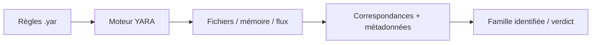

# 🔎 YARA — Forensics, Threat Intel & Honeypots

> [!info] **En 1 phrase**
> YARA est un langage de règles pour identifier et classer les familles de malwares par signatures (chaînes, opcodes, heuristiques), utilisé dans toute la chaîne d'analyse : sandbox, SOC, threat intel et IR.

---

## 🧾 Overview

| Champ | Valeur |
|---|---|
| Nom complet | YARA (Yet Another Recursive Acronym) |
| Description | Langage de règles de détection de malwares par signatures : chaînes, opcodes, heuristiques |
| Catégorie | 🔎 Forensics, Threat Intel & Honeypots |
| Sous-catégorie | Malware Detection / Signature |
| Fonction principale | Identifier et classer les familles de malwares par motifs binaires |
| Type d'outil | CLI (yara/yarac) + bibliothèque (yara-python) |
| Licence | BSD-3-Clause |
| Open source / propriétaire | Open source |
| Langage(s) de programmation | C |
| Développeur / organisation | VirusTotal |
| Projet officiel | YARA |
| Dépôt officiel | https://github.com/VirusTotal/yara |
| Documentation officielle | https://yara.readthedocs.io/en/stable/ |
| Date de création | 2008 |
| État du projet | actif (v4.5.8 ; successeur YARA-X) |
| Dernière version connue | 4.5.8 (2026) |
| Systèmes compatients | Linux, Windows, macOS, Android |
| Successeur | YARA-X (réécriture en Rust, expérimentale) |

> [!note] Pour vérifier / compléter
> YARA-X est la réécriture en Rust (depuis 2025) ; vérifier son niveau de maturité avant d'y migrer les pipelines de production.

---

## 🎯 Concept

YARA permet de décrire des motifs (« patterns ») : chaînes hexadécimales, chaînes ASCII/Unicode, expressions régulières et conditions logiques, puis de scanner des fichiers, des dossiers ou des flux mémoire. On l'utilise pour reconnaître une famille de malwares déjà connue, détecter des variantes, ou taguer des échantillons dans un pipeline d'analyse automatique. C'est le standard de facto : VirusTotal, les sandbox et les EDR intègrent YARA.

Le cœur est la règle : un bloc `rule Nom { strings: ... condition: ... }`. L'outil CLI (`yara`) exécute les règles, `yarac` les compile en binaire pour les scans massifs, et la bibliothèque **`yara-python`** permet de l'intégrer dans ses propres outils (scripts DFIR, connecteurs MISP, moteur d'Autopsy). `valhalla.nextron-systems.com` est une source de règles communautaires actualisées : une alternative gratuite au réglage manuel.



---

## 🧠 Concepts fondamentaux

| Concept | Explication |
|---|---|
| Règle (rule) | Bloc `rule Nom { meta strings condition }` définissant une signature |
| Chaîne (string) | Motif `$id = "texte"` ou `$id = { A1 B2 }` (hex) avec modificateurs |
| Condition | Expression booléenne (courtes, `of them`, fonctions, `at`) |
| Modificateurs | `ascii`, `wide`, `nocase`, `fullword`, `xor` sur les chaînes |
| Module (pe/elf/math) | Extension d'informations structurées sur le fichier |
| Règle anonyme | `$a = "texte"` sans variable : matche si présente |
| `of them` | Comptage : `2 of ($a,$b,$c)` |
| `at` / `in` | Position des chaînes (offset fixe ou plage) |
| Métadonnées (meta) | Auteur, description, référence, score |
| Compilation | `yarac` transforme les .yar en .yarc binaire |
| Namespace | Isolation des règles pour éviter les collisions |

---

## 🛠️ Installation

Installation sur Kali/Debian et via pip pour la bibliothèque Python :

```bash
sudo apt install yara
pip install yara-python
# Test rapide de l'installation
yara --version
yarac --version
python -c "import yara; print(yara.__version__)"
```

Sur Windows : binaire précompilé sur le dépôt GitHub (release) ou `pip install yara-python`. Sur macOS : `brew install yara`. Compilation depuis les sources pour un patch custom : `./bootstrap.sh && ./configure && make && sudo make install`.

---

## ⚙️ Configuration

| Paramètre | Rôle | Exemple |
|---|---|---|
| `--tag=<tag>` | N'applique que les règles ayant ce tag | `--tag=apt` |
| `--namespace=<ns>` | Isole les règles sous un namespace | `--namespace=lazarus` |
| `--max-strings-per-rule` | Limite de chaînes par règle | `--max-strings-per-rule=100` |
| `--max-rules` | Limite de règles | `--max-rules=5000` |
| `--timeout=<s>` | Abandon après N secondes | `--timeout=120` |
| `--fail-on-warnings` | Échoue si avertissements | `--fail-on-warnings` |
| `YARA_EXTERNALS` | Variables externes | `--define=vars.<var>` |

| Option CLI | Rôle | Exemple |
|---|---|---|
| `-r` | Scan récursif de dossiers | `yara -r rules/ dir/` |
| `-s` | Affiche les chaînes matchées | `yara -s rules file` |
| `-m` | Affiche les métadonnées | `yara -m rules file` |
| `-C` | Charge des règles compilées (.yarc) | `yara -C rules.yarc file` |
| `-p N` | N threads | `yara -p 8 rules dir/` |
| `-i <ident>` | Ne lance que la règle nommée | `yara -i r2 rules file` |

---

## 🏗️ Architecture interne

Composants et flux :

- **Compilateur** : analyse les .yar, produit un moteur d'exécution (bytecode) via `yarac` ou en mémoire.
- **Moteur d'exécution** : applique les conditions aux données (fichier, mémoire, flux) ; le scan des chaînes repose sur un automate (Aho-Corasick) optimisé.
- **Modules** : extensions compilées (`pe`, `elf`, `math`, `cuckoo`, `dotnet`...) exposant des variables et fonctions.
- **Variables externes** : valeurs injectées au scan (`--define`), ex. nom d'échantillon.
- **Rendu** : sortie texte par correspondance (règle, tag, meta, chaînes).

Flux type : `.yar` → compilation → moteur → données → correspondances. `yara-python` expose la même mécanique via `yara.compile()` et `rules.match()`.

---

## ⌨️ Commandes

### Commandes principales

```bash
# Scanner un fichier / un dossier avec un ensemble de règles
yara /opt/rules/malware.yar sample.exe
yara -r /opt/rules/ /tmp/malware_samples/
# Compiler les règles en fichier binaire pour un scan plus rapide
yarac /opt/rules/malware.yar /opt/rules/compiled.yarc
yara -C /opt/rules/compiled.yarc sample.exe
# Afficher les chaînes qui ont matché (débogage)
yara -s -m /opt/rules/malware.yar sample.exe
```

| Commande | Effet |
|---|---|
| `yara <rules.yar> <fichier>` | Scanne un fichier et affiche les règles qui matchent |
| `yara -r <rules> <dossier>` | Scan récursif d'un répertoire |
| `yara -m <rules> <fichier>` | Affiche les métadonnées de la règle qui matche |
| `yara -s <rules> <fichier>` | Affiche les chaînes qui ont déclenché la correspondance |
| `yarac <rules> <out.yarc>` | Compile les règles en binaire (scan plus rapide) |
| `yara -C <compiled.yarc> <fichier>` | Utilise des règles pré-compilées |
| `yara -i <ident> <rules> <fichier>` | N'affiche que la règle nommée `<ident>` |
| `yara -p 8 <rules> <fichier>` | Utilise 8 threads (scans massifs) |
| `python -c "import yara"` | Vérifie l'installation de yara-python |

---

## 🎚️ Options et flags

| Option | Description | Exemple | Niveau |
|---|---|---|---|
| `-r` | Scan récursif | `yara -r rules/ dir/` | Basic |
| `-s` | Affiche les chaînes matchées | `yara -s rules file` | Basic |
| `-m` | Affiche les métadonnées | `yara -m rules file` | Basic |
| `-C` | Règles pré-compilées | `yara -C rules.yarc file` | Intermediate |
| `-p N` | N threads | `yara -p 8 rules dir/` | Intermediate |
| `-i <ident>` | Une seule règle | `yara -i r2 rules file` | Intermediate |
| `--tag=<tag>` | Filtre par tag | `yara --tag=apt rules file` | Advanced |
| `--define=var=val` | Variable externe | `yara --define=ext=x rules file` | Advanced |
| `--timeout=<s>` | Abandon après N s | `yara --timeout=60 rules file` | Advanced |
| `--max-rules` | Limite de règles | `yara --max-rules=5000 rules` | Expert |

> [!tip] Options les plus utiles au quotidien
> `-s` en développement, `yarac` + `-C` en production, `-r` pour les dossiers d'analyse, `-p` pour paralléliser les scans massifs.

---

## 🧪 Exemples pratiques

### Beginner

```bash
# Objectif : scanner un échantillon unique
yara /opt/rules/malware.yar sample.exe
# Objectif : valider la compilation d'une règle
yarac /opt/rules/malware.yar /opt/rules/compiled.yarc
```

### Intermediate

```bash
# Objectif : scanner un dossier d'analyse et afficher chaînes + meta
yara -r -s -m /opt/rules/ /tmp/evidence/
# Objectif : ne lancer qu'une règle précise
yara -i Suspicious_Loader_Lazarus /opt/rules/malware.yar sample.exe
```

### Advanced

```bash
# Objectif : scan en 8 threads avec règles compilées et tag
yara -C -p 8 --tag=apt /opt/rules/compiled.yarc /tmp/evidence/
# Objectif : scanner la mémoire d'un processus vivant (Linux)
sudo dd if=/proc/1234/mem bs=1M count=256 of=proc_dump.bin 2>/dev/null
yara -s /opt/rules/loader.yar proc_dump.bin
```

### Expert

```bash
# Objectif : usage via yara-python dans un script d'IR
python3 - <<'EOF'
import yara
rules = yara.compile(filepath="/opt/rules/malware.yar")
for m in rules.match("/tmp/evidence/sample.exe"):
    print(m.rule, m.namespace, m.tags)
EOF
```

---

## 🧪 Workflow complet (scénario pas à pas)

1. **Écrire une règle de famille** : repérer les chaînes communes d'un loader (mutex, nom de section, API importée).

```yara
rule Suspicious_Loader_Lazarus {
    meta:
        author = "SOC-DFIR"
        description = "Détection d'un loader type Lazarus"
        reference = "MALWARE-2026-042"
    strings:
        $mutex = "Global\\MS123" ascii wide
        $api = "InternetOpenA" ascii
        $sect = ".mcore"
        $hex = { 4D 5A 90 00 03 00 00 00 }
    condition:
        uint16(0) == 0x5A4D and $mutex and 2 of ($api, $sect) and $hex at 0
}
```

2. **Compiler et tester** : `yara -s loader.yar sample.exe` → vérifier quelles chaînes ont matché.
3. **Scanner le dossier d'analyse** : `yara -r -m /opt/rules/ /tmp/evidence/` et consigner les familles.
4. **Intégrer dans un script d'IR** : `yara-python` pour scanner en masse et écrire un rapport CSV.

```python
import yara
rules = yara.compile(filepath="/opt/rules/malware.yar")
for m in rules.match("/tmp/evidence/sample.exe"):
    print(m.rule, m.namespace)
```

5. **Croiser avec MISP** : si une règle matche, pousser l'échantillon et le hash dans la plateforme de threat intel.
6. **Maintenir les règles** : comparer avec Valhalla (Nextron) pour récupérer les signatures communautaires à jour.

---

## 🎬 Scénarios avancés

### Scénario 1 : Scan de la mémoire d'un processus vivant

Sur Linux, scanner le fichier `/proc/<PID>/mem` ou un dump mémoire avec une règle qui cherche les chaînes en toutes positions.

```bash
sudo dd if=/proc/1234/mem bs=1M count=256 of=proc_dump.bin 2>/dev/null
yara -s /opt/rules/loader.yar proc_dump.bin
```

### Scénario 2 : Règle combinant modules PE et hash d'imports

Utiliser le module `pe` pour cibler une empreinte précise (timestomp détectable via `pe.timestamp`, imports suspects, entropie de section).

```yara
import "pe"
rule Packed_With_Suspicious_Imports {
    condition:
        pe.is_pe and
        pe.imports("LoadLibraryA") and
        pe.imports("GetProcAddress") and
        pe.entry_point >= pe.sections[1].virtual_address
}
```

### Scénario 3 : Détection de packer via entropie (module math)

```yara
import "math"
import "pe"
rule High_Entropy_Section {
    condition:
        pe.is_pe and
        pe.sections[1].name == ".upx" and
        math.entropy(0, pe.section_offsets[1].length) > 6.5
}
```

### Scénario 4 : Pipeline de scan massif (compilation + threads + rapport)

```bash
yarac /opt/rules/malware.yar /opt/rules/compiled.yarc
yara -C -p 8 -m /opt/rules/compiled.yarc /tmp/evidence/ > rapport.txt
wc -l rapport.txt
```

---

## 🛡️ Cybersecurity use cases

| Phase | Utilisation |
|---|---|
| Malware analysis | Identification et classification des familles |
| DFIR | Scan des preuves, extraction de signatures d'une compromission |
| SOC | Règles sur les fichiers téléchargés, les pièces jointes |
| Threat intel | Partager des signatures via MISP, Valhalla |
| Sandbox | Détection embarquée dans Cuckoo, CAPE, Cuckoo-like |
| EDR | Modules de scan YARA intégrés (Wazuh, Velociraptor) |

---

## 🎯 MITRE ATT&CK

| Tactique | Technique / Sub-technique | ID | Raison | Détection | Mitigation |
|---|---|---|---|---|---|
| Defense Evasion | Obfuscated Files or Information | T1027 | Packing/obfuscation détectés par entropie et motifs | Règles module pe/math | Application control |
| Defense Evasion | Timestomp | T1070.006 | Timestamps PE anormaux détectés | `pe.timestamp`, règles | Journalisation |
| Defense Evasion | Process Injection | T1055 | Shellcode/injection repérée en mémoire | Scan mémoire YARA | EDR |
| Command and Control | Ingress Tool Transfer | T1105 | Outils transférés (Impacket, Mimikatz) détectés | Règles binaires outil | Téléchargement restreint |
| Persistence | Boot or Logon Autostart Execution | T1547 | Binaires persistants signés par règle | Scan des fichiers persistants | Durcissement |
| Execution | Command and Scripting Interpreter | T1059 | Scripts (VBS, JS) malveillants détectés | Règles contenu | Application control |

> [!note] Ne renseigner que si l'association est réellement pertinente.
> YARA est un outil **défensif** : les mappings décrivent les attaques que ses règles permettent de détecter.

---

## 🛡️ Defensive Security

### Signes observables

| Indicateur | Détail |
|---|---|
| Règles YARA publiées (malware public) | Les adversaires testent leurs binaires contre les règles publiques (VirusTotal) : ajouter des règles maison |
| Règle trop large (chaîne 4 octets) | Faux positifs en masse : allonger les motifs, combiner les conditions, tester sur un corpus propre |
| Scan massif de fichiers sur un endpoint | Optimiser avec règles compilées (`-C`), modules PE et filtrage par type de fichier |
| Échantillon obfusqué (pas de chaînes lisibles) | Utiliser les modules (pe, elf, math) et les signatures d'opcodes plutôt que des strings |

### Règle YARA pour détecter un scan YARA abusif

```yara
rule Suspicious_Yara_Mass_Scan {
    meta:
        description = "Détecte un usage abusif de yara en masse (revente d'échantillons)"
    strings:
        $yara = "yara" ascii wide nocase
        $yarac = "yarac" ascii wide nocase
    condition:
        2 of them and filesize < 1MB
}
```

---

## 🤖 Automatisation

```bash
# Bash — scan récursif de tous les fichiers d'un dossier d'IR
for f in $(find /tmp/evidence -type f); do
  yara -m /opt/rules/compiled.yarc "$f" && echo ">> $f"
done
```

```python
# Python — scan massif avec rapport CSV
import os, csv, yara

rules = yara.compile(filepath="/opt/rules/malware.yar")
with open("rapport.csv", "w", newline="") as out:
    w = csv.writer(out)
    w.writerow(["fichier", "regle"])
    for root, _, files in os.walk("/tmp/evidence"):
        for f in files:
            p = os.path.join(root, f)
            try:
                for m in rules.match(p):
                    w.writerow([p, m.rule])
            except (PermissionError, OSError):
                pass
```

---

## 📤 Output et parsing

Sortie par défaut : une ligne `Règle [Nom] [chemin]` par correspondance ; avec `-s` s'ajoutent les chaînes matchées, avec `-m` les métadonnées.

```bash
# Extraire les familles identifiées (colonnes 1)
yara -r /opt/rules/ /tmp/evidence/ | awk '{print $1}' | sort | uniq -c | sort -rn
# Filtrer par tag
yara --tag=apt /opt/rules/ /tmp/evidence/ | cut -d' ' -f1
```

```python
# Python — détail d'une correspondance
import yara

rules = yara.compile(filepath="/opt/rules/malware.yar")
for m in rules.match("/tmp/evidence/sample.exe"):
    print("Règle:", m.rule)
    for s in m.strings:
        print("  chaine:", s[1], s[2].hex())
```

---

## 🔗 Intégrations

```text
YARA ← règles : virus total, valhalla (nextron), communautés
YARA → sandbox : Cuckoo, CAPE (modules de détection)
YARA → EDR : Wazuh (module scan), Velociraptor, Autopsy
YARA → threat intel : MISP (partage de signatures)
YARA → Volatility (scan mémoire via windows.yarascan)
YARA → VirusTotal (moteur d'exécution de règles)
```

- [[Tools|🧰 Outils]]
- [[Outils/Outil - MISP|🔎 MISP]] — partage des règles et des hashs
- [[Outils/Outil - Volatility|🔎 Volatility]] — scan mémoire via `windows.yarascan`
- [[Outil - Autopsy]] — moteur YARA intégré à l'analyse disque
- [[Outil - Wazuh]] — module de scan YARA sur les endpoints
- [[Outil - Cuckoo Sandbox]] — détection dans les sandboxes
- [[Techniques/09 - Reverse Engineering & Malware|🔬 Reverse Engineering & Malware]]

---

## 🔄 Alternatives

| Outil | Avantages | Inconvénients | Cas d'usage |
|---|---|---|---|
| YARA | Standard, rapide, intégrable | Langage à apprendre, faux positifs | Détection de malwares |
| YARA-X | Réécriture Rust, moderne | Expérimental, moins de support | Migration progressive |
| Loki | Simple, signatures prêtes | Moins flexible | Triage rapide |
| ClamAV | Scanner antivirus complet | Pas de langage de règles | Endpoint classique |
| hashdb | Base de hashs | Pas de motifs | Corrélation |

> **Quand utiliser YARA plutôt qu'un autre ?** Pour **écrire et partager des signatures précises** (familles, variantes, artefacts mémoire) dans tout pipeline d'analyse : c'est le standard de l'industrie.

---

## ⚡ Performance

- **Compilation** : `yarac` pré-compile les règles → scan plus rapide (aucune recompilation à chaque run).
- **Threads** : `-p N` parallélise le scan des fichiers d'un dossier (gain sur les millions de fichiers).
- **Moteur** : l'automate Aho-Corasick rend les scans de chaînes très rapides.
- **Modules** : l'accès aux structures PE/ELF est quasi instantané (pas de re-scan).
- **Limites** : règle avec beaucoup de regex complexes ralentit ; limiter les motifs avec `in`/`at`.
- **Mémoire** : un grand corpus de règles consomme de la RAM à la compilation.

> [!note] À vérifier
> Sur les très gros volumes, mesurer le débit (fichiers/s) avant déploiement massif et compiler les règles.

---

## 🛠️ Troubleshooting

### Common problems

#### Problème : `yara: error compiling rule` (syntaxe)

- **Cause** : erreur de syntaxe dans la règle (virgule, parenthèse, modificateur inconnu).
- **Solution** : relire la règle, vérifier chaque ligne ; `yarac` donne le numéro de ligne.
- **Vérification** : `yarac rules.yar compiled.yarc` sans erreur.

#### Problème : trop de faux positifs

- **Cause** : motifs courts, absence de condition de type de fichier.
- **Solution** : allonger les chaînes, ajouter `uint16(0) == 0x5A4D`, combiner `of them`.
- **Vérification** : scanner un corpus propre et comparer.

#### Problème : `-C` ne trouve pas les règles

- **Cause** : fichier non compilé (utilisé `yara` au lieu de `yarac`), mauvais chemin.
- **Solution** : compiler avec `yarac`, vérifier le chemin du `.yarc`.
- **Vérification** : `yarac rules.yar rules.yarc && yara -C rules.yarc file`.

#### Problème : aucun match alors qu'une chaîne est présente

- **Cause** : encodage (wide), casse, position (`at 0`), modificateur manquant.
- **Solution** : ajouter `ascii wide`, `nocase`, retirer `at` ou élargir la plage.
- **Vérification** : `yara -s` sur un échantillon de test positif.

#### Problème : scan trop lent

- **Cause** : règle complexe, aucun `-C`, aucun `-p`.
- **Solution** : compiler, paralléliser, simplifier les regex.
- **Vérification** : chronométrer le scan avec et sans optimisation.

---

## 🔐 Sécurité de l'outil

- **Échantillons** : les fichiers scannés peuvent être malveillants : analyser dans un environnement isolé.
- **Règles** : les signatures maison sont des actifs de sécurité : les versionner et en restreindre l'accès.
- **`yara-python`** : exécute du code local : l'utiliser avec des règles de confiance.
- **Mémoire** : scanner `/proc/<PID>/mem` nécessite les droits root : restreindre l'accès.
- **Données** : les rapports de scan contiennent des noms de fichiers et des chemins sensibles : protéger les sorties.
- **Posture** : YARA est défensif ; un attaquant peut l'utiliser pour tester son malware contre les signatures publiques : ne jamais dépendre uniquement des règles publiques.

---

## ⚠️ Limitations

- **Signatures** : ne détecte que ce qui est signé ; un malware modifié (recompilé) peut échapper aux règles.
- **Faux positifs** : les motifs courts et les regex larges produisent du bruit.
- **Pas d'analyse dynamique** : aucun comportement, uniquement le contenu statique.
- **Obfuscation** : packers et chiffrement rendent les chaînes illisibles.
- **Langage** : courbe d'apprentissage et syntaxe stricte.
- **YARA-X** : encore expérimental, compatibilité en cours.

---

## 📋 Cheatsheet

```bash
# Scanner fichier / dossier
yara /opt/rules/malware.yar sample.exe
yara -r -s -m /opt/rules/ /tmp/evidence/

# Compiler / scanner compilé
yarac /opt/rules/malware.yar /opt/rules/compiled.yarc
yara -C -p 8 /opt/rules/compiled.yarc /tmp/evidence/

# Filtrer
yara -i Suspicious_Loader_Lazarus /opt/rules/malware.yar sample.exe
yara --tag=apt /opt/rules/ /tmp/evidence/

# Mémoire (Linux)
sudo dd if=/proc/1234/mem bs=1M count=256 of=proc_dump.bin 2>/dev/null
yara -s /opt/rules/loader.yar proc_dump.bin
```

```yara
rule Exemple_minimal {
    strings:
        $a = "texte" ascii wide
        $b = { 4D 5A 90 00 }
    condition:
        uint16(0) == 0x5A4D and 2 of them
}
```

---

## ⚡ Quick reference

| | |
|---|---|
| **À quoi sert-il ?** | Détection et classification de malwares par signatures |
| **Quand l'utiliser ?** | Triage d'échantillons, scan DFIR, règles SOC, threat intel |
| **Commande principale** | `yara -r -s -m rules/ dossier/` |
| **Alternative principale** | YARA-X, Loki |
| **Concepts importants** | Règle, chaîne, condition, module, compilation .yarc |
| **Liens associés** | [[Outils/Outil - MISP|🔎 MISP]] · [[Outils/Outil - Volatility|🔎 Volatility]] · [[Outil - Autopsy]] |

---

## 🔍 Détection & Défense

| Signe | Défense |
|---|---|
| Règles YARA publiées (malware public) | Règles maison + mise à jour des règles publiques |
| Règle trop large (chaîne 4 octets) | Motifs longs, conditions combinées, tests sur corpus propre |
| Scan massif de fichiers sur un endpoint | Règles compilées `-C`, modules PE, filtrage par type |
| Échantillon obfusqué (pas de chaînes lisibles) | Modules (pe, elf, math), signatures d'opcodes |
| Variante de malware non détectée | Ajouter des règles maison, croiser avec la threat intel |

---

## ⚠️ Tips & Pièges

> [!tip] 💡 **Tips**
> - Utilisez `-s` en phase de développement pour voir exactement quelle chaîne a matché : cela accélère le débogage de la règle.
> - Pensez aux modificateurs `ascii` / `wide` (chaînes Unicode encodées sur 16 bits) : les malwares Windows utilisent souvent les deux.
> - Compilez avec `yarac` et scannez avec `-C` en production : le gain de vitesse sur des millions de fichiers est considérable.

> [!warning] ⚠️ **Pièges**
> - Un `$hex` trop court (ex. 4 octets) produit des milliers de faux positifs ; exigez des motifs longs et contextuels, et combinez toujours plusieurs conditions.
> - YARA matche des octets, pas des fichiers : une règle sans condition de type de fichier (`uint16(0) == 0x5A4D`) peut matcher dans des archives, documents et flux réseau. Restreignez via `condition` ou par type de fichier en amont.
> - `yara -C` charge des règles **déjà compilées** : c'est `yarac` qui compile. Ne pas confondre les deux étapes.

---

## 📚 References

### Official

- YARA — dépôt GitHub officiel : https://github.com/VirusTotal/yara
- Documentation YARA : https://yara.readthedocs.io/en/stable/
- Site de présentation YARA : https://virustotal.github.io/yara/

### Security references

- MITRE ATT&CK T1027 — Obfuscated Files or Information : https://attack.mitre.org/techniques/T1027/
- MITRE ATT&CK T1055 — Process Injection : https://attack.mitre.org/techniques/T1055/
- MITRE ATT&CK T1070.006 — Timestomp : https://attack.mitre.org/techniques/T1070/006/

### Community

- Valhalla — règles communautaires : https://valhalla.nextron-systems.com/
- YARA-X (réécriture Rust) : https://github.com/VirusTotal/yara-x
- YARA Forum : https://groups.google.com/g/yara-users

---

➡️ **Liens :** [[Tools|🧰 Outils]] · [[Techniques/09 - Reverse Engineering & Malware|🔬 Reverse Engineering & Malware]] · [[Outils/Outil - MISP|🔎 MISP]] · [[Techniques/11 - Glossaire|📖 Glossaire]]
