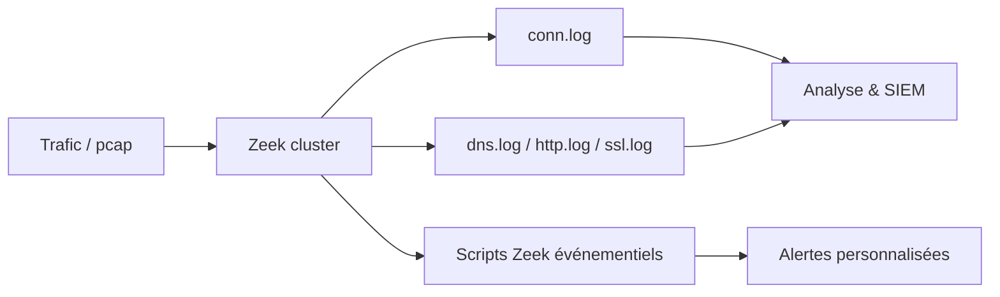

# Zeek — Défense & SIEM

> [!info] **En 1 phrase**
> Zeek (ex-Bro) est un **NSM (Network Security Monitor)** qui, sans règles de signatures,
> journalise **chaque connexion** (conn.log, dns.log, http.log...) dans des fichiers tabulaires
> exploitables par un SIEM.

---

## Overview

| Champ | Valeur |
|---|---|
| Nom complet | Zeek (anciennement Bro) |
| Description | NSM réseau : journalisation des métadonnées de connexions et protocoles, programmable par scripts événementiels |
| Catégorie | IDS / SIEM / EDR |
| Sous-catégorie | Network Security Monitoring (NSM) / métadonnées réseau |
| Fonction principale | Reconstruire les sessions et journaliser qui parle à qui, quand, combien de temps et quoi (HTTP, DNS, SSL, FTP, SMTP, SSH...) |
| Type d'outil | Daemon de capture (cluster manager/worker) + CLI (zeek, zeekctl, zeek-cut) |
| Licence | BSD-3-Clause (moteur et scripts officiels) |
| Open source / propriétaire | Open source |
| Langage(s) de programmation | C++ (moteur), Zeek scripting (policy scripts), Python (outillage) |
| Développeur / organisation | Zeek Project (fondation open source, anciennement Bro) |
| Projet officiel | Zeek |
| Dépôt officiel | https://github.com/zeek/zeek |
| Documentation officielle | https://docs.zeek.org |
| Date de création | 1995 (Bro, Berkeley) ; renommé Zeek en 2018 |
| État du projet | actif (LTS 8.0.x ; feature 8.2.x ; 9.0 planifiée pour 2026-08-31) |
| Dernière version connue | 8.0.9 (LTS) / 8.2.1 (feature) |
| Systèmes compatibles | Linux, FreeBSD, macOS, Windows (natif via installateur MSI) |

> [!note] Pour vérifier / compléter
> La 9.0 est annoncée pour fin août 2026 : vérifier les changements de compatibilité des scripts et le passage LTS avant mise à niveau depuis une 8.0.x/8.2.x.

---

## Concept

Zeek se concentre sur **ce qui se passe** sur le réseau plutôt que sur la recherche de signatures : il reconstruit les sessions et **journalise les métadonnées** (qui a parlé à qui, quand, combien de temps, quoi) pour HTTP, DNS, SSL, FTP, SMTP, SSH... Il complète parfaitement un IDS à signatures (Snort/Suricata) car il capture la **vérité réseau** : il n'a pas besoin de connaitre la signature pour enregistrer la connexion suspecte. Il est programmable en **scripts Zeek** (langage événementiel) pour ajouter des analyses personnalisées (détection de nouvelles connexions vers des IP internes, champs HTTP atypiques, TLS self-signed, etc.). Moins connu du grand public mais standard dans les SOC modernes : c'est le moteur de **Security Onion** et de nombreuses distributions de supervision.



---

## Concepts fondamentaux

| Concept | Explication |
|---|---|
| conn.log | Journal des connexions : adresses, ports, protocole, durée, octets, état (S0, SF...) |
| dns.log / http.log / ssl.log | Métadonnées par protocole applicatif (requêtes, réponses, certs) |
| notice.log | Notices générées par les scripts (alerte de haut niveau) |
| weird.log | Comportements anormaux/inattendus (évasion, anomalies de protocole) |
| Zeek scripting | Langage événementiel : `new_connection`, `ssl_established`, `http_request` |
| zeekctl | Gestionnaire du cluster : `deploy`, `status`, `stop`, `reload` |
| node.cfg | Définition des rôles : manager, worker, proxy |
| zeek-cut | Outil d'extraction de colonnes des `.log` tabulaires |
| Framework Notice | Génération de notices réglables (actions, échantillonnage, suppression de doublons) |
| Framework Intelligence | Alimentation en indicateurs (IP/domaine/hash) depuis MISP, threat intel |
| zkg | Gestionnaire de paquets Zeek (extensions/scripts) |
| Cluster | Architecture manager + workers + proxies pour la montée en charge |

---

## Installation

### Debian / Ubuntu

```bash
sudo apt update && sudo apt install -y zeek
export PATH=$PATH:/opt/zeek/bin        # sur Debian/Ubuntu
zeekctl check                          # vérifie l'installation
```

### Docker (test rapide)

```bash
docker run --rm -it -v $(pwd)/pcaps:/pcaps zeek/zeek:latest -r /pcaps/capture.pcap
```

### macOS / Windows / compilation

```bash
# macOS
brew install zeek
# Compilation depuis les sources (CMake)
git clone https://github.com/zeek/zeek.git && cd zeek
./configure && make && sudo make install
```

Sur Windows : Zeek s'exécute nativement (installateur MSI officiel) ; les scripts et `zeekctl` restent les mêmes qu'ailleurs.

> [!warning] Prérequis & problèmes potentiels
> - Le paquet `zeek` Debian installe dans `/opt/zeek` : ajouter `/opt/zeek/bin` au `PATH` avant d'utiliser `zeek-cut`.
> - La capture en temps réel (`-i eth0`) nécessite les privilèges root ou des capabilities `CAP_NET_RAW`.
> - En cluster, tous les nœuds doivent partager la même config Zeek (`zeekctl deploy` synchronise les scripts).

---

## Configuration

| Paramètre / Fichier | Rôle | Valeur possible | Impact | Exemple |
|---|---|---|---|---|
| `node.cfg` | Définition du cluster | sections par nœud | Rôle manager/worker/proxy | `[manager] type=manager; host=127.0.0.1` |
| `zeekctl.cfg` | Paramètres de zeekctl | chemins, options | Répertoires logs, options | `LogDir=/opt/zeek/logs` |
| `local.zeek` | Scripts chargés au démarrage | `@load` | Extensions actives | `@load base/protocols/conn` |
| `Site::local_nets` | Réseaux internes | liste CIDR | Classification interne/externe | `redef Site::local_nets += { 10.10.20.0/24 };` |
| `notice.action_delays` | Délais des actions de notice | secondes | Limite de volume d'alertes | `redef Notice::action_delays = { ... };` |
| `redef Log::default_rotation_interval` | Rotation des logs | intervalle | Volume des `.log` | `1hr` |
| `intel::read_files` | Fichiers d'indicateurs | chemins | Alimentation du framework intel | `redef Intel::read_files += { "/opt/zeek/intel.dat" };` |
| `Capture::default_pcap_size` | Limite de capture PCAP | octets | Mémoire/stockage | `redef Capture::default_pcap_size = 1MB;` |

> [!note] À vérifier
> La configuration se fait via des scripts `redef` dans `local.zeek` et le cluster dans `node.cfg` : la syntaxe exacte des options évolue entre versions majeures (Bro → Zeek). Se référer à la doc officielle pour la version installée.

---

## Architecture interne

Composants et flux à l'exécution :

- **Moteur de capture** : en temps réel (`-i <iface>` via libpcap/AF_PACKET) ou hors-ligne (`-r <pcap>`) ; les paquets sont assemblés en sessions par l'Event Engine.
- **Event Engine** : le cœur en C++ analyse les flux et émet des **événements** (`new_connection`, `http_request`, `ssl_established`) consommés par la couche scripting.
- **Policy Scripts** : scripts Zeek (langage événementiel) qui décident quoi journaliser, générer des notices, ou interagir avec les frameworks (Notice, Intelligence, Files, Cluster).
- **Sortie logs** : chaque script de politique produit des fichiers `.log` tabulaires (TSV) avec en-tête `#fields` ; rotation gérée par zeekctl (`logs/current/`).
- **Cluster** : les **workers** capturent et analysent le trafic (répartition par flux), les **proxies** agrègent certains événements (cluster framework), le **manager** agrège et écrit les logs consolidés.
- **Frameworks** : Notice (alertes), Intelligence (indicateurs MISP), Files (extraction d'entités), Packet analysis (`-r`), zeekygen (docs).

Flux type : paquet → Event Engine (C++) → événement → scripts de politique → écriture `.log` (TSV) → rotation → SIEM (Filebeat/Splunk Forwarder) pour corrélation.

---

## Commandes

### Commandes principales

```bash
zeek -r capture.pcap                    # analyse un pcap, produit les .log
zeek -i eth0                            # écoute en temps réel
zeekctl deploy                          # lance le cluster de capteurs (worker/manager)
zeekctl status                          # état des processus
cat conn.log | zeek-cut id.orig_h id.resp_h proto     # colonnes sélectionnées
cat http.log | zeek-cut -d , host uri status_code      # délimiteur personnalisé
```

| Commande | Objectif | Résultat attendu |
|---|---|---|
| `zeek -r <pcap>` | Analyse hors-ligne | Les `.log` générés dans le répertoire courant |
| `zeek -i eth0` | Mode temps réel sur une interface | Logs continus |
| `zeekctl deploy` | Démarre le cluster (manager + workers) | Processus actifs |
| `zeekctl stop` | Arrête le cluster proprement (rotation) | Logs finalisés |
| `zeekctl reload` | Recharge les scripts sans couper la capture | Nouveaux scripts actifs |
| `zeek-cut` | Extrait des colonnes précises d'un `.log` | Colonnes demandées |
| `zeek-cut -f <expr>` | Filtre les lignes avec une expression | Lignes correspondantes |
| `zeek -e '<snippet>'` | Exécute un snippet de script Zeek directement | Analyse avec le snippet |
| `zeek -C -r <pcap>` | Désactive la validation des checksums | Logs plus complets sur pcaps dégradés |

### Commandes avancées

```bash
# Rejouer un pcap avec un script maison sans modifier local.zeek
zeek -C -r malware.pcap local-script.zeek

# Filtrer les connexions UDP vers le port 53
zeek-cut -f '$proto == "udp"' id.orig_h id.resp_h id.resp_p < conn.log

# Lister les chemins d'accès HTTP exfiltrant de gros volumes
zeek-cut -d , host uri method response_body_len < http.log \
  | awk -F, '$4 > 1000000 {print}'
```

---

## Options et flags

| Option | Description | Exemple | Niveau |
|---|---|---|---|
| `-r <pcap>` | Analyse d'un fichier pcap | `zeek -r cap.pcap` | Basic |
| `-i <iface>` | Interface temps réel | `zeek -i eth0` | Basic |
| `-C` | Ne pas valider les checksums | `zeek -C -r cap.pcap` | Intermediate |
| `-e '<code>'` | Snippet de script Zeek | `zeek -r c.pcap -e 'event new_connection(c) { print c$id; }'` | Intermediate |
| `-s <file>` | Charger un script spécifique | `zeek -r c.pcap -s local.zeek` | Intermediate |
| `-c <file>` | Fichier de config alternatif | `zeekctl -c custom.zeekctl deploy` | Advanced |
| `-b` | Mode batch (pas de terminal interactif) | `zeek -b -r c.pcap` | Advanced |
| `-d` | Journaliser les requêtes d'événements (debug) | `zeek -d -i eth0` | Expert |
| `-v` | Version + options de compilation | `zeek -v` | Basic |
| `-f <filter>` | Filtre BPF à l'écoute | `zeek -i eth0 -f "tcp port 80"` | Advanced |

> [!tip] Options les plus utiles au quotidien
> `-C -r` pour analyser des pcaps dégradés, `-e` pour tester un script sans déploiement, `zeek-cut` pour toute extraction, et `zeekctl reload` en production pour charger de nouveaux scripts à chaud.

---

## Exemples pratiques

### Beginner

```bash
# Objectif : analyser un pcap et compter les connexions
zeek -C -r capture.pcap
zeek-cut proto < conn.log | sort | uniq -c | sort -rn
```

### Intermediate

```bash
# Objectif : extraire les sites visités et leurs codes HTTP
zeek-cut -d , host uri status_code < http.log | sort | uniq -c | sort -rn | head
```

### Advanced

```bash
# Objectif : chasser les requêtes DNS exotiques (TXT volumineux = exfil possible)
zeek-cut query qtype_name answers < dns.log | awk '$2 == "TXT" {print $1}' \
  | sort | uniq -c | sort -rn | head
```

### Expert

```zeek
# Objectif : notice sur toute connexion vers un port non standard
event new_connection(c: connection) {
    if ( c$id$resp_p !in set(80/tcp, 443/tcp, 53/udp, 22/tcp) ) {
        NOTICE([$note=Weird::Activity,
                $msg=fmt("Connexion sortante vers port non standard %d",
                         c$id$resp_p),
                $conn=c]);
    }
}
```

---

## Workflow complet (scénario pas à pas)

1. **Capturer puis analyser** un pcap malveillant :
   ```bash
   zeek -C -r malware.pcap
   ls *.log   # conn.log dns.log http.log ssl.log ...
   ```
2. **Identifier les connexions sortantes** vers des ports inhabituels :
   ```bash
   zeek-cut id.orig_h id.resp_h id.resp_p < conn.log | awk '$3 !~ /^(80|443|53)$/'
   ```
3. **Analyser les requêtes DNS** (exfil / typo-squatting) :
   ```bash
   zeek-cut query answers < dns.log | sort | uniq -c | sort -rn | head -20
   ```
4. **Observer un site web visité** dans `http.log` : `zeek-cut host uri < http.log`.
5. **Déployer en cluster** : éditer `node.cfg` (manager + worker), puis `zeekctl deploy` et consulter les logs dans `/opt/zeek/logs/current/`.
6. **Ajouter un script maison** : écrire un fichier `.zeek` dans `/opt/zeek/share/zeek/site/` puis recharger avec `zeekctl reload`.

---

## Scénarios avancés

### Scénario 1 : Détection des certificats TLS auto-signés

Les malwares et les C2 utilisent souvent des certificats auto-signés : alerter sur les certs inconnus des CA.

```zeek
event ssl_established(c: connection, h: string) {
    if ( h == "" ) {
        NOTICE([$note=SSL_Invalid_Server_Cert,
                $msg=fmt("Handshake avec certificat auto-signé %s", c$id)]);
    }
}
```

Sauver le fichier dans `site/` puis `zeekctl reload` : chaque handshake suspect génère une notice dans `notice.log`.

### Scénario 2 : Détection d'exfiltration par DNS

Corréler les requêtes DNS volumineuses ou à haute entropie (domaines générés par algorithmes DGA).

```bash
# Top des requêtes DNS avec réponses en TXT (canal d'exfil fréquent)
zeek-cut query answers < dns.log | awk '$2 ~ /TXT/ {print $1}' | sort | uniq -c | sort -rn | head
# Tunnels : grandes tailles de réponses ou requêtes très fréquentes vers un même domaine
```

### Scénario 3 : Alimentation du framework Intelligence depuis un flux MISP

```text
# intel.dat (format tabulaire : indicateur, type, source, url, description)
evil.example.com domain example.com "MISP" https://example.com/intel "C2 détecté"
203.0.113.66 Intel::ADDR example.com "MISP" https://example.com/intel "IP C2"
a3f2c1e4... Intel::FILE_HASH example.com "MISP" https://example.com/intel "Malware"
```

```bash
# Puis recharger les indicateurs
zeekctl reload
# Chaque événement touchant ces indicateurs remonte dans intel.log
zeek-cut -d , seen.indicator matched < intel.log
```

---

## Cybersecurity use cases

| Phase | Utilisation |
|---|---|
| NSM / SOC | Journalisation de toutes les métadonnées de connexions pour investigation |
| Investigation d'incident | Rejeu de pcaps compromis (`zeek -C -r`) pour reconstruire le cheminement |
| Threat hunting | Chasse sur dns.log, ssl.log, conn.log : DGA, beaconing, ports atypiques |
| Corrélation SIEM | Métadonnées TSV ingérées par Elastic/Splunk/Graylog pour corréler avec les alertes |
| Alimentation threat intel | Framework Intelligence alimenté par MISP, indicateurs bloquants en log |
| Complément IDS | Associé à Suricata/Snort : vérité réseau + signatures |

---

## MITRE ATT&CK

| Tactique | Technique / Sub-technique | ID | Raison | Détection | Mitigation |
|---|---|---|---|---|---|
| Command and Control | Non-Standard Port | T1571 | Connexions sortantes vers ports atypiques | conn.log + scripts | Egress filtering |
| Command and Control | Application Layer Protocol: DNS | T1071.004 | Exfil/tunneling DNS, DGA | dns.log + entropie | Résolveur filtrant, sinkhole |
| Command and Control | Encrypted Channel: Symmetric/Non-Standard | T1573 | C2 chiffré, certs auto-signés | ssl.log + x509.log | Inspection certs, liste de CA |
| Exfiltration | Exfiltration Over Alternative Protocol | T1048 | Tunnels DNS/ICMP/HTTP | volume dns.log/http.log | DLP, quotas |
| Discovery | Network Service Discovery | T1046 | Scans visibles dans conn.log (ports multiples) | analyse conn.log | Limiter l'exposition |
| Initial Access | Exploit Public-Facing Application | T1190 | Exploits HTTP visibles dans http.log | corrélation avec alertes | Patching, WAF |

> [!note] Ne renseigner que si l'association est réellement pertinente.
> Zeek est un **moniteur** : il ne génère pas de blocage. Les détections ci-dessus alimentent des alertes via le framework Notice et le SIEM.

---

## Defensive Security

### Signes observables

| Indicateur | Détail |
|---|---|
| Connexions sortantes vers ports inhabituels | Alerter sur `conn.log`, egress filtering, corrélation SIEM |
| Nombre élevé de requêtes DNS vers un domaine | Analyse `dns.log` + threat intel (MISP), blocage via le resolver |
| Certificats TLS auto-signés / invalides | Règle Zeek + validation PKI, HSTS côté clients |
| Échantillon de pcap rejoué sur Zeek | `zeek -r` en mode hors-ligne, jamais sur le réseau de production |

### Règles de détection (Sigma / Suricata / Snort / YARA)

```yaml
# Sigma — connexion sortante vers port non standard (data Zeek conn.log)
title: Zeek Outbound Connection to Non-Standard Port
id: b3c4d5e6-7f8a-4b9c-0d1e-2f3a4b5c6d7e
status: experimental
logsource:
    category: network_connection
    product: zeek
detection:
    selection:
        id.resp_p:
            - 4444
            - 5555
            - 8081
            - 31337
    condition: selection
falsepositives:
    - Outils légitimes utilisant des ports non standards
level: medium
```

```text
# Règle Suricata — complément signature sur le flux détecté par Zeek
alert tcp $HOME_NET any -> $EXTERNAL_NET 4444 (msg:"Possible reverse shell (beacon)";
  flow:to_server,established; sid:2000009; rev:1;)
```

---

## Automatisation

```bash
# Bash — rotation + archivage des logs Zeek
zeekctl cron; find /opt/zeek/logs -name "*.log.*" -mtime +30 -delete

# Bash — alerte sur les nouvelles connexions sortantes vers l'extérieur
tail -F conn.log | zeek-cut id.orig_h id.resp_h id.resp_p \
  | grep -v -E "10.10.20.|8.8.8.8|1.1.1.1"
```

```python
# Python — parser un conn.log (TSV avec en-têtes #fields)
import csv

with open("conn.log") as f:
    fields = None
    for line in f:
        if line.startswith("#fields"):
            fields = line.strip().split("\t")[1:]
        elif line.startswith("#") or not fields:
            continue
        else:
            row = dict(zip(fields, line.rstrip().split("\t")))
            print(row["id.orig_h"], "->", row["id.resp_h"], row["id.resp_p"])
```

---

## Output et parsing

Les `.log` sont des fichiers **tabulés (TSV)** avec des lignes d'en-tête `#separator \x09`, `#fields`, `#types`. Chaque ligne est un événement : `ts`, `uid`, `id.orig_h`, `id.orig_p`, `id.resp_h`, `id.resp_p`, plus les champs propres au protocole.

```bash
# Afficher l'en-tête (colonnes disponibles)
head -8 conn.log

# Extraire les connexions HTTP vers des domaines exotiques
zeek-cut -d , id.orig_h host uri < http.log | awk -F, '$2 ~ /example\.com|\.xyz/ {print}'

# Compter les certificats TLS par émetteur
zeek-cut -d , cert_subject < ssl.log | sort | uniq -c | sort -rn | head
```

```python
# Python — extraire les requêtes DNS vers des domaines récents
import csv

with open("dns.log") as f:
    fields = None
    for line in f:
        if line.startswith("#fields"):
            fields = line.strip().split("\t")[1:]
        elif line.startswith("#") or not fields:
            continue
        else:
            row = dict(zip(fields, line.rstrip().split("\t")))
            q = row.get("query", "")
            if q.endswith((".xyz", ".top", ".click")):
                print(row.get("ts"), q)
```

---

## Intégrations

```text
Zeek (logs TSV) → Filebeat module zeek → Elasticsearch / Splunk / Graylog
Zeek + Suricata → Security Onion (métadonnées + signatures côte à côte)
Zeek (Framework Intelligence) → MISP / threat intel (feeds)
Zeek → zeek-cut → pipelines Python/Go d'analyse
```

- [[Tools| Outils]]
- [[Outil - Suricata]] — signatures complémentaires aux métadonnées Zeek
- [[Outil - Snort]] — alternative à signatures, même complémentarité
- [[Outil - Elastic]] — ingestion des `.log` Zeek (module Filebeat)
- [[Outil - Splunk]] — ingéré via forwarder sur les fichiers TSV
- [[Outil - Graylog]] — centralisation des métadonnées Zeek
- [[Outil - MISP]] — indicateurs alimentant le Framework Intelligence
- [[Outil - Sigma]] — règles converties pour les champs Zeek

---

## Alternatives

| Outil | Avantages | Inconvénients | Cas d'usage |
|---|---|---|---|
| Zeek | Métadonnées riches, programmable, open source | Ne bloque pas, pas de signatures | NSM / vérité réseau |
| Suricata | Signatures, IPS, multi-thread | Moins de métadonnées de session | Détection + blocage |
| tcpdump | Simple, capture brute | Pas d'analyse applicative | Capture ponctuelle |
| Arkime | Indexation PCAP, UI de recherche | Pas de scripting protocolaire | Rejouage/recherche de captures |
| NetFlow/IPFIX | Léger, agrégé par routeur | Pas de couche applicative | Visibilité de haut niveau |
| Security Onion | Stack complète intégrée | Moins de contrôle fin | Plateforme NSM clé en main |

> **Quand utiliser Zeek plutôt qu'un IDS ?** Pour la **reconstruction d'incidents** et la **corrélation multi-connexions**, Zeek est supérieur aux signatures. Pour du **blocage en temps réel** ou une détection par signatures, garder Suricata/Snort — dans la plupart des SOC modernes, les deux cohabitent.

---

## Performance

- **Répartition par flux** : en cluster, chaque worker traite une partie des flux (hash sur le 4-tuple) → montée en charge linéaire.
- **Côté mémoire** : la reconstruction de sessions coûte en RAM (état par connexion) : dimensionner selon le débit et le nombre de connexions simultanées.
- **Capture vs analyse** : la capture (kernel) est plus légère que l'analyse applicative ; utiliser `zeekctl` pour répartir la charge et surveiller `stats.log`.
- **Volume de logs** : chaque connexion génère des lignes TSV : prévoir rotation (`Log::default_rotation_interval`) et ingestion SIEM.
- **Drops de paquets** : surveiller `capture_loss` dans `stats.log` et `reporter.log` ; réduire le filtrage ou augmenter la mémoire tampon.
- **PCAP offline** : `zeek -r` sur des fichiers lourds reste séquentiel : fractionner les captures pour paralléliser l'analyse.

> [!note] À vérifier
> Les débits réels (Gbps) dépendent du matériel, du nombre de protocoles analysés et du cluster : benchmarker avec `zeek -r` sur des pcaps de référence et mesurer `capture_loss`.

---

## Troubleshooting

### Common problems

#### Problème : `zeekctl` n'est pas trouvé (command not found)

- **Cause** : `/opt/zeek/bin` absent du `PATH` (paquet Debian).
- **Solution** : `export PATH=$PATH:/opt/zeek/bin` (à ajouter au `.bashrc`).
- **Vérification** : `which zeek zeekctl zeek-cut`.

#### Problème : aucun log produit après `zeek -r`

- **Cause** : pcap vide, filtre BPF trop restrictif, ou `-C` absent (checksums invalides écartés).
- **Solution** : vérifier le pcap (`tcpdump -r file -c 5`), relancer avec `-C`, retirer le filtre.
- **Vérification** : `ls -la *.log` et `zeek-cut id.orig_h < conn.log | head`.

#### Problème : pertes de paquets en temps réel

- **Cause** : analyse trop lourde, ring buffer saturé, workers insuffisants.
- **Solution** : réduire les protocoles analysés, ajouter des workers dans `node.cfg`, augmenter la mémoire capture.
- **Vérification** : `zeek-cut -d ts capture_loss < stats.log`.

#### Problème : un script maison ne prend pas effet

- **Cause** : fichier non chargé dans `local.zeek` ou `zeekctl reload` non exécuté.
- **Solution** : ajouter `@load <chemin>` ou le nom du script à la ligne de commande, puis `zeekctl reload`.
- **Vérification** : rechercher les erreurs dans `reporter.log`.

#### Problème : `zeek-cut` échoue (colonnes vides)

- **Cause** : nom de colonne incorrect ou délimiteur différent.
- **Solution** : vérifier l'en-tête `#fields` du `.log` et utiliser `-d ,` pour les exports CSV.
- **Vérification** : `head -2 conn.log | tail -1`.

---

## Sécurité de l'outil

- **Privilèges** : la capture temps réel requiert root/CAP_NET_RAW : utiliser un utilisateur dédié et le sudo minimal.
- **Données sensibles** : les `.log` contiennent des adresses, hostnames, user-agents, requêtes et empreintes de certs : protéger le dossier logs, chiffrer au repos, purger avec rotation.
- **Exposition** : ne jamais exposer les logs ni l'interface d'administration sur Internet ; SIEM en lecture seule via Filebeat/forwarder.
- **Scripts** : ne charger que des scripts de sources fiables (`zkg` et le site officiel) ; un script malveillant peut exfiltrer les métadonnées ou créer des backdoors dans la politique.
- **Intelligence** : les indicateurs (intel.dat) doivent être vérifiés avant intégration pour éviter les faux positifs massifs.
- **Posture défensive** : Zeek étant passif, il ne peut pas être détourné en outil offensif direct, mais ses données aident un attaquant : restreindre l'accès aux logs.

---

## Limitations

- **Pas de blocage** : Zeek est un moniteur passif — aucun drop ni réécriture (déléguer à Suricata en IPS).
- **Pas de signatures** : sans les scripts, pas de détection « d'attaque connue » à la manière d'un IDS.
- **Trafic chiffré** : TLS inspecté seulement au niveau des métadonnées (SNI, certs) sauf à coupler avec interception.
- **Coût en ressources** : reconstruction de sessions et parsing applicatif coûteux en mémoire/CPU sur liens rapides.
- **Complexité cluster** : la montée en charge exige une architecture manager/worker/proxy maîtrisée.
- **Scripting nécessaire** : la plupart des analyses personnalisées exigent des compétences en langage Zeek.

---

## Cheatsheet

```bash
# Analyser un pcap (hors-ligne)
zeek -C -r capture.pcap

# Écouter une interface en temps réel
sudo zeek -i eth0

# Gérer le cluster
zeekctl deploy && zeekctl status
zeekctl reload          # recharger les scripts
zeekctl stop            # arrêt + rotation

# Extraire des colonnes
cat conn.log | zeek-cut id.orig_h id.resp_h proto
cat http.log | zeek-cut -d , host uri status_code

# Filtrer par expression
zeek-cut -f '$proto == "udp"' id.orig_h id.resp_h < conn.log

# Tester un snippet sans déploiement
zeek -r cap.pcap -e 'event new_connection(c) { print c$id; }'

# Top des requêtes DNS
zeek-cut query < dns.log | sort | uniq -c | sort -rn | head
```

---

## Quick reference

| | |
|---|---|
| **À quoi sert-il ?** | NSM : journalise les métadonnées de chaque connexion (conn.log, dns.log, http.log, ssl.log...) |
| **Quand l'utiliser ?** | Investigation d'incident (rejeu de pcap), corrélation SIEM, complément d'un IDS à signatures |
| **Commande principale** | `zeek -C -r capture.pcap` puis `zeek-cut` sur les `.log` |
| **Alternative principale** | Suricata/Snort (signatures), Arkime (indexation PCAP) |
| **Concepts importants** | conn.log, zeek-cut, zeekctl, cluster manager/worker, scripts événementiels |
| **Liens associés** | [[Outil - Suricata]] · [[Outil - Snort]] · [[Outil - Elastic]] · [[Outil - MISP]] |

---

## Détection & Défense

| Signe | Défense |
|---|---|
| Connexions sortantes vers ports non standards | Alerter sur conn.log, egress filtering, corrélation SIEM |
| Beacons C2 périodiques vers une même IP | Analyse des écarts temporels, blocage IP/domaine |
| Requêtes DNS vers domaines DGA/récents | Entropie dns.log + threat intel, sinkhole |
| Certificats TLS auto-signés ou invalides | Script Zeek + validation PKI, HSTS |
| Capteur muet / pertes de paquets | Surveiller stats.log et `capture_loss`, supervision zeekctl |

---

## Tips & Pièges

> [!tip] **Zeek ne bloque pas — et c'est voulu**
> C'est un **moniteur** : il ne peut ni dropper ni réécrire les paquets. Utilise-le pour la
> **vérité de référence** des connexions, et délègue le blocage à un IPS (Suricata en inline).

> [!warning] **Piège** : les `.log` sont des fichiers **tabulés** (`\x09`), pas du JSON.
> `zeek-cut` est indispensable pour les manipuler proprement — un simple `cut -d" "` échoue
> toujours. Vérifie aussi la clé de la sortie de DNS : `.log` ne couvre que ce que Zeek a vu.

> [!warning] **Piège** : `-C` change les résultats.
> Sans `-C`, Zeek écarte les paquets avec checksums invalides : sur un pcap capturé en conditions réelles, les logs peuvent être **partiels**. Utiliser `-C` par défaut lors des investigations.

> [!warning] **Piège** : les scripts doivent être compatibles avec la version.
> Du code écrit pour Bro ou Zeek 5 peut ne pas compiler sous 8.x : tester avec `zeek -b -e '@load ...'` avant déploiement en cluster.

---

## References

### Official

- Site officiel : https://zeek.org
- Documentation (Zeek Book) : https://docs.zeek.org
- GitHub Zeek : https://github.com/zeek/zeek
- Zeek Cut manuel : https://docs.zeek.org/en/current/zeek-cut.1.html
- Package manager zkg : https://docs.zeek.org/en/current/zkg.html

### Security references

- MITRE ATT&CK T1571 — Non-Standard Port : https://attack.mitre.org/techniques/T1571/
- MITRE ATT&CK T1071.004 — DNS : https://attack.mitre.org/techniques/T1071/004/
- MITRE ATT&CK T1573 — Encrypted Channel : https://attack.mitre.org/techniques/T1573/

### Community

- Security Onion (distribution NSM) : https://securityonion.net
- Blog Zeek : https://zeek.org/blog/
- Réseau des utilisateurs : https://community.zeek.org

---

**Liens :** [[Tools| Outils]] · [[Techniques/Reverse Shells| Reverse Shells]] · [[Techniques/Pivoting et Tunneling| Pivoting / Tunneling]] · [[Techniques/LLMNR-NBT-NS Poisoning| LLMNR/NBT-NS Poisoning]]
