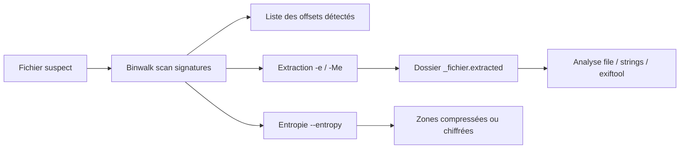

# 🧱 Binwalk — La forensique des fichiers embarqués

> [!info] **En 1 phrase**
> Scannez, identifiez et extrayez les fichiers et firmwares cachés dans une image ou un binaire : le flag est souvent un système de fichiers Zip coincé dedans.

---

## 🧾 Overview

| Champ | Valeur |
|---|---|
| Nom complet | Binwalk |
| Description | Outil d'analyse et d'extraction de fichiers/firmwares embarqués : scan par signatures (magic bytes), entropie, carving et extraction récursive |
| Catégorie | CTF & Développement |
| Sous-catégorie | Forensique / Reverse Engineering / Analyse de firmware |
| Fonction principale | Identifier et extraire les fichiers et systèmes de fichiers enfouis dans une image binaire |
| Type d'outil | CLI (avec bibliothèque Rust intégrable) |
| Licence | MIT |
| Open source / propriétaire | Open source |
| Langage(s) de programmation | Rust (v3.x), Python (v2.x, héritage) |
| Développeur / organisation | ReFirmLabs (Craig Heffner « devttys0 », Stephen de Vries et la communauté) |
| Projet officiel | ReFirmLabs/binwalk |
| Dépôt officiel | https://github.com/ReFirmLabs/binwalk |
| Documentation officielle | https://github.com/ReFirmLabs/binwalk/wiki |
| Date de création | 15 novembre 2013 |
| État du projet | actif (v3.1.0 publiée le 31 octobre 2024, réécriture complète en Rust) |
| Dernière version connue | 3.1.0 (la 2.3.4 reste la dernière branche Python) |
| Systèmes compatibles | Linux, macOS, Windows (v3 natif), BSD, Docker |

> [!note] Pour vérifier / compléter
> Depuis la v3, le binaire est compilé en **Rust** : plus rapide et beaucoup moins de faux positifs que la v2 Python. Kali/Debian fournissent encore la v2 ; la v3 s'installe via Cargo ou Docker. Documentation officielle : le wiki GitHub.

---

## 🎯 Concept

Binwalk est l'outil de référence de la **forensique de fichiers** : il analyse un fichier quelconque (image PNG/JPEG, firmware `.bin`, binaire ELF, archive, carte SD, disque…) en cherchant des **signatures connues** (magic bytes) à tous les offsets. Zlib, Gzip, Zip, tar, SquashFS, JFFS2, CramFS, LZMA, ELF, PNG, JPEG, ISO, exFAT/NTFS… la base de signatures est très large et, depuis la v3, chaque signature est validée par un **parser dédié** qui vérifie la cohérence des métadonnées avant de l'afficher — d'où la chute spectaculaire des faux positifs.

Son rôle dans un pentest ou un CTF : tout fichier reçu est suspect. Un challenge « misc » classique fournit un PNG qui contient en réalité un **Zip**, un **tar** ou un **ELF** apposé à la suite (*append*), ou un firmware réseau dont on veut extraire le système de fichiers pour récupérer binaires, configs ou clés privées. Binwalk liste les décalages (`DECIMAL`, `HEXADECIMAL`, `DESCRIPTION`) puis extrait tout avec `-e`, récursivement avec `-Me`. En complément, l'**entropie** (`--entropy`) met en évidence les zones compressées ou chiffrées sans signature.

Historiquement Python (v2.3.4), le projet a été intégralement réécrit en Rust (v3.0.0, octobre 2024) : scan de 78 signatures / 180 motifs en ~90 ms sur un firmware de 15 Mo, extraction appuyée sur les extracteurs système (`7z`, `unsquashfs`, `jefferson`, `ubireader`…). Binwalk s'insère dans la chaîne : récupération du fichier suspect → scan → extraction → analyse (`file`, `strings`, `exiftool`, reverse) → exploitation.



---

## 🧠 Concepts fondamentaux

| Concept | Explication |
|---|---|
| Magic bytes | Octets d'en-tête identifiant un format (`PK\x03\x04` = ZIP, `\x89PNG` = PNG, `hsqs` = SquashFS). Binwalk scan tout le fichier, pas seulement le début |
| Signature / parser | En v3, chaque type de fichier a un parser dédié qui valide métadonnées et taille réelle → beaucoup moins de faux positifs |
| Appended data | Données collées à la fin d'un fichier légitime (Zip/ELF après un PNG) ; invisibles pour l'œil mais détectées par le scan |
| Systèmes de fichiers embarqués | SquashFS, JFFS2, CramFS, ext, UBI/UBIFS, NTFS, APFS, Btrfs, Wince : souvent la cible réelle de l'analyse de firmware |
| Entropie | Mesure de l'aléa (0 à 8 bits) d'un bloc de données : entropie ~8 = compressé/chiffré, ~0 = plat (padding, texte) |
| Carving (`--carve`) | Découpage du fichier en sections connues ET inconnues, écrites dans des fichiers séparés |
| Extraction (`-e`) | Appelle l'extracteur adapté à chaque signature (7z, unzip, unsquashfs, jefferson…) et écrit dans `_fichier.extracted/` |
| Base de signatures | Liste des signatures connues et de leurs parsers, maintenue dans le code Rust |
| Récursivité (`-Me`) | Relance le scan/extraction sur chaque fichier extrait, en cascade |
| Skip intelligent | Les parsers v3 connaissent la taille réelle du contenu et peuvent sauter les données compressées → scan plus rapide |

---

## 🛠️ Installation

### Debian / Ubuntu / Kali Linux

```bash
# Kali/Debian : binwalk v2 (Python) est encore le paquet par défaut
sudo apt update && sudo apt install -y binwalk
# Outils d'extraction souvent nécessaires
sudo apt install -y unzip zip 7zip python3-lzma squashfs-tools
```

### Arch Linux · Fedora / RHEL · macOS

```bash
sudo pacman -S binwalk        # Arch (ou AUR binwalk3-git)
sudo dnf install binwalk      # Fedora / RHEL
brew install binwalk          # macOS
```

### Windows

```powershell
# v3 native : installer Rust puis
cargo install binwalk
# ou utiliser le binaire précompilé des releases v3.x
```

### Docker

```bash
docker build -t binwalk https://github.com/ReFirmLabs/binwalk.git#master
docker run --rm -v "$(pwd):/data" binwalk /data/firmware.bin
```

### Compilation depuis les sources

```bash
# v3 (Rust)
git clone https://github.com/ReFirmLabs/binwalk.git && cd binwalk
cargo build --release && sudo cp target/release/binwalk /usr/local/bin/
# v2 (Python, héritage)
git clone https://github.com/ReFirmLabs/binwalk.git && cd binwalk
sudo python3 setup.py install
```

> [!warning] ⚠️ Prérequis & problèmes potentiels
> - L'**extraction** dépend d'outils externes (`7z`, `unzip`, `unsquashfs`, `jefferson`, `ubireader`…) : sans eux, `-e` signale les signatures mais ne peut pas tout extraire.
> - Kali installe encore la **v2** par défaut : les options `-r`, `-M`, `-A` sont v2 ; la v3 les remplace par `-Me`, `--carve`, `--log`.
> - Windows : l'extraction des SquashFS/JFFS2 nécessite souvent un environnement Linux (WSL ou Docker).

---

## ⚙️ Configuration

Binwalk fonctionne essentiellement **sans fichier de configuration** : tout se passe en arguments CLI. En v2, il existait une option `--config <fichier>` pour désactiver des signatures.

| Paramètre | Rôle | Valeur possible | Impact | Exemple |
|---|---|---|---|---|
| `--include=<noms>` | Restreindre le scan à certaines signatures | Noms séparés par des virgules | Moins de bruit, scan ciblé | `binwalk --include=zip,gzip fw.bin` |
| `--exclude=<noms>` | Exclure des signatures du scan | Noms séparés par des virgules | Élimine les signatures gênantes | `binwalk --exclude=jpeg,png,gif fw.bin` |
| `--block=<taille>` | Taille de bloc (entropie) | 1024, 4096, 65536… | Résolution du graphe d'entropie | `binwalk --entropy --block=65536 fw.bin` |
| `--log=<fichier>` | Sortie JSON des résultats | Chemin de fichier | Pipeline automatisé (SIEM, rapports) | `binwalk --log=result.json fw.bin` |
| `--length=<n>` | Limiter l'analyse aux N premiers octets | Taille en octets | Accélérer le scan de gros disques | `binwalk --length=1048576 fw.bin` |
| `--offset=<n>` | Commencer l'analyse à un offset | Décalage en octets | Reprendre après un en-tête connu | `binwalk --offset=0x4000 fw.bin` |

> [!note] À vérifier
> Les noms exacts des options v3 sont listés dans `binwalk --help` ; `--include`/`--exclude` utilisent les noms de la colonne `Signature Name` du wiki Supported-Signatures.

---

## 🏗️ Architecture interne

Depuis la v3, Binwalk est un **binaire Rust unique** dont l'analyse suit un pipeline (parsing CLI, scan, extraction, entropie) :

- **Scan signatures** : lecture du fichier, match des magic bytes par un moteur de recherche multi-signatures ; chaque match est validé par un **parser dédié** (métadonnées, taille, endianness) puis affiché avec un niveau de confiance coloré (vert = validé, jaune = partiellement validé, rouge = magic bytes seuls).
- **Skip intelligent + extraction** : quand un parser détermine la taille réelle du contenu, le scan **saute** les données compressées ; chaque signature est ensuite extraite par un extracteur associé (`7z`, `unsquashfs`, `jefferson`) dans `_<fichier>.extracted/`, et `-Me` relance le pipeline récursivement.
- **Carving** : `--carve` découpe le fichier brut en sections connues et inconnues, écrites dans des fichiers `.extracted`/`.carved`.
- **Entropie** : découpage par blocs (`--block`), calcul de l'entropie de Shannon par bloc, rendu en graphe PNG et/ou JSON (`--log`).

En v2 (Python), l'architecture reposait sur des **modules Python** (`binwalk/modules/`) ; en v3, l'API publique (`binwalk::scan`) permet d'intégrer l'outil dans d'autres projets Rust. Les extracteurs restent des **outils système externes**.

---

## ⌨️ Commandes

### Commandes principales

```bash
binwalk [options] <fichier>
```

| Commande | Objectif | Résultat attendu |
|---|---|---|
| `binwalk firmware.bin` | Scan de signatures simple | Liste offset / hex / description |
| `binwalk -e firmware.bin` | Scan + extraction automatique | Dossier `_firmware.bin.extracted/` |
| `binwalk -Me firmware.bin` | Scan + extraction **récursive** | Extraction en cascade des fichiers |
| `binwalk --carve firmware.bin` | Découper le fichier en sections | Fichiers `.carved` (connus et inconnus) |
| `binwalk --entropy firmware.bin` | Graphe d'entropie | Image PNG `firmware.bin.png` |
| `binwalk --log=out.json firmware.bin` | Résultats en JSON | Fichier `out.json` exploitable |
| `binwalk --include=zip firmware.bin` | Scan ciblé sur une signature | Seules les signatures ZIP |
| `binwalk --version` | Version du binaire | `v3.1.0` (par ex.) |

### Commandes avancées

```bash
# Entropie + JSON pour pipeline
binwalk --entropy --block=4096 --log=entropy.json firmware.bin
# Scan ciblé en excluant les images
binwalk --exclude=jpeg,png,gif firmware.bin
# Limiter au premier Mo (rapide)
binwalk --length=1048576 firmware.bin
```

---

## 🎚️ Options et flags

| Option | Description | Exemple | Niveau |
|---|---|---|---|
| `-e, --extract` | Extraire les fichiers détectés | `binwalk -e fw.bin` | Basic |
| `-M` (v3 `-Me`) | Récursif : analyser les fichiers extraits | `binwalk -Me fw.bin` | Basic |
| `--carve` | Découper le fichier en sections connues/inconnues | `binwalk --carve fw.bin` | Intermediate |
| `--entropy` | Graphe d'entropie (détection compression/chiffrement) | `binwalk --entropy fw.bin` | Intermediate |
| `--block=<n>` | Taille de bloc pour l'entropie | `binwalk --entropy --block=65536 fw.bin` | Advanced |
| `--log=<fichier>` | Sortie JSON | `binwalk --log=out.json fw.bin` | Advanced |
| `--include=<noms>` | Limiter à des signatures | `binwalk --include=zip,squashfs fw.bin` | Intermediate |
| `--exclude=<noms>` | Exclure des signatures | `binwalk --exclude=png fw.bin` | Intermediate |
| `--length=<n>` | Analyser seulement les N premiers octets | `binwalk --length=1048576 fw.bin` | Advanced |
| `--offset=<n>` | Démarrer à un offset | `binwalk --offset=0x100 fw.bin` | Advanced |
| `--signatures` | Afficher la liste des signatures supportées | `binwalk --signatures` | Intermediate |
| `-y <str>` (v2) | Ne garder que les signatures contenant `<str>` | `binwalk -y squashfs fw.bin` | Intermediate |
| `-r` (v2) | Analyse récursive des extraits | `binwalk -e -r fw.bin` | Basic |
| `-C <dir>` (v2) | Dossier d'extraction cible | `binwalk -e -C ./out fw.bin` | Intermediate |

> [!tip] Options les plus utiles au quotidien
> `-e` (extraire), `-Me` (récursif), `--entropy` (repérer compression/chiffrement), `--log` (JSON pour pipeline) et `--include/--exclude` (calibrer le bruit).

---

## 🧪 Exemples pratiques

### Beginner

```bash
# Objectif : voir ce qui est caché dans un PNG reçu en CTF
binwalk image.png
# Sortie attendue (v3) : PNG à 0x0, puis ZIP/Zlib plus loin
# Objectif : extraire tout en un coup
binwalk -e image.png
# -> dossier _image.png.extracted/ contenant le zip et le flag
```

### Intermediate

```bash
# Extraction récursive sur un firmware avec SquashFS
binwalk -Me firmware.bin
cd _firmware.bin.extracted
ls -la
# puis chercher les fichiers intéressants
grep -rl "password" . 2>/dev/null
```

### Advanced

```bash
# Entropie pour repérer du chiffrement invisible
binwalk --entropy --block=65536 firmware.bin
# Grappe d'entropie ~8 -> zone chiffrée ; ~0 -> padding ; pics -> structure
# Carving des sections inconnues pour ne rien perdre
binwalk --carve firmware.bin
```

### Expert

```bash
# Pipeline : scan JSON -> parsing -> analyse des extraits
binwalk --log=scan.json -Me firmware.bin
```

---

## 🧪 Workflow complet (scénario pas à pas)

1. **Étape 1 — Scanner le fichier suspect** :
   ```bash
   binwalk image.png
   # 0x0 PNG image, 0x3F2 Zip archive data, 0x... Zlib compressed data
   ```
2. **Étape 2 — Extraire tout** :
   ```bash
   binwalk -e image.png
   # -> dossier _image.png.extracted/ avec les fichiers détectés
   ```
3. **Étape 3 — Explorer et identifier** :
   ```bash
   cd _image.png.extracted
   file *          # zip, elf, squashfs...
   ```
4. **Étape 4 — Chercher le flag** :
   ```bash
   cat flag.txt || strings *.bin | grep -i flag
   ```
5. **Étape 5 — Vérifier l'entropie si rien n'apparaît** :
   ```bash
   binwalk --entropy image.png
   # zone d'entropie ~8 sans signature = données compressées/chiffrées à carver
   ```
6. **Étape 6 — Cross-check** : confirmer avec `exiftool`, `strings`, `zsteg`, puis documenter le flag.

---

## 🎬 Scénarios avancés

### Scénario 1 : Firmware avec système de fichiers SquashFS

```bash
binwalk -Me firmware.bin
cd _firmware.bin.extracted
# Identifier le rootfs
file *.squashfs *.sqsh 2>/dev/null
# Monter le SquashFS extrait pour explorer
sudo mount -o loop <rootfs>.squashfs /mnt/rootfs
# Chercher les secrets (configs, clés, binaires réseau)
grep -rE "password|secret|token|private" /mnt/rootfs 2>/dev/null
# Un serveur de gestion web dans le firmware -> porte d'entrée
```

### Scénario 2 : Zip caché dans un PNG (append)

```bash
binwalk -e image.png
cd _image.png.extracted
file *.zip
unzip flag.zip
# Si le Zip est protégé -> cracker avec john / hashcat (zip2john)
```

### Scénario 3 : Firmware chiffré — détection via entropie

```bash
binwalk --entropy --block=4096 encrypted_fw.bin
# Zone "kernel" avec entropie ~8 sans signature SquashFS = chiffré.
# Repartir des clés trouvées ailleurs (bootloader, NVRAM) pour déchiffrer.
```

---

## 🛡️ Cybersecurity use cases

| Phase | Utilisation |
|---|---|
| Reconnaissance | Analyse de documents/images reçus, détection de contenu caché (phishing, malwares) |
| Reverse Engineering | Extraction de SquashFS/rootfs, récupération de binaires, scripts d'init, configs |
| Vulnérabilité | Recherche de secrets (clés SSH, tokens, mots de passe) dans les firmwares |
| Post-exploitation | Analyse d'images disque, extraction de données supprimées/résiduelles (carving) |
| CTF | Résolution des challenges misc/forensic « fichier dans un fichier » |

---

## 🎯 MITRE ATT&CK

| Tactique | Technique / Sub-technique | ID | Raison | Détection | Mitigation |
|---|---|---|---|---|---|
| Defense Evasion | Obfuscated Files or Information | T1027 | Détection/analyse de données cachées ou ajoutées à des fichiers légitimes (stéganographie, append) | Analyse des fichiers uploadés, contrôle des magic bytes réels | Validation stricte des uploads, signature des fichiers |
| Defense Evasion | Binary Padding | T1027.001 | Padding/compression (Zlib, LZMA) de données embarquées mises en évidence par l'entropie | Monitoring des fichiers à structure inhabituelle | Restriction des formats acceptés |
| Collection | Data from Local System | T1005 | Extraction de données (firmwares, images disque) depuis un système local compromis | Supervision des accès en lecture aux images/disques | Principe du moindre privilège |
| Collection | Archive Collected Data | T1560 | Firmwares et rootfs collectés puis extraits pour analyse | Supervision de la création d'archives | Contrôle des canaux d'exfiltration |

> [!note] Ne renseigner que si l'association est réellement pertinente.
> Binwalk est un outil d'**analyse défensive ET offensive** : côté attaquant, il sert surtout à extraire des secrets (T1005, T1027) ; côté défense, c'est un outil de contrôle des uploads et des documents entrants.

---

## 🛡️ Defensive Security

### Signes observables

| Indicateur | Détail |
|---|---|
| Fichier avec plusieurs signatures à des offsets élevés | Un PNG qui contient un Zip en append = contenu polymorphe suspect |
| Entropie ~8 sur une zone qui devrait être du code | Zone compressée ou chiffrée dans un document légitime |
| Exécution de `binwalk`/`7z`/`unsquashfs` sur un endpoint | Détectable par EDR (process creation) |
| Différence entre taille déclarée et taille réelle d'une image | Signature PDF/PNG avec données additionnelles |

### Règles de détection (Sigma / Suricata / Snort / YARA)

```yaml
# Sigma — exécution de binwalk et outils d'extraction (process creation)
title: Firmware Extraction Tooling Execution
id: 0f4b9f6a-3c1e-4d2f-9a4b-7c8d0e1f2a3b
status: experimental
logsource:
    category: process_creation
    product: linux
detection:
    selection:
        Image|endswith:
            - '/binwalk'
            - '/unsquashfs'
            - '/jefferson'
            - '/ubireader_extract_images'
            - '/dd'
    condition: selection
falsepositives:
    - Firmware development and analysis by legitimate teams
level: low
```

> [!note] À vérifier
> Règles pédagogiques : seuils et chemins à adapter à votre parc. Compléter éventuellement par une règle YARA sur les magic bytes `PK\x03\x04` (ZIP) après un en-tête PNG.

---

## 🤖 Automatisation

```bash
# Bash — analyser tous les fichiers d'un dossier, un rapport JSON par fichier
for f in samples/*; do
    binwalk --log="reports/$(basename "$f").json" "$f"
done
```

```python
# Python — extraction récursive puis recherche de secrets
import subprocess, glob, re

subprocess.run(["binwalk", "-Me", "firmware.bin"], check=True)
for path in glob.glob("_firmware.bin.extracted/**/*", recursive=True):
    try:
        data = open(path, "rb").read()
    except OSError:
        continue
    for m in re.finditer(rb"flag\{[^}]+\}", data):
        print(path, m.group().decode())
```

> [!note] Intégration Rust (v3)
> La v3 expose une API publique (`binwalk::scan`) pour intégrer l'analyse dans d'autres projets Rust (wiki « Using the Rust Library »).

---

## 📤 Output et parsing

La sortie standard v3 est une table colorée (`DECIMAL | HEXADECIMAL | DESCRIPTION`) ; `--log=<fichier>` produit du **JSON** structuré, idéal pour les pipelines.

```bash
# Filtrage rapide de la sortie standard
binwalk firmware.bin | grep -iE "squashfs|jffs2|zip"
# JSON -> jq : signatures et offsets
binwalk --log=scan.json firmware.bin
cat scan.json | jq '.[0].Analysis.file_map[] | {offset, name, confidence}'
```

```python
# Python — parsing du JSON généré par --log
import json
report = json.load(open("scan.json"))
for entry in report[0]["Analysis"]["file_map"]:
    print(hex(entry["offset"]), entry["name"], entry["description"])
```

---

## 🔗 Intégrations

```text
Fichier suspect → Binwalk → Extraction → strings/exiftool → analyse statique
Firmware → Binwalk → SquashFS monté → reverse (Ghidra/radare2) → exploitation
```

- [[Tools|🧰 Outils]]
- [[Outil - exiftool]] — métadonnées du fichier suspect avant/après extraction
- [[Outil - zsteg]] — stéganographie LSB dans les images extraites
- [[Outil - stegsolve]] — analyse visuelle des images extraites
- [[Outil - unblob]] — alternative/extraction SquashFS moderne pour firmware
- [[Outil - Ghidra]] — reverse des binaires extraits du rootfs
- [[Outil - radare2]] — analyse rapide des binaires extraits
- [[Outil - Kali Linux]] — environnement pré-packagé avec binwalk
- [[Outil - hashcat]] / [[Outil - John the Ripper]] — cracking des archives chiffrées extraites
- [[09 - Reverse Engineering & Malware|🔬 Reverse & Malware]]

---

## 🔄 Alternatives

| Outil | Avantages | Inconvénients | Cas d'usage |
|---|---|---|---|
| unblob | Extraction SquashFS/UBI très robuste, carvers efficaces | Pas d'analyse de signatures généraliste | Firmwares Linux complexes |
| strings | Simple, rapide, ne rate aucun texte | Pas de structure, faux positifs massifs | Premier passage |
| foremost | Carving par signatures sur fichiers supprimés | Pas d'analyse de firmware | Récupération de données |
| photorec | Carving massif multimédia | Pas de parsing de systèmes de fichiers | Forensique de disque |
| 7z / unzip / tar | Extraction directe d'archives connues | Ne détecte pas les appends | Extraction ciblée |
| dd + analyse manuelle | Contrôle total des offsets | Très manuel | Extraction précise d'un flux |

> **Quand utiliser unblob plutôt que binwalk ?** Pour les firmwares Linux modernes où le SquashFS/UBIFS est le cœur du problème : unblob a un taux de réussite supérieur sur ces systèmes de fichiers, tandis que binwalk reste imbattable pour un tour de détection généraliste rapide.

---

## ⚡ Performance

- **v3 vs v2** : réécriture Rust → scan de 78 signatures sur un firmware de 15 Mo en ~90 ms (contre plusieurs secondes en v2). Les parsers qui « skippent » les données compressées accélèrent le scan des gros fichiers.
- **Entropie** : calcul par blocs ; `--block=65536` est un bon compromis vitesse/précision ; des blocs plus fins (4096) multiplient le temps de calcul.
- **Extraction** : la vitesse dépend des extracteurs externes (7z, unsquashfs) ; une extraction SquashFS d'un rootfs de 100 Mo prend de quelques secondes à une minute.
- **Récursivité (`-Me`)** : coûteuse sur les fichiers « poupées russes » ; surveiller les boucles infinies (fichiers auto-inclus).
- **Mémoire** : v3 faible consommation (Rust, lecture séquentielle) ; l'entropie sur de très gros disques reste le point de contention.

> [!note] À vérifier
> Chiffres issus du wiki officiel (Speed and Accuracy) ; ils dépendent du matériel et de la taille des fichiers.

---

## 🛠️ Troubleshooting

### Common problems

#### Problème : « No signatures were found » alors qu'un ZIP est visible avec `file`

- **Cause** : v2 sans base de signatures ou signature exotique inconnue.
- **Solution** : mettre à jour binwalk, ou utiliser `--carve`/`dd` pour extraire la zone suspecte manuellement. **Vérif** : `binwalk --signatures | grep -i zip`.

#### Problème : l'extraction ne produit rien malgré une signature détectée

- **Cause** : extracteur externe manquant (`7z`, `unsquashfs`, `jefferson`).
- **Solution** : installer les outils d'extraction (voir Installation). **Vérif** : `which unsquashfs; which 7z`.

#### Problème : erreurs Python en v2 (ModuleNotFoundError)

- **Cause** : v2 installée sur un Python trop récent ou dépendances manquantes.
- **Solution** : passer à la v3 (Cargo) ou `pip install` les dépendances. **Vérif** : `binwalk --version`.

#### Problème : trop de faux positifs (zones « Zlib » fausses)

- **Cause** : v2 sans validation ; entropie élevée dans des données aléatoires.
- **Solution** : utiliser la v3 (parsers de validation), recouper avec `--entropy`. **Vérif** : `binwalk -Me` puis `file` sur chaque extrait.

#### Problème : SquashFS monté « wrong fs type »

- **Cause** : support noyau manquant.
- **Solution** : utiliser `unsquashfs` pour extraire sans monter. **Vérif** : `unsquashfs -l <squashfs.img}`.

---

## 🔐 Sécurité de l'outil

- **Usage légal** : l'analyse de firmwares et d'images n'est licite que sur des fichiers dont vous possédez les droits (contrats, autorisations écrites, machines de lab).
- **Malwares embarqués** : un fichier analysé peut contenir du code malveillant ; isoler l'analyse (VM/Docker) avant d'exécuter les binaires extraits.
- **Extracteurs comme vecteur** : `7z`/`unsquashfs` traitent des données non fiables ; maintenir ces outils à jour (vulnérabilités d'archives malveillantes).
- **Exfiltration** : sur un poste compromis, binwalk peut servir à extraire des fichiers avant exfiltration — le surveiller côté EDR.
- **Données sensibles** : les résultats JSON (`--log`) peuvent contenir des secrets extraits ; les stocker de façon chiffrée dans les rapports.

---

## ⚠️ Limitations

- **Extraction dépendante d'outils externes** : sans `7z`/`unsquashfs`/`jefferson`, `-e` ne fait rien.
- **Pas une solution de récupération universelle** : forensique de fichiers supprimés incomplète (préférer foremost/photorec).
- **Faux positifs possibles** : surtout en v2, sur données aléatoires ou compressées ; la v3 les réduit fortement.
- **Chiffrement** : binwalk ne déchiffre rien ; il signale juste les zones d'entropie élevée.
- **Formats exotiques** : certains firmwares propriétaires (en-têtes DLOB, BIN, Autel) sont couverts, mais des formats très récents peuvent manquer jusqu'à une mise à jour.
- **Windows natif** : extraction FS réduite (préférer WSL/Docker).
- **JPEG** : les données LSB stéganographiques relèvent d'autres outils (zsteg, stegsolve) ; binwalk ne gère que la structure du fichier.

---

## 📋 Cheatsheet

```bash
# Scan simple
binwalk firmware.bin

# Scan + extraction
binwalk -e firmware.bin

# Scan + extraction récursive
binwalk -Me firmware.bin

# Graphe d'entropie
binwalk --entropy firmware.bin

# Résultats JSON pour pipeline
binwalk --log=scan.json firmware.bin

# Carving de toutes les sections
binwalk --carve firmware.bin

# Scan ciblé / exclusions
binwalk --include=zip firmware.bin
binwalk --exclude=jpeg,png,gif firmware.bin
```

---

## ⚡ Quick reference

| | |
|---|---|
| **À quoi sert-il ?** | Trouver et extraire les fichiers/firmwares cachés dans un binaire ou une image |
| **Quand l'utiliser ?** | Dès qu'un fichier suspect arrive : CTF misc/forensic, analyse de firmware, upload contrôlé |
| **Commande principale** | `binwalk -Me <fichier>` |
| **Alternative principale** | unblob (firmwares), foremost/photorec (carving), strings (rapide) |
| **Concepts importants** | Magic bytes, signatures/parsers, entropie, carving, `_*.extracted/`, appends |
| **Liens associés** | [[Outil - exiftool]] · [[Outil - zsteg]] · [[Outil - unblob]] · [[Outil - Ghidra]] |

---

## 🔍 Détection & Défense

| Signe | Défense |
|---|---|
| Fichier avec plusieurs signatures à des offsets élevés | Valider la signature réelle du fichier, rejeter les uploads polymorphes |
| Données Zip/Gzip non alignées au début | Vérifier les magic bytes après les en-têtes |
| Zone d'entropie ~8 sans signature (chiffrement) | Contrôle des fichiers chiffrés uploadés, sandbox |
| Firmware contenant des fichiers d'admin | Signer et chiffrer les firmwares, minimiser les fonctionnalités |
| Exécution de binwalk/extracteurs sur un endpoint | Règle Sigma (process creation), whitelist, EDR |

---

## ⚠️ Tips & Pièges

> [!tip] 💡 **Tips**
> - Utilisez `-Me` pour une analyse **récursive** : les fichiers extraits sont eux-mêmes analysés (poupées russes classiques en CTF).
> - Croisez toujours avec `--entropy` : une zone d'entropie ~8 sans signature est de la donnée compressée ou chiffrée à investiguer.
> - Vérifiez la version (`binwalk --version`) : les options changent entre v2 (Python) et v3 (Rust).
> - Sortez en JSON (`--log`) dès qu'un pipeline d'analyse automatisée existe.

> [!warning] ⚠️ **Pièges**
> - `binwalk` sans `-e` **ne fait que lister** : on oublie souvent d'extraire.
> - Les fausses signatures sont courantes en v2 : vérifiez avec `file` le contenu extrait.
> - L'extraction Zlib incomplète laisse des fichiers tronqués : découpez les offsets manuellement (`dd`) et re-scannez.
> - Ne jamais exécuter un binaire extrait d'un firmware sur votre machine : sandbox obligatoire.

---

## 📚 References

### Official

- Dépôt officiel : https://github.com/ReFirmLabs/binwalk
- Wiki officiel (usage, signatures, entropie, JSON) : https://github.com/ReFirmLabs/binwalk/wiki
- Releases officielles : https://github.com/ReFirmLabs/binwalk/releases
- Liste des signatures supportées : https://github.com/ReFirmLabs/binwalk/wiki/Supported-Signatures
- Page Speed and Accuracy (v3) : https://github.com/ReFirmLabs/binwalk/wiki/Speed-and-Accuracy

### Security references

- MITRE ATT&CK T1027 — Obfuscated Files or Information : https://attack.mitre.org/techniques/T1027/
- MITRE ATT&CK T1005 — Data from Local System : https://attack.mitre.org/techniques/T1005/
- MITRE ATT&CK T1560 — Archive Collected Data : https://attack.mitre.org/techniques/T1560/

### Community

- HackTricks — analyse de fichiers/firmware : https://book.hacktricks.xyz/reversing-and-exploiting
- Wiki bi0s.in — stéganographie et forensique : https://wiki.bi0s.in/steganography/
- Guide d'analyse de firmware (ReFirmLabs/FIRMADYNE) : https://github.com/firmadyne/firmadyne

---

➡️ **Liens :** [[Tools|🧰 Outils]] · [[Outil - exiftool|🏷️ ExifTool]] · [[Outil - zsteg|📦 zsteg]] · [[Outil - stegsolve|🖼️ StegSolve]] · [[Outil - unblob|📦 unblob]] · [[Outil - Ghidra|🐉 Ghidra]] · [[Outil - radare2|🌀 radare2]] · [[Outil - hashcat|⚡ hashcat]] · [[Outil - John the Ripper|🔓 John the Ripper]]
