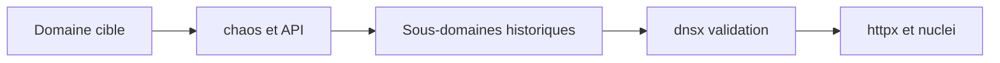

# chaos — Données DNS historiques du bug bounty

> [!info] **En 1 phrase**
> chaos donne accès aux datasets DNS de ProjectDiscovery pour retrouver passivement l'historique des sous-domaines d'un domaine.

---

## Overview

| Champ | Valeur |
|---|---|
| Nom complet | chaos-client (client du Chaos Dataset de ProjectDiscovery) |
| Description | Client CLI du jeu de données DNS de ProjectDiscovery : sous-domaines collectés via les programmes de bug bounty publics et le monitoring continu d'Internet |
| Catégorie | Reconnaissance & OSINT |
| Sous-catégorie | Énumération passive de sous-domaines |
| Fonction principale | Retrouver passivement l'historique des sous-domaines d'un domaine |
| Type d'outil | CLI |
| Licence | MIT |
| Open source / propriétaire | Open source (client) ; la plateforme de données est un service de ProjectDiscovery |
| Langage(s) de programmation | Go |
| Développeur / organisation | ProjectDiscovery |
| Projet officiel | Chaos ProjectDiscovery |
| Dépôt officiel | https://github.com/projectdiscovery/chaos-client |
| Documentation officielle | https://docs.projectdiscovery.io/tools/chaos |
| Date de création | 7 mai 2020 (premier commit du dépôt) |
| État du projet | actif |
| Dernière version connue | v0.5.2 (2024-04-22) |
| Systèmes compatibles | Linux, Windows, macOS (binaires précompilés + `go install`) |

> [!note] Pour vérifier / compléter
> L'accès au dataset exige une clé API obtenue via l'approbation de l'équipe ProjectDiscovery (compte GitHub + demande sur chaos.projectdiscovery.io). La couverture se limite aux domaines suivis par les programmes de bug bounty.

---

## Concept

chaos est le client CLI de la plateforme de données ProjectDiscovery, qui agrège les données DNS collectées via les programmes de bug bounty publics et le monitoring continu d'Internet. Un sous-domaine apparu dans les datasets peut avoir été supprimé depuis : chaos permet de le retrouver (dangling DNS, ré-enregistrement potentiel d'un domaine orphelin). Les datasets sont fournis sous forme de fichiers journaliers téléchargeables sur la plateforme, et le client les interroge en temps réel avec une clé API.

Position : complément de subfinder dans la phase d'énumération de sous-domaines, alimentant le même pipeline (dnsx → httpx → nuclei). L'utilisation exige une clé API (accès GitHub + approbation sur chaos.projectdiscovery.io). Par nature, la couverture ne concerne que les domaines suivis par le programme de bug bounty : un domaine hors programme ne renverra rien, ce qui le distingue des datasets type SecurityTrails ou crt.sh.



---

## Concepts fondamentaux

| Concept | Explication |
|---|---|
| Chaos Dataset | Base de données de sous-domaines collectés par ProjectDiscovery via les programmes de bug bounty et le monitoring Internet : indexée par domaine |
| Bug bounty | Programmes de sécurité (HackerOne, Bugcrowd…) dont les données d'énumération alimentent le dataset |
| Dangling DNS | Sous-domaine qui ne pointe plus vers un service valide mais conserve un enregistrement DNS (souvent un CNAME) : candidat au subdomain takeover |
| Clé API | `CHAOS_API_KEY` (variable d'environnement) ou `-key` (option) ; nécessaire pour toutes les requêtes |
| Données passives | Aucune requête DNS vers la cible : l'historique vient uniquement des datasets |
| Pipeline projectdiscovery | Chaîne de recon classique : subfinder/chaos → dnsx (validation) → httpx (probing) → nuclei (scan) |

---

## Installation

### Debian / Ubuntu / Kali Linux

```bash
# Binaire précompilé depuis les releases GitHub (voir -h pour les variantes)
wget https://github.com/projectdiscovery/chaos-client/releases/latest/download/chaos_0.5.2_linux_amd64.zip
unzip chaos_0.5.2_linux_amd64.zip && sudo mv chaos /usr/local/bin/
# Ou compilation Go
go install -v github.com/projectdiscovery/chaos-client/cmd/chaos@latest
```

### Arch Linux

```bash
# Via binaire précompilé (pas de paquet officiel dans les dépôts)
go install -v github.com/projectdiscovery/chaos-client/cmd/chaos@latest
```

### Fedora / RHEL

```bash
# Via binaire précompilé
go install -v github.com/projectdiscovery/chaos-client/cmd/chaos@latest
```

### macOS

```bash
go install -v github.com/projectdiscovery/chaos-client/cmd/chaos@latest
```

### Windows

```powershell
go install -v github.com/projectdiscovery/chaos-client/cmd/chaos@latest
```

### Docker

```bash
docker pull projectdiscovery/chaos-client
# La clé API passe par la variable d'environnement
docker run --rm -it -e CHAOS_API_KEY="TA_CLE" projectdiscovery/chaos-client -d example.com
```

### Compilation depuis les sources

```bash
git clone https://github.com/projectdiscovery/chaos-client.git && cd chaos-client
go build -o chaos cmd/chaos/main.go
sudo mv chaos /usr/local/bin/
```

> [!warning] Prérequis & problèmes potentiels
> - **Clé API obligatoire** : obtenir l'accès via le dépôt GitHub projectdiscovery/chaos (compte GitHub + approbation).
> - Go 1.21+ pour la compilation.
> - Le paquet `pdtm` (ProjectDiscovery Tools Manager) peut aussi installer et mettre à jour chaos : `pdtm -i chaos`.

---

## Configuration

Pas de fichier de configuration : la configuration passe par la **variable d'environnement** `CHAOS_API_KEY` ou l'option `-key`.

| Paramètre | Rôle | Valeur possible | Impact | Exemple |
|---|---|---|---|---|
| `CHAOS_API_KEY` | Clé API (env) | chaîne | Authentification requise | `export CHAOS_API_KEY="abc123"` |
| `-key` | Clé API (option) | chaîne | Alternative à l'env | `chaos -d example.com -key abc123` |
| `-d` | Domaine cible | nom de domaine | Périmètre de la requête | `chaos -d example.com` |
| `-dL` | Fichier de domaines | chemin | Plusieurs domaines en une passe | `chaos -dL domains.txt` |
| `-o` | Fichier de sortie | chemin | Persistance des résultats | `chaos -d example.com -o subs.txt` |
| `-silent` | Sortie épurée | booléen | Pipeline propre | `chaos -d example.com -silent` |
| `-count` | Statistiques du domaine | booléen | Nombre de sous-domaines indexés | `chaos -d example.com -count` |
| `-json` | Sortie JSON | booléen | Exploitation structurée | `chaos -d example.com -json` |
| `-duc` | Désactive la vérif. de mise à jour | booléen | CI/hors-ligne | `chaos -d example.com -duc` |

> [!note] À vérifier
> Les anciens flags `-resp` et `-stats` rencontrés dans certains tutoriels n'existent pas dans la version actuelle : vérifier la liste exacte avec `chaos -h`.

---

## Architecture interne

- **Client Go** (`cmd/chaos`) : interroge l'API REST du Chaos Dataset (`https://api.projectdiscovery.io/...`), gère l'authentification (`-key`/`CHAOS_API_KEY`), la pagination et la conversion des réponses.
- **Côté serveur** : le dataset est alimenté par les contributions des chercheurs (programmes de bug bounty) et le monitoring continu ; exposé via l'API et téléchargeable sous forme de fichiers journaliers.
- **Flux d'exécution** : construction de la requête (domaine) → appel API → parse de la liste de sous-domaines → déduplication → écriture sur stdout (avec `-silent`, uniquement les noms) ou dans `-o`.
- **Intégration pdtm** : peut être déployé et mis à jour via le gestionnaire d'outils ProjectDiscovery.

---

## Commandes

### Commandes principales

```bash
chaos [options]
```

| Commande | Objectif | Résultat attendu |
|---|---|---|
| `chaos -d example.com -o chaos_subs.txt` | Sous-domaines du domaine | Fichier texte |
| `chaos -d example.com -silent` | Sortie épurée (un nom par ligne) | Pipeline |
| `chaos -dL domains.txt -o all_chaos.txt` | Plusieurs domaines | Fichier fusionné |
| `chaos -d example.com -count` | Statistiques du domaine | Nombre de sous-domaines indexés |
| `chaos -d example.com -json` | Sortie JSON | Données structurées |
| `chaos -d example.com -key TAKLE -silent` | Clé en option directe | Sortie épurée |

### Commandes avancées

```bash
# Sortie JSON pour parsing structuré
chaos -d example.com -json -o chaos.json
# Vérifier la version et désactiver les mises à jour en CI
chaos -version
chaos -d example.com -silent -duc
# Verbose pour diagnostiquer les erreurs API
chaos -d example.com -v
```

---

## Options et flags

| Option | Description | Exemple | Niveau |
|---|---|---|---|
| `-d <domaine>` | Domaine cible | `chaos -d example.com` | Basic |
| `-silent` | Sortie épurée (pipeline) | `chaos -d example.com -silent` | Basic |
| `-o <fichier>` | Fichier de sortie | `chaos -d example.com -o subs.txt` | Basic |
| `-version` | Version du client | `chaos -version` | Basic |
| `-dL <fichier>` | Fichier de domaines | `chaos -dL domains.txt` | Intermediate |
| `-key <clé>` | Clé API | `chaos -d example.com -key abc` | Intermediate |
| `-count` | Statistiques du domaine | `chaos -d example.com -count` | Intermediate |
| `-json` | Sortie JSON | `chaos -d example.com -json` | Intermediate |
| `-v, -verbose` | Mode verbeux | `chaos -d example.com -v` | Advanced |
| `-duc, -disable-update-check` | Désactive la vérif. de mise à jour | `chaos -d example.com -duc` | Advanced |
| `-up, -update` | Met à jour le binaire | `chaos -up` | Expert |

> [!tip] Options les plus utiles au quotidien
> `-silent` (pipeline), `-o` (sauvegarde), `-dL` (multi-domaines), `-count` (estimer le périmètre avant de lancer un scan), `-duc` (CI).

---

## Exemples pratiques

### Beginner

```bash
# Première requête
chaos -d example.com -o chaos_subs.txt
# Compter les résultats
wc -l chaos_subs.txt
```

### Intermediate

```bash
# Multi-domaines en une passe, sortie propre
chaos -dL domains.txt -silent -o all_chaos.txt
# Statistiques avant de lancer une énumération
chaos -d example.com -count
```

### Advanced

```bash
# JSON pour le parsing structuré
chaos -d example.com -json -o chaos.json
# Pipeline de validation immédiate
chaos -d example.com -silent | dnsx -a -resp -silent
```

### Expert

```bash
# Monitoring quotidien et détection des nouveaux sous-domaines
chaos -d example.com -silent -o today.txt
comm -13 <(sort yesterday.txt) <(sort today.txt)
# Chasse au dangling DNS via CNAME
chaos -d example.com -silent \
  | dnsx -cname -resp -silent \
  | grep -Ev "\.(example\.com|cloudfront\.net|akamai\.net)$"
```

---

## Workflow complet (scénario pas à pas)

1. **Récupérer les données du dataset**.
   ```bash
   chaos -d example.com -silent -o chaos_subs.txt
   ```
2. **Fusionner avec subfinder** — croiser deux sources indépendantes.
   ```bash
   subfinder -d example.com -all -silent >> chaos_subs.txt
   sort -u chaos_subs.txt -o subs.txt
   ```
3. **Valider les sous-domaines**.
   ```bash
   cat subs.txt | dnsx -a -resp -silent -o live.txt
   ```
4. **Prober la surface web**.
   ```bash
   cat live.txt | httpx -sc -title -td -silent
   ```
5. **Scanner les technologies exposées** avec nuclei pour prioriser les cibles.

---

## Scénarios avancés

### Scénario 1 : chasse aux sous-domaines orphelins (dangling DNS)

```bash
chaos -d example.com -silent \
  | dnsx -cname -resp -silent \
  | grep -Ev "(example\.com|cloudfront\.net|akamai\.net)$"
```

### Scénario 2 : monitoring de nouveaux sous-domaines

```bash
chaos -d example.com -silent -o today.txt
comm -13 <(sort yesterday.txt) <(sort today.txt)   # nouveaux entrants
```

### Scénario 3 : pipeline complet vers nuclei

```bash
chaos -d example.com -silent \
  | dnsx -a -resp -silent \
  | httpx -sc -title -silent \
  | nuclei -t /root/nuclei-templates/ -severity high,critical
```

---

## Cybersecurity use cases

| Phase | Utilisation |
|---|---|
| Reconnaissance | Récupération passive de l'historique des sous-domaines |
| Énumération | Complément de subfinder pour croiser les sources |
| Énumération | Détection de sous-domaines supprimés mais encore enregistrés (dangling DNS) |
| Vulnérabilité | Candidats au subdomain takeover (CNAME orphelins) |
| Monitoring | Suivi de l'apparition de nouveaux sous-domaines (diff) |

---

## MITRE ATT&CK

| Tactique | Technique / Sub-technique | ID | Raison | Détection | Mitigation |
|---|---|---|---|---|---|
| Reconnaissance | Search Open Technical Databases : DNS/Passive DNS | T1596.001 | Interrogation de données DNS historiques agrégées | Monitoring DNS (résolveurs) | Restreindre les données DNS publiques |
| Reconnaissance | Search Open Technical Databases : Scan Databases | T1596.005 | Utilisation d'une base de scan/dataset tiers (ProjectDiscovery) | Logs API chez le fournisseur | Contrôler les données exposées aux programmes |
| Resource Development | Compromise Infrastructure | T1584.004 | Le dangling DNS découvert peut mener à une prise de contrôle de sous-domaine | RPZ, surveillance des CNAME | Purger les enregistrements obsolètes |

> [!note] Ne renseigner que si l'association est réellement pertinente.
> chaos relève principalement de la recherche de bases techniques ouvertes (T1596.*) : les données sont passives et ne contactent jamais la cible.

---

## Defensive Security

### Signes observables

| Indicateur | Détail |
|---|---|
| Données publiques : rien à bloquer côté cible | Les données existent indépendamment de l'outil |
| CNAME orphelins ré-apparaissant dans les requêtes | Surveillance des enregistrements DNS pointant hors du domaine |
| Volumes de requêtes DNS massifs vers les nouveaux sous-domaines | Rate limiting DNS, monitoring des pics de résolution |
| Requêtes API vers ProjectDiscovery | Journalisation des accès API (côté fournisseur) |

### Règles de détection (Sigma / Suricata / Snort / YARA)

```yaml
# Sigma — Exécution du client chaos sur un endpoint
# Adaptation pédagogique de la règle SigmaHQ proc_creation_lnx_susp_network_utilities_execution
title: Chaos CLI Execution
id: 8c4e2f1a-6b3d-4a5e-9c8f-2d1b4e6a8c9d
status: test
logsource:
    category: process_creation
    product: linux
detection:
    selection:
        Image|endswith:
            - '/chaos'
        CommandLine|contains:
            - 'CHAOS_API_KEY'
            - '-d '
    condition: selection
falsepositives:
    - Legitimate ProjectDiscovery usage
level: medium
```

```bash
# Suricata — requêtes vers l'API du dataset (adaptation pédagogique)
alert http any any -> any any (msg:"ET POLICY Chaos API Usage"; \
  http.host; content:"projectdiscovery.io"; sid:2026003; rev:1;)
```

> [!note] À vérifier
> Exemples pédagogiques : la plupart des détections se font côté **résolveur DNS** (pics de résolution sur les nouveaux sous-domaines) plutôt que côté endpoint, car l'outil est passif.

---

## Automatisation

```bash
# Bash — monitoring quotidien avec journal
#!/bin/bash
DOMAIN="example.com"
DIR="/opt/recon/chaos"
mkdir -p "$DIR"
chaos -d "$DOMAIN" -silent -o "$DIR/$(date +%F).txt"
# Alerte si de nouveaux sous-domaines
comm -13 <(sort "$DIR/$(date -d yesterday +%F).txt" 2>/dev/null) \
        <(sort "$DIR/$(date +%F).txt") | while read -r sub; do
    echo "Nouveau sous-domaine: $sub" | mail -s "Chaos alert" soc@example.com
done
```

```python
# Python — wrapper sur la sortie JSON
import subprocess, json

def chaos_subs(domain, api_key):
    out = subprocess.run(
        ["chaos", "-d", domain, "-json", "-key", api_key],
        capture_output=True, text=True
    ).stdout
    return [json.loads(line) for line in out.splitlines() if line.strip()]

for sub in chaos_subs("example.com", "TA_CLE"):
    print(sub.get("name"))
```

---

## Output et parsing

Sorties : texte (un nom par ligne, `-silent`) ou JSON (`-json`).

```bash
# Tri et déduplication avant pipeline
chaos -d example.com -silent | sort -u -o subs.txt
# JSON → noms
chaos -d example.com -json | jq -r '.name'
```

```python
# Python — parsing JSON
import json
with open("chaos.json") as f:
    for line in f:
        entry = json.loads(line)
        print(entry.get("name"), entry.get("domain"))
```

---

## Intégrations

- [[Tools| Outils]] global
- [[Outil - subfinder|subfinder]] — seconde source passive (croiser les datasets)
- [[Outil - dnsx|dnsx]] — validation DNS et collecte des CNAME
- [[Outil - httpx|httpx]] — probing HTTP des sous-domaines vivants
- [[Outil - nuclei|nuclei]] — scan de vulnérabilités sur les hôtes validés
- [[Outil - Amass|Amass]] — corrélation et persistance des résultats
- [[01 - Reconnaissance| Reconnaissance]]

```text
chaos → subfinder → dnsx → httpx → nuclei
```

---

## Alternatives

| Outil | Avantages | Inconvénients | Cas d'usage |
|---|---|---|---|
| subfinder | Rapide, passif, clés API multiples, sans approbation | Pas d'historique de bug bounty | Recon passive généraliste |
| crt.sh | Gratuit, sans clé, données CT | Données brutes, non corrélées | Vérification rapide |
| SecurityTrails | Historique DNS riche, API | Payant | Historique complet |
| DNSDumpster | Interface web gratuite | Pas de CLI officielle | Exploration ponctuelle |
| Amass | Corrélation multi-sources + base | Plus lourd | Cartographie profonde |

> **Quand utiliser subfinder plutôt que chaos ?** subfinder couvre plus de domaines (sources généralistes) et ne nécessite pas d'approbation. chaos apporte l'historique spécifique du bug bounty : indispensable pour les sous-domaines supprimés, mais limité aux domaines suivis.

---

## Performance

- Client Go : un seul binaire, latence dominée par les appels API (pas de scan local).
- `-dL` permet de traiter des milliers de domaines en une passe (une requête par domaine).
- `-silent` réduit le volume de sortie au strict minimum.
- Le dataset journalier complet est aussi téléchargeable pour un traitement hors-ligne massif.

> [!note] À vérifier
> Les temps de réponse et les limites d'usage dépendent du service ProjectDiscovery (quotas par clé). Pas de benchmark officiel publié.

---

## Troubleshooting

### Common problems

#### Problème : « Missing API key » à l'exécution

- **Cause** : clé absente ou variable non exportée.
- **Solution** : `export CHAOS_API_KEY="TA_CLE"` ou option `-key`.
- **Vérification** : `chaos -d example.com -count`.

#### Problème : résultats vides pour un domaine pourtant actif

- **Cause** : le domaine n'est pas suivi par le programme de bug bounty.
- **Solution** : vérifier la couverture avec `-count` ; utiliser subfinder/crt.sh en complément.
- **Vérification** : `chaos -d example.com -count` retourne 0.

#### Problème : « unauthorized » / clé refusée

- **Cause** : clé expirée, révoquée ou accès non approuvé.
- **Solution** : revérifier l'état du compte sur chaos.projectdiscovery.io.
- **Vérification** : `chaos -d example.com -v` affiche l'erreur HTTP.

#### Problème : données visiblement datées

- **Cause** : le dataset reflète l'historique, pas l'état actuel.
- **Solution** : toujours valider les noms avec dnsx/httpx.
- **Vérification** : `dig A <sous-domaine>` confirme la résolution.

---

## Sécurité de l'outil

- **Clé API** : en clair dans la variable d'environnement → ne pas la committer, la passer par un secrets manager en CI.
- **Passif par nature** : aucune requête DNS vers la cible, aucune trace côté cible.
- **Usage légal** : la collecte concerne des données publiques ; les actions d'exploitation (takeover) nécessitent une autorisation écrite.
- **Données partagées** : vos recherches et vos découvertes peuvent alimenter le dataset si vous contribuez — attention au scope des engagements.

---

## Limitations

- Couverture **limitée aux domaines suivis par le bug bounty** : pas de garantie de complétude.
- Données historiques : un nom présent dans le dataset peut être mort ou réaffecté.
- Clé API soumise à **approbation** (compte GitHub requis).
- Pas de fonctionnalité de validation DNS intégrée : dépend de dnsx/httpx en aval.
- Dernière release v0.5.2 (avril 2024) : développement au ralenti côté client.

---

## Cheatsheet

```bash
# Sous-domaines d'un domaine
chaos -d example.com -o subs.txt

# Sortie épurée pour pipeline
chaos -d example.com -silent

# Plusieurs domaines
chaos -dL domains.txt -silent -o all.txt

# Statistiques du domaine
chaos -d example.com -count

# Sortie JSON
chaos -d example.com -json -o chaos.json

# Chasse au dangling DNS
chaos -d example.com -silent | dnsx -cname -resp -silent
```

---

## Quick reference

| | |
|---|---|
| **À quoi sert-il ?** | Retrouver l'historique des sous-domaines d'un domaine via le dataset ProjectDiscovery |
| **Quand l'utiliser ?** | Reconnaissance passive, en complément de subfinder |
| **Commande principale** | `chaos -d example.com -silent` |
| **Alternative principale** | subfinder / crt.sh / SecurityTrails |
| **Concepts importants** | Dataset bug bounty, dangling DNS, clé API, pipeline dnsx→httpx→nuclei |
| **Liens associés** | [[Outil - subfinder]] · [[Outil - dnsx]] · [[Outil - httpx]] · [[Outil - nuclei]] |

---

## Détection & Défense

| Signe | Défense |
|---|---|
| Données publiques : impossible à bloquer | Réduire la surface exposée dans les datasets (certificats, DNS public) |
| Les sous-domaines supprimés restent indexés | Purger les enregistrements DNS obsolètes dès qu'un service est fermé |
| Le dataset révèle l'historique d'infrastructure | Surveiller ses CNAME orphelins (canaris de prise de contrôle) |
| Volumes de requêtes DNS massifs sur les nouveaux sous-domaines | Rate limiting DNS, monitoring des pics de résolution |

---

## Tips & Pièges

> [!tip] **Tips**
> - chaos est une mine pour le dangling DNS : un sous-domaine supprimé qui pointe encore vers un CNAME peut être repris.
> - Croise systématiquement avec subfinder : les deux datasets se complètent.
> - La clé API s'obtient via le dépôt GitHub projectdiscovery/chaos (compte GitHub actif + approbation).
> - `-count` permet d'estimer la couverture avant de lancer une grosse énumération.

> [!warning] **Pièges**
> - La couverture est limitée aux domaines suivis par le programme : tout ne s'y trouve pas.
> - Une clé API expirée donne des résultats vides : vérifie l'état du compte.
> - Les données peuvent être datées : re-valide toujours avec dnsx/httpx.
> - Ne pas confondre les flags : `-count` (statistiques) et non `-stats` ; pas de flag `-resp`.

---

## References

### Official

- GitHub officiel chaos-client : https://github.com/projectdiscovery/chaos-client
- Plateforme Chaos ProjectDiscovery : https://chaos.projectdiscovery.io
- Documentation projectdiscovery chaos : https://docs.projectdiscovery.io/tools/chaos
- Gestionnaire d'outils pdtm : https://docs.projectdiscovery.io/tools/pdtm

### Security references

- MITRE ATT&CK T1596 — Search Open Technical Databases : https://attack.mitre.org/techniques/T1596/
- MITRE ATT&CK T1584 — Compromise Infrastructure : https://attack.mitre.org/techniques/T1584/

### Community

- Subdomain takeover (HackTricks) : https://book.hacktricks.xyz/network-services-pentesting/pentesting-web/subdomain-enumeration
- Write-ups du projet ProjectDiscovery : https://blog.projectdiscovery.io

---

**Liens :** [[Tools| Outils]] · [[Outil - subfinder|subfinder]] · [[Outil - dnsx|dnsx]] · [[Outil - httpx|httpx]]
