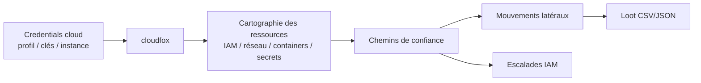
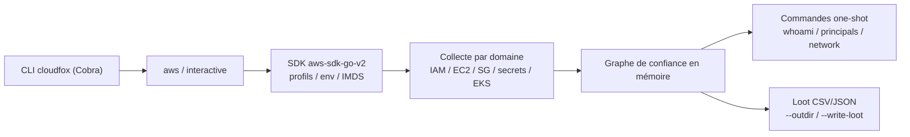

# cloudfox — La boîte à outils de contexte cloud

> [!info] **En 1 phrase**
> CLI de pénétration cloud de Bishop Fox qui cartographie les chemins de confiance (IAM, réseaux, containers) pour trouver des mouvements latéraux invisibles.

---

## Overview

| Champ | Valeur |
|---|---|
| Nom complet | CloudFox |
| Description | CLI Go de pénétration cloud qui explore AWS, Azure et GCP pour construire une cartographie des « chemins de confiance » : rôles assumables, policies IAM, Security Groups, secrets, containers — afin de révéler des mouvements latéraux et escalades de privilèges |
| Catégorie | Cloud & Containers |
| Sous-catégorie | Énumération cloud / Cartographie des chemins d'attaque |
| Type d'outil | CLI (binaire Go autonome + REPL interactif) |
| Licence | MIT |
| Open source / propriétaire | Open source |
| Langage(s) de programmation | Go |
| Développeur / organisation | Bishop Fox (Seth Art et al.) |
| Projet officiel | https://github.com/BishopFox/cloudfox |
| Dépôt officiel | https://github.com/BishopFox/cloudfox |
| Documentation officielle | https://github.com/BishopFox/CloudFox/wiki |
| Date de création | 2022 |
| État du projet | actif |
| Dernière version connue | v2.0.5 (mai 2026) |
| Systèmes compatibles | Linux, macOS, Windows (binaires précompilés) |

> [!note] Pour vérifier / compléter
> Version vérifiée sur https://github.com/BishopFox/cloudfox/releases (v2.0.5, mai 2026). Les versions antérieures à v1.17.0 ne fonctionnent plus : elles dépendaient d'un fichier JSON AWS dont le format a changé — toujours utiliser v1.17.0+.

---

## Concept

cloudfox est un outil Go de Bishop Fox dédié au pentest cloud. Il explore l'environnement (AWS en priorité, Azure et GCP en cours de maturité) et construit une cartographie des **chemins de confiance** : rôles assumables, policies attachées aux rôles/utilisateurs/instances, Security Groups et ports exposés, secrets dans Secrets Manager et Parameter Store, volumes EBS, points de montage, clusters EKS, enregistrements Route 53. Contrairement à un scanner de configuration (Prowler, ScoutSuite), il cherche les **relations** qui permettent des mouvements latéraux et des escalades : « quel rôle cette instance peut-elle assumer ? quel port est ouvert vers ce subnet ? quel rôle est assumable depuis un compte compromis ? ».

L'outil fonctionne en deux modes : l'invocation simple (une commande par type de ressource) et le **REPL interactif** `cloudfox interactive aws` qui précharge toutes les données en mémoire (compte, régions, rôles, instances) et rend chaque requête quasi instantanée. Ses commandes `whoami`, `permissions`, `principals`, `network`, `secrets`, `loot`, `instances`, `roles` répondent vite et en contexte. Les résultats peuvent être écrits sur disque (fichiers **CSV/JSON**, option `--write-loot`) pour être réutilisés dans BloodHound, jq ou un rapport de pentest. En phase de post-compromission, c'est l'outil qui transforme des clés leakées ou une instance compromise en **graphe d'attaque exploitable**.



---

## Concepts fondamentaux

| Concept | Explication |
|---|---|
| Chemin de confiance | Relation « A peut agir sur B » (assume-role, SG ouvert vers un subnet, policy attachée) qui constitue un chemin d'attaque potentiel |
| Principal | Entité IAM (utilisateur, rôle, instance profile) disposant d'une identité et de permissions cloud |
| Trust policy | Politique d'un rôle AWS définissant QUI peut l'assumer via `sts:AssumeRole` ; cloudfox la lit pour trouver les pivots |
| Security Group / Network ACL | Filtres réseau des VPC : cloudfox liste les règles (ports, CIDR sources) pour identifier les expositions exploitables |
| Loot | Données collectées (ressources, secrets, chemins) écrites en CSV/JSON via `--write-loot` et `--outdir`, réutilisables hors cloudfox |
| REPL interactif | `cloudfox interactive aws` charge toutes les données en mémoire pour des requêtes instantanées ensuite |
| Cape | Commande de cloudfox qui teste, sur un parc de comptes, les permissions d'accès (énumération d'accès à travers l'organisation) |
| IMDS | API metadata d'EC2 (`169.254.169.254`) : une instance compromise fournit les credentials de son instance profile à cloudfox |

---

## Installation

cloudfox est distribué en **binaires précompilés** (Linux, macOS, Windows) et via Homebrew ; pas de dépendance Python.

### Debian / Ubuntu / Kali Linux

```bash
# Télécharger le binaire depuis les releases GitHub
wget https://github.com/BishopFox/cloudfox/releases/latest/download/cloudfox-linux-amd64
chmod +x cloudfox-linux-amd64
sudo mv cloudfox-linux-amd64 /usr/local/bin/cloudfox
cloudfox --version
```

### macOS

```bash
brew install cloudfox
# ou binaire : cloudfox-darwin-amd64 (Apple Silicon : cloudfox-darwin-arm64)
```

### Windows

```powershell
# PowerShell — télécharger cloudfox-windows-amd64.exe et l'ajouter au PATH
Invoke-WebRequest https://github.com/BishopFox/cloudfox/releases/latest/download/cloudfox-windows-amd64.exe -OutFile cloudfox.exe
# Puis placer cloudfox.exe dans un dossier du PATH (ex : C:\Tools)
```

### Docker

```bash
# Pas d'image officielle Docker ; compiler depuis les sources dans un conteneur Go
docker run --rm -v "$PWD":/app -w /app golang:latest go build -o cloudfox .
```

> [!warning] Prérequis & problèmes potentiels
> - **Version impérative ≥ v1.17.0** : les versions antérieures cassent à cause d'un fichier JSON AWS ayant changé de format.
> - La compilation via `go install` nécessite Go 1.25+ et télécharge le module complet ; privilégier les binaires officiels.
> - Le binaire n'a aucune dépendance runtime : un binaire par plateforme, vérifier l'architecture (`amd64` vs `arm64`).
> - L'authentification AWS passe par le mécanisme standard : profil (`--profile`), variables d'environnement, ou metadata IMDS sur EC2.

---

## Configuration

cloudfox se configure par **ligne de commande** et s'appuie sur les mécanismes d'authentification standard des SDK cloud (profils AWS, variables d'environnement, fichier de credentials Azure, service account GCP). Il n'y a pas de fichier de configuration global.

| Paramètre | Rôle | Valeur possible | Impact | Exemple |
|---|---|---|---|---|
| `--profile <nom>` | Profil cloud à utiliser | nom de profil | Authentifie toutes les commandes | `--profile pentest` |
| `--targets <id>\|<role>` | Compte ou rôle cible | ARN/ID | Restreint la portée aux cibles | `--targets 111122223333` |
| `--region <r>` | Région ciblée | `us-east-1` | Limite la collecte régionale | `--region us-east-1` |
| `--outdir <dossier>` | Dossier de sortie des loots | chemin | Centralise les CSV/JSON générés | `--outdir ./cloudfox-loot` |
| `--write-loot` | Écrit les résultats sur disque | drapeau | Produit des fichiers réutilisables | `--write-loot` |
| `-v` | Mode verbeux (debug) | drapeau | Affiche les requêtes SDK | `-v` |
| `-l <fichier>` | Liste de profils à scanner | chemin de fichier | Multi-profils en une passe | `-l profiles.txt` |
| `-a` | Utilise tous les profils stockés | drapeau | Scan l'ensemble des profils | `-a` |
| `AWS_PROFILE` | Profil par défaut (env) | nom | Évite de répéter `--profile` | `AWS_PROFILE=pentest` |
| `interactive aws` | Mode REPL préchargé | drapeau | Requêtes instantanées ensuite | `cloudfox interactive aws --profile pentest` |

---

## Architecture interne

cloudfox est écrit en **Go** et organisé autour d'une CLI Cobra avec deux sous-commandes principales : `aws` (fournisseur AWS, le plus riche) et `interactive` (REPL).

- **`cli/`** : définitions Cobra des commandes et flags, dispatch entre le mode « one-shot » (`cloudfox aws <commande>`) et le mode interactif.
- **`aws/`** : implémentation de l'énumération AWS via le SDK `aws-sdk-go-v2`. Chaque commande (whoami, permissions, principals, network, secrets, instances, roles, volumes, route53, env-vars, cape…) est un sous-commande Cobra qui collecte les données d'un domaine précis.
- **Cache en mémoire** : en mode `interactive`, la collecte initiale remplit des structures en mémoire (comptes, profils, rôles, instances, SG) ; les commandes suivantes répondent sans nouvel appel API massif.
- **Génération de loot** : `loot` et `--write-loot` sérialisent les résultats en **CSV** (et JSON) dans `--outdir`, organisés par commande.
- **Cape** : exécute une énumération d'accès sur plusieurs comptes d'une organisation (`--accounts`) pour identifier qui peut atteindre quoi — typiquement utilisé depuis un compte d'audit.
- **Authentification** : délégation aux mécanismes AWS standard (chain de credentials : flags → env → profil → metadata IMDS) ; Azure/GCP via leurs SDK respectifs avec un nombre de commandes plus réduit.



---

## Commandes

### Commandes principales

La syntaxe générale est `cloudfox aws [command] [flags]` ou `cloudfox interactive aws [flags]` pour le REPL.

| Commande | Objectif | Résultat attendu |
|---|---|---|
| `cloudfox aws --profile pentest whoami` | Identité et rôle effectif du principal | ARN, account, permissions connues |
| `cloudfox aws --profile pentest permissions` | Permissions réelles du principal (via policies attachées) | Liste des actions autorisées |
| `cloudfox aws --profile pentest principals` | Rôles/utilisateurs et leurs trust policies | Qui peut assumer quoi |
| `cloudfox aws --profile pentest network` | Security Groups, ACL, ports exposés | Matrice réseau service → port → CIDR |
| `cloudfox aws --profile pentest secrets` | Secrets Manager / Parameter Store | Paths et valeurs des secrets |
| `cloudfox aws --profile pentest instances` | Instances EC2 et leurs rôles | Instance → instance profile |
| `cloudfox aws --profile pentest roles` | Rôles IAM et leurs policies | Inventaire des rôles |
| `cloudfox interactive aws --profile pentest` | REPL préchargé | Prompt interactif, requêtes instantanées |

### Commandes avancées

```bash
# REPL interactif sur une cible précise
cloudfox interactive aws --profile pentest --targets 111122223333

# Écrire tous les résultats sur disque (loot)
cloudfox aws --profile pentest --outdir ./cloudfox-loot --write-loot \
  principals network secrets

# Énumération d'accès multi-comptes (cape) depuis un compte d'audit
cloudfox aws --profile audit cape --accounts 111122223333,444455556666

# Cartographier les variables d'environnement des tâches
cloudfox aws --profile pentest env-vars
```

---

## Options et flags

| Option / Commande | Description | Exemple | Niveau |
|---|---|---|---|
| `--profile <nom>` | Profil cloud à utiliser | `--profile pentest` | Basic |
| `--targets <id>\|<role>` | Compte ou rôle cible | `--targets 111122223333` | Basic |
| `--region <r>` | Région ciblée | `--region us-east-1` | Basic |
| `-v` | Mode verbeux (debug) | `-v` | Intermediate |
| `--outdir <dossier>` | Dossier de sortie des loots | `--outdir ./loot` | Intermediate |
| `--write-loot` | Écrit les résultats sur disque | `--write-loot` | Intermediate |
| `-l <fichier>` | Fichier liste de profils | `-l profiles.txt` | Advanced |
| `-a` | Tous les profils stockés | `-a` | Advanced |
| `cape --accounts <ids>` | Énumération d'accès multi-comptes | `cape --accounts 111122223333` | Expert |
| `interactive` | Mode REPL préchargé | `interactive aws` | Expert |

> [!tip] Options les plus utiles au quotidien
> `interactive aws` (vitesse), `--profile` (multi-profil), `--write-loot --outdir` (preuves réutilisables), `--targets` (périmètre maîtrisé), `network` (exposition réelle des ports).

---

## Exemples pratiques

### Beginner

```bash
# 1. Installer le binaire et valider
cloudfox --version

# 2. Utiliser un profil AWS existant
export AWS_PROFILE=pentest
aws sts get-caller-identity

# 3. Première commande one-shot
cloudfox aws --profile pentest whoami
```

Résultat attendu : l'ARN du principal courant et ses permissions. Erreur fréquente : `NoCredentialProviders` si le profil est absent ou les clés invalides.

### Intermediate

```bash
# Identifier les rôles assumables et le réseau exposé
cloudfox aws --profile pentest principals
cloudfox aws --profile pentest network --service ec2

# Chercher les secrets du compte (région par défaut)
cloudfox aws --profile pentest secrets
```

### Advanced

```bash
# REPL préchargé sur un compte cible : tout est instantané ensuite
cloudfox interactive aws --profile pentest --targets 111122223333
# Dans le REPL
whoami
permissions
principals --role AdminRole
network --service eks
```

### Expert

```bash
# Collecte complète en loot + énumération d'accès multi-comptes
cloudfox aws --profile pentest --outdir ./cloudfox-loot --write-loot \
  whoami permissions principals network secrets instances roles volumes route53
cloudfox aws --profile audit cape --accounts 111122223333,444455556666

# Les CSV sont alors exploitables avec jq, Excel ou BloodHound
ls ./cloudfox-loot
```

---

## Workflow complet (scénario pas à pas)

1. **Se positionner** — on part d'un rôle AWS assumable par une instance compromise ou de clés leakées.
   ```bash
   export AWS_PROFILE=pentest
   aws sts get-caller-identity
   ```
2. **Lancer l'exploration** — précharger le compte en mémoire.
   ```bash
   cloudfox interactive aws --profile pentest --targets 111122223333
   ```
3. **Comprendre le périmètre** — identité et permissions réelles.
   ```bash
   whoami
   permissions
   ```
4. **Trouver les chemins de confiance** — rôles assumables et réseau exposé.
   ```bash
   principals
   network --service ec2
   network --service eks
   ```
5. **Piller les secrets et générer le loot**.
   ```bash
   secrets
   loot --outdir ./cloudfox-loot
   ```
6. **Exploiter les chemins** — assumer un rôle (`sts:AssumeRole`), pivoter vers une instance, puis recommencer le cycle sur le nouvel accès.

---

## Scénarios avancés

### Scénario 1 : Trouver un chemin de confiance vers un rôle admin

```bash
cloudfox interactive aws --profile pentest --targets 111122223333
# Dans le REPL : parcourir les relations role -> role
principals --role AdminRole
# cloudfox identifie le rôle compromis qui peut assumer AdminRole
aws sts assume-role --role-arn arn:aws:iam::111122223333:role/AdminRole \
  --role-session-name pwn
```

cloudfox croise les trust policies avec les permissions du principal compromis pour exposer la chaîne exacte à exploiter (fictif : ARN du compte 111122223333).

### Scénario 2 : Exploiter les pods EKS accessibles depuis un nœud

```bash
cloudfox interactive aws --profile pentest
network --service eks
# cloudfox identifie les clusters et les IP/ports des nodes
# Puis pivot via un pod compromis ou un kubeconfig volé
kubectl --kubeconfig stolen-kubeconfig get secrets -A
```

La cartographie réseau alimente [[Outil - kubectl|kubectl]] pour explorer un cluster dont on a volé le kubeconfig.

### Scénario 3 : Chercher des secrets dans Parameter Store et Secrets Manager

```bash
cloudfox aws --profile pentest --outdir ./loot secrets
ls ./loot   # CSV contenant paths, keys et valeurs décryptées
```

`secrets` interroge Secrets Manager et SSM Parameter Store avec les permissions du principal courant, et écrit les valeurs récupérées dans le loot.

---

## Cybersecurity use cases

| Phase | Utilisation |
|---|---|
| Reconnaissance | Cartographie du compte (whoami, permissions, instances) avant exploitation |
| Énumération | Principals, roles, network, secrets, volumes, route53 : vue d'ensemble des ressources |
| Vulnérabilité | Détection des chemins de confiance exploitables (assume-role, SG ouverts, secrets accessibles) |
| Exploitation | Alimentation des pivots : `sts:AssumeRole`, connexion aux ports exposés, kubeconfig |
| Post-exploitation | Ré-énumération avec les nouveaux accès ; génération de loot |
| Reporting | Export CSV/JSON des chemins trouvés pour le rapport et les outils externes |

---

## MITRE ATT&CK

| Tactique | Technique / Sub-technique | ID | Raison | Détection | Mitigation |
|---|---|---|---|---|---|
| Initial Access / Persistence | Valid Accounts : Cloud Accounts | T1078.004 | cloudfox s'exécute avec des credentials cloud valides | CloudTrail, GuardDuty, alertes IP source | MFA, SCP restrictifs, rotation des clés |
| Discovery | Cloud Service Discovery | T1526 | Énumération massive des services et ressources | Rafales d'événements `List*`/`Describe*` | Restreindre les lectures, seuils d'alerting |
| Discovery | Permission Groups Discovery : Cloud Groups | T1069.003 | `principals` collecte rôles, groupes et trust policies | `ListRoles`/`GetRolePolicy` répétés | Moindre privilège, revue des policies |
| Discovery | Account Discovery : Cloud Account | T1087.004 | Identification des comptes et de leurs relations | `ListAccounts`/`ListUsers` (organizations) | Limiter l'énumération, SCP |
| Discovery | Cloud Storage Object Discovery | T1619 | `loot`/`secrets` listent buckets et objets | CloudTrail S3 data events | Verrouiller ACL/policies |
| Discovery | Cloud Infrastructure Discovery | T1580 | `network`/`instances` cartographient instances, SG et VPC | `DescribeInstances`/`DescribeSecurityGroups` | Limiter les lectures, alerting |
| Discovery | System Network Connections Discovery | T1049 | `network` révèle les ports et CIDR accessibles | VPC Flow Logs, anomalies réseau | Segmentation, groupes restreints |
| Credential Access | Unsecured Credentials : Cloud Instance Metadata API | T1552.005 | Récupération de credentials via IMDS/instance profiles | Flux vers 169.254.169.254, CloudTrail | IMDSv2, restrictions |

> [!note] Ne renseigner que si l'association est réellement pertinente.
> cloudfox n'exploite rien directement : il rend systématiques les opérations de découverte d'un attaquant disposant d'un accès légitime.

---

## Defensive Security

### Signes observables

| Indicateur | Détail |
|---|---|
| Énumération exhaustive IAM + EC2 + SG en peu de temps | Signature cloudfox dans CloudTrail : rafales `List*`/`Describe*` groupées par service |
| Appels répétés à `sts:AssumeRole` sur plusieurs rôles | Mouvement latéral : restreindre les trust policies, alerter sur les assume-role sensibles |
| Récupération massive de secrets / Parameter Store | Limiter les rôles, surveiller les lectures `GetSecretValue`/`GetParameter` |
| Lectures `GetParameter` avec `--with-decryption` | Accès à des secrets en clair : alerter immédiatement |
| Export de loot (CSV listant les ressources) | DLP, marquage des données cloud comme confidentielles |
| Connexions réseau vers des ports internes | `network` identifie les cibles : surveiller VPC Flow Logs pour du pivoting |

### Règles de détection (Sigma / Suricata / Snort / YARA)

```yaml
# Sigma — AWS : assume-role répété typique d'un pivoting cloudfox
title: AWS Cloudfox-style AssumeRole Lateral Movement
id: 0b0b2f90-0000-4a9a-8c5f-000000000031
status: experimental
logsource:
    product: aws
    service: cloudtrail
detection:
    selection:
        eventSource: 'sts.amazonaws.com'
        eventName: 'AssumeRole'
        requestParameters.roleSessionName: 'pwn*'
    timeframe: 1h
    condition: selection | count() by userIdentity.arn > 3
falsepositives:
    - Automatisations légitimes de rôle (CI/CD)
level: high
```

> [!note] À vérifier
> Exemple pédagogique : adapter les seuils et le pattern `roleSessionName` à votre environnement ; l'identifiant Sigma est fictif et à régénérer si publié.

---

## Automatisation

```bash
# Bash — collecte complète en loot puis archivage
LOOTDIR="./cloudfox-loot-$(date +%Y%m%d)"
cloudfox aws --profile pentest --outdir "$LOOTDIR" --write-loot \
  principals network secrets instances roles volumes
# Convertir un CSV de loot en JSON pour d'autres outils
python3 - <<'EOF'
import csv, json
with open("$LOOTDIR/network.csv") as f:
    rows = list(csv.DictReader(f))
print(json.dumps(rows, indent=2)[:2000])
EOF
```

---

## Output et parsing

cloudfox affiche les résultats en console (tables colorées) et peut les écrire en **CSV** (et JSON) dans `--outdir` avec `--write-loot`/`loot`. Ces fichiers sont directement exploitables.

```bash
# Lister les rôles assumables depuis un CSV de loot
jq -r '.[] | select(.permissions | contains("AssumeRole")) | "\(.role_arn) -> \(.assumable)"' \
  <(python3 -c "import csv,json,sys; print(json.dumps([dict(r) for r in csv.DictReader(open('./cloudfox-loot/principals.csv'))]))")
```

> [!note] À vérifier
> Le nom et la structure des fichiers CSV varient selon la version et la commande ; lister le contenu de `--outdir` après un run avant d'écrire un parseur définitif.

---

## Intégrations

- [[Tools| Outils]] global
- [[Outil - Pacu|Pacu]] — exploiter les chemins détectés (assume-role, modules de backdoor)
- [[Outil - Prowler|Prowler]] / [[Outil - ScoutSuite|ScoutSuite]] — constat de posture avant la recherche de chemins
- [[Outil - kubectl|kubectl]] — exploration des clusters EKS une fois les kubeconfig volés
- BloodHound / BloodHound CE — import des relations et des chemins trouvés
- AWS CLI (`aws sts assume-role`, `aws s3 ls`) — validation des chemins identifiés
- jq / Python / Excel — parsing des loot CSV/JSON

```text
Prowler (posture) → cloudfox (chemins) → Pacu / kubectl (exploitation) → BloodHound (graphe)
```

---

## Alternatives

| Outil | Avantages | Inconvénients | Cas d'usage |
|---|---|---|---|
| Pacu | Modules offensifs, sessions, rapports | Pas de cartographie réseau/chemins | Exploitation active |
| ScoutSuite | Rapport HTML visuel multi-cloud | Non maintenu, pas de chemins | Audit de posture |
| Prowler | Conformité CIS/NIST, maintenu | Pas de cartographie de chemins | Audit de conformité |
| enumerator / enumerate-iam | Léger, teste les permissions | Pas de contexte réseau/containers | Test de permissions |
| Scout2 | Précurseur AWS | Obsolète | Historique |

> **Quand utiliser Pacu plutôt que cloudfox ?** Quand le but est d'**exploiter** (modules de post-exploitation, persistance, pillage) plutôt que de **cartographier** : cloudfox fournit le contexte, Pacu l'action. Les deux se complètent : cloudfox trouve le chemin, Pacu l'exécute.

---

## Performance

- **Collecte initiale** : le premier chargement (mode interactif) interroge tous les services et régions configurés : sur un compte massif, il peut prendre plusieurs minutes — d'où l'intérêt du REPL qui ne collecte qu'une fois.
- **Requêtes ensuite** : en mode interactif, les commandes répondent en mémoire, quasi instantanément.
- **`--region`** : limiter les régions réduit drastiquement la collecte (les API sont régionales).
- **Cape** : l'énumération multi-comptes est proportionnelle au nombre de comptes ; à exécuter depuis un compte d'audit avec des permissions larges.
- **Loot** : l'écriture CSV est rapide, mais de très gros comptes génèrent des fichiers volumineux (penser à les compresser/archiver).

---

## Troubleshooting

### Common problems

#### Problème : « NoCredentialProviders » ou « failed to load profile »

- **Cause** : profil AWS absent, clés invalides, ou variables d'environnement non définies.
- **Solution** : valider avec `aws sts get-caller-identity --profile pentest` ; définir `AWS_PROFILE` ou `AWS_ACCESS_KEY_ID`/`AWS_SECRET_ACCESS_KEY`.
- **Vérification** : `cloudfox aws --profile pentest whoami` affiche l'ARN.

#### Problème : commandes AWS inconnues ou vides

- **Cause** : versions antérieures à v1.17.0 incompatibles, ou permissions insuffisantes (sorties silencieuses).
- **Solution** : mettre à jour vers v2.x ; vérifier `whoami`/`permissions` pour calibrer l'accès.
- **Vérification** : `cloudfox --version` affiche ≥ v1.17.0.

#### Problème : le REPL interactif ne démarre pas

- **Cause** : terminal non-TTY (pipe, CI), ou erreur d'authentification avant le chargement.
- **Solution** : exécuter dans un terminal interactif ; valider les credentials d'abord en one-shot.
- **Vérification** : `cloudfox aws --profile pentest whoami` fonctionne avant `interactive`.

#### Problème : `--outdir` ne contient pas de fichiers

- **Cause** : `--write-loot` non spécifié, ou la commande n'a rien collecté (permissions).
- **Solution** : ajouter `--write-loot`, vérifier les permissions, relancer.
- **Vérification** : `ls ./cloudfox-loot` liste les CSV attendus.

---

## Sécurité de l'outil

- **Cadre légal** : cloudfox est pensé pour le pentest autorisé (modèles « objective based penetration testing », CloudFoxable pour s'entraîner légalement) ; ne l'utiliser que sur des comptes couverts par un engagement.
- **Accès** : conçu pour tourner avec un principal aux permissions **limitées** ; les échecs d'API sont silencieux, les données renvoyées prouvent l'accès réel.
- **Loot sensible** : les CSV contiennent ARN, IP, secrets et relations → traiter comme confidentiel, stockage chiffré, jamais committé.
- **Cape** : l'énumération multi-comptes est très visible dans les logs de chaque compte ; l'utiliser depuis un compte d'audit dédié.
- **Binaire** : vérifier les checksums des releases officielles avant exécution (fausses versions dans des dépôts tiers).
- **Credentials** : ne pas exposer de clés longue durée ; préférer des sessions STS et des profils dédiés.

---

## Limitations

- **AWS prioritaire** : la couverture AWS est riche (~34 commandes), Azure et GCP sont en développement (peu de commandes) ; le support Kubernetes reste planifié.
- **Pas de test de vulnérabilité** : cloudfox ne vérifie AUCUNE faille exploitable — il fournit du contexte, l'exploitation reste manuelle.
- **Permissions = résultats** : des permissions insuffisantes produisent des sorties vides et trompeuses ; toujours commencer par `whoami`/`permissions`.
- **Comptes massifs** : la collecte initiale peut être longue ; cibler régions et services.
- **Pas de rapport visuel** : le livrable est du CSV/console ; le rapport final est à construire (jq, Excel, BloodHound).
- **Dépendance au format AWS** : les versions pré-1.17.0 cassent suite au changement d'un fichier JSON d'AWS.

---

## Cheatsheet

```bash
# Installation
wget https://github.com/BishopFox/cloudfox/releases/latest/download/cloudfox-linux-amd64
chmod +x cloudfox-linux-amd64 && sudo mv cloudfox-linux-amd64 /usr/local/bin/cloudfox

# One-shot AWS
cloudfox aws --profile pentest whoami
cloudfox aws --profile pentest permissions
cloudfox aws --profile pentest principals
cloudfox aws --profile pentest network --service ec2
cloudfox aws --profile pentest secrets
cloudfox aws --profile pentest instances

# REPL (préchargement unique)
cloudfox interactive aws --profile pentest --targets 111122223333

# Loot sur disque
cloudfox aws --profile pentest --outdir ./loot --write-loot \
  principals network secrets

# Énumération multi-comptes
cloudfox aws --profile audit cape --accounts 111122223333,444455556666
```

---

## Quick reference

| | |
|---|---|
| **À quoi sert-il ?** | Cartographier les chemins de confiance cloud (IAM, réseau, containers, secrets) pour des mouvements latéraux |
| **Quand l'utiliser ?** | Dès qu'on dispose d'un accès AWS/Azure/GCP (post-compromission, contexte) |
| **Commande principale** | `cloudfox interactive aws --profile pentest` puis `principals` / `network` |
| **Alternative principale** | Pacu (exploitation) ; ScoutSuite/Prowler (posture) |
| **Concepts importants** | Chemins de confiance, trust policies, REPL, loot CSV, cape |
| **Liens associés** | [[Outil - Pacu]] · [[Outil - kubectl]] · [[Outil - Prowler]] |

---

## Détection & Défense

| Signe | Défense |
|---|---|
| Rafales `List*`/`Describe*` sur IAM + EC2 + SG | CloudTrail + CloudWatch avec seuils d'alerting par principal |
| `sts:AssumeRole` répétés avec sessions « pwn » | Alerte sur les assume-role inhabituels, trust policies restreintes |
| Lectures massives `GetSecretValue`/`GetParameter` | Garde-fous sur les secrets, rotation, alerting immédiat |
| Connexions vers ports internes depuis des instances | VPC Flow Logs + détection d'anomalies de trafic |
| Export de fichiers CSV listant les ressources | DLP, classification des données cloud comme confidentielles |

---

## Tips & Pièges

> [!tip] **Tips**
> - `cloudfox interactive` précharge toutes les données en mémoire : les commandes suivantes répondent instantanément.
> - `network` est précieux en pentest de périmètre : il montre les ports réellement ouverts, y compris sur des cibles que tu n'aurais pas scannées.
> - Utilise `--outdir` + `--write-loot` pour générer des CSV réutilisables (jq, Excel, [[Outil - BloodHound|BloodHound]]).
> - Commence toujours par `whoami` puis `permissions` pour calibrer l'accès avant de lancer l'énumération.
> - Enregistre les fichiers de loot avec la date : ils servent de preuve de cheminement dans le rapport.

> [!warning] **Pièges**
> - cloudfox ne teste AUCUNE vulnérabilité : il fournit du contexte, c'est toi qui exploites.
> - Les permissions insuffisantes génèrent des sorties vides et trompeuses : vérifie l'accès avant de conclure.
> - Sur des comptes massifs, la collecte initiale peut être longue : cible les régions et services pertinents.
> - Reste en version ≥ v1.17.0 : les anciennes cassent à cause d'un fichier JSON AWS.
> - Les loots contiennent des secrets et ARN : ne pas les committer ni les archiver en clair.

---

## References

### Official

- Dépôt officiel : https://github.com/BishopFox/cloudfox
- Wiki officiel : https://github.com/BishopFox/CloudFox/wiki
- Releases : https://github.com/BishopFox/cloudfox/releases
- Page Bishop Fox : https://bishopfox.com/tools/cloudfox-tool
- CloudFoxable (environnement d'entraînement) : https://github.com/BishopFox/cloudfoxable

### Security references

- MITRE ATT&CK T1078 — Valid Accounts : https://attack.mitre.org/techniques/T1078/
- MITRE ATT&CK T1526 — Cloud Service Discovery : https://attack.mitre.org/techniques/T1526/
- MITRE ATT&CK T1069.003 — Permission Groups Discovery (Cloud) : https://attack.mitre.org/techniques/T1069/003/
- MITRE ATT&CK T1552.005 — Cloud Instance Metadata API : https://attack.mitre.org/techniques/T1552/005/
- MITRE ATT&CK T1580 — Cloud Infrastructure Discovery : https://attack.mitre.org/techniques/T1580/

### Community

- CloudFoxable demo (Bishop Fox) : https://bishopfox.com/resources/cloud-security-podcast-cloudfoxable-demo
- HackTricks — AWS pentesting : https://book.hacktricks.xyz/cloud-security/aws
- WeirdAAL (comparaison black box) : https://github.com/carnal0wnage/weirdAAL

---

**Liens :** [[Tools| Outils]] · [[Outil - Pacu|Pacu]] · [[Outil - kubectl|kubectl]]
