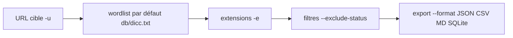

# 🔍 dirsearch — Scanner de répertoires web (Web path scanner)

> [!info] **En 1 phrase**
> dirsearch est un scanner de répertoires web écrit en Python, riche en options de sortie et de filtrage, avec une wordlist intégrée.

---

## 🧾 Overview

| Champ | Valeur |
|---|---|
| Nom complet | dirsearch |
| Description | Énumérateur de répertoires et de fichiers web (brute-force de chemins HTTP) avec filtrage fin et formats d'export multiples |
| Catégorie | Scan Web & Fuzzing |
| Sous-catégorie | Découverte de contenu / web path scanner |
| Fonction principale | Découvrir des répertoires, fichiers et endpoints cachés sur un serveur web |
| Type d'outil | CLI (Python), API Python importable |
| Licence | GNU GPL v2 |
| Open source / propriétaire | Open source |
| Langage(s) de programmation | Python (backend Rust natif optionnel pour la vitesse) |
| Développeur / organisation | Mauro Soria + contributeurs (shelld3v) |
| Projet officiel | https://github.com/maurosoria/dirsearch |
| Dépôt officiel | https://github.com/maurosoria/dirsearch |
| Documentation officielle | https://github.com/maurosoria/dirsearch/wiki |
| Date de création | ~2014 (projet ancien et mature) |
| État du projet | actif (nouvelle release 2026, v0.5.0) |
| Dernière version connue | 0.5.0 (14 août 2026) |
| Systèmes compatibles | Linux / Windows / macOS (Python 3.11+ ; binaires PyInstaller fournis) |

> [!note] Pour vérifier / compléter
> dirsearch requiert **Python 3.11 ou supérieur**. Le backend Rust natif est optionnel (opt-in) pour les installations depuis les sources. Une API Python importable existe pour l'automatisation (MCP servers, REST wrappers, agents).

---

## 🎯 Concept

dirsearch est un outil mature d'énumération de répertoires et de fichiers, entièrement en Python. Il est apprécié pour sa wordlist par défaut correcte (`db/dicc.txt`), ses formats d'export multiples (plain, JSON, CSV, XML, MD, **SQLite** depuis 2022) et sa gestion fine des statuts via `--exclude-status`. Moins rapide que les implémentations Go (gobuster, feroxbuster), il reste très utile quand seul Python est disponible — par exemple sur un poste de compromission, dans un environnement restreint — ou sur des cibles qui ne supportent pas un haut débit de requêtes.

Il se place dans la phase de **reconnaissance web** d'un pentest, juste après l'identification des ports et des technologies : il découvre les répertoires, fichiers de sauvegarde (`.bak`, `.old`, `.zip`), fichiers de configuration, endpoints d'API et zones d'upload qui élargissent la surface d'attaque. Sa configuration repose sur un simple fichier `default.conf` qui personnalise extensions, statuts et wordlist par défaut ; une wordlist Seclists peut être fournie pour une couverture plus large ou un ciblage technologique (WordPress, API, SPA).

L'outil accepte aussi les filtres **inversés** (`--include-status`) et les listes de tailles ou textes à exclure (`--exclude-sizes`, `--exclude-texts`), ce qui permet de cibler finement les réponses. En test autorisé, le relai par un proxy (`--proxy`) et le changement de User-Agent (`--random-agent`) sont des options de discrétion essentielles, complétées par un délai entre requêtes (`--delay`) pour les cibles qui prennent le scan comme une attaque.



---

## 🧠 Concepts fondamentaux

| Concept | Explication |
|---|---|
| Brute-force de chemins | Envoi d'une requête HTTP pour chaque entrée de la wordlist (`/admin`, `/backup`, `/api/...`) et analyse du code de réponse |
| Wordlist | Liste de chemins candidats ; dirsearch embarque `db/dicc.txt` et accepte les wordlists Seclists |
| Extensions | Suffixes testés (`-e php,txt,bak`) : chaque chemin est testé tel quel puis avec chaque extension |
| Statuts HTTP | Le résultat (200, 301, 403, 404...) détermine l'existence ; `--exclude-status` filtre le bruit (404, 403) |
| Filtres inversés | `--include-status` garde uniquement certains codes ; `--exclude-sizes`/`--exclude-texts` éliminent les réponses uniformes |
| Récursion | `-r` relance le scan dans les répertoires découverts, `-d` borne la profondeur |
| Virtual host / vhost | Hébergement multiple sur une même IP : dirsearch n'exploite pas les vhosts (utiliser gobuster vhost ou ffuf) |
| Random agent | `--random-agent` envoie des User-Agents variés pour passer les filtres basés sur l'UA |
| Proxy | `--proxy http://127.0.0.1:8080` relaye le trafic (Burp, mitmproxy) pour inspection |

---

## 🛠️ Installation

### Debian / Ubuntu / Kali Linux

```bash
# Paquet système (version parfois en retard)
sudo apt update && sudo apt install -y dirsearch

# Version la plus récente via git (Python 3.11+ requis)
git clone https://github.com/maurosoria/dirsearch.git --depth 1
cd dirsearch
pip3 install -r requirements.txt
python3 dirsearch.py -u http://10.10.10.10
```

### Arch Linux

```bash
# Via AUR (non officiel) ou git clone (voir ci-dessus)
# yay -S dirsearch
```

### Fedora / RHEL

```bash
# Via git + pip (voir Debian), ou binaire PyInstaller des releases GitHub
# https://github.com/maurosoria/dirsearch/releases
```

### macOS

```bash
# Via git + pip, ou pip install depuis GitHub
pip3 install git+https://github.com/maurosoria/dirsearch.git
dirsearch -u http://10.10.10.10
```

### Windows

```powershell
# Binaires PyInstaller (exe) ou archive portable des releases GitHub
# https://github.com/maurosoria/dirsearch/releases
# ou via git + python :
# python -m pip install git+https://github.com/maurosoria/dirsearch.git
```

### Docker

```bash
docker pull ghcr.io/maurosoria/dirsearch
docker run -it ghcr.io/maurosoria/dirsearch -u http://10.10.10.10
```

### Compilation depuis les sources

```bash
# Backend Rust natif (optionnel, opt-in) pour des performances supérieures
# voir docs/installation.md pour les étapes de compilation native
git clone https://github.com/maurosoria/dirsearch.git --depth 1
cd dirsearch
python3 dirsearch.py -u http://10.10.10.10 -e php,html,js
```

> [!warning] ⚠️ Prérequis & problèmes potentiels
> - **Python 3.11+ obligatoire** pour les versions récentes.
> - `pip3 install -r requirements.txt` doit être exécuté avant le premier lancement.
> - Sur Kali, le paquet `dirsearch` peut être plus ancien que la version GitHub : privilégier le clone git pour la dernière version.

---

## ⚙️ Configuration

| Paramètre | Rôle | Valeur possible | Impact | Exemple |
|---|---|---|---|---|
| `default.conf` | Configuration par défaut (extensions, statuts, wordlist) | Fichier dans le repo | Personnalise le comportement sans flags | Ajouter `php` aux extensions par défaut |
| `-w <wordlist>` | Wordlist à utiliser | Chemin fichier | Couverture des chemins testés | `/usr/share/seclists/Discovery/Web-Content/directory-list-2.3-medium.txt` |
| `-e <exts>` | Extensions testées | `php,txt,bak` | Élargit le scan aux fichiers par type | `-e php,json,bak` |
| `--exclude-status` | Statuts exclus | `403,404` | Réduit le bruit du rapport | `--exclude-status=403,404` |
| `--exclude-sizes` | Tailles de réponse exclues | `0B,5KB` | Élimine les réponses vides/uniformes | `--exclude-sizes=0B` |
| `--random-agent` | User-Agent aléatoire | On/Off | Discrétion face aux filtres UA | Activer pour les WAF sensibles |
| `--delay <s>` | Délai entre requêtes | `1` (secondes) | Réduit l'impact sur la cible | `--delay 1` en production |
| `-t <n>` | Nombre de threads | `25` (défaut) | Vitesse vs charge | `-t 40` sur une cible solide |
| `--proxy` | Proxy HTTP | `http://127.0.0.1:8080` | Inspection du trafic | Relayer via Burp |
| `--format` | Format d'export | `plain,json,csv,xml,md,sqlite` | Intégration aux outils/rapports | `--format=json` |
| `--max-time` | Durée maximale du scan | secondes | Contrôle le temps d'exécution | `--max-time 300` |

---

## 🏗️ Architecture interne

- **Cœur Python** : le scanner itère les entrées de la wordlist, construit les URLs (chemin ± extension), envoie les requêtes HTTP et évalue chaque réponse.
- **Multi-threading** : `-t` contrôle le nombre de threads concurrents (défaut 25) ; chaque thread traite une entrée indépendamment.
- **Backend Rust (opt-in)** : depuis les versions récentes, un backend natif Rust peut remplacer le cœur Python pour de meilleures performances (installation depuis les sources uniquement).
- **Filtrage** : les critères (statuts, tailles, textes, regex) sont appliqués sur chaque réponse avant affichage/export ; les critères inversés (`-i`) gardent uniquement les correspondances.
- **Récursion** : `-r` réinjecte les répertoires trouvés comme nouvelles bases de scan, bornées par `-d`.
- **Stockage des résultats** : affichage console + export dans le format choisi (dont **SQLite** pour de gros volumes) ; le trafic HTTP peut être journalisé dans un fichier log, avec possibilité de **sauvegarder et reprendre** un scan.
- **API Python** : le module est importable (configuration `FuzzerConfig`) pour être piloté depuis du code (MCP servers, wrappers REST, agents).

Flux type : wordlist → threads → requêtes HTTP → évaluation (statut/taille) → filtres → résultats console + export.

---

## ⌨️ Commandes

### Commandes principales

```bash
# Scan simple avec extensions et filtrage des statuts
python3 dirsearch.py -u http://10.10.10.10 -e php,txt,bak -t 20 --exclude-status=403,404

# Scan de plusieurs cibles depuis un fichier, sortie JSON
python3 dirsearch.py -l urls.txt --format=json -o rapport.json --random-agent

# Récursion + filtrage par taille de réponse
python3 dirsearch.py -u http://10.10.10.10 -e php -r --exclude-sizes=0B,5KB

# Passer par un proxy (Burp) pour inspecter les requêtes
python3 dirsearch.py -u http://10.10.10.10 --proxy http://127.0.0.1:8080
```

| Option | Effet |
|---|---|
| `-u <url>` | URL cible (une seule) |
| `-l <fichier>` | Fichier de liste d'URLs |
| `-w <wordlist>` | Wordlist personnalisée |
| `-e <exts>` | Extensions à tester (php, txt, bak...) |
| `-t <n>` | Threads (défaut 25) |
| `--exclude-status <codes>` | Statuts à exclure (403, 404...) |
| `--exclude-sizes <tailles>` | Tailles de réponse à exclure |
| `--format <fmt>` | Format de sortie : plain, json, csv, xml, md, sqlite |
| `-o <fichier>` | Fichier de sortie |
| `--random-agent` | User-Agent aléatoire |
| `--proxy <url>` | Proxy (ex: `--proxy http://127.0.0.1:8080`) |
| `-r` | Récursion dans les répertoires trouvés |
| `-q` | Mode silencieux |
| `--full-url` | Affiche les URL complètes |
| `-i <codes>` | N'autoriser que certains statuts (`--include-status`) |
| `--delay <s>` | Délai en secondes entre deux requêtes |
| `--timeout <s>` | Timeout de connexion par requête |
| `--max-retries <n>` | Nombre de nouvelles tentatives en cas d'échec |

### Commandes avancées

```bash
# Détection automatique du schéma (http/https) si absent + crawl des chemins des réponses
python3 dirsearch.py -u 10.10.10.10 -e php --crawl

# Suivi de l'historique des redirections
python3 dirsearch.py -u http://10.10.10.10 -e php --full-url --follow-redirects

# Certificat client pour les cibles mutualisées
python3 dirsearch.py -u https://10.10.10.10 -e php --cert /path/to/cert.pem

# Sauvegarder la progression et reprendre plus tard
python3 dirsearch.py -u http://10.10.10.10 -e php --save-state
python3 dirsearch.py --resume
```

---

## 🎚️ Options et flags

| Option | Description | Exemple | Niveau |
|---|---|---|---|
| `-u <url>` | URL cible unique | `-u http://10.10.10.10` | Basic |
| `-l <fichier>` | Liste d'URLs cibles | `-l urls.txt` | Basic |
| `-e <exts>` | Extensions à tester | `-e php,txt` | Basic |
| `-t <n>` | Threads | `-t 20` | Basic |
| `--exclude-status` | Exclure des statuts | `--exclude-status=403,404` | Basic |
| `-w <wordlist>` | Wordlist personnalisée | `-w seclists/.../medium.txt` | Intermediate |
| `--include-status` | Garder certains statuts uniquement | `-i 200,401` | Intermediate |
| `--exclude-sizes` | Exclure des tailles de réponse | `--exclude-sizes=0B,5KB` | Intermediate |
| `--exclude-texts` | Exclure des contenus de réponse | `--exclude-texts="Page not found"` | Intermediate |
| `--random-agent` | User-Agent aléatoire | `--random-agent` | Intermediate |
| `--proxy` | Relayer via un proxy | `--proxy http://127.0.0.1:8080` | Intermediate |
| `-r` | Récursion | `-r` | Intermediate |
| `-d <n>` | Profondeur de récursion | `-d 3` | Intermediate |
| `--delay <s>` | Délai entre requêtes | `--delay 1` | Intermediate |
| `--full-url` | Afficher les URL complètes | `--full-url` | Intermediate |
| `--crawl` | Crawler les chemins trouvés dans les réponses | `--crawl` | Advanced |
| `--format sqlite` | Export SQLite | `--format=sqlite -o out.db` | Advanced |
| `--cert` | Certificat client | `--cert client.pem` | Advanced |
| `--save-state` / `--resume` | Sauvegarder/reprendre un scan | `--save-state` puis `--resume` | Advanced |
| API Python `FuzzerConfig` | Piloter dirsearch depuis du code | Wrapper MCP/REST | Expert |

> [!tip] Options les plus utiles au quotidien
> `-e php,txt` + `--exclude-status=403,404` pour un premier scan propre, `--random-agent` + `--delay` pour la discrétion, `--format=json` pour l'intégration aux notes d'engagement, et `-w` avec une wordlist Seclists adaptée à la techno.

---

## 🧪 Exemples pratiques

### Beginner

```bash
# Objectif : premier scan d'un site cible
python3 dirsearch.py -u http://10.10.10.10

# Objectif : scan avec extensions PHP et fichiers de sauvegarde
python3 dirsearch.py -u http://10.10.10.10 -e php,txt,bak --exclude-status=403,404

# Résultat attendu : liste des répertoires/fichiers trouvés avec statut et taille
```

### Intermediate

```bash
# Objectif : réduire le bruit et ne garder que les statuts utiles
python3 dirsearch.py -u http://10.10.10.10 -e php,json -i 200,401,403

# Objectif : scan récursif d'une application multi-dossiers
python3 dirsearch.py -u http://10.10.10.10 -e php -r -d 3 --exclude-status=403,404 \
  --exclude-sizes=0B -t 40 --random-agent
# -r active la récursion, -d borne la profondeur (3 niveaux) pour éviter l'explosion des requêtes.
```

### Advanced

```bash
# Objectif : scan ciblé d'une API JSON
python3 dirsearch.py -u http://10.10.10.10/api -e json -i 200,401 \
  -w /usr/share/seclists/Discovery/Web-Content/api/objects.txt --random-agent
# -i ne garde que les statuts utiles ; la wordlist API cible les ressources REST.

# Objectif : chasse aux fichiers de sauvegarde (backups)
python3 dirsearch.py -u http://10.10.10.10 -e bak,old,zip,sql,tar.gz --exclude-status=404 \
  -w /usr/share/seclists/Discovery/Web-Content/backup-files.txt
# Les fichiers de backup exposent souvent le code source ou la base de données.
```

### Expert

```python
# Objectif : piloter dirsearch depuis Python (API importable)
from dirsearch.core import FuzzerConfig
from dirsearch.lib.core import ...

# (voir la doc officielle pour l'API exacte - FuzzerConfig permet de définir
#  cible, wordlist, extensions et filtres sans passer par les flags CLI)
# Contexte : intégration dans un pipeline, un serveur MCP ou un wrapper REST.
```

```bash
# Objectif : scan en pipeline sur tout un lot de sous-domaines
cat sous-domaines.txt | while read host; do
  python3 dirsearch.py -u "https://$host" -e php,json --format=json -o "dirsearch_$host.json" -q
done
# Agrégation JSON de tous les scans pour le rapport d'engagement.
```

---

## 🧪 Workflow complet (scénario pas à pas)

1. **Étape 1 — Lancement rapide** — démarrer avec la wordlist par défaut et des extensions ciblées.
   ```bash
   python3 dirsearch.py -u http://10.10.10.10 -e php,txt
   ```
2. **Étape 2 — Réduire le bruit** — exclure les statuts récurrents pour ne garder que les résultats exploitables.
   ```bash
   python3 dirsearch.py -u http://10.10.10.10 -e php,txt --exclude-status=403,404
   ```
3. **Étape 3 — Scanner un lot de sous-domaines** — passer la liste des hôtes et exporter en Markdown.
   ```bash
   python3 dirsearch.py -l sous-domaines.txt -t 30 -o results.md --format=md
   ```
4. **Étape 4 — Inspecter via Burp** — relayer les requêtes pour observer les réponses en détail.
   ```bash
   python3 dirsearch.py -u http://10.10.10.10 --proxy http://127.0.0.1:8080
   ```
5. **Étape 5 — Confirmer les résultats** — vérifier les ressources découvertes à la main avec `curl -I` avant de les exploiter (fichier source, backup, upload).
6. **Étape 6 — Adapter la config** — éditer `default.conf` pour définir ses extensions et statuts par défaut selon le type de cible (WordPress, API, SPA).

---

## 🎬 Scénarios avancés

### Scénario 1 : chasse aux fichiers de sauvegarde (backups)

```bash
python3 dirsearch.py -u http://10.10.10.10 -e bak,old,zip,sql,tar.gz --exclude-status=404 \
  -w /usr/share/seclists/Discovery/Web-Content/backup-files.txt
# Les fichiers de backup exposent souvent le code source ou la base de données.
# Confirmer avec curl -I http://10.10.10.10/db.sql.bak avant d'essayer de le récupérer.
```

### Scénario 2 : scan récursif d'une application multi-dossiers

```bash
python3 dirsearch.py -u http://10.10.10.10 -e php -r -d 3 --exclude-status=403,404 \
  --exclude-sizes=0B -t 40 --random-agent
# -r active la récursion, -d borne la profondeur (3 niveaux) pour éviter l'explosion des requêtes.
```

### Scénario 3 : intégration dans un pipeline de reconnaissance

```bash
cat sous-domaines.txt | while read host; do
  python3 dirsearch.py -u "https://$host" -e php,json --format=json -o "dirsearch_$host.json" -q
done
# Agrégation JSON de tous les scans pour le rapport d'engagement.
```

### Scénario 4 : scan ciblé d'une API JSON

```bash
python3 dirsearch.py -u http://10.10.10.10/api -e json -i 200,401 \
  -w /usr/share/seclists/Discovery/Web-Content/api/objects.txt --random-agent
# -i ne garde que les statuts utiles ; la wordlist API cible les ressources REST.
```

---

## 🛡️ Cybersecurity use cases

| Phase | Utilisation |
|---|---|
| Reconnaissance | Découverte de répertoires/fichiers cachés sur le serveur web (juste après l'énumération des ports) |
| Énumération | Fichiers de backup, configs, endpoints API, zones d'upload |
| Vulnérabilité | Les ressources trouvées (ex : `/.git/`, `.env`, upload) mènent à des vulnérabilités (exposition de secrets, path traversal) |
| Exploitation | Réutilisation des chemins découverts dans les payloads (curl, sqlmap) |
| Post-exploitation | En cas d'accès initial, re-scan local pour élargir la surface (si Python disponible) |
| Rapport | Exports JSON/MD/SQLite intégrables au rapport d'engagement |

---

## 🎯 MITRE ATT&CK

| Tactique | Technique / Sub-technique | ID | Raison | Détection | Mitigation |
|---|---|---|---|---|---|
| Reconnaissance | Active Scanning : Wordlist Scanning | T1595.003 | dirsearch brute-force les chemins avec une wordlist | Burst de GET 404/403 sur chemins inconnus | Rate limiting, WAF, CAPTCHA |
| Discovery | Application Layer Discovery | T0853 (ICS) / non applicable web | Non applicable directement en IT classique — voir T1595 | — | — |
| Discovery | Directory discovery de fichiers | (web) | Les ressources découvertes servent la reconnaissance applicative | Logs + corrélation SIEM des patterns de fuzzing | Restreindre l'exposition, auth partout |
| Initial Access | Exploit Public-Facing Application | T1190 | Les fichiers trouvés (backup, `.git`) peuvent mener à un accès | Alertes sur téléchargements de fichiers sensibles | Masquer/retirer les fichiers sensibles du webroot |

> [!note] Ne renseigner que si l'association est réellement pertinente.
> L'association la plus spécifique est **T1595.003** (Active Scanning : Wordlist Scanning). T1190 dépend des vulnérabilités réellement exploitées à partir des fichiers découverts.

---

## 🛡️ Defensive Security

### Signes observables

| Indicateur | Détail |
|---|---|
| Séquences de GET sans navigateur, User-Agent Python ou aléatoire | Journaliser les logs HTTP et corréler les patterns de fuzzing (SIEM) |
| Réponses 429 après un certain volume de requêtes | Rate limiting applicatif (nginx `limit_req`, WAF) |
| Blocage des patterns de fuzzing sur les chemins inconnus | Règles WAF sur les chemins inexistants et extensions sensibles |
| Répertoires factices reconnaissables à leur taille unique | Honeypots web : servir une réponse 200 sur un chemin factice |
| Chemins caractéristiques de `dicc.txt` repérables dans les logs | Surveiller les requêtes vers les chemins communs de la wordlist par défaut |

### Règles de détection (Sigma / Suricata / Snort / YARA)

```yaml
# Sigma (pédagogique - à adapter) : burst de 404 indiquant un path scanner
title: Web Path Brute-Force - Many 404s
status: experimental
logsource:
    category: webserver
    product: apache
detection:
    selection:
        sc-status:
            - 404
    condition: selection
    timeframe: 1m
    aggregation: count > 200
falsepositives:
    - Crawlers de monitoring
level: medium
```

```bash
# Suricata/Snort (pédagogique) : fréquence élevée de GET vers chemins inexistants
alert tcp any any -> any 80 (msg:"Web path brute-force (dirsearch)"; flow:to_server,established; content:"GET"; http.method; threshold:type both, track by_src, count 300, seconds 30; classtype:attempted-recon; sid:66000012; rev:1;)
```

```yaml
# YARA : présence du code de dirsearch sur un poste (clone git)
rule Dirsearch_Source {
    meta:
        description = "Clone du code source de dirsearch"
        author = "Équipe SOC"
    strings:
        $a = "dirsearch.py" ascii wide
        $b = "maurosoria" ascii wide
        $c = "exclude-status" ascii wide
    condition:
        any of them
}
```

---

## 🤖 Automatisation

```bash
# Scanner une liste de cibles puis agréger les résultats JSON
cat cibles.txt | while read host; do
  python3 dirsearch.py -u "https://$host" -e php,json -q --format=json -o "out_$host.json"
done
jq -s 'add' out_*.json > all.json
```

```python
# Python : relayer un scan via un proxy et parser l'export JSON
import json, subprocess

cmd = ["python3", "dirsearch.py", "-u", "http://10.10.10.10",
       "-e", "php,txt", "--format=json", "-o", "scan.json",
       "--proxy", "http://127.0.0.1:8080", "-q"]
subprocess.run(cmd, check=True)

with open("scan.json") as f:
    data = json.load(f)
for result in data.get("results", []):
    print(result.get("url"), result.get("status"))
```

```python
# Python : validation des ressources découvertes (fichiers de backup)
import requests
import json

with open("scan.json") as f:
    data = json.load(f)
for r in data.get("results", []):
    url = r.get("url", "")
    if url.endswith((".bak", ".old", ".sql", ".zip", ".tar.gz")):
        resp = requests.head(url, timeout=10, verify=False)
        print(f"[{resp.status_code}] {url} ({len(resp.content)} octets)")
```

---

## 📤 Output et parsing

dirsearch exporte en **plain, JSON, CSV, XML, MD et SQLite** (`--format`). Le JSON est le plus simple à parser.

```bash
# Exporter en JSON puis filtrer avec jq
python3 dirsearch.py -u http://10.10.10.10 -e php --format=json -o scan.json -q
jq -r '.results[] | select(.status == 200) | .url' scan.json

# Compter les résultats par statut
jq -r '.results[].status' scan.json | sort | uniq -c

# Rechercher les URLs contenant "backup" ou "config"
jq -r '.results[] | select(.url | test("backup|config")) | .url' scan.json
```

```python
# Python : parser l'export JSON
import json
with open("scan.json") as f:
    data = json.load(f)
for r in data.get("results", []):
    if r.get("status") in (200, 301):
        print(r["url"], r["status"], r.get("size"))
```

> [!note] À vérifier
> La structure exacte du JSON (`results`, champs `url`/`status`/`size`) peut varier selon la version de dirsearch : inspecter le fichier exporté une fois pour adapter le parsing.

---

## 🔗 Intégrations

```text
dirsearch -> wordlist (dicc.txt / SecLists) -> cible web -> résultats JSON/MD/SQLite
dirsearch -> proxy Burp (--proxy 127.0.0.1:8080) -> inspection des réponses
dirsearch (API Python) -> pipeline d'énumération -> SIEM / rapport
```

- [[Tools|🧰 Outils]] global
- [[Outil - Burp Suite]] — relaye/inspecte les requêtes dirsearch via `--proxy`
- [[Outil - gobuster]] / [[Outil - ffuf]] / [[Outil - Feroxbuster]] — alternatives plus rapides en Go/Rust
- [[Outil - nuclei]] — validation template-based des ressources découvertes
- [[Outil - httpx]] — probing des hôtes avant de lancer le scan
- [[Techniques/03 - Exploitation Web|Exploitation Web]] · [[Techniques/Path Traversal|Path Traversal]] · [[Techniques/Injection de commandes|Injection de commandes]]

---

## 🔄 Alternatives

| Outil | Avantages | Inconvénients | Cas d'usage |
|---|---|---|---|
| Feroxbuster | Très rapide (Rust), récursion par défaut, filtrage riche | Aucune (sinon moins d'options d'export que dirsearch) | Gros scans rapides |
| gobuster (dir) | Rapide (Go), simple, natif sur Kali | Filtrage basique, pas d'export riche | Scans rapides ponctuels |
| ffuf | Fuzzing universel (chemins, paramètres, vhosts, POST) | Nécessite de connaître le filtre matcher | Fuzzing avancé et vhosts |
| dirb | Très simple, présent sur Kali | Lent, obsolète, moins d'options | Dépannage rapide |
| wfuzz | Flexible (payloads, encodages) | Moins performant, UX datée | Fuzzing multi-position |

> **Quand utiliser dirsearch plutôt que feroxbuster/gobuster ?** Quand seul **Python est disponible** (poste de compromission, environnement restreint, Windows sans exécutables Go), ou pour profiter de son **export SQLite** et de ses **filtres fins** (`--exclude-texts`, `--include-status`). Sur une machine de test classique et une cible solide, feroxbuster/ffuf seront plus rapides.

---

## ⚡ Performance

- **Vitesse** : plus lent que les scanners Go/Rust purs (gobuster, feroxbuster) en raison du runtime Python ; le **backend Rust natif** (opt-in) réduit l'écart.
- **Threads** : `-t` (défaut 25) ; augmenter prudemment — un nombre élevé de threads peut saturer une cible fragile et fausser les résultats.
- **Mémoire** : légère ; le volume dépend surtout de la wordlist et du nombre de threads.
- **Exports** : le format **SQLite** est adapté aux gros scans (millions d'entrées) par rapport aux exports textes.
- **Cible** : pour les cibles qui ralentissent sous charge, prévoir `--delay` et des threads modérés.

> [!note] À vérifier
> Pas de benchmark officiel publié : les chiffres dépendent du réseau, de la cible, du runtime Python (avec ou sans backend Rust) et de la wordlist.

---

## 🛠️ Troubleshooting

### Common problems

#### Problème : « Python 3.11 or higher is required »

- **Cause** : version de Python trop ancienne sur le poste.
- **Solution** : mettre à jour Python (ou utiliser les binaires PyInstaller des releases).
- **Vérification** : `python3 --version` doit afficher 3.11+.

#### Problème : le scan ne retourne que des 404

- **Cause** : cible derrière un WAF qui bloque, wordlist inadaptée, ou extensions manquantes.
- **Solution** : tester la cible avec `curl` directement, utiliser `--random-agent`, changer de wordlist.
- **Vérification** : `curl -s -o /dev/null -w "%{http_code}" http://10.10.10.10/` puis relancer un petit scan (`-w` petite wordlist).

#### Problème : erreur de modules manquants (requests, etc.)

- **Cause** : dépendances non installées.
- **Solution** : `pip3 install -r requirements.txt` (ou install depuis git).
- **Vérification** : le lancement ne remonte plus d'ImportError.

#### Problème : les réponses sont filtrées par erreur (résultats manquants)

- **Cause** : `--exclude-status` trop agressif ou `--exclude-sizes` couvrant de vraies réponses.
- **Solution** : relancer sans filtre sur un petit échantillon et comparer.
- **Vérification** : comparer le nombre de résultats entre les deux exécutions.

---

## 🔐 Sécurité de l'outil

- **CSV injection (CVE-2021-47901)** : dirsearch 0.4.1 était vulnérable à l'injection de formules CSV via l'option `--csv-report` (CVSS 9.8) — toujours utiliser une version ≥ 0.4.2 et être prudent en ouvrant les exports dans Excel/Sheets.
- **Volumétrie** : sans délai ni limite de threads, un scan est un **mini-DoS** — toujours adapter `-t` et `--delay` à la cible autorisée.
- **Logs** : le trafic peut être journalisé ; ne pas exposer les exports contenant des données sensibles de la cible.
- **Proxy** : quand on relaye via Burp/mitmproxy, les requêtes (et réponses) transitent par l'outil intermédiaire — comportement normal en lab.
- **Runtime** : outil non privilégié (pas de root requis) ; éviter de le lancer en root inutilement.

---

## ⚠️ Limitations

- **Pas d'exploitation des vhosts** : pour le vhost busting, utiliser gobuster/ffuf.
- **Plus lent** que les implémentations Go/Rust sur les très gros scans.
- **Wordlist par défaut** orientée « web classique » : sur une SPA ou une API, elle produit beaucoup de faux négatifs (prévoir une wordlist Seclists adaptée).
- **Faux positifs/négatifs** : les réponses 200 génériques (pages d'erreur custom) peuvent induire en erreur — vérifier la taille/contenu.
- **Python 3.11+ requis** : les versions récentes ne tournent pas sur les vieux runtimes.

---

## 📋 Cheatsheet

```bash
# Scan de base
python3 dirsearch.py -u http://10.10.10.10

# Scan avec extensions et filtrage du bruit
python3 dirsearch.py -u http://10.10.10.10 -e php,txt,bak --exclude-status=403,404

# Scan récursif borné
python3 dirsearch.py -u http://10.10.10.10 -e php -r -d 3 -t 40 --random-agent

# Scan multiple depuis un fichier, export JSON
python3 dirsearch.py -l urls.txt --format=json -o rapport.json --random-agent

# Relai via Burp
python3 dirsearch.py -u http://10.10.10.10 --proxy http://127.0.0.1:8080

# Export SQLite pour gros scans
python3 dirsearch.py -u http://10.10.10.10 -e php --format=sqlite -o scan.db

# Installation depuis git
git clone https://github.com/maurosoria/dirsearch.git --depth 1 && cd dirsearch
pip3 install -r requirements.txt
```

---

## ⚡ Quick reference

| | |
|---|---|
| **À quoi sert-il ?** | Brute-force de répertoires et fichiers web (découverte de contenu) |
| **Quand l'utiliser ?** | Après l'identification des ports/technos, pour élargir la surface d'attaque |
| **Commande principale** | `python3 dirsearch.py -u http://10.10.10.10 -e php,txt --exclude-status=403,404` |
| **Alternative principale** | Feroxbuster (rapide), gobuster (simple), ffuf (fuzzing universel) |
| **Concepts importants** | Wordlist, extensions, statuts HTTP, filtres inversés, récursion, proxy |
| **Liens associés** | [[Outil - Feroxbuster]] · [[Outil - gobuster]] · [[Outil - ffuf]] · [[Outil - Burp Suite]] |

---

## 🔍 Détection & Défense

| Signe | Défense |
|---|---|
| Séquences de GET sans navigateur, User-Agent Python ou aléatoire | Journaliser les logs HTTP et corréler les patterns de fuzzing (SIEM) |
| Réponses 429 après un certain volume de requêtes | Rate limiting applicatif (nginx `limit_req`, WAF) |
| Blocage des patterns de fuzzing sur les chemins inconnus | Règles WAF sur les chemins inexistants et extensions sensibles |
| Répertoires factices reconnaissables à leur taille unique | Honeypots web : servir une réponse 200 sur un chemin factice |
| Chemins caractéristiques de `dicc.txt` repérables dans les logs | Surveiller les requêtes vers les chemins communs de la wordlist par défaut |
| Téléchargements de fichiers sensibles (backup, `.git`, `.env`) | Retirer les fichiers sensibles du webroot, bloquer l'accès aux extensions de backup |

---

## ⚠️ Tips & Pièges

> [!tip] 💡 **Tips**
> - Utilise `--random-agent` et un `--delay` léger (ex. `--delay 1`) pour passer plus inaperçu.
> - Exporte en JSON (`--format=json`) pour intégrer les résultats à tes notes d'engagement.
> - Croise les extensions avec la techno détectée : `.php` sur WordPress, `.json` sur une API, `.aspx` sur IIS.
> - Lance d'abord un **petit scan** pour calibrer les filtres (statuts, tailles), puis le scan complet.
> - Pour une SPA ou une API, charge une **wordlist Seclists adaptée** plutôt que la wordlist par défaut.

> [!warning] ⚠️ **Pièges**
> - La wordlist par défaut est orientée « web classique » : sur une SPA ou une API, elle produit beaucoup de faux négatifs. Charge une wordlist Seclists adaptée à la techno.
> - Sans `--exclude-status=404`, le scan est noyé sous les réponses négatives et ralentit l'analyse.
> - Sur les cibles fragiles, un nombre de threads élevé (`-t 50+`) peut saturer le serveur et fausser les résultats.
> - Méfie-toi des **exports CSV ouverts dans Excel** (CVE-2021-47901) : utiliser les versions récentes et ouvrir les exports avec précaution.
> - Les réponses 200 uniformes (page d'erreur custom) sont des faux positifs : vérifie toujours la **taille et le contenu** avant de conclure.

---

## 📚 References

### Official

- GitHub officiel : https://github.com/maurosoria/dirsearch
- Releases : https://github.com/maurosoria/dirsearch/releases
- Wiki / documentation : https://github.com/maurosoria/dirsearch/wiki

### Security references

- MITRE ATT&CK T1595 — Active Scanning : https://attack.mitre.org/techniques/T1595/
- CVE-2021-47901 (CSV injection dirsearch 0.4.1) : https://nvd.nist.gov/vuln/detail/CVE-2021-47901
- OWASP Testing Guide — Content Discovery : https://owasp.org/www-project-web-security-testing-guide/

### Community

- Karl.Fail — Discover Hidden Web Paths with dirsearch : https://karl.fail/tools/tools-dirsearch/
- Serveurs Discord dirsearch (communauté) : https://discord.gg/2N22ZdAJRj

---

➡️ **Liens :** [[Tools|🧰 Outils]] · [[Outil - Feroxbuster|Feroxbuster]] · [[Outil - gobuster|gobuster]] · [[Outil - ffuf|ffuf]] · [[Techniques/03 - Exploitation Web|Exploitation Web]] · [[Techniques/Path Traversal|Path Traversal]] · [[Techniques/Injection de commandes|Injection de commandes]]
