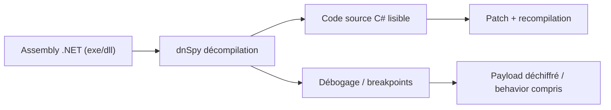
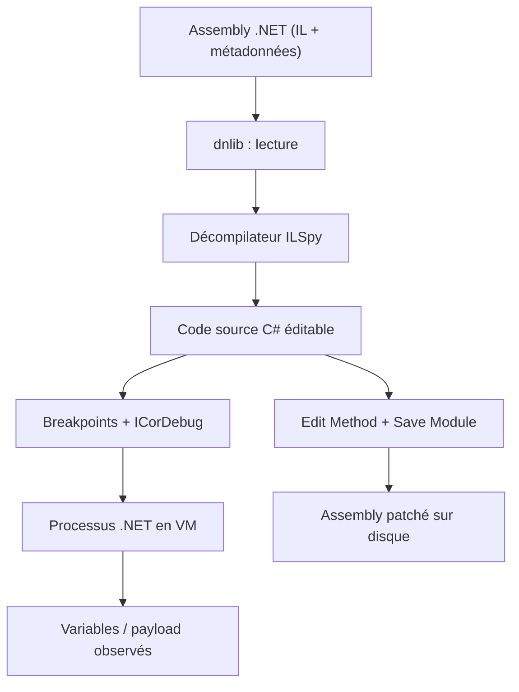

# 🧬 dnSpy — Débogueur et désassembleur .NET

> [!info] **En 1 phrase**
> dnSpy est le débogueur/décompilateur .NET qui permet de lire un malware C# en pseudo-code source, de poser des breakpoints et même de patcher l'assembly — indispensable pour les loaders et RAT .NET.

---

## 🧾 Overview

| Champ | Valeur |
|---|---|
| Nom complet | dnSpy (.NET Debugger and Assembly Editor) |
| Description | Décompilateur + débogueur + éditeur d'assemblys .NET : reconstitution du code source C# à partir d'un binaire, débogage pas à pas, édition et recompilation sur place |
| Catégorie | 🧬 Malware & Sandbox |
| Sous-catégorie | Reverse engineering — .NET |
| Fonction principale | Lire un malware .NET en code source C#, le déboguer et le patcher sans fichier de symboles |
| Type d'outil | Application desktop (GUI) + CLI (`dnSpy.Console.exe`) |
| Licence | GPL-3.0 (à vérifier sur le dépôt) |
| Open source / propriétaire | Open source |
| Langage(s) de programmation | C# (outil) ; analyse ciblée : .NET Framework 1.0→4.8, .NET Core, .NET 5/6/7/8+, Unity/Mono |
| Développeur / organisation | 0xd4d (original) ; fork **dnSpyEx** maintenu par électro-logic et la communauté |
| Projet officiel | dnSpyEx/dnSpy |
| Dépôt officiel | https://github.com/dnSpyEx/dnSpy |
| Documentation officielle | https://github.com/dnSpyEx/dnSpy/blob/master/README.md |
| Date de création | 2015 (premier commit de l'original) |
| État du projet | original arrêté ; **fork dnSpyEx actif** |
| Dernière version connue | v6.5.0 (dnSpyEx) |
| Systèmes compatibles | Windows (builds `net472` et `net` multi-plateforme ; Linux/macOS via la build `net`) |

> [!note] À vérifier
> La version exacte et le détail des releases se confirment sur la page Releases du dépôt dnSpyEx/dnSpy. Le fork reste le seul à supporter les .NET récents (Core/5+) et les génériques avancés.

---

## 🎯 Concept

dnSpy est un outil .NET tout-en-un : il décompile un assembly (C#/VB.NET) en code source C# lisible, permet de déboguer pas à pas, d'éditer le code et de recompiler l'assembly sur place. Un analyste ouvre `sample.exe`, navigue dans les types et méthodes, et obtient instantanément le code source de chaque fonction. Il peut aussi poser des breakpoints pour observer l'exécution (par exemple au moment du déchiffrement d'un payload), modifier une méthode (patcher un anti-debug ou une vérification) et recompiler le binaire.

Il se place dans l'analyse de malwares .NET, très courants aujourd'hui (loaders, crypters, RATs, droppers écrits en C#) : quand les fichiers sont trop obfusqués pour une lecture directe, on utilise de4dot pour désassembler l'obfuscation puis dnSpy pour la lecture et le debug. C'est l'équivalent .NET de x64dbg/Ghidra, avec un avantage majeur : la reconstitution du code source au lieu de l'assembleur. Le projet original n'est plus maintenu ; le fork **dnSpyEx** prend le relais pour les .NET récents (Core/5+).

En pratique, l'analyste recherche toujours les mêmes motifs dans un loader C# : une méthode `Main` minimale qui charge une DLL, des chaînes encodées en base64 ou en hexadécimal, des appels aux API Windows via `DllImport` (`VirtualAlloc`, `CreateRemoteThread`, `URLDownloadToFile`), et des flux chiffrés (AES) avec clé et IV en dur dans le code. dnSpy permet de lire ces valeurs directement et, grâce au débogueur, d'observer le flux déchiffré à l'exécution — sans jamais modifier le binaire original.

Le débogage sous dnSpy reprend les concepts classiques : breakpoints sur des lignes ou des méthodes, pas à pas (F10/F11), fenêtre Locals pour inspecter les variables, Watch pour suivre une expression, et fenêtre Call Stack pour la pile d'appels. Sur du code obfusqué, il est souvent plus efficace de poser un breakpoint à la **fin** d'une méthode de décodage que de relire tout le corps en assembleur : le résultat déchiffré attend dans les variables locales.



---

## 🧠 Concepts fondamentaux

| Concept | Explication |
|---|---|
| Assembly | Unité de code .NET (exe/dll) contenant IL (Intermediate Language), métadonnées et manifeste ; c'est ce que dnSpy lit |
| IL (Intermediate Language) | Code intermédiaire exécuté par le CLR ; dnSpy le décompile en C# et permet de l'afficher en mode « View IL » |
| Décompilation | Reconstitution d'un code source C# lisible à partir de l'IL — la force de dnSpy vs un désassembleur natif |
| Méthode / Type | Brique de navigation : on ouvre `Main`, les constructeurs, les méthodes de décodage pour lire le comportement |
| Breakpoint | Point d'arrêt sur une ligne ou une méthode ; l'exécution s'y suspend et on inspecte les variables |
| Pas à pas (F10/F11) | Exécution pas à pas (Step Over / Step Into) pour suivre le flot du décodage |
| Locals / Watch | Fenêtres d'inspection : variables locales et expressions suivies en continu |
| Call Stack | Pile d'appels : d'où vient l'appel courant (utile pour tracer les entrées) |
| Edit Method | Édition du corps d'une méthode (C# ou IL) puis resauvegarde de l'assembly (patcher un anti-debug, désactiver un payload) |
| Save Module | Resauvegarde de l'assembly édité sur disque — l'assembly resauvegardé perd sa signature Authenticode |
| PDB | Fichier de symboles de debug ; dnSpy fonctionne sans (reconstruction du source) et peut même les charger pour enrichir l'analyse |
| Obfuscateur (.NET) | ConfuserEx, SmartAssembly, .NET Reactor… : renommage de symboles, string encryption, contrôle flow ; à désobfusquer avec de4dot d'abord |
| Runtime cible | .NET Framework vs .NET Core/5+ ; le fork dnSpyEx gère les deux, l'original non |

---

## 🛠️ Installation

Installation portable (archive zip), aucun installeur requis :

```bash
# Windows : télécharger dnSpy-net-win64.zip (release dnSpyEx), décompresser
# puis lancer la version adaptée (net472 ou net)
dnSpy.exe "C:\malware\sample.exe"   # lancer et ouvrir l'assembly

# Le répertoire contient aussi dnSpy.Console.exe pour la décompilation
# en ligne de commande (fork dnSpyEx)
dnSpy.Console.exe -o ./src "C:\malware\sample.exe"

# Linux (expérimental) : via Wine ou la build net6 multi-plateforme
wine dnSpy.exe "C:\malware\sample.exe"
```

> [!warning] ⚠️ Prérequis & problèmes potentiels
> - **Runtime** : la build `net472` nécessite .NET Framework 4.7.2+ ; la build `net` embarque tout (self-contained) et fonctionne aussi sur Linux/macOS.
> - **Antivirus** : certains EDR signalent dnSpy en raison de sa capacité de patch — ajouter une exception sur le poste d'analyse isolé.
> - **Toujours analyser dans une VM** : l'exécution de l'échantillon dans le débogueur est une vraie détonation.

---

## ⚙️ Configuration

dnSpy est presque sans configuration : les réglages se trouvent dans `Tools → Options`.

| Paramètre | Rôle | Valeur conseillée |
|---|---|---|
| `Decompiler → Language` | Langage de sortie (C#, VB, IL) | C# |
| `Decompiler → Show XML doc comments` | Afficher/masquer les commentaires | Off (réduit le bruit) |
| `Debugger → Symbols → Symbol Paths` | Dossiers PDB/NuGet à consulter | Dossier local d'analyse, pas NuGet public (télémétrie) |
| `Debugger → Anti-tampering` | Vérifications liées au CLR (anti-injection) | Laisser défaut |
| `High DPI` | Rendu sur écrans HiDPI | Auto |
| `Settings → Fonts` | Police de l'éditeur | Par défaut (ou Nerd Font pour l'unicité) |

> [!note] À vérifier
> La localisation exacte des options varie légèrement entre l'original et le fork dnSpyEx ; consulter le menu `Tools → Options` de la version installée.

---

## 🏗️ Architecture interne

- **Moteur de décompilation** : basé sur le décompilateur ILSpy (licence MIT), intégré dans le processus — pas de service externe.
- **Noyau `dnlib`** : bibliothèque de lecture/écriture des assemblys .NET ; c'est elle qui lit l'IL, les métadonnées et permet de réécrire les modules (patches).
- **Débogueur** : repose sur l'API `ICorDebug` (CLR Debugging API) ; il attache le processus .NET, pose les breakpoints IL et lit les variables via les API de debug CLR.
- **Interfaces** : GUI (WPF, `dnSpy.exe`) et CLI (`dnSpy.Console.exe`) partagent les mêmes bibliothèques (dnlib + décompilateur).
- **Fonctionnalités clés de l'UI** : TreeView des assemblys, éditeur avec code folding, fenêtres Locals/Watch/Call Stack, Memory View, IL Viewer, gestionnaire de breakpoints.
- **Analyse** : panneau `Analyze` (appelants/appelés, strings utilisées, exceptions) et `Search Strings` pour les chaînes en dur.

Flux d'analyse typique : ouvrir l'assembly → explorer les types → localiser la méthode sensible (décodage, téléchargement) → lire le code C# → poser un breakpoint → déboguer en VM → inspecter le payload en Locals → optionnellement patcher et resauvegarder.



---

## ⌨️ Commandes

### Commandes principales

```bash
dnSpy.exe malware.exe                    # ouvrir un assembly (GUI)
dnSpy.Console.exe -o ./src malware.exe   # décompiler toute l'assembly en CLI
dnSpy.Console.exe -o ./src -t sample.Form1 malware.exe  # un type précis
```

| Commande | Objectif | Résultat attendu |
|---|---|---|
| `dnSpy.exe <assembly>` | Ouvrir l'assembly en mode décompilation | Vue source C# de tous les types |
| `dnSpy.Console.exe -o <dir> <assembly>` | Décompiler l'assembly entière en C# | Arborescence de fichiers `.cs` |
| `dnSpy.Console.exe -t <type> -o <dir> <assembly>` | Ne décompiler qu'un type | Un seul fichier source |
| `dnSpy.Console.exe -s <texte> -o <dir> <assembly>` | Décompiler les types contenant le texte | Sous-ensemble filtré |

### Raccourcis GUI essentiels

| Raccourci | Fonction |
|---|---|
| `Ctrl+Shift+R` | Rechercher un symbole / une chaîne dans l'assembly |
| `Alt+F7` | Find References : toutes les références d'une méthode |
| `Ctrl+Shift+G` | Aller à l'instruction IL / source d'une méthode |
| `F9` | Poser / retirer un breakpoint |
| `F10` / `F11` | Step Over / Step Into |
| `Ctrl+Shift+E` | Edit Method (patcher une méthode) |
| `Ctrl+S` | Save Module (resauvegarder l'assembly) |
| `Ctrl+Shift+I` | Inspecter / ouvrir la fenêtre des variables (Locals) |

---

## 🎚️ Options et flags

### CLI (dnSpy.Console.exe)

| Option | Description | Exemple | Niveau |
|---|---|---|---|
| `-o <dir>` | Dossier de sortie de la décompilation | `dnSpy.Console.exe -o ./src s.exe` | Basic |
| `-t <type>` | Type unique à décompiler | `dnSpy.Console.exe -t s.Form1 -o ./src s.exe` | Intermediate |
| `-s <texte>` | Filtrer sur un texte (nom de type, chaîne) | `dnSpy.Console.exe -s "Config" -o ./src s.exe` | Intermediate |
| `--no-pdb` | Ignorer les PDB présents | `dnSpy.Console.exe --no-pdb -o ./src s.exe` | Advanced |
| `-l <language>` | Langage de sortie (cs, vb, il) | `dnSpy.Console.exe -l il -o ./il s.exe` | Expert |

### GUI — comportements clés

| Option | Effet |
|---|---|
| `Debug → Start` (F5) | Lance l'assembly en débogage (à faire sur VM isolée) |
| `Debug → Attach to Process` | Attacher le débogueur à un processus .NET en cours |
| `File → Open from GAC` | Ouvrir des assemblys système pour référence |
| `Edit Method` (clic droit) | Remplacer le corps d'une méthode par du C#/IL |
| `Save Module` | Resauvegarder l'assembly édité |
| `Analyze → Analyze Method` | Appelants/appelés, strings, exceptions d'une méthode |
| `Search Strings` | Lister les chaînes en dur (URLs, clés, hostnames) |

> [!tip] Options les plus utiles au quotidien
> `Search Strings` (repérer URLs/clés en dur), `Edit Method` + `Save Module` (désactiver anti-debug), `Alt+F7` (tracer les usages d'une API d'injection).

---

## 🧪 Exemples pratiques

### Beginner

```bash
# 1. Ouvrir l'assembly et lire le Main
dnSpy.exe "C:\malware\sample.exe"
# 2. Naviguer vers Main : double-clic sur le type Program puis la méthode Main
# 3. Rechercher une chaîne : Ctrl+Shift+R -> "http"
```

### Intermediate

```bash
# Décompiler en CLI et grepper les indicateurs
dnSpy.Console.exe -o ./src "C:\malware\sample.exe"
grep -rEi "https?://|\.onion|Convert.FromBase64String" ./src/
```

### Advanced

```bash
# Trouver les usages d'une API d'injection
# GUI : clic droit sur CreateRemoteThread (dans le P/Invoke) -> Analyze Method
# Lire la pile d'appels et la méthode appelante
```

### Expert

```bash
# Patcher une vérification anti-debug et resauvegarder
# GUI : clic droit sur la méthode -> Edit Method -> remplacer par "return false;"
# Ctrl+S -> Save Module -> sample_patched.exe (perd sa signature)
```

---

## 🧪 Workflow complet (scénario pas à pas)

1. **Ouvrir l'assembly** — lancer le binaire dans dnSpy et inspecter la hiérarchie des types.

   ```bash
   dnSpy.exe "C:\malware\sample.exe"
   ```

2. **Naviguer vers les méthodes clés** — ouvrir le `Main` et les fonctions de déchiffrement pour lire le code source. Utiliser la recherche (`Ctrl+Shift+R`) pour sauter directement sur un symbole, une chaîne ou une URL.

3. **Chercher les API sensibles** — localiser `Assembly.Load`, `Reflection.Emit`, `Process.Start`, `URLDownloadToFile`, les conversions `Convert.FromBase64String`.

4. **Observer à l'exécution** — poser un breakpoint sur la méthode qui assemble le payload et lire le contenu déchiffré en mémoire.

5. **Extraire le payload** — copier le buffer déchiffré (observable dans la fenêtre Locals/Watch) et l'enregistrer pour re-analyse.

6. **Publier les IOCs** — hash du payload extrait, adresses C2 lues dans le code, vers MISP/YARA.

---

## 🎬 Scénarios avancés

### Scénario 1 : Loader qui charge un payload en base64

Localiser l'appel de déchiffrement, mettre un breakpoint, lire le résultat et l'exporter :

```bash
# GUI : breakpoint sur la ligne du Convert.FromBase64String
# dans Locals, clic droit sur la variable -> Watch, copier le buffer déchiffré
```

### Scénario 2 : Neutraliser un anti-debug .NET

Patcher la méthode de vérification puis recompiler pour continuer l'analyse :

```bash
# Clic droit sur la méthode -> Edit Method
# remplacer le corps par: return false;  -> File / Save Module
```

### Scénario 3 : Désobfuscation puis recompilation d'un Crypter

```bash
# 1. de4dot -u sample.exe           (désobfusque)
# 2. Ouvrir le résultat dans dnSpy, lire le config extrait
# 3. Optionnel : Edit Method pour neutraliser le payload, Save Module
```

### Scénario 4 : extraction de la config d'un RAT .NET (AsyncRAT)

```bash
# 1. Désobfusquer avec de4dot, ouvrir le résultat dans dnSpy
# 2. Rechercher les classes de configuration (Ctrl+Shift+R -> "host", "port")
# 3. Lire le port, la clé AES et le domaine C2 dans le constructeur
# 4. Écrire une règle YARA avec les chaînes extraites du binaire
```

### Scénario 5 : décompilation en masse pour automatiser l'extraction d'IOC

```bash
# Décompiler toute l'assembly en C# puis grepper les indicateurs
dnSpy.Console.exe -o ./src "C:\malware\sample.exe"
grep -rEi "http://|https://|\.exe|\.dll" ./src/ | sort -u > iocs.txt
# Le grep sur le code reconstruit remplace la lecture manuelle pour les gros binaires.
```

---

## 🛡️ Cybersecurity use cases

| Phase | Utilisation |
|---|---|
| Analyse de malware .NET | Lecture en code source C# des loaders, crypters, RATs |
| Reverse engineering | Débogage pas à pas du déchiffrement de payload |
| CTI / Threat Intelligence | Extraction des configs (C2, clés AES) directement dans le constructeur |
| DFIR | Étude des assemblys collectés, vérification de la charge malveillante |
| Désobfuscation | Complément de de4dot pour les obfuscateurs .NET |
| Étude de campagne | Décompilation en masse (`Console.exe`) et grep des IOCs |

---

## 🎯 MITRE ATT&CK

| Tactique | Technique / Sub-technique | ID | Raison | Détection | Mitigation |
|---|---|---|---|---|---|
| Execution | User Execution : Malicious File | T1204.002 | L'assembly .NET est exécuté/débogué dans l'environnement d'analyse | Triage e-mail, sandboxing | Contrôles d'exécution |
| Execution | Command and Scripting Interpreter | T1059 | Les loaders .NET invoquent PowerShell/cmd pour exécuter des payloads | Sysmon EventID 1, AMSI | AMSI, AppLocker |
| Defense Evasion | Obfuscated Files or Information | T1027 | Obfuscateurs .NET (ConfuserEx, SmartAssembly) détectés et désobfusqués | YARA sur les assemblys | Mise à jour des signatures |
| Defense Evasion | Deobfuscate/Decode Files or Information | T1140 | Déchiffrement base64/AES observé au débogage | Détection comportementale du décodage | AMSI, EDR |
| Execution | Native API | T1106 | Appels P/Invoke `VirtualAlloc`/`CreateRemoteThread` tracés | Sysmon EventID 8/10, EDR | Restriction des APIs d'injection |
| Defense Evasion | Process Injection | T1055 | Injection de code .NET dans un processus distant | Sysmon, EDR | Contrôle d'intégrité, PPL |
| Command & Control | Application Layer Protocol | T1071 | C2 (HTTP/HTTPS) lisible dans les chaînes de l'assembly | NDR/IPS | Filtrage sortant |
| Defense Evasion | Modify Registry / Masquerading | T1112 / T1036 | Persistance et renommage observés dans les méthodes | Sysmon EventID 12/13 | Surveillance des clés Run |

> [!note] Ne renseigner que si l'association est réellement pertinente.
> dnSpy est un **outil d'analyse** : les techniques listées sont celles que l'on retrouve/étudie dans les assemblys .NET analysés, pas des techniques mises en œuvre par dnSpy.

---

## 🛡️ Defensive Security

### Signes observables

| Indicateur | Détail |
|---|---|
| `Assembly.Load` alimenté par des données décodées en base64 | Bloquer l'exécution d'assemblys chargés dynamiquement (AMSI, AppLocker) |
| Code obfusqué (ConfuserEx, SmartAssembly) | Désobfusquer avec de4dot puis re-analyser |
| Injection de code .NET dans un processus (RemoteThread) | Détecter via EDR/Sysmon (CreateRemoteThread, injection) |
| Modification/patch de l'assembly observée | Comparer les hash et vérifier la signature Authenticode |
| Déchiffrement en mémoire (AES/RC4) visible à l'analyse dynamique | Détection comportementale du décodage de payload (Sysmon, EDR) |
| Longues chaînes base64 dans les données de l'assembly | Alerte sur les blobs encodés + contrôle AMSI à l'exécution |

### Règles de détection (Sigma / Suricata / Snort / YARA)

```yaml
# Sigma — Windows : chargement dynamique d'assemblys .NET (exemple)
title: .NET Dynamic Assembly Loading
logsource:
    category: process_creation
    product: windows
detection:
    selection:
        Image|endswith:
            - 'powershell.exe'
            - 'cscript.exe'
    condition: selection
level: medium
```

```yara
// YARA — repérage d'assemblys .NET obfusqués (exemple)
rule DotNet_StringEncryption_Heuristic
{
    condition:
        // typiquement : beaucoup de chaînes de contrôle en dur (noms symboliques)
        strings:
            $enc = "Convert.FromBase64String" ascii
            $ld  = "Assembly.Load" ascii
            $rx  = "Obfuscator" ascii
        condition:
            uint16(0) == 0x5A4D and ($enc and $ld) or $rx
}
```

---

## 🤖 Automatisation

```bash
# Bash — décompilation en masse d'un corpus .NET et collecte des IOCs
mkdir -p /opt/iocs
for f in /opt/corpus/*.exe; do
    base=$(basename "$f" .exe)
    dnSpy.Console.exe -o "/opt/iocs/$base" "$f"
    grep -rEi "https?://|\.exe|\.dll" "/opt/iocs/$base" >> /opt/iocs/all.txt
done
sort -u /opt/iocs/all.txt -o /opt/iocs/all.txt
```

```python
# Python — post-traitement des sources décompilées : extraction d'URLs
import os
import re

URL = re.compile(rb"https?://[^\s'\"]+")
seen = set()
for root, _, files in os.walk("/opt/iocs"):
    for name in files:
        if name.endswith(".cs"):
            for m in URL.findall(open(os.path.join(root, name), "rb").read()):
                s = m.decode("utf-8", "ignore")
                if s not in seen:
                    seen.add(s)
                    print("URL", s)
```

> [!note] À vérifier
> L'exemple Python suppose des sources décompilées avec la CLI ; adapter les chemins et expressions selon le corpus.

---

## 📤 Output et parsing

Le mode GUI permet de copier le code source décompilé, de l'exporter ou de resauvegarder l'assembly. Le mode CLI produit des fichiers `.cs` :

- `-o ./src` génère un fichier par type (`.cs`), arborescence reflet des namespaces.
- `dnSpy.Console.exe -l il` génère du code IL au lieu de C# (pour vérifier des reconstructions douteuses).
- Les patches via `Edit Method` + `Save Module` produisent un nouvel assembly binaire.

```bash
# Lister les types décompilés
find ./src -name "*.cs" | head -20
# Grepper les chaînes d'intérêt (URLs, clés, hostnames)
grep -rEi "key|iv|port|https?://" ./src/ | sort -u
# Compter les types pour évaluer la taille du binaire
find ./src -name "*.cs" | wc -l
```

```python
# Python — recherche de clés AES/RC4 en dur dans les sources
import os
import re

PAT = re.compile(rb"(?:0x[0-9a-fA-F]{2},\s*){16,}")
for root, _, files in os.walk("./src"):
    for name in files:
        if name.endswith(".cs"):
            data = open(os.path.join(root, name), "rb").read()
            for m in PAT.finditer(data):
                print(name, m.group()[:64])
```

---

## 🔗 Intégrations

- [[Tools|🧰 Outils]] global
- [[Outil - x64dbg]] — complément natif quand le loader finit en code non managé
- [[Outil - Ghidra]] — analyse statique du payload extrait ou des assemblys mixtes
- [[Outil - Cutter]] — alternative GUI pour le volet natif (radare2)
- [[Outil - Flare VM]] — distribution Windows avec dnSpy et de4dot préinstallés
- [[Outil - YARA]] — signatures sur les assemblys .NET et les chaînes extraites
- [[Outil - CAPE]] / [[Outil - Cuckoo Sandbox]] — exécution dynamique pour confirmer le comportement
- [[09 - Reverse Engineering & Malware|🔬 Reverse Engineering & Malware]]

```text
Assembly .NET → dnSpy (décompilation) → config/C2 → YARA + MISP → SOC
```

---

## 🔄 Alternatives

| Outil | Avantages | Inconvénients | Cas d'usage |
|---|---|---|---|
| ILSpy | GUI, gratuit, léger | Pas de débogueur intégré | Lecture rapide sans debug |
| de4dot | Désobfuscation automatisée | Ne lit pas le code (réécrit) | En amont de dnSpy |
| dotPeek (JetBrains) | UI soignée, gratuit | Propriétaire, pas de debug | Lecture rapide en équipe |
| dnSpyEx (fork) | Debug + patch, .NET récents | Fork communautaire | Analyse avancée — recommandé |
| ILSpy decompiler CLI | Scriptable | Pas de debug | Pipelines d'automatisation |

> **Quand utiliser dnSpy plutôt qu'un désassembleur natif ?** Dès que l'échantillon est du .NET : la reconstitution C# est bien plus rapide à lire que l'assembleur. Garder x64dbg/Ghidra pour la partie native du même échantillon.

---

## ⚡ Performance

- Décompilation instantanée pour la plupart des assemblys (quelques secondes pour les gros binaires).
- La décompilation en CLI est parallélisable par lot (boucle shell sur un corpus).
- Le débogage est lent par nature (instrumentation CLR) : préférer le pas-à-pas ciblé aux exécutions complètes.
- L'analyse « Analyze Method » sur des assemblys très liés peut être coûteuse : restreindre à la méthode d'intérêt.
- Le fork dnSpyEx charge plus vite les assemblys .NET Core que l'original.

---

## 🛠️ Troubleshooting

### Common problems

#### Problème : « Cannot load file or assembly » à l'ouverture

- **Cause** : assembly .NET Core/5+ ouvert avec l'original (non supporté) ou dépendances manquantes.
- **Solution** : utiliser la build `net` du fork dnSpyEx et ouvrir le binaire principal.
- **Vérification** : vérifier la version du CLR ciblé (header PE) avant ouverture.

#### Problème : la décompilation C# semble fausse sur du code obfusqué

- **Cause** : les obfuscateurs cassent le flow de contrôle ; le décompilateur propose un code plausible mais incorrect.
- **Solution** : passer dans la vue IL (`Ctrl+Shift+G`) et désobfusquer d'abord avec de4dot.
- **Vérification** : comparer le pseudo-C# avec l'IL brut de la méthode.

#### Problème : le débogueur ne démarre pas (erreur CLR)

- **Cause** : runtime incompatible, architecture x86/x64 incohérente, ou anti-tampering.
- **Solution** : lancer la build `net472` sur Windows pour .NET Framework, vérifier le bitness de l'assembly (32 vs 64).
- **Vérification** : menu `Debug → Windows → Modules` une fois attaché.

#### Problème : l'assembly patché ne se lance plus

- **Cause** : patch invalide (retour modifié mais logique dépendante) ou signature/strong-name cassés.
- **Solution** : vérifier en vue IL, rééditer, ou re-désobfusquer avant patch.
- **Vérification** : recharger le fichier dans dnSpy et relire la méthode modifiée.

#### Problème : l'AV bloque dnSpy

- **Cause** : heuristiques sur les capacités d'édition de binaire.
- **Solution** : ajouter une exclusion sur le dossier d'analyse dans la VM dédiée.
- **Vérification** : relancer l'outil en mode administrateur dans l'environnement isolé.

---

## 🔐 Sécurité de l'outil

- **Exécution réelle** : « Debug → Start » exécute réellement le malware — uniquement dans une VM isolée.
- **Téléchargement** : obtenir les binaires depuis les Releases officielles (dnSpyEx/dnSpy) et vérifier les hashes.
- **Sources décompilées** : ne pas copier les sources d'un échantillon vers une machine connectée au réseau de prod.
- **Patches** : un assembly resauvegardé perd sa signature Authenticode et son strong-name — le signale avant utilisation.
- **Symboles PDB** : la config symboles peut aller chercher sur NuGet ; sur un poste isolé, la désactiver pour éviter les requêtes externes.
- **Échantillons** : ouvrir uniquement des binaires venant d'un flux contrôlé (honeypot, triage).

---

## ⚠️ Limitations

- L'original ne supporte pas .NET Core/5+ ; seul le fork dnSpyEx le fait.
- La décompilation sur du code fortement obfusqué peut être trompeuse (flow de contrôle cassé, strings chiffrées) — il faut de4dot en amont et la vue IL en secours.
- Pas de support natif : la partie non managée (C/C++) d'un malware échappe à dnSpy (passer à x64dbg/Ghidra).
- Un assembly patché et resauvegardé perd sa signature Authenticode et peut se comporter différemment.
- Le débogage demande un runtime .NET compatible et ne fonctionne pas sur tous les anti-tampering.
- Pas d'interface de scanning de mémoire étendue (pas d'équivalent de Process Hacker intégré).

---

## 📋 Cheatsheet

```bash
# Ouvrir un assembly en GUI
dnSpy.exe malware.exe

# Décompiler toute l'assembly en CLI
dnSpy.Console.exe -o ./src malware.exe

# Décompiler un type précis
dnSpy.Console.exe -o ./src -t sample.Form1 malware.exe

# Décompiler les types contenant une chaîne
dnSpy.Console.exe -o ./src -s "Config" malware.exe

# Sortie en IL au lieu de C#
dnSpy.Console.exe -l il -o ./il malware.exe

# GUI : rechercher un symbole / une chaîne
# Ctrl+Shift+R -> "http"

# GUI : trouver les usages d'une méthode
# Alt+F7 (Find References)

# GUI : patcher une méthode
# Clic droit -> Edit Method -> Ctrl+S (Save Module)
```

---

## ⚡ Quick reference

| | |
|---|---|
| **À quoi sert-il ?** | Décompiler, déboguer et patcher des assemblys .NET (lecture en C#) |
| **Quand l'utiliser ?** | Dès qu'un échantillon est identifié comme .NET (loaders, RATs, crypters) |
| **Commande principale** | `dnSpy.exe malware.exe` (GUI) ou `dnSpy.Console.exe -o ./src malware.exe` (CLI) |
| **Alternative principale** | ILSpy (lecture) · de4dot (désobfuscation) |
| **Concepts importants** | Assembly, IL, décompilation, breakpoints, Edit Method, Save Module |
| **Liens associés** | [[Outil - x64dbg]] · [[Outil - Ghidra]] · [[Outil - YARA]] |

---

## 🔍 Détection & Défense

| Signe | Défense |
|---|---|
| `Assembly.Load` alimenté par des données décodées en base64 | Bloquer l'exécution d'assemblys chargés dynamiquement (AMSI, AppLocker) |
| Code obfusqué (ConfuserEx, SmartAssembly) | Désobfusquer avec de4dot puis re-analyser |
| Injection de code .NET dans un processus (RemoteThread) | Détecter via EDR/Sysmon (CreateRemoteThread, injection) |
| Modification/patch de l'assembly observée | Comparer les hash et vérifier la signature Authenticode |
| Déchiffrement en mémoire (AES/RC4) visible à l'analyse dynamique | Détection comportementale du décodage de payload (Sysmon, EDR) |
| Longues chaînes base64 dans les données de l'assembly | Alerte sur les blobs encodés + contrôle AMSI à l'exécution |

---

## ⚠️ Tips & Pièges

> [!tip] 💡 **Tips**
> - Utilisez le fork **dnSpyEx** pour les .NET récents : l'original ne supporte pas .NET Core/5+.
> - Passez les échantillons obfusqués dans de4dot AVANT dnSpy : le code reconstruit est alors exploitable.
> - Le mode « View IL » permet de vérifier ce que le décompilateur a pu mal reconstruire sur du code obfusqué.
> - Utilisez « Search Strings » (Ctrl+Shift+R) pour repérer rapidement les URLs et clés en dur.
> - Posez un breakpoint à la fin d'une méthode de décodage : le payload déchiffré attend dans Locals.

> [!warning] ⚠️ **Pièges**
> - Sur du code obfusqué, la décompilation C# est parfois fausse : croisez toujours avec la vue IL avant de conclure.
> - Ne « runnez » pas l'échantillon dans dnSpy sur une machine de prod : c'est une exécution réelle du malware.
> - Un assembly édité et resauvegardé perd sa signature : vérifiez les effets secondaires avant de l'utiliser.
> - Un breakpoint posé AVANT le décodage permet de dumper le payload en clair : exportez-le avant qu'il ne soit libéré.

---

## 📚 References

### Official

- Dépôt GitHub dnSpyEx (fork maintenu) : https://github.com/dnSpyEx/dnSpy
- Dépôt GitHub dnSpy original : https://github.com/0xd4d/dnSpy
- README dnSpyEx (install, builds) : https://github.com/dnSpyEx/dnSpy/blob/master/README.md

### Security references

- MITRE ATT&CK T1204 — User Execution : https://attack.mitre.org/techniques/T1204/
- MITRE ATT&CK T1027 — Obfuscated Files or Information : https://attack.mitre.org/techniques/T1027/
- MITRE ATT&CK T1140 — Deobfuscate/Decode Files or Information : https://attack.mitre.org/techniques/T1140/
- MITRE ATT&CK T1055 — Process Injection : https://attack.mitre.org/techniques/T1055/

### Community

- de4dot (désobfuscation en amont) : https://github.com/de4dot/de4dot
- ILSpy (décompilateur sous-jacent) : https://github.com/icsharpcode/ILSpy
- Guide AsyncRAT analysis (community) : https://malpedia.caad.fkie.fraunhofer.de/details/win.asyncrat

---

➡️ **Liens :** [[Tools|🧰 Outils]] · [[Outils/Outil - x64dbg|🧬 x64dbg]] · [[Outils/Outil - Ghidra|🔬 Ghidra]] · [[Outils/Outil - YARA|🔎 YARA]] · [[Outils/Outil - Flare VM|🔥 Flare VM]] · [[Techniques/09 - Reverse Engineering & Malware|🔬 Reverse Engineering & Malware]]
