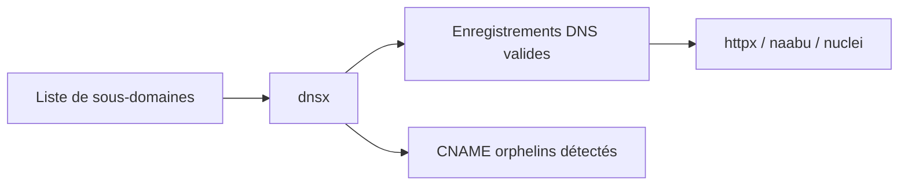

# 🧭 dnsx — Probe DNS massif de l'écosystème projectdiscovery

> [!info] **En 1 phrase**
> dnsx interroge en masse tous les types d'enregistrements DNS et valide les sous-domaines avant de les envoyer vers httpx et naabu.

---

## 🧾 Overview

| Champ | Valeur |
|---|---|
| Nom complet | dnsx (DNS prober de ProjectDiscovery) |
| Description | Probeur DNS haute performance : validation d'hôtes, collecte de tous les types d'enregistrements, bruteforce de sous-domaines, résolveurs personnalisés |
| Catégorie | Reconnaissance & OSINT |
| Sous-catégorie | Énumération & validation DNS |
| Fonction principale | Valider des noms DNS et collecter leurs enregistrements en masse |
| Type d'outil | CLI (pipeline stdin/stdout) |
| Licence | MIT |
| Open source / propriétaire | Open source |
| Langage(s) de programmation | Go |
| Développeur / organisation | ProjectDiscovery |
| Projet officiel | ProjectDiscovery |
| Dépôt officiel | https://github.com/projectdiscovery/dnsx |
| Documentation officielle | https://docs.projectdiscovery.io/tools/dnsx/usage |
| Date de création | 2020 (premier commit du dépôt) |
| État du projet | actif |
| Dernière version connue | v1.3.0 (2026-07-16) |
| Systèmes compatibles | Linux, Windows, macOS (binaires précompilés + `go install`) |

> [!note] Pour vérifier / compléter
> dnsx fait partie de la suite ProjectDiscovery (subfinder, httpx, nuclei, naabu). Le paquet `dnsx` est disponible dans les dépôts Kali ; sur les autres distributions passer par les binaires de release ou `go install`.

---

## 🎯 Concept

dnsx est le probeur DNS de projectdiscovery, l'équivalent DNS de httpx. Il prend une liste de noms de domaine et exécute des requêtes DNS pour valider leur existence et collecter les enregistrements : A, AAAA, CNAME, MX, NS, TXT, SOA, PTR. En mode bruteforce, il teste une wordlist de sous-domaines. Ses usages : valider les sorties de subfinder/chaos, détecter les CNAME orphelins (candidats au subdomain takeover), cartographier l'infrastructure e-mail (MX, SPF via TXT), et servir de passerelle vers naabu/httpx.

Il se place dans la phase de **reconnaissance passive puis active** d'un engagement : les noms collectés par subfinder, chaos ou un scrape passif sont passés dans dnsx pour filtrer les noms qui résolvent réellement, avant tout scan de ports ou scan HTTP. Écrit en Go, il est très rapide (milliers de requêtes/seconde avec threads), exploitable en pipeline (`stdin` → `stdout`), et utilisable avec des résolveurs personnalisés pour répartir la charge et éviter les quotas.

La force de dnsx tient aussi à sa **sortie normalisée** : chaque ligne répond à un format attendu, ce qui le rend trivialement combinable avec `httpx`, `nuclei` ou `naabu`. Couplé à `subfinder` (passif) puis `httpx` (HTTP probing), il forme le triptyque de base de la recon des sous-domaines de l'écosystème projectdiscovery, répétable à l'infini sur des milliers de cibles sans surcharger les résolveurs quand on bride le débit avec `-rl`.



---

## 🧠 Concepts fondamentaux

| Concept | Explication |
|---|---|
| Enregistrements DNS | Types de données d'une zone : `A` (IPv4), `AAAA` (IPv6), `CNAME` (alias), `MX` (mail), `NS` (nameservers), `TXT` (SPF/DKIM…), `SOA`, `PTR` (reverse), `SRV` (services) |
| Résolveur DNS | Serveur qui répond aux requêtes (8.8.8.8, 1.1.1.1…) ; en `-r`/`-rL` pour personnaliser et répartir la charge |
| Wildcard DNS | `*.example.com` répond à tous les sous-domaines : génère des faux positifs en bruteforce |
| Subdomain takeover | CNAME orphelin : un sous-domaine pointe vers un service tiers supprimé → possibilité de le réclamer |
| Rate limiting | Limiter les requêtes/seconde (`-rl`) pour ne pas bannir son IP chez les gros résolveurs |
| Pipeline | `stdin` → `stdout` : dnsx se chaîne avec subfinder, chaos, httpx, nuclei sans fichier intermédiaire |
| NXDOMAIN | Réponse DNS indiquant qu'un nom n'existe pas : en rafale, signe de bruteforce |

---

## 🛠️ Installation

### Debian / Ubuntu / Kali Linux

```bash
sudo apt install dnsx
dnsx -version
```

> [!note] À vérifier
> Le paquet `dnsx` existe dans les dépôts Kali/Parrot. Sur Debian/Ubuntu standards, préférer le binaire de release ou `go install`.

### Arch Linux

```bash
# Binaire précompilé depuis les releases GitHub
# ou via go
go install -v github.com/projectdiscovery/dnsx/cmd/dnsx@latest
```

### Fedora / RHEL

```bash
go install -v github.com/projectdiscovery/dnsx/cmd/dnsx@latest
```

### macOS

```bash
brew install dnsx
# ou
go install -v github.com/projectdiscovery/dnsx/cmd/dnsx@latest
```

### Windows

```powershell
# Binaire précompilé (dnsx_1.3.0_windows_amd64.zip) depuis les releases GitHub
# ou
go install -v github.com/projectdiscovery/dnsx/cmd/dnsx@latest
```

### Docker

```bash
docker pull projectdiscovery/dnsx
echo example.com | docker run --rm -i projectdiscovery/dnsx -a -resp -silent
```

### Compilation depuis les sources

```bash
git clone https://github.com/projectdiscovery/dnsx.git && cd dnsx
go build -o dnsx cmd/dnsx/main.go
sudo mv dnsx /usr/local/bin/
```

> [!warning] ⚠️ Prérequis & problèmes potentiels
> - Go 1.21+ (v1.3.0 : Go 1.25 pour le build) pour la compilation.
> - Les requêtes DNS sortantes vers les résolveurs publics sont soumises à leurs quotas : utiliser `-rl` et plusieurs résolveurs.
> - En entreprise, le trafic DNS sortant peut être bloqué par un DNS proxy : configurer `-r` avec les résolveurs autorisés.

---

## ⚙️ Configuration

Pas de fichier de configuration : tout passe par les options CLI. Les valeurs les plus importantes :

| Paramètre | Rôle | Valeur possible | Impact | Exemple |
|---|---|---|---|---|
| `-r` | Résolveur(s) personnalisé(s) | IP séparées par des virgules | Répartit la charge, contourne les quotas | `-r 1.1.1.1,8.8.8.8` |
| `-rL` | Fichier de résolveurs | chemin (un par ligne) | Masse de résolveurs pour gros volumes | `-rL resolvers.txt` |
| `-rl` | Rate limit | nombre de requêtes/seconde | Évite le ban IP | `-rl 500` |
| `-t` | Nombre de threads | entier | Parallélisme (CPU) | `-t 100` |
| `-retry` | Tentatives en cas d'échec | entier | Fiabilité sur réseaux instables | `-retry 2` |
| `-o` | Fichier de sortie | chemin | Persistance | `-o live.txt` |
| `-json` | Sortie JSON | booléen | Parsing structuré | `-json` |
| `-silent` | Sortie épurée | booléen | Pipeline | `-silent` |
| `-duc` | Désactive la vérif. de mise à jour | booléen | CI | `-duc` |

---

## 🏗️ Architecture interne

- **Moteur de requêtes** : dnsx utilise la bibliothèque `gologger` (logs), `retryablehttp` et un pool de résolveurs (via `dnsclient`, basé sur `miekg/dns` en mode UDP/TCP). Chaque hôte est interrogé en parallèle avec un nombre de threads contrôlé.
- **Bruteforce** : en mode `-d DOMAIN -w wordlist`, le client génère les paires nom+domaine et les résout via le même pool.
- **Normalisation de sortie** : les résultats sont dédupliqués, triés et émis dans un format stable (nom seul avec `-resp-only`, ou nom+réponse avec `-resp`, JSON optionnel).
- **Sondes multi-types** : un seul passage résout plusieurs types d'enregistrements (`-a -cname -mx …`) pour limiter le nombre de round-trips.
- **Intégration pdtm** : installable et mise à jour via ProjectDiscovery Tools Manager.

---

## ⌨️ Commandes

### Commandes principales

```bash
dnsx [flags] [listes/domaines]
```

| Commande | Objectif | Résultat attendu |
|---|---|---|
| `echo example.com \| dnsx -a -cname -mx -ns -txt` | Collecter plusieurs types d'enregistrements | Réponses pour chaque type |
| `subfinder -d example.com -silent \| dnsx -a -resp -silent` | Valider les sorties de subfinder | Hôtes résolus + adresses |
| `dnsx -d example.com -w subnames.txt -a -resp -silent` | Bruteforce de sous-domaines | Noms valides |
| `cat subs.txt \| dnsx -a -aaaa -cname -resp-only -silent` | Sortie propre pour pipeline | Noms uniquement |
| `dnsx -d example.com -mx -txt -soa -resp -silent` | Cartographie mail + SOA | MX, SPF, SOA |
| `dnsx -l hosts.txt -a -json -o live.json` | Validation depuis un fichier | JSON exploitable |

### Commandes avancées

```bash
# Détection des wildcards avant bruteforce
echo "wildcard-test-12345.example.com" | dnsx -a -resp -silent
# Validation massive de résolveurs
cat resolvers.txt | dnsx -silent
# Recon infra complète d'un domaine
dnsx -d example.com -a -aaaa -mx -ns -txt -soa -cname -resp -silent
# Bruteforce contrôlé (threads + rate limit)
dnsx -d example.com -w /usr/share/seclists/Discovery/DNS/subdomains-top1million-5000.txt \
  -a -resp -t 100 -rl 500 -silent
```

---

## 🎚️ Options et flags

| Option | Description | Exemple | Niveau |
|---|---|---|---|
| `-a` | Enregistrement A (IPv4) | `echo x.com \| dnsx -a` | Basic |
| `-aaaa` | Enregistrement AAAA (IPv6) | `dnsx -aaaa -l hosts.txt` | Basic |
| `-cname` | Enregistrement CNAME | `dnsx -cname -resp` | Basic |
| `-mx` / `-ns` | MX / NS | `dnsx -mx -ns -d example.com` | Basic |
| `-txt` / `-soa` / `-ptr` / `-srv` | Autres types | `dnsx -txt -soa -d example.com` | Intermediate |
| `-resp` | Affiche la réponse de chaque enregistrement | `dnsx -a -resp` | Basic |
| `-resp-only` | N'affiche que les réponses | `dnsx -a -resp-only` | Intermediate |
| `-d <domaine>` | Domaine cible (bruteforce) | `dnsx -d example.com -w w.txt` | Intermediate |
| `-w <wordlist>` | Wordlist de bruteforce | `dnsx -d example.com -w w.txt` | Intermediate |
| `-r <ip>` / `-rL <f>` | Résolveurs personnalisés | `dnsx -r 1.1.1.1` | Intermediate |
| `-t <n>` | Threads | `dnsx -t 100` | Intermediate |
| `-rl <n>` | Rate limit (req/s) | `dnsx -rl 500` | Intermediate |
| `-retry <n>` | Tentatives | `dnsx -retry 2` | Intermediate |
| `-silent` | Sortie épurée | `dnsx -a -silent` | Basic |
| `-o <f>` | Fichier de sortie | `dnsx -a -o live.txt` | Basic |
| `-json` | Sortie JSON | `dnsx -a -json` | Advanced |
| `-ip` | Résout les noms en IP dans la sortie | `dnsx -a -ip` | Advanced |
| `-dumpr <f>` | Dump des réponses brutes | `dnsx -a -dumpr dns.log` | Expert |
| `-cd` | Uniquement les enregistrements CNAME pointant vers un domaine | `dnsx -cd example.com` | Expert |
| `-j <n>` | Requêtes concurrentes | `dnsx -j 50` | Expert |

> [!tip] Options les plus utiles au quotidien
> `-a -resp` (validation + IP), `-cname -resp` (takeover), `-rl -t` (maîtrise du débit), `-resp-only -silent` (pipeline), `-json` (parsing).

---

## 🧪 Exemples pratiques

### Beginner

```bash
# Valider un hôte et voir son IP
echo sub.example.com | dnsx -a -resp -silent
# Collecter MX et TXT d'un domaine
dnsx -d example.com -mx -txt -resp -silent
```

### Intermediate

```bash
# Valider une liste complète de sous-domaines
cat subs.txt | dnsx -a -resp -silent -o live_dns.txt
# Bruteforce avec Seclists
dnsx -d example.com -w /usr/share/seclists/Discovery/DNS/subdomains-top1million-5000.txt \
  -a -resp -t 100 -rl 500 -silent
```

### Advanced

```bash
# Cartographie infra mail + SOA
dnsx -d example.com -mx -txt -soa -cname -resp -silent
# Détection de CNAME orphelins (takeover)
subfinder -d example.com -all -silent \
  | dnsx -cname -resp -silent \
  | grep -Ev "\.(example\.com|cloudfront\.net|akamai\.net|azurewebsites\.net)$"
```

### Expert

```bash
# Validation massive de résolveurs
cat resolvers.txt | dnsx -silent
# Sortie JSON + jq pour l'analyse
dnsx -l hosts.txt -a -cname -json | jq -r 'select(.cname != null) | .host + " -> " + .cname'
# Dump des réponses brutes pour debug
dnsx -l hosts.txt -a -dumpr raw.log -retry 3 -rl 100
```

---

## 🧪 Workflow complet (scénario pas à pas)

1. **Valider les sous-domaines énumérés**.
   ```bash
   cat subs.txt | dnsx -a -resp -silent -o live_dns.txt
   ```
2. **Récolter les CNAME** — première alerte subdomain takeover.
   ```bash
   cat subs.txt | dnsx -cname -resp -silent
   ```
3. **Cartographier l'infrastructure mail**.
   ```bash
   dnsx -d example.com -mx -txt -soa -resp -silent
   ```
4. **Bruteforce de sous-domaines**.
   ```bash
   dnsx -d example.com -w /usr/share/seclists/Discovery/DNS/subdomains-top1million-5000.txt -a -resp -t 100 -rl 500 -silent
   ```
5. **Transmettre les hôtes vivants au reste du pipeline**.
   ```bash
   cat live_dns.txt | httpx -sc -title -td -silent
   ```

---

## 🎬 Scénarios avancés

### Scénario 1 : chasse aux CNAME orphelins (takeover DNS)

```bash
subfinder -d example.com -all -silent \
  | dnsx -cname -resp -silent \
  | grep -Ev "\.(example\.com|cloudfront\.net|akamai\.net|azurewebsites\.net)$"
# Les CNAME pointant hors du domaine sans cible valide sont des candidats au takeover.
```

### Scénario 2 : validation massive de résolveurs

```bash
cat resolvers.txt | dnsx -silent   # ne renvoie que les résolveurs qui répondent
```

### Scénario 3 : recon infra complète d'un domaine

```bash
dnsx -d example.com -a -aaaa -mx -ns -txt -soa -cname -resp -silent
```

### Scénario 4 : détection des wildcards avant bruteforce

```bash
echo "wildcard-test-12345.example.com" | dnsx -a -resp -silent
# Si une réponse arrive, *.example.com résout : filtrer les faux positifs
dnsx -d example.com -w subnames.txt -a -resp -silent | grep -v "wildcard-test"
```

---

## 🛡️ Cybersecurity use cases

| Phase | Utilisation |
|---|---|
| Reconnaissance | Validation des noms énumérés par subfinder/chaos |
| Énumération | Bruteforce de sous-domaines avec wordlist |
| Énumération | Collecte des enregistrements (MX, TXT, NS, SOA) pour cartographier l'infra |
| Vulnérabilité | Détection de CNAME orphelins (subdomain takeover) |
| Reconnaissance | Validation de résolveurs et infrastructure DNS |

---

## 🎯 MITRE ATT&CK

| Tactique | Technique / Sub-technique | ID | Raison | Détection | Mitigation |
|---|---|---|---|---|---|
| Reconnaissance | Gather Victim Network Information : DNS | T1590.002 | Collecte et validation des enregistrements DNS de la cible | Monitoring des requêtes DNS sortantes | Rate limiting DNS, journalisation |
| Reconnaissance | Search Open Technical Databases : DNS/Passive DNS | T1596.001 | Croisement avec des données DNS passives (via les entrées) | Corrélation des volumes de requêtes | Restreindre les données DNS publiques |
| Reconnaissance | Active Scanning : Scanning IP Blocks | T1595.001 | Bruteforce de sous-domaines (requêtes actives vers résolveurs) | Pics de NXDOMAIN, rafales de requêtes | Rate limiting, RPZ, détection de bruteforce |
| Resource Development | Compromise Infrastructure | T1584.004 | Préparation d'un subdomain takeover via CNAME orphelin | Surveillance des CNAME sortants | Purger les enregistrements obsolètes |

> [!note] Ne renseigner que si l'association est réellement pertinente.
> dnsx relève principalement de T1590.002 (Gather Victim Network Information : DNS) et T1595.001 pour le bruteforce actif.

---

## 🛡️ Defensive Security

### Signes observables

| Indicateur | Détail |
|---|---|
| Pics de requêtes DNS (bruteforce) vers le résolveur | Volume anormal de requêtes depuis une source |
| Rafales de NXDOMAIN | Exploration d'une wordlist de noms inexistants |
| Requêtes DNS massives via des résolveurs publics | Détection côté résolveurs (logs) |
| Exploration de nombreux sous-domaines inexistants | Canary DNS (sous-domaines factices) pour alerter |
| Queries multi-types sur les mêmes noms (A, AAAA, CNAME, MX…) | Profil type dnsx |

### Règles de détection (Sigma / Suricata / Snort / YARA)

```yaml
# Sigma — Bruteforce DNS (nombre anormal de requêtes A vers un domaine)
# Adaptation pédagogique : ajuster seuil et fenêtre à votre résolveur
title: Suspicious DNS A Record Query Burst
id: 3a1f9c8e-7b2d-4e6a-9f4c-1d8b2e5a6f30
status: test
logsource:
    product: dns
    service: resolution
detection:
    selection:
        query.type: A
    condition: selection
    timeframe: 5m
    aggregation:
        count: 1000
        by: src_ip
falsepositives:
    - Legitimate bulk DNS resolution
level: medium
```

```bash
# Suricata — pic de requêtes DNS vers un même domaine depuis une source
# (adaptation pédagogique ; dnsdist / firewall DNS plus adaptés en pratique)
alert dns any any -> any any (msg:"Potential DNS bruteforce"; \
  flowbits:set,dns_bruteforce; sid:2026004; rev:1;)
```

```yaml
# YARA — détection du binaire dnsx sur les endpoints
rule Dnsx_Binary_Detection {
    meta:
        description = "Detection of dnsx binary strings"
        author = "SOC"
    strings:
        $a = "dnsx"
        $b = "projectdiscovery"
        $c = "gologger"
    condition:
        any of them
}
```

> [!note] À vérifier
> Exemples pédagogiques : adapter les seuils et les sources de logs (résolveur DNS, EDR, proxy) à l'environnement.

---

## 🤖 Automatisation

```bash
# Bash — pipeline complet subfinder → dnsx → httpx
subfinder -d example.com -all -silent \
  | dnsx -a -resp-only -silent \
  | httpx -sc -title -td -silent -o web.txt
```

```python
# Python — exécution en boucle sur plusieurs domaines
import subprocess

def dnsx_validate(hosts, resolvers="1.1.1.1,8.8.8.8"):
    inp = "\n".join(hosts).encode()
    out = subprocess.run(
        ["dnsx", "-a", "-resp-only", "-silent", "-r", resolvers],
        input=inp, capture_output=True, text=True
    ).stdout
    return out.splitlines()

live = dnsx_validate(["www.example.com", "api.example.com", "dead.example.com"])
print("Hôtes valides :", live)
```

```yaml
# cron — validation DNS quotidienne de l'inventaire
0 4 * * *  cat /opt/recon/subs.txt | dnsx -a -resp-only -silent -rl 500 -o /opt/recon/live.txt
```

---

## 📤 Output et parsing

Sorties : texte (nom, ou nom+réponse selon `-resp`/`-resp-only`) ou JSON (`-json`).

```bash
# Nom + IP, séparés par un espace
cat subs.txt | dnsx -a -resp -silent
# Exemple de sortie :
# www.example.com [93.184.216.34]
# JSON → jq
dnsx -l hosts.txt -a -cname -json | jq -r 'select(.cname) | .host + " -> " + .cname'
```

```python
# Python — parsing JSON
import subprocess, json
out = subprocess.run(
    ["dnsx", "-l", "hosts.txt", "-a", "-cname", "-json", "-silent"],
    capture_output=True, text=True
).stdout
for line in out.splitlines():
    if not line.strip():
        continue
    entry = json.loads(line)
    print(entry.get("host"), "->", entry.get("a"), entry.get("cname"))
```

---

## 🔗 Intégrations

- [[Tools|🧰 Outils]] global
- [[Outil - subfinder|subfinder]] — source amont des sous-domaines
- [[Outil - chaos|chaos]] — dataset historique à valider
- [[Outil - httpx|httpx]] — probing HTTP des hôtes validés
- [[Outil - naabu|naabu]] — scan de ports des hôtes vivants
- [[Outil - nuclei|nuclei]] — scan de vulnérabilités
- [[Outil - Amass|Amass]] — corrélation et base de données
- [[01 - Reconnaissance|🕵️ Reconnaissance]]

```text
subfinder / chaos → dnsx → httpx / naabu → nuclei
```

---

## 🔄 Alternatives

| Outil | Avantages | Inconvénients | Cas d'usage |
|---|---|---|---|
| `dig`/`host` | Universel, présent partout | Un hôte/type à la fois | Vérification ponctuelle |
| `massdns` | Bruteforce à très haut débit | Nécessite des résolveurs en masse, config plus lourde | Très gros volumes |
| `puredns` | Bruteforce intelligent, wildcard filtering | Config plus complexe | Bruteforce avancé |
| `subfinder` (mode bruteforce) | Passif + actif intégré | Moins de contrôle sur les types | Enrichissement passif |
| `go-dork` / résolveurs custom | Ciblés | Hors écosystème | Cas particuliers |

> **Quand utiliser massdns plutôt que dnsx ?** Pour scanner des centaines de milliers de noms avec des dizaines de milliers de résolveurs : massdns est fait pour ça. dnsx reste le meilleur choix pour la validation intégrée au pipeline projectdiscovery et les multi-types.

---

## ⚡ Performance

- Écrit en Go : pool de threads et sockets concurrentes → milliers de requêtes/seconde selon le réseau.
- `-rl` (rate limit) et `-t` (threads) permettent de doser la charge et de respecter les quotas des résolveurs.
- Les sorties dédupliquées et normalisées réduisent le volume de données en aval.
- Les requêtes multi-types par hôte limitent le nombre de round-trips.

> [!note] À vérifier
> Pas de benchmark officiel publié par ProjectDiscovery : les débits réels dépendent des résolveurs, de la latence réseau et du CPU.

---

## 🛠️ Troubleshooting

### Common problems

#### Problème : « resolvers exhausted » ou erreurs de timeouts

- **Cause** : quotas des résolveurs dépassés ou résolveurs lents.
- **Solution** : ajouter des résolveurs (`-rL`), réduire `-t`, augmenter `-retry` et `-timeout`.
- **Vérification** : `dnsx -l hosts.txt -a -rl 200 -retry 2`.

#### Problème : bruteforce remonte des milliers de faux positifs

- **Cause** : wildcard DNS (`*.example.com`) qui répond à tout.
- **Solution** : détecter le wildcard d'abord, filtrer les résultats.
- **Vérification** : `echo "wildcard-test-12345.example.com" | dnsx -a -resp`.

#### Problème : pas de sortie avec `-resp-only` alors que les noms sont valides

- **Cause** : le type demandé ne résout pas (ex. `-cname` alors qu'il n'y a pas de CNAME).
- **Solution** : vérifier avec `-a -resp` pour confirmer la résolution du nom.
- **Vérification** : `echo example.com | dnsx -a -resp -silent`.

#### Problème : l'IP source est bloquée par le résolveur

- **Cause** : volume trop élevé sans rate limit.
- **Solution** : `-rl` bas, rotation de résolveurs, pauses entre les passes.
- **Vérification** : relancer avec `-rl 100` et observer les réponses.

---

## 🔐 Sécurité de l'outil

- **Volumétrie** : un bruteforce agressif peut faire bannir l'IP source chez les résolveurs publics et générer des alertes chez le SOC de la cible.
- **Données passives vs actives** : la validation DNS est active (visible par le résolveur) mais ne contacte pas directement les serveurs de la cible.
- **Usage légal** : respecter le scope de l'engagement ; les takeovers (via CNAME orphelin) sont des actions d'exploitation à valider contractuellement.
- **Résolveurs** : utiliser des résolveurs fiables et autorisés (ne pas spammer des résolveurs publics pour un gros bruteforce sans raison).

---

## ⚠️ Limitations

- Sans `-resp`, dnsx ne renvoie que les noms qui répondent : le mode par défaut doit être compris avant tout usage.
- Les **wildcards** génèrent des faux positifs en bruteforce : à filtrer systématiquement.
- Un nom qui résout n'implique pas un service web : toujours passer par httpx/naabu ensuite.
- Pas de scan de ports, pas de détection de vulnérabilités : outil strictement DNS.
- Les réponses TXT/MX peuvent être volumineuses : filtrer ce dont on a besoin.

---

## 📋 Cheatsheet

```bash
# Valider et résoudre en IPv4
cat subs.txt | dnsx -a -resp -silent -o live.txt

# CNAME pour la chasse au takeover
cat subs.txt | dnsx -cname -resp -silent

# Infra mail
dnsx -d example.com -mx -txt -soa -resp -silent

# Bruteforce contrôlé
dnsx -d example.com -w /usr/share/seclists/Discovery/DNS/subdomains-top1million-5000.txt \
  -a -resp -t 100 -rl 500 -silent

# Sortie épurée pour pipeline
cat subs.txt | dnsx -a -resp-only -silent | httpx -sc -title -silent

# JSON
dnsx -l hosts.txt -a -cname -json -o dns.json
```

---

## ⚡ Quick reference

| | |
|---|---|
| **À quoi sert-il ?** | Valider des noms DNS en masse et collecter leurs enregistrements |
| **Quand l'utiliser ?** | Après l'énumération passive (subfinder/chaos), avant httpx/naabu |
| **Commande principale** | `cat subs.txt \| dnsx -a -resp -silent` |
| **Alternative principale** | massdns / puredns (bruteforce lourd), dig (ponctuel) |
| **Concepts importants** | Types d'enregistrements, wildcard, rate limit, CNAME orphelin, pipeline |
| **Liens associés** | [[Outil - subfinder]] · [[Outil - httpx]] · [[Outil - naabu]] · [[Outil - chaos]] |

---

## 🔍 Détection & Défense

| Signe | Défense |
|---|---|
| Pics de requêtes DNS (bruteforce) vers le résolveur | Rate limiting, restriction des requêtes récursives externes |
| Requêtes DNS massives via des résolveurs publics | Surveiller les logs de requêtes et bloquer les sources anormales |
| Exploration de nombreux sous-domaines inexistants | Canary DNS (sous-domaines factices dans les wordlists) pour alerter |
| Bruteforce sur le domaine (NXDOMAIN en rafale) | Limiter les requêtes par IP source (dnsdist, firewall DNS) |

---

## ⚠️ Tips & Pièges

> [!tip] 💡 **Tips**
> - `-resp-only` donne des sorties propres et directement exploitables en pipeline.
> - Utilise `-rl` et `-t` pour respecter les quotas des résolveurs publics.
> - `-cname -resp` est l'étape clé avant toute vérification de subdomain takeover.
> - Utilise `-retry 2` et un timeout raisonnable sur les réseaux instables pour éviter les faux négatifs.
> - Prépare toujours une liste de résolveurs (`-rL`) pour les gros volumes.

> [!warning] ⚠️ **Pièges**
> - Sans `-resp`, dnsx ne renvoie que les noms qui répondent : vérifie le mode voulu.
> - Les wildcards (`*.example.com`) génèrent des faux positifs en bruteforce : filtre.
> - Le bruteforce sans rate limit peut faire bannir ton IP chez les gros résolveurs.
> - Un hôte qui résout en DNS ne prouve pas un service actif : confirme avec httpx/naabu.

---

## 📚 References

### Official

- GitHub officiel dnsx : https://github.com/projectdiscovery/dnsx
- Documentation projectdiscovery dnsx : https://docs.projectdiscovery.io/tools/dnsx/usage
- Releases officielles : https://github.com/projectdiscovery/dnsx/releases

### Security references

- MITRE ATT&CK T1590.002 — Gather Victim Network Information: DNS : https://attack.mitre.org/techniques/T1590/002/
- MITRE ATT&CK T1595 — Active Scanning : https://attack.mitre.org/techniques/T1595/
- MITRE ATT&CK T1584 — Compromise Infrastructure : https://attack.mitre.org/techniques/T1584/

### Community

- HackTricks — Subdomain Enumeration : https://book.hacktricks.xyz/network-services-pentesting/pentesting-web/subdomain-enumeration
- Blog ProjectDiscovery : https://blog.projectdiscovery.io

---

➡️ **Liens :** [[Tools|🧰 Outils]] · [[Outil - subfinder|subfinder]] · [[Outil - naabu|naabu]] · [[Outil - httpx|httpx]]
