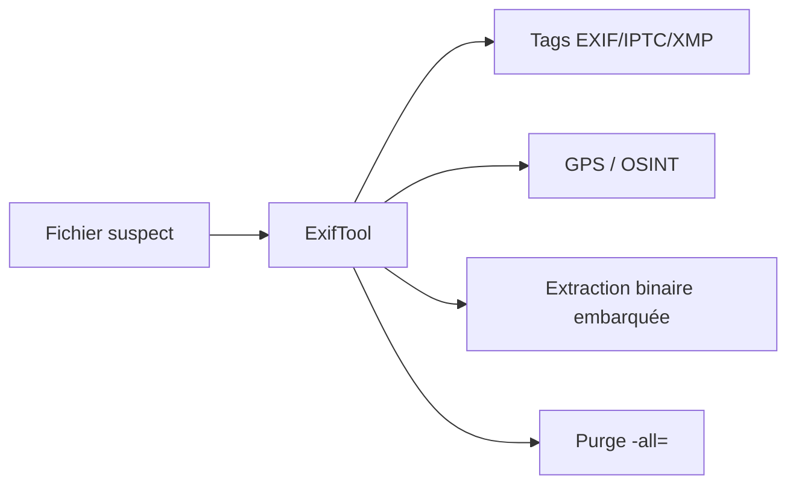

# ExifTool — L'arsenal des métadonnées de fichiers

> [!info] **En 1 phrase**
> Lire, écrire et manipuler les métadonnées (EXIF, IPTC, XMP...) de tout type de fichier : le flag se cache souvent dans un champ « Commentaire » oublié.

---

## Overview

| Champ | Valeur |
|---|---|
| Nom complet | ExifTool (Image::ExifTool) |
| Description | Lecture, écriture et manipulation des métadonnées de centaines de formats de fichiers (images, PDF, vidéo, audio, Office, ZIP...) |
| Catégorie | CTF & Développement |
| Sous-catégorie | Forensique / Stéganographie / OSINT |
| Fonction principale | Afficher, modifier, copier et supprimer les tags EXIF/IPTC/XMP/GPS de n'importe quel fichier |
| Type d'outil | CLI / bibliothèque Perl |
| Licence | Perl (Artistic License 1.0 ou GPL) |
| Open source / propriétaire | Open source |
| Langage(s) de programmation | Perl |
| Développeur / organisation | Phil Harvey (projet indépendant) |
| Projet officiel | exiftool |
| Dépôt officiel | https://github.com/exiftool/exiftool |
| Documentation officielle | https://exiftool.org/exiftool_pod.html |
| Dernière version connue | 13.59 (27 mai 2026) |
| Systèmes compatibles | Linux, macOS, Windows (binaire autonome ou module Perl) |

> [!note] À vérifier
> ExifTool est distribué soit en binaire autonome (Windows/macOS) depuis exiftool.org, soit en paquet (`libimage-exiftool-perl`, `perl-image-exiftool`). La numérotation « production » vs « release candidate » évolue rapidement : vérifier `exiftool -ver`.

---

## Concept

ExifTool est un outil en ligne de commande qui expose l'intégralité des métadonnées d'un fichier. Les formats concernés vont bien au-delà des images : PDF, MP4, DOCX, ZIP, audio, RAW... Chaque fichier embarque des tags regroupés en **familles** (EXIF, IPTC, XMP, GPS, Composite, etc.) que l'outil liste, lit, écrit ou supprime à volonté. En CTF, un « simple » challenge d'image ou de PDF cache souvent le flag dans un commentaire, un auteur, un titre ou des coordonnées GPS. En OSINT, les coordonnées GPS d'une photo permettent la géolocalisation. En défense, `-all=` purge les métadonnées avant publication d'un document sensible. C'est **le premier outil à lancer** sur n'importe quel fichier suspect.

Il se place à plusieurs moments d'un engagement : en **reconnaissance** (collecter les métadonnées de documents publiés), en **analyse de fichiers** (extraction d'aperçus embarqués, de chaînes), et en **anti-forensique** (réécriture/suppression de tags). Sa force est sa capacité de **réécriture fine** : ajouter un champ, modifier un horodatage, copier les tags d'un fichier vers un autre (`-tagsfromfile`), ou tout supprimer d'un coup (`-all=`). La sortie `-json` combinée à `-r` permet de construire un index de métadonnées sur un lot de fichiers.



---

## Concepts fondamentaux

| Concept | Explication |
|---|---|
| Tag | Champ de métadonnées identifié par un nom (ex. `Comment`, `Make`, `GPSLatitude`) |
| Famille / groupe | Catégorie de tags : EXIF, IPTC, XMP, GPS, JFIF, ICC, Composite... |
| EXIF | Format standard des images (caméra, date, GPS, réglages) |
| IPTC | Métadonnées journalistiques (titre, auteur, légende, mots-clés) |
| XMP | Standard extensible basé sur XML (Adobe), embarqué ou côté fichier |
| Composite | Tags **calculés** par ExifTool à partir des autres (ex. `GPSLatitude` lisible) |
| Shortcut | Raccourcis ExifTool comme `GPS:*` ou `All` pour désigner plusieurs tags |
| Sortie JSON/XML | Formats `-json`, `-X` (XML) pour parser les résultats en script |
| Écriture in-place | `-tag=value` modifie le fichier ; `-overwrite_original` limite les fichiers de sauvegarde |
| `-all=` | Supprime **toutes** les métadonnées du fichier |

---

## Installation

### Debian / Ubuntu / Kali Linux

```bash
sudo apt install libimage-exiftool-perl
```

### Arch Linux

```bash
sudo pacman -S perl-image-exiftool
```

### Fedora / RHEL

```bash
sudo dnf install perl-Image-ExifTool
```

### macOS (Homebrew)

```bash
brew install exiftool
```

### Windows

```powershell
# Binaire portable depuis https://exiftool.org ou via Chocolatey
choco install exiftool
```

### Depuis les sources (Perl)

```bash
# Module CPAN
cpan Image::ExifTool
# Ou depuis le dépôt
git clone https://github.com/exiftool/exiftool.git
cd exiftool && perl Makefile.PL && make && make test
```

> [!warning] Prérequis & problèmes potentiels
> - Le binaire Windows est un .exe autonome (aucun runtime requis) ; sous Linux/macOS, Perl est généralement préinstallé.
> - Les alias (ex. `exiftool` vs `exiftool.exe`) peuvent différer selon le shell Windows.

---

## Configuration

| Paramètre | Rôle | Valeur possible | Impact | Exemple |
|---|---|---|---|---|
| `-config` | Fichier de configuration Perl (définition de tags personnalisés) | Chemin vers `.ExifTool_config` | Ajoute des tags/formatages maison | `-config ./mon_config.config` |
| `$EXIFTOOL_HOME` | Dossier de la config par défaut | Chemin | Charge une config automatiquement | `export EXIFTOOL_HOME=/opt/exiftool` |
| `-charset` | Encodage des valeurs de sortie | `UTF8`, `Latin` | Évite les caractères cassés | `-charset UTF8` |
| `-ignore` | Ignorer certains tags | Noms de tags | Réduire le bruit | `-ignore Make -ignore Model` |
| `-ext` | Filtrer par extension (avec `-r`) | `.jpg`, `.pdf`... | Traitement ciblé de lots | `-r -ext jpg -ext png` |
| `-if` | Condition sur une valeur | Expression de tag | Traitement sélectif | `-if '$GPSLatitude'` |
| `-api` | Paramètres d'API Perl (ex. `QuickTimeUTC`) | Options de l'API | Ajuste le comportement | `-api QuickTimeUTC=1` |

> [!note] À vérifier
> La config Perl requiert un module compilé ; les paramètres `-api` dépendent de la version d'ExifTool installée (voir `exiftool -config` et la doc `exiftool_pod`).

---

## Architecture interne

- **Un seul script Perl** : ExifTool est un module Perl (`Image::ExifTool`) aussi distribué en exécutable autonome (packé avec `PAR`/`pp` pour Windows et macOS).
- **Traitement par familles** : l'outil analyse le fichier par blocs de format (headers JPEG/TIFF, tables EXIF, blobs IPTC/XMP) et mappe chaque valeur vers un tag nommé dans le bon groupe.
- **Familles de tags** : chaque tag appartient à des groupes (EXIF, IFD0, SubIFD, IPTC, XMP, Composite) ; la sortie `-g1` organise par groupe, `-a` liste les doublons, `-u` inclut les valeurs inconnues.
- **Composite** : des tags calculés (ex. `GPSLatitude` en degrés décimaux, `ImageSize`, `Orientation` lisible) dérivés des tags bruts — c'est ce qui rend la sortie « lisible par un humain ».
- **Écriture** : ExifTool réécrit les structures en préservant au maximum le reste du fichier ; `-overwrite_original` remplace la sauvegarde `.txt_original` par une simple mise à jour in-place.
- **Format de sortie** : sorties `-json`, `-X` (XML), `-csv`, `-s` (concise), `-t` (tabulaire), `-G` (avec groupes) selon les besoins d'ingestion.

---

## Commandes

### Commandes principales

```bash
# Afficher toutes les métadonnées
exiftool image.jpg

# Sortie JSON (recommandée pour le parsing)
exiftool -json image.jpg

# Chercher un flag
exiftool image.jpg | grep -i flag

# Afficher un champ précis
exiftool -Comment image.jpg
exiftool -Title -Author image.jpg

# Tous les champs bruts
exiftool -a -u -g1 image.jpg
```

| Commande | Objectif | Résultat attendu |
|---|---|---|
| `exiftool <fichier>` | Lister toutes les métadonnées | Tags triés par groupe |
| `exiftool -json <fichier>` | Sortie JSON parseable | Objet JSON par fichier |
| `exiftool -a -u -g1 <fichier>` | Champs bruts complets | Tags dupliqués/inconnus inclus |
| `exiftool -Comment=<val> <fichier>` | Écrire un tag | Fichier modifié (+ .txt_original) |
| `exiftool -all= <fichier>` | Supprimer toutes les métadonnées | Fichier nettoyé |
| `exiftool -tagsfromfile <src> -Comment <dst>` | Copier des tags | Tags recopiés |
| `exiftool -b -PreviewImage <fichier>` | Extraire l'aperçu embarqué | Binaire écrit dans un fichier |
| `exiftool -r -ext pdf <dossier>` | Parcourir récursivement | Métadonnées de tous les PDF |

---

## Options et flags

| Option | Description | Exemple | Niveau |
|---|---|---|---|
| `-a` | Tous les tags, même dupliqués | `-a` | Intermediate |
| `-u` | Inclure les valeurs inconnues/binaires | `-u` | Advanced |
| `-g1` | Regrouper par famille (EXIF, IPTC, XMP) | `-g1` | Intermediate |
| `-G` | Préfixer chaque ligne par le groupe | `-G1` | Advanced |
| `-json` | Sortie JSON | `-json` | Intermediate |
| `-X` | Sortie XML | `-X` | Advanced |
| `-csv` | Sortie CSV | `-csv` | Advanced |
| `-b` | Sortie binaire brute (extraction) | `-b -PreviewImage` | Advanced |
| `-n` | Valeurs numériques brutes (GPS, dates) | `-n -GPSLatitude` | Intermediate |
| `-d <fmt>` | Format des dates | `-d "%Y-%m-%d"` | Advanced |
| `-s` | Sortie concise (sans description) | `-s` | Basic |
| `-r` | Récursif sur les sous-dossiers | `-r` | Intermediate |
| `-ext <ext>` | Filtrer par extension | `-ext pdf -ext jpg` | Advanced |
| `-if <expr>` | Condition sur les valeurs | `-if '$ImageWidth > 1000'` | Expert |
| `-all=` | Supprimer tous les tags | `-all=` | Intermediate |
| `-overwrite_original` | Ne pas créer de fichier .txt_original | `-overwrite_original` | Advanced |
| `-charset` | Encodage (ex. `UTF8`) | `-charset UTF8` | Advanced |
| `-config` | Fichier de config Perl | `-config cfg` | Expert |

> [!tip] Options les plus utiles au quotidien
> `-json` (parsing), `-a -u -g1` (champs bruts), `-b` (extraction binaire), `-all=` (purge), `-n -GPS*` (OSINT), `-tagsfromfile` (copie).

---

## Exemples pratiques

### Beginner

```bash
# Objectif : flag dans un commentaire
exiftool image.png | grep -i flag
# Comment : flag{M3t4d0nne5}
```

```bash
# Objectif : flag dans un champ Author/Title
exiftool -Author -Title image.jpg
```

### Intermediate

```bash
# Objectif : aperçu embarqué qui cache le flag
exiftool -b -PreviewImage image.cr2 > preview.jpg
file preview.jpg
```

```bash
# Objectif : flags GPS d'une photo
exiftool -n -g1 -GPS* image.jpg
```

### Advanced

```bash
# Objectif : indexer toutes les métadonnées d'un dossier
exiftool -r -json -ext pdf -ext docx -ext jpg /chemin/lots > metadonnees.json
```

### Expert

```bash
# Objectif : copier les tags d'un fichier vers un autre
exiftool -tagsfromfile modele.jpg -Comment -Artist -UserComment dest.png
```

---

## Workflow complet (scénario pas à pas)

1. **Étape 1 — Lister les métadonnées du fichier suspect** :
   ```bash
   exiftool image.png
   ```
2. **Étape 2 — Chercher le flag dans les champs texte** :
   ```bash
   exiftool image.png | grep -iE "flag|comment|author|title"
   # Ex. : Comment : flag{M3t4d0nne5}
   ```
3. **Étape 3 — Si rien, sortir en JSON et inspecter les champs exotiques** :
   ```bash
   exiftool -a -u -g1 image.png
   exiftool -json image.png | jq
   ```
4. **Étape 4 — Extraire les binaires embarqués** (aperçu, icône) :
   ```bash
   exiftool -b -PreviewImage image.cr2 > preview.jpg
   ```
5. **Étape 5 — Analyser l'aperçu extrait** avec `zsteg`/`stegsolve` (couche stégo), puis documenter le flag et les indicateurs (Make, Model, GPS, horodatage) dans le rapport.

---

## Scénarios avancés

### Scénario 1 : flag dans les données GPS ou Make/Model

```bash
exiftool -n -g1 image.jpg | grep -iE "gps|lat|lon|model"
# Les coordonnées peuvent pointer vers un lieu (OSINT) ou contenir le flag
```

### Scénario 2 : nettoyer un fichier avant publication

```bash
exiftool -all= image.jpg                    # supprime tout
exiftool -Comment="Auteur légitime" -all= image.jpg
# Penser aussi aux thumbnails/aperçus embarqués (-PreviewImage=)
```

### Scénario 3 : extraction récursive d'un lot de documents

```bash
exiftool -r -json -ext pdf -ext docx -ext jpg /chemin/lots > metadonnees.json
# Agrège toutes les métadonnées en un seul JSON pour la revue.
```

### Scénario 4 : purge ciblée du GPS avant publication

```bash
exiftool -GPS:All= image.jpg          # supprime uniquement les tags GPS
exiftool -n -GPSLatitude image.jpg     # vérifie la suppression
```

---

## Cybersecurity use cases

| Phase | Utilisation |
|---|---|
| Reconnaissance / OSINT | Géolocaliser des photos (GPS), identifier l'appareil (Make/Model), trouver des noms (Author) |
| Analyse de fichiers | Chercher le flag dans les tags, extraire aperçus/thumbnails embarqués |
| Stéganographie | Combiner les champs EXIF/XMP avec les outils de stégo (zsteg, stegsolve) |
| Anti-forensique | Purger/modifier les métadonnées avant exfiltration |
| Défense / DLP | Nettoyer les métadonnées des documents avant publication |
| Forensique | Corréler horodatages, données GPS et historique de fichiers |
| CTF | Challenge stego/méta : le flag traîne souvent dans un tag oublié |

---

## MITRE ATT&CK

| Tactique | Technique / Sub-technique | ID | Raison | Détection | Mitigation |
|---|---|---|---|---|---|
| Collection | Data from Local System | T1005 | Lecture/collecte de métadonnées locales de fichiers sensibles | Monitoring des accès fichiers | Moindre privilège, DLP |
| Collection | Gather Victim Host Information | T1592 | Récupération d'informations sur la victime (appareil, position) | Supervision des logs d'outils | Sensibilisation, politique de métadonnées |
| Defense Evasion | Obfuscated Files or Information | T1027 | Dissimulation de données dans les tags/aperçus embarqués | Analyse statique des fichiers | Nettoyage des métadonnées avant publication |
| Defense Evasion | Indicator Removal : File Deletion | T1070.004 | Suppression des métadonnées/aperçus pour cacher les traces | Contrôle d'intégrité, audit | Sauvegardes, WORM |

> [!note] Ne renseigner que si l'association est réellement pertinente.
> ExifTool est surtout un outil de **lecture/écriture de métadonnées** : en attaque il alimente la collecte (T1005/T1592) et peut servir à dissimuler (T1027) ou à nettoyer (T1070.004) ; en défense il sert à la purge pré-publication.

---

## Defensive Security

### Signes observables

| Indicateur | Détail |
|---|---|
| `exiftool` appelé sur des documents sensibles | Collecte de métadonnées |
| Scripts utilisant `-all=` sur des fichiers | Nettoyage (légitime) ou destruction de preuves |
| Fichiers publiés avec EXIF GPS/Author | Fuite d'informations involontaire |
| Aperçus embarqués non supprimés | Reste de données (RAW/CR2, thumbnails) |

### Règles de détection (Sigma / Suricata / Snort / YARA)

```yaml
# Sigma — exécution d'exiftool sur un endpoint (collecte de métadonnées)
title: ExifTool Metadata Extraction
id: a1b2c3d4-e5f6-4a7b-8c9d-0e1f2a3b4c5d
status: experimental
logsource:
    category: process_creation
    product: linux
detection:
    selection:
        Image|endswith: '/exiftool'
        CommandLine|contains: '-json'
    condition: selection
falsepositives:
    - Legitimate administration and DLP scripts
level: low
```

```yaml
# YARA — repérer un champ EXIF contenant un mot-clé suspect
rule exif_flag_hunt
{
    meta:
        description = "Flag-like content in EXIF comments"
    strings:
        $a = { 66 6c 61 67 7b }  # flag{
    condition:
        $a
}
```

> [!note] À vérifier
> Règles pédagogiques à adapter à votre environnement ; les motifs simples génèrent des faux positifs.

---

## Automatisation

```bash
# Bash — indexer récursivement un dossier puis agréger
exiftool -r -json -ext jpg /photos > /tmp/index.json
jq -r '.[] | "\(.SourceFile) \(.DateTimeOriginal) \(.GPSLatitude)"' /tmp/index.json
```

```python
# Python — extraire les GPS d'un lot de photos (API Perl via subprocess)
import subprocess, json

def gps(fichier):
    out = subprocess.run(
        ["exiftool", "-json", "-n", "-gpslatitude", "-gpslongitude", fichier],
        capture_output=True, text=True).stdout
    return json.loads(out)[0]

for f in ["a.jpg", "b.jpg"]:
    print(f, gps(f))
```

---

## Output et parsing

```bash
# JSON : un objet par fichier, idéal pour jq
exiftool -json -g1 image.jpg | jq '.[0] | {SourceFile, Model, GPSLatitude, Comment}'
```

```bash
# CSV pour tableur / SIEM
exiftool -csv -r -ext pdf /docs > metadonnees.csv
```

```python
# Python — parser la sortie JSON
import subprocess, json
data = json.loads(subprocess.check_output(["exiftool","-json","image.jpg"]))[0]
print(data.get("Comment", data.get("Author", "no flag")))
```

---

## Intégrations

```text
Fichier suspect → exiftool (métadonnées) → zsteg / stegsolve (stégo de l'extrait)
→ binwalk (blobs) → CyberChef (décodage) → rapport
```

- [[Tools| Outils]]
- [[Outil - zsteg]] — analyse stégo de l'image après lecture des tags
- [[Outil - stegsolve]] — exploration visuelle des plans de bits
- [[Outil - binwalk]] — extraction des fichiers embarqués
- [[Outil - CyberChef]] — décodage des valeurs extraites
- [[Outil - Ghidra]] — analyse du binaire si le fichier en cache un
- [[10 - Cheatsheets| Cheatsheets]]

---

## Alternatives

| Outil | Avantages | Inconvénients | Cas d'usage |
|---|---|---|---|
| `strings` / `grep` | Simple, rapide | Ne lit pas les structures EXIF/XMP | Recherche rapide de flag |
| `identify -verbose` (ImageMagick) | Sortie riche sur images | Images seulement | Vérification croisée |
| `mediainfo` | Excellent pour vidéo/audio | Pas d'écriture | Médias |
| `xxd` / `binwalk` | Analyse brute des octets | Pas de sémantique des tags | Structures embarquées |
| Python `PIL`/`piexif` | Contrôle programmatique | Code à écrire | Pipelines |
| ExifTool `-tagsfromfile` | Copie massive de tags | Propriétaire ExifTool | Migration de tags |

> **Quand utiliser Python plutôt qu'ExifTool ?** Pour un traitement programmatique complexe avec logique conditionnelle et réutilisable ; ExifTool reste imbattable pour l'exploration interactive et la sortie normalisée.

---

## Performance

- **Volume** : `-r` parcourt des dossiers entiers efficacement (milliers de fichiers en quelques secondes sur disque local).
- **Sortie** : `-json` et `-csv` restent légères même sur de gros lots ; `-a -u -g1` génère beaucoup plus de lignes.
- **Écriture** : chaque modification crée un fichier `.txt_original` (doublon disque) sauf `-overwrite_original`.
- **Extraction binaire** : `-b` écrit les aperçus sans charge mémoire excessive (streaming).
- **Limites** : le traitement des très gros fichiers (centaines de Mo) est mémoire-mappé ; les RAW de plusieurs dizaines de Mo restent rapides.

> [!note] À vérifier
> Les temps de traitement dépendent du nombre de tags et du support (SSD vs réseau).

---

## Troubleshooting

### Common problems

#### Problème : sortie illisible (caractères cassés)

- **Cause** : encodage par défaut non UTF-8.
- **Solution** : `-charset UTF8`. **Vérif** : réafficher le tag `Comment`.

#### Problème : GPS affiché en degrés sexagésimaux

- **Cause** : conversion lisible par défaut.
- **Solution** : `-n` pour les valeurs brutes. **Vérif** : `exiftool -n -GPSLatitude image.jpg`.

#### Problème : `-all=` crée un `.txt_original` volumineux

- **Cause** : sauvegarde par défaut.
- **Solution** : `-overwrite_original`. **Vérif** : pas de fichier de sauvegarde dans le dossier.

#### Problème : l'aperçu extrait est vide ou absent

- **Cause** : tag différent (`ThumbnailImage`, `JpgFromRaw`) ou pas d'aperçu.
- **Solution** : lister avec `-a -u -g1` puis extraire le bon tag. **Vérif** : `file preview.jpg`.

---

## Sécurité de l'outil

- **Confidentialité** : ExifTool n'effectue aucun appel réseau ; tout est local.
- **Exécution de fichiers** : l'analyse de fichiers malveillants peut déclencher des comportements de parsers buggés — exécuter de préférence dans une VM/sandbox.
- **Écriture** : `-all=` et `-overwrite_original` modifient les fichiers en place : toujours travailler sur une **copie** de l'original en analyse forensique.
- **Mises à jour** : les parsers de formats exotiques sont régulièrement corrigés ; garder la version à jour.
- **Config Perl** : un fichier de configuration malveillant exécute du code Perl — ne charger que des configs fiables.

---

## Limitations

- **Pas un outil de stéganographie** : il lit/écrit des tags standards, pas des données cachées arbitraires (voir [[Outil - zsteg]], [[Outil - stegsolve]]).
- **Formats limités** : certains formats propriétaires (Office OOXML imbriqué, certains RAW) ne sont que partiellement couverts.
- **Écriture destructive** : `-all=` efface tout sans récupération facile (sauvegarde `.txt_original` seulement).
- **Performances sur lots géants** : l'écriture en masse est séquentielle.
- **Config Perl** : la personnalisation avancée (tags maison) demande des compétences Perl.

---

## Cheatsheet

```bash
# Lire toutes les métadonnées
exiftool image.jpg
# JSON
exiftool -json image.jpg
# Chercher un flag
exiftool image.jpg | grep -i flag
# Champs bruts complets
exiftool -a -u -g1 image.jpg
# Champ précis
exiftool -Comment image.jpg
# Écrire / supprimer
exiftool -Comment="flag{test}" image.jpg
exiftool -all= image.jpg
# GPS
exiftool -n -GPSLatitude -GPSLongitude image.jpg
# Extraction binaire
exiftool -b -PreviewImage image.jpg > preview.jpg
# Récursif + filtre
exiftool -r -ext jpg /dossier
# Copie de tags
exiftool -tagsfromfile src.jpg -Comment dst.jpg
```

---

## Quick reference

| | |
|---|---|
| **À quoi sert-il ?** | Lire/écrire/supprimer les métadonnées de tout fichier |
| **Quand l'utiliser ?** | Première étape sur tout fichier suspect (image, PDF, média) |
| **Commande principale** | `exiftool fichier` puis `| grep -i flag` |
| **Alternative principale** | `strings`, ImageMagick `identify`, `mediainfo` |
| **Concepts importants** | Tag, groupe (EXIF/IPTC/XMP), `-all=`, `-json`, GPS |
| **Liens associés** | [[Outil - zsteg]] · [[Outil - stegsolve]] · [[Outil - binwalk]] |

---

## Détection & Défense

| Signe | Défense |
|---|---|
| Champ `Comment`, `Title`, `Author` rempli | Nettoyer avant publication (`exiftool -all=`) |
| GPS ou horodatage dans les photos publiées | Désactiver le géotagging, purger le GPS |
| Aperçus/thumbnails embarqués dans les RAW | Supprimer `-PreviewImage=` avant diffusion |
| Doublons non standards dans EXIF brut | Inspecter avec `-a -u` et valider la légitimité |
| Documents internes avec `Company`, `Author` | DLP : scruter les métadonnées en sortie |

---

## Tips & Pièges

> [!tip] **Tips**
> - Utilisez `-json` pour du texte facile à lire et à grepper sans bruit.
> - Le flag peut être caché dans les **octets bruts** de la valeur (`-b`), pas seulement affiché en clair.
> - Pensez à `grep -i flag` sur PDF/MP4/script : ExifTool fonctionne sur bien plus que les images.
> - `-s` donne une sortie compacte, parfaite pour les terminaux étroits ou les scripts.
> - `-tagsfromfile` permet de recopier massivement des tags d'un modèle vers des fichiers.

> [!warning] **Pièges**
> - Un champ vide en sortie standard peut contenir des données avec `-u` (valeurs inconnues) : ne négligez pas.
> - `-all=` écrase les métadonnées : faites toujours une copie avant d'écrire.
> - Les fichiers avec EXIF modifié peuvent se corrompre (XMP mal réécrit) : validez avec `file` et un visualiseur.
> - Ne pas confondre le tag de sortie (ex. `GPSLatitude`) et sa version brute `-n` (degrés décimaux vs DMS).

---

## References

### Official

- Site officiel : https://exiftool.org
- Dépôt GitHub : https://github.com/exiftool/exiftool
- Documentation (pod) : https://exiftool.org/exiftool_pod.html
- Liste des changements (versions) : https://exiftool.org/history.html
- FAQ / support : https://exiftool.org/forum/

### Security references

- MITRE ATT&CK T1005 — Data from Local System : https://attack.mitre.org/techniques/T1005/
- MITRE ATT&CK T1592 — Gather Victim Host Information : https://attack.mitre.org/techniques/T1592/
- MITRE ATT&CK T1027 — Obfuscated Files or Information : https://attack.mitre.org/techniques/T1027/
- MITRE ATT&CK T1070.004 — File Deletion : https://attack.mitre.org/techniques/T1070/004/

### Community

- HackTricks — stéganographie : https://book.hacktricks.xyz/crypto-and-stego
- ExifTool Tips (Phil Harvey) : https://exiftool.org/Tips.html

---

**Liens :** [[Tools| Outils]] · [[Outil - zsteg| zsteg]] · [[Outil - stegsolve| StegSolve]] · [[Outil - binwalk| binwalk]] · [[Outil - CyberChef| CyberChef]] · [[Outil - Ghidra| Ghidra]] · [[Outil - hashcat| hashcat]] · [[Outil - John the Ripper| John the Ripper]]
