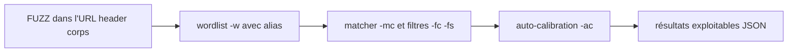

# ffuf — Fuzzer web ultra-rapide (Fuzz Faster U Fool)

> [!info] **En 1 phrase**
> ffuf est un fuzzer web ultra-rapide en Go, basé sur le mot-clé `FUZZ`, pour découvrir répertoires, paramètres, vhosts et valeurs cachées.

---

## Overview

| Champ | Valeur |
|---|---|
| Nom complet | ffuf — Fuzz Faster U Fool |
| Description | Fuzzer HTTP générique en Go : remplace un mot-clé `FUZZ` dans l'URL, les headers ou le corps de la requête par chaque entrée d'une wordlist |
| Catégorie | Scan Web & Fuzzing |
| Sous-catégorie | Fuzzing web (découverte de contenu, paramètres, vhosts, valeurs) |
| Fonction principale | Fuzzer n'importe quelle partie d'une requête HTTP avec des wordlists |
| Type d'outil | CLI (binaire Go autonome) |
| Licence | MIT |
| Open source / propriétaire | Open source |
| Langage(s) de programmation | Go |
| Développeur / organisation | Équipe ffuf (repo `ffuf/ffuf`, sponsorisé par Offensive Security) |
| Projet officiel | https://github.com/ffuf/ffuf |
| Dépôt officiel | https://github.com/ffuf/ffuf |
| Documentation officielle | https://github.com/ffuf/ffuf/wiki |
| Date de création | 2019 |
| État du projet | actif (releases régulières) |
| Dernière version connue | 2.2.1 (13 juillet 2026) |
| Systèmes compatibles | Linux / Windows / macOS / FreeBSD (binaires précompilés ; Go 1.20+ pour la compilation) |

> [!note] Pour vérifier / compléter
> Depuis ffuf **v2.1.0**, le matcher par défaut (`-mc`) couvre les 2xx sous forme de plage : `200-299,301,302,307,401,403,405,500` — les 404 sont donc exclus par défaut. Vérifier la version installée (`ffuf -V`) car les défauts et options ont évolué.

---

## Concept

ffuf (Fuzz Faster U Fool) est l'un des fuzzers web les plus rapides grâce à son implémentation en Go et son moteur de multiplexage. Il s'appuie sur un mot-clé `FUZZ` placé n'importe où dans l'URL, un en-tête ou le corps de la requête, remplacé par chaque mot de la wordlist.

Il remplace avantageusement gobuster pour le fuzzing fin : découverte de paramètres (`/admin.php?FUZZ=1`), de valeurs, d'hôtes virtuels (via l'en-tête `Host`) ou d'extensions. Les filtres de statut (`-mc`/`-fc`) et de taille (`-fs`) permettent de ne garder que les réponses réellement différentes de la baseline. Il se place dans la phase de **fuzzing ciblé** du pentest web : après la découverte de contenu, on fuzz les paramètres cachés, les valeurs d'un login ou les vhosts d'un serveur partagé.

Le multi-wordlists (plusieurs `-w` avec des alias distincts) permet des attaques de type login/password en produit cartésien, et la sortie structurée (`-of json`) s'intègre à Burp Suite ou aux rapports automatisés. ffuf supporte aussi le fuzzing du corps HTTP (`-d`), des méthodes (`-X`), des en-têtes, l'ajout d'extensions (`-e`), l'**auto-calibration** (`-ac`) qui apprend les réponses wildcard, un **mode interactif**, et depuis v2.2.x la **journalisation d'audit** et la protection contre les **gzip bombs** — ce qui en fait un fuzzer générique bien au-delà de la simple découverte de répertoires.



---

## Concepts fondamentaux

| Concept | Explication |
|---|---|
| Mot-clé `FUZZ` | Marqueur remplacé par chaque entrée de wordlist ; on peut le placer n'importe où (chemin, query, header, corps) |
| Alias de wordlist | `-w fichier:ALIAS` nomme une wordlist pour l'utiliser dans plusieurs positions ou pour le cartésien |
| Matcher vs Filter | Le matcher (`-mc`, `-ms`...) définit ce qui est **gardé** ; le filtre (`-fc`, `-fs`...) définit ce qui est **exclu** |
| Baseline / wildcard | Réponse « fourre-tout » (même taille pour tous les chemins) : la filtrer avec `-fs` ou `-ac` pour éviter les faux positifs |
| Auto-calibration | `-ac` envoie des requêtes aléatoires pour apprendre les patterns wildcard et les exclure automatiquement |
| Produit cartésien | Avec plusieurs wordlists (`-w users.txt:U -w pass.txt:P`), ffuf teste toutes les combinaisons |
| Vhost fuzzing | Fuzzer l'en-tête `Host` (`-H "Host: FUZZ.cible.local"`) pour découvrir des hôtes virtuels |
| Interactive mode | Pendant un scan, console interactive pour ajuster les filtres à chaud |
| FFUFHASH | Identifiant de scan ; `-search FFUFHASH` retrouve un scan dans l'historique local |
| Config file | Fichiers de configuration TOML pour réutiliser des options (`-config`) |

---

## Installation

### Debian / Ubuntu / Kali Linux

```bash
sudo apt update && sudo apt install -y ffuf

# ou binaire précompilé (toujours dernière version)
wget https://github.com/ffuf/ffuf/releases/latest/download/ffuf_2.2.1_linux_amd64.tar.gz
tar xzf ffuf_2.2.1_linux_amd64.tar.gz && sudo mv ffuf /usr/local/bin/
```

### Arch Linux

```bash
# AUR (non officiel) ou via Go
# yay -S ffuf
go install github.com/ffuf/ffuf/v2@latest
```

### Fedora / RHEL

```bash
# binaires des releases GitHub ou via Go
go install github.com/ffuf/ffuf/v2@latest
```

### macOS

```bash
brew install ffuf
```

### Windows

```powershell
winget install ffuf.ffuf

# ou via Scoop
scoop install ffuf

# ou binaire des releases GitHub (ffuf_2.2.1_windows_amd64.zip)
```

### Docker

```bash
# Pas d'image officielle à jour garantie : privilégier le binaire.
# Exemple communautaire (à vérifier) :
# docker run -it --rm -v $(pwd):/data ffuf/ffuf:latest
```

### Compilation depuis les sources

```bash
# Go 1.20+ requis
go install github.com/ffuf/ffuf/v2@latest   # la même commande sert de mise à jour

# ou build manuel
git clone https://github.com/ffuf/ffuf ; cd ffuf ; go build
```

> [!warning] Prérequis & problèmes potentiels
> - **Go 1.20+** requis pour compiler depuis les sources ; préférer les binaires précompilés signés (vérifier les checksums dans `_checksums.txt`).
> - Un build local affiche `git-<date>-<commit>` au lieu d'un tag : seuls les binaires des releases sont des versions officielles.
> - Sur Kali, le paquet `ffuf` peut être plus ancien que la dernière release GitHub.

---

## Configuration

| Paramètre | Rôle | Valeur possible | Impact | Exemple |
|---|---|---|---|---|
| `-w <wordlist>` | Wordlist(s) de fuzzing | `fichier`, `fichier:ALIAS` | Définit les valeurs injectées | `-w params.txt:PARAM` |
| `-u <url>` | URL cible avec mot-clé | URL contenant `FUZZ` | Cible et position d'injection | `-u http://10.10.10.10/FUZZ` |
| `-H <header>` | En-têtes personnalisés | `Nom: Valeur` (répétable) | Auth, Host, cookies | `-H "Host: FUZZ.cible.local"` |
| `-X <method>` | Méthode HTTP | GET, POST, PUT... | Fuzzing de méthodes | `-X POST` |
| `-d <data>` | Corps de la requête | corps avec `FUZZ` | Fuzzing des corps | `-d "user=admin&pass=FUZZ"` |
| `-mc / -fc` | Matcher / filtrer statuts | codes ou plages | Sélection des réponses | `-mc 200,301,403` |
| `-ms / -fs` | Matcher / filtrer tailles | tailles ou plages | Élimine les wildcards | `-fs 1234` |
| `-ac` | Auto-calibration | On/Off | Apprend et exclut les wildcards | `-ac` |
| `-t <n>` | Threads (défaut 40) | nombre | Vitesse vs charge | `-t 60` |
| `-rate <n>` | Requêtes/seconde | nombre (0 = illimité) | Discrétion | `-rate 50` |
| `-p <s>` | Délai entre requêtes | `0.1` ou plage `0.1-2.0` | Discrétion | `-p 0.5` |
| `-x <url>` | Proxy | `http://127.0.0.1:8080`, `socks5://...` | Relai/inspection | `-x http://127.0.0.1:8080` |
| `-config <f>` | Fichier de configuration | TOML | Réutiliser des options | `-config audit.toml` |
| `-o <f>` + `-of <fmt>` | Fichier + format de sortie | json, ejson, html, md, csv | Intégration rapport | `-of json -o out.json` |

> [!note] À vérifier
> Certaines options récentes (journalisation d'audit, stratégies d'auto-calibration étendues, `-raw`, scrapers) varient selon la version installée : consulter `ffuf -h` sur la version exacte.

---

## Architecture interne

- **Cœur Go asynchrone** : ffuf multiplexe les requêtes HTTP sur de nombreuses connexions concurrentes (threads `-t`, défaut 40), ce qui lui donne sa vitesse.
- **Moteur de templates** : chaque `-w` avec alias définit un « slot » de fuzz (`FUZZ`, `ALIAS`...) ; l'URL/requête est rendue en remplaçant les mots-clés, avec un mode par défaut en produit cartésien quand plusieurs wordlists sont actives.
- **Matcher/filter pipeline** : chaque réponse est évaluée contre les matchers (statuts, tailles, lignes, mots, regex, temps de réponse `-mt`) puis les filters ; l'opérateur `-mmode`/`-fmode` (and/or) combine les règles.
- **Auto-calibration** : `-ac` envoie des requêtes aléatoires (payloads) pour construire un profil de réponses wildcard, filtré automatiquement — utile face aux SPA et pages d'erreur custom.
- **Scrapers & mutators** : depuis les versions récentes, ffuf peut extraire de nouveaux endpoints des réponses (scrapers) et appliquer des mutations externes (external mutator).
- **Historique** : chaque scan est enregistré avec un **FFUFHASH** ; `-search <hash>` retrouve et rejoue un scan.
- **Réseau** : proxy HTTP/HTTPS/SOCKS5 (`-x`), cookies (`-b`), requêtes brutes (`-raw`), suivi de redirections (`-r`), mode verbeux (`-v`), arrêt sur erreurs (`-se`, `-sa`).
- **Protections** : depuis v2.2.0, bornage de la taille des corps décompressés (anti-gzip-bomb) et journalisation d'audit.

Flux type : wordlist(s) → moteur de templates → requêtes HTTP multiplexées → matcher/filter → auto-calibration → sortie console + fichier JSON.

---

## Commandes

### Commandes principales

```bash
# Découverte de répertoires
ffuf -w /usr/share/seclists/Discovery/Web-Content/directory-list-2.3-medium.txt:FUZZ -u http://cible.local/FUZZ -mc 200,301,401,403 -c

# Découverte de vhosts
ffuf -w /usr/share/seclists/Discovery/DNS/subdomains-top1million-5000.txt:Host -u http://10.10.10.10 -H "Host: FUZZ.cible.local" -fs 1234

# Fuzzing d'un paramètre caché
ffuf -w params.txt:FUZZ -u http://10.10.10.10/page.php?FUZZ=1 -fc 404
```

| Commande | Objectif | Résultat attendu |
|---|---|---|
| `ffuf -w wl:FUZZ -u http://x/FUZZ` | Découverte de répertoires | Chemins existants listés |
| `ffuf -w wl:Host -u http://x -H "Host: FUZZ.domain"` | Fuzzing de vhosts | Hôtes virtuels révélés |
| `ffuf -w wl:FUZZ -u http://x/page?FUZZ=1` | Paramètres cachés | Paramètres acceptés |
| `ffuf -w wl:FUZZ -u http://x/login -d "user=admin&pass=FUZZ"` | Fuzzing de valeurs | Valeurs pertinentes |
| `ffuf -w wl:FUZZ -u http://x/FUZZ -of json -o out.json` | Sortie structurée | Fichier JSON exploitable |

### Commandes avancées

```bash
# Bruteforce login en produit cartésien (deux wordlists)
ffuf -w users.txt:U -w passwords.txt:P \
  -u http://10.10.10.10/login.php -X POST \
  -d "user=U&pass=P&submit=1" -H "Content-Type: application/x-www-form-urlencoded" \
  -fc 401 -fs <taille-echec>

# Auto-calibration contre une SPA / page wildcard
ffuf -w wordlist:FUZZ -u http://10.10.10.10/FUZZ -ac -mc 200,301,403

# Mode interactif pendant le scan : ajuster les filtres à chaud
# (console interactive : taper "help" pour les commandes disponibles)

# Rejouer un scan depuis l'historique (FFUFHASH)
ffuf -search <FFUFHASH>
```

---

## Options et flags

| Option | Description | Exemple | Niveau |
|---|---|---|---|
| `-w <wordlist>` | Wordlist(s) avec alias | `-w wl.txt:FUZZ` | Basic |
| `-u <url>` | URL cible | `-u http://x/FUZZ` | Basic |
| `-mc <codes>` | Matcher statuts (défaut 2xx+...) | `-mc 200,301` | Basic |
| `-fc <codes>` | Filtrer statuts | `-fc 404` | Basic |
| `-fs <tailles>` | Filtrer tailles | `-fs 1234` | Basic |
| `-c` | Sortie colorée | `-c` | Basic |
| `-t <n>` | Threads (défaut 40) | `-t 60` | Basic |
| `-H <header>` | En-tête custom | `-H "Host: FUZZ.x"` | Intermediate |
| `-X <method>` | Méthode HTTP | `-X POST` | Intermediate |
| `-d <data>` | Corps de requête | `-d "a=1&b=FUZZ"` | Intermediate |
| `-e <exts>` | Extensions ajoutées | `-e .php,.bak` | Intermediate |
| `-r` | Suivre les redirections | `-r` | Intermediate |
| `-x <url>` | Proxy | `-x http://127.0.0.1:8080` | Intermediate |
| `-of <fmt>` | Format de sortie | `-of json` | Intermediate |
| `-o <f>` | Fichier de sortie | `-o out.json` | Intermediate |
| `-ac` | Auto-calibration | `-ac` | Intermediate |
| `-rate <n>` | Limite de débit | `-rate 50` | Intermediate |
| `-p <s>` | Délai entre requêtes | `-p 0.5` | Intermediate |
| `-fw / -fl / -fr` | Filtrer mots / lignes / regex | `-fr "Page not found"` | Advanced |
| `-mt / -ft` | Matcher/filtrer temps de réponse | `-mt >500` | Advanced |
| `-v` | Mode verbeux (URL + redirect) | `-v` | Advanced |
| `-se / -sa` | Arrêt sur erreurs | `-sa` | Advanced |
| `-config <f>` | Fichier de config TOML | `-config t.toml` | Advanced |
| `-search <hash>` | Rejouer un scan historique | `-search FFUFHASH` | Expert |
| `-raw` | Requête brute | `-raw` | Expert |
| `-scrapers` | Extraction de nouveaux endpoints | `-scrapers all` | Expert |

> [!tip] Options les plus utiles au quotidien
> `-ac` (auto-calibration) pour éliminer les wildcards sans calibrer à la main, `-mc 200,301,403` pour ne garder que l'essentiel, `-of json -o out.json` pour la trace, et `-rate`/`-p` pour rester discret.

---

## Exemples pratiques

### Beginner

```bash
# Objectif : premier scan de répertoires
ffuf -w /usr/share/seclists/Discovery/Web-Content/directory-list-2.3-medium.txt:FUZZ \
  -u http://10.10.10.10/FUZZ -mc 200,301,403 -c

# Objectif : fuzzer un paramètre caché
ffuf -w params.txt:FUZZ -u http://10.10.10.10/page.php?FUZZ=1 -fc 404
# Résultat attendu : paramètres acceptés (réponse différente de la baseline)
```

### Intermediate

```bash
# Objectif : fuzzing de vhosts sur un serveur partagé
ffuf -w /usr/share/seclists/Discovery/DNS/subdomains-top1million-5000.txt:Host \
  -u http://10.10.10.10 -H "Host: FUZZ.cible.local" -fc 403,404 -fs <taille-default> -t 60
# -fs élimine la page par défaut ; les vhosts trouvés sont autant de surfaces d'attaque.

# Objectif : fuzzing de valeurs sur un login
ffuf -w values.txt:FUZZ -u http://10.10.10.10/login.php?user=admin&pass=FUZZ -fc 200
```

### Advanced

```bash
# Objectif : bruteforce login en produit cartésien (deux wordlists)
ffuf -w users.txt:U -w passwords.txt:P \
  -u http://10.10.10.10/login.php -X POST \
  -d "user=U&pass=P&submit=1" -H "Content-Type: application/x-www-form-urlencoded" \
  -fc 401 -fs <taille-echec>
# Le mode multi-wordlists teste chaque combinaison (produit cartésien).

# Objectif : fuzzing d'extensions de fichiers
ffuf -w /usr/share/seclists/Discovery/Web-Content/raft-small-words.txt:FUZZ -e .php,.bak,.txt \
  -u http://10.10.10.10/FUZZFUZZ -mc 200,301 -fs 0
# -e ajoute les extensions ; le mot-clé doublé est un pattern classique (nom + extension).

# Objectif : fuzzing de méthodes HTTP sur un endpoint API
ffuf -w /usr/share/seclists/Miscellaneous/methods.txt:M -u http://10.10.10.10/api/users \
  -X M -fc 405 -fs <taille-baseline>
# Teste chaque méthode (GET, POST, PUT...) ; toute méthode non 405 est candidate.
```

### Expert

```bash
# Objectif : auto-calibration contre une page wildcard (SPA/erreur custom)
ffuf -w wordlist:FUZZ -u http://10.10.10.10/FUZZ -ac -mc 200,301,403

# Objectif : exploitation des résultats JSON avec jq
ffuf -w wordlist:FUZZ -u http://10.10.10.10/FUZZ -mc 200 -of json -o results.json
jq -r '.results[] | select(.status == 200) | .url' results.json | sort -u

# Objectif : rejouer un scan historique
ffuf -search <FFUFHASH>
```

---

## Workflow complet (scénario pas à pas)

1. **Établir une baseline** — requêter `http://10.10.10.10/FUZZ` avec une petite wordlist et noter la taille des réponses 404.
   ```bash
   curl -s http://10.10.10.10/does-not-exist | wc -c   # taille 404 de référence
   ```
2. **Lancer la découverte de répertoires** :
   ```bash
   ffuf -w wordlist:FUZZ -u http://10.10.10.10/FUZZ -mc 200,301,403 -fs <taille404> -c
   ```
3. **Chercher des vhosts** en filtrant la taille de la baseline :
   ```bash
   ffuf -w dns-list:Host -u http://10.10.10.10 -H "Host: FUZZ.cible.local" -fs <taille> -c
   ```
4. **Fuzzer un paramètre caché** :
   ```bash
   ffuf -w params.txt:FUZZ -u http://10.10.10.10/page.php?FUZZ=1 -fc 404
   ```
5. **Fuzzer un paramètre avec des valeurs** :
   ```bash
   ffuf -w values.txt:FUZZ -u http://10.10.10.10/login.php?user=admin&pass=FUZZ -fc 200
   ```
6. **Enregistrer les résultats JSON** avec `-o out.json`, puis les intégrer au rapport d'engagement.

---

## Scénarios avancés

### Scénario 1 : fuzzing de vhosts sur un serveur partagé

```bash
ffuf -w /usr/share/seclists/Discovery/DNS/subdomains-top1million-5000.txt:Host \
  -u http://10.10.10.10 -H "Host: FUZZ.cible.local" -fc 403,404 -fs <taille-default> -t 60
# -fs élimine la page par défaut ; les vhosts trouvés sont autant de surfaces d'attaque.
```

### Scénario 2 : bruteforce de valeur avec deux wordlists (produit cartésien)

```bash
ffuf -w users.txt:U -w passwords.txt:P \
  -u http://10.10.10.10/login.php -X POST \
  -d "user=U&pass=P&submit=1" -H "Content-Type: application/x-www-form-urlencoded" \
  -fc 401 -fs <taille-echec>
# Le mode multi-wordlists teste chaque combinaison (produit cartésien).
```

### Scénario 3 : fuzzing d'extensions de fichiers

```bash
ffuf -w /usr/share/seclists/Discovery/Web-Content/raft-small-words.txt:FUZZ -e .php,.bak,.txt \
  -u http://10.10.10.10/FUZZFUZZ -mc 200,301 -fs 0
# -e ajoute les extensions ; le mot-clé doublé est un pattern classique (nom + extension).
```

### Scénario 4 : fuzzing de méthodes HTTP sur un endpoint API

```bash
ffuf -w /usr/share/seclists/Miscellaneous/methods.txt:M -u http://10.10.10.10/api/users \
  -X M -fc 405 -fs <taille-baseline>
# Teste chaque méthode (GET, POST, PUT...) ; toute méthode non 405 est candidate.
```

### Scénario 5 : exploitation des résultats JSON avec jq

```bash
ffuf -w wordlist:FUZZ -u http://10.10.10.10/FUZZ -mc 200 -of json -o results.json
jq -r '.results[] | select(.status == 200) | .url' results.json | sort -u
# Post-traitement automatisé pour injecter les URLs dans le rapport ou un outil externe.
```

---

## Cybersecurity use cases

| Phase | Utilisation |
|---|---|
| Reconnaissance | Découverte de répertoires, fichiers et endpoints cachés |
| Énumération | Fuzzing de paramètres cachés, de valeurs, de vhosts, de méthodes |
| Vulnérabilité | Recherche de paramètres sensibles, d'endpoints non protégés |
| Exploitation | Bruteforce ciblé (login, OTP, IDs) via produit cartésien |
| Post-exploitation | Fuzzing de chemins locaux après accès (via requêtes forwardées) |
| Rapport | Sortie JSON/CSV structurée pour intégration aux rapports |

---

## MITRE ATT&CK

| Tactique | Technique / Sub-technique | ID | Raison | Détection | Mitigation |
|---|---|---|---|---|---|
| Reconnaissance | Active Scanning : Wordlist Scanning | T1595.003 | Fuzzing de chemins/vhosts avec wordlists | Burst de requêtes sur chemins inconnus | Rate limiting, WAF, CAPTCHA |
| Discovery | Application Layer Protocol : Web Protocols | T1071.001 | Communication HTTP structurée de fuzzing | Corrélation SIEM des patterns | — |
| Credential Access | Brute Force | T1110 | Bruteforce login en produit cartésien | Échecs de connexion massifs | Verrouillage, MFA, rate limiting |
| Initial Access | Exploit Public-Facing Application | T1190 | Découverte d'endpoints vulnérables via fuzzing | Alertes sur patterns d'exploitation | Patching, validation d'entrée |

> [!note] Ne renseigner que si l'association est réellement pertinente.
> L'association la plus spécifique est **T1595.003** (Wordlist Scanning). T1110 ne s'applique qu'aux fuzzings d'authentification.

---

## Defensive Security

### Signes observables

| Indicateur | Détail |
|---|---|
| Pic massif de requêtes avec patterns identiques et mots inconnus | Journaliser les logs HTTP et corréler les patterns de fuzzing (SIEM) |
| Réponses 429, 503 ou ralentissement perceptible | Rate limiting applicatif (nginx `limit_req`, WAF) |
| Détection de fuzzing et blocage de l'IP source | Règles WAF sur les patterns de fuzz (FUZZ-like, paramètres suspects) |
| Chemins pièges (ex: `/wp-admin.php`) générant une alerte à la visite | Honeypots web : réponse factice + alerting à la visite |
| Un `-fs` mal calibré fait remonter des centaines de faux positifs | Affiner les filtres avec `-fw` (mots) et `-fl` (lignes) |
| Requêtes avec des paramètres inconnus (FUZZ-like) en rafale | WAF + alerting sur les patterns de fuzzing de paramètres |
| Taille identique à la baseline pour tous les statuts | Calibrer `-fs`/`-fw` et vérifier les valeurs dynamiques des réponses |

### Règles de détection (Sigma / Suricata / Snort / YARA)

```yaml
# Sigma (pédagogique - à adapter) : rafale de requêtes HTTP typique d'un fuzzer
title: High-Rate HTTP Fuzzing (ffuf-like)
status: experimental
logsource:
    category: webserver
    product: nginx
detection:
    selection:
        sc-status:
            - 404
            - 403
    condition: selection
    timeframe: 1m
    aggregation: count > 300
falsepositives:
    - Crawlers de monitoring
level: medium
```

```bash
# Suricata/Snort (pédagogique) : fréquence élevée de GET
alert tcp any any -> any 80 (msg:"High-rate web fuzzing"; flow:to_server,established; content:"GET"; http.method; threshold:type both, track by_src, count 400, seconds 30; classtype:attempted-recon; sid:66000014; rev:1;)
```

```yaml
# YARA : binaire ffuf présent sur un poste
rule Ffuf_Binary {
    meta:
        description = "Binaire ffuf"
        author = "Équipe SOC"
    strings:
        $a = "ffuf" ascii wide
        $b = "Fuzz Faster U Fool" ascii wide
    condition:
        filesize > 2MB and any of them
}
```

---

## Automatisation

```bash
# Lancer des scans en série et agréger les résultats
for word in dirs params; do
  ffuf -w $word.txt:FUZZ -u http://10.10.10.10/FUZZ -mc 200 -of json -o ${word}.json -s
done
jq -s 'add' dirs.json params.json | jq -r '.results[].url' | sort -u > all_urls.txt
```

```python
# Python : lancer ffuf et parser la sortie JSON
import json
import subprocess

subprocess.run([
    "ffuf", "-w", "wordlist.txt:FUZZ", "-u", "http://10.10.10.10/FUZZ",
    "-mc", "200,301", "-of", "json", "-o", "out.json", "-s"
], check=True)

with open("out.json") as f:
    data = json.load(f)
for r in data.get("results", []):
    print(r["url"], r["status"], r.get("length"))
```

```python
# Python : valider les vhosts découverts avec les bonnes résolutions DNS
import json
import requests

with open("out.json") as f:
    data = json.load(f)
for r in data.get("results", []):
    url = r["url"]
    resp = requests.head(url, timeout=10, verify=False,
                         headers={"Host": "FUZZ.cible.local"})
    print(f"[{resp.status_code}] {url} ({len(resp.content)} octets)")
```

---

## Output et parsing

ffuf exporte en **json, ejson, html, md, csv** (`-of`). Le JSON est le plus simple à parser ; le mode `-s` (silencieux) n'affiche que les résultats.

```bash
# Export JSON puis filtrage
ffuf -w wordlist:FUZZ -u http://10.10.10.10/FUZZ -mc 200 -of json -o results.json
jq -r '.results[] | select(.status == 200) | .url' results.json | sort -u

# Statistiques par statut
jq -r '.results[].status' results.json | sort | uniq -c

# URLs contenant "admin" ou "api"
jq -r '.results[] | select(.url | test("admin|api")) | .url' results.json
```

```python
# Python : parser l'export JSON
import json
with open("results.json") as f:
    data = json.load(f)
for r in data.get("results", []):
    if r.get("status") in (200, 301):
        print(r["url"], r["status"], r.get("length"))
```

> [!note] À vérifier
> La structure exacte du JSON (`results`, champs `url`/`status`/`length`/`words`/`lines`) peut varier selon la version : inspecter le fichier une fois pour adapter le parsing.

---

## Intégrations

```text
ffuf -> wordlist SecLists -> cible web -> résultats JSON
ffuf -> proxy Burp (-x http://127.0.0.1:8080) -> inspection des requêtes
ffuf -> jq / Python -> tri des URLs -> rapport d'engagement
```

- [[Tools| Outils]] global
- [[Outil - gobuster]] / [[Outil - Feroxbuster]] / [[Outil - dirsearch]] — découverte de contenu (moins flexible que ffuf)
- [[Outil - Burp Suite]] — relaye/inspecte les requêtes via `-x`
- [[Outil - nuclei]] — validation template-based des endpoints découverts
- [[Outil - wfuzz]] — alternative Python au fuzzing multi-position
- [[Techniques/Virtual Hosts|Virtual Hosts]] · [[Techniques/Hidden Parameters|Hidden Parameters]] · [[Techniques/03 - Exploitation Web|Exploitation Web]]

---

## Alternatives

| Outil | Avantages | Inconvénients | Cas d'usage |
|---|---|---|---|
| wfuzz | Fuzzing multi-position, encodages, très flexible | Plus lent, UX datée | Fuzzing avancé de payloads |
| gobuster | Simple, rapide, natif Kali | Pas de produit cartésien, filtrage basique | Scans rapides ponctuels |
| Feroxbuster | Récursion auto, filtres riches, très rapide | Orienté chemins (pas de multi-position) | Découverte de contenu |
| dirsearch | Python, exports multiples, API importable | Plus lent | Postes Python uniquement |
| Intruder (Burp) | GUI, positions multiples, extensions | Lourd, Community throttlée | Travail manuel GUI |

> **Quand utiliser ffuf plutôt que les autres ?** Dès qu'on veut **fuzzer autre chose que des chemins** : paramètres cachés, valeurs, vhosts, méthodes, corps POST — avec la **vitesse Go**, le **produit cartésien multi-wordlists** et l'**auto-calibration**. C'est le fuzzer générique de référence pour la phase « après la découverte de contenu ».

---

## Performance

- **Vitesse** : l'un des fuzzers les plus rapides grâce au runtime Go et au multiplexage (`-t`, défaut 40 threads).
- **Débit** : `-rate` borne les requêtes/seconde (0 = illimité) ; `-p` ajoute un délai fixe ou aléatoire entre requêtes.
- **Mémoire** : protection anti **gzip-bomb** (bornage du corps décompressé) depuis v2.2.0 ; la taille mémoire dépend surtout des réponses et du nombre de threads.
- **Réseau** : les timeouts et le mode verbeux (`-v`) aident à diagnostiquer les cibles lentes ; `-se`/`-sa` arrêtent le scan sur erreurs.
- **Cible** : sur cibles fragiles, prévoir `-rate`/`-p` pour éviter le mini-DoS et les faux résultats.

> [!note] À vérifier
> Pas de benchmark officiel : les performances dépendent de la cible, du réseau, de la wordlist et des threads. Toujours tester en lab.

---

## Troubleshooting

### Common problems

#### Problème : ffuf ne remonte aucun résultat

- **Cause** : matcher trop restrictif, ou page wildcard filtrée par erreur.
- **Solution** : vérifier `-mc`, tester avec `-mc all` sur un petit échantillon, activer `-ac`.
- **Vérification** : lancer avec une wordlist de 10 entrées et `-v` pour voir les réponses.

#### Problème : des milliers de faux positifs (tailles identiques)

- **Cause** : réponse « fourre-tout » non filtrée (page 404 custom en 200, SPA).
- **Solution** : mesurer la taille de la baseline et la filtrer avec `-fs <taille>` ou utiliser `-ac`.
- **Vérification** : `curl -s http://10.10.10.10/randompath | wc -c` puis `-fs` sur cette taille.

#### Problème : erreurs de connexion / timeouts massifs

- **Cause** : threads trop élevés pour la cible, ou proxy instable.
- **Solution** : réduire `-t`, ajouter `-rate`/`-p`, vérifier `-x`.
- **Vérification** : un scan avec `-t 10 -rate 20` doit être stable.

#### Problème : le mot-clé `FUZZ` n'est pas remplacé

- **Cause** : alias différent (`-w file:ALIAS` sans utiliser `ALIAS` dans l'URL), ou `-w` mal nommé.
- **Solution** : vérifier l'alias utilisé dans `-u`/`-H`/`-d` (ex : `Host: FUZZ.x` si alias `FUZZ`).
- **Vérification** : `ffuf -w wl.txt:FUZZ -u http://x/FUZZ` doit fuzzer le chemin.

---

## Sécurité de l'outil

- **Volumétrie** : un scan sans `-rate` est un **mini-DoS** — toujours adapter le débit à la cible autorisée.
- **Binaires** : ne télécharger que depuis **GitHub releases** (checksums fournis) ; les builds locaux non taggés ne sont pas des versions officielles.
- **Credentials** : les headers/cookies passés en CLI (`-H`, `-b`) apparaissent dans l'historique du shell — préférer les fichiers de config ou variables d'environnement.
- **Proxy** : relayer via Burp/mitmproxy expose les requêtes à l'outil intermédiaire — normal en lab, à surveiller sur données sensibles.
- **Historique** : les scans sont stockés localement (FFUFHASH) — ne pas laisser d'historique d'engagements sur des postes partagés.

---

## Limitations

- **Pas de GUI** : tout se passe en CLI (mode interactif disponible mais minimaliste).
- **Pas de récursion automatique** de répertoires (contrairement à Feroxbuster) : il faut relancer sur chaque répertoire trouvé.
- **Défauts à connaître** : le matcher par défaut (`-mc` 2xx+...) peut masquer des réponses utiles si on ne le personnalise pas.
- **Wildcards** : nécessite calibration (`-fs`, `-ac`) sur les cibles qui renvoient des réponses uniformes.
- **Écosystème de dépendances** : les mutations/scrapers avancés nécessitent des fichiers de config supplémentaires.

---

## Cheatsheet

```bash
# Découverte de répertoires
ffuf -w wordlist:FUZZ -u http://10.10.10.10/FUZZ -mc 200,301,403 -c

# Fuzzing de vhosts
ffuf -w subdomains.txt:Host -u http://10.10.10.10 -H "Host: FUZZ.cible.local" -fs <taille>

# Fuzzing de paramètres cachés
ffuf -w params.txt:FUZZ -u http://10.10.10.10/page.php?FUZZ=1 -fc 404

# Bruteforce login (produit cartésien)
ffuf -w users.txt:U -w pass.txt:P -u http://10.10.10.10/login -X POST \
  -d "user=U&pass=P" -fc 401

# Sortie JSON + auto-calibration
ffuf -w wordlist:FUZZ -u http://10.10.10.10/FUZZ -ac -mc 200 -of json -o out.json

# Relai via Burp
ffuf -w wordlist:FUZZ -u http://10.10.10.10/FUZZ -x http://127.0.0.1:8080

# Discrétion
ffuf -w wordlist:FUZZ -u http://10.10.10.10/FUZZ -rate 50 -p 0.5
```

---

## Quick reference

| | |
|---|---|
| **À quoi sert-il ?** | Fuzzer web générique : répertoires, paramètres, vhosts, valeurs, méthodes |
| **Quand l'utiliser ?** | Après la découverte de contenu, pour le fuzzing fin et ciblé |
| **Commande principale** | `ffuf -w wordlist:FUZZ -u http://10.10.10.10/FUZZ -mc 200,301,403` |
| **Alternative principale** | wfuzz (flexible), gobuster (simple), Feroxbuster (récursif) |
| **Concepts importants** | Mot-clé FUZZ, alias, matcher/filter, auto-calibration, produit cartésien |
| **Liens associés** | [[Outil - wfuzz]] · [[Outil - gobuster]] · [[Outil - Feroxbuster]] · [[Techniques/Virtual Hosts]] |

---

## Détection & Défense

| Signe | Défense |
|---|---|
| Pic massif de requêtes avec patterns identiques et mots inconnus | Journaliser les logs HTTP et corréler les patterns de fuzzing (SIEM) |
| Réponses 429, 503 ou ralentissement perceptible | Rate limiting applicatif (nginx `limit_req`, WAF) |
| Détection de fuzzing et blocage de l'IP source | Règles WAF sur les patterns de fuzz (FUZZ-like, paramètres suspects) |
| Chemins pièges (ex: `/wp-admin.php`) générant une alerte à la visite | Honeypots web : réponse factice + alerting à la visite |
| Un `-fs` mal calibré fait remonter des centaines de faux positifs | Affiner les filtres avec `-fw` (mots) et `-fl` (lignes) |
| Requêtes avec des paramètres inconnus (FUZZ-like) en rafale | WAF + alerting sur les patterns de fuzzing de paramètres |
| Taille identique à la baseline pour tous les statuts | Calibrer `-fs`/`-fw` et vérifier les valeurs dynamiques des réponses |

---

## Tips & Pièges

> [!tip] **Tips**
> - Calibre toujours le filtre de taille (`-fs`) sur la réponse 404 réelle de la cible : c'est la méthode la plus fiable pour éliminer le bruit, même quand le statut est trompeur.
> - Utilise `-rate` pour limiter le débit et `-x` pour relayer par Burp.
> - Active `-ac` (auto-calibration) sur les SPA et pages d'erreur custom.
> - Donne un **alias** à chaque wordlist (`-w file:ALIAS`) : c'est plus clair dans le cartésien et les headers.
> - Exporte systématiquement en JSON (`-of json -o out.json`) pour intégrer les résultats au rapport.

> [!warning] **Pièges**
> - Sans `-mc` explicite, ffuf peut remonter aussi les 404 ; définis toujours `-mc` ou `-fc`/`-fs` pour ne pas noyer les vrais résultats.
> - Un `-t` très élevé sans `-rate` peut **saturer la cible** et fausser les résultats (mini-DoS).
> - Sur une page wildcard, sans `-fs`/`-ac`, tu obtiendras des **milliers de faux positifs** de taille identique.
> - Vérifie les **alias** : `-w file:ALIAS` sans `ALIAS` dans l'URL/header/corps = aucun fuzz.

---

## References

### Official

- GitHub officiel : https://github.com/ffuf/ffuf
- Releases : https://github.com/ffuf/ffuf/releases
- Wiki : https://github.com/ffuf/ffuf/wiki
- Kali Tools (ffuf) : https://www.kali.org/tools/ffuf/

### Security references

- MITRE ATT&CK T1595 — Active Scanning : https://attack.mitre.org/techniques/T1595/
- MITRE ATT&CK T1110 — Brute Force : https://attack.mitre.org/techniques/T1110/
- OWASP Testing Guide — Fuzzing : https://owasp.org/www-project-web-security-testing-guide/

### Community

- codingo — « Everything you need to know about FFUF » : https://github.com/ffuf/ffuf/wiki
- Serveur Discord Porchetta Industries (canal ffuf) : https://discord.gg/VWcdZCUsQP

---

**Liens :** [[Tools| Outils]] · [[Outil - wfuzz|wfuzz]] · [[Outil - gobuster|gobuster]] · [[Outil - Feroxbuster|Feroxbuster]] · [[Techniques/Virtual Hosts|Virtual Hosts]] · [[Techniques/Hidden Parameters|Hidden Parameters]] · [[Techniques/03 - Exploitation Web|Exploitation Web]]
