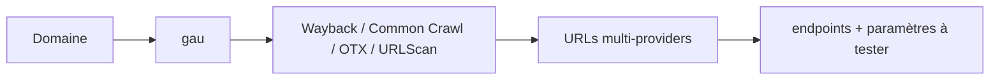

# gau — Agrégateur d'URLs multi-sources (Get All URLs)

> [!info] **En 1 phrase**
> gau collecte toutes les URLs connues d'un domaine en interrogeant Wayback, Common Crawl, OTX et URLScan en parallèle.

---

## Overview

| Champ | Valeur |
|---|---|
| Nom complet | gau (Get All URLs) |
| Description | Agrégateur d'URLs historiques : interroge en parallèle Wayback Machine (CDX), Common Crawl, AlienVault OTX et URLScan.io |
| Catégorie | Reconnaissance & OSINT |
| Sous-catégorie | Découverte d'URLs / endpoints historiques |
| Fonction principale | Collecter toutes les URLs connues d'un domaine depuis des archives publiques |
| Type d'outil | CLI |
| Licence | MIT |
| Open source / propriétaire | Open source |
| Langage(s) de programmation | Go |
| Développeur / organisation | Corben Leo (« lc ») |
| Projet officiel | lc/gau |
| Dépôt officiel | https://github.com/lc/gau |
| Documentation officielle | https://github.com/lc/gau/blob/master/README.md |
| Date de création | 25 février 2020 (premier commit) |
| État du projet | actif (maintenu) |
| Dernière version connue | v2.2.4 (2024-10-28) |
| Systèmes compatibles | Linux, Windows, macOS (binaires précompilés + `go install`) |

> [!note] Pour vérifier / compléter
> gau v2 a fusionné l'ancien outil `gauplus` : un seul binaire `gau`. Le provider URLScan nécessite une clé API (`URLSCAN_API_KEY`).

---

## Concept

gau (Get All URLs, de lc) agrège l'historique des URLs d'un domaine depuis plusieurs providers : Wayback Machine (CDX), Common Crawl, AlienVault OTX et URLScan.io. Plus complet que waybackurls (un seul provider), il offre le multithreading, les filtres d'extensions, les filtres de codes de réponse et la sortie JSON. Position : phase de découverte d'URLs, entre l'énumération de sous-domaines et le test des endpoints. S'utilise en complément de waybackurls (profondeur) et de katana (crawl actif).

Le principe est celui du **recon passif** : on ne contacte jamais directement la cible, on interroge des archives publiques qui l'ont déjà crawlée. Cela permet de découvrir des endpoints supprimés, d'anciennes versions d'API, des paramètres oubliés ou des fichiers sensibles encore référencés, sans déclencher d'alerte côté serveur. La sortie texte se pipe naturellement dans httpx (validation des cibles vivantes), grep (filtrage) ou nuclei (scan de vulnérabilités). L'outil est écrit en Go : un seul binaire, rapide, parfait pour les pipelines d'automatisation de la reconnaissance.

Côté volume, gau est généreux : sur un domaine actif, on peut récupérer des dizaines de milliers d'URLs. D'où l'importance du **nettoyage en aval** (extensions statiques, paramètres, déduplication, revalidation httpx) avant tout scan. Le format de sortie est une URL par ligne, ce qui se branche directement sur les outils de la chaîne (httpx, nuclei, ffuf). La v2 de gau a unifié les binaires `gau` (dont l'ancien `gauplus`) et offre des améliorations de performance et de stabilité des providers.



---

## Concepts fondamentaux

| Concept | Explication |
|---|---|
| Wayback Machine (CDX) | Archive de l'Internet Archive : index des captures d'URLs historiques, interrogé via son API CDX |
| Common Crawl | Corpus public de pages web crawlées périodiquement (souvent un index mensuel) |
| AlienVault OTX | Plateforme de threat intelligence avec un index d'URLs par domaine |
| URLScan.io | Service de scan de sites web (sandbox) : URLs observées lors des scans |
| Provider | Source de données interrogée ; filtrable avec `--providers wayback,otx` |
| Recon passif | Aucune requête directe vers la cible : les données proviennent d'archives |
| Endpoint | URL complète (chemin + paramètres) ; les URLs avec `=` sont des candidats aux injections |
| Waybackurls | Outil équivalent mono-provider (Wayback uniquement) |

---

## Installation

### Debian / Ubuntu / Kali Linux

```bash
# Binaire précompilé depuis les releases GitHub
wget https://github.com/lc/gau/releases/download/v2.2.4/gau_2.2.4_linux_amd64.tar.gz
tar xvf gau_2.2.4_linux_amd64.tar.gz && sudo mv gau /usr/local/bin/
# Ou via go
go install -v github.com/lc/gau/v2/cmd/gau@latest
```

### Arch Linux

```bash
# Binaire précompilé (AUR : gau) ou via go
go install -v github.com/lc/gau/v2/cmd/gau@latest
```

### Fedora / RHEL

```bash
go install -v github.com/lc/gau/v2/cmd/gau@latest
```

### macOS

```bash
brew install gau
```

### Windows

```powershell
# Binaire précompilé depuis les releases GitHub (gau_2.2.4_windows_amd64.zip)
# ou
go install -v github.com/lc/gau/v2/cmd/gau@latest
```

### Docker

```bash
# Pas d'image officielle : construire depuis les sources ou utiliser un binaire
docker run --rm -it golang:1.24 sh -c "go install -v github.com/lc/gau/v2/cmd/gau@latest && /root/go/bin/gau example.com"
```

### Compilation depuis les sources

```bash
git clone https://github.com/lc/gau.git && cd gau/cmd
go build
sudo mv gau /usr/local/bin/
gau --version
```

> [!warning] Prérequis & problèmes potentiels
> - Clé API **URLScan optionnelle** (`URLSCAN_API_KEY`) pour activer le provider URLScan.
> - Config (fichier TOML) chargée depuis `$HOME/config.toml` (Linux) ou `%USERPROFILE%\.gau.toml` (Windows) si présente.
> - Les providers peuvent être lents ou timeouter sur les gros domaines : ajuster `--timeout` et `--retries`.

---

## Configuration

### Fichier de configuration (TOML)

`gau` charge un fichier TOML optionnel : `$HOME/config.toml` (Linux/macOS) ou `%USERPROFILE%\.gau.toml` (Windows), ou un chemin donné par `--config`.

```toml
# Exemple de configuration TOML
[urlscan]
api_key = "votre_cle_urlscan"
[commoncrawl]
index = "CC-MAIN-2026-30"   # index Common Crawl à utiliser
```

| Paramètre | Rôle | Valeur possible | Impact | Exemple |
|---|---|---|---|---|
| `--config <f>` | Fichier de configuration | chemin | Remplace le TOML par défaut | `gau --config ~/.config/gau.toml` |
| `--providers` | Sources utilisées | `wayback,commoncrawl,otx,urlscan` | Couverture vs vitesse | `--providers wayback,otx` |
| `--subs` | Inclut les sous-domaines | booléen | Périmètre élargi | `gau example.com --subs` |
| `--threads` | Nombre de goroutines | entier | Parallélisme | `gau example.com --threads 10` |
| `--blacklist` | Extensions exclues | liste | Réduit le bruit | `--blacklist png,jpg,css` |
| `--fc` | Codes de statut filtrés | liste | Épuration | `--fc 404,403` |
| `--mc` | Codes de statut gardés | liste | Ciblage | `--mc 200,301` |
| `--from` / `--to` | Fenêtre de dates (YYYYMM) | dates | Récence des URLs | `--from 202401 --to 202601` |
| `--fp` | Déduplication par endpoint | booléen | Réduit les doublons de paramètres | `--fp` |
| `URLSCAN_API_KEY` | Clé API URLScan (env) | chaîne | Active le provider urlscan | `export URLSCAN_API_KEY=xxx` |

> [!note] À vérifier
> L'option `--fp` « remove different parameters of the same endpoint » déduplique les URLs partageant le même chemin, ce n'est pas un filtre de valeurs de paramètres. Vérifier avec `gau -h`.

---

## Architecture interne

- **Providers** : chaque source (`wayback`, `commoncrawl`, `otx`, `urlscan`) est un adaptateur qui interroge son API (CDX pour Wayback, index Common Crawl, OTX indicators API, urlscan.io API) et normalise les résultats en URLs.
- **Concurrence** : goroutines Go pilotées par `--threads` ; chaque provider est interrogé en parallèle, avec `--retries` et `--timeout` par requête.
- **Pipeline interne** : collecte → filtrage entrée (`--blacklist`) → filtrage sortie (`--fc`/`--mc`, `--ft`/`--mt` mime-types) → déduplication → affichage (`stdout`) ou fichier (`--o`).
- **Sorties** : texte (URL par ligne, défaut) ou JSON (`--json`).
- **Config** : charge le TOML (clés API, index Common Crawl) avant les flags CLI, qui priment.

---

## Commandes

### Commandes principales

```bash
gau [flags] <domaines>
```

| Commande | Objectif | Résultat attendu |
|---|---|---|
| `gau example.com` | Collecte toutes les URLs du domaine | URLs multi-providers |
| `cat domains.txt \| gau --subs --threads 10 > urls.txt` | Multi-domaines + sous-domaines | Fichier d'URLs |
| `gau example.com --blacklist png,jpg,jpeg,gif,css,js,svg,woff` | Filtre des assets statiques | URLs utiles |
| `gau example.com --providers wayback,otx --json` | Sources choisies + JSON | Données structurées |
| `gau example.com --fc 404,403` | Filtre les réponses mortes | URLs vivantes probables |
| `gau example.com --from 202401 --to 202601` | Fenêtre de dates | URLs récentes |

### Commandes avancées

```bash
# Filtres mime-types et statuts combinés
gau example.com --subs --mc 200,301,302 --mt text/html,application/json
# Déduplication des endpoints à paramètres
gau example.com --fp --subs
# Proxy pour anonymiser / déboguer
gau example.com --proxy http://127.0.0.1:8080
# Configuration personnalisée
gau example.com --config ~/.config/gau.toml
```

---

## Options et flags

| Option | Description | Exemple | Niveau |
|---|---|---|---|
| `--subs` | Inclut les sous-domaines | `gau example.com --subs` | Basic |
| `--threads <n>` | Nombre de goroutines | `gau example.com --threads 10` | Basic |
| `--providers <liste>` | Sources à interroger | `--providers wayback,otx` | Basic |
| `--blacklist <liste>` | Extensions exclues | `--blacklist png,jpg,css` | Basic |
| `--o <f>` | Fichier de sortie | `gau --o out.txt example.com` | Basic |
| `--json` | Sortie JSON | `gau example.com --json` | Intermediate |
| `--fc <liste>` | Codes filtrés | `--fc 404,403` | Intermediate |
| `--mc <liste>` | Codes gardés | `--mc 200,500` | Intermediate |
| `--from <YYYYMM>` | Date de début | `--from 202401` | Intermediate |
| `--to <YYYYMM>` | Date de fin | `--to 202601` | Intermediate |
| `--fp` | Déduplication par endpoint | `gau example.com --fp` | Intermediate |
| `--ft <liste>` | Mime-types filtrés | `--ft text/plain` | Advanced |
| `--mt <liste>` | Mime-types gardés | `--mt application/json` | Advanced |
| `--retries <n>` | Tentatives HTTP | `--retries 10` | Advanced |
| `--timeout <s>` | Timeout HTTP | `--timeout 60` | Advanced |
| `--proxy <url>` | Proxy HTTP/SOCKS5 | `--proxy socks5://localhost:9050` | Advanced |
| `--config <f>` | Fichier TOML alternatif | `--config ~/.config/gau.toml` | Expert |
| `--verbose` | Logs détaillés | `gau --verbose example.com` | Expert |
| `--version` | Version | `gau --version` | Basic |

> [!tip] Options les plus utiles au quotidien
> `--subs` (périmètre complet), `--blacklist` (réduire le bruit), `--fc 404,403` (épurer), `--threads` (vitesse), `--fp` (déduplication).

---

## Exemples pratiques

### Beginner

```bash
# Collecte simple
gau example.com | head -20
# Sauvegarde dans un fichier
gau example.com --o urls.txt
```

### Intermediate

```bash
# Multi-domaines avec sous-domaines, parallélisme
cat domains.txt | gau --subs --threads 10 > urls.txt
# Nettoyage du bruit statique
gau example.com --subs --blacklist png,jpg,jpeg,gif,css,js,svg,woff,woff2
```

### Advanced

```bash
# Fenêtre de dates + codes de statut
gau example.com --subs --from 202401 --to 202601 --fc 404,403
# JSON pour le pipeline
gau example.com --subs --json -o urls.json
```

### Expert

```bash
# Chasse aux secrets dans les URLs historiques
gau example.com --subs --threads 10 --blacklist png,jpg,jpeg,gif,css,woff,svg \
  | grep -Ei "(api[_-]?key|token|secret|password|aws|AKIA[0-9A-Z]{16})"
# Recensement des fichiers sensibles
gau example.com --subs \
  | grep -Ei "\.(env|xml|json|sql|log|bak|zip|tar\.gz|php|aspx|jsp)$"
# Endpoints avec paramètres à fuzzer
gau example.com --subs | grep "=" | sort -u
```

---

## Workflow complet (scénario pas à pas)

1. **Collecte multi-sources** sur tout le périmètre.
   ```bash
   cat domains.txt | gau --subs --threads 5 > urls.txt
   wc -l urls.txt
   ```
2. **Nettoyage du bruit** — retirer les assets statiques et dédupliquer.
   ```bash
   grep -Ev "\.(css|js|png|jpg|gif|svg|woff|woff2)$" urls.txt | sort -u > urls_clean.txt
   ```
3. **Isoler les endpoints avec paramètres** — candidats aux injections (SQL, XSS, SSRF).
   ```bash
   grep "=" urls_clean.txt
   ```
4. **Valider les cibles vivantes** avec httpx (codes, titres, redirections).
   ```bash
   cat urls_clean.txt | httpx -mc 200 -sc -title -silent -o live_urls.txt
   ```
5. **Scanner les vulnérabilités** sur les endpoints vivants.
   ```bash
   nuclei -l live_urls.txt -t ~/nuclei-templates/ -severity medium,high,critical
   ```

---

## Scénarios avancés

### Scénario 1 : fuite de secrets et clés API

```bash
gau example.com --subs --threads 10 --blacklist png,jpg,jpeg,gif,css,woff,svg \
  | grep -Ei "(api[_-]?key|token|secret|password|aws|AKIA[0-9A-Z]{16})"
```

### Scénario 2 : recensement des fichiers d'archive sensibles

```bash
gau example.com --subs \
  | grep -Ei "\.(env|xml|json|sql|log|bak|zip|tar\.gz|php|aspx|jsp)$"
```

### Scénario 3 : fusion complète avec waybackurls

```bash
{ cat domains.txt | waybackurls -subs; cat domains.txt | gau --subs; } | sort -u > all_urls.txt
```

### Scénario 4 : mapping des endpoints d'API

```bash
gau example.com --subs | grep -Ei "\.(json|xml)$|/api/|/v[0-9]/" | sort -u
# Puis tester la version de l'API et les paramètres exposés
cat api_urls.txt | httpx -mc 200 -json -o api_live.txt
```

---

## Cybersecurity use cases

| Phase | Utilisation |
|---|---|
| Reconnaissance | Découverte passive de l'historique d'URLs (endpoints supprimés, anciennes API) |
| Énumération | Recensement des endpoints avec paramètres (fuzzing ultérieur) |
| Vulnérabilité | Détection de fichiers sensibles historiques (`.env`, backups) |
| Vulnérabilité | Chasse aux secrets exposés dans les URLs |
| Énumération | Cartographie des APIs et versions (`/api/`, `/v1/`) |

---

## MITRE ATT&CK

| Tactique | Technique / Sub-technique | ID | Raison | Détection | Mitigation |
|---|---|---|---|---|---|
| Reconnaissance | Search Open Websites/Domains : Search Engines | T1593.002 | Interrogation d'archives publiques (Wayback, Common Crawl) pour découvrir des URLs | Logs des fournisseurs d'archives | Ne pas exposer de secrets, purger les endpoints obsolètes |
| Reconnaissance | Search Open Technical Databases : Scan Databases | T1596.005 | Utilisation d'index tierces (URLScan, OTX) | Journalisation API côté fournisseurs | Surveiller les fuites, limiter les métadonnées |
| Reconnaissance | Gather Victim Identity Information : Email Addresses | T1589.002 | Les URLs peuvent révéler des adresses e-mail | Monitoring des fuites | Masquer les emails, contrôler les données publiques |

> [!note] Ne renseigner que si l'association est réellement pertinente.
> gau relève de la recherche d'informations publiques : T1593.002 (archives web) et T1596.005 (bases tierces).

---

## Defensive Security

### Signes observables

| Indicateur | Détail |
|---|---|
| Les URLs historiques sont publiques : rien à bloquer côté serveur | La défense passe par la purge réelle des fichiers sensibles |
| Requêtes vers les APIs des fournisseurs (Wayback, urlscan) | Visible côté fournisseur uniquement |
| Endpoints anciens toujours en ligne | Re-évaluer périodiquement les endpoints historiques |
| Fichiers de config/sauvegarde dans l'historique | Rotation des clés exposées, suppression réelle |

### Règles de détection (Sigma / Suricata / Snort / YARA)

```yaml
# Sigma — Requêtes sortantes vers les endpoints d'archives d'URLs
# Adaptation pédagogique : journaliser les appels vers les fournisseurs
title: Outbound Access To URL Archive Services
id: 5d8c2f4e-9a1b-4c3d-8e6f-2b7a1d9c4e5f
status: test
logsource:
    category: proxy
detection:
    selection:
        destination.host|contains:
            - 'web.archive.org'
            - 'index.commoncrawl.org'
            - 'urlscan.io'
            - 'otx.alienvault.com'
    condition: selection
falsepositives:
    - Legitimate research or browser history tools
level: low
```

```bash
# Suricata — accès à l'API urlscan (adaptation pédagogique)
alert http any any -> any any (msg:"ET POLICY URLScan API Usage"; \
  http.host; content:"urlscan.io"; sid:2026005; rev:1;)
```

> [!note] À vérifier
> Exemples pédagogiques : la détection se fait principalement sur les **endpoints exposés** (fichiers sensibles) et les fuites, plus que sur l'outil lui-même qui est passif.

---

## Automatisation

```bash
# Bash — pipeline complet de découverte d'URLs
gau example.com --subs --threads 20 --blacklist png,jpg,jpeg,gif,css,js,svg,woff,woff2 \
  | sort -u | httpx -mc 200 -sc -title -silent -o live.txt
```

```python
# Python — collecte et filtrage
import subprocess

def gau_urls(domain, threads=10):
    out = subprocess.run(
        ["gau", "--subs", "--threads", str(threads), domain],
        capture_output=True, text=True
    ).stdout
    return set(u for u in out.splitlines() if u.strip())

urls = gau_urls("example.com")
endpoints = sorted(u for u in urls if "=" in u)
print(f"{len(urls)} URLs, {len(endpoints)} avec paramètres")
```

```yaml
# cron — monitoring mensuel des nouvelles URLs
0 5 1 * *  gau example.com --subs -o /opt/recon/urls_$(date +\%Y\%m).txt
```

---

## Output et parsing

Sorties : texte (URL par ligne) ou JSON (`--json`, un objet par ligne).

```bash
# Filtrer les endpoints avec paramètres
gau example.com --subs | grep "=" | sort -u
# jq sur la sortie JSON
gau example.com --json | jq -r 'select(.url != null) | .url' | sort -u
```

```python
# Python — parsing de la sortie texte
with open("urls.txt") as f:
    urls = sorted({u.strip() for u in f if u.strip()})
print(len(urls), "URLs uniques")
```

```python
# Python — parsing JSON
import subprocess, json
out = subprocess.run(["gau", "example.com", "--json"], capture_output=True, text=True).stdout
for line in out.splitlines():
    if not line.strip():
        continue
    entry = json.loads(line)
    print(entry.get("url"))
```

---

## Intégrations

- [[Tools| Outils]] global
- [[Outil - waybackurls|waybackurls]] — profondeur mono-provider à fusionner
- [[Outil - httpx|httpx]] — validation des URLs vivantes
- [[Outil - katana|katana]] — crawl actif complémentaire (ce que les archives ne voient pas)
- [[Outil - nuclei|nuclei]] — scan de vulnérabilités sur les endpoints
- [[Outil - ffuf|ffuf]] / [[Outil - gobuster|gobuster]] — fuzzing des paramètres découverts
- [[01 - Reconnaissance| Reconnaissance]]

```text
gau → httpx → nuclei
       ↘  (endpoints à paramètres) → ffuf / tests manuels
```

---

## Alternatives

| Outil | Avantages | Inconvénients | Cas d'usage |
|---|---|---|---|
| waybackurls | Simple, mono-provider, très rapide | Un seul fournisseur | Première passe légère |
| katana | Crawl actif + JS, données fraîches | Contacte la cible | Ce que les archives ne voient pas |
| URLScan API | Données de scans réels (sandbox) | Payant au-delà du gratuit | Vérification ciblée |
| Wayback Machine CDX | Historique complet | Données brutes à traiter | Fouille d'archive |
| ParamSpider (devansh) | URLs + paramètres formatés | Mono-focus paramètres | Extractions de paramètres |

> **Quand utiliser katana plutôt que gau ?** Quand la cible est vivante et que l'on veut les endpoints actuels (crawl actif, JS) : gau donne l'historique, katana l'état présent. Les deux se complètent.

---

## Performance

- Goroutines Go : collecte multi-providers simultanée, `--threads` pour monter en charge.
- La durée dépend surtout des providers (Wayback CDX peut être lent sur les gros domaines).
- `--fc`/`--mc` et `--blacklist` réduisent le volume avant la sortie : pipeline plus rapide.
- Aucun benchmark officiel : ordre de grandeur de quelques minutes pour un domaine actif avec tous les providers.

> [!note] À vérifier
> Les latences des providers varient ; les gros domaines peuvent nécessiter `--timeout`/`--retries` ajustés.

---

## Troubleshooting

### Common problems

#### Problème : aucun résultat du provider URLScan

- **Cause** : clé API absente ou invalide.
- **Solution** : `export URLSCAN_API_KEY="votre_cle"` et relancer.
- **Vérification** : `gau example.com --providers urlscan --verbose`.

#### Problème : les providers timeout sur un gros domaine

- **Cause** : volumes importants, API lentes.
- **Solution** : augmenter `--timeout`, `--retries`, réduire `--threads`.
- **Vérification** : relancer avec `--timeout 60 --retries 10`.

#### Problème : trop de bruit / volumes énormes

- **Cause** : pas de filtre, domaines très actifs.
- **Solution** : `--blacklist`, `--fc`, `--fp`, puis `sort -u` en aval.
- **Vérification** : `wc -l urls.txt` avant/après filtrage.

#### Problème : doublons massifs entre providers

- **Cause** : les mêmes URLs sont dans Wayback, OTX et Common Crawl.
- **Solution** : dédupliquer avec `sort -u` ; `--fp` réduit aussi les doublons de paramètres.
- **Vérification** : `sort -u urls.txt | wc -l`.

---

## Sécurité de l'outil

- **Clés API** : `URLSCAN_API_KEY` en variable d'environnement ou TOML → ne pas committer, permissions restrictives.
- **Recon passif** : aucun trafic vers la cible — le plus sûr juridiquement.
- **Volume** : les requêtes vers les fournisseurs sont visibles côté fournisseurs ; un usage massif peut faire rater les quotas.
- **Données sensibles** : les secrets trouvés dans les URLs doivent être signalés dans le rapport (et leur rotation conseillée), pas exploités hors cadre.

---

## Limitations

- Les URLs collectées sont **historiques** : beaucoup ne sont plus en ligne (revalider avec httpx).
- Couverture limitée à ce que les archives ont déjà crawlées : les endpoints jamais indexés sont invisibles.
- Sans `--subs`, seul le domaine racine est traité.
- `--fp` déduplique mais ne filtre pas les valeurs de paramètres.
- Pas de crawl actif : compléter avec katana pour les applications modernes.

---

## Cheatsheet

```bash
# Collecte simple
gau example.com

# Multi-domaines + sous-domaines, parallélisme
cat domains.txt | gau --subs --threads 10 > urls.txt

# Filtre des assets statiques
gau example.com --subs --blacklist png,jpg,jpeg,gif,css,js,svg,woff,woff2

# Épuration des réponses mortes
gau example.com --fc 404,403

# Fenêtre de dates
gau example.com --from 202401 --to 202601

# Endpoints avec paramètres
gau example.com --subs | grep "=" | sort -u

# JSON
gau example.com --subs --json -o urls.json

# Chasse aux secrets
gau example.com --subs | grep -Ei "(token|secret|password|AKIA[0-9A-Z]{16})"
```

---

## Quick reference

| | |
|---|---|
| **À quoi sert-il ?** | Collecter toutes les URLs connues d'un domaine depuis des archives publiques |
| **Quand l'utiliser ?** | Après l'énumération de sous-domaines, avant le test des endpoints |
| **Commande principale** | `gau example.com --subs --threads 10 --blacklist png,jpg,css,js` |
| **Alternative principale** | waybackurls (profondeur Wayback), katana (crawl actif) |
| **Concepts importants** | Providers, Wayback CDX, Common Crawl, OTX, URLScan, recon passif |
| **Liens associés** | [[Outil - waybackurls]] · [[Outil - httpx]] · [[Outil - katana]] · [[Outil - nuclei]] |

---

## Détection & Défense

| Signe | Défense |
|---|---|
| Les URLs historiques sont publiques : rien à bloquer côté serveur | Ne pas s'appuyer sur l'obscurité : supprimer réellement les fichiers sensibles |
| Des données collectées par Common Crawl / URLScan peuvent dater | Re-évaluer périodiquement les endpoints anciens toujours en ligne |
| Les requêtes vers les providers sont visibles côté provider | Robots.txt n'arrête pas les agrégateurs publics : limiter l'exposition |
| Un endpoint d'une ancienne version du site toujours exposé | Purger les versions obsolètes, prévoir un décommissionnement propre, en-têtes `X-Robots-Tag` |
| Fichiers de configuration ou de sauvegarde visibles dans l'historique | Ne jamais committer de secrets ; rotation des clés exposées, alerte sur les patterns sensibles |

---

## Tips & Pièges

> [!tip] **Tips**
> - Configure `URLSCAN_API_KEY` pour activer le provider URLScan et gagner en couverture.
> - `--fc 404,403` épure les résultats morts avant même la sortie.
> - Pour les gros périmètres, monte `--threads` (10-20) et garde un œil sur les timeouts.
> - Chainage type : `gau --subs | sort -u | httpx -mc 200 -silent | nuclei` pour un tri automatique du start au scan.
> - `--from`/`--to` permet de cibler des fenêtres temporelles (nouvelles APIs, campagnes récentes).

> [!warning] **Pièges**
> - Sans `--subs`, seul le domaine racine est traité.
> - Les providers peuvent timeout sur les gros domaines : ajuste `--timeout` et `--retries`.
> - Les URLs collectées sont historiques : re-valide toujours avec httpx avant de tester.
> - Ne pas confondre `--blacklist` (filtre d'extensions à l'entrée) et `--fc` (filtre de statuts à la sortie) : les deux servent à réduire le bruit mais à des étapes différentes.
> - Certains providers limitent le volume par IP (rate limit) : en cas d'échec massif, réduis `--threads` et espace les requêtes.

---

## References

### Official

- GitHub officiel gau : https://github.com/lc/gau
- README officiel (flags et exemples) : https://github.com/lc/gau/blob/master/README.md
- Releases officielles : https://github.com/lc/gau/releases

### Security references

- MITRE ATT&CK T1593.002 — Search Open Websites/Domains: Search Engines : https://attack.mitre.org/techniques/T1593/002/
- MITRE ATT&CK T1596 — Search Open Technical Databases : https://attack.mitre.org/techniques/T1596/

### Community

- URLScan.io : https://urlscan.io
- Wayback Machine CDX : https://web.archive.org
- Blog ProjectDiscovery (pipelines recon) : https://blog.projectdiscovery.io

---

**Liens :** [[Tools| Outils]] · [[Outil - waybackurls|waybackurls]] · [[Outil - httpx|httpx]] · [[Outil - katana|katana]]
