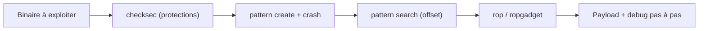

# 🛠️ GDB-PEDA — Le debugger GDB boosté pour l'exploitation

> [!info] **En 1 phrase**
> GDB avec une interface colorée et des commandes d'exploitation intégrées (checksec, pattern, ROP, X/nx) pour debugger et exploiter les binaires en un clin d'œil.

---

## 🧾 Overview

| Champ | Valeur |
|---|---|
| Nom complet | PEDA (Python Exploit Development Assistance for GDB) |
| Description | Plugin Python pour GDB orienté exploitation : affichage automatique des registres/stack/assembleur, commandes dédiées pwn (checksec, pattern, ROP, shellcode) |
| Catégorie | CTF & Développement |
| Sous-catégorie | Reverse Engineering / Exploitation (pwn) |
| Fonction principale | Transformer GDB en environnement d'exploitation de binaires |
| Type d'outil | Plugin GDB (script Python) |
| Licence | Creative Commons Attribution / personnalisée (source ouverte) |
| Open source / propriétaire | Open source |
| Langage(s) de programmation | Python 2 (script), assembler/GDB |
| Développeur / organisation | longld (Long Le) — projet communautaire |
| Projet officiel | longld/peda |
| Dépôt officiel | https://github.com/longld/peda |
| Documentation officielle | https://github.com/longld/peda/blob/master/README.md |
| Date de création | 3 août 2012 |
| État du projet | maintenu en mode « legacy » (préféré à pwndbg par la communauté moderne) |
| Systèmes compatibles | Linux (x86, x86_64, ARM) ; GDB 7.7+ |

> [!note] À vérifier
> gdb-peda n'a **pas de releases versionnées** officielles : l'installation se fait en clonant la branche `master`. Le paquet Arch Linux `peda` (v1.2-7) est une packaging communautaire. PEDA est écrit pour **Python 2** : sur les GDB compilés avec Python 3, un environnement `python2` ou un fork est parfois nécessaire (voir section Troubleshooting).

---

## 🎯 Concept

gdb-peda est un plugin Python pour GDB qui transforme le débogueur en outil orienté exploitation. À chaque instruction, il affiche **automatiquement** les registres, la stack, le code désassemblé et les segments de mémoire. Il ajoute des commandes dédiées : `checksec` (protections), `pattern create/search` (offset de buffer overflow), `pwnhelp` (aide exploitation), `rop`/`ropgadget` (recherche de gadgets), `dumpargs`, `xinfo`... Avec PEDA, on repère immédiatement l'état du programme au moment du crash, on copie une adresse utile, et on valide qu'un payload a bien écrasé RIP. C'est l'environnement de debug de référence pour le pwn en CTF.

Il se place dans la **phase d'analyse et de développement de l'exploit** : après la phase de reconnaissance (`checksec` pour connaître NX, PIE, canary, RELRO), on crée un motif (`pattern create`), on provoque le crash, on trouve l'offset (`pattern search`), puis on construit le payload en s'aidant de l'affichage mémoire. PEDA s'utilise seul ou en complément de [[Outil - pwntools]] (déclenchement de `gdb.attach` pour déboguer un exploit en cours d'exécution) et de [[Outil - ROPgadget]] (génération de chaînes).



---

## 🧠 Concepts fondamentaux

| Concept | Explication |
|---|---|
| GDB | GNU Debugger, débogueur de référence sous Linux |
| PEDA | Surcharge GDB : affichage automatique + commandes d'exploitation |
| checksec | Commande PEDA : liste NX, PIE, canary, RELRO, fortify d'un binaire |
| pattern create/search | Génère un motif cyclique pour trouver l'offset exact du crash |
| Offset | Distance entre le début du buffer et l'adresse de retour (RIP/EIP) |
| ROP chain | Chaîne de gadgets (`ret`) pour détourner l'exécution malgré NX |
| Ret2libc | Technique : retourner vers des fonctions de libc (system, execve) |
| Telescope | Visualisation pointeur par pointeur de la stack (déréférencement) |
| xinfo | Informations sur une adresse (page, permissions, symbole) |
| Breakpoint / checkpoint | Points d'arrêt classiques et points de restauration d'état (PEDA `cp*`) |

---

## 🛠️ Installation

### Debian / Ubuntu / Kali Linux

```bash
git clone https://github.com/longld/peda.git ~/peda
echo "source ~/peda/peda.py" >> ~/.gdbinit
```

### Arch Linux

```bash
# Paquet communautaire
sudo pacman -S peda
# puis activer dans ~/.gdbinit
echo "source /usr/share/peda/peda.py" >> ~/.gdbinit
```

### macOS / Homebrew

```bash
brew install gdb
git clone https://github.com/longld/peda.git ~/peda
echo "source ~/peda/peda.py" >> ~/.gdbinit
```

### Rechargement après modification

```bash
gdb -q ./challenge
# Dans gdb : recharger le script après édition
(gdb) source ~/peda/peda.py
```

### Vérification

```bash
gdb -q ./challenge
(gdb) pwnhelp
```

> [!warning] ⚠️ Prérequis & problèmes potentiels
> - **Python 2** : PEDA requiert un GDB construit avec Python 2 ; sur les distributions récentes (GDB en Python 3), utiliser `python2-gdb`, un environnement `pyenv` Python 2, ou un fork à jour. Certains utilisent **pwndbg** (maintenu activement) en alternative.
> - GDB doit être installé : `sudo apt install gdb` (ou `gdb-multiarch` pour l'ARM).

---

## ⚙️ Configuration

| Paramètre | Rôle | Valeur possible | Impact | Exemple |
|---|---|---|---|---|
| `~/.gdbinit` | Fichier d'initialisation GDB | Ligne `source ~/peda/peda.py` | Charge PEDA au démarrage | L'ajouter en tête |
| `set context` | Sections affichées à chaque step | `code`, `stack`, `registers`, `arguments`... | Réduire/étendre l'affichage | `set context code,stack` |
| `set autosave` | Sauvegarder automatiquement les breakpoints | On/Off | Reprise de session | `set autosave on` |
| `set os` | Surcharger la détection d'OS | `linux`, `freebsd` | Contexte correct | `set os linux` |
| `set log` | Journaliser l'affichage contexte | On/Off | Traçabilité | `set log on` |
| `aslr` | Afficher/modifier l'ASLR du système | `on`, `off`, `show` | Tests de stabilité | `aslr off` |
| `cpget` / `cpset` | Checkpoints (sauvegarde/restauration d'état) | Noms de points | Revenir à un état connu | `cpset etat1` |
| `pycall` | Appeler du code Python dans GDB | Expression Python | Automatisation avancée | `pycall int('0xdead',16)` |

> [!note] À vérifier
> Les noms de paramètres PEDA sont assez stables, mais certains (ex. `set log`) varient selon la branche : vérifier `show peda` et le README du dépôt.

---

## 🏗️ Architecture interne

- **Un script unique** : PEDA est un fichier `peda.py` (décomposé en `peda/*.py` dans la branche master récente : `utils.py`, `commands.py`, `gdb/`...). Il s'interface avec l'API Python embarquée de GDB (`gdb.execute`, `gdb.selected_inferior()`).
- **Hooking du prompt** : PEDA se connecte à l'événement de mise à jour du prompt GDB pour réafficher le **contexte** (registres, stack, code, segments) à chaque arrêt.
- **Analyse ELF** : `checksec` et `elfheader` parsent le header ELF pour détecter NX, PIE, RELRO, canary, fortify — via `readelf`/`objdump` ou parse interne.
- **Motifs cycliques** : `pattern create` génère une séquence cyclique de caractères alphanumériques ; `pattern search` retrouve l'offset dans la valeur pointée par RIP au crash.
- **ROP intégré** : `rop` liste les gadgets `ret` du binaire et de libc chargée (réutilise le mécanisme de [[Outil - ROPgadget]] en interne).
- **Affichage mémoire** : `telescope`, `hexdump`, `xinfo` exploitent la lecture mémoire de l'inférieur GDB pour afficher pointeurs, octets et permissions.

---

## ⌨️ Commandes

### Commandes principales

```bash
gdb -q ./challenge
```

| Commande PEDA | Objectif | Résultat attendu |
|---|---|---|
| `checksec` | Afficher les protections du binaire | NX, PIE, RELRO, canary |
| `pattern create 200` | Générer un motif cyclique | Chaîne de test |
| `run < motif` | Lancer avec l'entrée | Crash à une adresse cyclique |
| `pattern search <valeur>` | Trouver l'offset du crash | Offset du buffer |
| `info registers` | Registres (GDB natif) | État CPU au crash |
| `telescope $rsp` | Déréférencer la stack | Chaîne d'adresses |
| `xinfo $rip` | Détails sur une adresse | Page, permissions, symbole |
| `rop` | Gadgets du binaire + libc | Liste de gadgets `pop/ret` |
| `dumpargs` | Afficher les arguments des appels | Valeurs transmises |
| `pwnhelp` | Aide des commandes PEDA | Liste complète |
| `aslr off` | Désactiver l'ASLR système | Adresses stables |
| `x/nx $rsp` | Examiner n octets mémoire | Contenu de la stack |
| `break *adresse` | Breakpoint à une adresse | Arrêt ciblé |
| `c` / `continue` | Reprendre l'exécution | Suite du programme |

### Commandes avancées

```bash
# Rechercher un gadget spécifique
(gdb) ropgadget pop rdi
# Dump mémoire d'une zone vers un fichier
(gdb) dumpmem /tmp/dump.bin $rsp $rsp+0x100
# Chercher des chaînes "/bin/sh"
(gdb) searchmem "/bin/sh"
# Mettre un checkpoint et y revenir
(gdb) cpset ok; cpget ok
```

---

## 🎚️ Options et flags

| Option PEDA | Description | Exemple | Niveau |
|---|---|---|---|
| `set context` | Sections du contexte affiché | `set context code,registers` | Intermediate |
| `set autosave` | Sauvegarde auto des breakpoints | `set autosave on` | Advanced |
| `set autoast` | Afficher le script ASLR à chaque étape | `set autoast on` | Advanced |
| `set enhance` | Résolution des symboles dans les sorties | `set enhance on` | Intermediate |
| `set os` | Forcer l'OS | `set os linux` | Expert |
| `set pedatour` | Mini-tutoriel au lancement | `set pedatour off` | Basic |
| `set stepover` | Pas à pas sans entrer dans les appels | `set stepover on` | Advanced |
| `set badchars` | Définir des bad bytes pour le payload | `set badchars "0a00"` | Expert |
| `set jumptable` | Résoudre les tables de saut dans le code | `set jumptable on` | Expert |
| `set log` | Activer la journalisation du contexte | `set log on` | Advanced |

> [!tip] Options les plus utiles au quotidien
> `checksec` (avant toute chose), `pattern create/search` (offset), `telescope`/`xinfo` (comprendre la mémoire), `rop` (construire la chaîne), `aslr off` (stabiliser les tests), `set context code,registers` (épurer l'affichage).

---

## 🧪 Exemples pratiques

### Beginner

```bash
# Objectif : connaître les protections
gdb -q ./challenge
(gdb) checksec
# NX enabled, PIE disabled, RelRO: Partial
```

```bash
# Objectif : provoquer et localiser un crash
(gdb) pattern create 200
(gdb) run
(gdb) xinfo $rip
```

### Intermediate

```bash
# Objectif : trouver l'offset exact
(gdb) x/wx $rip   # ex. 0x41414141... valeur du motif
(gdb) pattern search 0x61414141
# Offset = 72
```

### Advanced

```bash
# Objectif : gadgets pour un ROP ret2libc
(gdb) rop
(gdb) searchmem "/bin/sh"
# Adresse de system, pop rdi; ret
```

### Expert

```bash
# Objectif : déboguer un exploit pwntools en cours d'exécution
(gdb) target remote :1234
(gdb) continue
```

---

## 🧪 Workflow complet (scénario pas à pas)

1. **Étape 1 — Protections du binaire** :
   ```bash
   gdb -q ./challenge
   (gdb) checksec
   ```
2. **Étape 2 — Créer un motif et provoquer le crash** :
   ```bash
   (gdb) pattern create 300 > /tmp/pattern
   (gdb) run < /tmp/pattern
   ```
3. **Étape 3 — Récupérer l'adresse de crash et trouver l'offset** :
   ```bash
   (gdb) x/wx $rip
   (gdb) pattern search <valeur_du_motif>
   # Offset = 72
   ```
4. **Étape 4 — Inspecter l'environnement d'exploitation** :
   ```bash
   (gdb) xinfo system
   (gdb) searchmem "/bin/sh"
   (gdb) rop
   ```
5. **Étape 5 — Construire le payload** (avec pwntools), le tester localement, puis passer en debug pas à pas :
   ```bash
   (gdb) break *0x401234
   (gdb) continue
   ```
6. **Étape 6 — Valider** que le flow est atteint (registres, arguments via `dumpargs`) avant d'envoyer l'exploit à distance.

---

## 🎬 Scénarios avancés

### Scénario 1 : ret2libc complet

```bash
(gdb) checksec                 # NX enabled, PIE disabled
(gdb) searchmem "/bin/sh"
(gdb) rop                      # pop rdi ; ret
# Construction : padding + pop rdi + "/bin/sh" + system
```

### Scénario 2 : débogage d'un exploit pwntools

```bash
# Terminal 2 : gdb à l'écoute
(gdb) set follow-fork-mode child
(gdb) continue
# pwntools : context.terminal=['tmux','new-window']; gdb.attach(p)
```

### Scénario 3 : reverse d'un binaire strippé

```bash
(gdb) info functions
(gdb) x/10i $rip          # désassembler l'instruction courante
(gdb) telescope $rsp 20   # lire la stack après un appel
```

### Scénario 4 : contourner un canary par leak

```bash
(gdb) break *0x401200
(gdb) continue            # atteindre la fonction vulnérable
(gdb) x/gx $fs:0x28       # lire le canary du thread
```

---

## 🛡️ Cybersecurity use cases

| Phase | Utilisation |
|---|---|
| Analyse statique/dynamique | Reverse d'un binaire inconnu, identification des protections |
| Développement d'exploit | Trouver l'offset, construire un ROP, valider le crash |
| Debug d'exploit | `gdb.attach` avec pwntools, breakpoints sur fonctions clés |
| Évaluation (pentest) | Vérifier l'exploitabilité d'une vulnérabilité mémoire |
| Défense / hardening | Comprendre pourquoi un binaire est exploitable (retours aux devs) |
| CTF / pwn | Résolution de challenges buffer overflow, ROP, format string |

---

## 🎯 MITRE ATT&CK

| Tactique | Technique / Sub-technique | ID | Raison | Détection | Mitigation |
|---|---|---|---|---|---|
| Execution | Native API | T1106 | PEDA exécute/suspend des processus binaires via l'API GDB pour tester l'exploitation | Supervision des usages de debuggers sur endpoints | Moindre privilège, hardening |
| Defense Evasion | Obfuscated Files or Information | T1027 | Développement de payloads/ROP pour contourner NX et ASLR | Analyse mémoire, EDR | ASLR, CFI, NX actifs |
| Execution | Command and Scripting Interpreter : Unix Shell | T1059.004 | Lancement de programmes vulnérables et de shells de test | Détection de processus enfants anormaux | Restriction d'exécution |
| Impact | Exploitation for Privilege Escalation | T1068 | Exploitation de vulnérabilités mémoire découvertes avec le debugger | EDR, monitoring des crashes | Patching, CFI |

> [!note] Ne renseigner que si l'association est réellement pertinente.
> gdb-peda est un **outil de développement/débogage** : il ne fait pas lui-même l'attaque, il prépare et valide l'exploitation (T1106, T1059.004) ; la technique exploitée ensuite (overflow, ROP) est du domaine de la vulnérabilité ciblée (T1068).

---

## 🛡️ Defensive Security

### Signes observables

| Indicateur | Détail |
|---|---|
| GDB/PEDA présent sur un endpoint | Reverse ou préparation d'exploit (légitime en dev, suspect sur un prod) |
| Processus fils anormaux lancés par un debugger | Développement d'exploit en cours |
| `ptrace` / `yama` désactivé | Facilite l'analyse/débogage (durcissement à revoir) |
| Crashes de binaires en production | Exploration de vulnérabilités |

### Règles de détection (Sigma / Suricata / Snort / YARA)

```yaml
# Sigma — utilisation de gdb/peda sur un endpoint sensible
title: GDB PEDA Usage on Sensitive Host
id: a1b2c3d4-e5f6-4a7b-8c9d-0e1f2a3b4c5d
status: experimental
logsource:
    category: process_creation
    product: linux
detection:
    selection:
        Image|endswith: '/gdb'
        CommandLine|contains:
            - 'peda.py'
            - 'checksec'
    condition: selection
falsepositives:
    - Legitimate reverse engineering and development
level: medium
```

```bash
# Suricata — crash repetés en boucle sur un même binaire (scan d'exploit)
alert ip any any -> any any (msg:"Repeated crash/segfault signals"; classtype:attempted-dos; sid:5000402; rev:1;)
```

> [!note] À vérifier
> Règles pédagogiques à adapter ; la détection d'un usage de debugger repose surtout sur la supervision des processus et des syscalls `ptrace`.

---

## 🤖 Automatisation

```bash
# Bash — lancer gdb-peda en script (batch) sans interaction
echo -e "checksec\npattern create 200\nquit" | gdb -q ./challenge
```

```python
# Python + pwntools — gdb.attach pour déboguer un exploit en cours
from pwn import *

p = process("./challenge")
gdb.attach(p, gdbscript="""
    set context code,registers,stack
    break *0x401234
    continue
""")
p.sendline(b"A"*72 + b"payload")
p.interactive()
```

```bash
# Automation des tests : boucle ASLR off/on et rejouer le payload
echo "aslr off" > /tmp/peda_cmd
cat /tmp/peda_cmd | gdb -q ./challenge
```

---

## 📤 Output et parsing

La sortie de PEDA est conçue pour l'œil humain (couleurs, sections). Pour du parsing, on utilise les commandes GDB natives (`x/`, `info`, `maintenance`) et des scripts :

```bash
# Extraction d'une adresse pour un script
(gdb) x/gx system
```

```python
# Python — parser l'offset retourné par pattern search
import subprocess, re
out = subprocess.run(["gdb","-q","-batch","-ex","pattern search 0x61414141","./c"],
                     capture_output=True, text=True).stdout
m = re.search(r"offset = (\d+)", out)
print("offset:", m.group(1))
```

```python
# Python — lire le résultat checksec pour automatiser les décisions
import subprocess
out = subprocess.run(["gdb","-q","-batch","-ex","checksec","./c"],
                     capture_output=True, text=True).stdout
print("PIE" in out, "NX" in out)  # booléens utiles au choix d'exploitation
```

---

## 🔗 Intégrations

```text
checksec (PEDA) → pwntools (payload) → gdb.attach (debug) → ROPgadget (chaîne) → exploit
```

- [[Tools|🧰 Outils]]
- [[Outil - pwntools]] — construction des payloads et `gdb.attach`
- [[Outil - ROPgadget]] — génération des ROP chains (PEDA a `rop` en interne, ROPgadget est plus exhaustif)
- [[Outil - Ghidra]] — analyse statique du binaire avant debug
- [[Outil - radare2]] — alternative debug/reverse en CLI
- [[10 - Cheatsheets|📋 Cheatsheets]]

---

## 🔄 Alternatives

| Outil | Avantages | Inconvénients | Cas d'usage |
|---|---|---|---|
| pwndbg | Maintenu activement, Python 3, riche | Pas de `pattern` aussi simple | Debug moderne de pwn |
| gef | Python 3, multi-arch, actif | Moins de commandes « exploitation » | Reverse/debug |
| radare2 / r2 | Tout-en-un reverse+debug | Courbe d'apprentissage forte | Analyse lourde |
| pure GDB + pwntools | Léger, scriptable | Peu de confort | Automatisation |
| gdb-peda | Interface claire, simple, parfait CTF | Python 2, legacy | CTF / apprentissage |

> **Quand utiliser pwndbg/gef plutôt que PEDA ?** Dès que la distribution embarque GDB en Python 3 sans `python2-gdb` facile, ou pour les architectures exotiques : pwndbg et gef sont maintenus et multi-plateformes, PEDA reste parfait pour les challenges classiques x86/x64.

---

## ⚡ Performance

- **Affichage contexte** : PEDA désassemble et dump la mémoire à **chaque arrêt** — sur de longues boucles, privilégier `set context code,stack` restreint ou désactiver le contexte pendant les runs.
- **Pattern create/search** : rapide même sur de grandes tailles (mémoire du motif en Python).
- **rop** : le scan de gadgets d'une grosse libc prend quelques secondes ; sur binaires strippés, cibler `rop --gadget` ou utiliser [[Outil - ROPgadget]] en CLI.
- **Multi-inférieurs** : en debug multi-processus/fork, PEDA reste léger ; éviter les scripts trop verbeux.

> [!note] À vérifier
> Les performances dépendent du matériel et de la version de GDB ; pas de benchmark officiel.

---

## 🛠️ Troubleshooting

### Common problems

#### Problème : `peda.py` ne charge pas (erreur Python)

- **Cause** : GDB compilé avec Python 3, PEDA en Python 2.
- **Solution** : installer `python2-gdb` (Arch), un environnement Python 2, ou basculer sur pwndbg/gef. **Vérif** : `gdb -q` puis `python print(sys.version)`.

#### Problème : l'affichage contexte manque

- **Cause** : `set context` trop restreint ou terminal étroit.
- **Solution** : `set context all` ou ajuster la largeur. **Vérif** : `show context`.

#### Problème : `pattern search` ne trouve pas

- **Cause** : le binaire est PIE (adresse aléatoire) ou le motif tronqué.
- **Solution** : `aslr off`, relancer, ou rechercher avec la valeur 64 bits exacte. **Vérif** : `x/gx $rsp`.

#### Problème : ASLR du système ne se désactive pas

- **Cause** : `aslr off` est limité à la session (pas kernel).
- **Solution** : `sudo sysctl -w kernel.randomize_va_space=0` en environnement de test. **Vérif** : `cat /proc/sys/kernel/randomize_va_space`.

---

## 🔐 Sécurité de l'outil

- **Exécution locale** : PEDA n'exécute que des commandes GDB locales ; aucune exfiltration réseau.
- **Binaires malveillants** : déboguer un malware peut déclencher du code hostile — utiliser une VM jetable.
- **ptrace et hardening** : l'usage de PEDA nécessite `ptrace` ; sur systèmes durcis (yama) l'attacher à un autre process est restreint (`gdb.attach` peut échouer).
- **GDB Python** : exécuter du Python via `pycall` équivaut à exécuter du code arbitraire — attention aux sources non fiables.

---

## ⚠️ Limitations

- **Python 2 legacy** : incompatible de base avec GDB en Python 3 (voir Troubleshooting) — principale raison de migrer vers pwndbg/gef.
- **Pas de génération de ROP chain complète** : PEDA liste les gadgets mais la construction fine revient à [[Outil - ROPgadget]] / pwntools.
- **Mono-plateforme** : pensé Linux ; l'usage Windows nécessite WSL ou une VM.
- **Pas de maintenance active** : le projet historique stagne ; les forks (ex. `zephyr`/divers) ne sont pas officiels.
- **Interface interactive** : l'automatisation passe par du batch GDB, moins flexible qu'une API.

---

## 📋 Cheatsheet

```bash
# Chargement
echo "source ~/peda/peda.py" >> ~/.gdbinit
# Protections
(gdb) checksec
# Motif
(gdb) pattern create 200
(gdb) pattern search 0x61414141
# Inspection mémoire
(gdb) x/10gx $rsp
(gdb) telescope $rsp 20
(gdb) xinfo system
# Recherche
(gdb) searchmem "/bin/sh"
(gdb) rop
(gdb) ropgadget pop rdi
# ASLR
(gdb) aslr off
# Points d'arrêt
(gdb) break *0x401234
(gdb) continue
# Dump
(gdb) dumpmem /tmp/dump.bin $rsp $rsp+0x100
# Aide
(gdb) pwnhelp
```

---

## ⚡ Quick reference

| | |
|---|---|
| **À quoi sert-il ?** | Déboguer/exploiter des binaires avec une interface orientée pwn |
| **Quand l'utiliser ?** | Dès qu'un binaire doit être compris puis exploité |
| **Commande principale** | `checksec` → `pattern create` → `run` → `pattern search` |
| **Alternative principale** | pwndbg, gef, radare2 |
| **Concepts importants** | Offset, checksec, ROP, ret2libc, telescope, xinfo |
| **Liens associés** | [[Outil - pwntools]] · [[Outil - ROPgadget]] · [[Outil - Ghidra]] |

---

## 🔍 Détection & Défense

| Signe | Défense |
|---|---|
| GDB/PEDA sur un endpoint de production | Restriction d'outils, supervision des processus |
| `ptrace` à outrance (attach/fork) | Durcir `kernel.yama.ptrace_scope` |
| Crashes répétés de binaires | Surveiller `dmesg`/`core dumps`, EDR |
| Exploits ROP/ret2libc préparés | Activer NX/PIE/canary/CFI à la compilation |

---

## ⚠️ Tips & Pièges

> [!tip] 💡 **Tips**
> - `checksec` en premier : le choix de l'exploitation dépend des protections.
> - `aslr off` pour stabiliser les tests locaux, mais pensez à **PIE** qui s'ajoute à l'ASLR.
> - `telescope $rsp` pour suivre les pointeurs chaînés dans la stack.
> - `set context code,registers` pour un affichage lisible dans les terminaux étroits.
> - Utilisez `xinfo` avant chaque adresse pour connaître sa page et ses permissions.

> [!warning] ⚠️ **Pièges**
> - Ne pas confondre `pattern create` (génère) et `pattern search` (recherche l'offset) : faites `run` entre les deux !
> - Sur un binaire **PIE**, les adresses varient à chaque run : `aslr off` ne suffit pas toujours, relancez proprement.
> - `set context` trop large ralentit les boucles : restreignez pendant les longues exécutions.
> - En Python 3, PEDA peut se charger mais afficher de mauvais registres : vérifiez la version de Python de GDB.

---

## 📚 References

### Official

- Dépôt officiel : https://github.com/longld/peda
- README (documentation) : https://github.com/longld/peda/blob/master/README.md
- Sourceware GDB docs : https://sourceware.org/gdb/current/onlinedocs/gdb.html
- Paquet Arch (community) : https://archlinux.org/packages/community/any/peda/

### Security references

- MITRE ATT&CK T1106 — Native API : https://attack.mitre.org/techniques/T1106/
- MITRE ATT&CK T1027 — Obfuscated Files or Information : https://attack.mitre.org/techniques/T1027/
- MITRE ATT&CK T1059.004 — Unix Shell : https://attack.mitre.org/techniques/T1059/004/
- MITRE ATT&CK T1068 — Exploitation for Privilege Escalation : https://attack.mitre.org/techniques/T1068/

### Community

- pwndbg (alternative active) : https://github.com/pwndbg/pwndbg
- gef (alternative active) : https://github.com/hugsy/gef
- HackTricks — reverse engineering : https://book.hacktricks.xyz/reversing-and-exploiting

---

➡️ **Liens :** [[Tools|🧰 Outils]] · [[Outil - pwntools|🎯 pwntools]] · [[Outil - ROPgadget|🧩 ROPgadget]] · [[Outil - Ghidra|🔬 Ghidra]] · [[Outil - radare2|🕵️ radare2]] · [[Outil - hashcat|⚡ hashcat]] · [[Outil - John the Ripper|🔓 John the Ripper]] · [[Outil - CyberChef|🧪 CyberChef]]
