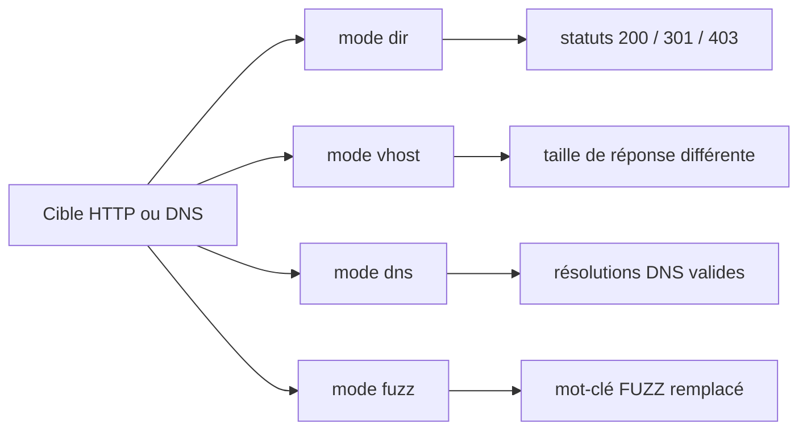

---
title: "Outil - gobuster"
type: outil
categorie: Scan Web & Fuzzing
tags:
  - cyber
  - outil
  - Scan Web & Fuzzing
statut: publie
version: 3.8.2 (septembre 2025)
licence: Apache-2.0
langage: Go
developpeur: OJ Reeves (@TheColonial) & Christian Mehlmauer (@firefart)
repo: https://github.com/OJ/gobuster
site: https://github.com/OJ/gobuster
doc: https://github.com/OJ/gobuster
---

# gobuster — Brute-force de répertoires, DNS et vhosts

> [!info] **En 1 phrase**
> gobuster brute-force les répertoires, les hôtes virtuels (vhosts) et les sous-domaines en testant des mots depuis une wordlist.

---

## Overview

| Champ | Valeur |
|---|---|
| Nom complet | gobuster |
| Description | Outil de brute-force écrit en Go qui teste des mots d'une wordlist contre des chemins HTTP, des en-têtes `Host` ou des enregistrements DNS |
| Catégorie | Scan Web & Fuzzing |
| Sous-catégorie | Découverte de contenu (`dir`), sous-domaines (`dns`), vhosts (`vhost`), buckets cloud (`s3`/`gcs`), TFTP (`tftp`), fuzzing custom (`fuzz`) |
| Fonction principale | Envoyer des requêtes HTTP/DNS en masse pour découvrir des ressources non référencées |
| Type d'outil | CLI (binaire Go autonome) |
| Licence | Apache-2.0 |
| Open source / propriétaire | Open source |
| Langage(s) de programmation | Go |
| Développeur / organisation | OJ Reeves (@TheColonial) & Christian Mehlmauer (@firefart) |
| Projet officiel | https://github.com/OJ/gobuster |
| Dépôt officiel | https://github.com/OJ/gobuster |
| Documentation officielle | README du dépôt + aide intégrée (`gobuster help`, `gobuster help <mode>`) |
| Date de création | Novembre 2014 |
| État du projet | actif (releases régulières) |
| Dernière version connue | 3.8.2 (4 septembre 2025) |
| Systèmes compatibles | Linux / Windows / macOS (binaires précompilés ; Go 1.24+ pour compiler) |
| Conteneur officiel | `ghcr.io/oj/gobuster:latest` |

> [!note] Pour vérifier / compléter
> - La version des dépôts distro (Kali `apt install gobuster`) peut être **plus ancienne** que la dernière release GitHub (v3.8.2). Vérifier avec `gobuster version`.
> - Depuis **v3.7**, le projet a changé de bibliothèque CLI : beaucoup de raccourcis courts et quelques flags ont changé (ex : le proxy est passé de `-p` à `--proxy`, le flag `-p` sert désormais aux *patterns*).

---

## Concept

gobuster est un brute-forcer écrit en Go, rapide et léger, qui envoie des requêtes HTTP/DNS en masse pour découvrir des ressources non référencées. Il s'utilise pendant la phase d'énumération web, quand le crawl passif n'a rien donné ou pour compléter un scan automatique.

Trois modes historiques : `dir` (répertoires et fichiers sur une URL), `vhost` (hôtes virtuels via l'en-tête `Host`) et `dns` (sous-domaines par résolution). Depuis v3.1/v3.2/v3.4, il s'est enrichi de modes cloud (`s3`, `gcs`), réseau (`tftp`) et d'un mode `fuzz` générique à mot-clé `FUZZ`. Chaque mode répond à un besoin précis : `dir` découvre des chemins cachés (backups, fichiers d'admin, endpoints API) ; `vhost` révèle des sites internes partagés sur la même IP mais différenciés par l'en-tête `Host` ; `dns` énumère les sous-domaines par résolution DNS directe avec gestion des wildcards. gobuster se distingue par sa légèreté (un seul binaire Go), ses statistiques en temps réel et son filtrage des statuts, ce qui le rend parfait pour une première passe d'énumération avant d'affiner avec ffuf ou Burp Intruder.

Les wordlists font la moitié du résultat : sur Kali, `/usr/share/wordlists/dirb/common.txt` (petite et rapide), `/usr/share/wordlists/dirbuster/directory-list-2.3-medium.txt` (bonne couverture) et les listes Seclists de `/usr/share/seclists/Discovery/Web-Content/` (spécialisées : api, backups, tomcat, php...). Le filtrage des résultats repose sur le couple **statut / taille de réponse** : gobuster affiche les statuts et les tailles, et une taille anormale sur des statuts identiques est souvent plus parlante que le statut lui-même. Pour un scan web authentifié, on combine `-H` (en-têtes custom, cookie de session) avec `-c` (cookies) ou `-U`/`-P` (Basic Auth) ; pour rejouer les requêtes dans Burp, le passage par `--proxy` reste le plus simple.



---

## Concepts fondamentaux

| Concept | Explication |
|---|---|
| Modes séparés | `dir`, `dns`, `vhost`, `s3`, `gcs`, `tftp`, `fuzz` : chaque mode a ses flags et sa syntaxe (`gobuster help <mode>`) |
| Wordlist | Liste de mots à tester ; `-w -` permet de la lire depuis STDIN (pipeline) |
| Statut code positif/négatif | `-s` garde les statuts listés, `-b` les exclut (défaut `404` en `dir`) ; plages supportées comme `200,300-305,404` (v3.5+) |
| Taille de réponse | `-xl`/`--exclude-length` exclut des tailles exactes ou des plages (`203-206`) : clé pour filtrer les pages wildcard |
| Wildcard | Réponse « fourre-tout » : `gobuster dir` s'arrête en erreur s'il en détecte une et propose d'exclure statut ou taille ; en `dns`, `-wc` force la poursuite |
| FQDN | En mode `dns`, la wordlist ne contient que les préfixes (ex : `admin`) et le domaine est fourni via `--domain` |
| `--append-domain` | En mode `vhost`, ajoute automatiquement le domaine cible aux mots de la wordlist (`admin` → `admin.cible.local`) |
| Threads & delay | `-t` (défaut 10) contrôle la concurrence ; `-d`/`--delay` ajoute une pause par thread entre requêtes |
| Pattern | Fichier de patterns où `{GOBUSTER}` est remplacé par chaque mot (ex : `{GOBUSTER}.html`, `api/v1/{GOBUSTER}`) |
| Wordlist offset | `-wo` reprend un scan à la N-ième ligne de la wordlist (pseudo-reprise de scan) |

---

## Installation

### Debian / Ubuntu / Kali Linux

```bash
sudo apt update && sudo apt install -y gobuster

# ou binaire précompilé (toujours dernière version)
wget https://github.com/OJ/gobuster/releases/latest/download/gobuster_3.8.2_linux_amd64.tar.gz
tar xzf gobuster_3.8.2_linux_amd64.tar.gz && sudo mv gobuster /usr/local/bin/
```

### Arch Linux

```bash
sudo pacman -S gobuster
# ou via Go
go install github.com/OJ/gobuster/v3@latest
```

### macOS

```bash
brew install gobuster
```

### Windows

```powershell
# Binaire des releases GitHub (gobuster_3.8.2_windows_amd64.zip)
# ou via Go (si Go installé)
go install github.com/OJ/gobuster/v3@latest
```

### Docker

```bash
# Image officielle GHCR
docker pull ghcr.io/oj/gobuster:latest
docker run --rm -it -v "$(pwd):/data" ghcr.io/oj/gobuster:latest dir -u http://10.10.10.10 -w /data/wordlist.txt
```

### Compilation depuis les sources

```bash
# Go 1.24+ requis
git clone https://github.com/OJ/gobuster.git && cd gobuster
go mod tidy && go build
./gobuster version
```

> [!warning] Prérequis & problèmes potentiels
> - **Go 1.24+** est requis pour compiler depuis les sources ; préférer les binaires précompilés des releases.
> - Vérifier que `$GOPATH/bin` est dans le `$PATH` après un `go install` (`export PATH=$PATH:$(go env GOPATH)/bin`).
> - Sur Windows, **impossible de définir un résolveur DNS custom** en mode `dns` (limitation Go : `--resolver` refuse de s'exécuter).

---

## Configuration

| Paramètre | Rôle | Valeur possible | Impact | Exemple |
|---|---|---|---|---|
| `-u <url>` | URL cible (dir/vhost/fuzz) | `http://10.10.10.10` | Définit la cible HTTP | `-u http://10.10.10.10` |
| `--domain <dom>` | Domaine cible (dns/vhost) | `cible.local` | Base des sous-domaines à tester | `-do cible.local` |
| `-w <wordlist>` | Wordlist | chemin, ou `-` pour STDIN | Mots testés | `-w /usr/share/seclists/...` |
| `-t <n>` | Threads (défaut 10) | nombre | Vitesse vs charge serveur | `-t 50` |
| `-d <durée>` | Délai par thread | `1500ms`, `1s` | Discrétion / évite le DoS | `-d 500ms` |
| `-s <codes>` | Statuts positifs | `200,301,403` ou plages | Ne garder que ces statuts | `-s 200,301` |
| `-b <codes>` | Statuts négatifs (défaut `404` en dir) | `301,403,404` ou plages | Exclure ces statuts | `-b 403,404` |
| `-xl <tailles>` | Exclure des tailles | `1234` ou plage `203-206` | Filtre les wildcards | `-xl 1234` |
| `-x <exts>` | Extensions à tester (dir) | `php,txt,bak` | Découvre fichiers cachés | `-x php,txt,bak` |
| `-a <ua>` / `--random-agent` | User-Agent | chaîne / aléatoire | Contourner les filtres d'UA | `-a "Mozilla/5.0"` |
| `--proxy <url>` | Proxy | `http://host:port`, `socks5://host:port` | Relai via Burp/mitmproxy | `--proxy http://127.0.0.1:8080` |
| `-c <cookies>` | Cookies de session | `session=abc` | Scan authentifié | `-c "session=abc"` |
| `-H <header>` | En-tête custom | `Nom: valeur` (répétable) | Auth, Host, etc. | `-H "X-Forwarded-For: 10.10.10.1"` |
| `-k` | Ignorer la validation TLS | On/Off | Certificats auto-signés | `-k` |
| `-o <fichier>` | Fichier de sortie | chemin | Trace exploitable | `-o gobuster.txt` |
| `-wo <n>` | Offset wordlist | nombre | Reprendre un scan | `-wo 50000` |

> [!note] À vérifier
> Certains raccourcis courts ont changé avec la bibliothèque CLI de v3.7 : consulter `gobuster dir --help`, `gobuster vhost --help` et `gobuster dns --help` sur la version installée avant de dépendre d'un alias.

---

## Architecture interne

- **Un binaire Go, 7 modes** : `dir`, `dns`, `vhost`, `s3`, `gcs`, `tftp`, `fuzz` — chaque mode est un plugin (`gobusterdir`, `gobusterdns`, `gobustervhost`...) avec ses options propres, reliés par un noyau commun (`libgobuster`).
- **Goroutines** : la concurrence Go (`-t`, défaut 10) multiplexe les requêtes ; `-d`/`--delay` espère les requêtes par thread, `--retry`/`--retry-attempts` (3 par défaut) relancent en cas de timeout.
- **Pile HTTP** : contrôle fin de la connexion (`--timeout` 10 s par défaut), validation TLS (`-k`), proxy HTTP/SOCKS5, TLS client (mutual TLS via PEM ou PKCS#12), re-négociation TLS (`--tls-renegotiation`), interface réseau sortante (`--interface`/`--local-ip`).
- **Résolution DNS** : en mode `dns`, résolveur custom (`--resolver`), protocole UDP/TCP (`--protocol`), gestion des wildcards (`--wildcard`), `--no-fqdn` pour laisser le resolver utiliser les search domains système.
- **Filtrage** : chaque réponse est évaluée contre statuts positifs/négatifs et tailles exclues ; `--exclude-hostname-length` (v3.8) ajuste dynamiquement la taille selon la longueur du hostname dans les réponses vhost.
- **Patterns** : `-p` (patterns appliqués à chaque mot, `{GOBUSTER}` remplacé) et `-pd` (patterns appliqués aux réponses retenues) — peut multiplier le nombre de requêtes.
- **Progress & sortie** : barre de progression (désactivée automatiquement quand la sortie est redirigée), mode silencieux (`-q`), sortie sans couleurs (`-nc`), logs `--debug`.
- **Automaxprocs** : depuis v3.7, gobuster respecte les limites CPU dans Docker (automaxprocs).

Flux type : wordlist (ou STDIN) → mots transformés par les patterns → requêtes HTTP/DNS concurrentes → filtrage statut/taille → sortie console + fichier `-o`.

---

## Commandes

### Commandes principales

```bash
# Mode dir : découverte de répertoires et fichiers
gobuster dir -u http://cible.local -w /usr/share/wordlists/dirbuster/directory-list-2.3-medium.txt -t 50 -x php,html,txt

# Mode vhost : détection d'hôtes virtuels via l'en-tête Host
gobuster vhost -u http://cible.local -w /usr/share/seclists/Discovery/DNS/subdomains-top1million-5000.txt --append-domain

# Mode dns : énumération de sous-domaines par résolution
gobuster dns -do cible.local -w /usr/share/seclists/Discovery/DNS/subdomains-top1million-5000.txt -t 30
```

| Commande | Objectif | Résultat attendu |
|---|---|---|
| `gobuster dir -u http://x -w wl` | Découverte de répertoires | Chemins existants listés avec statut |
| `gobuster dns -do x.com -w wl` | Sous-domaines | Noms DNS résolus |
| `gobuster vhost -u http://x -w wl --append-domain` | Vhosts | Hôtes virtuels révélés (taille différente) |
| `gobuster s3 -w wl` | Buckets AWS S3 | Buckets publics trouvés |
| `gobuster gcs -w wl` | Buckets Google Cloud Storage | Buckets publics trouvés |
| `gobuster tftp -s 10.0.0.1 -w wl` | Fichiers sur serveur TFTP | Fichiers téléchargeables |
| `gobuster fuzz -u "http://x/FUZZ" -w wl` | Fuzzing custom | Réponses différentes pour chaque mot |

### Commandes avancées

```bash
# dir avec extensions + exclusions + suivi des redirections + URLs complètes
gobuster dir -u http://10.10.10.10 -w wordlist.txt -x php,bak,txt -b 301,403 -r -e -o scan.txt

# vhost en filtrant une taille connue (baseline) et des statuts
gobuster vhost -u http://10.10.10.10 -w subdomains.txt --append-domain -xl 1234 -xs 403,404

# dns avec résolveur custom en TCP et vérification CNAME
gobuster dns -do cible.local -w subdomains.txt --resolver 8.8.8.8:53 --protocol tcp -c

# fuzz du corps POST et des headers (mot-clé FUZZ)
gobuster fuzz -u http://10.10.10.10/login.php -d "user=admin&pass=FUZZ" -w passwords.txt
gobuster fuzz -u http://10.10.10.10 -H "X-Custom-Header: FUZZ" -w header-values.txt

# Relai via Burp et reprise à la ligne 50000 de la wordlist
gobuster dir -u http://10.10.10.10 -w big.txt --proxy http://127.0.0.1:8080 -wo 50000
```

---

## Options et flags

| Option | Description | Exemple | Niveau |
|---|---|---|---|
| `-u <url>` | URL cible (dir/vhost/fuzz) | `-u http://10.10.10.10` | Basic |
| `-w <wordlist>` | Wordlist (`-` = STDIN) | `-w common.txt` | Basic |
| `-t <n>` | Threads (défaut 10) | `-t 50` | Basic |
| `-q` | Mode silencieux (masque le banner) | `-q` | Basic |
| `-o <fichier>` | Fichier de sortie | `-o scan.txt` | Basic |
| `-a <ua>` | User-Agent custom | `-a "curl/8.0"` | Basic |
| `-s <codes>` | Statuts positifs (plages OK) | `-s 200,301` | Intermediate |
| `-b <codes>` | Statuts négatifs (défaut `404`) | `-b 403,404` | Intermediate |
| `-x <exts>` | Extensions testées | `-x php,bak` | Intermediate |
| `-X <fichier>` | Extensions chargées depuis un fichier | `-X exts.txt` | Intermediate |
| `-c <cookies>` | Cookies de session | `-c "PHPSESSID=abc"` | Intermediate |
| `-U <user>` | Basic Auth : utilisateur | `-U admin` | Intermediate |
| `-P <pass>` | Basic Auth : mot de passe | `-P secret` | Intermediate |
| `-H <header>` | En-tête custom (répétable) | `-H "Authorization: Bearer ..."` | Intermediate |
| `-r` | Suivre les redirections | `-r` | Intermediate |
| `-m <méthode>` | Méthode HTTP (défaut GET) | `-m POST` | Intermediate |
| `-e` | Mode expanded (URLs complètes) | `-e` | Intermediate |
| `-f` | Ajouter `/` à chaque requête | `-f` | Intermediate |
| `-n` | Ne pas afficher les statuts | `-n` | Intermediate |
| `--proxy <url>` | Proxy HTTP/SOCKS5 | `--proxy http://127.0.0.1:8080` | Intermediate |
| `-d <durée>` | Délai entre requêtes par thread | `-d 500ms` | Intermediate |
| `--random-agent` | User-Agent aléatoire | `--random-agent` | Intermediate |
| `-k` | Ignorer la validation TLS | `-k` | Intermediate |
| `-to <durée>` | Timeout HTTP/DNS | `-to 20s` | Intermediate |
| `-xl <tailles>` | Exclure des tailles (plages OK) | `-xl 1234,203-206` | Advanced |
| `-db` | Chercher les backups des fichiers trouvés | `-db` | Advanced |
| `-hl` | Masquer la taille du corps | `-hl` | Advanced |
| `-wo <n>` | Offset dans la wordlist | `-wo 50000` | Advanced |
| `-p <fichier>` | Fichier de patterns (`{GOBUSTER}`) | `-p patterns.txt` | Advanced |
| `-pd <fichier>` | Patterns appliqués aux résultats retenus | `-pd re-patterns.txt` | Advanced |
| `--retry` | Relancer les requêtes en timeout | `--retry` | Advanced |
| `-ra <n>` | Nb de tentatives en cas de retry | `-ra 5` | Advanced |
| `--interface <if>` | Interface réseau sortante | `--interface eth0` | Advanced |
| `--local-ip <ip>` | IP source sortante | `--local-ip 10.10.10.2` | Advanced |
| `--tls-renegotiation` | Activer la re-négociation TLS | `--tls-renegotiation` | Advanced |
| `--debug` | Logs de debug (requêtes HTTP) | `--debug` | Expert |
| `-np` / `-ne` | Masquer la progression / les erreurs | `-np` | Expert |
| `-nc` | Désactiver les couleurs | `-nc` | Expert |
| `-ad` | `--append-domain` (mode vhost) | `-ad` | Advanced |
| `-xs <codes>` | Exclure des statuts (mode vhost) | `-xs 403,404` | Advanced |
| `-xh` | `--exclude-hostname-length` (v3.8, avec `-xl`) | `-xh` | Expert |
| `-wc` | Forcer la poursuite sur wildcard DNS | `-wc` | Advanced |
| `-nf` | `--no-fqdn` (ne pas ajouter de point final DNS) | `-nf` | Advanced |
| `--resolver <dns>` | Résolveur DNS custom | `--resolver 8.8.8.8:53` | Advanced |
| `--protocol <p>` | UDP ou TCP pour le resolver | `--protocol tcp` | Advanced |
| `-ccp <pem>` / `-ccp12 <p12>` | TLS client (PEM ou PKCS#12) | `-ccp client.pem` | Expert |

> [!tip] Options les plus utiles au quotidien
> `-b 403,404` (ou `-xl <taille>`) pour réduire le bruit, `-x php,txt,bak` pour les fichiers cachés, `-e` pour les URLs complètes, `-o scan.txt` pour la trace, et `--proxy http://127.0.0.1:8080` pour rejouer dans Burp.

---

## Exemples pratiques

### Beginner

```bash
# Objectif : premier scan de répertoires
gobuster dir -u http://10.10.10.10 -w /usr/share/wordlists/dirb/common.txt -t 20 -e

# Objectif : énumération de sous-domaines
gobuster dns -do cible.local -w /usr/share/seclists/Discovery/DNS/subdomains-top1million-5000.txt -t 30
# Résultat attendu : sous-domaines résolus listés avec leurs IP
```

### Intermediate

```bash
# Objectif : découverte de fichiers avec extensions et exclusion du bruit
gobuster dir -u http://10.10.10.10 -w /usr/share/wordlists/dirbuster/directory-list-2.3-medium.txt \
  -x php,txt,bak,zip -b 403,404 -t 40 -o gobuster.txt

# Objectif : scan authentifié avec cookie de session
gobuster dir -u http://10.10.10.10/admin -w wordlist.txt -c "PHPSESSID=abc123" -b 403,404

# Objectif : détection de vhosts en filtrant la taille de la page par défaut
gobuster vhost -u http://10.10.10.10 -w subdomains.txt --append-domain -k -t 20
# Une taille différente de la baseline = vhost potentiel.
```

### Advanced

```bash
# Objectif : fuzzing de paramètres GET via le mode fuzz
gobuster fuzz -u "http://10.10.10.10/page.php?FUZZ=1" -w params.txt -b 404

# Objectif : fuzzing du corps POST (login)
gobuster fuzz -u http://10.10.10.10/login.php -d "user=admin&pass=FUZZ" -w passwords.txt -b 401

# Objectif : énumération DNS avec wildcard et CNAME
gobuster dns -do cible.local -w subdomains.txt -c -wc --resolver 1.1.1.1:53
```

### Expert

```bash
# Objectif : patterns pour tester plusieurs chemins par mot
echo "api/v1/{GOBUSTER}" > patterns.txt
gobuster dir -u http://10.10.10.10 -w words.txt -p patterns.txt -b 404 -e

# Objectif : mutual TLS (certificat client)
gobuster dir -u https://10.10.10.10 -w wordlist.txt -ccp client.pem -ccpk client-key.pem -k

# Objectif : relai complet via Burp + reprise de scan
gobuster dir -u http://10.10.10.10 -w big.txt --proxy http://127.0.0.1:8080 -wo 50000 -o suite.txt
```

---

## Workflow complet (scénario pas à pas)

1. **Vérifier que la cible répond** :
   ```bash
   curl -I http://10.10.10.10
   ```
2. **Lancer un brute-force de répertoires** avec des extensions web courantes :
   ```bash
   gobuster dir -u http://10.10.10.10 -w /usr/share/wordlists/dirb/common.txt -x php,txt,bak,zip -t 30 -o gobuster.txt
   ```
3. **Analyser les résultats** : les `200` sont à visiter, les `301` signalent des redirections souvent intéressantes, les `403` peuvent cacher des fichiers restreints :
   ```bash
   # Ne garder que les ressources réellement servies (statut 200)
   grep "Status: 200" gobuster.txt
   ```
4. **Chercher des hôtes virtuels** :
   ```bash
   gobuster vhost -u http://10.10.10.10 -w /usr/share/seclists/Discovery/DNS/subdomains-top1million-5000.txt --append-domain -k
   ```
5. **Ajouter un vhost découvert** dans `/etc/hosts`, puis relancer un scan `dir` dessus :
   ```bash
   echo "10.10.10.10 admin.cible.local" | sudo tee -a /etc/hosts
   gobuster dir -u http://admin.cible.local -w /usr/share/wordlists/dirb/common.txt -x php -t 30
   ```
6. **Rejouer les requêtes dans Burp** et sauvegarder les résultats :
   ```bash
   gobuster dir -u http://10.10.10.10 -w /usr/share/wordlists/dirb/common.txt --proxy http://127.0.0.1:8080 -o gobuster.txt
   ```

---

## Scénarios avancés

### Scénario 1 : découverte d'endpoints d'API cachés

```bash
gobuster dir -u http://cible.local/api -w /usr/share/seclists/Discovery/Web-Content/api/objects.txt \
  -x json,php,xml -t 50 -b 403,404 -o api_scan.txt
```
Les listes dédiées (`api/objects.txt`) ciblent les noms de ressources typiques des API REST et réduisent le bruit par rapport aux wordlists génériques.

### Scénario 2 : scan vhosts en filtrant tailles et statuts

```bash
gobuster vhost -u http://10.10.10.10 -w subdomains.txt --append-domain -xl 1234 -xs 403,404 -t 20
# -xl et -xs (v3.7+) permettent de filtrer directement la baseline
# Repérer les réponses dont la taille diffère du vhost par défaut (clé du filtrage).
```

### Scénario 3 : énumération DNS de sous-domaines avec résolveur dédié

```bash
gobuster dns -do cible.local -w /usr/share/seclists/Discovery/DNS/subdomains-top1million-5000.txt \
  -t 30 --resolver 8.8.8.8:53 -c
# -c vérifie les CNAME ; repérer les sous-domaines internes (admin, dev, git, vpn)
```
Croiser ensuite avec [[Outil - httpx|httpx]] pour valider les sous-domaines vivants et le contenu servi.

### Scénario 4 : reprise d'un scan interrompu

```bash
# Le scan s'était arrêté vers la ligne 50000 d'une wordlist de 300000 lignes
gobuster dir -u http://10.10.10.10 -w big.txt -wo 50000 -o scan_suite.txt
# -wo (v3.6+) reprend à la position donnée ; cumuler ensuite les deux fichiers de sortie.
```

---

## Cybersecurity use cases

| Phase | Utilisation |
|---|---|
| Reconnaissance | Découverte de répertoires, fichiers et endpoints cachés (`dir`) |
| Énumération | Sous-domaines (`dns`), vhosts (`vhost`), buckets cloud (`s3`/`gcs`), fichiers TFTP (`tftp`) |
| Vulnérabilité | Recherche de fichiers sensibles (backups `-db`, extensions `-x`), endpoints API non protégés |
| Exploitation | Fuzzing ciblé de valeurs, paramètres et en-têtes via le mode `fuzz` |
| Post-exploitation | Énumération de chemins sur des services internes via requêtes relayées (`--proxy`) |
| Rapport | Sortie texte `-o` parseable pour intégration aux rapports |

---

## MITRE ATT&CK

| Tactique | Technique / Sub-technique | ID | Raison | Détection | Mitigation |
|---|---|---|---|---|---|
| Reconnaissance | Active Scanning : Wordlist Scanning | T1595.003 | Brute-force de chemins/vhosts/sous-domaines avec wordlists | Burst de requêtes sur chemins inconnus | Rate limiting, WAF, CAPTCHA |
| Discovery | Application Layer Protocol : Web Protocols | T1071.001 | Requêtes HTTP massives à haute fréquence | Corrélation SIEM des patterns | — |
| Discovery | DNS | T1002 (renvoi) / T1010 — voir note | Énumération de sous-domaines via résolutions DNS | Volumes anormaux de requêtes DNS | Rate limiting DNS, monitoring |
| Initial Access | Exploit Public-Facing Application | T1190 | Découverte d'endpoints vulnérables via fuzzing | Alertes sur patterns d'exploitation | Patching, validation d'entrée |
| Credential Access | Brute Force | T1110 | Fuzzing de credentials via mode `fuzz` (corps POST) | Échecs de connexion massifs | Verrouillage, MFA, rate limiting |

> [!note] Ne renseigner que si l'association est réellement pertinente.
> L'association la plus spécifique est **T1595.003** (Wordlist Scanning). T1110 ne s'applique qu'aux fuzzings d'authentification via `gobuster fuzz`.

---

## Defensive Security

### Signes observables

| Indicateur | Détail |
|---|---|
| Pic massif de requêtes HTTP vers des chemins inexistants | Journaliser les logs HTTP et corréler les patterns de fuzzing (SIEM) |
| User-Agent `gobuster/<version>` identifiable | Bloquer les UA connus d'outils, rate limiting applicatif |
| Réponses 429 / ralentissement | Rate limiting applicatif (nginx `limit_req`, WAF) |
| Volumes anormaux de requêtes DNS (mode `dns`) | Monitoring des résolveurs DNS, alerte sur les rafales de résolutions |
| Visites sur des faux répertoires (`/secret-bait`) | Honeypots web : réponse factice + alerting à la visite |
| Requêtes avec en-têtes `Host` variés sur la même IP (mode `vhost`) | Journaliser le hostname et alerter sur les variations |

### Règles de détection (Sigma / Suricata / Snort / YARA)

```yaml
# Sigma (pédagogique - à adapter) : rafale de requêtes HTTP typique d'un fuzzer de répertoires
title: High-Rate HTTP Directory Fuzzing (gobuster-like)
status: experimental
logsource:
    category: webserver
    product: nginx
detection:
    selection:
        http.user_agent|startswith: gobuster/
        sc-status:
            - 404
            - 403
    condition: selection
    timeframe: 1m
    aggregation: count > 300
falsepositives:
    - Crawlers de monitoring
level: medium
```

```bash
# Suricata/Snort (pédagogique) : fréquence élevée de GET avec UA gobuster
alert tcp any any -> any 80 (msg:"Gobuster directory fuzzing"; flow:to_server,established; content:"GET"; http.method; content:"gobuster/"; http.user_agent; threshold:type both, track by_src, count 300, seconds 30; classtype:attempted-recon; sid:66000015; rev:1;)
```

```yaml
# YARA : binaire gobuster présent sur un poste
rule Gobuster_Binary {
    meta:
        description = "Binaire gobuster"
        author = "Équipe SOC"
    strings:
        $a = "gobuster" ascii wide
        $b = "By OJ Reeves & Christian Mehlmauer" ascii wide
        $c = "Directory/File, DNS and VHost busting tool" ascii wide
    condition:
        filesize > 3MB and 2 of them
}
```

---

## Automatisation

```bash
# Lancer des scans en série et agréger les résultats
for mode in dir vhost; do
  gobuster $mode -u http://10.10.10.10 -w wordlist.txt -b 403,404 -q -o ${mode}.txt
done
# Concaténer et trier les chemins découverts
cat dir.txt vhost.txt | sort -u > all_found.txt
```

```bash
# Pipeline : générer une wordlist custom puis lancer gobuster dessus
cat words.txt | gobuster dir -u http://10.10.10.10 -w - -b 404 -q
```

```python
# Python : lancer gobuster en sous-processus et parser la sortie
import subprocess
import re

result = subprocess.run(
    ["gobuster", "dir", "-u", "http://10.10.10.10", "-w", "wordlist.txt",
     "-b", "403,404", "-e", "-q"],
    capture_output=True, text=True, check=True
)

pattern = re.compile(r"(\S+)\s+\(Status:\s+(\d+)\)")
for path, status in pattern.findall(result.stdout):
    print(path, status)
```

```python
# Python : vérifier ensuite chaque chemin découvert
import re
import subprocess
import requests

out = subprocess.run(
    ["gobuster", "dir", "-u", "http://10.10.10.10", "-w", "wordlist.txt",
     "-b", "404", "-e", "-q"],
    capture_output=True, text=True, check=True
).stdout

for url, status in re.findall(r"(\S+)\s+\(Status:\s+(\d+)\)", out):
    r = requests.get(url, timeout=10, verify=False)
    print(f"[{r.status_code}] {url} ({len(r.content)} octets)")
```

---

## Output et parsing

gobuster écrit en **texte brut** (pas de JSON natif). Par défaut les lignes ressemblent à `/admin (Status: 200) [Size: 1234]` ; avec `-e`, les URLs complètes sont affichées.

```bash
# Exemple de sortie réelle
gobuster dir -u http://10.10.10.10 -w common.txt -e -q
# /admin (Status: 200) [Size: 1234]
# /backup.zip (Status: 301) [Size: 0] [--> /backup.zip/]
```

```bash
# Filtrer par statut
grep "Status: 200" scan.txt

# Extraire uniquement les chemins
cut -d ' ' -f 1 scan.txt

# Compter les résultats par statut
grep -oP 'Status: \K[0-9]+' scan.txt | sort | uniq -c

# URLs complètes exploitables
grep -E "Status: (200|301|403)" scan.txt | awk '{print $1}'
```

> [!note] À vérifier
> Le format exact des lignes (espaces, brackets) dépend de la version : sur la v3.8.2 il est `path (Status: N) [Size: N]`. Inspecter un premier scan pour adapter le parsing.

---

## Intégrations

```text
gobuster -> wordlist SecLists -> cible web -> sortie texte
gobuster -> proxy Burp (--proxy http://127.0.0.1:8080) -> inspection des requêtes
gobuster dns -> httpx -> validation des sous-domaines vivants
```

- [[Tools| Outils]] global
- [[Outil - ffuf]] — fuzzer générique plus fin pour la phase suivante
- [[Outil - Feroxbuster]] / [[Outil - dirsearch]] — alternatives de découverte de contenu
- [[Outil - httpx]] — valider les vhosts/sous-domaines trouvés par `dns`/`vhost`
- [[Outil - Burp Suite]] — relayer/inspecter les requêtes via `--proxy`
- [[Outil - nuclei]] — tester les endpoints découverts avec des templates
- [[Techniques/Virtual Hosts|Virtual Hosts]] · [[Techniques/Hidden Parameters|Hidden Parameters]] · [[Techniques/Brute Force Rate Limit|Brute Force Rate Limit]] · [[03 - Exploitation Web|Exploitation Web]]

---

## Alternatives

| Outil | Avantages | Inconvénients | Cas d'usage |
|---|---|---|---|
| ffuf | Plus rapide, matcher/filter riches, cartésien, auto-calibration | Syntaxe moins simple pour débuter | Fuzzing fin et ciblé |
| Feroxbuster | Récursion auto, filtres riches, très rapide | Orienté chemins (pas de multi-position) | Découverte de contenu récursive |
| dirsearch | Python, exports multiples, API importable | Plus lent | Postes Python uniquement |
| wfuzz | Fuzzing multi-position, encodages, très flexible | Plus lent, UX datée | Fuzzing avancé de payloads |
| Dirb / DirBuster | Natif Kali / GUI Java | Lents, limités | Scans de secours |

> **Quand utiliser gobuster plutôt que les autres ?** Pour une **première passe d'énumération rapide et simple** : les modes `dir`, `dns` et `vhost` couvrent 90 % des besoins en une commande, avec un seul binaire Go sans dépendances. On passe ensuite à [[Outil - ffuf|ffuf]] pour le fuzzing fin (paramètres, valeurs, cartésien).

---

## Performance

- **Vitesse** : binaire Go léger, concurrence par goroutines (`-t`, défaut 10 threads) ; très rapide sur les cibles réactives.
- **Débit** : `-d`/`--delay` espère les requêtes par thread ; `--retry`/`-ra` relancent en cas de timeout sans casser le scan.
- **Mémoire** : faible (pas de stockage des réponses en mémoire, seuls les métadonnées filtrent) ; dépend surtout des wordlists.
- **Réseau** : timeout HTTP par défaut 10 s (`-to`), timeout DNS 1 s ; résolveur custom `--resolver` pour éviter un DNS lent.
- **Docker** : automaxprocs (v3.7+) utilise les limites CPU du conteneur.
- **Cible** : sur cibles fragiles, réduire `-t` et ajouter `-d` pour éviter le mini-DoS et les timeouts massifs.

> [!note] À vérifier
> Pas de benchmark officiel : les performances dépendent de la cible, du réseau, de la wordlist et des threads. Toujours tester en lab.

---

## Troubleshooting

### Common problems

#### Problème : erreur « wildcard » dès le début du scan dir

- **Cause** : le serveur répond la même chose pour tous les chemins (page custom en 200, SPA).
- **Solution** : exclure la taille avec `-xl <taille>` ou le statut avec `-b <code>`.
- **Vérification** : `curl -s http://10.10.10.10/randompath | wc -c` puis `-xl` sur cette taille.

#### Problème : mode vhost ne donne que des faux positifs ou rien

- **Cause** : `--append-domain` oublié (les mots ne sont pas qualifiés), ou proxy HTTP + URL HTTP (go bust le Host).
- **Solution** : ajouter `--append-domain` ; si un `--proxy http://` est utilisé avec une URL `http://`, gobuster refuse (v3.7+) — utiliser HTTPS ou `--force`.
- **Vérification** : `gobuster vhost --help` et relancer sans proxy.

#### Problème : `-p http://...` n'est plus reconnu

- **Cause** : depuis v3.7, `-p` est le fichier de **patterns**, le proxy est passé via `--proxy`.
- **Solution** : remplacer `-p http://127.0.0.1:8080` par `--proxy http://127.0.0.1:8080`.

#### Problème : des mots contenant `#` remontent en faux positifs

- **Cause** : depuis v3.7, les lignes commençant par `#` ne sont **plus ignorées** dans les wordlists.
- **Solution** : nettoyer la wordlist (`grep -v '^#' wordlist > clean.txt`).

#### Problème : `--resolver` refuse de s'exécuter sur Windows

- **Cause** : limitation Go de la résolution custom sur Windows.
- **Solution** : utiliser le résolveur système (sans `--resolver`), ou lancer depuis WSL/Linux.

---

## Sécurité de l'outil

- **Volumétrie** : un scan `dir` avec `-t 100` sans `-d` est un **mini-DoS** potentiel — toujours adapter le débit à la cible autorisée.
- **Binaires** : ne télécharger que depuis **GitHub releases** (checksums fournis) ; les builds locaux non taggés ne sont pas des versions officielles.
- **Credentials** : cookies (`-c`), Basic Auth (`-U`/`-P`) et headers (`-H`) passés en CLI apparaissent dans l'historique du shell — préférer des variables d'environnement ou un fichier de script protégé.
- **Proxy** : relayer via Burp/mitmproxy expose les requêtes à l'outil intermédiaire — normal en lab, à surveiller sur données sensibles.
- **Modèle** : aucune fonctionnalité d'évasion « magique » ; `--random-agent` et `-d` sont de simples mesures de discrétion, pas des garanties.

---

## Limitations

- **Pas de GUI** : tout en CLI ; aucune fonctionnalité graphique ou mode serveur.
- **Pas de récursion native** : il faut relancer `dir` sur chaque répertoire découvert (contrairement à Feroxbuster).
- **Pas de reprise de scan** native : seulement `-wo` pour reprendre à une ligne de wordlist ; les résultats déjà trouvés ne sont pas fusionnés automatiquement.
- **Pas de sortie JSON** : sortie texte uniquement (`-o`) ; le parsing est à faire soi-même.
- **Pas de produit cartésien** multi-wordlists (contrairement à ffuf) : le mode `fuzz` n'accepte qu'une wordlist par position.
- **DNS custom** : `--resolver` non disponible sur Windows.
- **Version distro** : le paquet Kali/apt peut être bien plus ancien que la v3.8.2 GitHub.

---

## Cheatsheet

```bash
# Découverte de répertoires
gobuster dir -u http://10.10.10.10 -w common.txt -t 30 -e -o scan.txt

# Avec extensions et exclusions
gobuster dir -u http://10.10.10.10 -w wordlist.txt -x php,txt,bak -b 403,404

# Détection de vhosts
gobuster vhost -u http://10.10.10.10 -w subdomains.txt --append-domain -k -xl 1234

# Énumération de sous-domaines
gobuster dns -do cible.local -w subdomains.txt -t 30 --resolver 8.8.8.8:53

# Fuzzing custom (paramètre GET)
gobuster fuzz -u "http://10.10.10.10/page.php?FUZZ=1" -w params.txt -b 404

# Scan authentifié + relai Burp
gobuster dir -u http://10.10.10.10 -w wordlist.txt -c "SESSION=abc" --proxy http://127.0.0.1:8080

# Discrétion
gobuster dir -u http://10.10.10.10 -w wordlist.txt -t 5 -d 500ms
```

---

## Quick reference

| | |
|---|---|
| **À quoi sert-il ?** | Brute-force de répertoires, vhosts et sous-domaines à partir de wordlists |
| **Quand l'utiliser ?** | Première passe d'énumération web/DNS, avant le fuzzing fin avec ffuf |
| **Commande principale** | `gobuster dir -u http://10.10.10.10 -w common.txt -b 403,404` |
| **Alternative principale** | ffuf (fin), Feroxbuster (récursif), dirsearch (Python) |
| **Concepts importants** | Modes (`dir`/`dns`/`vhost`), statuts positif/négatif, tailles exclues, wildcards, `--append-domain` |
| **Liens associés** | [[Outil - ffuf]] · [[Outil - Feroxbuster]] · [[Outil - httpx]] · [[Techniques/Virtual Hosts]] |

---

## Détection & Défense

| Signe | Défense |
|---|---|
| Logs HTTP avec volume anormal vers des chemins inexistants | Rate limiting, WAF avec règles de détection de brute-force |
| User-Agent `gobuster/<version>` dans les logs | Bloquer les UA connus d'outils, rate limiting applicatif |
| Réponses `429 Too Many Requests` | Confirmer qu'un limiteur est actif et l'ajuster |
| Visites sur de faux répertoires (`/secret-bait`) | Honeypots déclenchant une alerte à la visite |
| Bannissement après N requêtes 404 sur une fenêtre courte | Protection anti-brute-force applicative |
| Rafales de résolutions DNS vers un même domaine | Monitoring des résolveurs et des logs DNS |
| En-têtes `Host` variés sur la même IP en peu de temps | Journaliser le hostname, alerter sur les variations |

---

## Tips & Pièges

> [!tip] **Tips**
> - Passe par un proxy (`--proxy http://127.0.0.1:8080`) pour rejouer les requêtes dans Burp et exporte le résultat avec `-o` pour le réutiliser ensuite.
> - Utilise des wordlists spécifiques (Seclists `Discovery/Web-Content`) plutôt que `common.txt` pour gagner en pertinence.
> - `-t 50` ou plus accélère nettement les gros scans ; surveille les timeouts et réduis si besoin.
> - Compare toujours les **tailles de réponse** : un `200` de 10 Ko peut cacher une page d'erreur custom, tandis qu'un `403` de 0 octet est souvent un vrai dossier protégé.
> - `-s 200,204,301` (mode dir) n'affiche QUE les statuts souhaités : utile pour noyer le bruit quand le site répond 404 partout.
> - En mode `dns`, force un résolveur public en lab (`--resolver 8.8.8.8:53`) pour ne pas dépendre d'un DNS filtrant.

> [!warning] **Pièges**
> - Le mode `dir` remonte beaucoup de faux positifs avec les statuts `403` ; exclut les extensions inutiles et les codes redondants (`-b 301,403`) pour réduire le bruit.
> - Sans `--append-domain`, le mode `vhost` concatène les mots sans le domaine cible : les requêtes partent en erreur (un warning existe depuis v3.7).
> - Depuis v3.7, `-p` ne désigne **plus** le proxy mais le fichier de patterns ; le proxy est `--proxy`.
> - En mode `dns`, sans `--resolver`, gobuster utilise le résolveur système : un DNS filtrant peut fausser l'énumération.
> - Les lignes de wordlist commençant par `#` sont désormais testées (v3.7+) : nettoie ta wordlist.
> - Un proxy HTTP avec une URL `http://` en mode `vhost` est **refusé** (v3.7+) : passe en HTTPS ou utilise `--force` en connaissance de cause.

---

## References

### Official

- GitHub officiel : https://github.com/OJ/gobuster
- Releases : https://github.com/OJ/gobuster/releases
- Docs Go (module v3) : https://pkg.go.dev/github.com/OJ/gobuster/v3
- Kali Tools (gobuster) : https://www.kali.org/tools/gobuster/

### Security references

- MITRE ATT&CK T1595 — Active Scanning : https://attack.mitre.org/techniques/T1595/
- MITRE ATT&CK T1110 — Brute Force : https://attack.mitre.org/techniques/T1110/
- OWASP Testing Guide — Fuzzing : https://owasp.org/www-project-web-security-testing-guide/

### Community

- SecLists (wordlists) : https://github.com/danielmiessler/SecLists
- FuzzDB : https://github.com/fuzzdb-project/fuzzdb
- Guide tiers (HackTarget) : https://hackertarget.com/gobuster-tutorial/

---

**Liens :** [[Tools| Outils]] · [[Outil - ffuf|ffuf]] · [[Outil - Feroxbuster|Feroxbuster]] · [[Outil - httpx|httpx]] · [[Techniques/Virtual Hosts|Virtual Hosts]] · [[Techniques/Hidden Parameters|Hidden Parameters]] · [[03 - Exploitation Web|Exploitation Web]]
