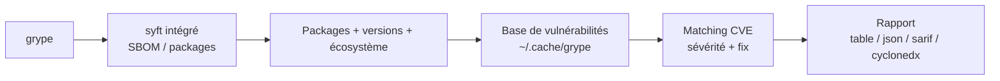
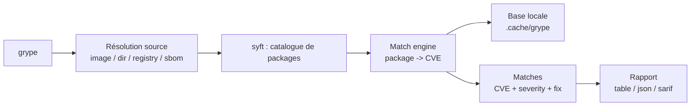

# 🐛 grype - Le scanner de vulnérabilités d'images (Anchore)

> [!info] **En 1 phrase**
> grype analyse une image conteneur ou un filesystem pour lister les CVE des packages, couplé à syft pour la génération de SBOM : la réponse rapide et légère à trivy.

---

## 🧾 Overview

| Champ | Valeur |
|---|---|
| Nom complet | grype |
| Description | Scanner de vulnérabilités pour images conteneurs et filesystems : détecte les packages, croise avec une base de CVE (NVD, GitHub, distros) et restitue sévérités et correctifs |
| Catégorie | 🔒 Cloud & Containers |
| Sous-catégorie | DevSecOps / Scanner de vulnérabilités / Analyse d'images |
| Type d'outil | CLI Go (binaire unique) |
| Licence | Apache-2.0 |
| Open source / propriétaire | Open source |
| Langage(s) de programmation | Go |
| Développeur / organisation | Anchore |
| Projet officiel | https://github.com/anchore/grype |
| Dépôt officiel | https://github.com/anchore/grype |
| Documentation officielle | https://grype.anchore.io/ |
| Date de création | 2020 |
| État du projet | actif |
| Dernière version connue | v0.117.0 |
| Systèmes compatibles | Linux, macOS, Windows ; Docker, GitHub Actions |

> [!note] Pour vérifier / compléter
> Version vérifiée sur https://github.com/anchore/grype/releases (v0.117.0). grype est étroitement lié à syft (découverte des packages) : la paire Anchore est l'alternative classique à trivy.

---

## 🎯 Concept

grype utilise **syft** (intégré ou en commande externe) pour générer un SBOM du contenu d'une image ou d'un filesystem, puis croise chaque package (nom + version + écosystème) avec sa **base de vulnérabilités** locale (`~/.cache/grype`). Le résultat : une liste de CVE avec sévérité (CRITICAL/HIGH/MEDIUM/LOW), version installée, version corrigée et écosystème concerné.

En pentest, grype sert à :
- **Évaluer une image récupérée** (registre, cache local, conteneur en post-exploitation) pour trouver une CVE avec RCE exploitable.
- **Cartographier l'empreinte logicielle** d'un conteneur compromis avant de choisir la technique d'escalade.
- **Identifier les secrets ou composants obsolètes** dans des exports de volumes.

Sa différence avec trivy : grype est **focalisé sur les vulnérabilités** (pas de scan de secrets/misconfigs intégré), mais il est très rapide, simple et **parfaitement intégré à syft** pour les workflows SBOM.



---

## 🧠 Concepts fondamentaux

| Concept | Explication |
|---|---|
| Package | Composant logiciel détecté (dpkg, rpm, apk, npm, pip, go, jar, ...) avec version |
| SBOM | Inventaire des packages ; grype en produit un en interne via syft |
| Base de vulnérabilités | Données locales (`.cache/grype`) croisant NVD, GitHub Advisory et advisories distros |
| Matching | Algorithme reliant un package à une CVE (par écosystème et fourchette de versions) |
| Sévérité | CRITICAL, HIGH, MEDIUM, LOW, UNKNOWN selon la source de l'advisory |
| Fixed version | Version corrigée ; l'absence indique qu'aucun correctif n'est encore publié |
| Source | Ce qui est analysé : image, `dir:`, `registry:`, `docker:`, `sbom:`, `oci:`, `file:` |
| Configuration | Fichier `~/.grype.yaml` (ou `GRYPE_*` env) pour les seuils et les bases |

---

## 🛠️ Installation

grype s'installe en binaire unique, via curl, Homebrew, Docker ou les sources.

### Binaire (Linux / macOS)

```bash
# Script officiel
curl -sSfL https://raw.githubusercontent.com/anchore/grype/main/install.sh | sh -s -- -b /usr/local/bin

# Ou via Homebrew
brew tap anchore/grype && brew install grype
```

### Windows

```powershell
# via winget
winget install anchore.grype
```

### Docker

```bash
# via le binaire conteneurisé (l'image locale doit être sauvée)
docker save <image> -o image.tar
docker run --rm -v "$(pwd)":/src anchore/grype:latest /src/image.tar
```

### Compilation depuis les sources

```bash
git clone https://github.com/anchore/grype.git && cd grype
go build .
./grype version
```

> [!warning] ⚠️ Prérequis & problèmes potentiels
> - Le premier scan télécharge la base de vulnérabilités ; `--offline` exige une base déjà présente.
> - Pour les images dans un registre privé, utiliser `registry:user:pass@image` ou la config.
> - `--only-fixed` / `--only-notfixed` pour filtrer selon la présence d'un correctif.

---

## ⚙️ Configuration

grype se configure par flags, par variables d'environnement `GRYPE_*` ou par le fichier `~/.grype.yaml`.

| Paramètre | Rôle | Valeur possible | Impact | Exemple |
|---|---|---|---|---|
| `--scope` | Profondeur de l'analyse | `squashed`, `all-layers` | Précision vs vitesse | `--scope all-layers` |
| `--only-fixed` | Seulement les vulns avec correctif | drapeau | Focus correctifs | `--only-fixed` |
| `--only-notfixed` | Seulement sans correctif | drapeau | Vulns non patchables | `--only-notfixed` |
| `--fail-on` | Seuil de sortie non nulle | `critical`, `high`, `medium`, ... | Gate CI | `--fail-on high` |
| `--output` | Format de sortie | `table`, `json`, `sarif`, `cyclonedx` | Export | `--output json` |
| `--file` | Fichier de sortie | chemin | Archivage | `--file report.json` |
| `-q` | Mode silencieux | drapeau | Sortie minimale | `-q` |
| `--template` | Template Go custom | chemin | Rapports custom | `--template tmpl.txt` |
| `--platform` | Architecture cible | `linux/amd64` | Images multi-arch | `--platform linux/arm64` |

---

## 🏗️ Architecture interne

grype est un binaire Go organisé en pipeline :

- **Source** : résolution de la cible (image locale, registre, tar, dossier, SBOM déjà généré).
- **Catalogueur** : invocation de syft pour produire l'inventaire des packages (format SBOM interne).
- **Moteur de matching** : pour chaque package, recherche des CVE correspondantes dans la base locale (par écosystème et versions).
- **Base de vulnérabilités** : téléchargée depuis les sources officielles et mise en cache ; mises à jour à chaque scan si nécessaire.
- **Rendu** : agrégation en rapport table, JSON, SARIF, CycloneDX ; le JSON structure `matches` avec `vulnerability`, `artifact`, `matchDetails`.



---

## ⌨️ Commandes

### Commandes principales

| Commande | Objectif | Résultat attendu |
|---|---|---|
| `grype <image>` | Scan des vulnérabilités d'une image | Table CVE par package |
| `grype dir:<dossier>` | Scan d'un filesystem | Vulns des deps locales |
| `grype registry:...` | Scan depuis un registre | CVE sans pull complet |
| `grype sbom:<fichier>` | Rescan d'un SBOM existant | Vulns sans re-catalogue |
| `grype <image>.tar` | Scan d'un tar docker | Vulns de l'image exportée |
| `grype version` | Version + configuration | Info outil |

### Commandes avancées

```bash
# Scan avec sortie JSON et gate sur les hautes sévérités
grype registry.example/example-api:1.2.3 --output json --fail-on high

# Scan d'un dossier de code (deps applicatives)
grype dir:./projet --only-fixed

# Rescan d'un SBOM produit par syft
grype sbom:./sbom.cdx.json --output sarif
```

---

## 🎚️ Options et flags

| Option | Description | Exemple | Niveau |
|---|---|---|---|
| `--output` | Format de sortie | `--output json` | Basic |
| `--fail-on` | Seuil d'échec | `--fail-on high` | Basic |
| `--only-fixed` | Correctifs uniquement | `--only-fixed` | Intermediate |
| `--scope` | Profondeur de scan | `--scope all-layers` | Intermediate |
| `--file` | Fichier de sortie | `--file report.json` | Intermediate |
| `--template` | Template custom | `--template tmpl.tmpl` | Advanced |
| `--platform` | Architecture cible | `--platform linux/arm64` | Advanced |
| `--offline` | Scan sans réseau | `--offline` | Advanced |
| `--exclude` | Chemins exclus | `--exclude '**/test/**'` | Expert |
| `--base` | Base de vulnérabilités custom | `--base <url>` | Expert |

> [!tip] Options les plus utiles au quotidien
> `--output json` (parsing), `--only-fixed` (correctifs dispo), `--fail-on high` (CI/offense), `--scope all-layers` (précision), `--file` (archivage).

---

## 🧪 Exemples pratiques

### Beginner

```bash
# Scanner une image depuis Docker
grype nginx:latest
```

Résultat attendu : une table `NAME INSTALLED FIXED-INSTALLED VULNERABILITY SEVERITY` listant les CVE par package.

### Intermediate

```bash
# Scan d'un dossier de projet (deps locales)
grype dir:./projet

# Vulnérabilités critiques avec correctif uniquement
grype nginx:latest --only-fixed --output json | jq -r '.matches[] | select(.vulnerability.severity=="Critical") | .vulnerability.id'
```

### Advanced

```bash
# Scan d'une image exportée (sans daemon Docker)
docker save nginx:latest -o /tmp/nginx.tar
grype /tmp/nginx.tar

# Depuis un registre authentifié
grype registry:user:pass@registry.example.com/example-api:1.2.3
```

### Expert

```bash
# Workflow SBOM : syft génère, grype rescanne, SARIF alimente la CI
syft nginx:latest -o cyclonedx-json -f sbom.cdx.json
grype sbom:./sbom.cdx.json --output sarif --fail-on high

# Template custom pour un rapport de pentest
grype registry.example/example-api:1.2.3 --template '{{range .Matches}}{{.Vulnerability.ID}} {{.Artifact.Name}} {{.Artifact.Version}}{{end}}'
```

---

## 🧪 Workflow complet (scénario pas à pas)

1. **Récupérer l'image cible** - depuis le registre, le cache local ou un export en post-exploitation.
   ```bash
   docker save registry.example/example-api:1.2.3 -o /tmp/api.tar
   ```
2. **Scanner les vulnérabilités** - lister les CVE par sévérité.
   ```bash
   grype /tmp/api.tar --output json -f /tmp/grype.json
   ```
3. **Prioriser les CVE exploitables** - RCE, correctif disponible, service exposé.
   ```bash
   jq -r '.matches[] | select(.vulnerability.severity=="Critical") | "\(.vulnerability.id) \(.artifact.name) \(.artifact.version) -> \(.vulnerability.fix.versions)"' /tmp/grype.json
   ```
4. **Corréler avec la surface réseau** - l'application est-elle exposée ?
   ```bash
   curl -sk https://10.10.20.15/api/health
   ```
5. **Exploiter ou recommander** - exploiter la CVE si le contexte le permet, sinon documenter.

---

## 🎬 Scénarios avancés

### Scénario 1 : CVE critique dans un conteneur récupéré en post-exploitation

```bash
# 1. Exporter le conteneur du pod compromis
docker save $(docker ps -q | head -1) -o /tmp/pod-container.tar

# 2. Scanner le tar
grype /tmp/pod-container.tar --only-fixed --fail-on high

# 3. Exploiter la CVE pour l'escalade (ex : log4shell, RCE httpd)
jq -r '.matches[] | select(.vulnerability.id|test("CVE-2021-44228|CVE-2017-12615")) | .vulnerability.id' /tmp/grype.json
```

Une image non patchée au cœur du cluster = un chemin d'escalade documenté : grype transforme l'artefact en preuve.

### Scénario 2 : Gate CI sur les correctifs disponibles

```bash
# 1. Échouer le build si une CVE haute/critique est corrigée
grype registry.example/example-api:1.2.3 --only-fixed --fail-on high

# 2. Générer un SARIF pour le tracking
grype registry.example/example-api:1.2.3 --output sarif -f grype.sarif

# 3. Produire la preuve de conformité
grype registry.example/example-api:1.2.3 --output cyclonedx -f sbom.cdx.json
```

---

## 🛡️ Cybersecurity use cases

| Phase | Utilisation |
|---|---|
| Reconnaissance | Empreinte logicielle d'une image ou d'un conteneur |
| Énumération | Versions exactes des packages, CVE associées |
| Vulnérabilité | Cartographie des faiblesses critiques corrigées ou non |
| Exploitation | Ciblage des CVE RCE sur les services exposés |
| Post-exploitation | Analyse des conteneurs/volumes récupérés |
| Exfiltration | Identification des composants sensibles dans les SBOM |

---

## 🎯 MITRE ATT&CK

| Tactique | Technique / Sub-technique | ID | Raison | Détection | Mitigation |
|---|---|---|---|---|---|
| Discovery | System Information Discovery | T1082 | Inventaire des packages et versions | EDR, audit des commandes | Moindre privilège |
| Initial Access | Exploit Public-Facing Application | T1190 | CVE critiques sur services exposés | IDS/IPS, WAF | Correctifs, scan CI |
| Privilege Escalation | Escape to Host (containers) | T1611 | Composants de runtime vulnérables | Pod Security, Falco | Durcissement images |
| Discovery | Software Discovery | T1518 | Énumération des versions logicielles | Logs de scans | Scanning régulier |

> [!note] Ne renseigner que si l'association est réellement pertinente.
> grype est un scanner statique ; les techniques listées couvrent l'exploitation des findings.

---

## 🛡️ Defensive Security

### Signes observables

| Indicateur | Détail |
|---|---|
| Exécution de `grype` sur un hôte | Activité d'analyse de conteneurs |
| Téléchargements de la base grype | Préparation de scans |
| Pull d'images vers des registres | Ciblage de vulnérabilités |
| `docker save` d'un conteneur | Post-exploitation / exfiltration |
| Génération de SBOM | Audit ou offense |

### Règles de détection (Sigma / Suricata / Snort / YARA)

```yaml
# Sigma - Linux : exécution de grype (scan de vulnérabilités)
title: Grype Vulnerability Scanner Execution
id: 0b0b2f90-0000-4a9a-8c5f-000000000091
status: experimental
logsource:
    product: linux
    service: auditd
detection:
    selection:
        process.name: 'grype'
    condition: selection
falsepositives:
    - Pipelines DevSecOps légitimes
level: low
```

> [!note] À vérifier
> Exemple pédagogique : l'identifiant Sigma est fictif et à régénérer si publié.

---

## 🤖 Automatisation

```bash
# Bash - scan de toutes les images d'un registre avec gate
for img in api front worker; do
  grype "registry.example/$img:latest" --only-fixed --fail-on high || echo "FAIL: $img"
done

# Bash - export JSON horodaté
grype registry.example/example-api:1.2.3 --output json -f "grype-$(date +%F).json"
```

```python
# Python - parser les matches critiques
import json

with open("grype.json", encoding="utf-8") as f:
    data = json.load(f)

for match in data.get("matches", []):
    vuln = match["vulnerability"]
    if vuln.get("severity") == "Critical":
        print(match["artifact"]["name"], match["artifact"]["version"],
              vuln["id"], vuln.get("fix", {}).get("versions", "no-fix"))
```

---

## 📤 Output et parsing

Le JSON grype contient `matches[]` avec `vulnerability` (id, severity, fix, namespace) et `artifact` (name, version, type, locations).

```bash
# Lister les CVE critiques avec correctif
grype nginx:latest --output json | \
  jq -r '.matches[] | select(.vulnerability.severity=="Critical" and (.vulnerability.fix.versions | length > 0)) | "\(.vulnerability.id) \(.artifact.name) \(.artifact.version) -> \(.vulnerability.fix.versions[0])"'

# Compter les matches par sévérité
grype nginx:latest --output json | \
  jq -r '.matches[].vulnerability.severity' | sort | uniq -c
```

---

## 🔗 Intégrations

- [[Tools|🛠 Outils]] global
- [[Outil - syft|syft]] - génération de SBOM (couple officiel Anchore)
- [[Outil - trivy|trivy]] - alternative tout-en-un (vulns + secrets + config)
- [[Outil - kube-bench|kube-bench]] - audit de posture Kubernetes
- [[Outil - kubectl|kubectl]] - exploitation des faiblesses des pods
- GitHub Actions / GitLab CI / Jenkins - intégrations officielles
- Anchore Engine / Enterprise - orchestration de scans

```text
syft (SBOM) -> grype (CVE) -> kube-bench (posture) -> kubectl (exploitation)
```

---

## 🔄 Alternatives

| Outil | Avantages | Inconvénients | Cas d'usage |
|---|---|---|---|
| trivy | Tout-en-un (vulns + secrets + IaC), CNCF | Plus lourd | Scan complet |
| Docker Scout | UX intégrée à Docker Hub | Écosystème Docker | Registre Docker |
| Clair | Historique, léger | Moins maintenu | Scans core |
| Snyk | Fix intégré, base propriétaire | Licence commerciale | DevSecOps cloud |
| Anchore Engine | Politique entreprise | Lourd | Entreprise |

---

## ⚡ Performance

- **Très rapide** : scan d'une image moyenne en quelques secondes après téléchargement de la base.
- **Base locale** : téléchargée une fois puis mise en cache ; `--offline` pour les environnements isolés.
- **Squash par défaut** : `--scope squashed` analyse l'image consolidée (rapide) ; `all-layers` est plus lent mais plus précis.
- **Ressources** : binaire unique Go, empreinte mémoire modeste.

---

## 🛠️ Troubleshooting

### Common problems

#### Problème : « unable to download vulnerability DB »

- **Cause** : réseau bloqué vers les sources de la base grype.
- **Solution** : pré-télécharger la base sur un poste connecté et copier `.cache/grype` ; utiliser `--offline`.
- **Vérification** : `grype --version` et `grype sbom:... --offline`.

#### Problème : image locale introuvable

- **Cause** : grype n'a pas accès au démon Docker, ou l'image est dans un namespace non partagé.
- **Solution** : exporter en tar (`docker save`) puis scanner le fichier.
- **Vérification** : `grype /tmp/image.tar` fonctionne.

#### Problème : faux positifs sur un projet applicatif

- **Cause** : packages dev ou fichiers de lock obsolètes.
- **Solution** : `--exclude` les chemins, ou rescanner un SBOM épuré généré par syft.
- **Vérification** : les exclusions réduisent le nombre de matches.

---

## 🔐 Sécurité de l'outil

- **Cadre légal** : analyse statique de conteneurs ; sur des artefacts autorisés.
- **Données** : les rapports listent packages et CVE ; contiennent des infos d'infrastructure.
- **Réseau** : téléchargement de la base et pull d'images : trafic observable.
- **Registres privés** : les credentials utilisés dans la source `registry:` ne doivent pas traîner en clair dans l'historique.
- **Binaire officiel** : installer depuis les releases Anchore.

---

## ⚠️ Limitations

- **Vulnérabilités uniquement** : pas de scan de secrets ni de misconfigs intégré (contrairement à trivy).
- **Statique** : ne confirme pas l'exploitabilité dans le contexte d'exécution.
- **Base locale** : nécessite une synchronisation initiale (ou `--offline` avec base pré-chargée).
- **Multi-arch** : précision variable sans `--platform` correct.
- **Registres privés** : authentification à gérer explicitement.

---

## 📋 Cheatsheet

```bash
# Scan d'une image
grype nginx:latest

# Scan d'un dossier
grype dir:./projet

# Scan d'un tar docker
docker save nginx:latest -o nginx.tar
grype nginx.tar

# Sortie JSON
grype nginx:latest --output json -f grype.json

# Correctifs disponibles uniquement
grype nginx:latest --only-fixed

# Gate CI sur les hautes sévérités corrigées
grype registry.example/api:1.2.3 --only-fixed --fail-on high

# Rescan d'un SBOM syft
syft nginx:latest -o cyclonedx-json -f sbom.cdx.json
grype sbom:./sbom.cdx.json --output sarif

# Version
grype version
```

---

## ⚡ Quick reference

| | |
|---|---|
| **À quoi sert-il ?** | Scanner les vulnérabilités des images et filesystems |
| **Quand l'utiliser ?** | Évaluation d'une image avant/durant un test, vérification de posture |
| **Commande principale** | `grype <image>` |
| **Alternative principale** | trivy (tout-en-un), Docker Scout (registre) |
| **Concepts importants** | Package, SBOM, base locale, matching, sévérité, correctif |
| **Liens associés** | [[Outil - syft]] · [[Outil - trivy]] · [[Outil - kube-bench]] |

---

## 🔍 Détection & Défense

| Signe | Défense |
|---|---|
| Exécution de `grype` | Audit des commandes, restriction des binaires |
| Téléchargements de la base grype | Alerting sur les sources de la base |
| Pull d'images vers un registre | Rate limiting, autorisation des pull |
| `docker save` de conteneurs | Durcissement des accès Docker |
| Génération de SBOM en masse | Surveillance des processus de build |

---

## ⚠️ Tips & Pièges

> [!tip] 💡 **Tips**
> - Combine `--only-fixed --fail-on high` pour une liste d'actions immédiates.
> - Utilise syft pour générer le SBOM et grype pour le rescan : rapide et cohérent.
> - Sur un conteneur récupéré, scanne d'abord `--output json` pour garder la preuve structurée.
> - Filtre les findings par écosystème (`jq`) pour isoler les composants du runtime.

> [!warning] ⚠️ **Pièges**
> - Sans base à jour, les CVE récentes manquent : synchroniser régulièrement.
> - Une CVE listée n'implique pas une exploitation possible : corréler avec l'exposition réelle.
> - `--scope squashed` peut masquer des vulnérabilités présentes dans une couche intermédiaire.
> - Les faux positifs sur les lock files dev sont fréquents : excluder `**/test/**`.

---

## 📚 References

### Official

- Dépôt officiel : https://github.com/anchore/grype
- Documentation : https://grype.anchore.io/
- Releases : https://github.com/anchore/grype/releases
- Anchore (entreprise) : https://anchore.com/
- Projet syft : https://github.com/anchore/syft

### Security references

- MITRE ATT&CK T1082 - System Information Discovery : https://attack.mitre.org/techniques/T1082/
- MITRE ATT&CK T1190 - Exploit Public-Facing Application : https://attack.mitre.org/techniques/T1190/
- NVD (National Vulnerability Database) : https://nvd.nist.gov/

### Community

- Grype docs (GitHub Pages) : https://grype.anchore.io/
- Anchore Blog : https://anchore.com/blog/

---

➡️ **Liens :** [[Tools|🛠 Outils]] · [[Outil - syft|syft]] · [[Outil - trivy|trivy]] · [[Outil - kube-bench|kube-bench]]
