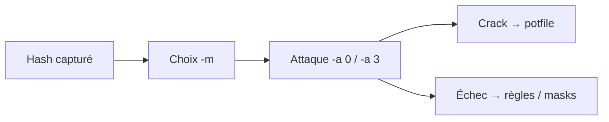

# Hashcat — Cracking GPU/CPU haute performance

> [!info] **En 1 phrase**
> Hashcat = le cracker de hashes le plus rapide : GPU (CUDA/OpenCL) et CPU, 500+ modes (`-m`) et 7 types d'attaques (`-a`) sur les hashes d'Active Directory comme sur le Wi-Fi.

---

## Overview

| Champ | Valeur |
|---|---|
| Nom complet | hashcat (anciennement oclHashcat pour la version GPU) |
| Description | Cracker de hashes hors-ligne : dictionnaire, masque, règles, combinator et hybrides, sur GPU/CPU/APU |
| Catégorie | Exploitation & Cracking |
| Sous-catégorie | Cracking de mots de passe |
| Type d'outil | CLI (avec variantes distribuées et wrappers) |
| Licence | MIT |
| Open source / propriétaire | Open source |
| Langage(s) de programmation | C (CLI + kernels), kernels OpenCL/CUDA/Metal |
| Développeur / organisation | Jens Steube (« atom ») et la communauté hashcat |
| Projet officiel | hashcat |
| Dépôt officiel | https://github.com/hashcat/hashcat |
| Documentation officielle | https://hashcat.net/wiki/ |
| Date de création | 2009 (oclHashcat) ; fusion CPU+GPU en 2015 |
| État du projet | actif |
| Dernière version connue | 7.1.2 (2025-08-23) |
| Systèmes compatibles | Linux, Windows, macOS (GPU/CPU/APU) |

---

## Concept

Casse des hashes **hors-ligne** à très haute vitesse grâce au parallélisme GPU. Le mode (`-m`) identifie le format : `1000` (NTLM), `13100` (Kerberoast RC4), `19700` (Kerberoast AES), `5600` (NetNTLMv2), `22000` (WPA/WPA2/WPA3 PMKID et handshake). L'attaque (`-a`) choisit la stratégie : `0` dictionnaire, `1` combinator, `3` masque (brute-force), `6`/`7` hybrides. Les **règles** (`-r best64.rule`) mutent les mots du dictionnaire. Les résultats vont dans le **potfile** (`~/.hashcat/hashcat.potfile`), relu avec `--show`.

Dans le workflow d'engagement, hashcat se place **après la collecte** : secretsdump (NTLM), Rubeus (Kerberoast), Responder (NetNTLMv2) ou hcxpcapngtool (WPA) produisent des fichiers de hashes que hashcat attaque hors-ligne, sans jamais recontacter la cible. Le choix du mode est critique (un mauvais `-m` produit « Token length exception » ou des millions de hashes/jour inutiles) ; on vérifie toujours le format avec `hashcat --example-hashes` et on identifie le type au préalable avec hashid ou Name-That-Hash.

Le **potfile** est central dans l'utilisation : chaque hash cracké y est stocké avec le mot de passe trouvé, et `--show` rejoue la liste sans recalculer. On peut aussi exporter au format John (`--potfile-path`, `-o output.txt --outfile-format 2`) pour échanger les résultats entre outils. Les **règles** (`/usr/share/hashcat/rules/`) sont le levier de performance principal : `best64.rule`, `d3ad0ne.rule`, `rockyou-30000.rule`... elles transforment quelques milliers de mots de base en des centaines de milliers de candidats réalistes en quelques secondes de GPU.



---

## Concepts fondamentaux

| Concept | Explication |
|---|---|
| Mode (`-m`) | Numéro du format de hash (ex. `0` MD5, `1000` NTLM, `5600` NetNTLMv2, `13100` Kerberoast RC4, `22000` WPA) |
| Attaque (`-a`) | Stratégie : `0` dict, `1` combinator, `3` masque, `6` dict+masque, `7` masque+dict, `9` association |
| Règle (`-r`) | Transformation appliquée aux mots du dictionnaire (ajout de chiffres, casse, leet...) ; moteur de règles in-kernel |
| Potfile | Fichier local (`~/.hashcat/hashcat.potfile`) stockant hash cracké + claire ; `--show` le relit |
| Masque (`?l?u?d?s?a`) | Description d'un motif de caractères : `?l` a-z, `?u` A-Z, `?d` 0-9, `?s` symboles, `?a` tout |
| Sel (salt) | Donnée ajoutée au mot de passe : un sel unique par utilisateur force un crack par hash |
| KDF lent | bcrypt, scrypt, argon2, PBKDF2 : lents par conception pour résister au GPU |
| `-w` workload | Niveau d'utilisation 1-4 (`-w 4` = tout le GPU/CPU) |
| `-O` kernels optimisés | Version optimisée des kernels (plus rapide, plus de RAM) |

---

## Installation

### Debian / Ubuntu / Kali Linux

```bash
sudo apt update && sudo apt install -y hashcat
# Vérifier l'installation et lister les périphériques
hashcat --version
hashcat -I                     # lister les périphériques OpenCL/CUDA détectés
hashcat --example-hashes -m 0  # exemple de hash pour le mode 0 (MD5)
# Règles fournies avec le paquet
ls /usr/share/hashcat/rules/
```

### Arch Linux

```bash
sudo pacman -S hashcat
```

### Fedora / RHEL

```bash
sudo dnf install hashcat
```

### macOS

```bash
brew install hashcat
```

### Windows

```powershell
# Binaires officiels (7z) : https://hashcat.net/hashcat/ — pilotes NVIDIA/AMD/Intel requis
```

### Compilation depuis les sources

```bash
git clone https://github.com/hashcat/hashcat && cd hashcat
sudo make && sudo make install
```

> [!warning] Prérequis & problèmes potentiels
> - GPU requis pour la performance ; pilotes : AMD Linux (AMDGPU 21.50+ / ROCm 5.0+), NVIDIA (440.64+ / CUDA 9.0+), Intel (OpenCL Runtime 16.1.1+).
> - Sans GPU, hashcat fonctionne en CPU (lent) : utiliser `-D 1` pour forcer le CPU.
> - En VM ou sans pilote OpenCL : `--force` ignore les avertissements mais réduit la fiabilité.

---

## Configuration

| Paramètre | Rôle | Valeur possible | Impact | Exemple |
|---|---|---|---|---|
| `~/.hashcat/hashcat.potfile` | Potfile par défaut | chemin | Stocke les cracks pour `--show` | — |
| `--potfile-path <f>` | Potfile personnalisé | chemin | Isoler par engagement | `--potfile-path ./crack.pot` |
| `--session <nom>` | Session nommée | nom | Suspendre/reprendre (`--restore`) | `--session wpa_scan` |
| `--outfile-format` | Format de sortie | 1-7 (ex. 2 = hash:plain) | Interopérabilité John/scripts | `-o out.txt --outfile-format 2` |
| `--username` | Ignore les `user:` dans les fichiers | on/off | Parsing des dumps type `/etc/passwd` | `--username` |
| `HASHCAT_*` (env) | Variables d'environnement documentées dans `--help` | selon variable | Réglages avancés | — |

> [!note] À vérifier
> La plupart des réglages passent par des **flags CLI** plutôt que par un fichier de config. Vérifier les variables d'environnement supportées dans `hashcat --help` (version-dépendant).

---

## Architecture interne

- **CLI en C** : parseur d'arguments, gestion des sessions, orchestration des devices (`-I`), boucle de restauration (`--restore`).
- **Kernels par mode** : chaque `-m` a un kernel OpenCL/CUDA/Metal dédié dans `OpenCL/` ; `-O` sélectionne les variantes optimisées.
- **Moteur de règles in-kernel** : les règles (`-r`) sont compilées et exécutées **sur le device** (pas de transfert CPU↔GPU par candidat) — c'est ce qui rend hashcat ultra-rapide.
- **Backends** : AMD OpenCL, AMD ROCm, Apple OpenCL/Metal, Intel OpenCL, NVIDIA OpenCL/CUDA, POCL ; devices GPU/CPU/APU.
- **Attaque par attaque** : le `-a` pilote la génération des candidats (dict, combinator, masque, hybrides) ; les candidats sont hachés en pipeline sur le device puis comparés aux digests chargés.
- **Restore file** : `.restore` écrit périodiquement l'état (position dans le dictionnaire/masque) pour `--restore`.

---

## Commandes

### Commandes principales

```bash
hashcat -m <mode> -a <attaque> <fichier_hashes> [dictionnaire] [options]
```

| Commande | Objectif | Résultat attendu |
|---|---|---|
| `hashcat -m 1000 ntlm.txt rockyou.txt` | Cracker des hash NTLM en dictionnaire | Mot de passe + `Cracked` |
| `hashcat -m 13100 tgs.txt rockyou.txt -r /usr/share/hashcat/rules/best64.rule` | Kerberoast RC4 avec règles | Tickets crackés |
| `hashcat -m 5600 hash.txt rockyou.txt` | NetNTLMv2 (Responder) en dictionnaire | Mots de passe capturés |
| `hashcat -m 22000 wpa.hc22000 -a 3 '?u?l?l?l?d?d?d?s'` | WPA/WPA2 en masque | Clé PSK |
| `hashcat -m 0 hash.txt --show` | Relire le potfile pour un mode donné | Hashes déjà crackés |
| `hashcat -b` | Benchmark des devices | Vitesses par mode |

### Commandes avancées

```bash
# Longue attaque suspendable puis reprise
hashcat --session wpa_scan -m 22000 wpa.hc22000 -a 3 '?a?a?a?a?a?a?a?a' -w 3
hashcat --session wpa_scan --restore
# Hybrides dict+masque et masque+dict
hashcat -m 1000 ntlm.txt mots.txt -a 6 '?d?d?d?d'
hashcat -m 1000 ntlm.txt mots.txt -a 7 '?d?d?d?d'
# Combinator de deux dictionnaires
hashcat -m 1000 ntlm.txt mots.txt chiffres.txt -a 1
```

---

## Options et flags

| Option | Description | Exemple | Niveau |
|---|---|---|---|
| `-m mode` | Format : `1000` NTLM · `13100`/`19700` Kerberoast · `5600` NetNTLMv2 · `22000` WPA | `hashcat -m 1000 ntlm.txt rockyou.txt` | Basic |
| `-a attaque` | `0` dict · `1` combinator · `3` mask · `6`/`7` hybride | `hashcat -a 3 -m 22000 ...` | Basic |
| `--show` | Affiche les hashes déjà crackés (potfile) | `hashcat -m 1000 ntlm.txt --show` | Basic |
| `-r fichier` | Règles de mutation | `-r /usr/share/hashcat/rules/best64.rule` | Intermediate |
| `-O` | Kernels optimisés (plus rapide, plus de RAM) | `hashcat -m 0 -O hash.txt` | Intermediate |
| `-w N` | Workload : 1-4 (4 = tout le GPU/CPU) | `-w 3` | Intermediate |
| `-D 2` / `--force` | Force le GPU / ignore les avertissements | `hashcat -D 2 ...` | Advanced |
| `-1 ?l?d` | Jeu de caractères custom | `-1 ?l?d -a 3 '?1?1?1?1'` | Intermediate |
| `--session <nom>` / `--restore` | Session suspendable/reprise | `--session wpa_scan --restore` | Advanced |
| `--potfile-path <f>` | Potfile personnalisé | `--potfile-path ./crack.pot` | Advanced |
| `--outfile-format 2` | Sortie `hash:plain` (format John) | `-o out.txt --outfile-format 2` | Advanced |
| `--status-timer N` | Rafraîchissement des stats | `--status-timer 30` | Expert |
| `--example-hashes -m N` | Exemple officiel d'un mode | `--example-hashes -m 1000` | Basic |

> [!tip] Options les plus utiles au quotidien
> `-m` (le bon mode !), `-a 0` + `-r best64.rule`, `-w 3`, `--show` (potfile), `--session` pour les longues attaques.

### Masques (attaque -a 3)

| Masque | Jeu |
|---|---|
| `?l` | a-z |
| `?u` | A-Z |
| `?d` | 0-9 |
| `?s` | symboles |
| `?a` | tout |
| `?u?l?l?l?d?d?d?s` | Ex : "Pass" + 3 chiffres + symbole (mot de passe type) |

---

## Exemples pratiques

### Beginner

```bash
# Cracker un MD5 en dictionnaire
hashcat -m 0 hash.txt /usr/share/wordlists/rockyou.txt
# Vérifier le format d'abord (mode 1000 = NTLM)
hashcat --example-hashes -m 1000
```

### Intermediate

```bash
# NTLM (dump secretsdump) avec règles
hashcat -m 1000 ntlm.txt rockyou.txt -r /usr/share/hashcat/rules/best64.rule
# Relire le potfile
hashcat -m 1000 ntlm.txt --show
```

### Advanced

```bash
# WPA/WPA2 depuis une capture convertie (hcxpcapngtool)
hcxpcapngtool capture.cap -o wpa.hc22000
hashcat -m 22000 wpa.hc22000 -a 3 '?u?l?l?l?d?d?d?s'
# Kerberoast : RC4 puis AES (19700 ~100x plus lent que 13100)
hashcat -m 13100 tgs.txt rockyou.txt -r /usr/share/hashcat/rules/best64.rule -w 3
hashcat -m 19700 tgs_aes.txt rockyou.txt -w 3
```

---

## Workflow complet (scénario pas à pas)

1. **Capturer les hashes** — Responder (LLMNR/NBT-NS Poisoning) récupère un **NetNTLMv2** dans `hash.txt`.
2. **Identifier le format et cracker** :
   ```bash
   hashid hash.txt -m -j
   hashcat -m 5600 hash.txt /usr/share/wordlists/rockyou.txt
   ```
3. **Relire les hashes déjà cassés** :
   ```bash
   hashcat -m 5600 hash.txt --show
   ```
4. **Wi-Fi : convertir la capture puis attaquer en masque** :
   ```bash
   hcxpcapngtool capture.cap -o wpa.hc22000
   hashcat -m 22000 wpa.hc22000 -a 3 '?u?l?l?l?d?d?d?s'
   ```
5. **Échec ? Passer aux règles et aux attaques hybrides** :
   ```bash
   hashcat -m 1000 ntlm.txt rockyou.txt -r /usr/share/hashcat/rules/best64.rule
   hashcat -m 1000 ntlm.txt rockyou.txt -a 6 '?d?d?d?d?d?d'
   ```

---

## Scénarios avancés

### Scénario 1 : Kerberoasting complet (hashcat + règles)

```bash
# Rubeus a sorti des tickets TGS : crack en mode 13100 (RC4) puis 19700 (AES)
hashcat -m 13100 tgs.txt /usr/share/wordlists/rockyou.txt -r /usr/share/hashcat/rules/best64.rule -w 3
hashcat -m 19700 tgs_aes.txt /usr/share/wordlists/rockyou.txt -w 3
# Le mode 19700 est ~100x plus lent que 13100 : cibler d'abord le RC4
```

### Scénario 2 : attaque combinatoire sur un schéma de mot de passe connu

```bash
# Le mdp est <mot> + <4 chiffres> : combiner deux dictionnaires ou hybride
hashcat -m 1000 ntlm.txt mots.txt chiffres.txt -a 1
hashcat -m 1000 ntlm.txt mots.txt -a 6 '?d?d?d?d'
```

### Scénario 3 : longue attaque avec session suspendable

```bash
# Lancer avec une session nommée (suspendable/reprise)
hashcat --session wpa_scan -m 22000 wpa.hc22000 -a 3 '?a?a?a?a?a?a?a?a' -w 3
# ... plus tard, reprendre là où on s'était arrêté
hashcat --session wpa_scan --restore
```

---

## Cybersecurity use cases

| Phase | Utilisation |
|---|---|
| Post-exploitation | Crack des hashes dumpés (SAM, NTDS.dit, lsass) pour retrouver les claires |
| Credential Access | Kerberoasting, AS-REP Roasting, NetNTLMv2 (Responder) → hashcat |
| Wireless | Cracking WPA/WPA2/WPA3 (PMKID, handshake) converti en `.hc22000` |
| Audit interne | Vérification de la robustesse des mots de passe (benchmark, règles) |
| Forensic | Récupération de mots de passe à partir d'artefacts hashés |
| CTF / Lab | Étape finale de la chaîne d'identification → cracking |

---

## MITRE ATT&CK

| Tactique | Technique / Sub-technique | ID | Raison | Détection | Mitigation |
|---|---|---|---|---|---|
| Credential Access | Brute Force: Password Cracking | T1110.002 | Cracking hors-ligne des hashes récupérés (usage principal) | Pas de détection directe (local) ; détecter les dumps en amont | Hash fort + sel (argon2id/bcrypt), MFA |
| Credential Access | OS Credential Dumping | T1003 | Source des hashes (SAM, NTDS.dit, lsass) crackés ensuite | EID 4662/4663, accès lsass (PPL) | LSA Protection, Credential Guard |
| Credential Access | Steal or Forge Kerberos Tickets | T1558 | Crack des TGS (Kerberoasting) et TGT (AS-REP) en 13100/19700/18200 | EID 4769 (RC4), énumération SPN | Comptes de service en gMSA |
| Credential Access | Network Sniffing | T1040 | Hashes NetNTLMv2 (5600) capturés puis crackés | Trafic SMB/LDAP anormal | Désactiver NTLM, SMB signing |

> [!note] Ne renseigner que si l'association est réellement pertinente.
> hashcat est un outil **local** : il ne produit pas de trafic réseau ni d'événement côté victime. Le risque détectable est en amont (collecte des hashes).

---

## Defensive Security

### Signes observables

| Indicateur | Détail |
|---|---|
| GPU/CPU saturés | Cracking actif : température, charge, process `hashcat`/`oclhashcat` (EDR) |
| Fichiers suspects | Wordlists massives, fichiers `.potfile`, règles téléchargées, dumps de hashes |
| Exécution de `hashcat` sur un endpoint | Sigma proc_creation sur `hashcat`/`hashcat64.bin` |
| Résultats réutilisés | Corrélation claires crackées → connexions (4624) ou réutilisation de creds |

### Règles de détection (Sigma / Suricata / Snort / YARA)

```yaml
# Exemple Sigma — Windows/Linux : exécution d'un cracker de mots de passe
title: Password Cracking Tool Execution
id: <uuid-a-generer>
status: experimental
logsource:
    category: process_creation
    product: windows
detection:
    selection:
        Image|endswith:
            - '\hashcat.exe'
            - '\hashcat64.exe'
            - '\oclhashcat64.exe'
    condition: selection
level: high
```

---

## Automatisation

```bash
# Bash — boucle de crack par mode identifié, puis export
for mode in 1000 5600 13100; do
    hashcat -m $mode hashes.txt rockyou.txt -r /usr/share/hashcat/rules/best64.rule -o cracked_$mode.txt --outfile-format 2 -w 3
done
```

```python
# Python — lancer des attaques par mode et relire les potfiles
import subprocess
for name, mode in {"ntlm": 1000, "netntlmv2": 5600, "kerberoast": 13100}.items():
    subprocess.run(["hashcat", "-m", str(mode), f"{name}.txt", "rockyou.txt",
                    "-r", "/usr/share/hashcat/rules/best64.rule",
                    "-o", f"{name}_cracked.txt", "--outfile-format", "2", "-w", "3"])
```

---

## Output et parsing

La sortie de crack est du texte (statut `Cracked`, vitesses H/s, progression). Les résultats **craqués** se récupèrent via `--show` ou `-o` avec `--outfile-format`.

```bash
# Export des cracks au format hash:plain (interopérable avec John)
hashcat -m 1000 ntlm.txt --show --outfile-format 2 -o cracked.txt
```

```python
# Python — relire un potfile
cracks = {}
for line in open("cracked.txt"):
    h, p = line.rstrip("\n").split(":", 1)
    cracks[h] = p
print(len(cracks), "hashes craqués")
```

> [!note] À vérifier
> Le potfile interne (`~/.hashcat/hashcat.potfile`) a un format propre (hash:plain) ; `--show` et `-o` permettent les exports vers d'autres outils.

---

## Intégrations

```text
Responder/secretsdump/Rubeus → hashid/Name-That-Hash → hashcat → John (interop) → réutilisation
```

- [[Outil - hashid]] / [[Outil - Name-That-Hash]] — choisir le bon `-m` avant de lancer
- [[Outil - John the Ripper]] — formats d'audit compatibles, partage des règles
- [[Outil - SecLists]] — wordlists (rockyou.txt, etc.)
- [[Outil - Crunch]] — génération de dictionnaires/masques personnalisés
- [[Outil - OneRuleToRuleThemAll]] — règles de mutation ultra-complètes
- [[Outil - hcxdumptool]] — capture WiFi + conversion `.hc22000` (hcxpcapngtool)
- [[Outil - Responder]] — capture NetNTLMv2 à cracker en mode 5600
- [[Outil - Rubeus]] — Kerberoasting / AS-REP à cracker en 13100/19700
- [[Tools| Outils]] global
- [[Techniques/Password Cracking| Password Cracking]] · [[Techniques/Kerberoasting| Kerberoasting]] · [[Techniques/AS-REP Roasting| AS-REP Roasting]] · [[Techniques/LLMNR-NBT-NS Poisoning| LLMNR/NBT-NS]] · [[Techniques/Dump NTDS.dit| Dump NTDS.dit]]

---

## Alternatives

| Outil | Avantages | Inconvénients | Cas d'usage |
|---|---|---|---|
| John the Ripper (jumbo) | 100+ formats, CPU efficace, formats d'audit | Plus lent que hashcat sur GPU | Formats rares, audit |
| Hashtopolis | Orchestration/distribution multi-node de hashcat | Déploiement, setup | Grands volumes, clusters GPU |
| CrackStation (en ligne) | Zéro install, gratos pour les faibles | Confidentialité, dict limité | Hash unique non sensible |
| hashcat-legacy | Ancienne version CPU | Obsolète | Historique |
| RTL-sdr / services cloud | Scalabilité (GPU cloud) | Coût, data egress | Campagnes massives |

> **Quand utiliser John plutôt que hashcat ?** Pour les **formats rares** non supportés par hashcat ou pour du **CPU-only** avec des formats d'audit ; pour la vitesse GPU sur les formats courants, hashcat domine.

---

## Performance

- **Vitesse GPU** : le GPU est ~100x plus rapide que le CPU (ordre de grandeur empirique, chiffre issu de la communauté).
- **Exemple** : un MD5 (`-m 0`) se teste en **dizaines de GH/s** sur un GPU moderne ; un bcrypt (`-m 3200`) tombe à quelques **kH/s** — d'où la supériorité des KDF lents.
- **Parallélisme** : `-w 4` maximise l'utilisation du device ; `-O` accélère via kernels optimisés (plus de RAM).
- **Règles in-kernel** : pas de transfert CPU↔GPU par candidat : le taux de candidates/s reste élevé même avec des règles complexes.
- **Benchmark** : `hashcat -b` mesure les vitesses par mode pour choisir la stratégie.

---

## Troubleshooting

### Common problems

#### Problème : « No devices found / No OpenCL device found »

- **Cause** : pilotes OpenCL/CUDA absents ou incompatibles.
- **Solution** : installer/mettre à jour les pilotes, vérifier `hashcat -I` ; en VM utiliser `--force -D 1` (CPU). **Vérif** : `hashcat -I` liste le device.

#### Problème : « Token length exception »

- **Cause** : mauvais `-m` (le hash n'a pas la bonne taille pour le mode).
- **Solution** : identifier le format (hashid/Name-That-Hash), vérifier avec `hashcat --example-hashes -m N`. **Vérif** : comparer longueur du hash et de l'exemple.

#### Problème : `--show` ne renvoie rien

- **Cause** : `-m` ou fichier différents de ceux du crack initial.
- **Solution** : relancer avec le **même** `-m` et le **même** fichier. **Vérif** : `hashcat -m 1000 ntlm.txt --show`.

#### Problème : « Separator unmatched » / « Line-length exception »

- **Cause** : préfixes `user:` ou séparateurs dans le fichier de hashes.
- **Solution** : utiliser `--username` et/ou `--separator`. **Vérif** : nettoyer le fichier en amont.

---

## Sécurité de l'outil

- **CVE non patchées (v7.1.2)** : trois vulnérabilités CVSS 9.8 publient des buffer overflows — dont **CVE-2026-42482** (moteur de règles `rp_cpu.c`, déclenché par un fichier de règles malveillant) et **CVE-2026-42483** (Kerberos). PR #4618 ouverte depuis janvier 2026, non fusionnée. **Recommandations** : ne charger que des fichiers de hashes/règles **de confiance**, isoler le processus (VM/container), mettre à jour dès qu'un patch sort.
- **Input = exécutable** : les fichiers de règles et de hashes sont du code aux yeux du moteur : traiter tout fichier tiers comme dangereux.
- **Données sensibles** : le potfile contient les mots de passe en clair — le chiffrer/protéger, le nettoyer après engagement.
- **Usage légal** : uniquement sur des hashes autorisés (audit, test d'intrusion, lab).

---

## Limitations

- **Hors-ligne uniquement** : ne peut pas attaquer un service en ligne (contrairement à hydra/Medusa).
- **Formats non supportés** : quelques formats exotiques ne sont pas couverts — vérifier `hashcat --help | grep -i <format>`.
- **KDF lents** : bcrypt/scrypt/argon2 avec sel unique rendent le GPU quasi inutile (quelques kH/s).
- **Mots de passe longs/aléatoires** : un masque de 8+ caractères inconnus = années de calcul ; préférer dict + rules.
- **Pilotes capricieux** : AMD/Windows (Adrenalin exact) et les VMs posent des problèmes de device.
- **CVE non patchées** : risque à ne pas ignorer tant que la v7.1.2 est la dernière release.

---

## Cheatsheet

```bash
# NTLM (dump secretsdump) avec dictionnaire
hashcat -m 1000 ntlm.txt /usr/share/wordlists/rockyou.txt

# Kerberoast RC4 + règles, puis relecture du potfile
hashcat -m 13100 tgs.txt rockyou.txt -r /usr/share/hashcat/rules/best64.rule
hashcat -m 13100 tgs.txt --show

# WPA/WPA2 depuis une capture convertie
hashcat -m 22000 wpa.hc22000 -a 3 '?u?l?l?l?d?d?d?s'

# NetNTLMv2 (Responder)
hashcat -m 5600 hash.txt /usr/share/wordlists/rockyou.txt

# Longue attaque suspendable
hashcat --session s1 -m 22000 wpa.hc22000 -a 3 '?a?a?a?a?a?a?a?a' -w 3
hashcat --session s1 --restore

# Export hash:plain (format John)
hashcat -m 1000 ntlm.txt --show --outfile-format 2 -o cracked.txt
```

---

## Quick reference

| | |
|---|---|
| **À quoi sert-il ?** | Cracker des hashes hors-ligne à très haute vitesse (GPU/CPU) |
| **Quand l'utiliser ?** | Dès qu'un dump de hashes est obtenu (AD, WiFi, web) |
| **Commande principale** | `hashcat -m <mode> -a 0 hashes.txt rockyou.txt` |
| **Alternative principale** | John the Ripper (formats rares/CPU), Hashtopolis (distribution) |
| **Concepts importants** | `-m` mode, `-a` attaque, règles (`-r`), masques (`?l?u?d?s?a`), potfile (`--show`) |
| **Liens associés** | [[Outil - hashid]] · [[Outil - Name-That-Hash]] · [[Outil - John the Ripper]] · [[Outil - SecLists]] · [[Techniques/Kerberoasting| Kerberoasting]] |

---

## Détection & Défense

| Signe | Défense |
|---|---|
| Mots de passe faibles crackables en ligne | > 15 caractères aléatoires : coût de crack infini |
| Hash sans salt ou KDF rapide | Salt unique / bcrypt-KDF ralentit massivement le GPU |
| Comptes de service avec SPN au mot de passe statique | Kerberos : passer les comptes de service en **gMSA** (mdp auto-rotaté) |
| NetNTLMv2 capturable sur le réseau | Désactiver NTLM (casse la compat), activer SMB signing |
| Dump possible des hashes locaux | Credential Guard / LSA Protection empêche le dump côté Windows |
| Hashes anciens sans sel (MD5/SHA-1) encore en production | Migrer vers argon2id/bcrypt/PBKDF2 et forcer la rotation |

---

## Tips & Pièges

> [!tip] **Tips**
> - Lance `--show` (potfile) avant de relancer : ne recasse jamais ce qui est déjà cracké.
> - Privilégie les **règles** aux masques : un petit dictionnaire + `best64.rule` bat souvent un gros brute-force.
> - Le GPU est ~100x plus rapide que le CPU : garde les pilotes OpenCL/CUDA à jour.
> - Utilise `--session <nom>` pour les longues attaques : tu peux suspendre (`Ctrl+C`) et reprendre avec `--restore` sans perdre la progression.
> - `hashcat -b` (benchmark) te dit quel mode/stratégie est viable sur ton matériel avant de lancer.

> [!warning] **Pièges**
> - `--show` sans le même `-m` (et même fichier) ne renvoie rien.
> - Un WPA en **PMKID** (`-m 22000`) se cracke sans client connecté, mais il faut convertir le .cap avec **hcxpcapngtool**.
> - `-a 3` avec 8+ caractères inconnus = années de calcul : préfère dict + rules.
> - Le mauvais `-m` donne « Token length exception » ou du crack inutile : vérifie toujours `--example-hashes`.
> - Les **fichiers de règles non fiables** peuvent déclencher les CVE 2026 non patchées (buffer overflow) : isole l'exécution.

---

## References

### Official

- Site officiel et binaires : https://hashcat.net/hashcat/
- GitHub officiel : https://github.com/hashcat/hashcat
- Wiki officiel (options, FAQ) : https://hashcat.net/wiki/
- Moteur de règles : https://hashcat.net/wiki/doku.php?id=rule_based_attack

### Security references

- MITRE ATT&CK T1110.002 — Password Cracking : https://attack.mitre.org/techniques/T1110/002/
- MITRE ATT&CK T1003 — OS Credential Dumping : https://attack.mitre.org/techniques/T1003/
- NVD — CVE-2026-42482 : https://nvd.nist.gov/vuln/detail/CVE-2026-42482
- OWASP — Password Storage Cheat Sheet : https://cheatsheetseries.owasp.org/cheatsheets/Password_Storage_Cheat_Sheet.html

### Community

- HackTricks — Cracking / Hashcat : https://book.hacktricks.xyz/crypto-and-stego/cracking

---

**Liens :** [[Tools| Outils]] · [[Techniques/Password Cracking| Password Cracking]] · [[Techniques/Kerberoasting| Kerberoasting]] · [[Techniques/LLMNR-NBT-NS Poisoning| LLMNR/NBT-NS]]
