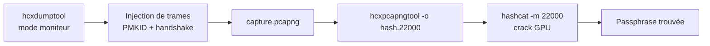

# hcxdumptool — Wireless & Réseau

> [!info] **En 1 phrase**
> Outil de **capture PMKID/handshake** en mode moniteur, conçu pour produire des captures compatibles **hashcat 22000** via `hcxpcapngtool` — l'alternative moderne et efficace à airodump-ng.

---

## Overview

| Champ | Valeur |
|---|---|
| Nom complet | hcxdumptool |
| Description | Capteur WiFi en mode moniteur qui injecte des trames (probe, association, deauth) pour forcer les AP et clients à émettre PMKID et handshakes EAPOL, dans un fichier `.pcapng` |
| Catégorie | Wireless & Réseau |
| Sous-catégorie | Attaque & Cracking WiFi (capture PMKID / handshake) |
| Fonction principale | Capture d'empreintes PMKID et de handshakes WPA/WPA2/WPA2-PMKID au format pcapng, destinées au crack hors-ligne |
| Type d'outil | CLI (daemonisable) |
| Licence | MIT |
| Open source / propriétaire | Open source |
| Langage(s) de programmation | C |
| Développeur / organisation | ZeroBeat (ZerBea) |
| Projet officiel | ZerBea/hcxdumptool (écosystème hcxtools) |
| Dépôt officiel | https://github.com/ZerBea/hcxdumptool |
| Documentation officielle | https://github.com/ZerBea/hcxdumptool/blob/master/docs/ |
| Date de création | 2017 (première version publique) |
| État du projet | actif (v7.1.2 le 8 février 2026) |
| Dernière version connue | v7.1.2 (8 février 2026) — Kali package `7.1.2-1` |
| Systèmes compatibles | Linux uniquement (noyau ≥ 5.15 recommandé ; Arch, Kali, Debian, OpenWRT) |

> [!note] Pour vérifier / compléter
> - La version d'`hcxdumptool` doit **toujours correspondre** à celle d'`hcxpcapngtool` (même dépôt parent `hcxtools`).
> - Les paquets des distributions sont souvent anciens : le build depuis le dépôt GitHub est recommandé par l'auteur.
> - hcxdumptool n'utilise **pas** de BSSID/ESSID textuels mais des filtres par adresse MAC : vérifier la syntaxe de `--filterlist_ap`.

---

## Concept

`hcxdumptool` (développé par ZeroBeat, auteur aussi de la suite **hcxtools**) est l'outil d'acquisition du workflow « **capture → hashcat** » du WiFi moderne. Là où `airodump-ng` attend passivement un client qui s'associe pour capter un handshake 4-way, hcxdumptool **injecte activement** des trames (probe request, association, désauthentification) pour déclencher l'émission de PMKID et de handshakes par les AP et les clients — le tout dans un unique fichier `.pcapng`. Le format de sortie est pensé dès la conception pour la conversion par `hcxpcapngtool` vers le format hashcat **22000** (WPA-PBKDF2-PMKID+EAPOL) ou **16800** (PMKID seul), exploitable directement par [[Outil - hashcat]] et [[Outil - John the Ripper]].

Le **PMKID** est le vecteur de choix : il est émis par l'AP lui-même (parfois sans aucun client connecté), ce qui rend la capture **silencieuse** — pas de déauthentification, pas de bruit. C'est le principal avantage concurrentiel face à la suite aircrack-ng. Quand le PMKID n'est pas disponible, l'outil bascule sur le handshake 4-way : il force l'association d'un client (réel ou forgé) ou déauthentifie un client existant pour capter l'échange EAPOL au passage.

Dans un pentest, hcxdumptool se place à la **phase de collecte** : il ne cracke pas, il alimente le cracker. Son efficacité dépend du matériel (mode moniteur + injection full frame), de la régulation (canaux autorisés pour l'injection) et de la politique de l'AP (envoi ou non du PMKID). Il s'intègre dans des déploiements de collecte longue (Raspberry Pi, OpenWRT) en mode daemon, avec logs et rotation.



---

## Concepts fondamentaux

| Concept | Explication |
|---|---|
| PMKID | « PMK Identifier » : hash dérivé du PMK calculé par l'AP, émis en tête de trame RSN (association) sans nécessiter de client |
| Handshake 4-way (EAPOL) | Échange de 4 trames entre client et AP à l'association WPA/WPA2 ; sa capture permet le crack hors-ligne du PSK |
| Mode moniteur | La carte reçoit toutes les trames 802.11 sans s'associer ; condition requise avec l'injection |
| Injection full frame | Capacité d'envoyer des trames arbitraires (probe, assoc, deauth) — dépend du chipset et du driver |
| Format pcapng | Format de capture enrichi (blocs, metadata) ; gère mieux les longues captures que le pcap classique |
| Format hashcat 22000 | Ligne de hash : `hash*essid*apmac*clientmac*[PMKID*EAPOL]` ; lisible par hashcat et John |
| Format 16800 | Ancien format PMKID seul (deprecated, remplacé par 22000) |
| WPA3 / SAE | Dragonfly : le handshake SAE ne peut pas être cracké hors-ligne ; aucun PMKID émis en mode SAE pur |
| rcascan / scan rapide | Mode de scan « receiver channel allocation » (v7) optimisant la rotation de canaux |
| Nonce error correction | Option `--nonce-error-corrections=2` d'`hcxpcapngtool` pour réparer les handshakes partiels (bruit) |

---

## Installation

### Debian / Ubuntu / Kali Linux

```bash
sudo apt update && sudo apt install -y hcxdumptool hcxtools
# Kali : paquets présents (7.1.2-1 en kali-rolling)
hcxdumptool --version
```

### Arch Linux

```bash
sudo pacman -S hcxdumptool hcxtools
```

### Fedora / RHEL

```bash
sudo dnf install hcxdumptool hcxtools
```

### macOS

```bash
# Non supporté : hcxdumptool est un outil Linux (capture/injection 802.11 via nl80211)
# Utiliser une VM Linux ou un Raspberry Pi
```

### Windows

```powershell
# Non supporté nativement : mode moniteur + injection indisponibles sous Windows
# Contournement : Kali sous WSL2 + carte USB (accès USB requis) ou boot Kali
```

### Docker

```bash
# Déconseillé : Docker isole l'accès hardware ; le mode moniteur nécessite l'accès direct à la carte
```

### Compilation depuis les sources

```bash
git clone https://github.com/ZerBea/hcxdumptool.git && cd hcxdumptool
make && sudo make install
# Vérifier : hcxdumptool -v
```

> [!warning] Prérequis & problèmes potentiels
> - **Linux uniquement**, noyau ≥ 5.15 (longterm/stable) recommandé ; `gcc >= 16` recommandé pour compiler.
> - Chipset obligatoirement capable de **monitor mode + full frame injection** (Realtek rtl8xxxu/rtw88, MediaTek mt76, Atheros ath9k_htc, Ralink rt2800usb). Intel, Broadcom, Qualcomm : déconseillés.
> - Installer `libpcap` et `libpcap-dev` si le compilateur BPF interne est activé.
> - Pour l'injection 5/6/7 GHz : réglementaire domaine autorisant ces bandes (`/etc/conf.d/wireless-regdom`).
> - Désactiver **wpa_supplicant/NetworkManager** sur l'interface (conflits d'accès à la carte).

---

## Configuration

hcxdumptool se configure **uniquement en ligne de commande** : pas de fichier de configuration persistant. La politique de capture (canaux, filtres, taux d'injection, discrétion) s'exprime par options à chaque lancement. L'utilisateur fournit les listes de cibles (BSSID) en fichiers texte.

| Paramètre | Rôle | Valeur possible | Impact | Exemple |
|---|---|---|---|---|
| `-i <iface>` | Interface en mode moniteur | `wlan0mon`, `phy0`… | Où capturer/injecter | `-i wlan0mon` |
| `-o <fichier>` | Fichier de sortie pcapng | chemin | Contient les empreintes | `-o capture.pcapng` |
| `--filterlist_ap=<f>` | Fichier de BSSID cibles | un MAC par ligne | Réduit la collecte | `--filterlist_ap=cible.txt` |
| `--filtermode=<n>` | Mode du filtre AP | 1 = exclure, 2 = ne garder que | Cible ou exclut | `--filtermode=2` |
| `-c <canal>` | Canal fixe (2,4 GHz) | 1-14 | Capture mono-canal | `-c 6` |
| `--enable_status` | Afficher l'état temps réel | on/off | Suivi PMKID/handshake | `--enable_status` |
| `--deauthentication=<n>` | Nb de deauth par client | 0-255 | Force les reconnexions | `--deauthentication=200` |
| `--association=<n>` | Nb de trames d'association | 0-255 | Déclenche le PMKID | `--association=150` |
| `--rds=<n>` | Réduction de puissance TX | dBm | Discrétion radio | `--rds=1` |
| `--logfile=<f>` | Journal des événements | chemin | Traçabilité | `--logfile=run.log` |
| `--daemon` | Mode arrière-plan | on/off | Collecte longue | `--daemon` |

---

## Architecture interne

hcxdumptool est un **binaire C monolithique** tournant exclusivement sur Linux, branché sur la pile **nl80211/cfg80211** du noyau. Son fonctionnement interne :

1. **Interface** — il pilote la carte en mode moniteur **directement sur l'interface physique** (jamais sur les interfaces logiques `monX`/`wlanXmon` générées par d'autres outils) via RTNETLINK et NL80211.
2. **Scan** — rotation rapide des canaux (scan cyclique ou `rcascan` optimisé en v7). La carte écoute puis injecte des probes pour énumérer les AP et clients présents.
3. **Injection** — selon la cible : trames **probe request**, **assoc request** (pour déclencher l'émission du PMKID par l'AP), **deauth** (pour forcer un client à se réassocier et produire un handshake). Le nombre de trames par type est borné par les options `--deauthentication`, `--association`, `--proberequest`.
4. **Capture** — les trames reçues sont filtrées en temps réel (BPF interne) et écrites dans un fichier **pcapng** avec des blocs enrichis (metadata d'interface, canaux). Les empreintes utiles (PMKID, EAPOL) sont détectées et marquées ; l'affichage temps réel (`--enable_status`) le montre.
5. **Arrêt** — sur SIGINT/SIGTERM le fichier est finalisé correctement (fini sans corruption), les handlers de signaux ferment proprement le pcapng.
6. **Entropie/MAC** — l'outil utilise son propre espace d'adresses MAC aléatoires pour les trames forgées (inutile d'utiliser macchanger).

Le résultat est consommé hors-ligne : `hcxpcapngtool` lit le pcapng, déduplique les hashs, corrige les nonces partiels et sort le fichier `.22000` prêt pour hashcat/John.

---

## Commandes

### Commandes principales

```bash
sudo hcxdumptool -i wlan0mon -o capture.pcapng
```

| Commande | Objectif | Résultat attendu |
|---|---|---|
| `hcxdumptool -i wlan0mon -o cap.pcapng` | Capture générale PMKID + handshakes | Un pcapng avec les empreintes |
| `hcxdumptool --filterlist_ap=cible.txt --filtermode=2` | Cibler une liste de BSSID | Collecte limitée aux AP listés |
| `hcxdumptool -c 6 --enable_status` | Canal fixe + affichage temps réel | Suivi des FOUND PMKID / handshake |
| `hcxdumptool --daemon --logfile=run.log` | Collecte en arrière-plan | Daemon + logs (rotation) |
| `hcxdumptool --rds=1` | Réduction de puissance | Collecte plus discrète radio |
| `hcxdumptool --help` | Aide complète | Options et exemples |
| `hcxdumptool -v` | Version + infos compile | Version, kernel, gcc, BPF |

### Commandes avancées

```bash
# Ciblage + deauth + assoc bornés, avec log (scénario reproductible)
sudo hcxdumptool -i wlan0mon -o cap.pcapng --filterlist_ap=cible.txt --filtermode=2 \
  --enable_status --deauthentication=200 --association=150 --logfile=run.log

# Vérifier la capture et convertir
hcxpcapngtool --hash-info cap.pcapng
hcxpcapngtool -o hash.22000 cap.pcapng
```

---

## Options et flags

| Option | Description | Exemple | Niveau |
|---|---|---|---|
| `-i <iface>` | Interface moniteur | `-i wlan0mon` | Basic |
| `-o <fichier>` | Sortie pcapng | `-o cap.pcapng` | Basic |
| `-c <canal>` | Canal fixe | `-c 11` | Basic |
| `--enable_status` | État temps réel | `--enable_status` | Basic |
| `--filterlist_ap=<f>` | BSSID cibles | `--filterlist_ap=ap.txt` | Intermediate |
| `--filtermode=<n>` | 1 exclure / 2 garder | `--filtermode=2` | Intermediate |
| `--deauthentication=<n>` | Force les reconnexions | `--deauthentication=200` | Intermediate |
| `--association=<n>` | Déclenche PMKID | `--association=150` | Intermediate |
| `--rds=<n>` | Réduction de puissance TX | `--rds=1` | Advanced |
| `--logfile=<f>` | Journal | `--logfile=run.log` | Advanced |
| `--daemon` | Arrière-plan | `--daemon` | Advanced |
| `--proberequest=<n>` | Bornes probes | `--proberequest=100` | Expert |
| `--rcascan` | Scan rapide optimisé (v7) | `--rcascan` | Expert |
| `--rdt` | Désactive TIOCGWINSZ (terminaux non standard) | `--rdt` | Expert |

> [!tip] Options les plus utiles au quotidien
> - `-i` + `-o` sont indispensables (interface et fichier de sortie).
> - `--enable_status` pour confirmer visuellement la capture de PMKID/handshakes.
> - `--filterlist_ap` + `--filtermode=2` pour ne cibler que les AP intéressants.
> - `--deauthentication=200` et `--association=150` donnent de bons résultats par défaut.

---

## Exemples pratiques

### Beginner

```bash
# Objectif : première capture, tout le spectre 2,4 GHz
sudo hcxdumptool -i wlan0mon -o capture.pcapng
# Ctrl-C après quelques minutes, puis :
hcxpcapngtool -o hash.22000 capture.pcapng
```

Résultat attendu : le fichier `hash.22000` contient les empreintes valides ; s'il est vide, vérifier le mode moniteur et la proximité des AP.

### Intermediate

```bash
# Objectif : cibler un AP précis, canal fixe, état à l'écran
echo "AA:BB:CC:DD:EE:FF" > cible.txt
sudo hcxdumptool -i wlan0mon --filterlist_ap=cible.txt --filtermode=2 -c 3 --enable_status
# Attendre "FOUND PMKID" ou un handshake détecté, puis convertir :
hcxpcapngtool -o hash.22000 capture.pcapng
```

### Advanced

```bash
# Objectif : collecte longue en daemon avec logs et deauth bornée
sudo hcxdumptool -i wlan0mon -o /var/log/hcxdumptool/cap.pcapng \
  --daemon --enable_status --deauthentication=200 --association=150 \
  --logfile=/var/log/hcxdumptool/run.log
# Analyser en fin de collecte :
hcxpcapngtool --hash-info /var/log/hcxdumptool/cap.pcapng
```

### Expert

```bash
# Objectif : corriger les handshakes partiels d'une capture bruitée puis cracker
hcxpcapngtool --nonce-error-corrections=2 -o hash.22000 cap_bruitee.pcapng
hashcat -m 22000 hash.22000 /usr/share/wordlists/rockyou.txt -w 3
# Objectif : PMKID seul (ancien format) si le flux complet n'est pas nécessaire
hcxpcapngtool -E essidlist -o pmkid.16800 cap.pcapng
```

---

## Workflow complet (scénario pas à pas)

**Scénario : récupérer les hash d'une box "Livebox-1234" sur le canal 3.**

1. **Créer le filtre cible et lancer la capture ciblée** :
   ```bash
   echo "AA:BB:CC:DD:EE:FF" > cible.txt
   sudo hcxdumptool -i wlan0mon --filterlist_ap=cible.txt --filtermode=2 -c 3 --enable_status
   ```
2. **Attendre l'apparition d'un handshake (ou PMKID)** : `PMKID detected` / `handshake detected` dans le statut.
3. **Stopper (Ctrl-C), puis convertir la capture au format hashcat 22000** :
   ```bash
   hcxpcapngtool -o hash.22000 capture.pcapng
   ```
4. **Cracker avec hashcat** :
   ```bash
   hashcat -m 22000 hash.22000 /usr/share/wordlists/rockyou.txt
   ```
5. **(Optionnel) Vérifier le hash extrait** avant le crack :
   ```bash
   hcxpcapngtool --hash-info capture.pcapng
   ```

---

## Scénarios avancés

### Scénario 1 : collecte longue sans surveillance (daemon sur Raspberry Pi)

```bash
# Configurer la carte en mode moniteur puis lancer en arrière-plan
sudo ip link set wlan0 down && sudo iw dev wlan0 set type monitor && sudo ip link set wlan0 up
# Collecte en daemon avec logs dans /var/log/hcxdumptool
sudo mkdir -p /var/log/hcxdumptool
sudo hcxdumptool -i wlan0mon -o /var/log/hcxdumptool/capture.pcapng --daemon \
  --logfile=/var/log/hcxdumptool/run.log --enable_status
# Conversion quotidienne en cron :
# 30 4 * * * hcxpcapngtool -o /var/log/hcxdumptool/hash.22000 /var/log/hcxdumptool/capture.pcapng
```

### Scénario 2 : cibler plusieurs réseaux voisins en une passe

```bash
# Liste de plusieurs BSSID à cibler (un par ligne) + balayage de canaux
cat > cibles.txt <<EOF
AA:BB:CC:DD:EE:FF
11:22:33:44:55:66
EOF
sudo hcxdumptool -i wlan0mon --filterlist_ap=cibles.txt --filtermode=2 --enable_status
```

### Scénario 3 : récupérer une capture longue et l'analyser hors-ligne

```bash
# Après une collecte de plusieurs heures, analyser et convertir :
hcxpcapngtool --hash-info capture.pcapng          # aperçu des PMKID / handshakes trouvés
hcxpcapngtool -o hash.22000 capture.pcapng        # conversion au format hashcat
# Lancer le crack GPU (par ex. WPA2-PSK)
hashcat -m 22000 hash.22000 /usr/share/wordlists/rockyou.txt -w 3
```

---

## Cybersecurity use cases

| Phase | Utilisation |
|---|---|
| Reconnaissance | Énumération passive/active des AP et clients (probes injectées) |
| Credential access | Capture PMKID et handshakes WPA/WPA2 pour crack hors-ligne |
| Attaque WiFi | Récolte de matériel de crack sur réseaux WPA/WPA2-PSK autorisés |
| Physical / Red team | Collecte longue embarquée (Raspberry Pi, OpenWRT) sans intervention |
| Analyse forensique | Captures pcapng complètes pour analyse dans [[Outil - tshark]] / [[Outil - Wireshark]] |

---

## MITRE ATT&CK

| Tactique | Technique / Sub-technique | ID | Raison | Détection | Mitigation |
|---|---|---|---|---|---|
| Collection | Network Sniffing | T1040 | Capture passive/active des trames 802.11 et des handshakes | WIDS : spikes de probe/assoc/deauth | WPA3/SAE, WIDS |
| Credential Access | Brute Force : Password Cracking | T1110.002 | Les empreintes capturées alimentent hashcat (offline dictionary) | Surveillance des accès, logs | Passphrase robustes, MFA |
| Initial Access | Valid Accounts | T1078 | Passphrase crackée → accès réseau légitime | Contrôle des sessions | Passphrase robustes, rotation |
| Impact | Wi-Fi Disassociation | T1466 | `--deauthentication` force les reconnexions des clients | WIDS/WIPS sur rafales deauth | WIDS, 802.1X, WPA3/SAE |
| Discovery | Network Service Scanning (passif) | T1046 | Détection d'AP et clients sur le spectre | Monitor radio (Kismet) | Réglementation des canaux |

> [!note] Ne renseigner que si l'association est réellement pertinente.
> L'association la plus solide est T1040 (sniffing) + T1110.002 (crack offline via hashcat) ; T1466 décrit le mécanisme de deauth intégré.

---

## Defensive Security

### Signes observables

| Indicateur | Détail |
|---|---|
| Rafales de probe request non associées | Signature d'injection hcxdumptool/airodump |
| Rafales de deauth (spikes) | `--deauthentication` en action (T1466) |
| Trames d'association vers un AP sans client visible | Déclenchement du PMKID |
| MAC source aléatoires et changeantes | hcxdumptool forge ses propres adresses |
| Balayage rapide de canaux (rotation) | Scan cyclique / rcascan |
| Présence d'un canal sondé pendant des heures | Collecte longue (daemon Pi) |

### Règles de détection (Sigma / Suricata / Snort / YARA)

```yaml
# Exemple Sigma : spike de trames de désauthentification 802.11 (collecte)
title: WiFi Deauth Flood / Handshake Harvest
id: 8d4c2b2f-0002-4c00-9000-000000000002
status: experimental
description: Rafale de trames 802.11 deauth souvent liée à la capture de handshake
logsource:
  category: wireless
  product: wids
detection:
  selection:
    frame.type: 0
    frame.subtype: 12  # deauth
  condition: selection
  timeframe: 5s
  aggregation:
    field: transmitter
    min_count: 50
level: medium
```

```bash
# Exemple Suricata/Snort : détection de probes non sollicitées en rafale
alert wlan any any -> any any (msg:"WiFi probe flood - possible hcxdumptool"; \
  wlan.fc.type_subtype:4; threshold:type both, track by_src, count 200, seconds 5; \
  sid:1000002; rev:1;)
```

---

## Automatisation

```bash
# Cron : rotation quotidienne de la collecte et conversion automatique
#!/bin/bash
# /usr/local/bin/wifi-harvest.sh
IFACE=wlan0mon
OUT=/var/log/hcxdumptool
DATE=$(date +%Y%m%d)
if ! pgrep -x hcxdumptool >/dev/null; then
  sudo hcxdumptool -i "$IFACE" -o "$OUT/cap-$DATE.pcapng" \
    --daemon --enable_status --logfile="$OUT/run.log"
fi
hcxpcapngtool -o "$OUT/hash.22000" "$OUT"/cap-*.pcapng 2>/dev/null
```

```python
#!/usr/bin/env python3
# Objectif : surveiller la sortie du daemon et notifier quand un hash est prêt
import re, subprocess, sys

def watch(path="/var/log/hcxdumptool/run.log"):
    for line in subprocess.Popen(["tail", "-F", path], stdout=subprocess.PIPE, text=True).stdout:
        if re.search(r"PMKID|handshake|FOUND", line, re.I):
            print(f"[+] {line.strip()}")

if __name__ == "__main__":
    watch(sys.argv[1] if len(sys.argv) > 1 else "/var/log/hcxdumptool/run.log")
```

---

## Output et parsing

La sortie brute est un **pcapng binaire** (analysable dans [[Outil - tshark]] / [[Outil - Wireshark]]) et des **logs texte** (`--logfile`). L'analyse utile passe par les outils de la suite hcxtools :

```bash
# Aperçu de la capture (détection PMKID/handshake)
hcxpcapngtool --hash-info capture.pcapng

# Conversion au format hashcat 22000
hcxpcapngtool -o hash.22000 capture.pcapng

# Lister les ESSID capturés (pour mapper les hashs)
hcxpcapngtool -E essid-list.txt capture.pcapng

# Inspection du fichier de hash : chaque ligne = un réseau
wc -l hash.22000
head -1 hash.22000
```

```python
# Exemple de parsing : extraire les ESSID associés à chaque hash
import re
with open("hash.22000") as fh:
    for line in fh:
        fields = line.strip().split("*")
        if len(fields) >= 3:
            print(f"hash={fields[0][:16]}… essid={fields[1]} ap={fields[2]}")
```

---

## Intégrations

```text
hcxdumptool → pcapng → hcxpcapngtool → hash.22000 → hashcat / John the Ripper
hcxdumptool → pcapng → tshark / Wireshark → analyse forensique
hcxdumptool (daemon) → cron / systemd → rotation + conversion automatique
```

- [[Tools| Outils]]
- [[Outil - hashcat]] — crack `-m 22000` / `-m 16800`
- [[Outil - John the Ripper]] — crack alternatif (hashcat `--format` équivalent)
- [[Outil - aircrack-ng]] — alternative (suite classique, `aircrack-ng`)
- [[Outil - Wifite]] — automatisation complète de la collecte + crack
- [[Outil - Kismet]] — contre-mesure / détection passive

---

## Alternatives

| Outil | Avantages | Inconvénients | Cas d'usage |
|---|---|---|---|
| airodump-ng (aircrack-ng) | Universel, GUI simple, multi-plateforme | Capture passive (PMKID sans injection), pas d'auto-deauth | Workflow classique aircrack |
| bettercap `wifi.capture` | PMKID intégré au framework MITM | Moins fin pour la collecte longue | Audit WiFi dans un pentest global |
| Wifite | Tout automatique (collecte + crack) | Boîte noire, moins contrôlable | Audit rapide « one-shot » |
| wifit3 / Pwnagotchi | Collection automatisée, gamifiée | Matériel spécifique | Recon côté physique |

> **Quand utiliser hcxdumptool plutôt qu'airodump-ng ?** Pour le PMKID (aucun client requis, discret) et le pipeline pcapng → hashcat 22000 : c'est la solution la plus efficace et la mieux intégrée au cracking GPU.

---

## Performance

- Capture **quasi en temps réel** : l'injection est limitée par le driver et le spectre, pas par le CPU (binaire C optimisé, epoll/timerfd depuis v6.3).
- Le **pcapng** supporte de très longues collectes (heures/jours) sans rotation manuelle nécessaire (bien qu'elle reste conseillée).
- Un fichier `.pcapng` de plusieurs Go reste gérable : `hcxpcapngtool` filtre, déduplique et ne garde que les hashs valides.
- La **rotation de canaux** dégrade la probabilité de toucher les AP lents : `-c` fixe ou `--rcascan` améliorent le ratio.
- Sur Raspberry Pi (Zero/A+), consommation très faible (typiquement < 1 W avec une clé USB) : idéal pour la collecte longue.
- Pas de chiffres officiels publiés : les performances réelles dépendent du chipset, de la densité radio et de la régulation.

---

## Troubleshooting

### Common problems

#### Problème : aucun PMKID ni handshake détecté

- **Cause** : interface logique (monX/wlanXmon) au lieu de l'interface physique ; ou AP en WPA3/SAE pur ; ou carte en managed mode.
- **Solution** : passer la carte en mode moniteur directement (`iw dev wlan0 set type monitor`), cibler un réseau WPA2, vérifier `--enable_status`.
- **Vérification** : `iw dev` montre le type monitor sur l'interface utilisée.

#### Problème : erreur d'accès à la carte / interface occupée

- **Cause** : NetworkManager/wpa_supplicant garde la carte.
- **Solution** : stopper les services (`sudo systemctl stop NetworkManager wpa_supplicant`), réessayer.
- **Vérification** : `airmon-ng check` n'affiche plus de processus gênants.

#### Problème : la carte ne peut pas injecter

- **Cause** : driver/chipset sans injection full frame, ou domaine réglementaire restreint.
- **Solution** : choisir un chipset compatible (Realtek, MediaTek, Atheros, Ralink), vérifier `/etc/conf.d/wireless-regdom`.
- **Vérification** : test d'injection (`aireplay-ng -9`) ou test propre au chipset.

#### Problème : hashcat refuse le fichier 22000

- **Cause** : version d'`hcxpcapngtool` ≠ version d'`hcxdumptool`, ou format 16800 mélangé.
- **Solution** : compiler les deux depuis les mêmes dépôts ; régénérer avec `-o hash.22000`.
- **Vérification** : `hashcat -m 22000 --show hash.22000` renvoie la liste des cracks.

#### Problème : handshake présent mais « incomplet »

- **Cause** : capture partielle du 4-way (nonce manquant).
- **Solution** : `hcxpcapngtool --nonce-error-corrections=2 -o hash.22000 cap.pcapng`.
- **Vérification** : le nombre de lignes dans le fichier 22000 augmente.

---

## Sécurité de l'outil

- Exécution **root obligatoire** : vérifier qu'aucun autre processus ne partage la carte (conflit d'injection).
- hcxdumptool **injecte** des trames : c'est une attaque active, pas un sniffer passif — l'usage doit être réservé à un périmètre autorisé.
- Les captures contiennent des données radio potentiellement sensibles (MAC clients, ESSID) : chiffrer et effacer les fichiers après analyse.
- `--rds` (réduction de puissance) limite l'empreinte radio et donc l'exposition physique.
- Les paquets distribués peuvent être obsolètes : préférer le build depuis les sources officielles et vérifier les signatures.
- Détectable par WIDS (rafales de probe/deauth) : en environnement défensif, l'activité est identifiable.

---

## Limitations

- **Linux uniquement** : pas de capture/injection sous Windows/macOS natifs.
- Inefficace contre **WPA3/SAE pur** : ni PMKID, ni handshake WPA2 exploitable (les AP en « transition mode » restent attaquables via WPA2).
- L'injection dépend du **matériel** : chipsets Intel/Broadcom/Qualcomm souvent incompatibles.
- Le **PMKID n'est pas émis par tous les AP** : certains firmware le désactivent (collecte par handshake seulement).
- Pas de GUI : paramétrage strictement CLI (difficile pour les débutants).
- La rotation multi-canaux peut rater des AP lents ou des clients peu bavards.
- Ne cracke pas lui-même : toujours couplé à hashcat/John via hcxpcapngtool.

---

## Cheatsheet

```bash
# Mise en mode moniteur
sudo ip link set wlan0 down && sudo iw dev wlan0 set type monitor && sudo ip link set wlan0 up

# Capture générale PMKID + handshakes
sudo hcxdumptool -i wlan0mon -o capture.pcapng

# Capture ciblée (canal + BSSID) avec état
echo "AA:BB:CC:DD:EE:FF" > cible.txt
sudo hcxdumptool -i wlan0mon --filterlist_ap=cible.txt --filtermode=2 -c 6 --enable_status

# Collecte daemon + logs
sudo hcxdumptool -i wlan0mon -o /var/log/hcxdumptool/cap.pcapng --daemon --logfile=run.log

# Conversion vers hashcat 22000
hcxpcapngtool -o hash.22000 capture.pcapng

# Aperçu des empreintes
hcxpcapngtool --hash-info capture.pcapng

# Crack GPU
hashcat -m 22000 hash.22000 /usr/share/wordlists/rockyou.txt -w 3

# Réparer les handshakes partiels
hcxpcapngtool --nonce-error-corrections=2 -o hash.22000 capture.pcapng
```

---

## Quick reference

| | |
|---|---|
| **À quoi sert-il ?** | Capturer PMKID et handshakes WPA/WPA2 en mode moniteur (injection active) |
| **Quand l'utiliser ?** | Phase de collecte WiFi avant crack : ciblage discret d'AP WPA2, collecte longue |
| **Commande principale** | `sudo hcxdumptool -i wlan0mon -o capture.pcapng` |
| **Alternative principale** | airodump-ng (passif, workflow classique) |
| **Concepts importants** | PMKID, handshake 4-way, mode moniteur, format pcapng, hashcat 22000 |
| **Liens associés** | [[Techniques/Attaques WiFi - PMKID\| PMKID]] · [[Outil - hashcat]] · [[Outil - aircrack-ng]] |

---

## Détection & Défense

| Signe | Défense |
|---|---|
| Rafales de désauthentification et d'association anormales | WIDS/WIPS : détection des rafales (signature hcxdumptool) |
| Capture PMKID possible sur les AP | Passer en **WPA3 / SAE** : le PMKID n'est plus exposé, le handshake SAE résiste au crack offline |
| AP qui envoie le PMKID | Désactiver l'envoi du PMKID côté AP si le firmware le permet (défense partielle) |
| Passphrase faible | Le gain de hcxdumptool est la collecte, pas le crack : une passphrase robuste neutralise l'ensemble |
| Canal ciblé pendant la capture | Surveillance radio orientée défense ([[Outil - Kismet]]) pour repérer le canal sondé |
| Deauth massives malgré WPA3 (WPA3 transition mode) | Forcer WPA3-only (SAE sans mode de transition) pour neutraliser le repli WPA2 |

---

## Tips & Pièges

> [!tip] **PMKID = zéro client nécessaire**
> Si l'AP envoie le PMKID, pas besoin de déauthentifier qui que ce soit → collecte bien plus discrète. `hcxpcapngtool` extrait aussi les handshakes (EAPOL) du même fichier.

> [!tip] **Bien paramétrer hcxpcapngtool**
> `hcxpcapngtool -o hash.22000 capture.pcapng` déduplique et ne conserve que les empreintes valides ;
> ajoutez `--nonce-error-corrections=2` sur les captures brutes pour réparer les handshakes partiellement capturés avant de lancer hashcat.

> [!warning] **Pièges**
> - La carte doit être en mode moniteur **sans wpa_supplicant actif** (tue NetworkManager) et accepter le **RX/TX simultané**.
> - Ne pas confondre : hcxdumptool **injecte**, ce n'est pas un simple sniffer passif.
> - Les anciennes versions sortaient du `16800` ; viser `-m 22000` (compatible hashcat ≥ 6.2).
> - Sur les cartes qui refusent le TX simultané, réduisez `--rds` et testez d'abord en canal fixe (`-c`) avant un balayage complet.
> - Attention au balayage multi-canaux : sur un seul canal, on rate les AP des autres canaux ; sans `-c`, la rotation est plus lente et les PMKID peuvent être perdus sur les AP lents.
> - En WPA3 (SAE) pur, il n'y a ni PMKID ni handshake WPA2 exploitable : hcxdumptool est inefficace contre un réseau WPA3-only — vérifiez le mode de sécurité de la cible avant de perdre du temps.

---

## References

### Official

- Dépôt officiel : https://github.com/ZerBea/hcxdumptool
- Documentation du projet : https://github.com/ZerBea/hcxdumptool/blob/master/docs/
- Suite hcxtools (hcxpcapngtool) : https://github.com/ZerBea/hcxtools
- Changelog : https://github.com/ZerBea/hcxdumptool/blob/master/changelog

### Security references

- MITRE ATT&CK T1040 — Network Sniffing : https://attack.mitre.org/techniques/T1040/
- MITRE ATT&CK T1110 — Brute Force : https://attack.mitre.org/techniques/T1110/
- MITRE ATT&CK T1466 — Wi-Fi Disassociation : https://attack.mitre.org/techniques/T1466/
- Format hashcat 22000 : https://hashcat.net/wiki/doku.php?id=cracking_wpawpa2

### Community

- Discussions du projet (test de cartes) : https://github.com/ZerBea/hcxdumptool/discussions
- Drivers WiFi Linux supportés : https://wireless.docs.kernel.org/en/latest/en/users/drivers.html
- Wiki aircrack-ng (contexte WPA/PMKID) : https://www.aircrack-ng.org/doku.php

---

> [!info] **Sources**
> - [GitHub officiel hcxdumptool](https://github.com/ZerBea/hcxdumptool)
> - [GitHub officiel hcxtools (hcxpcapngtool)](https://github.com/ZerBea/hcxtools)
> - [Releases (v7.1.2, 8 février 2026)](https://github.com/ZerBea/hcxdumptool/releases)

**Liens :** [[Tools| Outils]] · [[Techniques/Attaques WiFi - PMKID| PMKID]] · [[Techniques/Attaques WiFi - WPA2 PSK| WPA2-PSK]] · [[Techniques/Password Cracking| Cracking]] · [[Outil - hashcat]] · [[Outil - aircrack-ng]]
