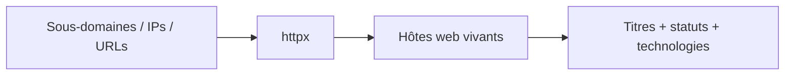

# 🚀 httpx — Probe HTTP massif de la surface d'attaque

> [!info] **En 1 phrase**
> httpx transforme une liste de domaines et d'IPs en inventaire des services web vivants, avec titre, statut et technologies.

---

## 🧾 Overview

| Champ | Valeur |
|---|---|
| Nom complet | httpx (HTTP prober de ProjectDiscovery) |
| Description | Probeur HTTP haute performance : détection des services web vivants (HTTP/HTTPS), collecte de statuts, titres, technologies, TLS, redirections et métadonnées d'infrastructure |
| Catégorie | Reconnaissance & OSINT |
| Sous-catégorie | Probing HTTP / énumération de services web |
| Fonction principale | Valider les cibles web vivantes et en extraire les métadonnées exploitables |
| Type d'outil | CLI (pipeline stdin/stdout) |
| Licence | MIT |
| Open source / propriétaire | Open source |
| Langage(s) de programmation | Go |
| Développeur / organisation | ProjectDiscovery |
| Projet officiel | ProjectDiscovery |
| Dépôt officiel | https://github.com/projectdiscovery/httpx |
| Documentation officielle | https://docs.projectdiscovery.io/tools/httpx/usage |
| Date de création | 2019 (premier commit du dépôt) |
| État du projet | actif |
| Dernière version connue | v1.10.0 (2026-07-09) |
| Systèmes compatibles | Linux, Windows, macOS (binaires précompilés + `go install`) |

> [!note] Pour vérifier / compléter
> httpx fait partie de la suite ProjectDiscovery. Il teste les ports 80/443 par défaut et supporte les ports additionnels via `-ports`. `-td` (tech detect) s'appuie sur des signatures de technologies (type Wappalyzer).

---

## 🎯 Concept

httpx est le probeur HTTP de l'écosystème projectdiscovery. En position de carrefour dans la phase de recon, il reçoit les sous-domaines énumérés par subfinder, les hôtes validés par dnsx ou les ports ouverts découverts par naabu, et teste pour chaque hôte la présence d'un service web (HTTP et/ou HTTPS). Pour chaque cible vivante, il collecte les métadonnées exploitables : code de statut, titre de page, en-têtes, technologies détectées, TLS, redirections, longueur de réponse, résolution IP, CNAME, CDN, ASN. Sortie texte ou JSON, il alimente directement nuclei pour le scan de vulnérabilités, ou n'importe quelle étape suivante du pipeline de recon.



---

## 🧠 Concepts fondamentaux

| Concept | Explication |
|---|---|
| Probing | Envoyer une requête HTTP(S) à chaque hôte pour vérifier qu'un service web répond |
| Code de statut HTTP | Réponse du serveur : 200 OK, 301/302 redirection, 401 non autorisé, 404… |
| Redirection | Le serveur répond 3xx vers une autre URL : à suivre (`-fr`) pour atteindre le contenu réel |
| Virtual host | Plusieurs sites sur la même IP/port : détectés via `-vhost` |
| Tech detect (`-td`) | Fingerprinting des technologies (frameworks, CMS, serveurs) par signatures de réponses |
| TLS/SSL | Certificats et versions TLS : extraits via `-tls-probe` |
| CDN / CNAME / ASN | Métadonnées d'infrastructure : réseau de diffusion, alias DNS, numéro de système autonome |
| User-Agent | En-tête identifiant le client ; `-random-agent` le rend aléatoire pour éviter les filtres simples |

---

## 🛠️ Installation

### Debian / Ubuntu / Kali Linux

```bash
# Binaire précompilé depuis les releases GitHub
wget https://github.com/projectdiscovery/httpx/releases/download/v1.10.0/httpx_1.10.0_linux_amd64.zip
unzip httpx_1.10.0_linux_amd64.zip && sudo mv httpx /usr/local/bin/
# Ou via go
go install -v github.com/projectdiscovery/httpx/cmd/httpx@latest
```

### Arch Linux

```bash
# Via binaire précompilé ou go
go install -v github.com/projectdiscovery/httpx/cmd/httpx@latest
```

### Fedora / RHEL

```bash
go install -v github.com/projectdiscovery/httpx/cmd/httpx@latest
```

### macOS

```bash
brew install httpx
```

### Windows

```powershell
# Binaire précompilé (httpx_1.10.0_windows_amd64.zip) depuis les releases GitHub
# ou
go install -v github.com/projectdiscovery/httpx/cmd/httpx@latest
```

### Docker

```bash
docker pull projectdiscovery/httpx
echo https://example.com | docker run --rm -i projectdiscovery/httpx -sc -title -td
```

### Compilation depuis les sources

```bash
git clone https://github.com/projectdiscovery/httpx.git && cd httpx
go build -o httpx cmd/httpx/main.go
sudo mv httpx /usr/local/bin/
```

> [!warning] ⚠️ Prérequis & problèmes potentiels
> - Go 1.21+ pour la compilation.
> - Les ports testés par défaut sont 80/443 : les services web sur d'autres ports nécessitent `-ports`.
> - Un gros volume de probes peut déclencher les WAF/rate limiters de la cible : ajuster `-threads` et `-rate-limit`.

---

## ⚙️ Configuration

Pas de fichier de configuration : tout passe par les options CLI.

| Paramètre | Rôle | Valeur possible | Impact | Exemple |
|---|---|---|---|---|
| `-l <f>` | Fichier d'entrée (une cible par ligne) | chemin | Traite une liste au lieu du stdin | `httpx -l hosts.txt` |
| `-ports <liste>` | Ports additionnels | liste | Découvre les services web hors 80/443 | `-ports 8080,8443,8000` |
| `-threads <n>` | Concurrence | entier | Vitesse vs bruit | `-threads 50` |
| `-rate-limit <n>` | Requêtes/seconde | entier | Évite le ban IP | `-rate-limit 150` |
| `-timeout <s>` | Timeout de connexion | entier | Fiabilité | `-timeout 10` |
| `-retries <n>` | Tentatives | entier | Réseaux instables | `-retries 2` |
| `-mc <codes>` / `-fc <codes>` | Codes gardés / filtrés | liste | Ciblage des résultats | `-mc 200,301,302` |
| `-o <f>` | Fichier de sortie | chemin | Persistance | `-o live.txt` |
| `-json` | Sortie JSON | booléen | Parsing structuré | `-json` |
| `-silent` | Sortie épurée | booléen | Pipeline | `-silent` |
| `-duc` | Désactive la vérif. de mise à jour | booléen | CI | `-duc` |

---

## 🏗️ Architecture interne

- **Moteur HTTP** : basé sur `retryablehttp` et `fastdialer` (pools de connexions, résolution DNS interne, IPv4/IPv6, redirections). Chaque cible est sondée en HTTP puis HTTPS selon les options.
- **Détection de technologies** : moteur de signatures (headers, HTML, cookies, CDN) pour identifier frameworks/CMS/serveurs (`-td`).
- **Probes TLS** : handshake TLS, extraction du certificat, version TLS, JARM (`-tls-probe`, `-jarm`).
- **Métadonnées infra** : résolution IP, CNAME, détection CDN, ASN via des bases internes (`-ip`, `-cname`, `-cdn`, `-asn`).
- **Pipeline de sortie** : normalisation ligne par ligne (statut, titre, technologies, redirections) ou JSON ; déduplication intégrée.
- **Intégration pdtm** : installable/mise à jour via ProjectDiscovery Tools Manager.

---

## ⌨️ Commandes

### Commandes principales

```bash
httpx [flags] [listes/URLs]
```

| Commande | Objectif | Résultat attendu |
|---|---|---|
| `echo https://example.com \| httpx -sc -title -td` | Probe simple d'une URL | Statut, titre, technologies |
| `subfinder -d example.com -silent \| httpx -sc -title -td -silent` | Pipeline subfinder → httpx | Inventaire web des sous-domaines |
| `cat urls.txt \| httpx -sc -title -cl -location -web-server -o live.txt` | Métadonnées complètes | Fichier d'inventaire |
| `httpx -l hosts.txt -sc -title -td -json -o live.json` | Depuis un fichier, sortie JSON | JSON exploitable |
| `cat subs.txt \| httpx -mc 200,301,302 -fr -silent` | Ne garder que les codes utiles | Cibles web principales |
| `httpx -l hosts.txt -vhost -sc -title -silent` | Détection de virtual hosts | Sites additionnels |

### Commandes avancées

```bash
# Probes multi-ports
echo sub.example.com | httpx -ports 80,443,8080,8443 -sc -title -td
# Audit TLS + infra
httpx -l subs.txt -tls-probe -td -cname -asn -ip -silent
# Random agent pour passer les filtres simples
httpx -l subs.txt -random-agent -sc -title -silent
# Sortie JSON complète pour le pipeline
httpx -l subs.txt -sc -title -td -cl -json -o live.json
```

---

## 🎚️ Options et flags

| Option | Description | Exemple | Niveau |
|---|---|---|---|
| `-sc` | Code de statut HTTP | `httpx -sc` | Basic |
| `-title` | Titre de la page | `httpx -title` | Basic |
| `-td` | Détection de technologies | `httpx -td` | Basic |
| `-cl` | Longueur du contenu | `httpx -cl` | Basic |
| `-location` | Destination de redirection | `httpx -location` | Basic |
| `-web-server` | En-tête `Server` | `httpx -web-server` | Basic |
| `-fr` / `-follow-redirects` | Suit les redirections | `httpx -fr` | Intermediate |
| `-fhr` / `-follow-host-redirects` | Suit les redirections inter-hôtes | `httpx -fhr` | Advanced |
| `-mc <codes>` / `-fc <codes>` | Garder / exclure des codes | `-mc 200,301,302` | Intermediate |
| `-vhost` | Détection de virtual hosts | `httpx -vhost` | Advanced |
| `-cdn` / `-cname` / `-asn` / `-ip` | Infos infra | `httpx -cname -asn -ip` | Intermediate |
| `-tls-probe` | Certificat TLS | `httpx -tls-probe` | Advanced |
| `-random-agent` | User-Agent aléatoire | `httpx -random-agent` | Intermediate |
| `-ports <liste>` | Ports additionnels | `-ports 8080,8443` | Intermediate |
| `-favicon` | Hash du favicon (recherche Shodan) | `httpx -favicon` | Advanced |
| `-jarm` | Empreinte JARM du TLS | `httpx -jarm` | Expert |
| `-http2` | Probe HTTP/2 | `httpx -http2` | Expert |
| `-csp-probe` | Analyse CSP (endpoints) | `httpx -csp-probe` | Expert |
| `-json` | Sortie JSON | `httpx -json` | Advanced |
| `-silent` | Sortie épurée | `httpx -silent` | Basic |
| `-threads <n>` | Concurrence | `-threads 50` | Intermediate |
| `-rate-limit <n>` | Requêtes/seconde | `-rate-limit 150` | Advanced |
| `-o <f>` | Fichier de sortie | `-o live.txt` | Basic |

> [!tip] Options les plus utiles au quotidien
> `-sc -title -td` (l'essentiel), `-mc 200,301,302 -fr` (ciblage), `-json` (pipeline), `-ports` (services hors 80/443), `-silent` (sortie propre).

---

## 🧪 Exemples pratiques

### Beginner

```bash
# Probe simple
echo https://example.com | httpx -sc -title -td
# Depuis un fichier
httpx -l subs.txt -sc -title -silent -o live.txt
```

### Intermediate

```bash
# Pipeline subfinder → httpx
subfinder -d example.com -all -silent | httpx -sc -title -td -silent
# Métadonnées complètes
cat urls.txt | httpx -sc -title -cl -location -web-server -o live.txt
```

### Advanced

```bash
# Probes multi-ports + technologies
httpx -l hosts.txt -ports 80,443,8080,8443 -sc -title -td -cl -silent
# Vhosts et infra cachée
httpx -l subs.txt -vhost -sc -title -td -web-server -silent
```

### Expert

```bash
# Audit TLS de la surface web
httpx -l subs.txt -tls-probe -td -cname -asn -ip -silent
# Pipeline complet vers nuclei
subfinder -d example.com -all -silent \
  | httpx -sc -title -td -cl -json \
  | tee live.json \
  | nuclei -jsonl -severity high,critical
# Favicon hash pour retrouver des hôtes similaires sur Shodan
httpx -l subs.txt -favicon -silent
```

---

## 🧪 Workflow complet (scénario pas à pas)

1. **Énumérer les sous-domaines** — collecter toutes les cibles potentielles avant le probe.
   ```bash
   subfinder -d example.com -all -silent -o subs.txt
   ```
2. **Prober les hôtes** — convertir les noms DNS en services web vivants.
   ```bash
   httpx -l subs.txt -sc -title -td -cl -silent -o live.txt
   ```
3. **Classer les résultats** — identifier les codes intéressants (200, 301, 302, 401) et les technologies.
   ```bash
   grep -E "\[20[01]\]|\[302\]|\[401\]" live.txt
   ```
4. **Générer la sortie JSON** — pour alimenter nuclei et les scripts d'analyse.
   ```bash
   httpx -l subs.txt -sc -title -td -json -o live.json
   ```
5. **Lancer le scan de vulnérabilités** — httpx fournit des cibles propres à nuclei.

---

## 🎬 Scénarios avancés

### Scénario 1 : pipeline recon complet

```bash
subfinder -d example.com -all -silent \
  | httpx -sc -title -td -cl -json \
  | tee live.json \
  | nuclei -jsonl -severity high,critical
```

### Scénario 2 : découverte de vhosts et d'infra cachée

```bash
httpx -l subs.txt -vhost -sc -title -td -web-server -silent
```

### Scénario 3 : audit TLS de la surface web

```bash
httpx -l subs.txt -tls-probe -td -cname -asn -ip -silent
```

---

## 🛡️ Cybersecurity use cases

| Phase | Utilisation |
|---|---|
| Reconnaissance | Inventaire des services web vivants sur un périmètre |
| Énumération | Collecte de titres, statuts, technologies, redirections |
| Énumération | Détection de virtual hosts et d'infrastructure cachée |
| Énumération | Audit TLS et certificats (expiration, faiblesses) |
| Vulnérabilité | Alimenter nuclei avec des cibles propres et ciblées |

---

## 🎯 MITRE ATT&CK

| Tactique | Technique / Sub-technique | ID | Raison | Détection | Mitigation |
|---|---|---|---|---|---|
| Reconnaissance | Active Scanning : Scanning IP Blocks | T1595.001 | Probing HTTP massif des hôtes du périmètre | WAF/logs d'accès : volume anormal de requêtes | Rate limiting, challenge JS, blocage des UA connus |
| Discovery | Network Service Discovery | T1046 | Détection des services web et de leurs versions | Corrélation des connexions HTTP sortantes | Firewall, segmentation |
| Reconnaissance | Active Scanning : Vulnerability Scanning | T1595.002 | Les versions/technologies collectées préparent le scan de vulnérabilités (nuclei) | Pics de requêtes structurées | Patching, masquage des bannières |

> [!note] Ne renseigner que si l'association est réellement pertinente.
> httpx relève principalement de T1595.001 (scan actif) et T1046 (découverte de services).

---

## 🛡️ Defensive Security

### Signes observables

| Indicateur | Détail |
|---|---|
| Burst de requêtes HTTP structurées avec un User-Agent type projectdiscovery | Volume anormal sur les logs d'accès |
| Requêtes simultanées sur de nombreux sous-domaines | Profil de probing massif |
| Patterns de probes `-title` / `-td` reconnaissables | Champs de requête identiques (ex. préférences Accept) |
| Récupération des certificats TLS et des réponses complètes | Trafic de handshake TLS répété |

### Règles de détection (Sigma / Suricata / Snort / YARA)

```yaml
# Sigma — Exécution de httpx sur un endpoint Linux
# Adaptation pédagogique de la règle SigmaHQ proc_creation_lnx_susp_network_utilities_execution
title: Linux HTTP Probing Tool Execution
id: 9f6e3c2a-1d8b-4e5f-a7c3-2b9d4e8f6a10
status: test
logsource:
    category: process_creation
    product: linux
detection:
    selection:
        Image|endswith:
            - '/httpx'
        CommandLine|contains:
            - '-td'
            - '-title'
            - '-sc'
    condition: selection
falsepositives:
    - Legitimate ProjectDiscovery usage
level: medium
```

```bash
# Suricata — rafale de requêtes GET vers un même hôte depuis une source
# (adaptation pédagogique ; ajuster seuil et fenêtre)
alert http any any -> any any (msg:"ET SCAN Multiple HTTP Probes"; \
  flow:to_server; content:"GET "; http_method; \
  threshold:type both, track by_src, count 100, seconds 60; sid:2026006; rev:1;)
```

```yaml
# YARA — détection du binaire httpx
rule Httpx_Binary_Detection {
    meta:
        description = "Detection of httpx binary strings"
        author = "SOC"
    strings:
        $a = "httpx"
        $b = "projectdiscovery"
        $c = "gologger"
    condition:
        any of them
}
```

> [!note] À vérifier
> Exemples pédagogiques : adapter les seuils, l'User-Agent et les sources de logs (WAF, reverse proxy, EDR) à votre environnement.

---

## 🤖 Automatisation

```bash
# Bash — boucle sur plusieurs domaines
for d in example.com example.org; do
    subfinder -d "$d" -silent | httpx -sc -title -td -silent -o "web_$d.txt"
done
cat web_*.txt | sort -u > inventaire_web.txt
```

```python
# Python — httpx en sous-processus, parsing JSON
import subprocess, json

def probe(urls, extra=None):
    cmd = ["httpx", "-sc", "-title", "-td", "-json", "-silent"]
    if extra:
        cmd += extra
    out = subprocess.run(cmd, input="\n".join(urls).encode(),
                         capture_output=True).stdout
    return [json.loads(l) for l in out.splitlines() if l.strip()]

for hit in probe(["https://example.com", "https://sub.example.com"], ["-ports", "8080"]):
    print(hit.get("url"), hit.get("status_code"), hit.get("title"))
```

```yaml
# cron — rafraîchissement hebdomadaire de l'inventaire web
0 6 * * 1  cat /opt/recon/subs.txt | httpx -sc -title -td -silent -o /opt/recon/web.txt
```

---

## 📤 Output et parsing

Sorties : texte formaté (ligne par ligne) ou JSON (`-json`, un objet par ligne).

```bash
# Sortie texte typique :
# https://example.com [200] [Example Domain] [nginx]
# Filtrer les codes
httpx -l subs.txt -sc -title -td -silent | grep "\[200\]"
# JSON → jq
httpx -l subs.txt -sc -title -td -json -silent | jq -r '.url + " " + .title'
```

```python
# Python — parsing JSON
import json
with open("live.json") as f:
    for line in f:
        if not line.strip():
            continue
        hit = json.loads(line)
        print(hit.get("url"), hit.get("status_code"), hit.get("title"))
```

---

## 🔗 Intégrations

- [[Tools|🧰 Outils]] global
- [[Outil - subfinder|subfinder]] — source amont (sous-domaines)
- [[Outil - dnsx|dnsx]] — validation DNS avant probing
- [[Outil - naabu|naabu]] — scan de ports pour trouver les services web
- [[Outil - nuclei|nuclei]] — scan de vulnérabilités sur les hôtes vivants
- [[Outil - gau|gau]] / [[Outil - waybackurls|waybackurls]] — URLs historiques à valider
- [[Outil - katana|katana]] — crawl approfondi des hôtes confirmés
- [[01 - Reconnaissance|🕵️ Reconnaissance]]

```text
subfinder → dnsx → httpx → nuclei
                  ↘ (endpoints) → katana / ffuf
```

---

## 🔄 Alternatives

| Outil | Avantages | Inconvénients | Cas d'usage |
|---|---|---|---|
| `curl`/`wget` | Universel, présent partout | Un hôte à la fois, pas d'inventaire | Vérification ponctuelle |
| `httprobe` (tomnomnom) | Simple, rapide | Moins de métadonnées | Probing minimaliste |
| `nmap` (`http-title`, `-sV`) | Détaillé, scripts | Plus lent, moins orienté pipeline | Intégration scan réseau |
| `meg` (tomnomnom) | Requêtes multiples organisées | Nécessite un fuzzer/wordlist | Test de nombreux paths |
| `wappalyzer` (CLI) | Fingerprinting approfondi | Mono-fonction | Analyse de technologies |

> **Quand utiliser httprobe plutôt que httpx ?** Pour un probing minimal et ultra-rapide sans métadonnées. httpx prend le relais dès qu'on veut titre, statut, technologies, TLS et sortie JSON.

---

## ⚡ Performance

- Concurrence Go élevée (`-threads`), connexions persistantes, résolution DNS intégrée : milliers de probes possibles.
- `-rate-limit` permet de doser pour ne pas déclencher les protections de la cible.
- `-mc`/`-fc` réduisent les résultats avant sortie : pipeline plus léger.
- Pas de benchmark officiel : le débit réel dépend du réseau, de la cible et des ports sondés.

> [!note] À vérifier
> Les performances varient fortement selon le nombre de ports testés et les timeouts. Adapter `-threads`/`-rate-limit` au contexte.

---

## 🛠️ Troubleshooting

### Common problems

#### Problème : les services web sur des ports non standards sont manqués

- **Cause** : seuls 80/443 sont testés par défaut.
- **Solution** : ajouter `-ports 8080,8443,8000,3000,5000…`.
- **Vérification** : `echo https://10.10.10.10 | httpx -ports 8080 -sc -title`.

#### Problème : pas de résultat malgré un site actif derrière une redirection

- **Cause** : redirections 3xx non suivies.
- **Solution** : ajouter `-fr` (ou `-fhr` pour les redirections inter-hôtes).
- **Vérification** : `echo https://example.com | httpx -fr -location -sc`.

#### Problème : « 200 » sur toutes les réponses (faux positifs)

- **Cause** : WAF/page d'erreur générique qui renvoie 200.
- **Solution** : croiser `-cl` et `-title` pour repérer les réponses identiques.
- **Vérification** : comparer les longueurs de contenu sur plusieurs URL.

#### Problème : l'IP source est bloquée (WAF)

- **Cause** : volume de probes trop élevé.
- **Solution** : baisser `-threads`, ajouter `-rate-limit`, espacer les passes.
- **Vérification** : relancer avec `-rate-limit 50`.

---

## 🔐 Sécurité de l'outil

- **Volumétrie** : un probing agressif est détectable (logs WAF, taux de requêtes anormal) — à doser selon l'engagement.
- **User-Agent** : par défaut reconnaissable ; `-random-agent` ou `-ua` pour le personnaliser (mais pas une garantie d'anonymat).
- **Données collectées** : titres/technologies/certs alimentent le rapport — pas de modification de données serveur.
- **Usage légal** : uniquement sur des cibles autorisées ; les probes actives sont visibles par la cible.

---

## ⚠️ Limitations

- Par défaut, seuls les ports 80/443 sont testés : les services web sur d'autres ports nécessitent `-ports`.
- Un faux 200 (WAF) peut polluer les résultats : toujours croiser `-cl`/`-title`.
- Sans `-fr`, les cibles derrière des redirections 3xx peuvent être manquées.
- Pas de scan de vulnérabilités : c'est un outil d'inventaire, à coupler avec nuclei.
- La détection de technologies (`-td`) est heuristique : pas exhaustive.

---

## 📋 Cheatsheet

```bash
# L'essentiel
echo https://example.com | httpx -sc -title -td

# Inventaire depuis un fichier
httpx -l subs.txt -sc -title -td -cl -silent -o live.txt

# Ne garder que les codes utiles
cat subs.txt | httpx -mc 200,301,302 -fr -silent

# Ports additionnels
httpx -l hosts.txt -ports 8080,8443,8000 -sc -title -silent

# Vhosts
httpx -l subs.txt -vhost -sc -title -silent

# Audit TLS
httpx -l subs.txt -tls-probe -cname -asn -ip -silent

# Sortie JSON pour pipeline
httpx -l subs.txt -sc -title -td -json -o live.json
```

---

## ⚡ Quick reference

| | |
|---|---|
| **À quoi sert-il ?** | Inventorier les services web vivants et leurs métadonnées (statut, titre, technologies, TLS) |
| **Quand l'utiliser ?** | Après la validation DNS (dnsx), avant nuclei ou katana |
| **Commande principale** | `cat subs.txt \| httpx -sc -title -td -silent` |
| **Alternative principale** | httprobe (minimal), nmap -sV (détaillé) |
| **Concepts importants** | Probing, statuts HTTP, redirections, tech detect, TLS, pipeline |
| **Liens associés** | [[Outil - subfinder]] · [[Outil - dnsx]] · [[Outil - nuclei]] · [[Outil - naabu]] |

---

## 🔍 Détection & Défense

| Signe | Défense |
|---|---|
| Burst de requêtes HTTP structurées avec un User-Agent type projectdiscovery | Rate limiting, challenge JS / captcha sur les gros pics |
| Requêtes simultanées sur de nombreux sous-domaines | WAF et règles de détection de crawling (volume, User-Agent) |
| Patterns de probes `-title` / `-td` reconnaissables | Bloquer les UA connus de scanners, surveiller les logs d'accès |

---

## ⚠️ Tips & Pièges

> [!tip] 💡 **Tips**
> - Active `-random-agent` pour passer les filtres d'User-Agent simples.
> - En bug bounty, trie d'abord avec `-mc 200,301,302 -fr` pour ne suivre que l'essentiel.
> - `-json` est la sortie reine pour le pipeline : parse-la avec `jq -r '.url + " " + .status_code'`.
> - Pense à `-ports` pour les services web hors 80/443 (Très fréquents sur Docker/K8s).

> [!warning] ⚠️ **Pièges**
> - Sans `-fr`, httpx n'affiche pas le résultat final des redirections : tu rates les services derrière les 3xx.
> - Seuls les ports par défaut (80/443) sont testés : ajoute `-ports 8080,8443` si besoin.
> - Un faux 200 (page d'erreur WAF) pollue les résultats : croise `-cl` et `-title` pour repérer les réponses identiques.
> - `-td` est heuristique : les technologies peuvent être manquées ou mal identifiées.

---

## 📚 References

### Official

- GitHub officiel httpx : https://github.com/projectdiscovery/httpx
- Documentation projectdiscovery httpx : https://docs.projectdiscovery.io/tools/httpx/usage
- Releases officielles : https://github.com/projectdiscovery/httpx/releases

### Security references

- MITRE ATT&CK T1595 — Active Scanning : https://attack.mitre.org/techniques/T1595/
- MITRE ATT&CK T1046 — Network Service Discovery : https://attack.mitre.org/techniques/T1046/
- SigmaHQ — proc_creation_lnx_susp_network_utilities_execution : https://github.com/SigmaHQ/sigma/blob/master/rules/linux/process_creation/proc_creation_lnx_susp_network_utilities_execution.yml

### Community

- Blog ProjectDiscovery — recon pipelines : https://blog.projectdiscovery.io
- HackTricks — Web/HTTP reconnaissance : https://book.hacktricks.xyz/network-services-pentesting/pentesting-web

---

➡️ **Liens :** [[Tools|🧰 Outils]] · [[Outil - subfinder|subfinder]] · [[Outil - nuclei|nuclei]] · [[01 - Reconnaissance|🔎 Reconnaissance]]
