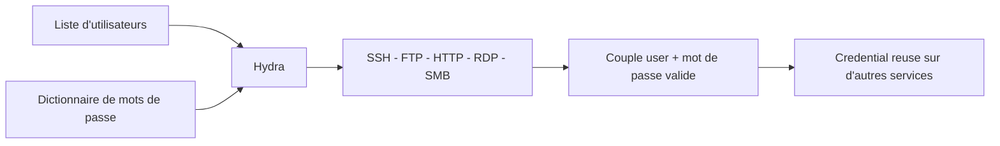

# 💥 Hydra — Brute-force de connexions

> [!info] **En 1 phrase**
> Hydra = brute-force de login multi-protocoles : il teste des couples user/mot de passe sur SSH, FTP, HTTP(S), RDP, SMB et des dizaines d'autres services.

---

## 🧾 Overview

THC-Hydra est le brute-forcer **en ligne** de référence : développé en C par van Hauser (THC) avec de nombreux modules écrits par David Maciejak, sous licence **AGPLv3**, il est maintenu sur `vanhauser-thc/thc-hydra` (~12 000 étoiles). La version stable actuelle est **9.7** (mai 2026) ; la 9.6 (septembre 2025) a apporté le support FreeRDP v3, les corrections gcc-15 et le support HTTP 403 ; la 9.7 ajoute xhydra GTK3, MongoDB v2 et corrige un buffer overflow dans le module POP3.

Contrairement au cracking hors-ligne (hashcat sur un hash volé), Hydra ouvre de **vraies connexions** vers le service cible pour tester chaque combinaison. Il couvre des dizaines de protocoles : SSH, FTP, HTTP(S) GET/POST/formulaires, RDP, SMB/SMB2, SMTP, IMAP, POP3, LDAP, SNMP, MSSQL, MySQL, PostgreSQL, Oracle, VNC, Telnet, SIP, etc.

| Fait | Valeur |
|---|---|
| Version | 9.7 (2026-05-03) ; 9.6 (2025-09-03) |
| Licence | AGPLv3 |
| Langage | C |
| Auteur | van Hauser (THC), modules par David Maciejak |
| Dépôt | github.com/vanhauser-thc/thc-hydra |
| Protocoles | ~50 modules (SSH, FTP, HTTP(S), RDP, SMB, bases de données...) |
| GUI | xhydra (GTK) |
| Docker | `docker pull vanhauser/hydra` |

---

## 🎯 Concept
Hydra (THC-Hydra) est l'outil de **dictionnaire en ligne** (online attack) par excellence : au lieu de cracker un hash hors-ligne, il teste de vraies connexions sur le service cible. On lui fournit un ou plusieurs utilisateurs (`-l`/`-L`) et un ou plusieurs mots de passe (`-p`/`-P`), et il essaie toutes les combinaisons via un module dédié à chaque protocole (SSH, FTP, HTTP(S) GET/POST, RDP, SMB, SMTP, IMAP, LDAP, SNMP, MSSQL, MySQL...). Dans un pentest, il s'utilise après la reconnaissance : une fois un service ouvert et un nom d'utilisateur deviné (ou énuméré), hydra vérifie si un mot de passe faible donne accès. La syntaxe modulaire `hydra <options> service://cible` et le paramètre `-t` (tâches parallèles) permettent d'ajuster la vitesse, tandis que `-f` stoppe au premier succès pour limiter le bruit et les lockouts.



---

## 🧠 Concepts fondamentaux

### Attaque en ligne vs attaque hors-ligne

| Critère | Attaque en ligne (hydra) | Attaque hors-ligne (hashcat) |
|---|---|---|
| Cible | Un service réseau (login réel) | Un hash volé (offline) |
| Détectabilité | Logs d'authentification, lockout | Indétectable |
| Vitesse | Limité par le réseau + délais serveur | GPU, millions de tentatives/s |
| Nécessite | Un user valide probable + service exposé | Un hash du bon type |

Règle d'or : dès qu'un hash est récupéré, passer en **hors-ligne** ; hydra ne sert que quand le hash n'est pas disponible (service exposé, credentials à valider).

### Les modules de protocole

Chaque protocole dispose d'un module dédié (`hydra-ssh.c`, `hydra-ftp.c`, `hydra-http.c`, `hydra-smb.c`...). Le module pilote la phase d'authentification réelle : envoi des données, analyse de la réponse, détermination succès/échec. C'est le module qui sait **interpréter la réponse** du serveur ; sur HTTP, c'est l'utilisateur qui définit le critère de succès (`F=` échec / `S=` succès).

### Le format `service://cible`

Hydra accepte soit `hydra <opts> <hôte> <service>` (ex. `hydra -l admin 10.10.10.10 ssh`), soit la forme URI `hydra <opts> service://<hôte>` (ex. `smb://10.10.10.10`). Le port est inféré du service ; `-s` force un port non standard. Le module HTTP utilise des paramètres positionnels particuliers (`/page:data:critère`).

### Dictionnaire et combinaisons

- `-l user` / `-p pass` : valeurs uniques (utile pour le spraying avec une seule passe).
- `-L fichier` / `-P fichier` : listes (une valeur par ligne).
- `-C fichier` : couples `user:pass` pré-fabriqués (credential stuffing).
- `-x min:max:charset` : génération brute-force inline.
- `-e nsr` : ajoute login vide (`n`), login = pass (`s`), login inversé (`r`).

### Parallélisme, délais et lockout

`-t` contrôle le nombre de tâches simultanées ; `-w` le délai d'attente par tentative ; `-W` le délai entre essais. Un `-t` trop élevé ou l'absence de délai déclenche verrouillage de comptes et bannissement fail2ban : le **spraying lent** (`-t 1 -W 5`) est souvent plus rentable que la rafale.

---

## 🛠️ Installation
```bash
# Linux (Kali / Debian / Ubuntu)
sudo apt update && sudo apt install -y hydra

# Arch
sudo pacman -S hydra

# Fedora / RHEL
sudo dnf install -y hydra

# macOS
brew install hydra

# Windows : via WSL2 ou Cygwin (pas de binaire natif officiel)
# wsl --install

# Docker (image officielle vanhauser/hydra)
docker pull vanhauser/hydra
docker run --rm vanhauser/hydra -l admin -P wordlist.txt ssh://10.10.10.10

# Build depuis les sources (fonctionnalités réseau étendues)
git clone https://github.com/vanhauser-thc/thc-hydra.git
cd thc-hydra
./configure && make && sudo make install
```

> [!note] À vérifier
> Le build depuis les sources nécessite les bibliothèques de développement des protocoles voulus (libssh, libssl, libfreerdp, libpq...) : hydra compile sans elles mais les modules correspondants sont désactivés. `./configure` liste les modules manquants.

---

## ⚙️ Configuration

Hydra ne possède pas de fichier de configuration utilisateur : tout se passe en ligne de commande ou au build.

- **Activation des modules** : au moment du `./configure`, la présence des bibliothèques (`libssh`, `libssl`, `libfreerdp`, `libpq`, `libmysqlclient`, `libldap`...) détermine les modules compilés.
- **xhydra** : l'interface GTK permet de remplir graphiquement les champs (targets, logins, passes, options) puis génère la commande hydra correspondante.
- **Wordlists** : hydra n'embarque **aucun** dictionnaire. Le script `dpl4hydra.sh` (livré avec le paquet) génère une liste de mots de passe par défaut. L'utilitaire **pw-inspector** filtre une liste selon la politique (longueur, classes de caractères) :
  ```bash
  cat dictionary.txt | pw-inspector -m 6 -c 2 -n > passlist.txt
  ```

---

## 🏗️ Architecture interne

Hydra est écrit en C, organisé autour d'un noyau (`hydra.c`, gestion du parallélisme et de la distribution) et d'un **module par protocole** (`hydra-ssh.c`, `hydra-ftp.c`, `hydra-http.c`, `hydra-smb.c`, `hydra-rdp.c`...).

```text
hydra.c (noyau)
   ├── hydra-ssh.c      module SSH (v1/v2)
   ├── hydra-ftp.c      module FTP
   ├── hydra-http.c     module HTTP(S) GET/POST/HEAD/form
   ├── hydra-smb.c      module SMB
   ├── hydra-rdp.c      module RDP
   ├── ... ~50 modules
   └── bfg.c            génération brute-force -x
```

Fonctionnement :
1. Le noyau lit les listes de logins/mots de passe et découpe le travail en tâches.
2. `-t` définit le nombre de **tâches concurrentes** (jusqu'à 64 par défaut selon le module) ; chaque tâche ouvre une connexion au service.
3. Le module écrit la requête d'authentification et analyse la réponse du serveur.
4. En cas de succès, hydra affiche `[<service>] host: ... login: ... password: ...` et, avec `-f`, stoppe la cible concernée.
5. Un journal de progression (`hydra.restore`) permet de reprendre une attaque interrompue avec `-R`.

---

## ⌨️ Commandes
```bash
# SSH : un user + dictionnaire
hydra -l admin -P /usr/share/wordlists/rockyou.txt ssh://10.10.10.10

# Liste d'users + liste de mots de passe + parallélisme + stop au succès
hydra -L users.txt -P pass.txt -t 8 -f 10.10.10.10 ssh

# Formulaire HTTP POST (login web)
hydra -l admin -P pass.txt 10.10.10.10 http-post-form "/login.php:user=^USER^&pass=^PASS^:F=Invalid credentials" -f

# Autres protocoles
hydra -l admin -P pass.txt 10.10.10.10 ftp
hydra -l Administrator -P pass.txt smb://10.10.10.10
hydra -L users.txt -P pass.txt rdp://10.10.10.10
hydra -l user@corp.local -P pass.txt smtp://10.10.10.10
```

## 🎚️ Options et flags

| Option | Effet |
|---|---|
| `-l <user>` | Un seul utilisateur à tester |
| `-L <fichier>` | Liste d'utilisateurs |
| `-p <pass>` | Un seul mot de passe |
| `-P <fichier>` | Dictionnaire de mots de passe |
| `-C <fichier>` | Fichier de couples `user:pass` |
| `-t <N>` | Nombre de tâches parallèles (connexions simultanées) |
| `-f` | Stop dès le premier mot de passe valide (par cible) |
| `-F` | Stop dès qu'un login est trouvé sur n'importe quelle cible |
| `-e nsr` | Essaie aussi login vide (`n`), login = pass (`s`), login inversé (`r`) |
| `-vV` | Verbose : affiche chaque tentative |
| `-o <fichier>` | Écrit les résultats trouvés dans un fichier |
| `-b <format>` | Format de sortie : `text`, `jsonv1`, `json` |
| `-s <port>` | Port non standard |
| `-M <fichier>` | Liste de cibles (une IP/host par ligne) |
| `-u` | Boucle sur les utilisateurs (spraying : une passe → tous les users) |
| `-x <min:max:charset>` | Génération brute-force inline |
| `-R` | Reprend la session depuis `hydra.restore` |
| `-w <s>` | Délai d'attente par connexion |
| `-W <s>` | Délai entre chaque tentative |

### Le module `http-post-form`
Syntaxe : `<page>:<données avec ^USER^ et ^PASS^>:<critère d'échec F= ou de succès S=>`.
```bash
hydra -l admin -P pass.txt 10.10.10.10 http-post-form "/login.php:user=^USER^&pass=^PASS^:F=Invalid credentials" -t 4
```
Le critère (`F=` ou `S=`) doit être **le dernier paramètre** (corrigé dans la 9.5). Des paramètres optionnels existent (ex. `H=` pour un header, `C=` pour un cookie, `2=` pour considérer un code 302 comme un succès).

### Modules principaux
```bash
hydra -l admin -P pass.txt 10.10.10.10 ftp
hydra -l Administrator -P pass.txt smb://10.10.10.10
hydra -L users.txt -P pass.txt rdp://10.10.10.10
hydra -l admin -P pass.txt 10.10.10.10 http-get-form "/dir/index.php:login=^USER^&pass=^PASS^:F=bad" -f
hydra -l sa -P pass.txt 10.10.10.10 mssql
hydra -l admin -P pass.txt 10.10.10.10 imap
hydra -l admin -P pass.txt 10.10.10.10 snmp
```

---

## 🧪 Exemples pratiques

### Bruteforce SSH simple
```bash
hydra -l root -P /usr/share/wordlists/rockyou.txt ssh://10.10.10.10 -t 4 -vV
# [22][ssh] host: 10.10.10.10   login: root   password: toor
```

### Formulaires HTTP avec cookie et token
```bash
# POST avec cookie de session et critère d'échec précis
hydra -l admin -P pass.txt 10.10.10.10 http-post-form \
  "/login.php:csrf=TOKEN&user=^USER^&pass=^PASS^:H=Cookie: PHPSESSID=abc123:F=login failed" -t 8 -f
```

### Service avec port non standard
```bash
hydra -l admin -P pass.txt -s 2222 ssh://10.10.10.10
```

### Bruteforce inline (sans dictionnaire)
```bash
# Mots de passe de 4 à 6 caractères hexadécimaux
hydra -l admin -x 4:6:a 10.10.10.10 ftp
```

### Plusieurs cibles depuis un fichier
```bash
hydra -l admin -P pass.txt -M cibles.txt ssh -t 4 -F
```

---

## 🧪 Workflow complet (scénario pas à pas)
1. **Étape 1 — Repérer le service** : Nmap confirme un SSH ouvert sur `10.10.10.10` avec l'utilisateur `admin` (info leak sur la page web).
   ```bash
   nmap -sV -p 22 10.10.10.10
   ```
2. **Étape 2 — Collecter les noms d'utilisateurs** (énumération web, emails, convention de nommage).
   ```bash
   echo admin > users.txt
   ```
3. **Étape 3 — Lancer hydra** sur le service cible.
   ```bash
   hydra -l admin -P /usr/share/wordlists/rockyou.txt ssh://10.10.10.10 -t 4 -vV -f
   ```
4. **Étape 4 — Vérifier le couple** trouvé par une connexion manuelle.
5. **Étape 5 — Réutiliser** le couple sur d'autres services (FTP, web, email) = **credential reuse**.
   ```bash
   hydra -l admin -P pass.txt 10.10.10.10 ftp
   hydra -l Administrator -P pass.txt smb://10.10.10.10
   ```
6. **Étape 6 — Documenter** les accès validés dans le rapport.

---

## 🎬 Scénarios avancés
### Scénario 1 : Credential stuffing à partir d'un fichier de couples `user:pass`
Tester directement un dump de combinaisons volées avec `-C`.
```bash
hydra -C combo.txt ssh://10.10.10.10 -t 8 -f
# combo.txt : une ligne "user:motdepasse" par compte
```

### Scénario 2 : Password spraying discret sur le domaine (SMB)
Tester un seul mot de passe probable sur tous les comptes, lentement, pour éviter le lockout.
```bash
hydra -L users.txt -p "Summer2026!" smb://10.10.10.20 -t 1 -w 5
```

### Scénario 3 : Reprise d'une attaque interrompue
Si l'attaque est coupée (réseau, lockout temporaire, interrupt), hydra a écrit `hydra.restore` :
```bash
hydra -R
```
Il reprend au point d'arrêt au lieu de tout recommencer. (`-I` ignore le fichier de restauration.)

---

## 🛡️ Cybersecurity use cases

### Pentest / Red team
- **Validation de credentials** : après énumération de comptes (web, LDAP, convention de nommage), hydra teste les mots de passe faibles sur SSH, RDP, FTP, SMB.
- **Credential stuffing** : rejouer un dump `user:pass` sur les services exposés d'une organisation.
- **Password spraying** : une seule passe saisonnière (`-L users.txt -p "Passe-2026!" -u`) sur tous les comptes du domaine.
- **Attaques web applicatives** : brute-force de formulaires de login, d'interfaces d'admin, de VPN.

### CTF
- Hydra est l'outil standard des boxes (THM/HTB) pour trouver le couple sur SSH/FTP/RDP/HTTP.

### SOC / Blue team (usage défensif)
- **Audit interne** : tester ses propres comptes contre des listes faibles, dans un environnement contrôlé.
- **Red team interne** : mesurer l'exposition réelle des services de test avant production.

---

## 🎯 MITRE ATT&CK

| Technique | ID | Rôle de hydra |
|---|---|---|
| Brute Force | T1110 | Attaque par force brute de credentials |
| Password Guessing | T1110.001 | Essais avec des mots de passe devinés sans information préalable |
| Password Spraying | T1110.003 | `-L users.txt -p "une-passe"` : une passe sur tous les comptes |
| Credential Stuffing | T1110.004 | `-C combo.txt` : rejouer des couples volés |
| Valid Accounts | T1078 | Exploitation du couple trouvé pour l'accès légitime |

> [!note] À vérifier
> hydra n'est pas référencé comme logiciel ATT&CK. Les techniques T1110.x décrivent l'activité de brute-force que l'outil exécute.

---

## 🛡️ Defensive Security

### Indicateurs d'attaque

- Rafales d'échecs d'authentification sur un service (événement 4625 Windows, `auth.log` Linux).
- Volume anormal depuis une seule IP source, ou distribution régulière sur plusieurs comptes (spraying).
- Connexions TCP répétées vers le même port avec des payloads d'auth.
- Requêtes HTTP POST successives vers `/login.php` avec des variations de `^USER^`/`^PASS^`.

### Contre-mesures

| Mesure | Effet |
|---|---|
| Politique de **lockout** (seuil, fenêtre) | Bloque le brute-force d'un seul compte |
| `fail2ban` / `sshguard` | Bannit l'IP après N échecs |
| Clés SSH au lieu de mots de passe | Supprime la surface SSH |
| **MFA/2FA** | Rend les credentials seuls inutiles |
| Rate limiting applicatif + CAPTCHA | Ralentit le brute-force web |
| Désactiver les comptes par défaut | Réduit les cibles faciles |

---

## 🤖 Automatisation

### Boucle sur plusieurs services et hôtes

```bash
for host in $(cat cibles.txt); do
  hydra -l admin -P pass.txt -o "rapport_$host.txt" ssh://$host -t 4 -f
done
```

### Parsing de la sortie JSON (`-b jsonv1`)

```bash
hydra -L users.txt -P pass.txt -b jsonv1 -o resultats.json smb://10.10.10.20
# Puis extraire les couples :
python3 -c "import json;d=json.load(open('resultats.json'));[print(r['login']+':'+r['password']) for r in d['results']]"
```

### Exemple de sortie JSON
```json
{
  "quantityfound": 2,
  "results": [
    {"host": "10.10.10.20", "login": "admin", "password": "admin", "port": 445, "service": "smb"}
  ],
  "success": true
}
```

---

## 📤 Output et parsing

- **STDOUT** : résultats en direct avec le format `[<port>][<service>] host: <hôte> login: <user> password: <pass>`.
- **Fichier** : `-o <fichier>` ; le format est choisi avec `-b` : `text`, `jsonv1` ou `json`.
- **Reprise** : hydra écrit `hydra.restore` pour `-R`.

```bash
# Extraire les couples trouvés d'une sortie texte
hydra -L users.txt -P pass.txt ftp://10.10.10.10 -o found.txt
grep "^\[" found.txt | awk '{print $NF}' | tr ':' ' ' 
```

> [!note] À vérifier
> Le format JSON (`-b json`) est un schéma « latest », actuellement identique à `jsonv1` (v1.x). Vérifier la version du schéma dans le champ `jsonoutputversion` avant d'automatiser.

---

## 🔗 Intégrations

| Outil | Intégration |
|---|---|
| Nmap | Détecte le service/port avant hydra ; `-s` pour les ports non standard |
| pw-inspector | Filtrer la wordlist selon la politique de mots de passe |
| dpl4hydra.sh | Générer une liste de mots de passe par défaut |
| xhydra | GUI GTK qui génère la ligne de commande hydra |
| Scripts / SIEM | Sortie `-b jsonv1 -o` exploitable en machine |
| hashcat | Complémentaire : dès qu'un hash est volé, cracker hors-ligne |

---

## 🔄 Alternatives

| Outil | Différence avec hydra |
|---|---|
| Medusa | Parallélisme par hôte, brute-force, également multi-protocoles |
| ncrack | Modules DICOM/WordPress/MQTT/CVS/SMB2, sortie `-oX` XML |
| Patator | Python, écrit pour le diagnostic/évitement de détection |
| msf auxiliary (ssh_login...) | Modules Metasploit, intégration post-exploitation |
| crowbar | Spécialisé brute-force clés SSH/OpenVPN |

---

## ⚡ Performance

- **Parallélisme** : `-t` (jusqu'à plusieurs dizaines de tâches) accélère fortement les services qui le tolèrent.
- **Limites réalistes** : la vitesse dépend du réseau, du serveur et du protocole — souvent de l'ordre de centaines à quelques milliers de tentatives/minute, très loin des millions/s du GPU hors-ligne.
- **Optimisations recommandées** :
  - `cat words.txt | sort | uniq` pour dédupliquer la liste (les doublons font perdre du temps).
  - `pw-inspector` pour ne garder que les passes conformes à la politique.
  - `-K` pour désactiver les tentatives de redo sur les connexions instables (scan de masse).

> [!note] À vérifier
> Aucun benchmark officiel n'existe ; les chiffres varient fortement selon le module et la cible.

---

## 🛠️ Troubleshooting

| Problème | Cause probable | Solution |
|---|---|---|
| `module ssh not compiled` | libssh absente au build | Installer `libssh-dev` et recompiler |
| `[ERROR] invalid password` sur HTTP | Critère F=/S= faux | Tester le login avec un proxy/Burp, ajuster le critère (doit être le dernier paramètre) |
| Lockout massif des comptes | `-t` trop élevé, pas de délai | `-t 1 -W 5`, voire passer en hors-ligne |
| Aucun résultat alors que la passe est bonne | Réponse serveur non interprétée | `-vV` pour voir les tentatives, vérifier le critère de succès |
| `hydra.restore` obsolet | Session interrompue puis modifiée | Reprendre avec `-R` ou ignorer avec `-I` |
| Résultats dupliqués | Dictionnaire non dédupliqué | `sort -u` la wordlist |
| Temps de réponse très lent | Délai d'attente trop court | Augmenter `-w` |

---

## 🔐 Sécurité de l'outil

- **Licence** : AGPLv3, source ouverte ; README : « This tool is for legal purposes only! » et avertissement contre l'usage militaire/secret-service ou illégal.
- **Historique de bugs** : la 9.7 corrige un buffer overflow dans le module POP3 — toujours utiliser la dernière version.
- **Risque opérationnel** : une attaque en ligne peut verrouiller des comptes de production ou déclencher les alarmes SOC. À utiliser avec un périmètre, un contrat et des délais maîtrisés.

---

## ⚠️ Limitations

- **Détectable** : les échecs de login apparaissent dans les logs et les SIEM (contrairement au cracking hors-ligne).
- **Lockout** : les politiques de verrouillage limitent fortement l'efficacité.
- **HTTP** : formulaires avec CSRF, tokens dynamiques, captcha ou IP blocking rendent le brute-force difficile ; il faut parfois pré-traiter les tokens.
- **Vitesse** : limitée par le réseau et le serveur ; pas d'attaque GPU.
- **Windows natif** : pas de binaire officiel (Cygwin/WSL requis).

---

## 📋 Cheatsheet

```bash
# SSH
hydra -l root -P rockyou.txt ssh://IP

# FTP
hydra -l admin -P pass.txt ftp://IP

# RDP
hydra -L users.txt -P pass.txt rdp://IP

# SMB
hydra -l Administrator -P pass.txt smb://IP

# Formulaire web POST
hydra -l admin -P pass.txt IP http-post-form "/login.php:user=^USER^&pass=^PASS^:F=bad" -f

# Spraying (une passe, tous les users)
hydra -L users.txt -p "Passe2026!" smb://IP -u -t 1

# Credential stuffing
hydra -C combo.txt ssh://IP

# Bruteforce inline
hydra -l admin -x 4:6:a IP ftp

# Reprise
hydra -R

# Sortie JSON
hydra -l admin -P pass.txt -b jsonv1 -o out.json ssh://IP
```

## ⚡ Quick reference

| Service | Syntaxe |
|---|---|
| SSH | `hydra -l U -P p.txt ssh://IP` |
| FTP | `hydra -l U -P p.txt ftp://IP` |
| RDP | `hydra -L u.txt -P p.txt rdp://IP` |
| SMB | `hydra -l U -P p.txt smb://IP` |
| SMTP | `hydra -l U -P p.txt smtp://IP` |
| MSSQL | `hydra -l sa -P p.txt mssql://IP` |
| MySQL | `hydra -l root -P p.txt mysql://IP` |
| PostgreSQL | `hydra -l postgres -P p.txt postgres://IP` |
| VNC | `hydra -P p.txt vnc://IP` |
| LDAP | `hydra -l U -P p.txt ldap://IP` |
| SNMP | `hydra -P p.txt snmp://IP` |
| HTTP-POST | `hydra ... http-post-form "/p:u=^USER^&p=^PASS^:F=err"` |

---

## 🔍 Détection & Défense
| Signe | Défense |
|---|---|
| Pic de connexions échouées sur un même compte (événement 4625 Windows / auth.log) | Politique de **lockout** et seuil de verrouillage de compte |
| Volume anormal de connexions depuis une seule IP source | `fail2ban` / `sshguard` : bannissement après N échecs |
| Tentatives rapides et successives sur SSH (multiples logins) | Désactiver l'auth par mot de passe, clés SSH uniquement |
| Connexions vers plusieurs protocoles depuis la même IP | **MFA/2FA**, SIEM corrélé aux auth failures |
| Requêtes HTTP POST répétées sur `/login.php` | Rate limiting applicatif, CAPTCHA, journalisation des login |
| Distribution uniforme de tentatives sur tous les comptes (spraying) | Seuils de détection de spraying, alerte sur changement de comportement |

---

## ⚠️ Tips & Pièges
> [!tip] 💡 **Tips**
> - Utilise `-f` pour arrêter au premier succès et limiter le bruit.
> - Pense au **credential stuffing** : un couple trouvé sur SSH vaut souvent pour la webapp et l'email de la même organisation.
> - `-e nsr` élargit les essais sans nouveau dictionnaire (login vide, login = pass, login inversé).
> - Pour le web, valide d'abord le critère `F=`/`S=` sur un login connu (bon ou mauvais) avant de lancer le batch.
> - `-u` est ton allié pour le spraying : on change de user après chaque mot de passe testé, pas l'inverse.
> - Déduplique les wordlists (`sort -u`) et filtre avec `pw-inspector` : un dictionnaire propre fait gagner énormément de temps.

> [!warning] ⚠️ **Pièges**
> - Le brute-force **en ligne** déclenche lockout et logs : préfère une attaque **hors-ligne** (hashcat) dès qu'un hash est disponible.
> - Sans `-f`, hydra continue de taper sur le compte même après succès → verrouillage possible.
> - Sur HTTP, la cible peut modifier l'URL ou le message d'erreur : ajuste le critère `F=`/`S=` sinon hydra signale de faux positifs.
> - Un compte verrouillé par tes essais peut casser la production (service critique, compte de service) — périmètre et test contrôlé obligatoires.

---

## 📚 References

### Official
> [!info] 📚 **Sources**
> - [vanhauser-thc/thc-hydra (GitHub)](https://github.com/vanhauser-thc/thc-hydra)
> - [Manuel hydra (Kali)](https://www.kali.org/tools/hydra/)
> - [Site THC-Hydra](https://www.thc.org/thc-hydra/)
> - [Docker vanhauser/hydra](https://hub.docker.com/r/vanhauser/hydra)

### Security & Community
> [!info] 📚 **Ressources complémentaires**
> - [Releases hydra (notes de version 9.x)](https://github.com/vanhauser-thc/thc-hydra/releases)
> - [MITRE ATT&CK — Brute Force T1110](https://attack.mitre.org/techniques/T1110/)

---

➡️ **Liens :** [[Tools|🧰 Outils]] · [[Techniques/Password Spraying|🧂 Password Spraying]] · [[Techniques/Privilege Escalation Linux|🐧 PrivEsc Linux]] · [[Techniques/Reverse Shells|🐚 Reverse Shells]] · [[Techniques/Password Cracking|Password Cracking]] · [[Outils/Outil - ncrack|ncrack]] · [[Outils/Outil - Medusa|Medusa]]
