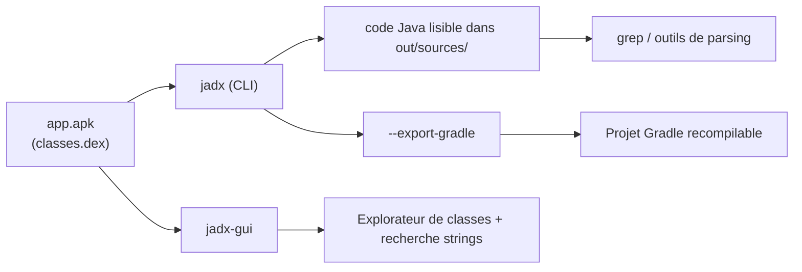

# jadx — Mobile & Reverse Engineering

> [!info] **En 1 phrase**
> **jadx** est le décompilateur **Java/Dalvik** le plus pratique : il transforme le bytecode dex d'un APK
> en **code source Java lisible**, avec une GUI (`jadx-gui`), une recherche de strings et même
> **l'export d'un projet Gradle** (moins connu).

---

## Overview

| Champ | Valeur |
|---|---|
| Nom complet | jadx (Java Decompiler for DEX) |
| Description | Décompilateur Java pour bytecode DEX/APK/class/jar : produit du code source Java lisible, avec CLI et GUI |
| Catégorie | Mobile & Reverse Engineering |
| Sous-catégorie | Reverse statique d'applications Android (décompilation du bytecode) |
| Fonction principale | `jadx -d out/ app.apk` (décompile en Java), `jadx-gui app.apk` (navigation interactive) |
| Type d'outil | CLI (`jadx`) + GUI (`jadx-gui`) |
| Licence | Apache License 2.0 |
| Langage(s) de programmation | Java (outil), Kotlin/Java (développement) |
| Développeur / organisation | skylot et la communauté jadx |
| Projet officiel | skylot/jadx |
| Dépôt officiel | https://github.com/skylot/jadx |
| Documentation officielle | https://github.com/skylot/jadx/wiki |
| Dernière version connue | 1.5.6 (10/07/2026) |
| Systèmes compatibles | Linux, Windows, macOS — nécessite Java 11+ (JDK 17 recommandé) |

---

## Concept

Un APK Android contient le bytecode **DEX (Dalvik Executable)** — le code exécuté par la machine virtuelle Dalvik/ART — ainsi que des ressources binaires (`resources.arsc`, `res/*.xml`), le manifeste (`AndroidManifest.xml`), les bibliothèques natives (`lib/*.so`) et les assets. jadx (Java Decompiler + DEX) **remonte le processus inverse de la compilation** : il parse le DEX, construit une représentation intermédiaire (IR), puis **génère du code source Java lisible** (la chaîne smali → IR → Java). La GUI `jadx-gui` ajoute un explorateur de classes, une recherche plein texte dans tout le projet et la navigation par **références croisées** (jump to declaration / find usage).

Dans un pentest mobile ou une analyse de malware, jadx sert à **comprendre la logique d'une application sans l'exécuter** : repérer les endpoints API et les domaines, retrouver clés et secrets hardcodés, analyser les flux d'authentification, identifier des composants exposés, ou préparer le terrain pour un hook Frida. Il est complémentaire d'**apktool** (qui produit le smali modifiable et décode les ressources pour le repackaging) et de **Frida** (instrumentation runtime) : jadx est le meilleur point de départ pour l'**analyse statique** d'une app Android.



---

## Concepts fondamentaux

| Concept | Explication |
|---|---|
| DEX (Dalvik Executable) | Fichier contenant le bytecode exécuté par la VM Dalvik/ART. Les apps modernes sont éclatées en plusieurs DEX (`classes.dex`, `classes2.dex`…) à cause de la limite de 64 Ko méthodes |
| Bytecode Dalvik | Instructions à registres (`invoke-virtual`, `iget`, `move-result`…) que jadx traduit en Java (alors qu'apktool le traduit en smali) |
| Smali | Représentation assembleur du DEX produite par apktool/baksmali. jadx produit du Java, apktool du smali : deux niveaux de lecture |
| Décompilation | Parser DEX → représentation intermédiaire (IR) → générateur de code Java. Le résultat n'est pas toujours parfait (types, génériques, boucles) |
| Référence croisée (XREF) | Dans jadx-gui, « Find Usage » liste tous les appels d'une méthode : indispensable pour suivre un flux de données |
| Obfuscation ProGuard/R8 | Renommage des classes/méthodes en `a.a.a`, suppression du code mort, inlining : rend la sortie jadx plus difficile à lire (à combiner avec `--deobf`) |
| Multi-dex | jadx traite automatiquement tous les `classes*.dex` d'un APK |
| ressources.arsc / AXML | jadx décode aussi les ressources XML binaires en XML lisible (dans `resources/`), plus pratique que l'heuristique `grep` sur le binaire |
| Code natif (`.so`) | jadx n'analyse pas le code natif : il le signale, le reste (JNI) doit être reversé avec Cutter/Ghidra/radare2 |

---

## Installation

### Linux (Debian / Ubuntu / Kali)

```bash
sudo apt update && sudo apt install -y jadx
# version du dépôt parfois ancienne : préférer le zip officiel pour la dernière release
```

### macOS

```bash
brew install jadx
```

### Windows (zip officiel)

```powershell
# 1) Installer Java 11+ (Adoptium Temurin JDK 17) : https://adoptium.net
# 2) Télécharger jadx-1.5.6.zip depuis https://github.com/skylot/jadx/releases
# 3) Extraire puis ajouter le dossier bin/ au PATH
#    jadx.bat    → CLI
#    jadx-gui.bat → interface graphique
```

### Compilation depuis les sources

```bash
git clone https://github.com/skylot/jadx && cd jadx
./gradlew dist
# archives prêtes à l'emploi dans build/
```

> [!warning] Prérequis & problèmes potentiels
> - **Java 11+** requis (JDK 17 recommandé). Sans Java, `jadx` échoue avec une erreur de classpath.
> - `jadx-gui` embarque JavaFX dans les distributions officielles : si la GUI ne démarre pas, vérifier la version de Java et la variable `JAVA_HOME`.
> - Sur Linux, si le binaire ne se lance pas : `chmod +x bin/jadx` ou `./bin/jadx` directement.

---

## Configuration

jadx n'utilise pas de fichier de configuration global obligatoire : tout se passe en **ligne de commande** (CLI) ou dans les réglages de la GUI (sauvegardés dans le profil utilisateur).

| Paramètre | Rôle | Valeur possible | Impact | Exemple |
|---|---|---|---|---|
| `-d, --output-dir <dir>` | Dossier de sortie du code décompilé | chemin | C'est là que sont écrits `sources/` et `resources/` | `jadx -d out/ app.apk` |
| `-j, --threads-count <N>` | Nombre de threads de décompilation | entier | Décompilation parallélisée (plus rapide sur multi-core) | `jadx -j 8 app.apk` |
| `-r, --no-res` | Ne décode pas les ressources | flag | Ignore `resources.arsc`/XML → plus rapide si seul le code compte | `jadx -d out/ --no-res app.apk` |
| `--no-debug-info` | Supprime les infos de debug (lignes, variables) | flag | Code plus lisible, sortie plus compacte | `jadx --no-debug-info app.apk` |
| `--deobf` | Re-nomme les classes/méthodes obfusquées | flag | Simplifie la lecture du code R8/ProGuard | `jadx --deobf app.apk` |
| `--show-bad-code` | Affiche le code jugé incorrect par jadx | flag | Souvent plus proche de la réalité que la version « propre » | `jadx --show-bad-code app.apk` |
| `--export-gradle <dir>` | Exporte un projet Gradle recompilable | chemin | Permet de compiler le code décompilé | `jadx --export-gradle proj/ app.apk` |
| `-s, --single-class <classe>` | Décompile une seule classe | FQCN | Sortie rapide et ciblée | `jadx -s com.example.app.Config app.apk` |
| `--escape-unicode` | Échappe les caractères Unicode | flag | Sortie ASCII pure (évite les problèmes d'encodage) | `jadx --escape-unicode app.apk` |
| `--no-imports` | N'ajoute pas les imports | flag | Fichiers plus légers | `jadx --no-imports app.apk` |

> [!note] À vérifier
> Les réglages de `jadx-gui` (thème, plugins, options de décompilation) sont persistés dans le dossier de configuration utilisateur ; le chemin exact dépend du système (Windows : `%APPDATA%\jadx`, Linux : `~/.config/jadx`).

---

## Architecture interne

- **jadx-core** : le cœur — parser DEX (librairie dexlib), construction du graphe de classes, passes d'analyse et de décompilation, génération du code Java. C'est une bibliothèque réutilisable (API Java).
- **jadx-cli** : enveloppe ligne de commande (parsing des arguments commons-cli, gestion des threads, écriture sur disque, export Gradle).
- **jadx-gui** : interface Swing/JavaFX — explorateur de classes, éditeur avec coloration syntaxique, recherche plein texte (`Ctrl+Shift+F`), navigation « Find Usage »/« Find declaration », gestion de plugins.
- **Chaîne de décompilation** : DEX parser → IR nodes → passes (analyse des types, inlining, élimination des goto, détection des switchs) → JavaWriter → code source. Les classes invalides sont collectées (affichées avec `--show-bad-code`).
- **Plugins** : jadx supporte des plugins (API depuis la 1.4.x) — ex. décompilateurs alternatifs, actions d'analyse personnalisées.
- **Sorties** : `sources/` (un fichier `.java` par classe), `resources/` (XML décodé), `res/` (ressources brutes copiées), `out/` structure de projet avec `--export-gradle`.
- Dépendances clés : dexlib2 (parsing DEX), Guava, commons-commons, JavaCC (parsing smali/sources), Gradle (build).

---

## Commandes

### Commandes principales

```bash
jadx [-d <sortie>] [options] <fichier.apk|.dex|.jar|.class>
jadx-gui <fichier>
```

| Commande | Objectif | Résultat attendu |
|---|---|---|
| `jadx -d out/ app.apk` | Décompile l'APK en Java | `out/sources/` + `out/resources/` |
| `jadx-gui app.apk` | Ouvre l'interface graphique | Navigation interactive (classes, strings, xrefs) |
| `jadx -d out/ --no-res app.apk` | Code seul, sans ressources | Plus rapide, `resources/` absent |
| `jadx -d out/ --no-debug-info app.apk` | Sans infos de debug | Code plus lisible et compact |
| `jadx --deobf app.apk` | Dé-obfuscation R8/ProGuard | Classes renommées selon leur usage |
| `jadx --show-bad-code app.apk` | Inclut le code « invalide » | Vue plus fidèle de la logique réelle |
| `jadx --export-gradle proj/ app.apk` | Exporte un projet Gradle | `proj/` compilable avec `gradlew` |
| `jadx -s com.example.app.Config app.apk` | Décompile une seule classe | Sortie ciblée et rapide |
| `jadx -d out/ classes.dex` | Analyse un DEX seul (extrait d'un malware) | `out/sources/` |
| `jadx -d out/ library.jar` | Décompile un JAR | `out/sources/` |
| `jadx --version` | Affiche la version | `jadx version: 1.5.6` |

### Commandes avancées

```bash
# Déobfuscation ciblée sur un package
jadx --deobf --deobf-whitelist com.example.app -d out_deobf/ app.apk

# Décompilation multi-thread + pas de ressources + code invalide inclus
jadx -j 8 -r --show-bad-code --no-debug-info -d out/ app.apk

# Recherche rapide des endpoints dans les sources générées
grep -rEn "https?://[^\"']+" out/sources/ | head -20
```

---

## Options et flags

| Option | Description | Exemple | Niveau |
|---|---|---|---|
| `-d, --output-dir <dir>` | Dossier de sortie | `jadx -d out/ app.apk` | Basic |
| `-j, --threads-count <N>` | Threads de décompilation | `jadx -j 8 app.apk` | Basic |
| `-r, --no-res` | Ignore les ressources | `jadx -r app.apk` | Basic |
| `--no-debug-info` | Supprime les infos de debug | `jadx --no-debug-info app.apk` | Basic |
| `--show-bad-code` | Affiche le code jugé invalide | `jadx --show-bad-code app.apk` | Intermediate |
| `--deobf` | Dé-obfuscation (re-nommage) | `jadx --deobf app.apk` | Intermediate |
| `--deobf-whitelist <pkg>` | Limite la dé-obfuscation à un package | `jadx --deobf --deobf-whitelist com.example.app app.apk` | Intermediate |
| `--escape-unicode` | Échappe l'Unicode en `\uXXXX` | `jadx --escape-unicode app.apk` | Intermediate |
| `--no-imports` | Omet les imports | `jadx --no-imports app.apk` | Intermediate |
| `--no-fallback` | Désactive le mode fallback (smali brut) | `jadx --no-fallback app.apk` | Intermediate |
| `-s, --single-class <classe>` | Cible une classe | `jadx -s com.example.app.Main app.apk` | Advanced |
| `--export-gradle <dir>` | Exporte un projet Gradle | `jadx --export-gradle proj/ app.apk` | Advanced |
| `--deobf-min <lvl>` / `--deobf-max <lvl>` | Bornes de la dé-obfuscation | `jadx --deobf --deobf-min 1 --deobf-max 5 app.apk` | Advanced |
| `--rename-flags <flags>` | Sélectionne ce qui est renommé | `jadx --rename-flags none app.apk` | Expert |
| `--root <chemin>` | Chemin de la classe racine (multi-dex) | `jadx --root classes2.dex app.apk` | Expert |

---

## Exemples pratiques

### Beginner

```bash
# Objectif : décompiler un APK et explorer sa structure
jadx -d out/ app.apk
ls out/ out/sources/ out/resources/

# Objectif : lister les activités exportées dans le manifeste
grep -n "exported" out/resources/AndroidManifest.xml
```

### Intermediate

```bash
# Objectif : retrouver les endpoints et les clés hardcodées
grep -rEn "https?://[^\"']+" out/sources/ | sed 's/.*\(https\?:\/\/[^"]*\).*/\1/' | sort -u
grep -rEn "(api[_-]?key|token|secret|password)\s*=\s*\"[^\"]+\"" out/sources/ | head -20
```

### Advanced

```bash
# Objectif : comprendre une app obfusquée R8/ProGuard
jadx --deobf --deobf-whitelist com.example.app -d out_deobf/ app.apk
# comparer la logique avec le smali d'apktool si le Java semble incorrect
apktool d app.apk -o app_smali/
```

### Expert

```bash
# Objectif : exporter un projet Gradle recompilable après modifications
jadx --export-gradle proj/ app.apk
cd proj && ./gradlew build   # (le code généré peut nécessiter des corrections)
```

---

## Workflow complet (scénario pas à pas)

**Scénario : retrouver un flag ou une clé API cachée dans une application (test / CTF).**

1. **Décompiler** le code (sans les ressources pour aller plus vite) :
   ```bash
   jadx -d out/ app.apk --no-res
   ```
2. **Chercher les strings** sensibles dans les sources :
   ```bash
   grep -rn "flag\|api_key\|secret\|password" out/sources/ | head -30
   ```
3. **Ou utiliser la GUI** : `jadx-gui app.apk` puis `Ctrl+Shift+F` (recherche dans tout le projet), et la navigation « Find Usage » pour suivre la propagation des valeurs.
4. **Ouvrir la classe** trouvée (ex : `com.example.app.Config`) et lire le code décompilé ; localiser où la valeur est utilisée.
5. **Si le code est obfusqué**, relancer avec `--deobf` :
   ```bash
   jadx --deobf -d out2/ app.apk
   ```
6. **Pour recompiler** le projet modifié : `jadx --export-gradle proj/ app.apk && cd proj && ./gradlew build`.

---

## Scénarios avancés

### Scénario 1 : Extraction des endpoints API et des secrets hardcodés

Lister toutes les URLs et clés présentes en clair dans le code.

```bash
grep -rEn "https?://[^\"']+" out/sources/ | sed 's/.*\(https\?:\/\/[^"]*\).*/\1/' | sort -u
grep -rEn "(api[_-]?key|token|secret)\s*=\s*\"[^\"]+\"" out/sources/ | head -20
```

### Scénario 2 : Analyse d'une app obfusquée R8/ProGuard

Comparer la sortie déobfusquée au smali pour vérifier la logique quand le Java semble incorrect.

```bash
jadx --deobf --deobf-whitelist com.example.app -d out_deobf/ app.apk
apktool d app.apk -o app_smali/
diff <(grep -r "login" out_deobf/sources/) <(grep -r "login" app_smali/smali/)
```

### Scénario 3 : Analyse d'un DEX seul ou d'un JAR (malware / bibliothèque)

Quand on ne dispose pas d'un APK complet (`classes.dex` extrait d'un malware, `.jar`).

```bash
jadx -d out/ classes.dex
jadx -d out_jar/ library.jar
# cibler une classe précise sans tout décompiler
jadx -s com.malware.bad.Main -d out/ classes.dex
```

---

## Cybersecurity use cases

| Phase | Utilisation |
|---|---|
| Reverse engineering statique | Lire la logique métier, l'authentification, les flux de données en Java lisible |
| Analyse de malware Android | Décompiler un loader/obfusqué, extraire les strings et les C2 (`grep` sur `sources/`) |
| Test d'intrusion mobile | Identifier endpoints, secrets hardcodés, composants exportés, puis préparer les hooks |
| Reconnaissance applicative | Cartographier les domaines/API de l'entreprise à partir du code de l'app |
| Audit de code tiers / SDK | Vérifier les librairies embarquées, les permissions réellement utilisées |
| CTF / crackme | Comprendre la logique d'une vérification avant de la contourner (statique ou runtime) |

---

## MITRE ATT&CK

| Tactique | Technique / Sub-technique | ID | Raison | Détection | Mitigation |
|---|---|---|---|---|---|
| Reconnaissance | Gather Victim Network Information : Domain Properties | T1590.001 | L'analyse statique de l'app cible révèle endpoints, domaines et infrastructure | Supervision des téléchargements d'APK, des dumps de code | Restreindre l'accès aux artefacts de build, chiffrer les endpoints sensibles |
| Defense Evasion | Obfuscated Files or Information | T1027 | Décompiler du bytecode obfusqué pour comprendre la logique malveillante | Détection d'outils de reverse (Sigma), monitoring des labos | Obfuscation robuste côté app, anti-tamper natif |
| Defense Evasion | Obfuscated Files or Information (Android) | T1406 | Lecture de DEX obfusqués/chargés dynamiquement par un malware | Monitoring des outils de décompilation, hash des DEX | Contrôles d'intégrité, packer/décryptage en runtime |
| Credential Access | Unsecured Credentials : Credentials In Files | T1552.001 | Le code décompilé expose souvent clés, tokens et secrets hardcodés | Revue statique des secrets (SAST), secrets scanning | Gestion des secrets côté serveur, pas en clair dans l'APK |

> [!note] Ne renseigner que si l'association est réellement pertinente.
> jadx est un **outil d'analyse statique** : les IDs les plus pertinents sont T1027/T1406 (obfuscation) et T1552.001 (secrets hardcodés révélés par la décompilation).

---

## Defensive Security

### Signes observables

| Indicateur | Détail |
|---|---|
| Exécution de `jadx` / `jadx-gui` sur un poste | Artefact classique d'un lab de reverse — à corréler avec les processus Java |
| Dossier `sources/` massivement généré | Sortie type d'une décompilation (plusieurs milliers de fichiers `.java`) |
| APK téléchargé hors store puis décompilé | Sideload + décompilation : chaîne d'analyse mobile typique |
| Dumps d'APK circulant dans le SI | Copie de `app.apk`/`classes.dex` sur des partages — fuite potentielle de code propriétaire |

### Règles de détection (Sigma / Suricata / Snort / YARA)

```yaml
# Sigma — Linux : exécution de jadx (reverse engineering mobile)
title: Jadx Execution
id: 6f3c8d2e-9b5e-4f0d-8a4c-1e2d3f4a5b6c
status: test
logsource:
    category: process_creation
    product: linux
detection:
    selection:
        Image|endswith: jadx
        CommandLine|contains: '-d'
    condition: selection
falsepositives:
    - Reverse engineering légitime en lab
level: low
```

```yaml
# YARA — DEX avec URL d'infrastructure embarquée (heuristique C2)
rule Dex_Embedded_Infrastructure {
    meta:
        description = "DEX file containing multiple embedded URLs (possible C2)"
        author = "CyberVault"
    strings:
        $m1 = "https://" ascii nocase
        $m2 = "api" ascii nocase
        $m3 = "token" ascii nocase
    condition:
        uint32(0) == 0xDE_65_78_0A and #dex\n
        2 of ($m*)
}
```

---

## Automatisation

```bash
# Bash — décompiler un lot d'APK et extraire les endpoints
for apk in apks/*.apk; do
    name=$(basename "$apk" .apk)
    jadx -d "out/$name" --no-res "$apk" >/dev/null 2>&1
    grep -rEn "https?://[^\"']+" "out/$name/sources/" | sed 's/.*\(https\?:\/\/[^"]*\).*/\1/' | sort -u > "out/${name}_urls.txt"
done
```

```python
# Python — pipeline jadx + extraction de secrets
import subprocess, os, glob, re

def decompile_and_scan(apk: str, out: str) -> dict:
    subprocess.run(["jadx", "-d", out, "--no-res", apk], check=True)
    secrets = []
    pat = re.compile(r'(api[_-]?key|token|secret)\s*=\s*["\']([^"\']+)["\']', re.I)
    for path in glob.glob(os.path.join(out, "sources", "**", "*.java"), recursive=True):
        with open(path, encoding="utf-8", errors="ignore") as fh:
            for line in fh:
                for m in pat.finditer(line):
                    secrets.append((path, m.group(1), m.group(2)))
    return {"files": len(glob.glob(os.path.join(out, "sources", "**", "*.java"), recursive=True)),
            "secrets": secrets}

report = decompile_and_scan("app.apk", "out")
for path, kind, value in report["secrets"][:20]:
    print(f"{path}: {kind}={value}")
```

---

## Output et parsing

La sortie de jadx est un **dossier de fichiers Java** (`sources/`) plus éventuellement des ressources XML décodées (`resources/`). Pas de rapport JSON : le parsing passe par `grep`/`rg` ou par l'API Java de `jadx-core`.

```bash
# Lister les domaines et endpoints détectés dans les sources
grep -rEn "https?://[^\"']+" out/sources/ | grep -oE "https?://[^\"']+" | sort -u
# Compter les classes d'un package
find out/sources -name "*.java" | grep -c "com/example/app"
# Chercher les constructions sensibles (requêtes SQL, crypto, reflexion)
grep -rn "Cipher\|RawQuery\|Class.forName" out/sources/ | head -20
```

```python
# Python — extraction des méthodes d'une classe décompilée
import re

def java_methods(java_file: str) -> list[str]:
    methods = []
    with open(java_file, encoding="utf-8", errors="ignore") as fh:
        for line in fh:
            s = line.strip()
            if re.match(r'^(public|private|protected|static|final|synchronized|\s|\().*\(', s):
                methods.append(s)
    return methods

print(java_methods("out/sources/com/example/app/MainActivity.java"))
```

---

## Intégrations

```text
jadx (lecture Java) → APKTool (patch smali / repack) → apksigner → adb install → Frida (vérif runtime)
jadx (endpoints trouvés) → Burp (interception) → MobSF (rapport SAST de confirmation)
```

- [[Tools| Outils]] global
- [[Outil - APKTool| APKTool]] — smali modifiable et recompilable (jadx ne recompile pas son Java)
- [[Outil - Frida| Frida]] — hook runtime sur les méthodes identifiées dans jadx-gui
- [[Outil - objection| objection]] — instrumentation rapide sans écrire de scripts
- [[Outil - MobSF| MobSF]] — scan statique automatisé en complément
- [[Outil - Ghidra| Ghidra]] / [[Outil - Cutter| Cutter]] — code natif (`.so`) hors du DEX
- [[Techniques/Insecure Deserialization| Désérialisation]] · [[Techniques/Hardware - Dump et Analyse de Firmware| Dump de firmware]]

---

## Alternatives

| Outil | Avantages | Inconvénients | Cas d'usage |
|---|---|---|---|
| [[Outil - APKTool|apktool]] | Smali recompilable, ressources modifiables, repack | Lecture moins confortable que le Java | Patching statique et repack |
| [[Outil - Ghidra|Ghidra]] | Décompilateur C (pour le natif), navigation riche | Pas orienté DEX/Java (via plugins) | Reverse du code natif (`lib/*.so`) |
| [[Outil - Frida|Frida]] | Runtime, pas de décompilation, hook à la volée | Nécessite un device/émulateur | Analyse dynamique |
| dex2jar + CFR | Convertit DEX→JAR puis décompile en Java | Chaîne moins intégrée, qualité variable | Pipelines legacy |
| enjarify | Convertit DEX→JAR (poids plume) | Pas de décompilation en Java | Étape intermédiaire |
| Bytecode Viewer | GUI multi-décompilateurs | Moins maintenu que jadx | Comparaison de sorties |

> **Quand utiliser jadx plutôt qu'apktool ?** Dès qu'il faut **lire et comprendre** vite (endpoints, secrets, logique) : jadx produit du Java proche de l'original. Dès qu'il faut **modifier et recompiler** un APK (bypass licence, repack), apktool est indispensable — jadx ne garantit pas de recompiler son Java généré.

---

## Performance

- La décompilation d'un APK standard (10–50 Mo) prend **de quelques secondes à ~1 minute** ; `-j <N>` parallélise sur les multi-core.
- `--no-res` accélère nettement (pas de décodage des ressources) : à privilégier pour l'analyse de code pur.
- `--no-debug-info` réduit la taille de la sortie (suppression des lignes/variables de debug).
- Les grosses apps multi-dex (100+ Mo) peuvent demander plus de mémoire : augmenter le heap Java (`JAVA_OPTS="-Xmx4g"` ou `_JAVA_OPTIONS`).
- La GUI charge le projet en mémoire : sur les très gros projets, préférer la CLI + `grep` pour les recherches massives.

> [!note] À vérifier
> Les temps varient fortement selon le matériel, la taille de l'APK et le niveau d'obfuscation. Chiffres d'ordre de grandeur issus de retours d'usage courants.

---

## Troubleshooting

### Common problems

#### Problème : `OutOfMemoryError` pendant la décompilation

- **Cause** : gros APK multi-dex, heap Java trop petit.
- **Solution** : augmenter la mémoire (`JAVA_OPTS="-Xmx4g" jadx ...` sous Linux/macOS, `set JAVA_OPTS=-Xmx4g` sous Windows).
- **Vérification** : relancer avec `-j 2` pour réduire le pic mémoire.

#### Problème : le Java décompilé semble incorrect (boucles, types, génériques)

- **Cause** : code optimisé/obfusqué, décompilation imparfaite.
- **Solution** : `--show-bad-code` pour la version « brute », ou vérifier la logique dans le smali via [[Outil - APKTool|apktool]].
- **Vérification** : comparer les deux sorties sur la classe litigieuse.

#### Problème : certaines classes manquent à la sortie

- **Cause** : multi-dex partiellement ignoré, ou classes chargées dynamiquement (packer, `DexClassLoader`).
- **Solution** : passer directement le DEX concerné (`jadx classes2.dex`) ou extraire les DEX du packer en runtime.
- **Vérification** : `ls out/sources/` et comparaison du nombre de classes avec `aapt dump` / l'explorateur de la GUI.

#### Problème : `jadx-gui` ne démarre pas (erreur JavaFX)

- **Cause** : Java sans JavaFX, ou version de Java trop ancienne.
- **Solution** : installer un JDK 17+, utiliser le zip officiel (JavaFX embarqué), vérifier `JAVA_HOME`.
- **Vérification** : `jadx-gui --version` depuis le terminal pour voir l'erreur complète.

---

## Sécurité de l'outil

- **Malware** : analyser un échantillon malveillant avec jadx dans un environnement dédié (le DEX peut être exploitant, les ressources piégées) ; ne pas exécuter l'app décompilée sur un device personnel.
- **Secrets** : le code décompilé peut révéler des clés, tokens et endpoints sensibles — ne pas stocker les dossiers `sources/` dans des dépôts partagés ou non chiffrés.
- **Chaîne d'outils** : télécharger jadx uniquement depuis https://github.com/skylot/jadx/releases (artefacts signés) ; éviter les binaires de sites tiers.
- **Exposition** : l'usage de jadx sur une app légitime doit rester dans un cadre autorisé (pentest, lab, CTF) — comme toute phase de reverse statique.
- **Recommandations** : VM d'analyse isolée, réseau cloisonné pour les échantillons, suppression des sorties après exploitation.

---

## Limitations

- **Java ≠ original** : la décompilation est imparfaite (types, génériques, boucles, constructeurs) ; le code généré n'est pas garanti compilable.
- **Pas de recompile fiable** : contrairement au smali d'apktool, le Java de jadx ne se recompile pas toujours (`--export-gradle` reste expérimental).
- **Pas de code natif** : le code C/C++ des bibliothèques `.so` n'est pas analysé (reverser avec Cutter/Ghidra/radare2).
- **Obfuscation** : ProGuard/R8 et surtout les packers/string encryption réduisent fortement la lisibilité ; `--deobf` n'est qu'une aide.
- **Resources partielles** : le décodage XML est pratique mais ne remplace pas aapt2 pour un repack complet.
- **Performance** : très grosses apps multi-dex → mémoire et temps importants.

---

## Cheatsheet

```bash
# Décompiler (réflexe de base)
jadx -d out/ app.apk

# Code seul, sans ressources (plus rapide)
jadx -d out/ --no-res app.apk

# Interface graphique
jadx-gui app.apk

# Dé-obfuscation
jadx --deobf app.apk

# Afficher le code "brute"/invalide
jadx --show-bad-code app.apk

# Rechercher les endpoints
grep -rEn "https?://[^\"']+" out/sources/ | head -20

# Rechercher les secrets hardcodés
grep -rEn "(api[_-]?key|token|secret)\s*=\s*\"[^\"]+\"" out/sources/ | head -20

# Décompiler une seule classe
jadx -s com.example.app.Config app.apk

# Exporter un projet Gradle
jadx --export-gradle proj/ app.apk && cd proj && ./gradlew build
```

---

## Quick reference

| | |
|---|---|
| **À quoi sert-il ?** | Décompiler un APK/DEX/JAR en code source Java lisible (statique mobile) |
| **Quand l'utiliser ?** | Comprendre la logique d'une app, trouver endpoints/secrets, préparer des hooks Frida |
| **Commande principale** | `jadx -d out/ --no-res app.apk` puis `grep -rE "https?://" out/sources/` |
| **Alternative principale** | [[Outil - APKTool|apktool]] (smali modifiable), [[Outil - Frida|Frida]] (runtime) |
| **Concepts importants** | DEX, Dalvik bytecode, décompilation IR, XREF, obfuscation R8/ProGuard, multi-dex |
| **Liens associés** | [[Outil - APKTool]] · [[Outil - Frida]] · [[Outil - MobSF]] · [[Outil - objection]] |

---

## Détection & Défense

| Signe | Défense |
|---|---|
| Code décompilé très lisible (peu obfusqué) | Obfuscation R8/ProGuard, renommage des classes sensibles |
| Secrets et clés hardcodés visibles en statique | Gestion des secrets côté serveur, aucune clé en clair dans l'APK |
| Endpoints/API cartographiés par un attaquant | Restreindre l'accès aux endpoints côté serveur, authentifier, limiter le taux |
| Logique métier entièrement en Java | Reporter la logique critique côté serveur ou dans le code natif (`.so`) |
| App simple à décompiler et repacker | Signature V2/V3, contrôle d'intégrité du DEX au boot, Play Integrity |

---

## Tips & Pièges

> [!tip] **Tips**
> - `--deobf` fait gagner du temps sur du code R8/ProGuard : les classes `a.a.a` redeviennent lisibles (ex. `MainActivity`).
> - Coupler à [[Outil - Frida|Frida]] : repérer une fonction intéressante dans jadx-gui, puis la hooker pour observer les arguments réels au runtime.
> - Utiliser `--show-bad-code` : le code « invalide » est souvent plus proche de la réalité que la version propre.
> - `Ctrl+Shift+F` dans jadx-gui cherche dans tout le projet (code + ressources) : plus efficace que 20 `grep`.
> - Pour un DEX extrait d'un malware, passer le fichier directement à jadx (`jadx classes.dex`) : pas besoin de reconstruire un APK.

> [!warning] **Pièges**
> - La décompilation peut être **incorrecte** (boucles, génériques) sur du code optimisé : vérifier la logique dans le smali (apktool) en cas de doute.
> - Le Java généré ne se **recompile pas toujours** : ne pas s'appuyer sur `--export-gradle` pour un repack de production.
> - La sortie est **volumineuse** (une classe = un fichier) : `--no-res` et un `grep` ciblé sont plus efficaces que tout lire dans la GUI sur les grosses apps.
> - Les strings obfusquées (chiffrées puis décryptées en runtime) n'apparaissent **pas** dans les sources : il faut Frida pour les observer.

---

## References

### Official

- Dépôt officiel : https://github.com/skylot/jadx
- Releases / changelogs : https://github.com/skylot/jadx/releases
- Wiki / documentation : https://github.com/skylot/jadx/wiki

### Security references

- MITRE ATT&CK T1590.001 — Gather Victim Network Information: Domain Properties : https://attack.mitre.org/techniques/T1590/001/
- MITRE ATT&CK T1027 — Obfuscated Files or Information : https://attack.mitre.org/techniques/T1027/
- MITRE ATT&CK T1406 — Obfuscated Files or Information (Android) : https://attack.mitre.org/techniques/T1406/
- MITRE ATT&CK T1552.001 — Unsecured Credentials : https://attack.mitre.org/techniques/T1552/001/
- Android Developers — Format DEX : https://source.android.com/docs/core/runtime/dex-format

### Community

- HackTricks — APK analysis : https://book.hacktricks.xyz/mobile-pentesting/android-app-pentesting
- Mobile Security Testing Guide (OWASP MSTG) : https://mas.owasp.org/
- skylot (mainteneur) : https://github.com/skylot

---

**Liens :** [[Tools| Outils]] · [[Outil - APKTool| APKTool]] · [[Outil - Frida| Frida]] · [[Outil - MobSF| MobSF]] · [[Outil - objection| objection]] · [[Outil - Ghidra| Ghidra]] · [[Outil - Cutter| Cutter]] · [[Techniques/Insecure Deserialization| Désérialisation]] · [[Techniques/Hardware - Dump et Analyse de Firmware| Dump de firmware]]
