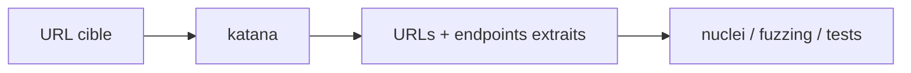

# katana — Crawler web haute vitesse (dont crawl JavaScript)

> [!info] **En 1 phrase**
> katana parcourt les sites web (SPA comprises) et en extrait les URLs, endpoints et routes cachées dans le JavaScript.

---

## Overview

| Champ | Valeur |
|---|---|
| Nom complet | katana (crawler de ProjectDiscovery) |
| Description | Crawler web rapide et personnalisable : exploration des sites (HTML + JavaScript), extraction d'URLs, d'endpoints, de formulaires et de routes, avec support headless et mode passif |
| Catégorie | Reconnaissance & OSINT |
| Sous-catégorie | Crawling / découverte d'endpoints |
| Fonction principale | Découvrir les URLs et endpoints accessibles d'une application web |
| Type d'outil | CLI (pipeline stdin/stdout) |
| Licence | MIT |
| Open source / propriétaire | Open source |
| Langage(s) de programmation | Go |
| Développeur / organisation | ProjectDiscovery |
| Projet officiel | ProjectDiscovery |
| Dépôt officiel | https://github.com/projectdiscovery/katana |
| Documentation officielle | https://docs.projectdiscovery.io/tools/katana/usage |
| Date de création | 2022 (premier commit du dépôt) |
| État du projet | actif |
| Dernière version connue | v1.7.0 (2026-08-05) |
| Systèmes compatibles | Linux, Windows, macOS (binaires précompilés + `go install`) |

> [!note] Pour vérifier / compléter
> katana est le crawler de la suite ProjectDiscovery. Il s'installe aussi via pdtm (ProjectDiscovery Tools Manager). L'option `-headless` nécessite un environnement capable d'exécuter un navigateur (Chromium headless).

---

## Concept

katana est le crawler de projectdiscovery. Il navigue dans les sites, suit les liens, formulaires et redirections, et surtout le JavaScript (`-jc`) pour extraire des URLs et endpoints jamais exposés dans le HTML. En mode headless (`-headless`), il exécute réellement le JS des applications modernes (React, Angular, Vue) et capture les requêtes XHR. Position : phase de découverte d'endpoints, après le probing httpx et avant les tests actifs (nuclei, fuzzing de paramètres). Il peut aussi fonctionner en mode passif (sources Wayback) pour minimiser l'empreinte.



---

## Concepts fondamentaux

| Concept | Explication |
|---|---|
| Crawling | Exploration automatique d'un site en suivant les liens (BFS/DFS) jusqu'à une profondeur donnée |
| SPA (Single Page Application) | Application dont le contenu est rendu par JavaScript : les routes ne sont pas visibles dans le HTML brut |
| JS crawling (`-jc`) | Analyse des fichiers JavaScript pour en extraire des URLs, endpoints et clés d'API |
| Headless (`-headless`) | Exécution réelle du navigateur (Chromium headless) pour exécuter le JS et capturer les requêtes XHR/fetch |
| XHR / fetch | Requêtes réseau émises par le navigateur : sources d'endpoints API souvent cachées |
| Mode passif | Interrogation des sources (ex. Wayback) sans toucher la cible, pour minimiser l'empreinte |
| Scope / profondeur | Limites du crawl : domaines autorisés (`-rf`), profondeur de liens (`-d`) |

---

## Installation

### Debian / Ubuntu / Kali Linux

```bash
# Binaire précompilé depuis les releases GitHub
wget https://github.com/projectdiscovery/katana/releases/download/v1.7.0/katana_1.7.0_linux_amd64.zip
unzip katana_1.7.0_linux_amd64.zip && sudo mv katana /usr/local/bin/
# Ou via go
go install -v github.com/projectdiscovery/katana/cmd/katana@latest
```

### Arch Linux

```bash
# Via binaire précompilé ou go
go install -v github.com/projectdiscovery/katana/cmd/katana@latest
```

### Fedora / RHEL

```bash
go install -v github.com/projectdiscovery/katana/cmd/katana@latest
```

### macOS

```bash
brew install katana
```

### Windows

```powershell
# Binaire précompilé (katana_1.7.0_windows_amd64.zip) depuis les releases GitHub
# ou
go install -v github.com/projectdiscovery/katana/cmd/katana@latest
```

### Docker

```bash
docker pull projectdiscovery/katana
echo https://example.com | docker run --rm -i projectdiscovery/katana -d 2
```

### Compilation depuis les sources

```bash
git clone https://github.com/projectdiscovery/katana.git && cd katana
go build -o katana cmd/katana/main.go
sudo mv katana /usr/local/bin/
```

> [!warning] Prérequis & problèmes potentiels
> - Go 1.21+ pour la compilation.
> - Le mode `-headless` requiert l'exécution d'un navigateur (Chromium headless) : plus gourmand en ressources.
> - Un crawl trop agressif peut saturer la cible ou déclencher le WAF : régler `-rate-limit` et `-concurrency`.

---

## Configuration

Pas de fichier de configuration : tout passe par les options CLI.

| Paramètre | Rôle | Valeur possible | Impact | Exemple |
|---|---|---|---|---|
| `-u <url>` | Cible unique | URL | Crawl d'une seule application | `-u https://example.com` |
| `-list <f>` | Fichier de cibles | chemin | Multi-cibles | `-list targets.txt` |
| `-d <n>` | Profondeur | entier | Étendue du crawl | `-d 3` |
| `-jc` | Crawl JavaScript | booléen | Endpoints cachés dans le JS | `-jc` |
| `-js-crawl` | Alias de `-jc` | booléen | Idem | `-js-crawl` |
| `-headless` | Mode navigateur headless | booléen | SPA et XHR | `-headless` |
| `-xhr` | Capture XHR/fetch | booléen | Endpoints API | `-xhr` |
| `-ef <ext>` | Exclure extensions | liste | Filtrer les assets | `-ef css,jpg,png` |
| `-silent` | Sortie épurée | booléen | Pipeline | `-silent` |
| `-o <f>` | Fichier de sortie | chemin | Persistance | `-o endpoints.txt` |
| `-rate-limit <n>` | Requêtes/seconde | entier | Évite le ban IP | `-rate-limit 100` |
| `-concurrency <n>` | Concurrence | entier | Vitesse | `-concurrency 10` |
| `-rf <domaines>` | Domaine racine (scope) | liste | Restreindre le crawl | `-rf example.com` |
| `-u-probe` | Valider les URLs avant crawl | booléen | Moins de bruit | `-u-probe` |

---

## Architecture interne

- **Parser HTML** : extraction des liens (`<a href>`, `<link>`, `<form action>`…), des scripts (`<script src>`) et des sources d'assets.
- **Analyseur JS** : parsing des fichiers JavaScript (`-jc`) pour en extraire les URLs, chemins d'API, endpoints et routes.
- **Moteur headless** : pilotage d'un navigateur (Chromium) pour exécuter le JS, suivre le rendu des SPA et capturer XHR/fetch (`-headless`, `-xhr`).
- **Gestion du scope** : contrôle des domaines autorisés (`-rf`), profondeur (`-d`), extensions exclues (`-ef`) et déduplication des URLs.
- **Pipeline d'entrée/sortie** : stdin/stdout, fichiers, sortie JSON (`-json`), intégration avec les autres outils projectdiscovery.
- **Sources passives** : mode passif utilisant des sources tierces (ex. Wayback) pour ne pas toucher la cible directement.

---

## Commandes

### Commandes principales

```bash
katana [flags] [-u URL | -list FILE | stdin]
```

| Commande | Objectif | Résultat attendu |
|---|---|---|
| `echo https://example.com \| katana -silent` | Crawl basique | Liste des URLs trouvées |
| `katana -u https://example.com -d 3 -silent` | Crawl en profondeur | URLs jusqu'à profondeur 3 |
| `cat urls.txt \| katana -jc -silent` | Crawl avec extraction JS | Endpoints cachés dans les scripts |
| `katana -u https://example.com -jc -headless -xhr -silent` | SPA en mode navigateur | URLs rendues + requêtes API |
| `katana -u https://example.com -silent -o endpoints.txt` | Sauvegarde des résultats | Fichier d'endpoints |
| `cat targets.txt \| katana -d 2 -ef css,jpg,png,js -silent` | Multi-cibles filtrées | URLs exploitables |

### Commandes avancées

```bash
# Restreindre le scope au domaine cible
katana -u https://example.com -d 2 -rf example.com -silent
# Valider les URLs avant crawl pour réduire le bruit
cat subs.txt | httpx -silent | katana -d 2 -u-probe -silent
# Sortie JSON pour pipeline
katana -u https://example.com -jc -headless -xhr -json -o data.json
# Mode passif (sources Wayback) pour minimiser l'empreinte
echo https://example.com | katana -passive -silent
```

---

## Options et flags

| Option | Description | Exemple | Niveau |
|---|---|---|---|
| `-u <url>` | Cible unique | `-u https://example.com` | Basic |
| `-list <f>` | Fichier de cibles | `-list targets.txt` | Basic |
| `-d <n>` | Profondeur du crawl | `-d 3` | Basic |
| `-jc` | Crawl JavaScript | `-jc` | Intermediate |
| `-js-crawl` | Alias de `-jc` | `-js-crawl` | Intermediate |
| `-headless` | Mode navigateur headless | `-headless` | Advanced |
| `-xhr` | Capture XHR/fetch | `-xhr` | Advanced |
| `-ef <ext>` | Exclure extensions | `-ef css,jpg,png` | Intermediate |
| `-rf <domaines>` | Domaine racine (scope) | `-rf example.com` | Advanced |
| `-u-probe` | Valider les URLs avant crawl | `-u-probe` | Intermediate |
| `-passive` | Mode passif (sources) | `-passive` | Intermediate |
| `-json` | Sortie JSON | `-json` | Advanced |
| `-silent` | Sortie épurée | `-silent` | Basic |
| `-o <f>` | Fichier de sortie | `-o endpoints.txt` | Basic |
| `-rate-limit <n>` | Requêtes/seconde | `-rate-limit 100` | Advanced |
| `-concurrency <n>` | Concurrence | `-concurrency 10` | Intermediate |
| `-timeout <n>` | Timeout des requêtes | `-timeout 15` | Intermediate |
| `-retries <n>` | Tentatives | `-retries 2` | Intermediate |
| `-fn <regex>` | Filtre par motif | `-fn "logout|login"` | Expert |
| `-kn` | Cacher les bannières | `-kn` | Intermediate |
| `-dc` | Désactiver la config de base | `-dc` | Expert |

> [!tip] Options les plus utiles au quotidien
> `-jc` (endpoints JS), `-d` (profondeur), `-silent`, `-o`, et `-headless -xhr` dès qu'il s'agit de SPA. `-ef` pour éliminer le bruit (css, images…).

---

## Exemples pratiques

### Beginner

```bash
# Crawl simple
echo https://example.com | katana -silent
# Avec profondeur
katana -u https://example.com -d 2 -silent -o urls.txt
```

### Intermediate

```bash
# Crawl + extraction JavaScript
cat urls.txt | katana -jc -d 2 -silent
# Filtrer le bruit
katana -u https://example.com -d 3 -ef css,jpg,png,svg,woff -silent
```

### Advanced

```bash
# SPA headless avec capture des requêtes API
katana -u https://app.example.com -jc -headless -xhr -d 2 -silent
# Restriction au scope + validation
cat subs.txt | httpx -silent | katana -d 2 -rf example.com -u-probe -silent
```

### Expert

```bash
# Sortie JSON pour pipeline nuclei
katana -u https://example.com -jc -headless -json -o data.json
# Mode passif minimisé
echo https://example.com | katana -passive -silent
# Filtrage par motif pour isoler l'administration
katana -u https://example.com -d 2 -fn "admin|login|api" -silent
```

---

## Workflow complet (scénario pas à pas)

1. **Lister les cibles web** — partir des hôtes vivants identifiés par httpx.
   ```bash
   subfinder -d example.com -all -silent | httpx -sc -title -td -silent -o live.txt
   ```
2. **Crawler chaque cible** — extraire toutes les URLs accessibles.
   ```bash
   cat live.txt | awk '{print $1}' | katana -d 2 -silent -o urls.txt
   ```
3. **Extraire les endpoints JS** — cibler le JavaScript pour les routes cachées.
   ```bash
   cat urls.txt | httpx -mc 200 -silent | katana -jc -headless -xhr -silent >> endpoints.txt
   ```
4. **Dédupliquer et trier** — préparer la liste propre.
   ```bash
   sort -u endpoints.txt | tee endpoints_clean.txt | wc -l
   ```
5. **Alimenter les tests actifs** — fuzzing de paramètres ou scan nuclei.
   ```bash
   cat endpoints_clean.txt | nuclei -severity high,critical
   ```

---

## Scénarios avancés

### Scénario 1 : SPA headless — découvrir les routes de l'application

```bash
katana -u https://app.example.com -jc -headless -xhr -d 3 -silent -o routes.txt
```

### Scénario 2 : pipeline recon complet vers nuclei

```bash
subfinder -d example.com -all -silent \
  | httpx -sc -title -td -silent \
  | awk '{print $1}' \
  | katana -jc -headless -silent \
  | sort -u \
  | nuclei -severity high,critical
```

### Scénario 3 : mode passif pour minimiser l'empreinte

```bash
echo https://example.com | katana -passive -silent -o passive_urls.txt
```

---

## Cybersecurity use cases

| Phase | Utilisation |
|---|---|
| Reconnaissance | Découverte des URLs et endpoints d'un périmètre web |
| Énumération | Extraction de routes et d'endpoints API cachés dans le JavaScript |
| Énumération | Capture des requêtes XHR d'une SPA (endpoints internes) |
| Vulnérabilité | Alimenter nuclei, ffuf et le fuzzing de paramètres |
| Reconnaissance passive | Mode passif (sources Wayback) sans toucher la cible |

---

## MITRE ATT&CK

| Tactique | Technique / Sub-technique | ID | Raison | Détection | Mitigation |
|---|---|---|---|---|---|
| Discovery | Application Window Discovery | T1010 | Extraction des URLs et endpoints de l'application | Logs d'accès : profil de crawl systématique | Rate limiting, anti-bot |
| Collection | Automated Collection | T1119 | Collecte automatisée des endpoints | Volume de requêtes et patterns de crawl | WAF, challenge JS |
| Discovery | System Information Discovery | T1082 | Exploration systématique des chemins applicatifs | Trafic de crawling anormal | Segmentation, logs |

> [!note] Ne renseigner que si l'association est réellement pertinente.
> Le crawling relève avant tout de la phase Reconnaissance/Discovery : associer principalement T1010 (découverte de fenêtres applicatives).

---

## Defensive Security

### Signes observables

| Indicateur | Détail |
|---|---|
| Exploration systématique et arborescente des liens | Profil de crawler (BFS/DFS) dans les logs |
| Requêtes vers les fichiers JavaScript + parsing | Signature d'un crawl `-jc` |
| Exécution d'un navigateur headless sur la cible | Trafic Chromium, requêtes XHR/fetch anormales |
| Extraction de nombreuses URLs en peu de temps | Pics de crawling détectables |

### Règles de détection (Sigma / Suricata / Snort / YARA)

```yaml
# Sigma — Exécution de katana sur un endpoint Linux
# Adaptation pédagogique ; le nom du binaire peut être renommé
title: Linux Web Crawler Execution
id: 8a2f4d6b-3c7e-4a1b-9d0e-5b6c7d8e9f01
status: test
logsource:
    category: process_creation
    product: linux
detection:
    selection:
        Image|endswith:
            - '/katana'
        CommandLine|contains:
            - '-jc'
            - '-headless'
            - '-list'
    condition: selection
falsepositives:
    - Legitimate projectdiscovery usage
level: medium
```

```bash
# Suricata — crawl agressif : multi-requêtes GET rapides d'une même source
# (adaptation pédagogique ; ajuster seuil et fenêtre)
alert http any any -> any any (msg:"ET SCAN Aggressive Web Crawl"; \
  flow:to_server; content:"GET "; http_method; \
  threshold:type both, track by_src, count 200, seconds 120; sid:2026007; rev:1;)
```

```yaml
# YARA — détection du binaire katana
rule Katana_Binary_Detection {
    meta:
        description = "Detection of katana binary strings"
        author = "SOC"
    strings:
        $a = "katana"
        $b = "projectdiscovery"
        $c = "headless"
    condition:
        any of them
}
```

> [!note] À vérifier
> Exemples pédagogiques : adapter les seuils, les sources de logs (WAF, proxy, EDR) et les indicateurs à votre environnement.

---

## Automatisation

```bash
# Bash — crawl périodique d'une liste d'applications
for app in app.example.com admin.example.com api.example.com; do
    echo "https://$app" | katana -jc -headless -silent -o "crawl_$app.txt"
done
sort -u crawl_*.txt > endpoints_all.txt
```

```python
# Python — katana en sous-processus, parsing JSON
import subprocess, json

def crawl(url, extra=None):
    cmd = ["katana", "-u", url, "-silent", "-json"]
    if extra:
        cmd += extra
    out = subprocess.run(cmd, capture_output=True).stdout
    return [json.loads(l) for l in out.splitlines() if l.strip()]

for ep in crawl("https://example.com", ["-jc", "-headless", "-xhr", "-d", "2"]):
    print(ep.get("url"), "->", ep.get("tag"))
```

```yaml
# cron — crawl hebdomadaire des applications web
0 7 * * 1  cat /opt/recon/apps.txt | katana -jc -headless -silent -o /opt/recon/endpoints.txt
```

---

## Output et parsing

Sorties : texte (une URL par ligne) ou JSON (`-json`).

```bash
# Une URL par ligne (classique)
cat targets.txt | katana -silent -o urls.txt
# JSON → jq : extraire URL et tag
katana -u https://example.com -jc -json -silent | jq -r '.url + " " + (.tag|tostring)'
# Filtrer les endpoints API
katana -u https://example.com -jc -silent | grep -E "/api/|/v[0-9]+/"
```

```python
# Python — parsing JSON
import json
with open("data.json") as f:
    for line in f:
        if not line.strip():
            continue
        ep = json.loads(line)
        print(ep.get("url"), ep.get("tag"))
```

---

## Intégrations

- [[Tools| Outils]] global
- [[Outil - httpx|httpx]] — source amont : hôtes web vivants à crawler
- [[Outil - nuclei|nuclei]] — scan de vulnérabilités sur les endpoints extraits
- [[Outil - ffuf|ffuf]] — fuzzing de chemins et de paramètres après crawl
- [[Outil - gau|gau]] / [[Outil - waybackurls|waybackurls]] — URLs historiques complémentaires
- [[Outil - Amass|Amass]] / [[Outil - subfinder|subfinder]] — source des sous-domaines
- [[Outil - httpx|httpx]] — validation des URLs avant crawl (`-u-probe`)
- [[01 - Reconnaissance| Reconnaissance]]

```text
subfinder → dnsx → httpx → katana → nuclei / ffuf
                            ↗ (endpoints)
```

---

## Alternatives

| Outil | Avantages | Inconvénients | Cas d'usage |
|---|---|---|---|
| `gospider` (jaeles) | Rapide, pipeline friendly | Moins de fonctionnalités headless | Crawling simple rapide |
| `hakrawler` (hakluke) | Simple, très rapide | Peu d'options | Découverte d'URLs rapide |
| `Burp Suite Spider` | Intégration, historique | GUI, lourd | Analyse manuelle approfondie |
| `feroxbuster` / `ffuf` | Fuzzing de chemins | Ne crawle pas les liens | Découverte de répertoires |
| `curl` + parsing maison | Universel | Fastidieux | Extraction ponctuelle |
| `wget --spider --recursive` | Présent partout | Brut, bruit | Crawl basique sans dépendance |

> **Quand utiliser gospider plutôt que katana ?** Pour un crawling léger et rapide sans besoin de JavaScript ni de headless. katana prend le relais dès qu'on cible des SPA ou qu'on veut l'extraction JS et XHR.

---

## Performance

- Moteur Go à haut débit : crawl concurrent (`-concurrency`) avec connexions persistantes.
- Le mode `-headless` est nettement plus lent et gourmand (navigateur réel) : à réserver aux SPA.
- `-ef`, `-fn`, `-rf` et `-u-probe` réduisent le volume traité et le bruit.
- Pas de benchmark officiel : le débit dépend du réseau, de la cible et du mode utilisé.

> [!note] À vérifier
> Les performances varient selon le nombre de cibles, la profondeur et l'usage du headless. Adapter `-concurrency` et `-rate-limit` au contexte.

---

## Troubleshooting

### Common problems

#### Problème : beaucoup de bruit (images, CSS, JS tiers)

- **Cause** : aucun filtre d'extension.
- **Solution** : ajouter `-ef css,jpg,png,svg,woff,ttf`.
- **Vérification** : relancer et inspecter les premiers résultats.

#### Problème : les endpoints d'une SPA ne sont pas trouvés

- **Cause** : contenu rendu par JavaScript, non visible dans le HTML.
- **Solution** : utiliser `-jc -headless -xhr`.
- **Vérification** : `katana -u https://app.example.com -jc -headless -xhr -silent`.

#### Problème : le crawl sort du périmètre (sous-domaines tiers)

- **Cause** : scope par défaut trop large.
- **Solution** : restreindre avec `-rf example.com` (ou `-rlf` fichier de domaines racines).
- **Vérification** : inspecter les domaines dans les résultats.

#### Problème : l'IP source est bloquée (WAF)

- **Cause** : volume de crawl trop élevé.
- **Solution** : réduire `-concurrency`, ajouter `-rate-limit`, allonger les timeouts.
- **Vérification** : relancer avec `-rate-limit 50 -concurrency 5`.

---

## Sécurité de l'outil

- **Volumétrie** : un crawl agressif est détectable (logs WAF, charge serveur) — à doser selon l'engagement.
- **Headless** : l'exécution d'un navigateur augmente la charge côté cible comme côté attaquant.
- **Mode passif** : réduit fortement l'empreinte, mais dépend des sources disponibles.
- **Données collectées** : uniquement des URLs publiques — aucun accès privilégié.
- **Usage légal** : uniquement sur des cibles autorisées ; le crawling actif est visible par la cible.

---

## Limitations

- Le crawl actif est bruyant et détectable.
- Le headless est lent et gourmand en ressources.
- Les SPA très protégées (login, JS obfusqué, CAPTCHA) peuvent résister au crawl.
- La couverture dépend des sources en mode passif : incomplète par rapport au crawl actif.
- Pas de scan de vulnérabilités : katana découvre des endpoints, il ne les teste pas.

---

## Cheatsheet

```bash
# Crawl simple
echo https://example.com | katana -silent

# Profondeur et filtre
katana -u https://example.com -d 3 -ef css,jpg,png -silent

# Extraction JavaScript
cat urls.txt | katana -jc -d 2 -silent

# SPA headless + XHR
katana -u https://app.example.com -jc -headless -xhr -silent

# Scope restreint
katana -u https://example.com -d 2 -rf example.com -silent

# Mode passif
echo https://example.com | katana -passive -silent

# Sortie JSON
katana -u https://example.com -jc -json -silent -o data.json
```

---

## Quick reference

| | |
|---|---|
| **À quoi sert-il ?** | Crawler web pour extraire URLs et endpoints (dont JavaScript et SPA) |
| **Quand l'utiliser ?** | Après httpx, avant nuclei ou le fuzzing de paramètres |
| **Commande principale** | `cat targets.txt \| katana -jc -silent` |
| **Alternative principale** | gospider / hakrawler (léger), Burp Spider (manuel) |
| **Concepts importants** | Crawling, SPA, extraction JS, headless, XHR, scope, mode passif |
| **Liens associés** | [[Outil - httpx]] · [[Outil - nuclei]] · [[Outil - ffuf]] · [[Outil - gau]] |

---

## Détection & Défense

| Signe | Défense |
|---|---|
| Exploration arborescente et systématique des liens | Anti-bot, rate limiting, CAPTCHA sur les gros pics |
| Requêtes vers les fichiers JS puis vers les chemins découverts | Détection du pattern crawl-JS dans les logs |
| Trafic navigateur headless (Chromium) | Corrélation des UA Chromium + volume |
| Extraction massive d'URLs | WAF et règles de détection de crawling |

---

## Tips & Pièges

> [!tip] **Tips**
> - Toujours restreindre le scope (`-rf`) en bug bounty pour rester dans le périmètre autorisé.
> - Utilise `-ef` (css, images, polices) pour éliminer le bruit avant de trier.
> - Sur une SPA, la triade `-jc -headless -xhr` est indispensable pour découvrir les endpoints API.
> - Couple katana avec nuclei dans un pipeline pour passer de la découverte au test.

> [!warning] **Pièges**
> - Le headless ralentit considérablement le crawl : réserve-le aux applications qui en ont besoin.
> - Un crawl agressif peut bloquer ton IP chez la cible : dose `-concurrency` et `-rate-limit`.
> - Sans `-rf`, le crawl peut sortir du périmètre et découvrir des sous-domaines hors scope.
> - Le mode passif n'offre pas la même couverture que le crawl actif : il ne voit que ce que les sources ont archivé.

---

## References

### Official

- GitHub officiel katana : https://github.com/projectdiscovery/katana
- Documentation projectdiscovery katana : https://docs.projectdiscovery.io/tools/katana/usage
- Releases officielles : https://github.com/projectdiscovery/katana/releases

### Security references

- MITRE ATT&CK T1010 — Application Window Discovery : https://attack.mitre.org/techniques/T1010/
- MITRE ATT&CK T1119 — Automated Collection : https://attack.mitre.org/techniques/T1119/
- SigmaHQ — process_creation rules : https://github.com/SigmaHQ/sigma

### Community

- Blog ProjectDiscovery — crawling et recon : https://blog.projectdiscovery.io
- HackTricks — Pentesting Web : https://book.hacktricks.xyz/network-services-pentesting/pentesting-web

---

**Liens :** [[Tools| Outils]] · [[Outil - httpx|httpx]] · [[Outil - nuclei|nuclei]] · [[01 - Reconnaissance| Reconnaissance]]
