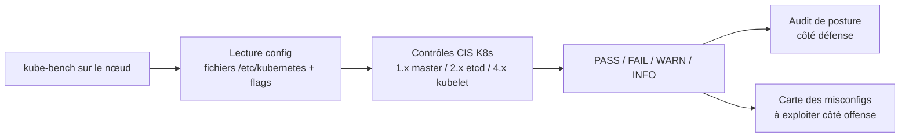
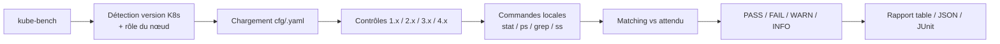

# 🎯 kube-bench - L'auditeur CIS Kubernetes

> [!info] **En 1 phrase**
> kube-bench audite un cluster Kubernetes contre le CIS Kubernetes Benchmark : côté défensif il valide la posture, côté offensif il te liste les misconfigurations exactes à exploiter.

---

## 🧾 Overview

| Champ | Valeur |
|---|---|
| Nom complet | kube-bench |
| Description | Auditeur automatisé qui compare la configuration d'un cluster Kubernetes (master, etcd, kubelet) aux recommandations du CIS Kubernetes Benchmark |
| Catégorie | 🔒 Cloud & Containers |
| Sous-catégorie | Kubernetes / Audit de posture / Benchmark CIS |
| Type d'outil | CLI (binaire unique ou conteneur) |
| Licence | Apache-2.0 |
| Open source / propriétaire | Open source |
| Langage(s) de programmation | Go |
| Développeur / organisation | Aqua Security |
| Projet officiel | https://github.com/aquasecurity/kube-bench |
| Dépôt officiel | https://github.com/aquasecurity/kube-bench |
| Documentation officielle | https://github.com/aquasecurity/kube-bench/blob/main/README.md |
| Date de création | 2017 |
| État du projet | actif |
| Dernière version connue | v0.16.0 |
| Systèmes compatibles | Linux (binaire ou conteneur), conçu pour tourner sur les nœuds du cluster |

> [!note] Pour vérifier / compléter
> Version vérifiée sur https://github.com/aquasecurity/kube-bench/releases (v0.16.0). kube-bench évolue en parallèle des benchmarks CIS ; vérifier la version de benchmark supportée (`kube-bench version`).

---

## 🎯 Concept

kube-bench exécute les contrôles du **CIS Kubernetes Benchmark** (publié par le Center for Internet Security) directement sur la configuration réelle du cluster : fichiers YAML du kube-apiserver, flags des services systemd, permissions des fichiers de certs, options du kubelet. Chaque contrôle compare la valeur observée à la valeur recommandée et répond **PASS / FAIL / WARN / INFO**.

En pentest, c'est un outil de **reconnaissance orientée posture** : un contrôle en FAIL est souvent une porte d'entrée. Par exemple :
- `1.2.1 - anonymous-auth disabled` → si FAIL, tu peux interroger l'API server sans token.
- `4.2.1 - kubelet anonymous-auth` → si FAIL, le port kubelet (10250) accepte des requêtes anonymes.
- `2.1 - etcd peer/client certs` → si FAIL, etcd est peut-être joignable et lisible.
- Flags `--insecure-port`, `--profiling`, `--authorization-mode=AlwaysAllow` sont autant d'ouvertures pour un attaquant.

L'outil lit les fichiers en local (il tourne sur le nœud) : il révèle la **configuration telle qu'elle existe**, pas ce qu'un scanner réseau devinerait. C'est cette fiabilité qui en fait un accélérateur d'escalade une fois un accès shell obtenu sur un nœud.



---

## 🧠 Concepts fondamentaux

| Concept | Explication |
|---|---|
| CIS Benchmark | Guide de bonnes pratiques de durcissement publié par le Center for Internet Security, décliné par produit (Kubernetes, Docker, etc.) |
| Contrôle (check) | Une vérification unitaire (ex : `1.2.6 - Anonymous requests to kube-apiserver should be disabled`) avec un identifiant stable |
| Cible (target) | Groupe de contrôles : `master`, `controlplane`, `node`, `etcd`, `managedservices` ; par défaut tous sont exécutés |
| Fichier de config | Le mapping contrôle → commandes/règles vit dans `cfg/` (YAML par version de benchmark) ; éditable pour des environnements custom |
| Verdict | `PASS` (conforme), `FAIL` (non conforme = risque), `WARN` (non vérifiable automatiquement), `INFO` (info sur le contrôle) |
| Posture d'un nœud | Toutes les vérifications sont locales au nœud où kube-bench tourne : un audit doit couvrir master ET workers |
| Version de benchmark | `cis-1.7`, `cis-1.8`, ... en fonction de la version de Kubernetes du cluster |
| Aide du contrôle | Le champ `remediation` du YAML de config décrit comment corriger un FAIL |

---

## 🛠️ Installation

kube-bench se déploie en binaire, en conteneur ou via le job Kubernetes officiel (`job.yaml`) qui le lance sur chaque nœud.

### Binaire

```bash
# Télécharger la dernière release
curl -L https://github.com/aquasecurity/kube-bench/releases/download/v0.16.0/kube-bench_0.16.0_linux_amd64.tar.gz -o kube-bench.tar.gz
tar -xzf kube-bench.tar.gz
./kube-bench version
```

### Conteneur (recommandé : tourne sur le nœud avec accès aux fichiers)

```bash
docker run --rm -v /etc:/etc:ro -v /var:/var:ro -it aquasec/kube-bench:latest run
```

### Job Kubernetes (audit automatisé de tous les nœuds)

```bash
kubectl apply -f https://raw.githubusercontent.com/aquasecurity/kube-bench/main/job.yaml
kubectl get jobs -n kube-bench
kubectl logs job/kube-bench -n kube-bench --tail=5
```

> [!warning] ⚠️ Prérequis & problèmes potentiels
> - kube-bench doit tourner **sur le nœud** (ou avec ses dossiers montés) pour lire `/etc/kubernetes`, `/var/lib/kubelet` et les manifestes systemd.
> - Sur un cluster managé (EKS, GKE), certains contrôles ne s'appliquent pas : utiliser `--targets=node` ou les profils `managedservices`.
> - En pentest, un accès non-root au nœud bloque la lecture de certains fichiers de certs (contrôles en WARN).

---

## ⚙️ Configuration

kube-bench se configure par flags en ligne de commande ; la logique des contrôles est pilotée par les fichiers YAML de `cfg/`.

| Paramètre | Rôle | Valeur possible | Impact | Exemple |
|---|---|---|---|---|
| `--targets` | Cibles de contrôles | `master`, `controlplane`, `node`, `etcd`, `managedservices` | Restreint l'audit | `--targets=master` |
| `--benchmark` | Version du benchmark CIS | `cis-1.8`, `cis-1.7`, `gke-1.0`, `eks-1.0` | Choix des contrôles | `--benchmark=cis-1.8` |
| `--config-dir` | Dossier des configs YAML | chemin | Configs custom | `--config-dir=/opt/kube-bench/cfg` |
| `--json` | Sortie JSON | drapeau | Parsing automatisé | `--json` |
| `--outputfile` | Fichier de sortie | chemin | Archivage du rapport | `--outputfile=audit.json` |
| `--skip` | Contrôles à ignorer | liste d'IDs | Évite les faux négatifs | `--skip=4.1.2,4.2.3` |
| `--include` | Contrôles à inclure | liste d'IDs | Audit ciblé | `--include=4.2.1` |
| `--noremediations` | Cache les recommandations | drapeau | Rapport court | `--noremediations` |
| `--insecure-skip-tls-verify` | Ignore les erreurs TLS | drapeau | Environnements avec proxys | `--insecure-skip-tls-verify` |

---

## 🏗️ Architecture interne

kube-bench est un binaire Go qui suit un pipeline de vérification :

- **Découverte de l'environnement** : il détecte la version de Kubernetes et le rôle du nœud (master/worker) pour choisir le bon jeu de contrôles.
- **Chargement des contrôles** : les fichiers YAML de `cfg/` définissent pour chaque ID CIS les commandes à lancer (lecture de fichier, `ps`, `stat`, `ss`) et les règles de matching.
- **Exécution** : chaque contrôle lance une ou plusieurs commandes shell locales et compare le résultat à l'attendu (regex, présence/absence, permissions).
- **Verdict** : PASS/FAIL/WARN/INFO selon le matching ; les erreurs d'exécution ou fichiers absents produisent souvent un WARN.
- **Rapport** : sortie table console, JSON ou JUnit ; la sortie JSON structure chaque contrôle avec `id`, `text`, `audit`, `remediation`, `status`.



---

## ⌨️ Commandes

### Commandes principales

| Commande | Objectif | Résultat attendu |
|---|---|---|
| `kube-bench run` | Audit complet du nœud | Table PASS/FAIL/WARN/INFO |
| `kube-bench run --targets=master` | Contrôles contrôle plan | Section 1.x, 2.x, 3.x |
| `kube-bench run --targets=node` | Contrôles workers/kubelet | Section 4.x |
| `kube-bench run --targets=etcd` | Contrôles etcd | Section 2.x |
| `kube-bench run --json` | Sortie JSON | Rapport parsable |
| `kube-bench version` | Version + benchmark supporté | Version et carte des benchmarks |

### Commandes avancées

```bash
# Audit ciblé sur les contrôles kubelet anonymes (intéressant pour l'offense)
kube-bench run --targets=node --include=4.2.1,4.2.2 --json

# Export JSON complet pour analyse
kube-bench run --json --outputfile=/tmp/kube-bench-report.json

# Auditer avec un jeu de contrôles custom
kube-bench run --config-dir=/opt/kube-bench/cfg --benchmark=cis-1.8
```

---

## 🎚️ Options et flags

| Option | Description | Exemple | Niveau |
|---|---|---|---|
| `--targets` | Cibles de l'audit | `--targets=node,etcd` | Basic |
| `--benchmark` | Version du benchmark | `--benchmark=cis-1.8` | Basic |
| `--json` | Sortie JSON | `run --json` | Basic |
| `--outputfile` | Écrire le rapport dans un fichier | `--outputfile=report.json` | Intermediate |
| `--skip` | Exclure des contrôles | `--skip=4.1.2` | Intermediate |
| `--include` | N'inclure que certains contrôles | `--include=1.2.1` | Advanced |
| `--config-dir` | Dossier de configs custom | `--config-dir=./cfg` | Expert |
| `--noremediations` | Pas de recommandations dans la sortie | `--noremediations` | Intermediate |
| `--checklist` | Génère un checklist versionné | `run --checklist` | Expert |

> [!tip] Options les plus utiles au quotidien
> `--targets` (cibler ce qui t'intéresse), `--json` (parsing), `--include` (isoler un contrôle précis), `--skip` (éviter les contrôles inapplicables).

---

## 🧪 Exemples pratiques

### Beginner

```bash
# Audit complet du nœud courant
kube-bench run

# Version et benchmarks supportés
kube-bench version
```

Résultat attendu : une table avec les sections `[1] Control Plane Security Configuration`, `[2] Etcd Node Configuration`, `[4] Worker Node Security Configuration` et les verdicts.

### Intermediate

```bash
# Extraire uniquement les FAIL en JSON
kube-bench run --json | jq -r '.Controls[] | .Groups[] | .Checks[] | select(.status=="FAIL") | "\(.id) \(.text)"'

# Audit ciblé du kubelet uniquement
kube-bench run --targets=node
```

### Advanced

```bash
# Jeu de contrôles limité aux auth anonymes (candidats d'exploitation)
kube-bench run --include=1.2.1,1.2.6,4.2.1 --json

# Exporter le rapport pour archivage
kube-bench run --json --outputfile=audit-$(hostname).json
```

### Expert

```bash
# Audit via conteneur avec montage des dossiers sensibles
docker run --rm -v /etc:/etc:ro -v /var:/var:ro -it aquasec/kube-bench:latest run --targets=master

# Comparer deux audits pour mesurer l'impact d'une correction
diff <(jq -r '.Controls[].Groups[].Checks[] | select(.status=="FAIL") | .id' audit-avant.json) \
     <(jq -r '.Controls[].Groups[].Checks[] | select(.status=="FAIL") | .id' audit-apres.json)
```

---

## 🧪 Workflow complet (scénario pas à pas)

1. **Lancer l'audit** - depuis un accès au nœud (shell, pod privilégié ou conteneur docker).
   ```bash
   kube-bench run --json --outputfile=/tmp/audit.json
   ```
2. **Isoler les FAIL exploitables** - filtrer les contrôles qui ouvrent des portes.
   ```bash
   jq -r '.Controls[].Groups[].Checks[] | select(.status=="FAIL") | "\(.id) \(.text) \(.audit)"' /tmp/audit.json
   ```
3. **Tester chaque ouverture** - anonymous auth, kubelet 10250, etcd exposé.
   ```bash
   curl -sk https://10.10.20.15:6443/version
   curl -sk https://10.10.20.15:10250/pods
   ```
4. **Exploiter la posture faible** - prendre un token, créer un pod privilégié.
   ```bash
   kubectl --token=$TOKEN --insecure-skip-tls-verify=true get secrets -A
   ```
5. **Boucler** - les contrôles PASS/FAIL définissent le prochain chemin d'attaque.

---

## 🎬 Scénarios avancés

### Scénario 1 : De l'audit au cluster-admin via un FAIL kubelet

```bash
# 1. Identifier les contrôles anonymes en FAIL
kube-bench run --targets=node --include=4.2.1,4.2.2 --json | \
  jq -r '.Controls[].Groups[].Checks[] | select(.status=="FAIL") | .id'

# 2. Si 4.2.1 FAIL : le kubelet accepte des requêtes anonymes sur 10250
curl -sk https://10.10.20.15:10250/pods -H "Authorization: Bearer whatever" | head

# 3. Lire un token de service account depuis un pod du cluster
kubectl --kubeconfig ./admin.conf get pods -A -o json | \
  jq -r '.items[].metadata.name' | head -1
```

Un kubelet en anonymous-auth permet d'énumérer les pods et parfois d'écrire : une chaîne d'attaque classique en lab Kubernetes.

### Scénario 2 : Verrouillage de posture (côté défense)

```bash
# Identifier tous les FAIL avant mise en production
kube-bench run --json | jq -r '.Controls[].Groups[].Checks[] | select(.status=="FAIL") | .id'

# Appliquer les recommandations du rapport
kube-bench run --noremediations=false

# Re-auditer pour confirmer la régression des FAIL
kube-bench run --targets=master,node
```

---

## 🛡️ Cybersecurity use cases

| Phase | Utilisation |
|---|---|
| Reconnaissance | Identifier les flags `--insecure-port`, `anonymous-auth`, `profiling` actifs |
| Énumération | Cartographier la posture du contrôle plan et du kubelet |
| Vulnérabilité | Associer les FAIL à des techniques d'exploitation (T1552, T1613) |
| Exploitation | Confirmer les canaux accessibles : API 6443 sans auth, kubelet 10250, etcd 2379 |
| Post-exploitation | Cibler la persistance via les fichiers de certs lus pendant l'audit |
| Exfiltration | Localiser les fichiers sensibles (`admin.conf`, `serviceaccount` tokens) |

---

## 🎯 MITRE ATT&CK

| Tactique | Technique / Sub-technique | ID | Raison | Détection | Mitigation |
|---|---|---|---|---|---|
| Discovery | Container and Resource Discovery | T1613 | L'audit révèle la topologie et les ressources sensibles du cluster | Audit logs API server | RBAC minimal, audit logging |
| Discovery | System Information Discovery | T1082 | Lecture des flags systemd et fichiers de config du nœud | EDR sur les commandes de lecture | Durcissement, moindre privilège |
| Credential Access | Unsecured Credentials : Files | T1552.001 | L'audit localise kubeconfigs et fichiers de certs | Falco lecture fichiers sensibles | Permissions 600, secrets externes |
| Discovery | Permission Groups Discovery : Cloud Groups | T1069.003 | Les FAIL RBAC indiquent les permissions permissives | Audit des changements RBAC | RBAC granulaire |
| Initial Access | Exploit Public-Facing Application | T1190 | Les FAIL anonymous-auth exposent des endpoints sans auth | IDS/NIDS sur 6443/10250 | NetworkPolicy, admission |

> [!note] Ne renseigner que si l'association est réellement pertinente.
> kube-bench n'attaque pas : il met en évidence des misconfigurations qui, elles, correspondent à des techniques offensives documentées.

---

## 🛡️ Defensive Security

### Signes observables

| Indicateur | Détail |
|---|---|
| Exécution de `kube-bench` sur un nœud | Processus Go inattendu, conteneur `aquasec/kube-bench` |
| Montage de `/etc` / `/var` en lecture depuis un conteneur | Volume hostPath anormal |
| Lecture groupée des fichiers `/etc/kubernetes/*.conf` | Énumération des kubeconfigs |
| Requêtes POST vers l'API server pour créer des pods de debug | Escalade post-audit |
| Connexions sortantes vers les ports 10250/2379/6443 | Scan de canaux de contrôle |

### Règles de détection (Sigma / Suricata / Snort / YARA)

```yaml
# Sigma - Kubernetes : lancement de kube-bench sur un nœud (audit anormal)
title: K8s kube-bench Execution on Node
id: 0b0b2f90-0000-4a9a-8c5f-000000000061
status: experimental
logsource:
    product: linux
    service: auditd
detection:
    selection:
        process.name: 'kube-bench'
    condition: selection
falsepositives:
    - Audits de posture planifiés par l'équipe plateforme
level: medium
```

> [!note] À vérifier
> Exemple pédagogique : l'identifiant Sigma est fictif et à régénérer si publié ; adapter à la structure réelle de vos logs.

---

## 🤖 Automatisation

```bash
# Bash - audit de tous les nœuds via le job Kubernetes officiel
kubectl apply -f https://raw.githubusercontent.com/aquasecurity/kube-bench/main/job.yaml
sleep 120
kubectl logs -l job-name=kube-bench -n kube-bench | grep -c FAIL

# Bash - CI : échouer si plus de N contrôles FAIL
COUNT=$(kube-bench run --json | jq '[.Controls[].Groups[].Checks[] | select(.status=="FAIL")] | length')
if [ "$COUNT" -gt 5 ]; then echo "TOO_MANY_FAIL"; exit 1; fi
```

```python
# Python - extraire les FAIL d'un rapport JSON
import json

with open("audit.json", encoding="utf-8") as f:
    data = json.load(f)

fails = [
    (c["id"], c["text"], c.get("remediation", ""))
    for grp in data["Controls"]
    for group in grp["Groups"]
    for c in group["Checks"]
    if c["status"] == "FAIL"
]
for cid, text, remed in fails:
    print(f"{cid}: {text}\n    -> {remed}")
```

---

## 📤 Output et parsing

kube-bench produit une table console ou du JSON. Le JSON est structuré par `Controls` → `Groups` → `Checks`, chaque contrôle ayant `id`, `text`, `audit`, `status`, `remediation`.

```bash
# Compter les FAIL / WARN / PASS
kube-bench run --json | jq -r '.Controls[].Groups[].Checks[].status' | sort | uniq -c

# Lister les contrôles FAIL avec leur audit command
kube-bench run --json | \
  jq -r '.Controls[].Groups[].Checks[] | select(.status=="FAIL") | "\(.id) [\(.audit)]"'
```

---

## 🔗 Intégrations

- [[Tools|🛠 Outils]] global
- [[Outil - kubectl|kubectl]] - exploitation des faiblesses identifiées par l'audit
- [[Outil - kube-hunter|kube-hunter]] - scan externe des vulnérabilités K8s (complément réseau)
- [[Outil - peirates|peirates]] - post-exploitation quand une faille est confirmée
- [[Outil - trivy|trivy]] - audit des images et des vulnérabilités CVE (complément images)
- [[Outil - cloudfox|cloudfox]] - posture EKS côté AWS (contrôles managés)
- Aqua Security / Kubernetes plugin de CI - intégration native dans les pipelines

```text
kube-bench (posture locale) + kube-hunter (scan réseau) -> kubectl/peirates (exploitation)
```

---

## 🔄 Alternatives

| Outil | Avantages | Inconvénients | Cas d'usage |
|---|---|---|---|
| kube-hunter | Scan réseau actif, détecte les services exposés | Pas de benchmark CIS | Reconnaissance externe |
| kubeaudit | Focus conteneurs/pods (droits, capabilities) | Pas de benchmark nœud | Audit des pods |
| KubeSec | Analyse des manifests YAML en CI | Pas d'exécution sur nœud | Revues de code K8s |
| Popeye | Scan de bonnes pratiques et cohérence du cluster | Moins exhaustif que CIS | Hygiène quotidienne |
| kubectl | Énumération directe des ressources | Ne compare pas à un benchmark | Exploitation |

---

## ⚡ Performance

- **Rapide** : kube-bench lance quelques dizaines de commandes locales ; un audit complet dure de quelques secondes à ~1 minute.
- **Sans charge réseau** : tout est local au nœud ; l'outil est discret côté réseau mais visible en processus/logs.
- **Coût offensif faible** : l'audit ne modifie rien ; aucun artefact à part les fichiers de rapport éventuels.
- **Limite pratique** : sur les gros clusters, répéter l'audit sur chaque nœud est fastidieux → utiliser le job Kubernetes.

---

## 🛠️ Troubleshooting

### Common problems

#### Problème : « config file cfg/cis-1.8/config.yaml not found »

- **Cause** : version de benchmark incompatible avec le binaire, ou `--config-dir` incorrect.
- **Solution** : vérifier `kube-bench version` pour la carte des benchmarks ; télécharger une release récente.
- **Vérification** : `kube-bench version` liste les benchmarks supportés.

#### Problème : beaucoup de WARN au lieu de PASS/FAIL

- **Cause** : fichiers de config absents ou non lisibles (permissions, cluster managé) ; kube-bench ne peut pas vérifier.
- **Solution** : vérifier les droits de lecture sur `/etc/kubernetes` ; utiliser `--targets=node` sur un cluster managé.
- **Vérification** : `ls -la /etc/kubernetes/` confirme la présence des fichiers.

#### Problème : contrôle retourne FAIL alors que la config semble correcte

- **Cause** : le binaire audite un autre nœud/path que prévu (conteneur sans montage), ou version du benchmark obsolète.
- **Solution** : relire la commande d'audit du contrôle (`--json` → champ `audit`) et la lancer à la main.
- **Vérification** : la commande manuelle donne un résultat différent du contrôle automatisé.

---

## 🔐 Sécurité de l'outil

- **Cadre légal** : kube-bench est un outil d'audit passif (lecture seule) ; en pentest, son usage est sans risque de casse mais reste à faire dans le périmètre autorisé.
- **Accès requis** : tourner sur le nœud nécessite un accès avec lecture des fichiers système → privilège à ne pas négliger.
- **Données sensibles** : le rapport contient les chemins et flags de config ; l'archiver et le protéger.
- **Exécution en conteneur** : monter `/etc` et `/var` en lecture seule (`:ro`) limite l'impact.
- **Version officielle uniquement** : télécharger depuis le repo GitHub/Aqua Security pour éviter les binaires piégés.

---

## ⚠️ Limitations

- **Lecture seule** : kube-bench ne corrige rien et n'exploite rien ; c'est un scanner de posture.
- **Local au nœud** : il faut un accès au nœud (ou au conteneur avec montages) ; pas de scan à distance.
- **Benchmark versionné** : un contrôle sans équivalent dans la version CIS du cluster ne sera pas évalué.
- **Clusters managés** : une partie des contrôles master n'est pas applicable (EKS/GKE) ; utiliser les profils adaptés.
- **Faux WARN** : certaines vérifications reposent sur des fichiers systemd absents sur certains nœuds.

---

## 📋 Cheatsheet

```bash
# Audit complet du nœud
kube-bench run

# Audit des workers (kubelet) uniquement
kube-bench run --targets=node

# Sortie JSON + comptage des FAIL
kube-bench run --json | jq -r '.Controls[].Groups[].Checks[].status' | sort | uniq -c

# Isoler un contrôle précis
kube-bench run --include=4.2.1 --json

# Audit en conteneur
docker run --rm -v /etc:/etc:ro -v /var:/var:ro -it aquasec/kube-bench:latest run

# Audit automatisé de tous les nœuds
kubectl apply -f https://raw.githubusercontent.com/aquasecurity/kube-bench/main/job.yaml

# Version + benchmarks supportés
kube-bench version
```

---

## ⚡ Quick reference

| | |
|---|---|
| **À quoi sert-il ?** | Auditer la configuration d'un cluster Kubernetes contre le CIS Benchmark |
| **Quand l'utiliser ?** | Posture check côté défense ; carte des misconfigs exploitables côté offense |
| **Commande principale** | `kube-bench run --json` |
| **Alternative principale** | kube-hunter (scan réseau), kubeaudit (pods) |
| **Concepts importants** | CIS Benchmark, contrôle, cible, verdict PASS/FAIL/WARN/INFO |
| **Liens associés** | [[Outil - kube-hunter]] · [[Outil - peirates]] · [[Outil - trivy]] |

---

## 🔍 Détection & Défense

| Signe | Défense |
|---|---|
| Processus `kube-bench` sur un nœud | Audit des exécutions, approval des tâches de posture |
| Conteneur `aquasec/kube-bench` tiré | Autoriser les images, ImagePolicyWebhook |
| Lectures groupées de `/etc/kubernetes` | Falco sur les accès fichiers sensibles |
| Appels vers 10250/2379/6443 | NetworkPolicy, alerting sur les ports de contrôle |
| Création de pods hostPath (`/etc`, `/var`) | Pod Security Admission restricted |

---

## ⚠️ Tips & Pièges

> [!tip] 💡 **Tips**
> - Commence par `--json` : le champ `audit` de chaque FAIL te donne la commande exacte qui a échoué, donc la config fautive.
> - Regroupe les FAIL par section : les 4.x (kubelet) sont les plus exploitables en pentest de clusters.
> - Croise kube-bench avec kube-hunter : l'un te dit quoi (config), l'autre où ça écoute (réseau).
> - Sur un pod privilégié, lance kube-bench en conteneur pour auditer le nœud sans toucher au pod.

> [!warning] ⚠️ **Pièges**
> - kube-bench lit le nœud où il tourne : un audit depuis ton poste ne voit rien.
> - Des WARN en pagaille ne veulent pas dire que tout va bien : ce sont souvent des vérifications impossibles, pas des certitudes.
> - Ne pas confondre « PASS » local et sécurité globale : un contrôle passant ne couvre pas les fuites de tokens ou le code applicatif.
> - En exploitation, un FAIL « anonymous-auth » est un canal d'entrée direct : teste-le vite avant que les logs ne s'accumulent.

---

## 📚 References

### Official

- Dépôt officiel : https://github.com/aquasecurity/kube-bench
- Releases : https://github.com/aquasecurity/kube-bench/releases
- Documentation : https://github.com/aquasecurity/kube-bench/blob/main/README.md
- CIS Kubernetes Benchmark : https://www.cisecurity.org/benchmark/kubernetes
- Aqua Security : https://www.aquasec.com/

### Security references

- MITRE ATT&CK T1613 - Container and Resource Discovery : https://attack.mitre.org/techniques/T1613/
- MITRE ATT&CK T1552.001 - Unsecured Credentials (Files) : https://attack.mitre.org/techniques/T1552/001/
- Kubernetes Hardening Guide (NSA/CISA) : https://www.cisa.gov/resources-tools/resources/kubernetes-hardening-guidance

### Community

- Kubernetes Docs - Benchmark CIS : https://kubernetes.io/docs/setup/best-practices/
- HackTricks - Kubernetes pentesting : https://book.hacktricks.wiki/en/network-services-pentesting/kubernetes-pentesting.html

---

➡️ **Liens :** [[Tools|🛠 Outils]] · [[Outil - kube-hunter|kube-hunter]] · [[Outil - peirates|peirates]] · [[Outil - trivy|trivy]]
