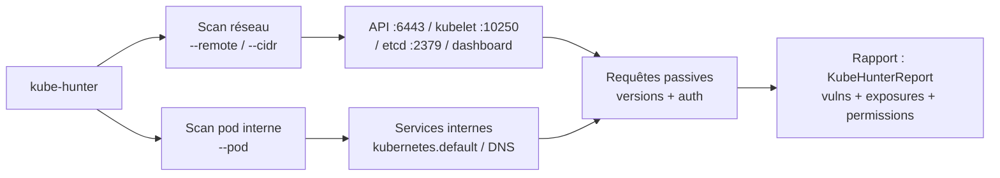
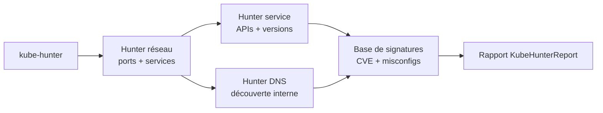

# kube-hunter - Le chasseur de vulnérabilités Kubernetes

> [!info] **En 1 phrase**
> kube-hunter scanne un cluster Kubernetes de l'extérieur ou depuis un pod pour repérer les services exposés et les vulnérabilités connues, avant même d'avoir un kubeconfig.

---

## Overview

| Champ | Valeur |
|---|---|
| Nom complet | kube-hunter |
| Description | Scanner de sécurité Kubernetes qui identifie les vulnérabilités du cluster (API exposé, anonymous auth, kubelet faible, etcd accessible, CVE connues) en mode réseau ou en mode pod |
| Catégorie | Cloud & Containers |
| Sous-catégorie | Kubernetes / Reconnaissance / Scan de vulnérabilités |
| Type d'outil | CLI Python (binaire, conteneur ou à l'intérieur d'un pod) |
| Licence | Apache-2.0 |
| Open source / propriétaire | Open source |
| Langage(s) de programmation | Python |
| Développeur / organisation | Aqua Security |
| Projet officiel | https://github.com/aquasecurity/kube-hunter |
| Dépôt officiel | https://github.com/aquasecurity/kube-hunter |
| Documentation officielle | https://github.com/aquasecurity/kube-hunter/blob/master/README.md |
| Date de création | 2018 |
| État du projet | **déprécié / archivé** (remplacé par l'écosystème Aqua : Trivy + KubeScout) |
| Dernière version connue | v0.6.8 |
| Systèmes compatibles | Linux, macOS ; déployable en conteneur ou en pod Kubernetes |

> [!note] Pour vérifier / compléter
> Version vérifiée sur https://github.com/aquasecurity/kube-hunter/releases (v0.6.8). Le dépôt est archivé : l'outil ne reçoit plus de mises à jour ; le garder pour la compatibilité et la connaissance des vulnérabilités historiques, mais préférer des scanners maintenus pour un usage courant.

---

## Concept

kube-hunter applique une approche **scanner passif** : il se connecte aux services Kubernetes identifiés (API server 6443, kubelet 10250, etcd 2379, dashboard) et envoie des requêtes non destructives pour déterminer leur version, leur configuration d'authentification et leurs expositions. Il croise ensuite ces informations avec une base de vulnérabilités connues.

Deux modes :
- **`--remote` / `--cidr`** : scan depuis le réseau externe, sans aucun accès préalable. Il repère les clusters exposés sur Internet ou dans le périmètre de test.
- **`--pod`** : exécuté depuis un conteneur compromis à l'intérieur du cluster, il cartographie les services internes (dns service, kubernetes.default) et détecte les permissions du service account monté.

L'intérêt offensif : identifier en amont les **canaux d'accès sans authentification** (anonymous auth sur l'API server, kubelet, dashboard sans login) et les **versions vulnérables** (CVE-2018-1002105, CVE-2019-1002101, ...) exploitables ensuite avec kubectl, curl ou peirates.



---

## Concepts fondamentaux

| Concept | Explication |
|---|---|
| Port 6443 | Port par défaut de l'API server Kubernetes ; kube-hunter teste l'authentification (anonyme, certificats) |
| Port 10250 | Kubelet HTTPS (kubelet API) ; en anonymous-auth, il expose les pods et permet parfois d'exécuter |
| Port 10255 | Kubelet en lecture seule (read-only port) ; ancienne surface d'énumération |
| Port 2379/2380 | etcd (clé/valeur) ; s'il est exposé sans TLS, tout le cluster est compromis (tokens, secrets) |
| Dashboard | UI Kubernetes souvent déployée avec des permissions larges et sans authentification |
| Service account | Identité du pod ; son token monté permet à kube-hunter `--pod` de tester les permissions |
| CVE connues | kube-hunter embarque une base de signatures de vulnérabilités (ex : CVE-2018-1002105) |
| KubeHunterReport | Rapport généré (texte, JSON) avec les vulnérabilités et leurs niveaux de sévérité |

---

## Installation

kube-hunter se déploie en binaire Python, en conteneur, ou en pod Kubernetes.

### Via pip (environnement Python)

```bash
pip3 install kube-hunter
kube-hunter --remote 10.10.20.15
```

### Conteneur (recommandé)

```bash
# Scan réseau d'un host ou d'un CIDR
docker run -it --rm aquasec/kube-hunter --remote 10.10.20.15
docker run -it --rm aquasec/kube-hunter --cidr 10.10.20.0/24
```

### Pod Kubernetes (scan interne)

```bash
# Lancer le job qui déploie kube-hunter dans un pod
kubectl apply -f https://raw.githubusercontent.com/aquasecurity/kube-hunter/master/job.yaml
kubectl get pods | grep kube-hunter
kubectl logs <pod-kube-hunter>
```

### Compilation depuis les sources

```bash
git clone https://github.com/aquasecurity/kube-hunter.git && cd kube-hunter
pip3 install -r requirements.txt
python3 kube-hunter.py --remote 10.10.20.15
```

> [!warning] Prérequis & problèmes potentiels
> - Le mode `--pod` requiert la possibilité de créer un pod (le job yaml crée un pod avec `automountServiceAccountToken` par défaut).
> - En scan réseau, des firewalls/network policies peuvent bloquer les ports 6443/10250/2379 → scanner depuis plusieurs origines.
> - L'outil étant archivé, certaines signatures de CVE sont obsolètes : recouper avec Trivy pour les CVE récentes.

---

## Configuration

kube-hunter se configure essentiellement par flags ; il n'y a pas de fichier de configuration global, mais des plugins extensibles en Python.

| Paramètre | Rôle | Valeur possible | Impact | Exemple |
|---|---|---|---|---|
| `--remote <ip/host>` | Cible unique à scanner | IP ou hostname | Scan d'un cluster | `--remote 10.10.20.15` |
| `--cidr <range>` | Plage réseau à scanner | CIDR | Scan d'un périmètre | `--cidr 10.10.20.0/24` |
| `--pod` | Mode pod (depuis l'intérieur) | drapeau | Scan interne + permissions SA | `--pod` |
| `--kubeconfig` | Kubeconfig pour le mode pod | chemin | Utilise l'identité du kubeconfig | `--kubeconfig ./config` |
| `--sequence` | Ordre des hunters | `network,service,dns` | Contrôle du scan | `--sequence network` |
| `--active` | Tests actifs (peuvent laisser des traces) | drapeau | Confirmer des hypothèses | `--active` |
| `--log <level>` | Niveau de log | `debug`, `info`, `warn` | Débogage | `--log debug` |
| `--json` | Sortie JSON | drapeau | Parsing du rapport | `--json` |
| `--interface <name>` | Interface pour le scan réseau | nom | Choisir la source | `--interface eth0` |

---

## Architecture interne

kube-hunter est écrit en Python et organisé en **hunters** (chasseurs) spécialisés, exécutés selon une séquence :

- **Hunters réseau** : scannent les ports et services Kubernetes exposés (6443, 10250, 10255, 2379, 8001, dashboard) et identifient les versions.
- **Hunters service** : interrogent les APIs découvertes avec des requêtes non destructives (version, auth, capacités d'exécution).
- **Hunters DNS** : utilisent les réponses DNS pour découvrir des services internes (`kubernetes.default`).
- **Moteur de signatures** : compare les versions et configurations détectées à la base de vulnérabilités embarquée.
- **Rapporteur** : agrège les résultats en rapport texte ou JSON (KubeHunterReport) avec les niveaux de sévérité.



---

## Commandes

### Commandes principales

| Commande | Objectif | Résultat attendu |
|---|---|---|
| `kube-hunter --remote <ip>` | Scan d'un hôte | Rapport des expositions et vulns |
| `kube-hunter --cidr <range>` | Scan d'une plage | Inventaire des clusters accessibles |
| `kube-hunter --pod` | Scan depuis l'intérieur | Services internes + permissions SA |
| `kube-hunter --kubeconfig <fichier>` | Scan avec une identité | Permissions réelles du principal |
| `kube-hunter --json` | Rapport JSON | Résultats parsables |
| `kube-hunter --active` | Tests actifs | Confirmation d'exploitabilité |

### Commandes avancées

```bash
# Scan complet d'un périmètre avec rapport JSON
kube-hunter --cidr 10.10.20.0/24 --json

# Scan depuis un pod avec l'identité du service account
kube-hunter --pod --kubeconfig /var/run/secrets/kubernetes.io/serviceaccount

# Confirmer une exposition avec les tests actifs
kube-hunter --remote 10.10.20.15 --active
```

---

## Options et flags

| Option | Description | Exemple | Niveau |
|---|---|---|---|
| `--remote` | Cible unique | `--remote 10.10.20.15` | Basic |
| `--cidr` | Plage à scanner | `--cidr 10.10.20.0/24` | Basic |
| `--pod` | Mode pod interne | `--pod` | Intermediate |
| `--kubeconfig` | Identité via kubeconfig | `--kubeconfig ./admin.conf` | Intermediate |
| `--json` | Sortie JSON | `--json` | Basic |
| `--active` | Tests actifs | `--active` | Advanced |
| `--log` | Niveau de log | `--log debug` | Intermediate |
| `--sequence` | Ordre des hunters | `--sequence network,service` | Expert |
| `--interface` | Interface source | `--interface eth0` | Expert |

> [!tip] Options les plus utiles au quotidien
> `--remote` pour un cible précise, `--cidr` pour cartographier, `--pod` pour le scan interne, `--json` pour parser, `--active` pour lever les doutes sur les détections passives.

---

## Exemples pratiques

### Beginner

```bash
# Scan simple d'un cluster
kube-hunter --remote 10.10.20.15
```

Résultat attendu : un rapport KubeHunterReport listant les services trouvés (ex : `Kubernetes API Server`), les vulnérabilités (ex : `Kubernetes Anonymous Authentication Enabled`) et leurs niveaux.

### Intermediate

```bash
# Cartographier un périmètre de test
kube-hunter --cidr 10.10.20.0/24 --json | jq '.vulnerabilities[].name'

# Scan avec logs verbeux pour comprendre les requêtes envoyées
kube-hunter --remote 10.10.20.15 --log debug
```

### Advanced

```bash
# Depuis un pod compromis : scan interne + permissions du SA
kube-hunter --pod --json

# Confirmer une exposition suspecte avec des tests actifs
kube-hunter --remote 10.10.20.15 --active
```

### Expert

```bash
# Combiner scan réseau et scan interne pour une vue complète
docker run -it --rm aquasec/kube-hunter --cidr 10.10.20.0/24 --json > scan-reseau.json
kube-hunter --pod --kubeconfig /var/run/secrets/kubernetes.io/serviceaccount > scan-interne.txt

# Comparer les expositions vues de l'extérieur et de l'intérieur
jq -r '.services[].name' scan-reseau.json | sort -u
grep -i 'service' scan-interne.txt | sort -u
```

---

## Workflow complet (scénario pas à pas)

1. **Scanner l'extérieur** - identifier les clusters exposés sur le périmètre.
   ```bash
   kube-hunter --cidr 10.10.20.0/24 --json
   ```
2. **Isoler les candidats** - lister les services et vulnérabilités découverts.
   ```bash
   jq -r '.vulnerabilities[] | "\(.severity) \(.name) \(.evidence)"' kube-hunter-report.json
   ```
3. **Tester l'accès anonyme** - si `Anonymous Auth` est détecté, interroger directement l'API.
   ```bash
   curl -sk https://10.10.20.15:6443/api/v1/pods
   ```
4. **Tester le kubelet** - si le port 10250 est exposé, énumérer les pods sans token.
   ```bash
   curl -sk https://10.10.20.15:10250/pods
   ```
5. **Passer en interne** - un pod compromis lance le mode `--pod` pour la suite du pivot.
   ```bash
   kubectl apply -f https://raw.githubusercontent.com/aquasecurity/kube-hunter/master/job.yaml
   kubectl logs <pod-kube-hunter>
   ```

---

## Scénarios avancés

### Scénario 1 : Détection de l'API server sans authentification

```bash
# 1. kube-hunter détecte "Kubernetes Anonymous Authentication"
kube-hunter --remote 10.10.20.15 --json | jq -r '.vulnerabilities[] | select(.name|test("Anonymous")) | .name'

# 2. Confirmer sans token
curl -sk https://10.10.20.15:6443/version
curl -sk https://10.10.20.15:6443/api/v1/namespaces

# 3. Pivoter avec kubectl
kubectl --server https://10.10.20.15:6443 --insecure-skip-tls-verify=true \
  --token=anything get secrets -A
```

Une API server en anonymous auth équivaut à un accès de découverte complet : la liste des namespaces et des ressources sensibles est à portée de curl.

### Scénario 2 : Kubelet exposé sur 10250 (candidat à l'évasion)

```bash
# 1. kube-hunter signale le kubelet
kube-hunter --remote 10.10.20.15 --json | \
  jq -r '.vulnerabilities[] | select(.evidence|test("10250")) | .evidence'

# 2. Énumérer les pods depuis le kubelet
curl -sk https://10.10.20.15:10250/pods | jq -r '.items[].metadata.name'

# 3. Si anonymous auth est actif, tenter d'écrire un pod de contrôle
curl -sk -X POST https://10.10.20.15:10250/run/<ns>/<pod>/<container> \
  -H "Content-Type: application/json" -d '{"cmd":["id"]}'
```

---

## Cybersecurity use cases

| Phase | Utilisation |
|---|---|
| Reconnaissance | Détection des clusters exposés (API 6443, kubelet, etcd, dashboard) |
| Énumération | Versions des composants, configuration d'authentification |
| Vulnérabilité | Correspondance avec les CVE Kubernetes connues |
| Exploitation | Confirmation des accès anonymes et des surfaces d'exécution |
| Post-exploitation | Mode pod : permissions du service account et services internes |
| Exfiltration | Localisation des canaux (etcd non protégé = secrets en clair) |

---

## MITRE ATT&CK

| Tactique | Technique / Sub-technique | ID | Raison | Détection | Mitigation |
|---|---|---|---|---|---|
| Discovery | Network Service Discovery | T1046 | Scan des ports Kubernetes (6443, 10250, 2379) | IDS/IPS, logs de connexions | Firewalls, NetworkPolicy |
| Discovery | Container and Resource Discovery | T1613 | Identification des ressources et services du cluster | Audit logs API server | RBAC minimal |
| Initial Access | Exploit Public-Facing Application | T1190 | Exploitation des API exposées sans auth | IDS sur les endpoints | Exposition contrôlée, auth forcée |
| Credential Access | Unsecured Credentials : Files | T1552.001 | etcd non protégé → secrets et tokens en clair | Alerting sur les connexions 2379 | TLS + auth etcd |
| Discovery | Remote System Discovery | T1018 | Découverte des nœuds et services internes | Segmentation réseau | NetworkPolicy |

> [!note] Ne renseigner que si l'association est réellement pertinente.
> kube-hunter réalise de la reconnaissance passive ; les techniques listées correspondent à l'usage offensif des résultats.

---

## Defensive Security

### Signes observables

| Indicateur | Détail |
|---|---|
| Connexions vers les ports 6443/10250/2379 depuis une IP inconnue | Scan réseau kube-hunter |
| Requêtes `/version` et `/api` répétées sans authentification | Énumération passive |
| Pod `kube-hunter` créé dans un namespace | Job non autorisé |
| Réponses `401/403` suivies de nouvelles tentatives | Tests d'anonymous auth |
| Requêtes `/pods` vers le kubelet | Énumération kubelet |

### Règles de détection (Sigma / Suricata / Snort / YARA)

```yaml
# Sigma - Kubernetes : scan kube-hunter (requêtes /version répétées sans auth)
title: K8s kube-hunter Passive Scan
id: 0b0b2f90-0000-4a9a-8c5f-000000000071
status: experimental
logsource:
    product: kubernetes
    service: apiserver
detection:
    selection:
        requestURI:
            - '/version'
            - '/api'
            - '/apis'
        sourceIPs:
            - '10.10.20.15'
    condition: selection
    timeframe: 5m
falsepositives:
    - Outils de monitoring légitimes interrogeant l'API
level: medium
```

> [!note] À vérifier
> Exemple pédagogique : l'identifiant Sigma est fictif et à régénérer si publié ; les seuils sont à adapter au trafic réel.

---

## Automatisation

```bash
# Bash - scan programmé + archivage du rapport
#!/bin/bash
DATE=$(date +%F)
kube-hunter --cidr 10.10.20.0/24 --json > "kube-hunter-$DATE.json"
jq -r '.vulnerabilities[] | "\(.severity)\t\(.name)"' "kube-hunter-$DATE.json"

# Bash - scan réseau de tous les hôtes d'un fichier
while read -r ip; do
  kube-hunter --remote "$ip" --json | jq -r '.vulnerabilities[]?.name'
done < cibles.txt
```

```python
# Python - consolider les rapports JSON de plusieurs cibles
import json

cibles = ["10.10.20.15", "10.10.20.16"]
for cible in cibles:
    with open(f"report-{cible}.json", encoding="utf-8") as f:
        data = json.load(f)
    for vuln in data.get("vulnerabilities", []):
        print(cible, vuln["name"], vuln["severity"], vuln.get("evidence", ""))
```

---

## Output et parsing

kube-hunter génère un rapport texte lisible ou du JSON. Le JSON contient des listes `services`, `vulnerabilities`, `nodeInfo` et `permissions`.

```bash
# Lister les vulnérabilités par sévérité
kube-hunter --remote 10.10.20.15 --json | \
  jq -r '.vulnerabilities[] | "\(.severity) \(.name)"' | sort

# Extraire les services découverts
kube-hunter --remote 10.10.20.15 --json | \
  jq -r '.services[] | "\(.service) -> \(.ports)"'
```

---

## Intégrations

- [[Tools| Outils]] global
- [[Outil - kubectl|kubectl]] - exploitation des expositions détectées
- [[Outil - kube-bench|kube-bench]] - audit de posture complémentaire (config vs réseau)
- [[Outil - peirates|peirates]] - post-exploitation quand une surface est confirmée
- [[Outil - trivy|trivy]] - CVE récentes des images et composants (kube-hunter est archivé)
- [[Outil - cloudfox|cloudfox]] - découverte des clusters EKS côté AWS
- Kubernetes Dashboard / Elastic - intégration des rapports dans les SIEM

```text
kube-hunter (réseau) + kube-bench (config) -> kubectl/peirates (exploitation)
```

---

## Alternatives

| Outil | Avantages | Inconvénients | Cas d'usage |
|---|---|---|---|
| kube-bench | Benchmark CIS maintenu, config précise | Pas de scan réseau | Audit de posture |
| KubeScout (Aqua) | Successeur moderne, maintenu | Payant, moins répandu | Scan récent |
| Trivy | CVE à jour, scan d'images | Pas de scan réseau K8s | Vulnérabilités conteneurs |
| nmap | Scan réseau complet, scripts NSE | Pas de connaissances K8s | Port scan générique |
| peirates | Post-exploitation active | Pas de reconnaissance passive | Exploitation |

---

## Performance

- **Rapide en réseau** : quelques secondes par hôte ; le scan d'un /24 prend quelques minutes.
- **Non destructif** : requêtes passives uniquement (sauf `--active`), aucun changement de configuration.
- **Discret côté cluster** : les requêtes se fondent dans le trafic API normal, mais restent visibles dans les audit logs.
- **Coût en mode pod** : un pod `kube-hunter` supplémentaire à créer ; nettoyer le job après usage.

---

## Troubleshooting

### Common problems

#### Problème : aucune vulnérabilité détectée alors que le cluster est exposé

- **Cause** : firewalls/network policies bloquent les ports, ou le scan se fait depuis une origine trop éloignée.
- **Solution** : scanner depuis plusieurs origines, vérifier la connectivité (`nc -zv 10.10.20.15 6443`).
- **Vérification** : `--log debug` montre les requêtes réellement envoyées.

#### Problème : le mode `--pod` ne trouve rien

- **Cause** : le pod n'a pas accès aux services internes, ou le service account n'a pas de permissions.
- **Solution** : vérifier que le pod tourne dans le cluster (same node), utiliser `--kubeconfig` avec les bons droits.
- **Vérification** : `kubectl get pods` confirme que le job est bien dans le cluster.

#### Problème : erreur de dépendance Python lors de l'installation pip

- **Cause** : anciens paquets ou Python trop récent (l'outil est archivé).
- **Solution** : utiliser l'image conteneur `aquasec/kube-hunter` plutôt que pip.
- **Vérification** : `docker run -it --rm aquasec/kube-hunter --version`.

---

## Sécurité de l'outil

- **Cadre légal** : scan réseau passif ; à effectuer uniquement sur les périmètres autorisés (pentest signé).
- **Traçabilité** : les connexions vers 6443/10250/2379 sont loggées côté cluster et réseau → prévoir la discrétion.
- **Mode actif** : `--active` envoie des requêtes qui peuvent déclencher des alertes ; l'utiliser avec parcimonie.
- **Données du rapport** : le JSON contient les adresses, versions et expositions ; le protéger.
- **Dépôt archivé** : exécuter un binaire non maintenu peut véhiculer des dépendances obsolètes ; préférer l'image officielle.

---

## Limitations

- **Projet archivé** : plus de mises à jour depuis la fin des années 2020 ; les CVE récentes ne sont pas couvertes.
- **Passif uniquement** : il détecte des expositions, ne prouve pas toujours l'exploitation.
- **Base de signatures limitée** : les détections reposent sur des versions et patterns connus à l'époque du projet.
- **Pas de scan applicatif** : il ne couvre ni le code, ni les images, ni le réseau applicatif.
- **Faux positifs** : un service exposé ne signifie pas forcément une vulnérabilité exploitable.

---

## Cheatsheet

```bash
# Scan d'une cible unique
kube-hunter --remote 10.10.20.15

# Scan d'un périmètre
kube-hunter --cidr 10.10.20.0/24

# Scan depuis un pod (interne)
kube-hunter --pod

# Rapport JSON parsable
kube-hunter --remote 10.10.20.15 --json

# Tests actifs pour confirmer
kube-hunter --remote 10.10.20.15 --active

# En conteneur
docker run -it --rm aquasec/kube-hunter --cidr 10.10.20.0/24

# Job pod Kubernetes
kubectl apply -f https://raw.githubusercontent.com/aquasecurity/kube-hunter/master/job.yaml
```

---

## Quick reference

| | |
|---|---|
| **À quoi sert-il ?** | Scanner les expositions et vulnérabilités d'un cluster Kubernetes |
| **Quand l'utiliser ?** | Reconnaissance initiale : avant tout accès au cluster |
| **Commande principale** | `kube-hunter --remote <ip>` ou `--cidr <range>` |
| **Alternative principale** | kube-bench (config), Trivy (CVE récentes), nmap (réseau) |
| **Concepts importants** | API 6443, kubelet 10250, etcd 2379, anonymous auth, mode pod |
| **Liens associés** | [[Outil - kube-bench]] · [[Outil - kubectl]] · [[Outil - trivy]] |

---

## Détection & Défense

| Signe | Défense |
|---|---|
| Scans des ports 6443/10250/2379 | IDS/IPS, firewalls, alerting de connexions |
| Requêtes `/version` sans auth en rafale | Détection d'énumération API |
| Pod `kube-hunter` dans un namespace | Approval des jobs, ImagePolicyWebhook |
| Connexions vers etcd (2379) | TLS + auth obligatoires, NetworkPolicy |
| Dashboard exposé sans auth | Authentification forcée, RBAC restrictif |

---

## Tips & Pièges

> [!tip] **Tips**
> - Lance `--cidr` en premier pour cartographier, puis `--remote` sur chaque cluster pour les détails.
> - Croise les findings avec kube-bench : kube-hunter dit « ça écoute », kube-bench dit « ça à quoi ça ressemble ».
> - Le mode `--pod` révèle les permissions du service account : précieux pour planifier l'escalade.
> - `--json` + jq pour extraire les vulnérabilités à haute sévérité dans tes rapports de pentest.

> [!warning] **Pièges**
> - kube-hunter est **archivé** : une détection absente ne veut pas dire que le cluster est sain.
> - Un service exposé n'est pas toujours exploitable : confirme avec `--active` ou des requêtes manuelles.
> - Les connexions de scan sont visibles : sur un vrai pentest, compte-les comme du bruit à assumer.
> - Ne t'appuie pas uniquement sur ses CVE : elles datent ; utilise Trivy pour la vulnérabilité récente.

---

## References

### Official

- Dépôt officiel : https://github.com/aquasecurity/kube-hunter
- Releases : https://github.com/aquasecurity/kube-hunter/releases
- Documentation : https://github.com/aquasecurity/kube-hunter/blob/master/README.md
- Aqua Security : https://www.aquasec.com/

### Security references

- MITRE ATT&CK T1046 - Network Service Discovery : https://attack.mitre.org/techniques/T1046/
- MITRE ATT&CK T1613 - Container and Resource Discovery : https://attack.mitre.org/techniques/T1613/
- CVE-2018-1002105 (kube-apiserver) : https://nvd.nist.gov/vuln/detail/CVE-2018-1002105

### Community

- HackTricks - Kubernetes pentesting : https://book.hacktricks.wiki/en/network-services-pentesting/kubernetes-pentesting.html
- Kubernetes Security (kubernetes.io) : https://kubernetes.io/docs/concepts/security/

---

**Liens :** [[Tools| Outils]] · [[Outil - kube-bench|kube-bench]] · [[Outil - kubectl|kubectl]] · [[Outil - trivy|trivy]]
