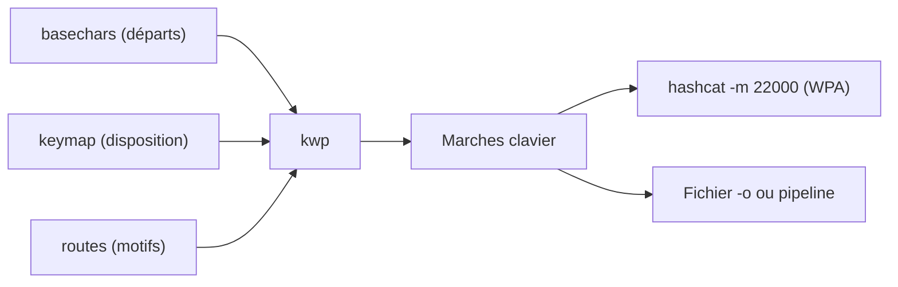

# ⌨️ kwprocessor — Mots de passe « marche clavier » (keyboard walk)

> [!info] **En 1 phrase**
> kwprocessor, l'outil C officiel du projet hashcat, génère des mots de passe formés par des déplacements sur le clavier (qwerty, qazwsx, 1qaz2wsx...) en combinant basechars, keymap et routes.

---

## 🧾 Overview

| Champ | Valeur |
|---|---|
| Nom complet | kwprocessor (KWP) — Advanced keyboard-walk generator |
| Description | Générateur de mots de passe « marche clavier » : suites de touches adjacentes formées par des déplacements sur le clavier |
| Catégorie | 🔑 Wordlists & Générateurs |
| Sous-catégorie | Keyboard walk / patterns clavier |
| Fonction principale | Produire tous les chemins d'un motif (route) depuis des caractères de départ (basechars) sur une disposition (keymap) |
| Type d'outil | CLI (programme C) |
| Licence | MIT |
| Open source / propriétaire | Open source |
| Langage(s) de programmation | C |
| Développeur / organisation | Jens Steube (auteur de hashcat) / projet hashcat |
| Projet officiel | https://github.com/hashcat/kwprocessor |
| Dépôt officiel | https://github.com/hashcat/kwprocessor |
| Documentation officielle | https://hashcat.net/wiki/doku.php?id=kwprocessor |
| Date de création | ~2012 (première release publique v1.00 en 2016-08-15) |
| État du projet | maintenu (v1.00, dépôt actif) |
| Dernière version connue | 1.00 |
| Systèmes compatibles | Linux / macOS / Windows (binaire précompilé dans l'archive .7z de la release) |

> [!note] Pour vérifier / compléter
> Pas de paquet apt officiel : installation par `make` depuis les sources, ou binaire Windows dans la release `kwprocessor-1.00.7z`.

---

## 🎯 Concept

Beaucoup de mots de passe « sécurisés » ne sont en réalité que des **parcours de clavier** : `qwerty`, `qazwsx`, `1qaz2wsx`, `zxcvbnm`, `1234rewq`, `q2w3e4r`... Pour l'utilisateur, une suite de touches adjacentes se retient sans effort et semble aléatoire à un observateur. Pour le craqueur, c'est au contraire un motif prévisible : le générateur doit reproduire la logique de l'utilisateur, pas celle d'un académique — c'est le postulat de Jens Steube, qui écrivait ce code parce qu'aucun générateur existant ne correspondait à sa définition d'une marche clavier.

kwprocessor (KWP) génère ces motifs à partir de **trois fichiers de configuration** : les `basechars` (caractères de départ, ex. `basechars/full.base`), une `keymap` (disposition physique du clavier, ex. `keymaps/en-us.keymap`, `keymaps/fr.keymap`) et des `routes` (séquences de déplacements géographiques : longueurs, directions, changements de direction). Une route comme `313` signifie « 3 pas dans une direction, puis 1 pas dans une autre, puis 3 pas dans une troisième » — ce qui produit des rectangles (`qwerfdsa`, `4rfvbgt5`) et autres figures humaines. Les diagonales sont désactivées par défaut : les humains marchent surtout en ligne droite. Place dans un pentest : complément des wordlists classiques, particulièrement efficace pour les attaques Wi-Fi WPA/WPA2-PSK et les comptes « que personne ne devrait deviner ».



---

## 🧠 Concepts fondamentaux

| Concept | Explication |
|---|---|
| Keyboard walk | Mot de passe formé par un déplacement contigu sur le clavier, sans saut : `qazwsx`, `1qaz2wsx` |
| Basechar | Caractère de départ ; la génération applique tous les motifs à chaque basechar, dans l'ordre du fichier |
| Keymap | Disposition des touches : 12 lignes (4 lignes « basic », 4 « shift », 4 « altgr »), largeur max 14, caractères non imprimables remplacés par des espaces |
| Route | Fichier de motifs : une ligne par motif, chaque chiffre (hex 1-F) = nombre de pas consécutifs dans une direction, sans jamais répéter la direction précédente |
| Directions géographiques | 9 directions (ordre du pavé numérique) : 1 sud-ouest, 2 sud, 3 sud-est, 4 ouest, 5 reste, 6 est, 7 nord-ouest, 8 nord, 9 nord-est |
| Changements de direction | Nombre de fois où le chemin change d'orientation ; les motifs humains en ont peu — c'est le principal levier de contrôle du volume |
| Modificateurs | Basic (sans Shift/AltGr), Shift, AltGr : l'outil gère 27 « directions » (9 × 3 modificateurs), activables séparément |
| Compromis sécurité/ergonomie | Pour l'utilisateur, une marche clavier est une « sécurité moyenne » acceptable : elle ressemble à de l'aléatoire sans l'effort d'une passphrase |
| Claviers nationaux | Une même route produit des candidats différents selon la disposition : en-us donne `1qazxsw2`, de.keymap donne `1qayxsw2` (z/y inversés) |

---

## 🛠️ Installation

### Debian / Ubuntu / Kali Linux

```bash
git clone https://github.com/hashcat/kwprocessor.git
cd kwprocessor
make
./kwp --help
```

### Arch Linux

```bash
git clone https://github.com/hashcat/kwprocessor.git
cd kwprocessor
make
./kwp --help
```

### Fedora / RHEL

```bash
git clone https://github.com/hashcat/kwprocessor.git
cd kwprocessor
make
./kwp --help
```

### macOS

```bash
git clone https://github.com/hashcat/kwprocessor.git
cd kwprocessor
make
./kwp --help
```

### Windows

```powershell
# Binaire précompilé fourni dans la release officielle
Invoke-WebRequest -Uri "https://github.com/hashcat/kwprocessor/releases/download/v1.00/kwprocessor-1.00.7z" -OutFile kwprocessor-1.00.7z
# Extraire avec 7-Zip, puis :
.\kwp64.exe basechars\full.base keymaps\en-us.keymap routes\2-to-10-max-3-direction-changes.route
```

### Docker

Pas d'image officielle. Construction locale légère :

```bash
docker run --rm -v ${PWD}:/out -w /out debian:bookworm-slim \
  bash -c "apt-get update >/dev/null 2>&1 && apt-get install -y make gcc git >/dev/null 2>&1 && \
           git clone -q https://github.com/hashcat/kwprocessor.git /tmp/kwp && \
           make -C /tmp/kwp"
```

### Compilation depuis les sources

```bash
git clone https://github.com/hashcat/kwprocessor.git && cd kwprocessor
make
# binaire produit : ./kwp
```

> [!warning] ⚠️ Prérequis & problèmes potentiels
> Nécessite un compilateur C (`make`, `gcc`) ; pas de dépendance externe au-delà. `make` génère le binaire `kwp` dans le dossier du dépôt. Les fichiers de config (`basechars/`, `keymaps/`, `routes/`) doivent être conservés : l'outil les lit à chaque exécution.

---

## ⚙️ Configuration

Pas de fichier de configuration : tout est passé en arguments — le triplé positionnel `basechars keymap routes` et les options de modificateurs/directions/distances.

| Paramètre | Rôle | Valeur par défaut | Impact | Exemple |
|---|---|---|---|---|
| Fichier basechars | Caractères de départ (une seule ligne, max 1023) | `basechars/full.base` | Nombre de départs ; les caractères absents de la keymap sont ignorés | `tiny.base` (1 caractère) |
| Fichier keymap | Disposition du clavier (exactement 12 lignes) | `keymaps/en-us.keymap` | Forme exacte des candidats (qwerty vs azerty vs dvorak) | `keymaps/fr.keymap` |
| Fichier routes | Motifs de déplacement (une ligne par route) | `routes/2-to-10-max-3-direction-changes.route` | Volume et formes générés | `routes/4-to-4-exhaustive.route` |
| `-b` / `-s` / `-a` | Inclure basic / shift / altgr | `1` / `0` / `0` | Jusqu'à 3 jeux de lettres par touche | `-s 1 -a 1` |
| Directions `-1` à `-9` | Activer une direction géographique | droites (2,4,6,8) actives | Plus de directions = beaucoup plus de candidats | `-7 1 -9 1` (diagonales) |
| `-n` / `-x` | Distance min/max entre touches (1-16) | `1` / `1` | Génère des sauts de touches pour les motifs décalés | `-n 1 -x 2` |

---

## 🏗️ Architecture interne

Un unique fichier C (`src/kwp.c`, ~900 lignes). La keymap est lue et découpée en trois matrices `keymap_basic[14][4]`, `keymap_shift[14][4]`, `keymap_altgr[14][4]` (14 colonnes × 4 rangées) ; les caractères sont traités en `wchar_t`. Pour chaque caractère possible, `setup_cs()` construit une table `map[16][3][9]` : par distance (jusqu'à 16), par modificateur (basic/shift/altgr) et par direction (9) — chaque entrée étant le caractère atteint (ou invalide si hors du clavier).

Les routes sont parsées en `repeat[32]` (pas par changement de direction, hex 1-F). Pour chaque route, le keyspace est `basechars × (dist_cnt × mod_cnt × dir_cnt)^changes`, brute-forcé dans `process_route()` : à chaque changement, la direction doit différer de la précédente (sinon candidat invalide), ce qui **garantit l'absence de doublons**. Les chemins qui sortent du clavier (ex. partir de `1` vers le nord-ouest) sont rejetés. La sortie est tamponnée (`out_push`/`out_flush`) et écrite sur stdout ou en **append** dans le fichier `-o`. Les modificateurs sont gérés comme des « directions » supplémentaires (9 × 3 = 27 déplacements possibles), ce qui explique que `qwerFDSA` (route `313`) est produit mais que `qwerFDsA` nécessite une route `31111`.

---

## ⌨️ Commandes

### Commandes principales

```bash
kwp [options]... basechars-file keymap-file routes-file
```

| Commande | Objectif | Résultat attendu |
|---|---|---|
| `./kwp basechars/full.base keymaps/en-us.keymap routes/2-to-10-max-3-direction-changes.route` | Générer les marches clavier par défaut | 39 828 mots sur stdout (exemple de la wiki hashcat) |
| `./kwp ... -o walks.txt` | Écrire la sortie dans un fichier (append) | Fichier `walks.txt` |
| `./kwp -s 1 basechars/full.base keymaps/en-us.keymap routes/4-to-4-exhaustive.route` | Ajouter les caractères Shift | Candidats avec majuscules (`QwerFDSA`) |
| `./kwp -z -0 basechars/full.base keymaps/en-us.keymap routes/2-to-10-max-3-direction-changes.route` | Tous modificateurs + toutes directions | Candidats Shift + AltGr + diagonales |
| `./kwp ... | hashcat -m 22000 wpa.hc22000` | Pipeline direct dans hashcat | Cracking WPA sans fichier intermédiaire |
| `./kwp --version` | Afficher la version | `v1.00` (aussi `-V`) |

### Commandes avancées

```bash
# Clavier AZERTY français, uniquement les droites (défaut), motifs courts
./kwp basechars/full.base keymaps/fr.keymap routes/2-to-10-max-3-direction-changes.route

# Motifs très grands : attention au volume (2-to-16-max-4 = millions de mots)
./kwp basechars/full.base keymaps/en-us.keymap routes/2-to-16-max-3-direction-changes.route | wc -l

# Sauts de touches (distance 2) pour les motifs décalés type 1qaz2wsx
./kwp -n 1 -x 2 basechars/full.base keymaps/en-us.keymap routes/2-to-10-max-3-direction-changes.route

# Limiter au pavé des lettres minuscules (basechars réduit), puis rules hashcat
./kwp basechars/tiny.base keymaps/en-us.keymap routes/4-to-4-exhaustive.route \
  | hashcat -m 5600 ntlm.txt -r /usr/share/hashcat/rules/best64.rule
```

---

## 🎚️ Options et flags

| Option | Description | Exemple | Niveau |
|---|---|---|---|
| `-o` / `--output-file FICHIER` | Écrit la sortie dans un fichier (append) | `./kwp ... -o walks.txt` | Basic |
| `-b` / `--keyboard-basic BOOL` | Inclut les caractères sans Shift/AltGr | `./kwp -b 1 ...` | Basic |
| `-s` / `--keyboard-shift BOOL` | Inclut les caractères Shift | `./kwp -s 1 ...` | Intermediate |
| `-a` / `--keyboard-altgr BOOL` | Inclut les caractères AltGr (non-anglais) | `./kwp -a 1 keymaps/fr.keymap ...` | Intermediate |
| `-z` / `--keyboard-all` | Raccourci : active basic + shift + altgr | `./kwp -z ...` | Advanced |
| `-1` / `--keywalk-south-west BOOL` | Direction diagonale sud-ouest | `./kwp -1 1 ...` | Advanced |
| `-2` / `--keywalk-south BOOL` | Direction droite sud (actif par défaut) | `./kwp -2 1 ...` | Basic |
| `-3` / `--keywalk-south-east BOOL` | Direction diagonale sud-est | `./kwp -3 1 ...` | Advanced |
| `-4` / `--keywalk-west BOOL` | Direction droite ouest (actif par défaut) | `./kwp -4 1 ...` | Basic |
| `-5` / `--keywalk-repeat BOOL` | Autorise la répétition de la même touche | `./kwp -5 1 ...` | Advanced |
| `-6` / `--keywalk-east BOOL` | Direction droite est (actif par défaut) | `./kwp -6 1 ...` | Basic |
| `-7` / `--keywalk-north-west BOOL` | Direction diagonale nord-ouest | `./kwp -7 1 ...` | Advanced |
| `-8` / `--keywalk-north BOOL` | Direction droite nord (actif par défaut) | `./kwp -8 1 ...` | Basic |
| `-9` / `--keywalk-north-east BOOL` | Direction diagonale nord-est | `./kwp -9 1 ...` | Advanced |
| `-c` / `--keywalk-cont` | Raccourci « continuous walks » (adjacents) | `./kwp -c ...` | Advanced |
| `-0` / `--keywalk-all` | Raccourci : active les 9 directions | `./kwp -0 ...` | Expert |
| `-n` / `--keywalk-distance-min N` | Distance minimale entre touches (1-16) | `./kwp -n 1 ...` | Expert |
| `-x` / `--keywalk-distance-max N` | Distance maximale entre touches (1-16) | `./kwp -x 2 ...` | Expert |

> [!tip] Options les plus utiles au quotidien
> Le trio positionnel `basechars keymap routes` suffit pour 95 % des usages (défauts : 4 droites, basic seul). Ajoute `-s 1` pour les majuscules, `keymaps/fr.keymap` pour les cibles francophones, et pipe directement dans hashcat pour éviter les fichiers géants.

---

## 🧪 Exemples pratiques

### Beginner

```bash
# Objectif : générer les marches clavier classiques (qwerty, 1qaz2wsx, ...)
./kwp basechars/full.base keymaps/en-us.keymap routes/2-to-10-max-3-direction-changes.route
# Résultat : 39 828 candidats sur stdout (qwerty, 1qaz2wsx, 1234rewq...)
```

### Intermediate

```bash
# Objectif : générer pour des utilisateurs français (AZERTY) et vérifier le volume
./kwp basechars/full.base keymaps/fr.keymap routes/2-to-10-max-3-direction-changes.route | wc -l
# Objectif : ajouter les majuscules pour satisfaire les politiques de complexité
./kwp -s 1 basechars/full.base keymaps/en-us.keymap routes/4-to-4-exhaustive.route | head -20
# Objectif : écrire dans un fichier pour réutilisation
./kwp basechars/full.base keymaps/en-us.keymap routes/2-to-10-max-3-direction-changes.route -o /tmp/walks.txt
```

### Advanced

```bash
# Objectif : attaque WPA2-PSK complète, du capture au crack
hcxpcapngtool capture.cap -o /tmp/wpa.hc22000
./kwp basechars/full.base keymaps/en-us.keymap routes/2-to-10-max-3-direction-changes.route \
  | hashcat -m 22000 /tmp/wpa.hc22000
# Objectif : inclure diagonales et AltGr pour les claviers européens
./kwp -0 -z basechars/full.base keymaps/de.keymap routes/2-to-10-max-3-direction-changes.route | wc -l
```

### Expert

```bash
# Objectif : pipeline complet avec règles de mutation et contrôle du volume
./kwp -n 1 -x 2 basechars/full.base keymaps/fr.keymap routes/2-to-16-max-3-direction-changes.route \
  | hashcat -m 22000 /tmp/wpa.hc22000 -r /usr/share/hashcat/rules/best64.rule
```

---

## 🧪 Workflow complet (scénario pas à pas)

1. **Récupérer le dépôt et compiler** :
   ```bash
   git clone https://github.com/hashcat/kwprocessor.git && cd kwprocessor && make
   ```
2. **Générer une première liste** (motifs de 2 à 10 pas, 3 changements max) :
   ```bash
   ./kwp basechars/full.base keymaps/en-us.keymap routes/2-to-10-max-3-direction-changes.route > /tmp/walks.txt
   ```
3. **Vérifier la taille et la pertinence** :
   ```bash
   wc -l /tmp/walks.txt
   grep -E "qwerty|1qaz2wsx|qazwsx" /tmp/walks.txt
   ```
4. **Convertir un handshake WPA et lancer hashcat** (pipeline, sans fichier) :
   ```bash
   hcxpcapngtool capture.cap -o /tmp/wpa.hc22000
   ./kwp basechars/full.base keymaps/en-us.keymap routes/2-to-10-max-3-direction-changes.route \
     | hashcat -m 22000 /tmp/wpa.hc22000
   ```
5. **Adapter à la cible** — disposition AZERTY (France/Belgique), majuscules :
   ```bash
   ./kwp -s 1 basechars/full.base keymaps/fr.keymap routes/2-to-10-max-3-direction-changes.route \
     | hashcat -m 22000 /tmp/wpa.hc22000
   ```
---

## 🎬 Scénarios avancés

### Scénario 1 : WPA2-PSK avec keymap AZERTY (cible francophone)

Le dépôt fournit déjà `keymaps/fr.keymap` : inutile d'en fabriquer une. Les candidats suivent la disposition française (a/z inversés, touches accentuées AltGr) :

```bash
hcxpcapngtool capture.cap -o /tmp/wpa.hc22000
./kwp -z basechars/full.base keymaps/fr.keymap routes/2-to-16-max-3-direction-changes.route \
  | hashcat -m 22000 /tmp/wpa.hc22000 -r /usr/share/hashcat/rules/best64.rule
```

### Scénario 2 : marches clavier + règles de mutation

Croiser les walks avec des règles hashcat pour couvrir les variantes (majuscules, suffixes) :

```bash
./kwp basechars/full.base keymaps/en-us.keymap routes/2-to-10-max-3-direction-changes.route \
  | hashcat -m 5600 ntlm.txt -r /usr/share/hashcat/rules/OneRuleToRuleThemAll.rule
```

### Scénario 3 : contrôle du volume par routes ciblées

Utiliser les routes exhaustives courtes pour un bruteforce discipliné, et les grandes routes (`2-to-32-max-5`, fichier de 1 Mo à lui seul) uniquement sur GPU :

```bash
# Petite route : 4-to-4-exhaustive (rectangles 3x3)
./kwp basechars/full.base keymaps/en-us.keymap routes/4-to-4-exhaustive.route | wc -l
```

---

## 🛡️ Cybersecurity use cases

| Phase | Utilisation |
|---|---|
| Préparation d'attaque | Génération de wordlists « keyboard walk » avant cracking (T1110) |
| Cracking hors-ligne | Alimentation de hashcat (NTML, NetNTLMv2, WPA-PMKID) en pipeline |
| Attaques Wi-Fi | Cracking WPA/WPA2-PSK sur handshakes capturés (PMKID) |
| Accès initial | Password guessing / spraying sur comptes humains (T1110.001 / .003) |
| Post-exploitation | Test de mots de passe type « marche clavier » sur comptes locaux |

---

## 🎯 MITRE ATT&CK

| Tactique | Technique / Sub-technique | ID | Raison | Détection | Mitigation |
|---|---|---|---|---|---|
| Credential Access | Brute Force: Password Guessing | T1110.001 | Marches clavier testées en ligne | Échecs 4625 répétés par source | Verrouillage progressif, MFA |
| Credential Access | Brute Force: Password Cracking | T1110.002 | Walks crackés hors-ligne (hashcat) | Volume de logins anormal après fuite de hashes | MFA, rotation, politique robuste |
| Credential Access | Brute Force: Password Spraying | T1110.003 | Un walk plausible par compte | Échecs distribués sur de nombreux comptes | MFA, alertes UEBA, seuils |
| Credential Access | Brute Force: Credential Stuffing | T1110.004 | Réutilisation des walks découverts | Logins réussis depuis IP/UA inhabituels | MFA, détection de creds recyclés |

> [!note] Ne renseigner que si l'association est réellement pertinente.

---

## 🛡️ Defensive Security

### Signes observables

| Indicateur | Détail |
|---|---|
| Mots de passe « marche clavier » dans les audits | Suite de touches adjacentes (`qwerty`, `1qaz2wsx`, `zxcvbnm`) repérables par dictionnaire |
| Motifs faibles malgré la complexité | Walk + majuscule/symbole (`Qwerty1!`) qui contournent les politiques |
| Génération massive de candidats | Processus `kwp`, fichiers `walks.txt`, gros flux vers hashcat sur poste d'attaque |
| Attaques Wi-Fi dédiées | Rafales de PSK probables sur WPA/WPA2 (handshakes) |

### Règles de détection (Sigma / Suricata / Snort / YARA)

```yaml
# Exemple Sigma — vagues d'échecs 4625 depuis une même source (potentiel spraying)
title: Potential Password Spraying - Distinct 4625 events
status: experimental
logsource:
  product: windows
  service: security
detection:
  selection:
    EventID: 4625
    LogonType: 3
  timeframe: 10m
  condition:
    selection | count() by IpAddress > 30
falsepositives:
  - Monitors ou scripts de maintenance légitimes
level: medium
```

```bash
# Exemple Suricata — rafale d'échecs d'authentification réseau (RDP/SMB)
alert tcp any any -> any 445 (msg:"Potential password spray - many SMB errors from one source"; flow:established; content:"SMB"; threshold:type both, track by_src, count 50, seconds 300; classtype:attempted-admin; sid:1000043; rev:1;)
```

---

## 🤖 Automatisation

```bash
# Bash — générer en parallèle sur plusieurs keymaps et concaténer
for km in keymaps/en-us.keymap keymaps/fr.keymap keymaps/de.keymap; do
  ./kwp basechars/full.base "$km" routes/2-to-10-max-3-direction-changes.route &
done
wait
# Bash — pipeline filtré par longueur et dédupliqué
./kwp basechars/full.base keymaps/en-us.keymap routes/2-to-16-max-3-direction-changes.route \
  | awk 'length($0)>=8 && length($0)<=12' | sort -u > /tmp/walks_clean.txt
```

```python
# Python — piloter kwprocessor et ne conserver que les candidats plausibles
import subprocess

p = subprocess.Popen(
    ["./kwp", "basechars/full.base", "keymaps/en-us.keymap",
     "routes/2-to-10-max-3-direction-changes.route"],
    stdout=subprocess.PIPE, text=True)
with open("/tmp/walks_filtrees.txt", "w") as out:
    for line in p.stdout:
        w = line.strip()
        if 8 <= len(w) <= 12 and w.isalnum():
            out.write(w + "\n")
p.stdout.close()
p.wait()
```

---

## 📤 Output et parsing

Formats : texte brut sur stdout (un candidat par ligne) ou fichier via `-o` (en mode append). Les candidats sont écrits dans l'ordre des routes puis des basechars ; la sortie est tamponnée et vidée en bloc (`out_flush`), ce qui la rend efficace en pipeline.

```bash
# Filtrer par longueur et dédupliquer
./kwp basechars/full.base keymaps/en-us.keymap routes/4-to-4-exhaustive.route \
  | awk 'length($0)>=8' | sort -u | head -20
```

```python
# Python — exploiter la sortie ligne à ligne (sans tout charger en mémoire)
import subprocess, re

p = subprocess.Popen(["./kwp", "basechars/full.base", "keymaps/en-us.keymap",
                      "routes/2-to-10-max-3-direction-changes.route"],
                     stdout=subprocess.PIPE, text=True)
for line in p.stdout:
    w = line.strip()
    if re.search(r"^[1-4]qaz", w):   # familles 1qaz / 2wsx / 3edc / 4rfv
        print(w)
p.stdout.close()
```

---

## 🔗 Intégrations

```text
hcxpcapngtool (handshake WPA) → kwp (walks) → hashcat -m 22000 → PMKID/WPA2 cracké
kwp → hashcat -r rules (OneRuleToRuleThemAll) → NetNTLM/NTLM
SecLists / Crunch / CUPP → compléments de mots de passe classiques
```

- [[Tools|🧰 Outils]]
- [[Outil - hashcat|hashcat]] — consommateur principal (pipeline stdout)
- [[Outil - aircrack-ng|aircrack-ng]] / `hcxpcapngtool` — capture et conversion des handshakes WPA
- [[Outil - John the Ripper|John the Ripper]] — alternative de cracking (stdin)
- [[Outil - OneRuleToRuleThemAll|OneRuleToRuleThemAll]] — règles de mutation appliquées aux walks
- [[Outil - Crunch|Crunch]] et [[Outil - CUPP|CUPP]] — complément génération par masque / par profil
- [[Outil - SecLists|SecLists]] et [[Outil - rsmangler|rsmangler]] — wordlists classiques à croiser
- [[Techniques/Attaques WiFi (WPA2 et PMKID)|Attaques WiFi]] · [[Techniques/Attaques WiFi - WPA2 PSK|WPA2-PSK]] · [[Techniques/Attaques WiFi - PMKID|PMKID]] · [[Techniques/Password Cracking|🔐 Password Cracking]]

---

## 🔄 Alternatives

| Outil | Avantages | Inconvénients | Cas d'usage |
|---|---|---|---|
| [[Outil - Crunch|Crunch]] | Masques de position, charset exhaustif | Ne modélise pas les marches clavier | Bruteforce par masque |
| [[Outil - CUPP|CUPP]] | Profil humain (OSINT) | Pas de notion clavier | Cible identifiée personnellement |
| [[Outil - Mentalist|Mentalist]] | GUI Windows, génération visuelle de mots de passe | Windows, .NET | Profiling assisté sans CLI |
| [[Outil - pydictor|pydictor]] | Très riche, extensible en Python | Surface de config complexe | Automatisation scriptée |
| hashcat `-a 3` | Masques intégrés, pas d'outil externe | Masques ≠ marche clavier réelle | Masques classiques |

> **Quand utiliser kwprocessor plutôt que Crunch ?** Pour les mots de passe « humains » qui suivent la géographie du clavier : kwprocessor reproduit des figures (rectangles, zigzags) que Crunch, qui énumère des charsets, ne produit qu'inefficacement. Crunch reste préférable pour les combinaisons alphanumériques ordinaires.

---

## ⚡ Performance

kwprocessor est écrit en C : la génération est très rapide et consomme peu de mémoire (les tables de mapping sont précalculées en `wchar_t`). Le volume de candidats est dicté par la formule `basechars × (dist × mod × dir)^changes` : passer de 4 directions (défaut) à 9 (`-0`) multiplie déjà le keyspace par 2,25 par changement ; ajouter Shift/AltGr le multiplie encore. Les routes longues (fichier `2-to-32-max-5-direction-changes.route` fait 1 Mo à lui seul, donc potentiellement des milliards de mots) sont réservées au cracking GPU. Pour des routes raisonnables (`2-to-10-max-3`), la sortie tient dans quelques Mo et s'écoule sans effort sur un disque ou dans un pipe. Préférer toujours le pipeline stdout → hashcat plutôt que le fichier intermédiaire.

---

## 🛠️ Troubleshooting

### Common problems

#### Problème : « Invalid keymap, not exactly 12 lines »

- **Cause** : le fichier keymap ne contient pas exactement 12 lignes (4 basic + 4 shift + 4 altgr), ou un éditeur Windows a modifié les fins de ligne.
- **Solution** : rester sur les keymaps fournies (`keymaps/`) ou respecter le format 12 lignes, largeur max 14.
- **Vérification** : `wc -l keymaps/en-us.keymap` doit afficher 12.

#### Problème : « Invalid basechars, not exactly 1 line »

- **Cause** : le fichier de basechars doit contenir exactement une ligne (max 1023 caractères).
- **Solution** : utiliser `basechars/full.base` ou créer un fichier sur une seule ligne.
- **Vérification** : `wc -l` renvoie 1.

#### Problème : « no routes load »

- **Cause** : le fichier de routes est vide ou ne contient aucun chiffre valide (chaque ligne = une route de chiffres 1-F).
- **Solution** : vérifier le fichier de routes ; une ligne comme `2221` est valide.
- **Vérification** : `head routes/4-to-4-exhaustive.route`.

#### Problème : moins de mots que prévu

- **Cause** : les chemins hors clavier sont rejetés (partir de `1` vers le nord-ouest est impossible), et les directions diagonales sont désactivées par défaut.
- **Solution** : activer les directions voulues (`-0`, ou `-1 1 -3 1 ...`) et vérifier le keyspace.
- **Vérification** : `./kwp ... | wc -l`.

#### Problème : `-s` seul ne semble pas fonctionner

- **Cause** : `-s` (comme `-a`, `-1` à `-9`) attend un **argument BOOL** (`0` ou `1`) : `-s` seul consomme l'argument suivant comme sa valeur.
- **Solution** : écrire `-s 1`, `-a 1`, `-1 1`, etc. Les raccourcis sans argument sont `-z`, `-c`, `-0`.
- **Vérification** : `./kwp -s 1 basechars/full.base keymaps/en-us.keymap routes/4-to-4-exhaustive.route | grep -cE "[A-Z]"`.

---

## 🔐 Sécurité de l'outil

kwprocessor est un générateur local, sans réseau ni télémétrie : aucun risque de fuite lié à l'outil lui-même. En revanche, les wordlists produites reflètent les dispositions de clavier les plus courantes : leur simple présence sur un poste de travail peut signaler une activité de préparation d'attaque à un EDR. La sortie peut atteindre plusieurs centaines de Mo pour les grandes routes : surveiller l'espace disque et le volume écrit (les logs d'antivirus s'emballent sur les gros fichiers de mots de passe). Comme toujours pour un outil offensif, l'usage est réservé aux périmètres autorisés (audit, lab, CTF).

---

## ⚠️ Limitations

- **Pas de caractères 8 bits** : les touches accentuées (é, à, ç) et caractères étendus doivent être espacées dans la keymap — les candidats accentués ne sont pas générés.
- **Pas de doublons contrôlés par design** : la contrainte « direction différente » limite les figures, certaines formes avec répétition de touche exigent `-5 1`.
- **Pas de masques de position** : kwprocessor ne peut pas fixer un préfixe/suffixe arbitraire (contrairement à Crunch).
- **Volume imprévisible** : les grandes routes (`2-to-32-max-5`) génèrent des univers potentiellement énormes ; la formule du keyspace doit être évaluée avant.
- **Pas de GUI ni d'API** : script unique, interface en ligne de commande uniquement.
- **Keymaps limitées au standard** : pas de gestion des claviers virtuels (mobile) ni des touches mortes.

---

## 📋 Cheatsheet

```bash
# Génération par défaut (en-us, droites, basic)
./kwp basechars/full.base keymaps/en-us.keymap routes/2-to-10-max-3-direction-changes.route

# Ajouter les majuscules
./kwp -s 1 basechars/full.base keymaps/en-us.keymap routes/4-to-4-exhaustive.route

# Clavier AZERTY français
./kwp basechars/full.base keymaps/fr.keymap routes/2-to-10-max-3-direction-changes.route

# Tout activer (modificateurs + directions)
./kwp -z -0 basechars/full.base keymaps/en-us.keymap routes/2-to-10-max-3-direction-changes.route

# Écrire dans un fichier
./kwp basechars/full.base keymaps/en-us.keymap routes/2-to-10-max-3-direction-changes.route -o /tmp/walks.txt

# Pipeline WPA (handshake converti)
./kwp basechars/full.base keymaps/en-us.keymap routes/2-to-10-max-3-direction-changes.route \
  | hashcat -m 22000 /tmp/wpa.hc22000

# Pipeline avec règles
./kwp basechars/full.base keymaps/en-us.keymap routes/2-to-10-max-3-direction-changes.route \
  | hashcat -m 5600 ntlm.txt -r /usr/share/hashcat/rules/best64.rule

# Aide et version
./kwp -h
./kwp -V
```

---

## ⚡ Quick reference

| | |
|---|---|
| **À quoi sert-il ?** | Générer des mots de passe « marche clavier » (qwerty, 1qaz2wsx...) à partir de basechars, keymap et routes |
| **Quand l'utiliser ?** | Cracking WPA/WPA2-PSK, comptes dont les mots de passe suivent des motifs clavier |
| **Commande principale** | `./kwp basechars/full.base keymaps/en-us.keymap routes/2-to-10-max-3-direction-changes.route` |
| **Alternative principale** | Crunch (masques), CUPP/Mentalist (profil humain) |
| **Concepts importants** | Basechar, keymap (12 lignes), route, 9 directions × 3 modificateurs, pas de doublons |
| **Liens associés** | [[Techniques/Attaques WiFi (WPA2 et PMKID)|Attaques WiFi]] · [[Techniques/Password Cracking|🔐 Password Cracking]] · [[Outil - hashcat|hashcat]] |

---

## 🔍 Détection & Défense

| Signe | Défense |
|---|---|
| Mots de passe de type suite clavier dans les audits | Dictionnaire des marches connues, politique interdisant les suites adjacentes |
| Contournement de complexité (Qwerty1!) | Vérification contre les motifs dérivés, pas seulement la longueur |
| Génération massive de wordlists sur un poste | Détection des process `kwp`/`hashcat`, gros fichiers de candidats |
| Rafales de tentatives WPA/WPA2 | Monitoring des handshakes répétés, SSID/AP suspects |

---

## ⚠️ Tips & Pièges

> [!tip] 💡 **Tips**
> Pipe directement dans hashcat : évite d'écrire des centaines de Mo sur disque. Teste plusieurs routes (exhaustive, direction-changes, combinator) — chaque route couvre des figures différentes. Active `-s 1` seulement si la politique de la cible exige des majuscules, sinon tu multiplies le volume pour peu de gains. Pour les cibles francophones, utilise la keymap fournie `keymaps/fr.keymap` (AZERTY). Commence par `wc -l` pour calibrer le volume avant un gros run.

> [!warning] ⚠️ **Pièges**
> L'ordre des arguments est strict : `basechars keymap routes`. Les fichiers réels s'appellent `keymaps/en-us.keymap` et `routes/2-to-10-max-3-direction-changes.route` (pas `en.keymap` ni `3-to-3-exhaustive`). Les options `-s`, `-a`, `-1` à `-9` attendent un argument `0`/`1` (`-s 1`), seuls `-z`, `-c`, `-0` sont des raccourcis sans argument. Certaines routes sont énormes (`2-to-32-max-5` fait 1 Mo à lui seul) : vérifie le keyspace avant. Sans keymap adaptée (AZERTY vs QWERTY), les candidats ne correspondent pas aux habitudes de la cible.

---

## 📚 References

### Official

- Dépôt GitHub officiel : https://github.com/hashcat/kwprocessor
- Wiki officiel hashcat — kwprocessor : https://hashcat.net/wiki/doku.php?id=kwprocessor
- Release v1.00 (binaires Windows) : https://github.com/hashcat/kwprocessor/releases/tag/v1.00

### Security references

- MITRE ATT&CK — Brute Force (T1110) : https://attack.mitre.org/techniques/T1110/
- MITRE ATT&CK — Password Spraying (T1110.003) : https://attack.mitre.org/techniques/T1110/003/
- OWASP Authentication Cheat Sheet : https://cheatsheetseries.owasp.org/cheatsheets/Authentication_Cheat_Sheet.html
- NIST SP 800-63B (politiques de mots de passe) : https://pages.nist.gov/800-63-3/sp800-63b.html

### Community

- Exemples de marche clavier documentés (qwerty, 1qaz2wsx, q2w3e4r) dans les analyses de wordlists WPA
- Blog hashcat — techniques de génération de wordlists et masks

---

➡️ **Liens :** [[Tools|🧰 Outils]] · [[Outil - hashcat|hashcat]] · [[Outil - aircrack-ng|aircrack-ng]] · [[Techniques/Attaques WiFi (WPA2 et PMKID)|Attaques WiFi]] · [[Techniques/Password Cracking|🔐 Password Cracking]]
