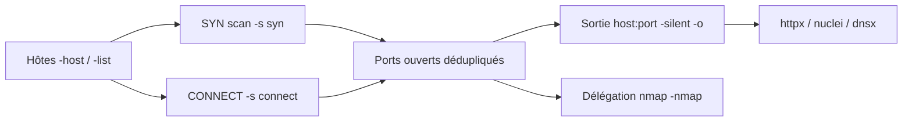

# 🚪 naabu — Scanner de ports rapide intégré au pipeline

> [!info] **En 1 phrase**
> naabu scan les ports de milliers d'hôtes en quelques secondes et alimente directement httpx, nuclei et nmap.

---

## 🧾 Overview

| Champ | Valeur |
|---|---|
| Nom complet | naabu |
| Description | Scanner de ports TCP/UDP écrit en Go : SYN scan parallélisé (ou CONNECT), sortie `host:port` prête pour les pipelines (httpx, nuclei, dnsx, nmap) |
| Catégorie | Reconnaissance & OSINT |
| Sous-catégorie | Scan & Énumération |
| Fonction principale | Découverte rapide des ports ouverts sur de grandes listes d'hôtes |
| Type d'outil | CLI (binaire unique, `go install` / releases / Docker) |
| Licence | MIT (dépôt rellicencié depuis GPL-3.0 ; historique GPL-3.0 sur les anciennes versions) |
| Open source / propriétaire | Open source |
| Langage(s) de programmation | Go |
| Développeur / organisation | ProjectDiscovery |
| Projet officiel | https://projectdiscovery.io |
| Dépôt officiel | https://github.com/projectdiscovery/naabu |
| Documentation officielle | https://docs.projectdiscovery.io/tools/naabu/usage |
| Date de création | 2020 (premières releases publiques) |
| État du projet | actif |
| Dernière version connue | 2.6.1 (2026-05-05) |
| Systèmes compatibles | Linux, Windows (SYN scan via Npcap depuis v2.6.0), macOS, Docker, FreeBSD |

> [!note] Pour vérifier / compléter
> La branche `dev` contient les fonctionnalités en cours ; privilégier les releases stables GitHub ou l'image Docker taggée. Le scan SYN sous Windows a été ajouté en v2.6.0 (nécessite Npcap).

---

## 🎯 Concept

naabu est le scanner de ports de la suite **ProjectDiscovery**. Il est pensé comme le maillon de vitesse entre l'énumération de sous-domaines et le probing HTTP : en entrée des hôtes, IP, ranges ou listes (`-list`), en sortie une liste `host:port` dédupliquée directement consommable par `httpx`, `nuclei` ou `dnsx` sans parsing intermédiaire. Son mode SYN scan envoie des probes par paquets bruts (nécessite root sous Linux) avec un **taux de paquets/s réglable** (`-rate`) et des **workers internes** (`-c`), ce qui le rend capable de couvrir de grandes portées en quelques secondes ; sans privilèges, il bascule sur un **TCP connect scan** (`-s connect`), plus lent mais sans droits root.

Position dans un engagement : après `subfinder` (sous-domaines) et avant le probing HTTP, il complète la cartographie de la surface d'attaque au-delà des ports web. Sa valeur ajoutée principale est la **chaîne d'outils** : contrairement à Nmap, naabu est un binaire unique, sans dépendance externe (hors `libpcap` pour le SYN sous Linux), avec sortie **JSON/CSV/markdown** native et options de **déduplication** (`-exclude-ports`, `-exclude-hosts`, exclusion CDN). Depuis v2.5/v2.6, il intègre la détection de version de service optionnelle (`-sv`), un mode **UDP** (`-s udp`) et le support SYN sur Windows via Npcap.

Le mode `-nmap` permet de **déléguer l'analyse fine à Nmap** (`-nmap-cli "-sV -sC"`) sur les seuls ports ouverts : c'est le compromis rapidité/profondeur pour un grand périmètre. naabu se distingue aussi par son SDK Go (import en tant que bibliothèque) et son intégration native au cloud ProjectDiscovery (`-pd`) pour l'upload de résultats vers un dashboard partagé.



---

## 🧠 Concepts fondamentaux

| Concept | Explication |
|---|---|
| SYN scan (`-s syn`) | Envoie un paquet SYN ; un SYN-ACK indique un port ouvert, RST un port fermé, rien un port filtré. Semi-ouvert, discret, nécessite root et `libpcap` sous Linux, Npcap sous Windows |
| CONNECT scan (`-s connect`) | Complète le 3-way handshake via l'API sockets. Sans root, plus bruyant (les connexions complètes apparaissent dans les logs applicatifs) |
| UDP scan (`-s udp`) | Datagrammes UDP ; ICMP Port Unreachable = fermé, réponse UDP = ouvert. Lent, utile pour SNMP (161), DNS (53), NTP (123) |
| `-rate` | Nombre de probes par seconde (défaut 1000). Limite le débit pour éviter de saturer la cible et le réseau |
| `-c` (threads) | Nombre de goroutines/workers parallèles (défaut 25). Un `-c` élevé accélère mais augmente le bruit |
| `-top-ports N` | Scan des N ports les plus fréquents (base de fréquences ProjectDiscovery) ; `-p` accepte `80,443,100-200`, `-p all` pour les 65 535 |
| Déduplication | `-exclude-ports`, `-exclude-hosts`, exclusion automatique des IP CDN (`-exclude-cdn`) |
| Délégation Nmap | `-nmap` + `-nmap-cli "-sV -sC"` : naabu découvre, Nmap approfondit uniquement les ports ouverts |
| Découverte d'hôte | L'énumération des cibles passe par le DNS (résolution) ; `-dns-order` (v2.6+) contrôle l'ordre de résolution système/proxy |
| ProjectDiscovery Cloud | `-pd` / `-auth` : upload des résultats vers un dashboard cloud partagé (opt-in) |

---

## 🛠️ Installation

### Debian / Ubuntu / Kali Linux

```bash
# via Go (nécessite libpcap pour le SYN scan)
sudo apt install -y libpcap-dev
go install -v github.com/projectdiscovery/naabu/v2/cmd/naabu@latest
export PATH=$PATH:$(go env GOPATH)/bin

# ou binaire précompilé depuis les releases
# wget https://github.com/projectdiscovery/naabu/releases/download/v2.6.1/naabu_2.6.1_linux_amd64.zip
# unzip naabu_2.6.1_linux_amd64.zip && sudo mv naabu /usr/local/bin/
```

### Arch Linux

```bash
# via l'AUR (paquet naabu)
yay -S naabu
# ou via Go
go install -v github.com/projectdiscovery/naabu/v2/cmd/naabu@latest
```

### Fedora / RHEL

```bash
sudo dnf install -y libpcap-devel golang
go install -v github.com/projectdiscovery/naabu/v2/cmd/naabu@latest
```

### macOS

```bash
# Homebrew (paquet maintenu par la communauté)
brew install naabu
# ou via Go (libpcap : brew install libpcap)
go install -v github.com/projectdiscovery/naabu/v2/cmd/naabu@latest
```

### Windows

```powershell
# Binaire ZIP depuis les releases GitHub ; SYN scan nécessite Npcap (npcap.com)
# wget/Invoke-WebRequest du zip, puis ajouter naabu.exe au PATH
# Mode CONNECT sans Npcap :
naabu -host example.com -s connect
```

### Docker

```bash
docker pull projectdiscovery/naabu:latest
docker run --rm projectdiscovery/naabu -host example.com
# SYN scan dans le conteneur (requiert le mode privilégié / host network pour les paquets bruts)
docker run --rm --network host projectdiscovery/naabu -host example.com
```

### Compilation depuis les sources

```bash
git clone https://github.com/projectdiscovery/naabu && cd naabu/cmd/naabu
go build .
sudo mv naabu /usr/local/bin/
naabu -version
```

> [!warning] ⚠️ Prérequis & problèmes potentiels
> - Le **SYN scan** (`-s syn`, défaut) nécessite **root** sous Linux et le paquet `libpcap` ; sans root, naabu bascule en CONNECT (`-s connect`).
> - Windows : Npcap requis pour les paquets bruts (depuis v2.6.0).
> - Si `naabu` n'est pas trouvé après `go install`, vérifier que `$(go env GOPATH)/bin` est dans le `PATH`.

---

## ⚙️ Configuration

naabu ne lit **pas** de fichier de configuration global obligatoire : tout se passe par flags CLI, mais il accepte aussi un **fichier de ports** et des **listes d'hôtes** en entrée, et une **config YAML ProjectDiscovery** (`$HOME/.config/pd/`) pour le cloud.

| Paramètre | Rôle | Valeur possible | Impact | Exemple |
|---|---|---|---|---|
| `-list <fichier>` | Fichier de cibles (une par ligne : domaine, IP, CIDR) | Chemin de fichier | Définit le périmètre scanné | `naabu -list hosts.txt` |
| `-p` | Ports à scanner | `80,443`, `1-1000`, `-p all`, fichier via `@file` | Plus c'est large, plus c'est long | `naabu -p 80,443,8080` |
| `-top-ports N` | Scan des N ports les plus fréquents | Entier (défaut 100) | Compromis couverture/temps | `naabu -top-ports 1000` |
| `-rate N` | Probes par seconde | Entier (défaut 1000) | Réduire pour la discrétion, augmenter pour la vitesse | `naabu -rate 5000` |
| `-c N` | Workers internes (goroutines) | Entier (défaut 25) | Augmenter le parallélisme | `naabu -c 100` |
| `-retries N` | Tentatives par probe | Entier (défaut 3) | Plus de retries = moins de faux négatifs | `naabu -retries 5` |
| `-timeout ms` | Timeout par port en millisecondes | Entier (défaut 1000) | Valeurs basses sur réseau lent = faux négatifs | `naabu -timeout 2000` |
| `-s <mode>` | Type de scan | `syn` (défaut), `connect`, `udp` | Choisit le moteur d'envoi | `naabu -s connect` |
| `-exclude-ports` | Ports exclus du scan | `22,3389`, ranges | Réduit le bruit et la durée | `naabu -exclude-ports 22` |
| `-exclude-hosts` | Hôtes exclus | IP ou CIDR | Évite des cibles hors scope | `naabu -exclude-hosts 10.0.0.1` |
| `-nmap-cli` | Commande Nmap déléguée | Chaîne d'arguments | Profondeur sur les ports découverts | `naabu -nmap -nmap-cli "-sV -sC"` |
| `-o` / `-json` | Fichier de sortie / JSONL | Chemin de fichier | Format exploitable en pipeline | `naabu -json -o scan.jsonl` |

> [!note] À vérifier
> Le fichier de config YAML concerne l'authentification ProjectDiscovery Cloud (`-auth`, `-auth-config`), pas la configuration du scan lui-même. En cas de doute sur un flag, `naabu -h` reste la référence.

---

## 🏗️ Architecture interne

naabu est un **binaire Go unique** organisé en packages (`cmd/naabu` pour le CLI, `pkg/runner` pour l'orchestration, `pkg/scan` pour le moteur réseau) :

- **Parseur d'entrées** : expansion des domaines (résolution DNS), CIDR, plages, listes ; déduplication des IP et des ports.
- **Moteur de scan** : à v2.6.0, naabu est devenu **cgo-free** ; le paquet `gopacket` gère l'envoi/réception des paquets bruts. Deux modes : envoi SYN par sockets raw + écoute asynchrone des réponses (mode `syn`), ou connexions complètes via la pile TCP du système (mode `connect`).
- **Pipeline de débit** : `-rate` impose un limiteur de débit (packets/s), `-c` pilote le nombre de goroutines, `-retries`/`-timeout` gèrent la fiabilité.
- **Sorties** : écriture texte, JSONL, CSV, markdown, et invocation de `nmap` en sous-processus (`-nmap`).
- **Options réseau** : `-source-ip`, `-interface`, `-proxy` (HTTP/SOCKS5, y compris pour la résolution DNS depuis v2.6.0 avec `-dns-order`).

Le flux : cibles → résolution → envoi des probes au taux configuré → corrélation des réponses → déduplication → sortie (stdout/fichier/nmap/cloud).

---

## ⌨️ Commandes

### Commandes principales

```bash
naabu -host example.com -top-ports 100
sudo naabu -host 192.168.1.0/24 -p 80,443,8080,8443
naabu -list hosts.txt -top-ports 1000 -silent -o ports.txt
sudo naabu -host example.com -p 1-1000 -nmap -nmap-cli "-sV"
sudo naabu -host example.com -p 80,443 -exclude-ports 22 -rate 1000 -json -o scan.json
```

| Commande | Objectif | Résultat attendu |
|---|---|---|
| `naabu -host example.com` | Scan SYN des 100 top-ports (défaut) | Liste `host:port` des ports ouverts |
| `naabu -host example.com -p all` | Scan des 65 535 ports TCP | Couverture complète |
| `naabu -list hosts.txt -top-ports 1000 -silent -o ports.txt` | Scan de masse silencieux | Fichier `host:port` prêt pour httpx |
| `sudo naabu -host cible -nmap -nmap-cli "-sV -sC"` | Délégation de l'analyse à Nmap | Versions et scripts NSE sur ports ouverts |
| `naabu -host cible -s connect` | Scan CONNECT sans root | Ports ouverts sans privilèges |
| `naabu -host cible -s udp -p 53,161,123` | Scan UDP ciblé | Ports UDP ouverts (DNS/SNMP/NTP) |

### Commandes avancées

```bash
# Scan massif avec contrôle du débit et statistiques
sudo naabu -list all_hosts.txt -p 1-65535 -rate 5000 -c 100 -stats -json -o full_scan.json

# Pipeline complet : sous-domaines → ports → probing HTTP
subfinder -d example.com -all -silent | dnsx -silent | sudo naabu -top-ports 1000 -silent | httpx -sc -title -td -silent

# Exclusion CDN + sortie CSV pour analyse
sudo naabu -host example.com -top-ports 1000 -exclude-cdn -csv -o scan.csv

# Détection de version de service intégrée (v2.5+)
sudo naabu -host example.com -p 80,443 -sv
```

---

## 🎚️ Options et flags

| Option | Description | Exemple | Niveau |
|---|---|---|---|
| `-host <hôte>` | Hôte cible (domaine, IP, CIDR) | `naabu -host example.com` | Basic |
| `-list <fichier>` | Liste de cibles depuis un fichier | `naabu -list hosts.txt` | Basic |
| `-p <ports>` | Ports à scanner | `naabu -p 80,443` | Basic |
| `-top-ports <N>` | Top N ports les plus fréquents | `naabu -top-ports 1000` | Basic |
| `-silent` | Sortie épurée `host:port` | `naabu -silent` | Basic |
| `-o <fichier>` | Écriture de la sortie dans un fichier | `naabu -o out.txt` | Basic |
| `-json` / `-oJ` | Sortie JSONL (stdout ou fichier) | `naabu -json` | Intermediate |
| `-csv` / `-md` | Sortie CSV / markdown | `naabu -csv -o out.csv` | Intermediate |
| `-rate <N>` | Probes par seconde | `naabu -rate 5000` | Intermediate |
| `-c <N>` | Workers internes (threads) | `naabu -c 100` | Intermediate |
| `-retries <N>` | Tentatives par probe | `naabu -retries 5` | Intermediate |
| `-timeout <ms>` | Timeout de connexion (ms) | `naabu -timeout 2000` | Intermediate |
| `-s <mode>` | Mode de scan `syn`/`connect`/`udp` | `naabu -s connect` | Intermediate |
| `-exclude-ports` | Ports exclus | `naabu -exclude-ports 22,3389` | Advanced |
| `-exclude-hosts` | Hôtes exclus | `naabu -exclude-hosts 10.0.0.1` | Advanced |
| `-exclude-cdn` | Ignore les IP CDN connues | `naabu -exclude-cdn` | Advanced |
| `-verify` | Re-vérifie les ports par connexion TCP | `naabu -verify` | Advanced |
| `-nmap` | Déclenche Nmap sur les ports trouvés | `naabu -nmap` | Advanced |
| `-nmap-cli "<args>"` | Arguments Nmap | `naabu -nmap-cli "-sV -sC"` | Advanced |
| `-sv` | Détection de version de service (v2.5+) | `naabu -p 80,443 -sv` | Advanced |
| `-proxy <url>` | Proxy HTTP/SOCKS5 | `naabu -proxy http://127.0.0.1:8080` | Expert |
| `-source-ip <ip>` | IP source pour les probes | `naabu -source-ip 10.10.14.5` | Expert |
| `-interface <name>` | Interface réseau utilisée | `naabu -interface eth0` | Expert |
| `-stats` | Statistiques en cours de scan | `naabu -stats` | Expert |
| `-pd` / `-auth` | Upload vers ProjectDiscovery Cloud | `naabu -pd` | Expert |

> [!tip] Options les plus utiles au quotidien
> `-top-ports 1000` (couverture raisonnable), `-silent -o ports.txt` (sortie pipeline), `-nmap -nmap-cli "-sV -sC"` (profondeur), `-exclude-ports`/`-exclude-hosts` (conformité de scope), `-rate` (ne pas faire tomber la cible).

---

## 🧪 Exemples pratiques

### Beginner

```bash
# Scanner les 100 ports les plus courants d'un domaine
naabu -host example.com

# Scanner des ports précis sur une IP
naabu -host 10.10.10.10 -p 22,80,443
```

### Intermediate

```bash
# Scan de masse silencieux d'une liste d'hôtes, sauvegarde en fichier
naabu -list hosts.txt -top-ports 1000 -silent -o ports.txt

# Détection de version des services sur les ports web
sudo naabu -host example.com -p 80,443,8080 -sv
```

### Advanced

```bash
# Scan complet d'un périmètre avec débit maîtrisé et sortie JSON
sudo naabu -list all_hosts.txt -p 1-65535 -rate 5000 -c 100 -stats -json -o full_scan.json

# Délégation à Nmap pour les services critiques
sudo naabu -host example.com -top-ports 1000 -nmap -nmap-cli "-sV -sC"
```

### Expert

```bash
# Scan via proxy SOCKS5 + résolution DNS via le proxy (v2.6+)
naabu -host example.com -proxy socks5://127.0.0.1:9050 -s connect

# Scan UDP ciblé des services d'administration
sudo naabu -host 10.10.10.10 -s udp -p 53,123,161,500,623

# Exclusion CDN pour ne garder que l'infra d'origine
sudo naabu -host example.com -top-ports 1000 -exclude-cdn -verify -json -o infra.json
```

---

## 🧪 Workflow complet (scénario pas à pas)

1. **Préparer les hôtes** — énumération passive des sous-domaines, validation des noms résolvants.
   ```bash
   subfinder -d example.com -all -silent | dnsx -silent -o hosts.txt
   ```
2. **Scanner les ports** — passe large avec les top-ports, sortie silencieuse.
   ```bash
   sudo naabu -list hosts.txt -top-ports 1000 -silent -o ports.txt
   ```
3. **Identifier les services web** — probing HTTP sur les `host:port` trouvés.
   ```bash
   cat ports.txt | httpx -sc -title -td -silent
   ```
4. **Détecter les versions** — délégation Nmap sur les ports ouverts.
   ```bash
   sudo naabu -list hosts.txt -top-ports 1000 -nmap -nmap-cli "-sV -sC" -o nmap_results.txt
   ```
5. **Scanner les vulnérabilités** — nuclei sur les hôtes vivants.
   ```bash
   cat ports.txt | nuclei -severity high,critical
   ```

Astuce de cadence : commence par `-top-ports 100` sur l'ensemble, puis approfondis les hôtes intéressants avec `-p all` et `-nmap-cli "-sV -sC"`. Cela limite le bruit tout en garantissant une couverture ciblée.

---

## 🎬 Scénarios avancés

### Scénario 1 : scan massif d'un périmètre réseau

```bash
sudo naabu -list all_hosts.txt -p 1-65535 -rate 5000 -c 100 -stats -json -o full_scan.json
```

Puis exploitation du JSON pour trier les ports ouverts par hôte et prioriser le probing HTTP.

### Scénario 2 : pipeline complet sous-domaines → ports → web

```bash
subfinder -d example.com -all -silent \
  | dnsx -silent \
  | sudo naabu -top-ports 1000 -silent \
  | httpx -sc -title -td -silent
```

### Scénario 3 : scan furtif en mode CONNECT (sans root) via proxy

```bash
naabu -host example.com -top-ports 100 -s connect -proxy socks5://127.0.0.1:9050
```

---

## 🛡️ Cybersecurity use cases

| Phase | Utilisation |
|---|---|
| Reconnaissance | Cartographie rapide de la surface réseau d'une organisation (périmètres IP, listes de sous-domaines) |
| Énumération | Découverte des ports ouverts, préparation des cibles pour httpx/nuclei |
| Énumération | Scan UDP des services d'administration (SNMP, DNS, NTP) |
| Vulnérabilité | Chaînage avec nuclei pour ne scanner que les services réellement ouverts |
| Bug bounty | Respect des taux : `-rate` et `-c` limitent l'impact réseau déclaré par les plateformes |

---

## 🎯 MITRE ATT&CK

| Tactique | Technique / Sub-technique | ID | Raison | Détection | Mitigation |
|---|---|---|---|---|---|
| Discovery | Network Service Discovery | T1046 | naabu sonde les ports TCP/UDP des hôtes pour lister les services ouverts | Surge de SYN entrants, connexions multi-ports ; IDS/IPS rate-limit | Firewall stateful, segmentation, rate-limiting |
| Reconnaissance | Active Scanning : Scanning IP Blocks | T1595.001 | `-list` + CIDR balaient des blocs d'IP entiers | Corrélation des adresses sources et des patterns de probes | Blacklist sources, rate-limit par IP |
| Discovery | System Network Configuration Discovery | T1016 | La résolution DNS et l'énumération d'hôtes cartographient le réseau | Requêtes DNS anormales en volume | Résolveurs restreints, monitoring DNS |

> [!note] Ne renseigner que si l'association est réellement pertinente.
> La technique T1046 est l'usage principal de naabu ; les détections doivent se concentrer sur le volume de probes SYN (T1595.001).

---

## 🛡️ Defensive Security

### Signes observables

| Indicateur | Détail |
|---|---|
| Half-open scan | Rafales de SYN sans ACK final (mode `syn`, volume potentiellement très élevé avec `-rate`) |
| Connexions CONNECT multiples | Handshakes TCP complets vers de nombreux ports successifs (mode `connect`) |
| Ports aléatoires balayés | Couverture `-p all` sur un grand périmètre depuis une même source |
| Requêtes UDP | Datagrammes UDP vers 53, 123, 161 (scan UDP) |
| Pattern de scan répété | Balayages réguliers depuis la même IP = signature de reconnaissance active |

### Règles de détection (Sigma / Suricata / Snort / YARA)

```yaml
# Sigma — Linux : exécution d'outils de scan réseau (nmap/naabu/masscan)
# Source : SigmaHQ — proc_creation_lnx_susp_network_utilities_execution (id 3e102cd9-a70d-4a7a-9508-403963092f31)
title: Linux Network Service Scanning Tools Execution
id: 3e102cd9-a70d-4a7a-9508-403963092f31
status: test
logsource:
    category: process_creation
    product: linux
detection:
    selection_network_scanning_tools:
        Image|endswith:
            - '/naabu'
            - '/nmap'
            - '/masscan'
            - '/hping3'
    condition: selection_network_scanning_tools
falsepositives:
    - Legitimate administrative usage
level: medium
```

```bash
# Suricata/Snort — détection du SYN scan massif (port scan detector / sfportscan)
# Snort : préprocesseur sfportscan
preprocessor sfportscan: proto both \
    memcap 10000000 \
    sense_level high \
    watch_ip 10.10.10.0/24

# Suricata — exemple de règle de volume SYN
alert tcp any any -> $HOME_NET any \
    (msg:"Potential portscan from naabu-style scanner"; \
     flags:S; \
     threshold: type both, track by_src, count 500, seconds 60; \
     classtype:attempted-recon; sid:1000001; rev:1;)
```

> [!note] À vérifier
> Les règles de volume doivent être calibrées sur votre réseau pour limiter les faux positifs (seuils count/seconds à adapter). La règle Suricata est un exemple pédagogique.

---

## 🤖 Automatisation

```bash
# Bash — pipeline sous-domaines → ports → probing HTTP → fichiers
subfinder -d example.com -all -silent | dnsx -silent | \
  sudo naabu -top-ports 1000 -silent -json -o ports.jsonl
cat ports.jsonl | jq -r '"\(.host):\(.port)"' | httpx -sc -silent -o live.txt
```

```python
# Python — utilisation du SDK Go non disponible en Python ; passer par le JSONL
import json

with open("scan.jsonl") as fh:
    hosts = {}
    for line in fh:
        line = line.strip()
        if not line:
            continue
        entry = json.loads(line)
        hosts.setdefault(entry["host"], []).append(entry["port"])
    for host, ports in sorted(hosts.items()):
        print(f"{host}: {','.join(map(str, sorted(ports)))}")
```

---

## 📤 Output et parsing

Formats natifs : texte `host:port` (`-silent`), JSONL (`-json` / `-oJ`), CSV (`-csv`), markdown (`-md`), sortie fichier (`-o`). Le format texte est directement consommable par httpx/nuclei.

```bash
# Extraire uniquement les ports ouverts d'un JSONL
naabu -list hosts.txt -top-ports 1000 -json | jq -r 'select(.port | type == "number") | "\(.host):\(.port)"'

# Compter les ports ouverts par hôte depuis un CSV
naabu -list hosts.txt -top-ports 1000 -csv -o scan.csv
cut -d',' -f1 scan.csv | sort | uniq -c
```

```python
# Python — parsing JSONL en pandas
import pandas as pd

df = pd.read_json("scan.jsonl", lines=True)
print(df.groupby("host")["port"].apply(list))
```

---

## 🔗 Intégrations

- [[Tools|🧰 Outils]] global
- [[Outil - subfinder]] — énumération de sous-domaines en amont
- [[Outil - dnsx]] — validation des hôtes qui résolvent
- [[Outil - httpx]] — probing HTTP sur les `host:port` découverts
- [[Outil - nuclei]] — scan de vulnérabilités des services ouverts
- [[Outil - Nmap]] — délégation de l'analyse fine (`-nmap-cli "-sV -sC"`)
- [[Outil - RustScan]] / [[Outil - Masscan]] — scanners de ports alternatifs
- ProjectDiscovery Cloud (`-pd`) — dashboard partagé des résultats

```text
subfinder → dnsx → naabu → httpx → nuclei → rapport
```

---

## 🔄 Alternatives

| Outil | Avantages | Inconvénients | Cas d'usage |
|---|---|---|---|
| Nmap | NSE, détection de versions/OS, référence absolue | Lent sur les grandes portées, binaire avec dépendances | Analyse fine d'une cible identifiée |
| RustScan | 65 535 ports en quelques secondes, délégation Nmap intégrée | Pas de scan UDP, moins de flags de réglage | Phase initiale très rapide |
| Masscan | Plusieurs centaines de milliers de paquets/s, TCP/UDP | Pas d'énumération de services, sorties brutes | Scan Internet / très grands CIDR |
| hping3 | Crafting de paquets, scan furtif, tests d'évasion | Pas de pipeline d'outils, usage manuel | Tests d'évasion ciblés |

> **Quand utiliser naabu plutôt que Nmap ?** Pour des milliers d'hôtes : naabu donne la liste `host:port` en quelques secondes avec sortie JSON native, puis Nmap prend le relais sur les seuls ports ouverts (`-nmap`). Pour une machine unique, Nmap direct reste plus complet (`-sC -sV -O`).

---

## ⚡ Performance

- Débit contrôlé par `-rate` (défaut **1000 probes/s**, ajustable) et parallélisme par `-c` (défaut **25 workers**).
- `-top-ports 1000` couvre l'essentiel des services exposés en un temps raisonnable ; `-p all` (65 535) est réservé aux cibles prioritaires.
- En v2.6.0, le passage **cgo-free** améliore la portabilité et réduit la latence d'initialisation ; le warm-up auto optimise les premières millisecondes.
- Mode `-verify` ajoute une passe de confirmation en connexion TCP sur les ports trouvés (plus lent mais plus fiable).

> [!note] À vérifier
> Les durées réelles dépendent du réseau, de la cible et du débit ; les chiffres exacts varient. La v2.3.4 avait connu une régression de performance corrigée en v2.3.5/v2.6.x — privilégier les dernières releases.

---

## 🛠️ Troubleshooting

### Common problems

#### Problème : « Running CONNECT scan with non root privileges »

- **Cause** : le SYN scan nécessite root (sockets raw) ; sans `sudo`, naabu bascule automatiquement en CONNECT.
- **Solution** : lancer avec `sudo` pour le SYN, ou assumer le mode CONNECT (`-s connect`). **Vérification** : `sudo naabu -host 127.0.0.1 -s syn`.

#### Problème : ports connus non détectés

- **Cause** : firewall silencieux, `-timeout` trop bas, `-retries` insuffisant, ou CDN/WAF en frontal.
- **Solution** : augmenter `-retries`/`-timeout`, baisser `-rate`, ajouter `-exclude-cdn` si pertinent. **Vérification** : `naabu -host cible -p 80 -retries 5 -timeout 2000 -v`.

#### Problème : « No valid ipv4 or ipv6 targets »

- **Cause** : les hôtes ne résolvent pas (DNS) ou la plage est invalide ; message d'erreur de routage connu sur les versions 2.3.2/2.3.3.
- **Solution** : vérifier la résolution avec `dnsx -silent`, mettre à jour naabu, préciser `-r 8.8.8.8` si besoin. **Vérification** : `naabu -host example.com -version`.

#### Problème : erreur « too many open files » sur gros scan

- **Cause** : limite de descripteurs de fichiers système atteinte (mode CONNECT).
- **Solution** : augmenter `ulimit -n` (ex. `ulimit -n 65535`) avant le scan. **Vérification** : `ulimit -n`.

---

## 🔐 Sécurité de l'outil

- **Permission** : le SYN scan nécessite root ; à n'utiliser que sur des cibles autorisées (cadre légal des tests d'intrusion, scope bug bounty).
- **Bruit** : `-rate 5000` sur un grand périmètre génère un volume très visible (IDS, SIEM) ; en engagement réel, rester modéré et coordonner.
- **Débit** : scanner sans limitation peut saturer la cible (DoS involontaire) — toujours contraindre `-rate` et `-c`.
- **Cloud** : les options `-pd`/`-auth` envoient vos cibles vers ProjectDiscovery Cloud ; ne les activer que si le partage est accepté par le client.
- **Proxy** : en environnement où le scan direct est interdit, router via `-proxy` et l'adapter aux règles de sortie.

---

## ⚠️ Limitations

- Le SYN scan sous Linux nécessite **root** ; Windows nécessite **Npcap**.
- Détection de versions limitée sans Nmap : `-sv` couvre un sous-ensemble de services.
- Scan UDP (`-s udp`) lent : réserver aux ports critiques (53, 123, 161).
- Pas de scripts NSE ni de détection OS : c'est un découvreur de ports, pas un scanner complet.
- Les IP derrière CDN/WAF donnent des faux résultats si l'exclusion CDN n'est pas activée.
- Firewalls silencieux : un port filtré peut apparaître fermé malgré le service actif.

---

## 📋 Cheatsheet

```bash
# Scan par défaut (100 top-ports)
naabu -host example.com

# Scan de ports précis ou d'une plage
naabu -host 10.10.10.10 -p 80,443,8080,8443
naabu -host 10.10.10.10 -p 1-1000

# Scan de masse silencieux
naabu -list hosts.txt -top-ports 1000 -silent -o ports.txt

# Délégation à Nmap sur les ports ouverts
sudo naabu -host example.com -top-ports 1000 -nmap -nmap-cli "-sV -sC"

# Scan UDP ciblé
sudo naabu -host 10.10.10.10 -s udp -p 53,161,123

# Sortie JSON pour pipeline
naabu -list hosts.txt -top-ports 1000 -json -o scan.jsonl

# Contrôle du débit et du parallélisme
sudo naabu -list hosts.txt -p all -rate 5000 -c 100 -stats

# Vérification des ports par connexion TCP
naabu -host example.com -verify
```

---

## ⚡ Quick reference

| | |
|---|---|
| **À quoi sert-il ?** | Découvrir les ports ouverts de milliers d'hôtes en quelques secondes |
| **Quand l'utiliser ?** | Entre l'énumération de sous-domaines et le probing HTTP/web |
| **Commande principale** | `sudo naabu -list hosts.txt -top-ports 1000 -silent -o ports.txt` |
| **Alternative principale** | Nmap (analyse fine), RustScan / Masscan (découverte rapide) |
| **Concepts importants** | SYN scan, `-rate`, `-c`, `-top-ports`, sortie `host:port`, délégation Nmap |
| **Liens associés** | [[Outil - dnsx]] · [[Outil - httpx]] · [[Outil - Nmap]] · [[Outil - nuclei]] |

---

## 🔍 Détection & Défense

| Signe | Défense |
|---|---|
| Flood de SYN sans ACK final (half-open scan) | IDS/IPS (Suricata, Snort), règles de détection de SYN scan, préprocesseur `sfportscan` |
| Balayage systématique des top-ports | Firewall stateful, rate-limiting par IP source, blacklist des sources récurrentes |
| Connexions CONNECT sur de nombreux ports | Honeypots sur ports ouverts, monitoring des logs de connexion |
| Volume élevé vers des ports aléatoires | Corrélation des flux (NetFlow/Zeek), alerting IDS/IPS |
| Requêtes DNS en rafale (résolution de masse) | Rate-limiting sur les résolveurs, surveillance des query flood |
| Services découverts puis profilés (nmap/httpx) | Réduire la surface : aucun service inutile exposé, segmentation |

---

## ⚠️ Tips & Pièges

> [!tip] 💡 **Tips**
> - `-top-ports 1000` couvre l'essentiel en un temps raisonnable ; `-p all` est réservé aux cibles prioritaires.
> - En bug bounty, respecte le rate limit annoncé : `-rate` et `-c` sont tes freins.
> - La sortie `host:port` est directement consommable par httpx/nuclei : aucun parsing nécessaire.
> - Pour rejouer un scan identique, conserve la commande exacte : les options `-p`, `-top-ports` et `-exclude-ports` changent complètement le résultat.

> [!warning] ⚠️ **Pièges**
> - Le scan SYN nécessite root sous Linux ; sans root, `-s connect` est obligatoire (et plus bruyant).
> - Un firewall peut filtrer silencieusement : augmente `-retries`/`-timeout` et vérifie avec `-verify`.
> - `-p 1-65535` sur tout un périmètre sans coordination est bruyant et long : évite, ou limite avec `-rate`.
> - Ne pas oublier l'exclusion CDN (`-exclude-cdn`) : les résultats peuvent pointer vers un WAF et non l'infra réelle.

---

## 📚 References

### Official

- Dépôt officiel : https://github.com/projectdiscovery/naabu
- Documentation officielle (usage) : https://docs.projectdiscovery.io/tools/naabu/usage
- Releases : https://github.com/projectdiscovery/naabu/releases
- Site ProjectDiscovery : https://projectdiscovery.io

### Security references

- MITRE ATT&CK T1046 — Network Service Discovery : https://attack.mitre.org/techniques/T1046/
- MITRE ATT&CK T1595 — Active Scanning : https://attack.mitre.org/techniques/T1595/
- SigmaHQ — proc_creation_lnx_susp_network_utilities_execution : https://github.com/SigmaHQ/sigma/blob/master/rules/linux/process_creation/proc_creation_lnx_susp_network_utilities_execution.yml

### Community

- ProjectDiscovery Discord : https://discord.gg/projectdiscovery
- HackTricks — port scanning (naabu) : https://book.hacktricks.xyz/network-services-pentesting
- Write-up de performance naabu 2.3.5 (issue #1374) : https://github.com/projectdiscovery/naabu/issues/1374

---

➡️ **Liens :** [[Tools|🧰 Outils]] · [[Outil - dnsx|dnsx]] · [[Outil - httpx|httpx]] · [[Outil - Nmap|Nmap]] · [[Outil - nuclei|nuclei]]
