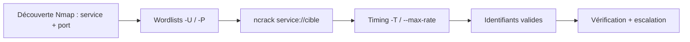
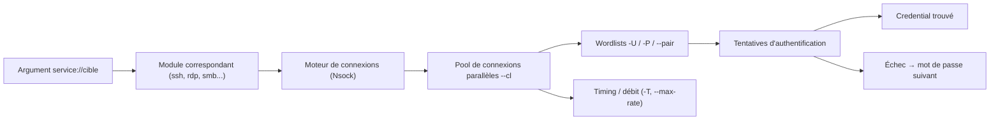

# ncrack — Exploitation & Cracking

> [!info] **En 1 phrase**
> ncrack est l'outil de cracking réseau haute vitesse de la suite Nmap : il brute-force les authentifications de services (SSH, RDP, HTTP, SMB, FTP, VNC...) en exploitant des connexions concurrentes par hôte.

---

## Overview

| Champ | Valeur |
|---|---|
| Nom complet | ncrack — Network Authentication Cracker |
| Description | Brute-force en ligne haute vitesse des services d'authentification, issu de la suite Nmap, avec connexions concurrentes par hôte et contrôles de débit fins |
| Catégorie | Exploitation & Cracking |
| Sous-catégorie | Brute-force / credential stuffing en ligne |
| Fonction principale | Tester des combinaisons utilisateur/mot de passe sur des services distants (SSH, RDP, HTTP, SMB, FTP, VNC...) |
| Type d'outil | CLI (C/C++, modèle Nmap) |
| Licence | GPLv2 |
| Open source / propriétaire | Open source |
| Langage(s) de programmation | C/C++ (moteur réseau Nsock de Nmap) |
| Développeur / organisation | Projet Nmap — mainteneur principal `ithilgore`, contributions communauté Nmap |
| Projet officiel | nmap/ncrack |
| Dépôt officiel | https://github.com/nmap/ncrack |
| Documentation officielle | https://nmap.org/ncrack/man.html |
| Date de création | 2009 (premier commit, développé au sein du projet Nmap) |
| État du projet | maintenu (dernière release stable 0.7) |
| Dernière version connue | 0.7 (24 août 2019) |
| Systèmes compatibles | Linux / Windows / macOS / BSD |

> [!note] Pour vérifier / compléter
> Champs laissés vides si l'information n'est pas confirmée par une source officielle.

---

## Concept

ncrack (Network Authentication Cracker) fait partie de la suite Nmap. Contrairement à hydra, il a été conçu pour **monter en charge** : il ouvre plusieurs connexions simultanées vers le même hôte pour différents mots de passe, ce qui le rend très rapide sur les services qui autorisent les connexions parallèles. Les services supportés incluent RDP, SSH, HTTP/HTTPS, SMB, FTP, Telnet, VNC, POP3, IMAP et bien d'autres (MySQL, MongoDB, Wordpress, DICOM, MQTT, CVS, SMB2...).

Il dispose de **timing templates** (`-T0` à `-T5`) et de contrôles de débit (`--min-rate`/`--max-rate`) pour adapter la vitesse à la tolérance de la cible (et à ses politiques de verrouillage de comptes). Il fait partie du flux classique : on découvre un service exposé avec Nmap, on identifie les utilisateurs/identifiants, puis on brute-force proprement. Il s'utilise **en dernier recours** sur des périmètres autorisés, quand le password spraying ou les fuites (`--pair`) ont déjà été testés.



---

## Concepts fondamentaux

| Concept | Explication |
|---|---|
| **Brute-force en ligne (online)** | Chaque tentative est une vraie connexion au service (SSH, RDP...) : contrairement au cracking hors-ligne (hashcat), on ne casse pas un hash mais on teste des identifiants réels sur un service vivant |
| **Connexions parallèles par hôte** | ncrack peut ouvrir plusieurs connexions vers le même hôte simultanément (`--cl`), chaque connexion testant un mot de passe différent : c'est la clé de sa vitesse sur RDP/SMB |
| **Timing templates (-T0 à -T5)** | Profils de vitesse hérités de Nmap : Paranoid (T0), Sneaky (T1), Polite (T2), Normal (T3), Aggressive (T4), Insane (T5) — plus agressif = plus rapide mais plus bruyant |
| **--min-rate / --max-rate** | Bornes du nombre de tentatives par seconde, pour rester sous le seuil de verrouillage de comptes (account lockout policy) |
| **Credential stuffing (--pair)** | Réutiliser des couples `user:pass` issus d'une fuite au lieu de croiser deux wordlists : très efficace quand la politique impose des mots de passe longs |
| **Politique de verrouillage de comptes** | Règle AD/SSH qui bloque un compte après N échecs : elle conditionne totalement le débit acceptable (ou l'abandon du brute-force pur) |
| **Module de service** | Chaque protocole (`ssh`, `rdp`, `smb`, `http`, `vnc`...) a son propre module d'authentification, avec des options spécifiques (ex. `rdp://` + `-s` pour le protocole RDP) |
| **Randomisation (-r)** | Par défaut ncrack randomise l'ordre des tentatives pour compliquer la détection IDS ; `-r` la désactive pour des reprises déterministes |

---

## Installation

### Debian / Ubuntu / Kali Linux

```bash
sudo apt update && sudo apt install -y ncrack
```

### Arch Linux

```bash
sudo pacman -S ncrack
```

### Fedora / RHEL

```bash
sudo dnf install ncrack
```

### macOS

```bash
brew install ncrack
```

### Windows

```powershell
# Binaires Windows disponibles dans la section Releases du dépôt GitHub
# ou via choco :
choco install ncrack
```

### Compilation depuis les sources

```bash
git clone https://github.com/nmap/ncrack.git && cd ncrack
./configure && make && sudo make install
```

> [!warning] Prérequis & problèmes potentiels
> - La compilation nécessite OpenSSL (headers de dev) et le moteur Nsock fourni dans le dépôt.
> - ncrack est conçu pour les **systèmes Unix** ; le support Windows via releases binaires est fonctionnel mais moins testé.
> - Pour les formats les plus récents ou des protocoles exotiques, vérifier la présence du module dans `ncrack -h`.

---

## Configuration

ncrack se pilote **exclusivement par options de ligne de commande** : aucun fichier de configuration ni variable d'environnement. Le principal « réglage » est la spécification de service, qui définit le module et le port par défaut.

| Paramètre | Rôle | Valeur possible | Impact | Exemple |
|---|---|---|---|---|
| `service://cible` | Module + cible (le port par défaut du service est utilisé) | `ssh://`, `rdp://`, `http://`, `https://`, `smb://`, `ftp://`, `telnet://`, `vnc://`, `imap://`, `pop3://`... | Définit le protocole testé et son port par défaut (22, 3389, 80, 443, 445, 21, 23, 5900, 143, 110) | `ncrack -U u.txt -P p.txt ssh://10.10.20.15` |
| `--port <n>` | Forcer le port (service sur port non standard) | numéro de port | Teste le service sur un port déplacé | `ncrack ... http://10.10.20.15 --port 8080` |
| `-T0` … `-T5` | Template de timing | Paranoid → Insane | Vitesse globale et discrétion | `ncrack ... ssh://10.10.20.15 -T3` |
| `--min-rate` / `--max-rate` | Débit min/max de tentatives/s | nombre entier | Reste sous le seuil de lockout | `ncrack ... rdp://10.10.20.15 --max-rate 3` |
| `--cl <n>` | Nombre de connexions parallèles par hôte | nombre entier | Plus de parallélisme, plus de charge | `ncrack ... ssh://10.10.20.15 --cl 5` |
| `-r` | Désactiver la randomisation | flag | Ordre déterministe (reprise prévisible) | `ncrack ... ssh://10.10.20.15 -r` |
| `--at <t>` / `--timeout <t>` | Timeout d'authentification / de connexion | millisecondes | Évite les attentes sur services lents | `ncrack ... vnc://10.10.20.15 --at 8000` |
| `--ns <n>` / `--nsock-engine <engine>` | Tuning des sockets Nsock (concurrence) | n / `epoll`, `kqueue`... | Réglages avancés de la pile réseau | `ncrack ... ssh://10.10.20.15 --ns 100` |

---

## Architecture interne

ncrack est écrit en C/C++ et repose sur **Nsock**, la bibliothèque réseau événementielle de Nmap. Chaque service disposé derrière un **module** implémente son propre protocole d'authentification et ses options spécifiques.



| Composant | Rôle |
|---|---|
| `ncrack` (binaire) | Orchestrateur : parsing des options, démarrage des threads, rapport final |
| Modules de service | `ssh`, `rdp`, `http`/`https`, `smb`, `ftp`, `telnet`, `vnc`, `imap`, `pop3`, `mysql`, `mongodb`, `wordpress`, `dicom`, `mqtt`, `cvs`, `smb2` — chacun gère le handshake et la détection de succès |
| Nsock | Pile réseau non bloquante de Nmap : gère des milliers de sockets en parallèle sans consommer un thread par connexion |
| Pool de connexions | `--cl` contrôle le nombre de connexions simultanées par hôte ; les tentatives sont réparties entre elles |
| Rapporteur | Sorties texte (`-oN`), XML (`-oX`) et « service + creds » en fin d'exécution |

À l'exécution : pour chaque cible, ncrack crée un pool de connexions vers le port du service, alimente chaque connexion avec un couple `user:pass` issu du produit cartésien des wordlists (ou de `--pair`), détecte le succès via le message d'authentification du module, et affiche les identifiants valides en temps réel avec la directive `Discovered credentials`.

---

## Commandes

### Commandes principales

```bash
ncrack -U users.txt -P pass.txt ssh://10.10.20.15
```

| Commande | Objectif | Résultat attendu |
|---|---|---|
| `ncrack -U users.txt -P pass.txt ssh://10.10.20.15` | Brute-force SSH avec listes d'utilisateurs et de mots de passe | Affiche `Discovered credentials` pour les couples valides |
| `ncrack -u admin -P pass.txt rdp://10.10.20.15` | RDP avec utilisateur unique | Teste admin contre tous les mots de passe |
| `ncrack -U users.txt -P pass.txt -iL hôtes.txt https:// --port 443` | Multi-cibles à partir d'un fichier, service précis | Brute-force HTTPS sur plusieurs hôtes |
| `ncrack --pair creds.txt smb://10.10.20.15` | Paires `user:pass` (credential stuffing) sur SMB | Vérifie les identifiants d'une fuite |
| `ncrack -U users.txt -P pass.txt rdp://10.10.20.15 --max-rate 3 -v` | Limiter le débit pour ne pas verrouiller les comptes | Tentatives espacées, moins bruyant |
| `ncrack -U users.txt -P pass.txt -oX rapport.xml ssh://10.10.20.15` | Sortie XML | Rapport exploitable (xpath, intégration Nmap) |

### Commandes avancées

```bash
# Plusieurs services en une seule commande (croisement du même jeu de wordlists)
ncrack -U users.txt -P pass.txt ssh://10.10.20.15 rdp://10.10.20.15 smb://10.10.20.15 -T3

# Cibles multiples + débit global borné + verbosité
ncrack -U users.txt -P pass.txt -iL hosts.txt rdp:// --min-rate 1 --max-rate 2 -v

# RDP avec protocole précis et timeout d'authentification
ncrack -u admin -P pass.txt rdp://10.10.20.15 -s rdp -at 10000

# Reprise déterministe sans randomisation
ncrack -U users.txt -P pass.txt ssh://10.10.20.15 -r -oN resume.log
```

---

## Options et flags

| Option | Description | Exemple | Niveau |
|---|---|---|---|
| `-U <fichier>` | Liste d'utilisateurs à tester | `ncrack -U users.txt -P pass.txt ssh://10.10.20.15` | Basic |
| `-P <fichier>` | Liste de mots de passe à tester | `ncrack -U users.txt -P pass.txt ssh://10.10.20.15` | Basic |
| `-u <user>` | Utilisateur unique (avec `-P`) | `ncrack -u admin -P pass.txt rdp://10.10.20.15` | Basic |
| `-p <pass>` | Mot de passe unique (avec `-U`) | `ncrack -U users.txt -p hiver2026 ssh://10.10.20.15` | Basic |
| `service://cible` | Module + cible (port par défaut) | `ncrack ... vnc://10.10.20.15` | Basic |
| `-iL <fichier>` | Liste de cibles (hostnames/IPs) | `ncrack -U u.txt -P p.txt -iL hosts.txt ssh://` | Intermediate |
| `-m <module>` | Force le module de service | `ncrack -m ssh -U u.txt -P p.txt 10.10.20.15` | Intermediate |
| `--port <n>` | Force le port (si non standard) | `ncrack ... http://10.10.20.15 --port 8080` | Intermediate |
| `--pair <fichier>` | Combinaisons `user:pass` prédéfinies | `ncrack --pair creds.txt smb://10.10.20.15` | Intermediate |
| `-T0` … `-T5` | Templates de timing (lent → agressif) | `ncrack ... ssh://10.10.20.15 -T4` | Intermediate |
| `--min-rate` / `--max-rate` | Débit minimal/maximal de tentatives/s | `ncrack ... rdp://10.10.20.15 --max-rate 3` | Intermediate |
| `-f` | Timing rapide (équivalent `-T4`+) | `ncrack ... smb://10.10.20.15 -f` | Advanced |
| `--cl <n>` | Nombre de connexions parallèles par hôte | `ncrack ... ssh://10.10.20.15 --cl 5` | Advanced |
| `--at <ms>` / `--timeout <ms>` | Timeout par authentification / connexion | `ncrack ... vnc://10.10.20.15 --at 8000` | Advanced |
| `--ns <n>` / `--nsock-engine <e>` | Tuning des sockets (concurrence) | `ncrack ... ssh://10.10.20.15 --ns 200` | Expert |
| `-r` | Désactive la randomisation des tentatives | `ncrack ... ssh://10.10.20.15 -r` | Expert |
| `-oN <fichier>` | Sortie au format texte normal | `ncrack ... ssh://10.10.20.15 -oN rapport.txt` | Basic |
| `-oX <fichier>` | Sortie XML (intégrable au rapport Nmap) | `ncrack ... ssh://10.10.20.15 -oX rapport.xml` | Intermediate |
| `-v` / `-vv` | Mode verbeux / très verbeux | `ncrack ... ssh://10.10.20.15 -vv` | Basic |
| `-h` | Aide complète (liste les modules disponibles) | `ncrack -h` | Basic |

> [!tip] Options les plus utiles au quotidien
> - `-U` / `-P` : le duo de base pour croiser utilisateurs et mots de passe.
> - `--max-rate` : le garde-fou anti-verrouillage, quasi systématique en engagement.
> - `--cl` : à augmenter pour les services qui tolèrent le parallélisme (RDP, SMB), à limiter sur SSH.
> - `-oX` : sortie XML pour intégrer les résultats au rapport d'audit.
> - `-v` : indispensable pour voir les identifiants trouvés au fil de l'eau.

---

## Exemples pratiques

### Beginner

```bash
# Objectif : brute-force SSH simple
ncrack -U users.txt -P pass.txt ssh://10.10.20.15
```

Résultat attendu : au fil des tentatives, la sortie liste les services testés puis affiche `Discovered credentials for ssh://10.10.20.15 ... admin:hiver2026`. Erreur possible : « Connection refused » si le service/port est mal ciblé — recouper avec Nmap (`-sV`).

```bash
# Objectif : utilisateur unique, liste de mots de passe
ncrack -u admin -P pass.txt rdp://10.10.20.15
```

### Intermediate

```bash
# Objectif : limiter le débit pour éviter le verrouillage des comptes
ncrack -U users.txt -P pass.txt rdp://10.10.20.15 --max-rate 3 -v
```

```bash
# Objectif : credential stuffing depuis une fuite
ncrack --pair creds.txt smb://10.10.20.15 -T3
```

### Advanced

```bash
# Objectif : plusieurs services sur le même hôte avec un timing contrôlé
ncrack -U users.txt -P pass.txt ssh://10.10.20.15 rdp://10.10.20.15 smb://10.10.20.15 -T3 -v -oX audit.xml
```

```bash
# Objectif : parc de cibles, un mot de passe par service, débit minimal
ncrack -U users.txt -p hiver2026 -iL hosts.txt rdp:// --min-rate 1 --max-rate 2
```

### Expert

```bash
# Objectif : réglage fin du parallélisme socket + timeout adapté
ncrack -U users.txt -P pass.txt ssh://10.10.20.15 --cl 8 --ns 300 --at 15000 -vv

# Objectif : reprise déterministe après interruption
ncrack -U users.txt -P pass.txt ssh://10.10.20.15 -r -oN /tmp/etape1.txt
ncrack -U users.txt -P pass.txt ssh://10.10.20.15 -r -oN /tmp/etape2.txt
```

---

## Workflow complet (scénario pas à pas)

1. **Reconnaissance** — identifier le service et le port avec Nmap :
   ```bash
   nmap -sV -p- 10.10.20.15
   ```
2. **Construire les wordlists** — utilisateurs issus de l'énumération (OSINT, fichiers du site, conventions de nommage) dans `users.txt`, mots de passe selon la politique locale (mots de passe par défaut, fuites réutilisées) dans `pass.txt`.
3. **Test de verrouillage** — vérifier la politique de verrouillage de comptes avant de lancer : une forte politique rend le brute-force long/inutile.
4. **Lancer ncrack avec un timing prudent** :
   ```bash
   ncrack -U users.txt -P pass.txt rdp://10.10.20.15 --max-rate 3 -v
   ```
5. **Vérifier les identifiants trouvés** — ncrack affiche `Cracking host ...` puis `Discovered credentials` : tester sur le service concerné (connexion RDP/SSH/SMB).
6. **Étendre** — les identifiants validés servent ensuite pour le **password spraying** à plus large échelle ou l'escalade (SMB, RDP...) :
   ```bash
   # Exemple : exploitation SMB avec les identifiants validés
   crackmapexec smb 10.10.20.30 -u admin -p 'hiver2026' --shares
   ```

---

## Scénarios avancés

### Scénario 1 : RDP sur un parc avec timing contrôlé

```bash
ncrack -U users.txt -P pass.txt -iL targets.txt rdp:// --min-rate 1 --max-rate 2 -v
```

Rester très lent pour ne pas déclencher les verrouillages de comptes du domaine.

### Scénario 2 : Credential stuffing SMB depuis une fuite

```bash
# creds.txt : lignes "domaine\user:password"
ncrack --pair creds.txt smb://10.10.20.15 -T3
```

Teste rapidement si des identifiants d'une fuite sont toujours valides sur le réseau cible.

### Scénario 3 : Augmenter la concurrence sur SSH

```bash
# SSH tolère rarement beaucoup de connexions : --cl limite le parallélisme
ncrack -U users.txt -P pass.txt ssh://10.10.20.15 --cl 5 -T3 -v
```

Ajuster `--cl` évite les timeouts et les faux négatifs sur les services fragiles.

### Scénario 4 : Bruteforce HTTP Basic sur un port non standard

```bash
ncrack -U users.txt -P pass.txt http://10.10.20.15 --port 8080 -T3
```

---

## Cybersecurity use cases

ncrack intervient dans la phase **exploitation / Credential Access** : il transforme une liste de services exposés en liste d'identifiants valides.

| Phase | Utilisation |
|---|---|
| Reconnaissance | Peu pertinent (ncrack a besoin de connaître le service exact) |
| Énumération | Préparation : récupérer les noms d'utilisateurs (OSINT, énumération SMB/AD) |
| Exploitation | Brute-force / credential stuffing sur les services exposés (SSH, RDP, SMB...) |
| Post-exploitation | Réutilisation des identifiants sur d'autres services (lateral movement) |
| Cracking / Credential Access | Obtention d'identifiants valides via attaque en ligne |
| Reporting | Preuve de mots de passe faibles, de comptes par défaut, d'absence de lockout |

```text
Nmap (-sV) → ncrack (SSH/RDP/SMB) → Identifiants valides → crackmapexec / RDP / SSH
```

---

## MITRE ATT&CK

| Tactique | Technique / Sub-technique | ID | Raison | Détection | Mitigation |
|---|---|---|---|---|---|
| Credential Access | Brute Force: Password Guessing | T1110.001 | Tentatives de connexion répétées contre des services exposés avec des couples user/pass | Logs d'authentification (Auth.log, Event ID 4625), corrélation SIEM des échecs depuis une même IP, fail2ban | Politique de verrouillage de comptes, MFA, rate limiting, mots de passe robustes |
| Credential Access | Brute Force: Password Spraying | T1110.003 | Un seul mot de passe courant testé sur de nombreux comptes (timing prudent) | Alertes sur les pics d'échecs répartis, analyse des schémas de connexion | MFA, surveillance des échecs non bloqués, alertes SIEM sur les mass-échecs |
| Credential Access | Brute Force: Credential Stuffing | T1110.004 | Réutilisation de couples `user:pass` de fuites via `--pair` | Corrélation avec les fuites connues (haveibeenpwned), alertes sur connexions avec identifiants réutilisés | MFA, rotation après fuite, détection des identifiants compromis |
| Lateral Movement | Remote Services | T1021.001 / T1021.002 | Les identifiants obtenus sont ensuite réutilisés sur RDP (3389) ou SMB (445) | Logs RDP/SMB, Event ID 4624/4625, alertes sur les connexions réussies depuis des hôtes inattendus | Segmentation réseau, MFA pour l'accès distant, restriction RDP |

> [!note] Ne renseigner que si l'association est réellement pertinente.

---

## Defensive Security

Contrairement au cracking hors-ligne, ncrack est **bruyant et détectable** : chaque tentative est une connexion réelle qui laisse des traces dans les logs du service et de l'OS.

### Signes observables

| Indicateur | Détail |
|---|---|
| Rafales de connexions depuis une même IP | Visible dans les logs SSH (`auth.log`), RDP (Event ID 4625), SMB (Event ID 4625) |
| Nombreux échecs d'authentification sur un même compte | Politique de verrouillage (Account Lockout) ou alertes SIEM |
| Volume de connexions TCP élevé vers un seul service | Corrélation par flow analysis (Zeek, NetFlow) |
| Taux d'échecs anormalement haut vs connexions réussies | Ratio suspect dans les logs d'authentification |
| Schéma de tentatives randomisées (ordre non alphabétique) | Indicateur de ncrack sans `-r` |

### Règles de détection (Sigma / Suricata / Snort / YARA)

```yaml
# Exemple Sigma : pic d'échecs d'authentification SSH depuis une même source
title: SSH Brute Force - Multiple Failed Authentications
id: 5a1b2c3d-4e5f-4a6b-8c9d-0e1f2a3b4c5d
status: experimental
logsource:
    product: linux
    service: sshd
detection:
    selection:
        event: Authentication failure
        src_ip: '*'
    condition: selection | count() by src_ip > 20 within 5m
falsepositives:
    - Scripts de supervision légitimes
    - IP sources partagées (NAT)
level: high
```

```bash
# Exemple Suricata/Snort : rafale de connexions TCP vers le port 22
alert tcp any any -> any 22 (msg:"Potential SSH brute force - many connections from same host"; flags:S; threshold:type both, track by_src, count 50, seconds 60; sid:2026002; rev:1;)
```

---

## Automatisation

```bash
# Lancer ncrack sur plusieurs cibles et n'afficher que les identifiants trouvés
for host in $(cat hosts.txt); do
  echo "== $host =="
  ncrack -U users.txt -P pass.txt "ssh://$host" -T3 -v 2>/dev/null | grep -i "Discovered credentials" && echo "$host" >> touches.txt
done
```

```bash
# Post-traitement : extraire les couples identifiants du fichier texte de sortie
ncrack -U users.txt -P pass.txt ssh://10.10.20.15 -oN out.txt
grep -E "Discovered credentials" out.txt | awk '{print $NF}' | tr ':' '\n'
```

```python
# Orchestration en Python : subprocess + parsing XML
import subprocess, xml.etree.ElementTree as ET

subprocess.run(["ncrack", "-U", "users.txt", "-P", "pass.txt",
                "ssh://10.10.20.15", "-oX", "out.xml"], check=True)
root = ET.parse("out.xml").getroot()
for service in root.iter("service"):
    print(service.get("name"), service.get("host"),
          service.get("user"), service.get("password"))
```

---

## Output et parsing

La sortie par défaut est **humaine** : progression par service (`Cracking host ...`), puis à la fin la ligne `Discovered credentials for <service>://<cible> <user>:<pass>`. Deux formats exploitables sont disponibles : texte normal (`-oN`) et **XML** (`-oX`).

```bash
# Extraire les identifiants trouvés depuis la sortie verbeuse
ncrack -U users.txt -P pass.txt ssh://10.10.20.15 -v 2>&1 | grep "Discovered credentials"

# Parser la sortie XML
ncrack -U users.txt -P pass.txt ssh://10.10.20.15 -oX audit.xml
xmllint --xpath '//service[@name="ssh"]/@user|//service[@name="ssh"]/@password' audit.xml
```

```python
# Parsing XML en Python
import xml.etree.ElementTree as ET

root = ET.parse("audit.xml").getroot()
creds = [(s.get("host"), s.get("user"), s.get("password"))
         for s in root.iter("service") if s.get("password")]
print(creds)
```

> [!note] Formats disponibles
> `-oN` (texte), `-oX` (XML), sortie verbeuse `-v`. Pas de JSON natif : pour de l'ingestion JSON, convertir le XML (ex. `xq` / jq sur la sortie XML) ou parser les lignes `Discovered credentials`.

---

## Intégrations

```text
Nmap -sV → ncrack (SSH/RDP/SMB) → Identifiants → crackmapexec / Evil-WinRM / RDP → Lateral Movement
```

- [[Tools| Outils]] — catalogue des outils du vault
- [[Outils/Outil - hydra|hydra]] — alternative brute-force multi-protocoles
- [[Outil - Medusa|Medusa]] — alternative parallelisée par modules
- [[Outil - Patator|Patator]] — brute-force/fuzzing hautement customisable
- [[Outil - Nmap|Nmap]] — le découvreur de services qui alimente ncrack (`-sV`)
- [[Outil - CrackMapExec|CrackMapExec]] — exploitation SMB des identifiants validés
- [[Outil - Evil-WinRM|Evil-WinRM]] — accès WinRM avec les identifiants trouvés
- [[Techniques/Password Cracking|Password Cracking]] — chaîne complète de cracking
- [[Techniques/Password Spraying|Password Spraying]] — approche complémentaire à faible volume

---

## Alternatives

| Outil | Avantages | Inconvénients | Cas d'usage |
|---|---|---|---|
| [[Outils/Outil - hydra|hydra]] | Très grand nombre de protocoles, très mature | Parallélisme par processus, moins fin sur la concurrence par hôte | Protocoles exotiques non couverts par ncrack |
| [[Outil - Medusa|Medusa]] | Parallélisme massif par threads, modules, `-M` | Moins d'options réseau fines, communauté plus restreinte | Brute-force multi-modules à haut débit |
| [[Outil - Patator|Patator]] | Conditions de réussite personnalisables (`-x`), scripting sans prompt | Courbe d'apprentissage, moins « prêt à l'emploi » | Fuzzing et brute-force custom |
| Crowbar | Spécialisé clés SSH et RDP | Moins polyvalent | Tests de clés privées SSH (non couverts par ncrack) |
| CrackMapExec | Intégré à l'écosystème AD (SMB, WinRM, LDAP) | Pas un brute-forceur généraliste | Validation d'identifiants sur le domaine |

> **Quand utiliser ncrack plutôt qu'hydra ?** Quand la cible tolère les connexions parallèles (RDP, SMB) et qu'on veut le contrôle fin du débit (`--min-rate`/`--max-rate`, `--cl`) hérité de l'écosystème Nmap. Hydra garde l'avantage sur le nombre de protocoles.

---

## Performance

- **Concurrence par hôte** : `--cl` ouvre plusieurs connexions simultanées vers le même service — c'est ce qui rend ncrack nettement plus rapide que les outils séquentiels sur RDP/SMB.
- **Moteur Nsock** : pile événementielle non bloquante, capable de gérer des milliers de sockets sans un thread par connexion.
- **Timing templates** : `-T0` (paranoid) à `-T5` (insane) ajustent le débit global ; `--max-rate` borne strictement les tentatives par seconde.
- **Limites réelles** : le débit est borné par la **tolérance du service** (verrouillage de comptes), la **latence réseau** et les **limitations RDP** (nombre de sessions simultanées). Un débit trop élevé produit des timeouts et des faux négatifs.
- **Consommation** : CPU/mémoire modestes (piles Nsock légères) ; la charge se déplace sur le réseau et la cible.

---

## Troubleshooting

### Common problems

#### Problème : « Connection refused » / aucune tentative

- **Cause** : mauvais service ou port pour la cible (`http://` sur un service qui n'écoute pas).
- **Solution** : identifier le vrai service avec `nmap -sV` puis utiliser la bonne spécification (`ssh://`, `rdp://`...) et `--port` si non standard.
- **Vérification** : `nmap -sV -p- 10.10.20.15`.

#### Problème : les tentatives échouent en masse sur RDP

- **Cause** : les serveurs RDP limitent le nombre de connexions/sessions simultanées ; trop de parallélisme → timeouts.
- **Solution** : réduire `--cl`, augmenter `--at` (timeout d'authentification), baisser le template (`-T2`/`-T3`).
- **Vérification** : `ncrack -u admin -P pass.txt rdp://10.10.20.15 --cl 3 -T2 -v`.

#### Problème : comptes verrouillés pendant l'engagement

- **Cause** : débit trop élevé au regard de la politique de verrouillage.
- **Solution** : baisser `--max-rate` (ex. 1-3/s), ou passer en password spraying (`-U` + un mot de passe par compte), ou abandonner le brute-force pur.
- **Vérification** : vérifier la GPO Account Lockout côté AD avant de lancer.

#### Problème : un module manque pour un protocole exotique

- **Cause** : ncrack couvre moins de protocoles que hydra.
- **Solution** : basculer sur `hydra` ou `medusa` pour ce service ; vérifier la liste avec `ncrack -h`.
- **Vérification** : `ncrack -h | grep -i "<proto>"`.

#### Problème : erreur OpenSSL / compilation

- **Cause** : headers OpenSSL absents ou version incompatible.
- **Solution** : installer `libssl-dev` (Debian) / `openssl-devel` (RHEL) avant `./configure && make`.
- **Vérification** : `./configure` se termine sans erreur, puis `make`.

---

## Sécurité de l'outil

- **Outil très bruyant** : chaque tentative est une connexion réelle — logs du service, logs système, IDS/IPS. Toute utilisation en ligne déclenche des alertes quasi certaines.
- **Risque de DoS** : un débit mal réglé verrouille des comptes et peut paralyser un service (en particulier RDP) — c'est une forme de déni de service involontaire.
- **Autorisation** : brute-forcer un service sans mandat écrit (scope signé) est illégal et détectable ; ncrack doit être réservé aux engagements autorisés et aux labos.
- **Secrets en clair** : les wordlists et les identifiants trouvés transitent en clair dans les commandes (historique shell) et les fichiers de sortie — éviter `-oN` avec des données ultra-sensibles partagées.
- **Randomisation** : `-r` désactivée rend les tentatives déterministes (plus faciles à anticiper/logger) ; la randomisation par défaut complique la détection IDS mais ne doit pas être vue comme un anonymat.

---

## Limitations

- **Modules moins nombreux que hydra** : pas de support de tous les protocoles exotiques ; vérifier `ncrack -h`.
- **Bruyant** : conçu pour la vitesse, pas pour la furtivité ; la randomisation ne cache pas le volume.
- **RDP contraint** : les serveurs RDP limitent les connexions simultanées — les gros débits créent des faux négatifs.
- **Verrouillage de comptes** : inutilisable si la politique de verrouillage est stricte (sauf password spraying très lent).
- **Pas d'API JSON** : sorties texte/XML uniquement.
- **Version stable datée (0.7, 2019)** : les évolutions sont lentes depuis ; certains protocoles récents ou variantes de services peuvent manquer.
- **Pas de cracking hors-ligne** : ncrack ne casse pas les hashes — pour cela, hashcat/john.

---

## Cheatsheet

```bash
# Brute-force SSH classique
ncrack -U users.txt -P pass.txt ssh://10.10.20.15

# Utilisateur unique sur RDP
ncrack -u admin -P pass.txt rdp://10.10.20.15

# Multi-cibles + service précis + port forcé
ncrack -U users.txt -P pass.txt -iL hosts.txt https:// --port 443

# Credential stuffing (paires user:pass)
ncrack --pair creds.txt smb://10.10.20.15

# Timing prudent pour éviter le verrouillage
ncrack -U users.txt -P pass.txt rdp://10.10.20.15 --max-rate 3 -v

# Contrôle du parallélisme par hôte (SSH)
ncrack -U users.txt -P pass.txt ssh://10.10.20.15 --cl 5 -T3

# Sortie XML pour rapport Nmap
ncrack -U users.txt -P pass.txt ssh://10.10.20.15 -oX audit.xml

# Extraire les identifiants trouvés
ncrack -U users.txt -P pass.txt ssh://10.10.20.15 -v 2>&1 | grep "Discovered credentials"
```

---

## Quick reference

| | |
|---|---|
| **À quoi sert-il ?** | Brute-force en ligne des authentifications de services (SSH, RDP, SMB, HTTP, FTP, VNC...) avec connexions concurrentes |
| **Quand l'utiliser ?** | Après découverte du service (Nmap), quand les identifiants par défaut/fuites sont épuisés et la politique de verrouillage tolérante |
| **Commande principale** | `ncrack -U users.txt -P pass.txt ssh://10.10.20.15` |
| **Alternative principale** | [[Outils/Outil - hydra|hydra]] (plus de protocoles) ou [[Outil - Medusa|Medusa]] (parallélisme) |
| **Concepts importants** | Connexions parallèles (`--cl`), timing templates, `--max-rate`, credential stuffing (`--pair`), modules de service |
| **Liens associés** | [[Outil - Nmap|Nmap]], [[Outils/Outil - hydra|hydra]], [[Outil - Medusa|Medusa]], [[Outil - Patator|Patator]], [[Outil - CrackMapExec|CrackMapExec]], [[Techniques/Password Spraying|Password Spraying]] |

---

## Détection & Défense

| Signe | Défense |
|---|---|
| Rafales de connexions depuis une même IP | Rate limiting, règles fail2ban/IDS sur les échecs d'authentification |
| Nombreux échecs de connexion sur un compte | Politique de verrouillage de comptes (Account Lockout) |
| Mot de passe par défaut ou faible encore actif | Politique de mots de passe stricte + tests réguliers |
| Connexions RDP/SMB multiples parallèles | Surveillance des logs d'authentification, alertes sur les pics |
| Rejeu d'identifiants de fuite | MFA obligatoire, rotation des mots de passe après fuite |
| Accès SSH exposé sur Internet | Restriction par IP, clés SSH au lieu des mots de passe, fail2ban, SSO/MFA |

---

## Tips & Pièges

> [!tip] **Tips**
> - Combine ncrack avec la sortie de **Nmap** (`-sV`) pour cibler le bon service et le bon port, sinon les tentatives échouent inutilement.
> - En engagement, préfère un **timing prudent** (`--max-rate`) et vérifie d'abord la politique de verrouillage : un compte bloqué peut ruiner la discrétion.
> - Utilise `--pair` pour les **credential stuffing** (fuites de mots de passe) : c'est beaucoup plus efficace qu'un brute-force pur.
> - `-oX` permet d'intégrer les résultats au rapport XML global d'un audit Nmap.
> - Pense à `--cl` : monte-le sur RDP/SMB (parallélisme) et baisse-le sur SSH (services fragiles).

> [!warning] **Pièges**
> - `-T5`/`-f` peut **déclencher les verrouillages de comptes** et provoquer un DoS d'authentification sur la cible — à éviter hors lab.
> - Les modules sont moins nombreux que chez hydra : pour des protocoles exotiques, préfère `hydra` ou `medusa`.
> - Sur RDP, certaines cibles limitent les connexions simultanées : un débit trop élevé fait échouer les tentatives en masse (faux négatifs).
> - Sans `-r`, ncrack randomise l'ordre des tentatives : utile contre les IDS, mais rend l'arrêt/reprise moins prévisible.
> - Un compte verrouillé (même pour un autre service) peut bloquer l'accès légitime de l'équipe : coordonne-toi avant de lancer.

---

## References

### Official

- Site officiel : https://nmap.org/ncrack/
- Manuel officiel : https://nmap.org/ncrack/man.html
- Dépôt officiel : https://github.com/nmap/ncrack

### Security references

- MITRE ATT&CK — Brute Force (T1110) : https://attack.mitre.org/techniques/T1110/
- MITRE ATT&CK — Credential Stuffing (T1110.004) : https://attack.mitre.org/techniques/T1110/004/
- OWASP — Authentication Cheat Sheet : https://cheatsheetseries.owasp.org/cheatsheets/Authentication_Cheat_Sheet.html
- NIST SP 800-63B — Authenticator Management : https://pages.nist.gov/800-63-3/sp800-63b.html

### Community

- Blog officiel Nmap (annonce ncrack 0.7) : https://nmap.org/
- Guide d'utilisation Nmap Network Scanning (référence) : https://nmap.org/book/
- Articles/hands-on sur les labos TryHackMe/HackTheBox relatifs au brute-force SSH/RDP

---

**Liens :** [[Tools| Outils]] · [[Techniques/Password Cracking|Password Cracking]] · [[Techniques/Password Spraying|Password Spraying]] · [[Outils/Outil - hydra|hydra]] · [[Outil - Medusa|Medusa]] · [[Outil - Patator|Patator]] · [[Outil - Nmap|Nmap]] · [[Outil - CrackMapExec|CrackMapExec]]
