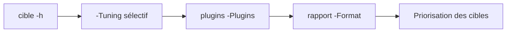

# 🔍 nikto — Scanner de serveurs web (Perl)

> [!info] **En 1 phrase**
> nikto est un scanner de serveurs web ancien mais efficace pour détecter fichiers dangereux, versions obsolètes et misconfigurations.

---

## 🧾 Overview

| Champ | Valeur |
|---|---|
| Nom complet | nikto |
| Description | Scanner de serveurs web qui teste fichiers dangereux, CGIs, versions obsolètes, mauvaises configurations SSL et méthodes HTTP — via une base de signatures (8000+ checks) |
| Catégorie | 🔍 Scan Web & Fuzzing |
| Sous-catégorie | Scanner de serveurs web / énumération de fichiers |
| Fonction principale | Détecter les problèmes de configuration et les fichiers exposés d'un serveur web |
| Type d'outil | CLI (Perl) |
| Licence | GPL-3.0 pour le code ; la base de tests est distribuée avec une licence séparée |
| Open source / propriétaire | Open source |
| Langage(s) de programmation | Perl |
| Développeur / organisation | Chris Sullo (cirt.net), David Lodge |
| Projet officiel | https://cirt.net/Nikto2 |
| Dépôt officiel | https://github.com/sullo/nikto |
| Documentation | https://github.com/sullo/nikto/wiki |
| Version actuelle | 2.6.1 (juillet 2026) |
| Date de sortie initiale | Décembre 2001 |
| Créé par | Chris Sullo |
| Dépendances principales | Perl 5, Net::SSLeay, IO::Socket::SSL, LWP::UserAgent |
| Pré-installé sur | Kali Linux, Parrot OS, BlackArch |

---

## 🎯 Concept

nikto existe depuis le début des années 2000 et reste utile pour son approche large : il teste le serveur web, les logiciels identifiés, les fichiers par défaut et les chemins dangereux (backups, fichiers d'installation, CGIs). Sa base de tests `program/databases/db_tests` recense des milliers de checks. Il est écrit en Perl et fonctionne sans dépendance lourde, ce qui le rend simple à déployer sur n'importe quel poste.

Moins complet et plus bruyant que nuclei, il sert de premier balayage rapide. Les options `-Tuning` (catégories de tests) et `-Plugins` (listes de tests ciblées) permettent d'affiner son usage. Sa sortie se génère en HTML, JSON, CSV, SQL, XML ou texte pour le rapport. En pentest, il se place en **début de phase d'énumération web** : on le lance en parallèle de gobuster/ffuf, ses résultats alimentent la priorisation des répertoires à exploiter.



---

## 🧠 Concepts fondamentaux

- **Scanning de signatures** : nikto envoie des milliers de requêtes HTTP et compare les réponses à sa base de tests (chemins, en-têtes, versions, messages d'erreur).
- **Détection de la page 404** : pour éviter les faux positifs, nikto identifie d'abord la « vraie » page d'erreur 404 du serveur et ignore les réponses qui lui ressemblent.
- **Catégories de tuning** : chaque test appartient à une catégorie (fichier intéressant, misconfiguration, information disclosure, injection, DoS, SQLi, etc.) numérotée de 0 à e.
- **DSL de matchers (nouveau en 2.6.0)** : les tests peuvent matcher sur `BODY:`, `HEADER:`, `COOKIE:` et `CODE:` (présence/absence), combinables avec `&&`.
- **Plugins** : nikto est modulaire — les plugins (`report_*`, `update`, `favicon`, etc.) s'énumèrent avec `-list-plugins` et se sélectionnent avec `-Plugins`.
- **Modes d'évasion** : 10 techniques d'encodage d'URL et de formatage de requête pour passer les IDS/WAF.
- **Modes de mutation (`-mutate`)** : deviner des noms de fichiers supplémentaires à partir des fichiers existants, des mots de passe, des utilisateurs Apache/cgiwrap, des sous-domaines ou d'un dictionnaire.
- **Intégration Nmap** : nikto peut détecter les ports web ouverts via Nmap s'il est disponible.

---

## 🛠️ Installation

```bash
# Debian / Ubuntu / Kali
sudo apt update && sudo apt install -y nikto

# macOS
brew install nikto

# Depuis git (dernière version, exécution en Perl direct)
git clone https://github.com/sullo/nikto.git
cd nikto/program
./nikto.pl -h http://10.10.10.10
# ou, si le bit d'exécution manque
perl nikto.pl -h http://10.10.10.10

# Docker (image officielle ghcr.io)
docker pull ghcr.io/sullo/nikto:latest
docker run --rm ghcr.io/sullo/nikto:latest -h http://10.10.10.10

# Docker avec rapport persistant sur l'hôte
docker run --rm -v $(pwd):/tmp ghcr.io/sullo/nikto:latest \
  -h http://10.10.10.10 -o /tmp/rapport.json -Format json

# Windows
# Recommandé : WSL2 (modules SSL Perl fragiles en natif) ou Docker
# Alternative native : Strawberry Perl + cpan install Net::SSLeay IO::Socket::SSL LWP::UserAgent
```

> [!tip] Vérifier la version
> `nikto -Version` affiche les versions du code, des plugins et des bases de données.

---

## ⚙️ Configuration

### Variables de configuration (`program/nikto.conf`)

| Variable | Rôle |
|---|---|
| `USERAGENT` | User-Agent par défaut (généralement « Mozilla 5.0 » stylisé) |
| `TIMEOUT` | Délai par requête (secondes) |
| `EVASION` | Technique d'évasion par défaut |
| `EXCLUDE` | Chemins à exclure (expressions régulières) |
| `DEFAULTPORTS` | Ports à tester si aucune valeur n'est fournie |
| `CLIENTCERTS` | Certificat client TLS |
| `PROXYPORT` / `PROXY` | Proxy par défaut pour `-useproxy` |
| `NIKTO_DB_USER` / `NIKTO_DB_PASS` | Credentials pour la sortie `sqld` (insertion directe en base) |

### Sur la ligne de commande

```bash
# Surcharger une option du fichier de config
nikto -Option "TIMEOUT=5" -h http://10.10.10.10

# Définir un proxy explicitement
nikto -useproxy http://127.0.0.1:8080 -h http://10.10.10.10

# Désactiver la recherche de mise à jour au démarrage
nikto -nocheck -h http://10.10.10.10
```

> [!note] À vérifier
> Le mode `sqld` nécessite les variables `DB_TYPE`, `DB_HOST`, `DB_PORT`, `DB_NAME` dans `nikto.conf` et les variables d'environnement `NIKTO_DB_USER` / `NIKTO_DB_PASS`.

---

## 🏗️ Architecture interne

nikto est un programme Perl structuré autour de plugins et d'un moteur de tests :

```text
nikto/
├── program/
│   ├── nikto.pl            # Script principal (point d'entrée)
│   ├── plugins/            # Plugins : report_html, report_json, update, favicon...
│   ├── databases/          # Bases de données
│   │   ├── db_tests        # Tests (chemins + conditions + matchers DSL)
│   │   ├── db_dictionary   # Dictionnaire pour le mode mutate
│   │   ├── db_servers      # Signatures d'identification serveur
│   │   ├── db_remotefiles  # Fichiers distants
│   │   └── db_sanitize     # Nettoyage des sorties
│   └── nikto.conf          # Fichier de configuration
├── documentation/
├── COPYING                 # GPL-3.0 (code)
└── COPYING.LibWhisker      # Licence de la bibliothèque HTTP
```

- **LibWhisker** : nikto s'appuie sur la bibliothèque HTTP `LibWhisker` (originellement par Rain Forest Puppy) pour la construction des requêtes et la gestion TLS.
- **Chaîne de traitement** : pour chaque hôte, nikto identifie le serveur (via `db_servers`), détermine la page 404, puis exécute les tests de `db_tests` qui matchent les catégories sélectionnées par `-Tuning`.
- **Mise à jour** : le plugin `update` (exécuté au démarrage sauf `-nocheck`) télécharge les dernières bases depuis `cirt.net`.

---

## ⌨️ Commandes

### Commandes de base

```bash
# Scan simple (HTTP, port 80)
nikto -h http://10.10.10.10

# Scan HTTPS (auto-détection ou forcé)
nikto -h https://10.10.10.10
nikto -h 10.10.10.10 -ssl -p 443

# Scanner plusieurs ports
nikto -h http://10.10.10.10 -p 80,443,8080,8443

# Rapport HTML
nikto -h http://10.10.10.10 -o rapport.html -Format html

# Focus sur fichiers + misconfigurations
nikto -h http://10.10.10.10 -Tuning 12

# Vérifier l'intégrité de la base et lister les plugins
nikto -dbcheck
nikto -list-plugins
```

### Commandes avancées

```bash
# Scan derrière un vhost avec authentification Basic
nikto -h 10.10.10.10 -vhost admin.cible.local -id admin:motdepasse -ssl

# Limiter le temps de scan
nikto -h http://10.10.10.10 -maxtime 300

# Affiner la détection 404 pour limiter les faux positifs
nikto -h http://10.10.10.10 -404code 404,302 -404string "Page non trouvee"

# Scan via un proxy (rejouer avec Burp/ZAP)
nikto -h http://10.10.10.10 -useproxy http://127.0.0.1:8080

# Espacer les requêtes + évasion pour passer un WAF/IDS
nikto -h http://10.10.10.10 -Pause 2 -evasion 7

# Scanner une liste d'hôtes (un par ligne)
nikto -h liste_hotes.txt -p 80,443 -o rapport.json -Format json
```

---

## 🎚️ Options et flags

### Options générales

| Option | Description | Niveau |
|---|---|---|
| `-h <hôte>` / `-url` | Hôte ou URL cible (ou fichier de liste) | Basic |
| `-p <ports>` | Ports à scanner (défaut 80) | Basic |
| `-ssl` / `-nossl` | Forcer / désactiver SSL | Basic |
| `-o <fichier>` / `-output` | Fichier de rapport (`.` = nom auto) | Basic |
| `-Format <fmt>` | csv, json, htm, sql, sqld, txt, xml | Basic |
| `-Tuning <code>` | Catégories de tests (0-9, a-e, x = inverse) | Intermediate |
| `-evasion <code>` | Technique d'encodage (1-8, A, B) | Intermediate |
| `-Plugins <liste>` | Plugins à exécuter (défaut : ALL) | Intermediate |
| `-Cgidirs <valeurs>` | Répertoires CGI : none, all, ou `/cgi/ /cgi-a/` | Intermediate |
| `-maxtime <durée>` | Temps max par hôte (ex : `1h`, `60m`, `3600s`) | Intermediate |
| `-vhost <host>` | Virtual host (en-tête Host) | Intermediate |
| `-useproxy <url>` | Passer par un proxy | Intermediate |
| `-id <id:pass[:realm]>` | Authentification HTTP (Basic) | Intermediate |
| `-useragent <ua>` | Forcer le User-Agent | Intermediate |
| `-mutate <code>` | Deviner des fichiers supplémentaires (1-6) | Advanced |
| `-mutate-options` | Options pour les modes de mutate | Advanced |
| `-404code <codes>` | Codes HTTP considérés comme 404 (ex : `302,301`) | Advanced |
| `-404string <regex>` | Chaîne du corps considérée comme 404 | Advanced |
| `-followredirects` | Suivre les redirections 3xx | Advanced |
| `-Pause <sec>` | Pause entre les tests | Advanced |
| `-Save <dir>` | Enregistrer les réponses positives (`.` = auto) | Advanced |
| `-Display <code>` | Affichages : 1 redirects, 2 cookies, 3 200/OK, 4 auth, D, E, P, S, V | Advanced |
| `-key <f>` / `-RSAcert <f>` | Certificat client TLS (clé / cert) | Expert |
| `-nolookup` | Désactiver les résolutions DNS | Expert |
| `-no404` | Désactiver la détection de la page 404 | Expert |
| `-noslash` | Retirer le slash final des URLs | Expert |
| `-nocheck` | Pas de contrôle de mise à jour au démarrage | Expert |
| `-nocookies` | Ne pas envoyer les cookies reçus | Expert |
| `-nointeractive` | Désactiver l'interactivité | Expert |
| `-root <dir>` | Préfixer toutes les requêtes avec un répertoire | Expert |
| `-dbcheck` | Vérifier la syntaxe des bases | Expert |
| `-list-plugins` | Lister les plugins sans tester | Expert |
| `-check6` | Tester le support IPv6 | Expert |
| `-ipv4` / `-ipv6` | Restreindre à IPv4 / IPv6 | Expert |
| `-Platform <p>` | Plateforme cible : nix, win, all | Expert |
| `-Version` | Afficher les versions (code, plugins, bases) | Basic |

### Les catégories `-Tuning`

| Code | Catégorie | Code | Catégorie |
|---|---|---|---|
| `1` | Fichier intéressant / vu dans les logs | `9` | SQL Injection |
| `2` | Misconfiguration / fichier par défaut | `0` | File Upload |
| `3` | Information Disclosure | `a` | Authentication Bypass |
| `4` | Injection (XSS/Script/HTML) | `b` | Software Identification |
| `5` | Remote File Retrieval (web root) | `c` | Remote Source Inclusion |
| `6` | Denial of Service | `d` | WebService |
| `7` | Remote File Retrieval (server wide) | `e` | Administrative Console |
| `8` | Command Execution / Remote Shell | `x` | Reverse tuning (tout sauf spécifié) |

### Les modes `-evasion`

| Code | Technique | Code | Technique |
|---|---|---|---|
| `1` | Encodage d'URL aléatoire (non-UTF8) | `6` | TAB comme séparateur de requête |
| `2` | Auto-référence de répertoire (`/./`) | `7` | Changer la casse de l'URL |
| `3` | Fin d'URL prématurée | `8` | Séparateur Windows (`\`) |
| `4` | Préfixe de chaîne aléatoire longue | `A` | Retour chariot (0x0d) comme séparateur |
| `5` | Paramètre factice | `B` | Valeur binaire 0x0b comme séparateur |

### Les modes `-mutate`

| Code | Signification |
|---|---|
| `1` | Tester tous les fichiers avec tous les répertoires racine |
| `2` | Deviner les noms de fichiers de mots de passe |
| `3` | Énumérer les utilisateurs via Apache (`/~user`) |
| `4` | Énumérer les utilisateurs via cgiwrap |
| `5` | Brute-force des sous-domaines (le host est le domaine parent) |
| `6` | Deviner les noms de répertoires depuis un dictionnaire |

> [!tip] `-Tuning x` est très pratique
> `x` inverse la sélection : `-Tuning x7890a` = tous les tests SAUF DoS, Remote File Retrieval, Command Execution, SQLi et File Upload.

---

## 🧪 Exemples pratiques

### Beginner

```bash
# Objectif : premier balayage d'un serveur web
nikto -h http://10.10.10.10

# Objectif : scan HTTPS avec rapport texte
nikto -h https://10.10.10.10 -o scan.txt -Format txt

# Objectif : vérifier la base avant un engagement
nikto -dbcheck
```

### Intermediate

```bash
# Objectif : cibler plusieurs ports et sauvegarder en JSON
nikto -h http://10.10.10.10 -p 80,8080,8443 -o scan.json -Format json

# Objectif : scan rapide orienté fichiers et misconfigurations
nikto -h http://10.10.10.10 -Tuning 12 -maxtime 180

# Objectif : tester les CGI et les fichiers intéressants seulement
nikto -h http://10.10.10.10 -Tuning 13 -Cgidirs /cgi-bin/
```

### Advanced

```bash
# Objectif : passer par Burp/ZAP et suivre les redirections
nikto -h http://10.10.10.10 -useproxy http://127.0.0.1:8080 -followredirects

# Objectif : scan vhost authentifié
nikto -h 10.10.10.10 -vhost admin.cible.local -id admin:motdepasse -ssl

# Objectif : réduire les faux positifs sur 404 custom
nikto -h http://10.10.10.10 -404code 302,404 -404string "Page not found"

# Objectif : générer un rapport SQL pour insertion en base
NIKTO_DB_USER=scan NIKTO_DB_PASS=scan nikto -h http://10.10.10.10 \
  -o scan -Format sqld
```

### Expert

```bash
# Objectif : brute-force de sous-domaines (mutate 5)
nikto -h http://cible.local -mutate 5

# Objectif : enregistrer les réponses positives pour relecture
nikto -h http://10.10.10.10 -Save ./positifs/

# Objectif : scan d'une liste d'hôtes avec pause anti-détection
nikto -h hotes.txt -p 80,443 -Pause 2 -evasion 7 -o rapport.json -Format json
```

---

## 🧪 Workflow complet (scénario pas à pas)

1. **Préparer la base** — s'assurer que la base de tests est à jour et saine :
   ```bash
   nikto -dbcheck
   nikto -Version
   ```
2. **Scan de base** — premiers findings en une passe :
   ```bash
   nikto -h http://10.10.10.10 -o /tmp/nikto.txt -Format txt
   ```
3. **Scan ciblé avec rapport HTML** — limite de temps pour rester discret :
   ```bash
   nikto -h http://10.10.10.10 -o /tmp/rapport.html -Format html -maxtime 300
   ```
4. **Tester les répertoires CGI** — zones historiquement exposées :
   ```bash
   nikto -h http://10.10.10.10 -Cgidirs /cgi-bin/
   ```
5. **Focus sur les fichiers et misconfigurations** :
   ```bash
   nikto -h http://10.10.10.10 -Tuning 12
   ```
6. **Croiser les résultats avec nuclei** : nikto donne l'inventaire (fichiers exposés, versions), nuclei valide les vulnérabilités.
7. **En engagement autorisé, passer par un proxy** pour rejouer le trafic :
   ```bash
   nikto -h http://10.10.10.10 -useproxy http://127.0.0.1:8080
   ```
8. **Générer un rapport** exploitable par le client (HTML ou JSON) et consigner les findings vérifiés manuellement.

---

## 🎬 Scénarios avancés

### Scénario 1 : Scan derrière un vhost avec authentification

```bash
# Se connecter en Basic Auth et cibler le vhost exact
nikto -h 10.10.10.10 -vhost admin.cible.local -id admin:motdepasse -ssl

# Avec certificat client TLS (mTLS)
nikto -h https://10.10.10.10 -RSAcert client.crt -key client.key
```

### Scénario 2 : Tuning fin pour ne garder que les checks utiles

```bash
# 1=files 2=misconfig 3=information disclosure
nikto -h http://10.10.10.10 -Tuning 123 -evasion 1 -Pause 2

# Exclure les tests destructifs/exploitants : tout sauf 6,8,9,0
nikto -h http://10.10.10.10 -Tuning x6890
```
`-Pause` espace les requêtes pour limiter la détection par le WAF.

### Scénario 3 : Automatisation par script avec rapport JSON

```bash
nikto -h http://10.10.10.10 -o scan.json -Format json
# puis parser : extraire les URLs des findings avec jq
jq -r '.[] | select(.status == "200") | .url' scan.json
```

### Scénario 4 : Mutualisation des matchers DSL (2.6.0+)

```text
# Dans db_tests, un test peut matcher plusieurs conditions :
# BODY:login && !BODY:logout && HEADER:X-Powered-By && COOKIE:sessionid
# Ce mini-langage (BODY / HEADER / COOKIE / CODE, avec ! pour exclusion)
# rend les tests bien plus précis que le simple « fichier présent ? »
```
Idéal pour écrire des tests personnalisés de très bas niveau (présence d'un cookie, d'un en-tête, d'un code HTTP précis).

### Scénario 5 : Scan massif multi-hôtes

```bash
# hotes.txt : un hôte par ligne (IP ou URL)
nikto -h hotes.txt -p 80,443 -Format json -o inventaire.json
# Paralléliser sur plusieurs fichiers pour aller plus vite :
# nikto est mono-threadé par hôte : lancer plusieurs instances sur des listes distinctes
```

---

## 🛡️ Cybersecurity use cases

| Phase | Utilisation |
|---|---|
| Reconnaissance | Inventaire rapide des serveurs web exposés et de leur configuration |
| Énumération | Découverte de fichiers sensibles, backups, CGIs et interfaces d'admin |
| Vulnérabilité | Identification de versions obsolètes, mauvaises configs TLS et méthodes HTTP dangereuses |
| Exploitation | Le `-Tuning 8` (Command Execution) aide à localiser des shells/CGIs vulnérables |
| Rapport | Génération de rapports HTML/JSON/SQL pour documenter l'état du serveur |
| Post-engagement | Réévaluation rapide du durcissement (checklist CIS) |

---

## 🎯 MITRE ATT&CK

| Tactique | Technique / Sub-technique | ID | Raison | Détection | Mitigation |
|---|---|---|---|---|---|
| Reconnaissance | Active Scanning: Vulnerability Scanning | T1595.002 | nikto identifie les vulnérabilités serveur par balayage actif | Logs HTTP anormaux (volume, User-Agent), alertes IDS/WAF | Restreindre l'exposition, filtrage réseau, supervision |
| Reconnaissance | Active Scanning: Scanning IP Blocks | T1595.001 | Possibilité de scanner une liste d'hôtes entière | Détection de scans multi-cibles (IP sweep) | Segmentation réseau, supervision des accès |
| Reconnaissance | Gather Victim Host Information: Software | T1592.002 | Identification des versions serveur (tuning `b`) | Signature de User-Agent / bannières | Durcissement et masquage des bannières |

> [!note] Ne renseigner que si l'association est réellement pertinente.
> L'association la plus spécifique est **T1595.002 (Vulnerability Scanning)** — c'est la finalité de l'outil. T1595.001 ne s'applique qu'en scan massif de listes d'hôtes.

---

## 🛡️ Defensive Security

### Signes observables

| Indicateur | Détail |
|---|---|
| User-Agent « Nikto » (ou dérivé) dans les logs | Premier signal classique d'un scan |
| Volume de requêtes rapide sur des chemins anciens | `/admin/`, `/backup.zip`, `/phpinfo.php`, `/cgi-bin/` |
| En-têtes HTTP exotiques (encodage d'URL, TAB, CR) | Marqueurs des techniques `-evasion` |
| Tentatives de fichiers de mot de passe / backups | Patterns typiques de la base `db_tests` |
| Requêtes simultanées sur plusieurs ports d'un hôte | Signature d'un scan multi-ports |

### Règles de détection (Sigma / Suricata / Snort / YARA)

```yaml
# Sigma : scan nikto détecté par le User-Agent
title: Nikto Web Server Scan
id: 3f1a4b2c-0001-4a5b-9c2d-000000000001
status: experimental
description: Détection d'un scan nikto via le User-Agent caractéristique
logsource:
    category: webserver
    product: apache
detection:
    selection:
        c-useragent|contains|all:
            - 'Nikto'
            - 'Mozilla'
    condition: selection
falsepositives:
    - Outils d'audit légitimes
level: medium
```

```bash
# Suricata/Snort (pédagogique) : requêtes nikto typiques
alert http any any -> any any (msg:"Nikto scan - backup file request"; \
  flow:to_server,established; http.uri; content:".bak"; \
  http.uri; content:"/admin/"; \
  http.user_agent; content:"Nikto"; \
  sid:66000017; rev:1;)
```

```yaml
# YARA : base de données nikto ou script présent sur un poste
rule Nikto_Installed {
    meta:
        description = "Présence d'une installation nikto"
        author = "Équipe SOC"
    strings:
        $a = "nikto.pl" ascii wide
        $b = "db_tests" ascii wide
        $c = "Nikto web server scanner" ascii wide
    condition:
        any of them
}
```

---

## 🤖 Automatisation

```bash
# Scan périodique avec rapport daté (cron / planificateur)
nikto -h http://10.10.10.10 -o "scan_$(date +%Y%m%d).json" -Format json -nocheck

# Boucle sur une liste de cibles avec un fichier de rapport par hôte
while read -r hote; do
  nikto -h "$hote" -p 80,443 -o "rapport_${hote}.json" -Format json -nocheck
done < hotes.txt
```

```python
# Python : relancer un scan nikto et parser le JSON
import json, subprocess

host = "http://10.10.10.10"
subprocess.run(["nikto", "-h", host, "-o", "scan.json", "-Format", "json", "-nocheck"], check=True)

with open("scan.json", encoding="utf-8") as f:
    data = json.load(f)

for item in data:
    print(item.get("url"), item.get("status"), item.get("description"))
```

```yaml
# GitHub Actions / pipeline CI : scan de régression quotidien
name: nikto-scan
on:
  schedule:
    - cron: "0 6 * * *"
jobs:
  scan:
    runs-on: ubuntu-latest
    steps:
      - uses: actions/checkout@v4
      - name: Scan
        run: |
          docker run --rm -v "$(pwd):/tmp" ghcr.io/sullo/nikto:latest \
            -h http://10.10.10.10 -o /tmp/scan.json -Format json -nocheck
      - name: Upload artifact
        uses: actions/upload-artifact@v4
        with:
          path: scan.json
```

---

## 📤 Output et parsing

nikto supporte 7 formats de rapport : **csv, json, htm, sql, sqld, txt, xml** (spécifiables en plusieurs avec `-Format htm,json,txt`).

```bash
# Multi-formats en une passe
nikto -h http://10.10.10.10 -o scan -Format htm,json,csv

# Parser le JSON avec jq : lister les findings avec leurs URLs
jq -r '.[] | "\(.url) [\(.status)] \(.description)"' scan.json

# Parser le JSON : ne garder que les réponses 200
jq -r '.[] | select(.status == "200") | .url' scan.json

# XML : extraire les noms de fichiers détectés
grep -oE 'name="[^"]+"' scan.xml | sort -u
```

> [!warning] ⚠️ Changements de format en 2.6.0
> Les formats **JSON et XML** ont été réécrits : les parsers et intégrations existants peuvent être impactés. Vérifier ses scripts après migration.

> [!note] À vérifier
> La structure exacte du JSON nikto dépend de la version : tester `-Format json` sur une cible de test avant d'automatiser un parser.

---

## 🔗 Intégrations

```text
nikto -> proxy (Burp/ZAP) -> trafic contrôlé et rejouable
nikto -> Nmap -> découverte des ports web avant scan
nikto -> nuclei -> validation croisée des findings (inventaire vs vulnérabilités)
nikto -> rapports JSON/XML -> SIEM / pipeline d'automatisation
nikto -> SQL (sqld) -> insertion directe en base de gestion de vulnérabilités
```

- [[Tools|🧰 Outils]] global
- [[Outil - nuclei]] — scanner de vulnérabilités à templates, complément de validation
- [[Outil - gobuster]] / [[Outil - ffuf]] — énumération de répertoires en profondeur après les pistes de nikto
- [[Outil - Nmap]] — découverte des ports web et des versions serveur
- [[Techniques/Path Traversal|Path Traversal]] · [[Techniques/Virtual Hosts|Virtual Hosts]] · [[03 - Exploitation Web|Exploitation Web]]

---

## 🔄 Alternatives

| Outil | Avantages | Inconvénients | Cas d'usage |
|---|---|---|---|
| Nuclei | Templates précis, actif et rapide, communauté | Nécessite des templates à jour, moins « serveur » | Validation des vulnérabilités |
| OWASP ZAP | Scanner DAST complet, crawling, GUI | Lourd, plus lent | Scan applicatif complet |
| Nmap (http-enum) | Léger, intégré au scan réseau | Moins de checks | Découverte rapide des fichiers |
| Wpscan | Spécialisé WordPress | WordPress uniquement | Audit de sites WordPress |
| testssl.sh | Focus TLS/SSL complet | TLS uniquement | Audit TLS/HTTPS |

> **Quand utiliser nikto plutôt que les autres ?** En **première passe** : il est rapide à lancer, sans dépendance lourde, et couvre un large spectre de checks serveur. On ne s'y fie jamais seul : ses résultats sont des **pistes**, à valider avec nuclei et à la main.

---

## ⚡ Performance

- **Mono-threadé par hôte** : nikto envoie les requêtes séquentiellement sur une cible ; les scans massifs se parallélisent en lançant plusieurs instances sur des listes d'hôtes distinctes.
- **Optimisations 2.6.0** : environ **10 % de scans plus rapides** grâce à des optimisations du moteur central.
- **`-maxtime`** : borne le temps par hôte (utile en engagement sous contrainte de temps ou pour rester discret).
- **`-Pause`** : espace les requêtes, réduit la charge côté cible et la visibilité, au prix de la durée.
- **`-Tuning` ciblé** : restreindre les catégories de tests réduit drastiquement le nombre de requêtes (ex : `-Tuning 12`).
- **Intégration Nmap** : si disponible, nikto l'utilise pour repérer les ports web ouverts avant les tests.

> [!note] À vérifier
> Les gains de vitesse de la 2.6.0 dépendent de la charge et de la cible : mesurer sur une cible représentative.

---

## 🛠️ Troubleshooting

### Common problems

#### Problème : `Can't locate Net/SSLeay.pm` (ou `IO::Socket::SSL`)

- **Cause** : module Perl SSL manquant.
- **Solution** : `cpan Net::SSLeay IO::Socket::SSL LWP::UserAgent` (ou `sudo apt install libnet-ssleay-perl libio-socket-ssl-perl`).
- **Vérification** : `perl -MNet::SSLeay -e 'print "ok\n"'`.

#### Problème : beaucoup de faux positifs sur des pages 404 custom

- **Cause** : le serveur renvoie des réponses 200 pour des pages inexistantes (SPA, framework).
- **Solution** : affiner avec `-404code` et `-404string` pour aider nikto à reconnaître la vraie page d'erreur.
- **Vérification** : relancer avec `-Display 3` et comparer.

#### Problème : le scan est bloqué ou renvoie des timeouts

- **Cause** : WAF/rate-limiting, réseau lent, serveur fragilisé.
- **Solution** : réduire la charge (`-Pause 1`), activer l'évasion (`-evasion`), allonger `-timeout`.
- **Vérification** : tester avec `-timeout 20 -Pause 1` sur une seule cible.

#### Problème : scan HTTPS échoue alors que HTTP passe

- **Cause** : module SSL non installé ou certificat refusé.
- **Solution** : vérifier les modules Perl SSL, forcer `-ssl`, fournir un cert client si mTLS (`-RSAcert` / `-key`).
- **Vérification** : `nikto -ssl -p 443 -h https://10.10.10.10`.

#### Problème : la mise à jour de la base ne se fait pas

- **Cause** : accès réseau bloqué vers cirt.net, ou `-nocheck` actif.
- **Solution** : vérifier la connectivité, relancer sans `-nocheck`, ou re-cloner le dépôt.
- **Vérification** : `nikto -Version` compare les versions locales aux dernières disponibles.

---

## 🔐 Sécurité de l'outil

- **Base de tests non GPL** : les fichiers de `databases/` ont une licence séparée — ne pas redistribuer hors du package officiel.
- **Credentials visibles** : l'option `-id` expose le mot de passe dans l'historique du shell et la ligne de commande (`ps`) — utiliser un fichier de config ou des variables d'env en contexte sensible.
- **Trafic non dissimulé** : nikto envoie des requêtes très reconnaissables ; toujours cadrer avec l'autorisation et préférer un proxy.
- **`-Save`** : les réponses positives enregistrées peuvent contenir des données sensibles — nettoyer après analyse.
- **Faux positifs** : un serveur durci peut générer des résultats trompeurs ; aucune exploitation n'est effectuée, mais les réponses 200 sur fichiers sensibles doivent être vérifiées manuellement.
- **Versions :** la 2.6.0 a changé les formats JSON/XML ; maintenir à jour les parsers et ne pas faire confiance à d'anciens scripts.

---

## ⚠️ Limitations

- **Pas de crawl** : nikto ne parcourt pas les applications, n'exécute pas de JavaScript et ne soumet pas de formulaires.
- **Pas d'authentification applicative** : seuls les tokens HTTP (Basic, cookies) sont supportés, pas les logins d'application.
- **Basé sur les signatures** : les tests anciens produisent des faux positifs sur des fichiers disparus depuis des années.
- **Faux positifs 404** : les pages 404 custom (SPA/CDN/reverse proxy) faussent les résultats sans `-404code`/`-404string`.
- **Serveur, pas application** : il teste la configuration du serveur web, pas la logique métier.
- **Mono-threadé par hôte** : lent sur de grosses cibles sans parallélisation manuelle.
- **Dépendances Perl** : l'installation native Windows est fragile (Strawberry Perl, modules SSL).

---

## 📋 Cheatsheet

```bash
# Scan de base
nikto -h http://10.10.10.10

# Scan HTTPS forcé
nikto -h 10.10.10.10 -ssl -p 443

# Multi-ports + rapport JSON
nikto -h http://10.10.10.10 -p 80,443,8080 -o scan.json -Format json

# Focus fichiers + misconfigurations
nikto -h http://10.10.10.10 -Tuning 12

# Tout sauf les tests exploitants/destructifs
nikto -h http://10.10.10.10 -Tuning x6890

# Scan vhost authentifié
nikto -h 10.10.10.10 -vhost admin.cible.local -id admin:motdepasse -ssl

# Passer par un proxy
nikto -h http://10.10.10.10 -useproxy http://127.0.0.1:8080

# Réduire les faux positifs 404
nikto -h http://10.10.10.10 -404code 302,404 -404string "Page not found"

# Temps max + pause
nikto -h http://10.10.10.10 -maxtime 300 -Pause 1

# Lister les plugins / vérifier la base
nikto -list-plugins
nikto -dbcheck

# Docker
docker run --rm ghcr.io/sullo/nikto:latest -h http://10.10.10.10
```

---

## ⚡ Quick reference

| | |
|---|---|
| **À quoi sert-il ?** | Scanner de serveurs web : fichiers dangereux, versions obsolètes, misconfigurations |
| **Quand l'utiliser ?** | Première passe d'énumération web, avant d'approfondir avec nuclei/gobuster |
| **Commande principale** | `nikto -h http://10.10.10.10` |
| **Alternative principale** | Nuclei (validation), OWASP ZAP (DAST complet) |
| **Concepts importants** | Signatures, tuning, plugins, détection 404, DSL matchers, rapports multi-formats |
| **Liens associés** | [[Outil - nuclei]] · [[Outil - gobuster]] · [[Outil - Nmap]] · [[Techniques/Path Traversal]] |

---

## 🔍 Détection & Défense

| Signe | Défense |
|---|---|
| User-Agent « Nikto » dans les logs | Règles IDS/SIEM sur le User-Agent, blocage des scanners connus |
| Requêtes sur chemins anciens (`/admin/`, `/backup.zip`) | Règles WAF, supervision des 404 inhabituels |
| Volume rapide de requêtes | Rate-limiting, détection de scan (port sweep + path sweep) |
| En-têtes exotiques (encodage, TAB, CR) | Signatures d'évasion, inspecter le format des requêtes |
| Réponses 200 sur fichiers sensibles | Hardening : supprimer les fichiers, uniformiser les 403/404 |
| Versions serveur obsolètes | Gestion des correctifs, masquage des bannières |

---

## ⚠️ Tips & Pièges

> [!tip] 💡 **Tips**
> - Lance `nikto -dbcheck` et `nikto -Version` avant chaque engagement pour valider la base et les versions.
> - Utilise `-Tuning` pour réduire le bruit : par défaut nikto teste un maximum de catégories.
> - Passe par un proxy (`-useproxy`) pour contrôler et rejouer tout le trafic émis.
> - Modifie le User-Agent (`-useragent`) pour passer plus discret, mais note que les signatures de requêtes restent reconnaissables.
> - Croise systématiquement les résultats avec [[Outil - nuclei]] : nikto donne l'inventaire, nuclei valide.
> - Les matchers DSL (`BODY:`, `HEADER:`, `COOKIE:`, `CODE:`) permettent d'écrire des tests très précis pour des environnements particuliers.

> [!warning] ⚠️ **Pièges**
> - nikto est bruyant et basé sur des signatures anciennes : ne t'y fie pas seul. Traite-le comme un complément de nuclei, pas comme une source de vérité.
> - Les résultats hors `-Tuning` peuvent être trompeurs (faux positifs massifs sur les serveurs durcis).
> - Sans `-vhost`, nikto scan l'IP : sur un serveur multi-sites, il peut rater tout le contenu servi selon le Host.
> - Sur une SPA ou derrière un CDN, les pages 404 custom faussent l'analyse : configure `-404code` / `-404string` avant de lire les résultats.
> - La 2.6.0 a changé les formats JSON/XML : tes anciens parsers peuvent casser — teste avant de déployer en automatisation.

---

## 📚 References

### Official

- Site officiel : https://cirt.net/Nikto2
- Dépôt GitHub : https://github.com/sullo/nikto
- Wiki / documentation : https://github.com/sullo/nikto/wiki
- Licence et conditions commerciales : https://cirt.net/Nikto-Licensing
- Blog nikto (cirt.net) : https://cirt.net/blog/tag/nikto

### Security references

- MITRE ATT&CK T1595 — Active Scanning : https://attack.mitre.org/techniques/T1595/
- MITRE ATT&CK T1592.002 — Software : https://attack.mitre.org/techniques/T1592/002/

### Community

- Image Docker : https://github.com/sullo/nikto/pkgs/container/nikto
- Releases : https://github.com/sullo/nikto/releases

---

➡️ **Liens :** [[Tools|🧰 Outils]] · [[Outil - nuclei|Nuclei]] · [[Outil - gobuster|Gobuster]] · [[Outil - Nmap|Nmap]] · [[Techniques/Path Traversal|Path Traversal]] · [[Techniques/Virtual Hosts|Virtual Hosts]]
