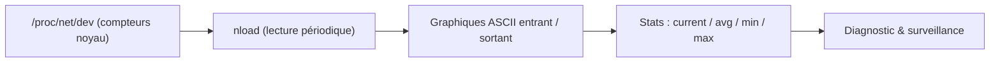

# nload — Le compteur de trafic en temps réel

> [!info] **En 1 phrase**
> nload est un moniteur console en temps réel du trafic réseau, qui affiche sous forme de graphiques ASCII les flux entrant et sortant de chaque interface.

---

## Overview

| Champ | Valeur |
|---|---|
| Nom complet | nload |
| Description | Moniteur console temps réel du trafic entrant/sortant par interface, avec graphiques ASCII et statistiques (current, average, min, max) |
| Catégorie | Réseau & Capture |
| Sous-catégorie | Monitoring réseau |
| Fonction principale | Visualiser en direct la bande passante consommée |
| Type d'outil | Application console (curses) |
| Licence | GPL-2.0 |
| Open source / propriétaire | Open source |
| Langage(s) de programmation | C |
| Développeur / organisation | Roland Riegel |
| Projet officiel | nload |
| Dépôt officiel | https://github.com/rolandriegel/nload |
| Documentation officielle | http://www.roland-riegel.de/nload/readme.html |
| Date de création | 2001 |
| État du projet | en maintenance (peu actif) |
| Dernière version connue | 0.7.4 (2018) |
| Systèmes compatibles | Linux, BSD, macOS (brew), autres Unix |

> [!note] Pour vérifier / compléter
> nload est disponible dans les dépôts Debian/Ubuntu/Kali (`sudo apt install nload`) et sur macOS via Homebrew (`brew install nload`). Il ne nécessite pas de droits root pour la lecture des statistiques système (`/proc/net/dev`).

---

## Concept

nload lit les compteurs de paquets/octets exposés par le noyau (`/proc/net/dev` sur Linux) et les affiche en **temps réel** dans le terminal : deux graphiques ASCII évolutifs (entrant et sortant), plus des statistiques cumulées — débit actuel, moyenne, minimum et maximum — sur la période d'affichage.

Là où [[Outil - tcpdump]]/[[Outil - tshark]] capturent le contenu des paquets, nload ne mesure que le **volume de trafic**. C'est un outil de surveillance et de diagnostic : repérer une interface saturée, observer un pic de trafic pendant une opération, ou valider qu'un transfert consomme bien la bande passante attendue.

En cybersécurité, nload sert surtout en **ops** : vérifier que l'exfiltration d'un volume de données passe sans alerter, mesurer l'impact d'un flood (charge réseau), ou surveiller un serveur de C2/d'exfil. C'est un outil de visibilité, pas d'attaque : il complète la boîte à outils réseau sans être lui-même offensif.



---

## Concepts fondamentaux

| Concept | Explication |
|---|---|
| Débit entrant (Incoming) | Trafic reçu sur l'interface, affiché en graphique et en valeurs |
| Débit sortant (Outgoing) | Trafic émis par l'interface |
| Current | Débit instantané calculé sur la période d'échantillonnage |
| Average | Moyenne glissante du débit depuis le début de l'affichage |
| Min / Max | Valeurs minimale et maximale observées sur la session |
| Unités | Octets/s, bits/s, ou multiples (k/M/G) selon `-u` et `-m` |
| Période (period) | Fenêtre de calcul de la moyenne (`-a`) |
| Interval | Pas d'échantillonnage entre deux mesures (`-i`/`-o`) |
| Changement d'interface | Navigation entre interfaces via touches (<F2>, flèches) |
| Vues multiples | nload peut afficher plusieurs appareils en même temps |

---

## Installation

### Debian / Ubuntu / Kali Linux

```bash
sudo apt update && sudo apt install -y nload
```

### macOS

```bash
brew install nload
```

### Compilation depuis les sources

```bash
git clone https://github.com/rolandriegel/nload.git && cd nload
./run_autotools
./configure && make
sudo make install
```

> [!warning] Prérequis & problèmes potentiels
> - Dépendance `libncurses` pour l'affichage.
> - Sur certains systèmes, l'auto-tooling (`run_autotools`) nécessite automake/autoconf.
> - Pas de mode graphique : console uniquement (SSH/terminal).

---

## Configuration

nload se configure par **options de ligne de commande** ; il n'y a pas de fichier de configuration standard (les arguments peuvent être mis dans un alias shell).

| Paramètre | Rôle | Valeur possible | Impact | Exemple |
|---|---|---|---|---|
| `devices` | Interface(s) à surveiller | `eth0`, `ens33`… | Restreint la surveillance | `nload eth0` |
| `-a` | Période de calcul de la moyenne | secondes (défaut 180) | Fenêtre de l'Average | `nload -a 60` |
| `-i` | Intervalle d'échantillonnage entrant | millisecondes (défaut 500) | Fréquence de lecture | `nload -i 1000` |
| `-o` | Intervalle d'échantillonnage sortant | millisecondes | Fréquence de lecture | `nload -o 1000` |
| `-u` | Unité de débit | `h`, `H`, `k`, `K`, `m`, `M`, `g`, `G` | h=auto, m=Mbit/s… | `nload -u M` |
| `-m` | Afficher en bits par seconde | drapeau | Débit en bps plutôt qu'octets | `nload -m` |
| `-t` | Intervalle d'affichage | millisecondes (défaut 500) | Rafraîchissement de l'écran | `nload -t 200` |
| `--help` | Aide complète | — | Liste des options | `nload --help` |

---

## Architecture interne

nload est un programme **curses** simple : il lit périodiquement les compteurs réseau exposés par le système, calcule les débits sur l'intervalle demandé, et redessine l'écran avec les graphiques.

- **Source de données** : Linux lit `/proc/net/dev` ; les BSD utilisent leurs propres sysctl.
- **Échantillonnage** : chaque intervalle (`-i`/`-o`), nload relit les compteurs et déduit le débit instantané.
- **Moyennes** : l'Average est calculé sur la période `-a` (fenêtre glissante).
- **Affichage** : deux panneaux (Incoming/Outgoing) avec histogramme ASCII historique et valeurs numériques.
- **Multi-interfaces** : nload peut montrer plusieurs appareils simultanément ou permettre la navigation.


---

## Commandes

### Commandes principales

| Commande | Objectif | Résultat attendu |
|---|---|---|
| `nload` | Surveiller toutes les interfaces | Vue temps réel, navigation clavier |
| `nload eth0` | Surveiller l'interface eth0 | Vue temps réel de eth0 |
| `nload -m` | Afficher en bits/s | Unités en Mbit/s (ex. 0.0 Mbit/s) |
| `nload -u K` | Afficher en Kbits/s | Unités en Kbits/s |
| `nload -a 60 -i 1000 -o 1000` | Période 60 s, intervalle 1 s | Moyennes sur 60 s |
| `nload eth0 eth1` | Deux interfaces en même temps | Vues multiples |

### Navigation clavier (dans nload)

| Touche | Action |
|---|---|
| <F2>, ← →, ↑ ↓ | Changer d'appareil surveillé |
| <F5> | Recharger l'affichage |
| <F6> | Défiler dans l'historique des graphiques |
| <F9> | Défiler dans l'ordre inverse |
| <F11>/<F12> | Réduire/agrandir le pas d'affichage |
| q | Quitter |

---

## Options et flags

| Élément | Description | Exemple | Niveau |
|---|---|---|---|
| `devices` | Interface(s) cible | `nload eth0` | Basic |
| `-a period` | Période de la moyenne | `-a 120` | Intermediate |
| `-i interval` | Intervalle entrant (ms) | `-i 200` | Intermediate |
| `-o interval` | Intervalle sortant (ms) | `-o 200` | Intermediate |
| `-u unit` | Unité de débit | `-u G` | Intermediate |
| `-m` | Débit en bits/s | `-m` | Basic |
| `-t interval` | Intervalle d'affichage | `-t 1000` | Intermediate |
| `--help` | Aide | `nload --help` | Basic |

> [!tip] Éléments les plus utiles au quotidien
> `nload` simple pour la vue globale ; `nload -m eth0` pour lire un débit en Mbit/s ; `-u K`/`-u M` pour adapter l'échelle.

---

## Exemples pratiques

### Beginner

```bash
# Surveillance de l'interface par défaut
nload
# Surveillance d'une interface précise, débit en Mbit/s
nload eth0 -m
```

### Intermediate

```bash
# Moyennes sur 60 secondes, échantillonnage toutes les secondes
nload -a 60 -i 1000 -o 1000 eth0
# Unité automatique en Kbits/s
nload -u K
```

### Advanced

```bash
# Surveiller deux interfaces côte à côte
nload eth0 eth1
# Afficher en bits/s avec un rafraîchissement lent (peu gourmand)
nload -m -t 2000 eth0
```

### Expert

```bash
# Intégration dans un script : capturer un échantillon de débit sur 5 s
timeout 5 nload -u M eth0
# Comparer avec un second moniteur (ex. tshark -i eth0 -q -z io,stat,5)
# En lab : lancer un transfert puis observer les deux outils
```

---

## Workflow complet (scénario pas à pas)

1. **Étape 1 — Identifier l'interface** :
   ```bash
   ip -brief link
   nload eth0
   ```
2. **Étape 2 — Choisir l'unité** — taper `q`, relancer avec `-m` pour lire en Mbit/s.
3. **Étape 3 — Générer du trafic et observer** — dans un autre terminal :
   ```bash
   # Télécharger un fichier depuis un serveur lab
   wget http://10.10.20.15/fichier-1G.bin -O /dev/null
   ```
4. **Étape 4 — Lire les stats** — Current/Average/Max confirment le pic ; quitter avec `q`.

---

## Scénarios avancés

### Scénario 1 : surveiller une exfiltration (vue ops)

```bash
# Pendant qu'un outil transfère des données vers l'extérieur,
# vérifier le volume sortant en temps réel
nload -u M eth0
# Les valeurs Outgoing doivent montrer le pic du transfert
```

### Scénario 2 : mesurer l'impact réseau d'un test

```bash
# Avant : noter le niveau de base (Average).
# Pendant un flood limité (voir Hping3, lab uniquement) :
nload -a 30 eth0
# Le graphique Incoming monte ; le Max donne l'impact mesuré.
```

### Scénario 3 : diagnostiquer une saturation

```bash
# Détecter si une interface est le goulot d'étranglement
nload -u M eth0
# Si le trafic reste proche de la capacité (ex. 100 Mbit/s sur un lien 100 M),
# il faut étudier les captures (tshark) pour comprendre qui consomme.
```

---

## Cybersecurity use cases

| Phase | Utilisation |
|---|---|
| Reconnaissance | Vérifier la charge générée par des scans sur le lien local |
| Exploitation | Surveiller l'impact réseau d'un exploit ou d'un flood (lab) |
| Post-exploitation | Valider le volume d'une exfiltration sans éveiller les soupçons |
| C2 | Observer la bande passante du canal C2 / des téléchargements |
| Défense | Détection visuelle de pics anormaux sur un serveur |
| Automatisation | Couplage avec des scripts de mesure (timeout + parsing) |

> [!note] Cadre d'usage
> nload est un outil de **surveillance passive** : il ne modifie pas le trafic. Son usage offensif se limite à la mesure/validation de volumes ; la partie offensive reste assurée par les outils de forgerie (Hping3, Scapy, Nmap).

---

## MITRE ATT&CK

| Tactique | Technique / Sub-technique | ID | Raison | Détection | Mitigation |
|---|---|---|---|---|---|
| Discovery | Network Sniffing | T1040 | nload lit les compteurs réseau (volume, pas de contenu) | Supervision process | Chiffrement, 802.1X |
| Exfiltration | Exfiltration Over Alternative Protocol | T1048 | Mesure/optimisation du volume exfiltré en vue | Volume, DLP | Proxy, politique egress |

> [!note] Pertinence
> nload n'est pas référencé directement dans MITRE ATT&CK ; ces associations sont **indirectes** (il mesure des flux qui relèvent de T1040/T1048). Ne pas forcer d'autres ID.

---

## Defensive Security

### Signes observables

| Indicateur | Détail |
|---|---|
| Process `nload` sur un poste serveur | Supervision process, EDR |
| Pic sortant massif et soutenu | Netflow, seuils de trafic sortant |
| Connexions de monitoring via SSH | Journalisation des sessions |

### Règles de détection (Sigma / Suricata / Snort / YARA)

```yaml
# Sigma — Linux : lancement de nload (indicateur faible, légitime en ops)
title: Nload Execution
id: 7e8a3f2b-9c1d-4e8f-8a3b-7c4d5e6f7a8b
status: experimental
logsource:
    category: process_creation
    product: linux
detection:
    selection:
        Image|endswith: '/nload'
    condition: selection
falsepositives:
    - Legitimate network monitoring
level: low
```

```bash
# Suricata/Snort — la détection de nload passe par les flux, pas le process
# Exemple pédagogique : seuil de volume sortant élevé sur une durée
# (à implémenter côté Netflow/DLP plutôt qu'en signature)
alert tcp $HOME_NET any -> $EXTERNAL_NET 443 (msg:"Large egress volume"; flow:to_server; threshold:type both, track by_src, count 500000, seconds 60; sid:1000009; rev:1;)
```

> [!note] À vérifier
> nload ne génère aucun trafic : la détection par signature est donc impossible ; seul le contexte (process, connexions, volumes) est exploitable.

---

## Automatisation

```bash
# Script — capturer le Max sortant sur 10 s et le journaliser
max="$(timeout 10 nload -u M eth0 </dev/null 2>/dev/null | grep -oP 'Max: \K[0-9.]+' | sort -rn | head -1)"
echo "$(date -Is) max_out=${max} Mbit/s" >> /var/log/ops/traffic.log
```

```bash
# Alias réutilisable : vue bits/s sur une interface
alias traf="nload -m"
```

> [!note] À vérifier
> La sortie exacte de nload varie selon la version et le terminal ; ce parsing illustratif doit être adapté à l'environnement.

---

## Output et parsing

nload est un programme **interactif curses** : sa sortie n'est pas conçue pour être analysée par des scripts. Les données (Current, Average, Min, Max) sont visuelles. Pour du monitoring scriptable, préférer `tshark -q -z io,stat`, `nethogs`, `iftop` ou des compteurs `/proc/net/dev` lus directement.

```bash
# Lecture directe des compteurs noyau (équivalent scriptable)
awk '{if ($1=="eth0:") print $2}' /proc/net/dev
```

```text
# Exemple d'affichage nload (extrait, version 0.7.x)
Device eth0 (10.10.20.15/24):
  Incoming:  Current: 2.40 Mbit/s  Average: 1.10 Mbit/s  Min: 0.00  Max: 5.20 Mbit/s
  Outgoing:  Current: 0.10 Mbit/s  Average: 0.05 Mbit/s  Min: 0.00  Max: 0.80 Mbit/s
```

---

## Intégrations

- [[Tools| Outils]] global
- [[Outil - tcpdump]] / [[Outil - tshark]] — complément : nload mesure le volume, tshark le contenu
- [[Outil - Wireshark]] — analyse approfondie des captures quand un pic est repéré
- [[Outil - Hping3]] / [[Outil - Scapy]] — générer du trafic pendant que nload mesure
- [[Outil - tcpreplay]] — rejouer une capture pendant que nload en mesure l'impact

```text
nload (repère le pic) → tshark (identifie le flux) → Wireshark (analyse)
Hping3/Scapy (trafic) → nload (mesure l'impact)
tcpreplay (rejeu) → nload (évalue la charge)
```

---

## Alternatives

| Outil | Avantages | Inconvénients | Cas d'usage |
|---|---|---|---|
| nload | Simple, graphiques ASCII, multi-interface | Peu d'options, stats limitées | Vue rapide du débit |
| iftop | Par connexion (src/dst) | Pas de moyenne multi-période | Identifier les flux actifs |
| nethogs | Par processus | Interface par défaut | Qui consomme ? |
| bmon | Graphiques, vues multiples | Plus lourd | Monitoring avancé |
| tshark io,stat | Scriptable, précis | Plus complexe | Monitoring automatisé |
| vnstat | Historique long terme | Pas de temps réel | Statistiques quotidiennes |

> **Quand utiliser nload ?** Pour une lecture immédiate du débit d'une interface, sans installation lourde. Pour de l'historique ou du per-processus, préférer vnstat/nethogs ; pour de la programmation, tshark.

---

## Performance

- **Coût** : très faible — lecture de compteurs + affichage curses ; idéal sur des petits postes.
- **Intervalle** : `-t`/`-i`/`-o` plus grands = moins de CPU ; `-t 2000` pour du monitoring passif.
- **Multi-interfaces** : afficher plusieurs appareils augmente légèrement le CPU, reste négligeable.
- **Limites** : l'échelle graphique s'adapte aux pics (Max), ce qui peut « écraser » le détail à bas débit.

> [!note] À vérifier
> Les valeurs dépendent du noyau et du type de lien ; la précision de l'Average dépend de la période `-a`.

---

## Troubleshooting

### Common problems

#### Problème : écran vide ou ne se rafraîchit pas

- **Cause** : terminal non compatible curses, ou absence de `TERM` correct.
- **Solution** : réexporter `TERM=xterm-256color`, relancer dans un terminal dédié.
- **Vérification** : `echo $TERM` avant de lancer.

#### Problème : l'interface demandée n'apparaît pas

- **Cause** : nom d'interface erroné ou non listé.
- **Solution** : vérifier avec `ip -brief link` ; lancer `nload` sans argument pour naviguer.
- **Vérification** : `cat /proc/net/dev` doit lister l'interface.

#### Problème : « command not found: nload »

- **Cause** : outil non installé.
- **Solution** : `sudo apt install nload` (ou `brew install nload`).
- **Vérification** : `nload --help`.

#### Problème : les débits semblent faux (0 ou énormes)

- **Cause** : interface inactive, ou unité mal choisie (`-u`/`-m`).
- **Solution** : générer du trafic (ping/laboratoire), réessayer avec `-u K` ou `-u M`.
- **Vérification** : lancer un `ping -f 10.10.20.15` en parallèle pour forcer du débit.

---

## Sécurité de l'outil

- **Privilèges** : nload lit des compteurs système — pas besoin de root sur la plupart des systèmes.
- **Données** : il n'enregistre pas le contenu ; les statistiques affichées restent à l'écran.
- **Surface d'attaque** : minimal (programme C curses) ; maintenu à jour via les paquets distro.
- **Télémétrie** : aucune donnée transmise.
- **Autorisations** : mesurer le trafic d'un réseau sans accord reste soumis aux règles locales.

---

## Limitations

- Monitoring **volume uniquement** : aucun détail sur le contenu ou les flux par connexion.
- Pas de mode batch/parsing fiable pour les scripts.
- Pas d'historique persisté (vnstat le fait).
- Sans interaction clavier (SSH non interactif), la lecture est limitée à l'écran.
- Développement au repos : dernière version 0.7.4 (2018).

---

## Cheatsheet

```bash
nload                 # toutes les interfaces
nload eth0            # une interface
nload -m              # débit en bits/s
nload -u M            # en Mbit/s
nload -a 60           # moyenne sur 60 s
nload -i 1000 -o 1000 # échantillonnage 1 s
nload eth0 eth1       # deux interfaces
nload --help          # aide
# Touches : F2/flèches = changer d'interface, F5 = refresh, q = quitter
```

---

## Quick reference

| | |
|---|---|
| **À quoi sert-il ?** | Afficher en temps réel le trafic entrant/sortant d'une interface |
| **Quand l'utiliser ?** | Diagnostiquer une saturation, mesurer un volume de trafic |
| **Commande principale** | `nload eth0 -m` |
| **Alternative principale** | iftop, nethogs, bmon, vnstat, `tshark -z io,stat` |
| **Concepts importants** | Incoming/Outgoing, Current, Average, Min/Max, unités `-u`/`-m` |
| **Liens associés** | [[Outil - tshark]] · [[Outil - Hping3]] · [[Outil - tcpreplay]] · [[Outil - Scapy]] |

---

## Détection & Défense

| Signe | Défense |
|---|---|
| Process `nload` inattendu sur un serveur | Supervision process (Sigma) |
| Pic de trafic sortant massif | Netflow, seuils egress, DLP |
| Monitoring à distance via SSH | Journalisation, MFA |

---

## Tips & Pièges

> [!tip] **Tips**
> - Utiliser `-m` pour lire des débits « parlants » en Mbit/s.
> - Lancer `nload` dans un terminal séparé pendant les tests (Hping3/Scapy).
> - Coupler avec tshark dès qu'un pic est repéré pour identifier le flux.

> [!warning] **Pièges**
> - nload ne montre pas *qui* consomme : pour ça, nethogs/iftop.
> - L'échelle graphique suit le Max : un pic écrasé peut masquer le débit moyen.
> - La sortie curses n'est pas scriptable : ne pas l'utiliser pour de l'alerting.
> - Vérifier le nom exact de l'interface (`eth0`, `ens33`, `wlan0`…).

---

## References

### Official

- Site officiel : http://www.roland-riegel.de/nload/
- Lisez-moi : http://www.roland-riegel.de/nload/readme.html
- Dépôt officiel : https://github.com/rolandriegel/nload

### Security references

- MITRE ATT&CK T1040 — Network Sniffing : https://attack.mitre.org/techniques/T1040/
- MITRE ATT&CK T1048 — Exfiltration Over Alternative Protocol : https://attack.mitre.org/techniques/T1048/

### Community

- nload sur Arch Wiki : https://wiki.archlinux.org/title/Network_traffic_monitoring
- Page Debian (nload) : https://packages.debian.org/search?keywords=nload

---

**Liens :** [[Tools| Outils]] · [[Outil - tcpdump|tcpdump]] · [[Outil - tshark|tshark]] · [[Outil - tcpreplay|tcpreplay]] · [[Outil - Nmap|Nmap]]
