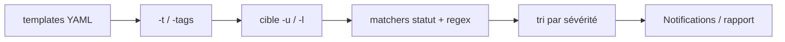

# nuclei — Scanner de vulnérabilités piloté par templates (ProjectDiscovery)

> [!info] **En 1 phrase**
> nuclei est un scanner de vulnérabilités piloté par des templates YAML, ultra-rapide, communautaire et extensible.

---

## Overview

| Champ | Valeur |
|---|---|
| Nom complet | nuclei |
| Description | Scanner de vulnérabilités à templates : exécute des modèles YAML (requêtes + matchers) pour détecter CVEs, expositions et misconfigurations à grande échelle |
| Catégorie | Scan Web & Fuzzing |
| Sous-catégorie | Scanner de vulnérabilités / template-based DAST |
| Fonction principale | Valider des vulnérabilités connues sur des cibles grâce à des templates communautaires |
| Type d'outil | CLI (binaire unique, exécutable aussi en service) |
| Licence | MIT |
| Open source / propriétaire | Open source |
| Langage(s) de programmation | Go |
| Développeur / organisation | ProjectDiscovery |
| Projet officiel | https://projectdiscovery.io |
| Dépôt officiel | https://github.com/projectdiscovery/nuclei |
| Documentation | https://docs.projectdiscovery.io/tools/nuclei |
| Templates communautaires | https://github.com/projectdiscovery/nuclei-templates |
| Version actuelle | v3.11.1 (août 2026) |
| Protocoles supportés | HTTP, DNS, SSL, File, Network, JavaScript, Headless, Code, WebSocket + Workflows |
| Modes d'entrée (`-im`) | list, burp, jsonl, yaml, openapi, swagger |

---

## Concept

nuclei (ProjectDiscovery) détecte les vulnérabilités en exécutant des templates YAML : chaque template décrit une requête et des matchers (statut, regex, taille, corps). Le scanner gère le parallélisme, la déduplication et l'envoi des résultats vers des endpoints de notification (Slack, Discord). Il est écrit en Go : un seul binaire statique, aucun runtime requis, des milliers de requêtes par seconde possibles.

Son atout majeur est l'écosystème : les templates officiels couvrent des milliers de CVEs, expositions et misconfigurations, et la communauté contribue en permanence. `-tags`, `-severity` et `-t` permettent de cibler finement la recherche, de la CVE précise au tag `wordpress`. Il se place en **phase de validation et d'exploitation assistée** : après l'énumération (subfinder, httpx, nmap), nuclei confirme les vulnérabilités probables sur des milliers de cibles en quelques minutes.



---

## Concepts fondamentaux

- **Templates YAML** : un modèle décrit une ou plusieurs requêtes (`requests`), les conditions de détection (`matchers`) et les métadonnées (`info` : nom, sévérité, tags, classification CVE).
- **Matchers** : comparaison de la réponse — types `word` (texte), `regex`, `status`, `size`, `dsl`, `binary`, `xpath`, `json` — combinables avec `matchers-condition: and|or`.
- **Extractors** : extraient des valeurs de la réponse (regex, jsonpath, xpath) pour les réutiliser ensuite (tokens, URLs, versions).
- **Workflows** : enchaînent des templates avec des conditions (`matchers` sur le résultat précédent) pour orchestrer des scans complexes.
- **Tags & sévérité** : filtres `-tags` (par technologie : `wordpress`, `lfi`, `cve`...) et `-severity` (info → critical).
- **Déduplication des requêtes** : nuclei ne renvoie pas deux fois la même requête vers la même cible pour un template.
- **Mise à jour automatique** : l'engine et les templates se mettent à jour au lancement (désactivable avec `-duc`).
- **Protocoles multiples** : au-delà de HTTP, nuclei teste DNS (dns), SSL/TLS (ssl), fichiers (file), réseau brut (network), JS (javascript), navigateur (headless), WebSocket et exécution de code (code).
- **Détection d'honeypots** (`-hpd`) : alerte quand une cible « matche » un nombre anormal de templates, signe d'un honeypot.

---

## Installation

```bash
# Binaire précompilé (Linux amd64) — télécharger la dernière release
wget https://github.com/projectdiscovery/nuclei/releases/latest/download/nuclei_3.11.1_linux_amd64.zip
unzip nuclei_3.11.1_linux_amd64.zip && sudo mv nuclei /usr/local/bin/

# Via Go
go install github.com/projectdiscovery/nuclei/v3/cmd/nuclei@latest

# Via Homebrew (macOS / Linux)
brew install nuclei

# Conteneur
docker pull projectdiscovery/nuclei:latest
docker run --rm projectdiscovery/nuclei -update-templates

# Vérification
nuclei -version
```

> [!tip] Premiers lancements
> Au premier scan, nuclei télécharge automatiquement les templates communautaires dans `~/.config/nuclei/templates` (désactivable avec `-duc`).

---

## Configuration

### Fichiers de configuration

| Emplacement | Rôle |
|---|---|
| `~/.config/nuclei/templates/` | Templates communautaires installés (`-ut` pour les mettre à jour) |
| `~/.config/nuclei/provider-config.yaml` | Identifiants des providers (shodan, censys...) pour l'enrichissement |
| `~/.config/nuclei/config.yaml` | Configuration globale (proxy, ratelimit, etc.) |

### Options principales au lancement

```bash
# Mettre à jour l'engine et les templates
nuclei -update
nuclei -update-templates

# Désactiver la vérification automatique de mise à jour
nuclei -duc -u http://10.10.10.10

# Définir un répertoire de templates personnalisé
nuclei -t ~/mes-templates -ud ~/mes-templates

# Proxy + rate limit pour être propre
nuclei -u http://10.10.10.10 -proxy http://127.0.0.1:8080 -rate 50

# Fournir les identifiants provider (fichier YAML)
nuclei -as -u http://10.10.10.10
```

> [!note] À vérifier
> `provider-config.yaml` sert principalement aux templates qui interrogent des APIs externes (shodan, censys, virustotal) ; inutile pour les scans purement actifs.

---

## Architecture interne

```text
nuclei (binaire Go, monolithe)
├── CLI                    # parsing des flags, orchestration
├── Runner                 # gestion des cibles, templates, stats
├── Engines                # protocoles : http, dns, ssl, file, network, javascript, headless, code, websocket
├── Template loaders       # chargement YAML + validation + variables
├── Operators              # matchers, extractors, DSL (helpers)
├── Output & Report        # stdout, jsonl, sarif, markdown, html, integrate (slack, discord...)
└── nuclei-templates       # dépôt externe de templates communautaires (hors binaire)
```

- **Moteur de templates** : chaque template est validé puis exécuté contre la cible ; les matchers décident si le template « matche » (finding).
- **DSL `{{...}}`** : variables et helpers (ex : `{{BaseURL}}`, `{{randstr}}`, fonctions comme `md5()`) injectables dans les requêtes.
- **Pipelines d'entrée** : `-im` accepte plusieurs formats (list, burp, jsonl, yaml, openapi, swagger) pour alimenter les cibles.
- **Sécurité du moteur** : depuis v3.10, sandbox du protocole `code`, vérifications de policy réseau, protections contre les includes YAML ; depuis v3.11, les templates `javascript:` doivent être signés.

---

## Commandes

### Commandes de base

```bash
# Mettre à jour les templates communautaires (AVANT chaque engagement)
nuclei -update-templates

# Scan d'une cible unique
nuclei -u http://cible.local

# Scan d'une liste de cibles
nuclei -l urls.txt -o resultats.txt

# Scan ciblé par sévérité
nuclei -u http://10.10.10.10 -severity high,critical

# Scan ciblé par tag
nuclei -u http://10.10.10.10 -tags wordpress -exclude-severity info

# Vérifier une CVE précise
nuclei -u http://10.10.10.10 -t http/cves/2021/CVE-2021-41773.yaml

# Sortie JSON pour le pipeline
nuclei -u http://10.10.10.10 -jsonl -o resultats.jsonl
```

### Commandes avancées

```bash
# Scan automatique basé sur les technologies détectées (wappalyzer)
nuclei -u http://10.10.10.10 -as

# Générer un template via une requête en langage naturel (IA)
nuclei -u http://10.10.10.10 -ai "détecter une injection SQL dans le paramètre id"

# Détection de honeypots
nuclei -l urls.txt -hpd

# Valider ses templates avant exécution
nuclei -validate -t mon-template.yaml

# Ne lancer que les nouveaux templates de la dernière release
nuclei -l urls.txt -nt

# Diagnostic de l'installation
nuclei -health-check

# Stats en JSON toutes les 2 secondes
nuclei -l urls.txt -stats -stats-json -stats-interval 2
```

---

## Options et flags

### Options générales

| Option | Description | Niveau |
|---|---|---|
| `-u <url>` | Cible unique (URL ou hôte) | Basic |
| `-l <fichier>` | Liste de cibles (une par ligne) | Basic |
| `-o <fichier>` | Fichier de sortie | Basic |
| `-t <template>` | Template ou dossier de templates | Basic |
| `-tags <tags>` | Filtrer par tags (wordpress, cve, lfi...) | Basic |
| `-severity <s>` | Sévérité : info, low, medium, high, critical | Basic |
| `-exclude-severity <s>` | Exclure des sévérités | Basic |
| `-exclude-tags <tags>` | Exclure des tags | Intermediate |
| `-templates-version` | Afficher la version des templates installés | Basic |
| `-update-templates` | Mettre à jour les templates | Basic |
| `-duc` | Désactiver le contrôle de mise à jour | Intermediate |
| `-jsonl` / `-j` | Sortie JSON par ligne | Basic |
| `-silent` | N'afficher que les findings | Basic |
| `-stats` | Statistiques temps réel | Intermediate |
| `-stats-json` / `-stats-interval` | Stats en JSON / intervalle (défaut 5s) | Advanced |
| `-c <n>` | Concurrence maximale (défaut 25) | Intermediate |
| `-rate <n>` | Requêtes par seconde | Intermediate |
| `-timeout <sec>` | Délai max par requête | Intermediate |
| `-retries <n>` | Nouveaux essais (défaut 1) | Intermediate |
| `-proxy <url>` | Proxy HTTP/SOCKS5 (liste ou fichier) | Intermediate |
| `-as` | Scan automatique (technologie → tags) | Advanced |
| `-ai "<prompt>"` | Générer un template via IA | Advanced |
| `-nt` | Ne lancer que les nouveaux templates | Advanced |
| `-w <workflow>` | Exécuter un workflow | Advanced |
| `-hpd` | Détection de honeypots | Advanced |
| `-hpt <n>` / `-shp` | Seuil / suppression honeypots | Expert |
| `-headless` | Templates navigateur headless | Advanced |
| `-im <mode>` | Mode d'entrée : list, burp, jsonl, yaml, openapi, swagger | Advanced |
| `-sa` | Scanner toutes les IP d'un enregistrement DNS | Advanced |
| `-iv 4/6` | Version IP à scanner | Advanced |
| `-validate` | Valider les templates fournis | Intermediate |
| `-health-check` | Diagnostic de l'installation | Advanced |
| `-vv` | Afficher les templates chargés | Advanced |
| `-v` | Mode verbeux | Intermediate |
| `-version` | Version de nuclei | Basic |

### Structure d'un template YAML

```yaml
id: exemple-detect
info:
  name: Détection d'un fichier sensible
  severity: high
  tags: exposure,config
  classification:
    cve-id: CVE-2024-0000
requests:
  - method: GET
    path:
      - "{{BaseURL}}/config/backup.zip"
    matchers-condition: and
    matchers:
      - type: status
        status:
          - 200
      - type: word
        words:
          - "BEGIN RSA PRIVATE KEY"
```

### Types de matchers

| Type | Usage |
|---|---|
| `word` | Recherche de chaînes dans le corps |
| `regex` | Expression régulière |
| `status` | Code(s) HTTP |
| `size` | Taille de réponse |
| `dsl` | Conditions DSL (`status_code == 200 && len(body) > 1000`) |
| `binary` | Patterns binaires (hex) |
| `xpath` / `json` | Extraction/matching dans XML ou JSON |

---

## Exemples pratiques

### Beginner

```bash
# Objectif : premier scan global d'une cible
nuclei -u http://10.10.10.10 -o resultats.txt

# Objectif : scanner avec un tag précis
nuclei -u http://10.10.10.10 -tags wordpress

# Objectif : sortie lisible, sévérités utiles uniquement
nuclei -u http://10.10.10.10 -silent -severity medium,high,critical
```

### Intermediate

```bash
# Objectif : scan d'un périmètre avec limites raisonnables
nuclei -l sous-domaines.txt -c 50 -rate 100 -timeout 10 -retries 2 -stats

# Objectif : vérifier une CVE précise sur une cible
nuclei -u http://10.10.10.10 -t http/cves/2023/CVE-2023-2333.yaml

# Objectif : exclure les check désagréables (DoS) pour un engagement
nuclei -u http://10.10.10.10 -exclude-tags dos
```

### Advanced

```bash
# Objectif : scan auto basé sur les technologies détectées
nuclei -u http://cible.local -as

# Objectif : scanner un flux Burp Suite exporté
nuclei -im burp -l flux_burp.json

# Objectif : exécuter un workflow dédié
nuclei -u http://10.10.10.10 -w workflows/wordpress-workflow.yaml

# Objectif : scan headless pour les apps JavaScript
nuclei -u https://app.cible.local -headless -tags xss -timeout 30
```

### Expert

```bash
# Objectif : générer un template avec l'IA
nuclei -ai "détecter le panneau d'admin sur /admin/"

# Objectif : ne lancer que les templates de la dernière release
nuclei -l urls.txt -nt

# Objectif : détecter les honeypots dans un grand périmètre
nuclei -l urls.txt -hpd -stats-json
```

---

## Workflow complet (scénario pas à pas)

1. **Mettre à jour les templates** :
   ```bash
   nuclei -update-templates
   ```
2. **Scan global d'une cible** :
   ```bash
   nuclei -u http://10.10.10.10 -severity medium,high,critical -o resultats.txt
   ```
3. **Scan ciblé WordPress** :
   ```bash
   nuclei -u http://10.10.10.10/wp-admin/ -tags wordpress
   ```
4. **Scan d'un périmètre complet** :
   ```bash
   nuclei -l sous-domaines.txt -stats -c 50
   ```
5. **Vérifier une CVE précise** :
   ```bash
   nuclei -u http://10.10.10.10 -t http/cves/2021/CVE-2021-41773.yaml
   ```
6. **Analyser `resultats.txt`** : chaque finding est daté et taggé par template ; confirmer à la main avant toute exploitation.

---

## Scénarios avancés

### Scénario 1 : Scan d'un périmètre entier avec tri et notification

```bash
nuclei -l url.txt -severity high,critical -exclude-severity info,low \
  -jsonl -o critical.jsonl -stats -timeout 10 -retries 2
# Réduire timeout/retries pour ne pas laisser les cibles lentes bloquer le scan
```

### Scénario 2 : Templates custom (écrire sa propre détection)

```yaml
# ~/.config/nuclei/templates/ma-detect.yaml
id: custom-detection
info:
  name: Detection custom
  severity: medium
requests:
  - method: GET
    path:
      - "{{BaseURL}}/admin.php"
    matchers-condition: and
    matchers:
      - type: word
        words:
          - "Login Admin"
```
```bash
nuclei -u http://10.10.10.10 -t ~/.config/nuclei/templates/ma-detect.yaml
```

### Scénario 3 : Scan headless pour les apps rendues en JavaScript

```bash
nuclei -u https://app.cible.local -headless -tags xss -timeout 30
```

### Scénario 4 : Enchaîner les découvertes avec un workflow

```yaml
# workflow-detect.yaml : détecter un admin puis tester sa sécurité
id: admin-enchainement
info:
  name: Admin detection then auth-bypass check
workflows:
  - template: http/exposures/admin-finder.yaml
    matchers:
      - type: word
        words:
          - "Login"
    execute:
      - template: http/cves/2024/CVE-2024-XXXX.yaml
```
```bash
nuclei -u http://10.10.10.10 -w workflow-detect.yaml
```
Un workflow n'exécute les templates suivants que si les matchers sur le premier passent — idéal pour des chaînes conditionnelles.

### Scénario 5 : Génération de template par IA et validation

```bash
# Générer un template à partir d'un prompt
nuclei -ai "détecter une redirection ouverte sur /redirect.php?url="

# Valider sa syntaxe avant lancement
nuclei -validate -t /tmp/generated.yaml

# Lancer le template validé
nuclei -u http://10.10.10.10 -t /tmp/generated.yaml
```

---

## Cybersecurity use cases

| Phase | Utilisation |
|---|---|
| Reconnaissance | Scan des sous-domaines/technologies découverts (subfinder, httpx) |
| Énumération | Exposition de fichiers, interfaces d'admin, misconfigurations |
| Vulnérabilité | Validation de CVEs connues et de failles logicielles via templates |
| Exploitation | Aide à l'exploitation assistée (preuves de concept) |
| Post-exploitation | Vérification de la surface d'attaque après compromission |
| Rapport | Génération de rapports automatiques (markdown, HTML, SARIF, JSON) |

---

## MITRE ATT&CK

| Tactique | Technique / Sub-technique | ID | Raison | Détection | Mitigation |
|---|---|---|---|---|---|
| Reconnaissance | Active Scanning: Vulnerability Scanning | T1595.002 | nuclei valide des vulnérabilités connues via templates | Bursts HTTP structurés, User-Agent nuclei, patterns de matchers | WAF, rate limiting, supervision |
| Reconnaissance | Active Scanning: Scanning IP Blocks | T1595.001 | scan massif de listes d'hôtes (protocole dns inclus) | Détection de scans multi-cibles | Segmentation, supervision |
| Discovery | Application Window Discovery | T1010 | templates d'énumération de panneaux et interfaces | Trafic vers chemins d'admin | Restreindre l'exposition |
| Execution | Command and Scripting Interpreter | T1059 | protocole `code`/`javascript` des templates (à utiliser avec prudence) | Exécution de commandes via templates malveillants | Templates signés et vérifiés, sandbox |

> [!note] Ne renseigner que si l'association est réellement pertinente.
> L'association la plus spécifique est **T1595.002 (Vulnerability Scanning)** — la finalité de l'outil. La ligne `T1059` ne s'applique que si on exécute des templates avec le protocole `code`/`javascript`, ce qui est rare en usage classique.

---

## Defensive Security

### Signes observables

| Indicateur | Détail |
|---|---|
| User-Agent « Nuclei » dans les logs | Signature la plus évidente d'un scan |
| Bursts de requêtes très structurées et parallèles | Caractéristique du moteur nuclei (haute concurrence) |
| Demandes sur de nombreux chemins de CVEs récentes | Les templates suivent l'actualité des vulnérabilités |
| En-têtes et DSL inhabituels | Marqueurs des matchers complexes |

### Règles de détection (Sigma / Suricata / Snort / YARA)

```yaml
# Sigma : scan nuclei via User-Agent
title: Nuclei Vulnerability Scanner
id: 3f1a4b2c-0002-4a5b-9c2d-000000000002
status: experimental
description: Détection d'un scan nuclei par le User-Agent caractéristique
logsource:
    category: webserver
    product: apache
detection:
    selection:
        c-useragent|contains:
            - 'Nuclei'
            - 'projectdiscovery'
    condition: selection
falsepositives:
    - Outils d'audit légitimes
level: medium
```

```bash
# Suricata/Snort (pédagogique) : requêtes nuclei vers des chemins CVE
alert http any any -> any any (msg:"Nuclei scan - CVE path probing"; \
  flow:to_server,established; \
  http.user_agent; content:"Nuclei"; \
  http.uri; content:"/cgi-bin/"; \
  sid:66000018; rev:1;)
```

```yaml
# YARA : templates nuclei stockés sur un poste compromis
rule Nuclei_Templates {
    meta:
        description = "Présence de templates nuclei (dépôt local)"
        author = "Équipe SOC"
    strings:
        $a = "matchers-condition" ascii wide
        $b = "nuclei-templates" ascii wide
        $c = "{{BaseURL}}" ascii wide
    condition:
        any of them
}
```

---

## Automatisation

```bash
# Scan quotidien daté + archive
nuclei -l cibles.txt -jsonl -o "nuclei_$(date +%Y%m%d).jsonl" -duc

# Enchaîner subfinder -> httpx -> nuclei
subfinder -d cible.local -silent | httpx -silent | nuclei -severity high,critical -jsonl -o findings.jsonl
```

```python
# Python : déclencher un scan et pousser les findings vers un endpoint
import json, subprocess

def scan(targets_file: str, out: str) -> None:
    subprocess.run([
        "nuclei", "-l", targets_file,
        "-severity", "high,critical",
        "-jsonl", "-o", out, "-duc"
    ], check=True)

with open("findings.jsonl", encoding="utf-8") as f:
    for line in f:
        item = json.loads(line)
        print(item["info"]["name"], item["matched-at"], item["info"]["severity"])
```

```yaml
# GitHub Actions : CI de scan de vulnérabilités
name: nuclei-scan
on:
  schedule:
    - cron: "0 4 * * *"
jobs:
  scan:
    runs-on: ubuntu-latest
    steps:
      - name: Scan
        run: |
          docker run --rm -v "$(pwd):/tmp" projectdiscovery/nuclei:latest \
            -l /tmp/cibles.txt -severity medium,high,critical \
            -jsonl -o /tmp/findings.jsonl -duc
      - name: Upload
        uses: actions/upload-artifact@v4
        with:
          path: findings.jsonl
```

---

## Output et parsing

nuclei produit une sortie texte lisible et une sortie **JSONL** (`-jsonl`), et peut générer des rapports formatés : **markdown, HTML, SARIF, JSON** (`-report-format`, `-report-config`).

```bash
# JSONL pour le pipeline
nuclei -u http://10.10.10.10 -jsonl -o findings.jsonl

# Trier les findings par sévérité avec jq
jq -r '.info.severity' findings.jsonl | sort | uniq -c

# Extraire les URLs matchées
jq -r '.matched-at' findings.jsonl | sort -u

# Extraire les templates qui ont matché
jq -r '.template-id' findings.jsonl | sort -u

# Filtrer sur un tag (ex : wordpress)
jq -r 'select(.info.tags | contains("wordpress")) | .matched-at' findings.jsonl

# Générer un rapport SARIF pour les outils de code review
nuclei -u http://10.10.10.10 -report-format sarif -report-config config.yaml
```

> [!note] À vérifier
> Les rapports formatés nécessitent un fichier de config (`-report-config`) : consulter la documentation `report-config.yaml` pour les champs (template-id, severity, etc.).

---

## Intégrations

```text
subfinder -> httpx -> nuclei -> rapports (JSONL / SARIF / markdown)
nuclei -> Slack / Discord / Telegram (webhook) -> notifications de findings
nuclei -> cloud.projectdiscovery.io -> stockage et visualisation cloud
nuclei -> Burp Suite (flux -im burp) -> reprise des requêtes interceptées
nuclei -> SIEM -> ingestion des JSONL pour corrélation
```

- [[Tools| Outils]] global
- [[Outil - httpx]] — détection de technologies et probing avant nuclei
- [[Outil - subfinder]] — énumération de sous-domaines en amont
- [[Outil - nikto]] — balayage serveur complémentaire (inventaire vs validation)
- [[Outil - Nmap]] — découverte de ports et services avant scan
- [[Techniques/Path Traversal|Path Traversal]] · [[Techniques/SSRF|SSRF]] · [[Techniques/XXE|XXE]] · [[03 - Exploitation Web|Exploitation Web]]

---

## Alternatives

| Outil | Avantages | Inconvénients | Cas d'usage |
|---|---|---|---|
| Nikto | Large base de checks serveur, léger | Signatures anciennes, pas de templates | Première passe serveur |
| OWASP ZAP | DAST complet, crawling, GUI | Lourd, lent, moins parallèle | Scan applicatif complet |
| Burp Suite (Scanner) | Intégré au proxy, faible faux positif | Commercial (Pro) | Scan ciblé d'application |
| Wpscan | Spécialisé WordPress | WordPress uniquement | Sites WordPress |
| Wapiti / Arachni | Scan applicatif open source | Communauté plus réduite | Scan applicatif alternatif |

> **Quand utiliser nuclei plutôt que les autres ?** Pour le **scan massif et automatisé** de CVEs/misconfigurations à grande échelle, avec des templates toujours à jour. Il ne remplace pas un proxy (Burp/ZAP) pour l'analyse applicative fine.

---

## Performance

- **Go / parallélisme** : binaire statique, des milliers de requêtes par seconde (`-c` concurrence, défaut 25).
- **Déduplication** : pas de requêtes doublées pour un même template/cible.
- **Statistiques** : `-stats` (et `-stats-json`) pour suivre requêtes, erreurs et durée en temps réel.
- **Réglage fin** : `-rate` (requêtes/s) et `-timeout`/`-retries` pour éviter les blocages sur cibles lentes.
- **Entrées natives** : `-im burp`/`openapi`/`swagger` évite des conversions manuelles.
- **Scan automatique** : `-as` ne lance que les templates pertinents pour les technologies détectées (wappalyzer), réduisant le nombre de requêtes.

> [!note] À vérifier
> Les performances varient selon le réseau, la cible et la charge : toujours valider `-rate` et `-c` sur un échantillon avant un scan massif.

---

## Troubleshooting

### Common problems

#### Problème : `Unable to load templates` / templates obsolètes

- **Cause** : templates absents, corrompus ou trop anciens.
- **Solution** : `nuclei -update-templates` ou `nuclei -ud ~/.config/nuclei/templates`.
- **Vérification** : `nuclei -templates-version`.

#### Problème : « no results » alors que la cible est vulnérable

- **Cause** : templates non à jour, sévérités exclues, ou WAF/réécritures.
- **Solution** : mettre à jour, lever `-exclude-severity`, tester sans proxy puis via `-proxy`.
- **Vérification** : lancer `-vv` pour confirmer le chargement des templates et `-v` pour voir les requêtes.

#### Problème : la cible répond en timeouts

- **Cause** : concurrence trop élevée, rate limit, cible lente.
- **Solution** : réduire `-c` et `-rate`, augmenter `-timeout`, ajouter `-retries`.
- **Vérification** : `-stats` pour observer les erreurs en direct.

#### Problème : `template skipped` pour un template javascript:

- **Cause** : depuis v3.11.0, les templates `javascript:` non signés sont ignorés.
- **Solution** : signer le template ou utiliser un protocole alternatif (`http`, `headless`).
- **Vérification** : `nuclei -validate -t mon-template.yaml`.

#### Problème : faux positifs sur des matchers trop larges

- **Cause** : template trop permissif (regex large, `status` seul).
- **Solution** : vérifier le template, resserrer les matchers, croiser avec `-proxy` (Burp).
- **Vérification** : rejouer la requête du template avec curl pour confirmer.

---

## Sécurité de l'outil

- **Templates = code** : les templates peuvent exécuter du code (`code`, `javascript`) et envoyer des requêtes — ne charger que des templates de confiance.
- **Durcissement récent** : v3.10 a ajouté la sandbox du protocole `code`, les vérifications de policy réseau et les protections YAML include ; v3.11 exige des templates `javascript:` **signés**.
- **Advisories passés** : exécution de templates non signés via workflows (GO-2024-2645/2989), bypass de vérification de signature (GO-2024-3114), LFI via `require()` (GO-2026-4965), divulgation de variables d'environnement via DSL (GO-2026-5473) — **mettre à jour régulièrement**.
- **Pas de service sans précaution** : le projet recommande de ne pas l'utiliser en tant que service exposé sans mesures de sécurité supplémentaires.
- **Cibles tierces** : les templates communautaires interrogent parfois des services externes (shodan, censys...) — contrôler `provider-config.yaml`.

---

## Limitations

- **Template-based** : ne détecte que ce que les templates savent chercher ; une CVE sans template ne sera pas trouvée.
- **Faux positifs/négatifs** : les matchers larges génèrent des faux positifs ; les templates trop précis, des faux négatifs.
- **Pas un DAST applicatif complet** : pas de crawling intelligent ni de logique métier complexe (sauf templates headless dédiés).
- **Dépendance à l'actualité** : l'efficacité dépend de la fraîcheur des templates.
- **Bruit réseau** : un scan par défaut sur beaucoup de cibles peut saturer ou déclencher les WAF.
- **Nécessite vérification manuelle** : un « match » n'est pas une preuve d'exploitabilité.

---

## Cheatsheet

```bash
# Mise à jour (à faire avant chaque engagement)
nuclei -update
nuclei -update-templates

# Scan de base
nuclei -u http://10.10.10.10

# Scan d'une liste avec sortie fichier
nuclei -l urls.txt -o resultats.txt

# Sévérités ciblées
nuclei -u http://10.10.10.10 -severity high,critical

# Tags + exclusions
nuclei -u http://10.10.10.10 -tags wordpress -exclude-severity info

# CVE précise
nuclei -u http://10.10.10.10 -t http/cves/2021/CVE-2021-41773.yaml

# Scan d'un périmètre avec limites
nuclei -l sous-domaines.txt -c 50 -rate 100 -timeout 10 -retries 2 -stats

# JSONL pour pipeline
nuclei -u http://10.10.10.10 -jsonl -o findings.jsonl

# Scan automatique (technologies détectées)
nuclei -u http://10.10.10.10 -as

# Template custom
nuclei -u http://10.10.10.10 -t ~/.config/nuclei/templates/ma-detect.yaml

# Validation des templates
nuclei -validate -t mon-template.yaml
```

---

## Quick reference

| | |
|---|---|
| **À quoi sert-il ?** | Scanner de vulnérabilités piloté par templates YAML |
| **Quand l'utiliser ?** | Après l'énumération (subfinder/httpx), pour valider des CVEs sur de nombreuses cibles |
| **Commande principale** | `nuclei -u http://cible.local` |
| **Alternative principale** | Nikto (serveur), OWASP ZAP (DAST complet) |
| **Concepts importants** | Templates YAML, matchers, tags/sévérité, workflows, DSL, JSONL |
| **Liens associés** | [[Outil - httpx]] · [[Outil - subfinder]] · [[Outil - nikto]] · [[Outil - Nmap]] |

---

## Détection & Défense

| Signe | Défense |
|---|---|
| User-Agent « Nuclei » dans les logs | Règles SIEM/IDS sur le User-Agent |
| Burst de requêtes structurées | Rate limiting, détection de patterns de scan |
| Requêtes vers chemins de CVEs récentes | WAF rules, supervision des 404 répétés |
| Scan massif multi-cibles | Segmentation, détection d'IP sweep |
| Faux positifs | Validation manuelle avant toute action |

---

## Tips & Pièges

> [!tip] **Tips**
> - Lance `nuclei -update-templates` régulièrement avant chaque engagement : les templates communautaires évoluent aussi vite que les CVEs.
> - Préfère `-jsonl` + jq pour trier les findings par sévérité ou par hôte dans un pipeline.
> - Utilise `-tags` pour limiter le bruit : ne lancer que les checks utiles à la cible (ex: `wordpress`, `cve`).
> - `-as` (scan automatique) réduit le nombre de requêtes en ne lançant que les templates pertinents pour les technologies détectées.
> - `-nt` ne lance que les nouveaux templates — utile pour détecter les CVE très récentes en priorité.

> [!warning] **Pièges**
> - Un « match » nuclei ne prouve pas l'exploitabilité. Confirme chaque finding avec Burp/curl et un test d'exploitation maîtrisé avant de l'écrire au rapport.
> - Sans `-rate`, nuclei peut saturer un petit serveur ou déclencher un WAF.
> - Un template obsolète peut donner de faux positifs : vérifie toujours la version des templates et l'âge du template matché.
> - Depuis v3.11.0, les templates `javascript:` doivent être **signés** : les templates custom non signés sont ignorés.
> - Ne charge que des templates de confiance : les templates sont du code exécutable.

---

## References

### Official

- Site officiel : https://projectdiscovery.io
- Dépôt GitHub : https://github.com/projectdiscovery/nuclei
- Documentation nuclei : https://docs.projectdiscovery.io/tools/nuclei
- Templates communautaires : https://github.com/projectdiscovery/nuclei-templates
- Cloud (gratuit) : https://cloud.projectdiscovery.io

### Security references

- MITRE ATT&CK T1595 — Active Scanning : https://attack.mitre.org/techniques/T1595/
- Advisories GitHub nuclei : https://github.com/projectdiscovery/nuclei/security/advisories

### Community

- Releases : https://github.com/projectdiscovery/nuclei/releases
- Blog ProjectDiscovery : https://blog.projectdiscovery.io
- Discord ProjectDiscovery : https://discord.com/invite/projectdiscovery

---

**Liens :** [[Tools| Outils]] · [[Outil - httpx|Httpx]] · [[Outil - subfinder|Subfinder]] · [[Outil - nikto|Nikto]] · [[Outil - Nmap|Nmap]] · [[Techniques/Path Traversal|Path Traversal]] · [[Techniques/SSRF|SSRF]] · [[Techniques/XXE|XXE]]
