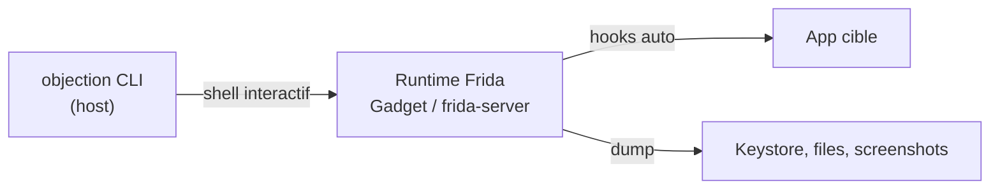

# 📱 objection — Mobile & Reverse Engineering

> [!info] **En 1 phrase**
> **objection** est une surcouche interactive sur Frida qui automatise le hacking runtime mobile :
> désactiver le **SSL pinning**, désactiver la détection de **root**, dumper le **keystore** ou explorer
> les classes à la volée, le tout **sans écrire un seul script** (moins connu que Frida brut).

---

## 🧾 Overview

| Champ | Valeur |
|---|---|
| Nom complet | objection (from SensePost) |
| Description | Shell interactif (basé sur Frida) pour le hacking runtime d'apps mobiles : bypass SSL pinning/root, dump mémoire/keystore, exploration des classes |
| Catégorie | 📱 Mobile & Reverse Engineering |
| Sous-catégorie | Instrumentation runtime Android / iOS (surcouche Frida) |
| Fonction principale | `objection -g com.example.app explore` → shell de commandes « métier » |
| Type d'outil | CLI interactive (shell IPython) + patcher APK/IPA |
| Licence | GNU GPL v3 (GPL-3.0-or-later) |
| Langage(s) de programmation | Python 3 (runtime Frida embarqué) |
| Développeur / organisation | SensePost (Leon Jacobs) et la communauté |
| Projet officiel | sensepost/objection |
| Dépôt officiel | https://github.com/sensepost/objection |
| Documentation officielle | https://github.com/sensepost/objection/wiki |
| Dernière version connue | 1.12.5 (paquet pip) |
| Systèmes compatibles | Linux, Windows, macOS (côté host) — Android/iOS côté device |

> [!note] À vérifier
> La version pip (1.12.5) est celle relevée au moment de la rédaction ; vérifier `pip3 index versions objection` et les releases GitHub avant de citer une version.

---

## 🎯 Concept

objection embarque un **runtime Frida** dans un shell interactif (`objection -g pkg explore`). Il fournit
des commandes "métier" (`android sslpinning disable`, `android root disable`, `android heap search
instances`...) qui génèrent automatiquement les hooks JS sous le capot. Il permet aussi de **patcher un
APK** (`objection patchapk`) en y injectant le Frida Gadget, pour instrumenter une app **sans root** et
sans recompilation manuelle.

Idéal pour un audit rapide : récupérer des secrets, naviguer dans le package, tenter de vider le keystore
et capturer le trafic applicatif. Il se place en **phase d'analyse mobile** (test d'intrusion d'apps
Android/iOS) : une fois l'app installée, objection accélère le contournement des protections de base pour
permettre le MITM (Burp), le dump mémoire et l'inspection des classes.



---

## 🧠 Concepts fondamentaux

| Concept | Explication |
|---|---|
| Frida runtime | Moteur d'instrumentation : injection d'un agent JS dans le process cible (hook de méthodes Java/Obj-C) |
| frida-server | Daemon exécuté sur un device **rooté**, connecté au client via ADB ou TCP |
| Frida Gadget | Bibliothèque `.so` injectée dans l'APK (`patchapk`) pour instrumenter **sans root** |
| SSL pinning | Vérification du certificat du serveur : `android sslpinning disable` hooke les librairies (OkHttp, TrustManager, NSURLSession…) pour laisser passer Burp |
| Root / jailbreak detection | Checks de `su`/Magisk/Xposed (Android) et Cydia/Substrate (iOS) : `root disable` / `jailbreak disable` les contournent |
| Keystore / Keychain | Stockage de clés Android (Keystore) et iOS (Keychain) : `android keystore list`, `ios keychain dump` |
| Hooking | Pose de hooks à la volée : `android hooking watch class` / `class_method`, `search classes` |
| Heap dump | Capture de la mémoire du process (`android dump heap`) : objets, chaînes, tokens |
| patchapk / patchipa | Injection du Gadget dans l'APK (via apktool) ou l'IPA — casse la signature d'origine |

---

## 🛠️ Installation

### Host (machine d'analyse)

```bash
pip3 install objection
# objection dépend de frida : vérifier les versions avec  objection --version
# Sur un device non rooté, injecter le gadget dans l'APK :
objection patchapk -s app.apk
adb install app-patched.apk
```

### Prérequis côté device (root)

```bash
# Device rooté : lancer frida-server (même version que le client)
adb push frida-server /data/local/tmp/
adb shell "chmod 755 /data/local/tmp/frida-server"
adb shell "/data/local/tmp/frida-server &"
```

### Device non rooté (Gadget)

```bash
objection patchapk -s app.apk
adb install app-patched.apk
# puis lancer l'app : le gadget attend la connexion, ouvrir le shell :
objection --gadget com.example.app explore
```

> [!warning] ⚠️ Prérequis & problèmes potentiels
> - **frida-tools et frida-server doivent être synchronisés** : une erreur de handshake au lancement trahit des versions différentes.
> - `patchapk` requiert apktool + une keystore pour la re-signature (objection peut générer une clé automatiquement).
> - iOS : l'instrumentation d'une IPA signée nécessite macOS et une gestion de la signature (voir le wiki).

---

## ⚙️ Configuration

objection se configure principalement par **flags de ligne de commande** et par un **fichier de config** (chemin passé avec `-c`).

| Paramètre | Rôle | Valeur possible | Impact | Exemple |
|---|---|---|---|---|
| `-g, --gadget <pkg>` | Nom du gadget / package à attacher | chaîne | Cible de l'instrumentation | `objection -g com.example.app explore` |
| `-N, --network` | Connexion en mode réseau (frida-server) | flag | Remplace ADB par TCP | `objection -N -h 10.0.20.15 -p 27042 -g com.example.app explore` |
| `-h, --host <ip>` | Adresse du device distant | IP | Avec `-N` | `-h 10.0.20.15` |
| `-p, --port <port>` | Port frida-server distant | 27042 par défaut | Avec `-N` | `-p 27042` |
| `-S, --serial <serial>` | Série USB du device | adb serial | Multi-device | `-S emulator-5554` |
| `-c, --config <fichier>` | Fichier de configuration (commandes) | chemin | Automatise le shell | `objection -c run.obj -g com.example.app explore` |
| `-s, --start` | Démarre l'app avant l'attache | flag | Attachement automatique | `objection -s -g com.example.app explore` |
| `--enable-verbose` | Logs détaillés | flag | Debug des hooks | `objection patchapk --enable-verbose -s app.apk` |

---

## 🏗️ Architecture interne

- **CLI Python** : parsing des arguments (argparse), dispatch des commandes, gestion de l'attachement (USB via ADB, réseau via frida-server, gadget).
- **Shell interactif** : basé sur **IPython** — l'utilisateur tape des commandes « métier » qui sont traduites en scripts **Frida JS**.
- **Modules Android** : `objection/android/` — hooking (Java.use, Reflection), heap (dumps, recherche d'instances), keystore, clipboard, shell, activités/intent.
- **Modules iOS** : `objection/ios/` — hooking (Obj-C runtime), keychain, bundle, plist, jailbreak bypass.
- **Patch engine** : `objection/patch/` — `patchapk`/`patchipa` utilisent **apktool** pour unpacker/repacker et injectent le **Frida Gadget** (`libgadget.so` + chargement via smali) avant re-signature.
- **Agent Frida** : le JS embarqué par objection (méta-programmation : découverte des classes, génération de hooks génériques).
- **Plugins** : chargement de plugins externes (package Python `objection` extensible).

---

## ⌨️ Commandes

### Commandes essentielles

```bash
objection -g com.example.app explore        # shell interactif sur l'app
objection patchapk -s app.apk               # injecte le Frida Gadget dans l'APK
objection --gadget com.example.app explore  # lance l'app avec le gadget
objection -N -h 10.0.20.15 -p 27042 -g com.example.app explore  # device distant
```

### À l'intérieur du shell

```text
android root disable                    # contourne la détection de root
android sslpinning disable              # désactive le SSL pinning
android hooking list classes            # liste les classes chargées
android hooking list activities         # liste les activités
android heap search instances <classe>  # retrouve les objets d'une classe en mémoire
android shell                           # shell dans le contexte de l'app
android clipboard monitor               # surveille le presse-papiers
android dump heap <file>                # dump du tas (heap) de l'app
android keystore list                   # liste les entrées du keystore
ios sslpinning disable                  # idem côté iOS
ios jailbreak disable                   # bypass jailbreak detection
```

| Commande | Effet |
|---|---|
| `objection -g pkg explore` | Ouvre le shell interactif sur le package |
| `android root disable` | Hooke les checks root (`su`, Magisk...) → « non rooté » |
| `android sslpinning disable` | Hooke les vérifications de certificat (OkHttp, TrustManager...) |
| `android hooking list classes` | Enumère les classes → cartographie des API |
| `android hooking search methods <pat>` | Cherche des méthodes par pattern (ex. `auth`, `token`) |
| `android heap search instances` | Retrouve les objets d'une classe en mémoire |
| `android keystore list` | Liste les clés/certs du keystore Android |
| `android dump heap` | Dump la mémoire du process (secrets, tokens) |
| `android shell` | Ouvre un shell dans le contexte de l'app |
| `android clipboard monitor` | Surveille les changements de presse-papiers |
| `android hooking list activities` | Liste les activités (écrans) de l'app |

---

## 🎚️ Options et flags

### Connexion

| Option | Description | Exemple | Niveau |
|---|---|---|---|
| `-g, --gadget <pkg>` | Package / nom du gadget | `objection -g com.example.app explore` | Basic |
| `-S, --serial <serial>` | Série USB | `objection -S emulator-5554 -g com.example.app explore` | Basic |
| `-N, --network` | Connexion TCP à frida-server | `objection -N -h 10.0.20.15 explore` | Intermediate |
| `-h, --host <ip>` | Hôte distant | `objection -N -h 10.0.20.15 ...` | Intermediate |
| `-p, --port <port>` | Port distant | `objection -N -h 10.0.20.15 -p 27042 ...` | Intermediate |
| `-s, --start` | Démarre l'app automatiquement | `objection -s -g com.example.app explore` | Advanced |
| `-c, --config <fichier>` | Fichier de commandes | `objection -c run.obj -g com.example.app explore` | Advanced |

### Patchapk / patchipa

| Option | Description | Exemple | Niveau |
|---|---|---|---|
| `-s, --source <fichier>` | APK/IPA source | `objection patchapk -s app.apk` | Basic |
| `--skip-resources` | Ne pas toucher aux ressources (plus rapide) | `objection patchapk -s app.apk --skip-resources` | Intermediate |
| `--use-aapt2` | Force aapt2 pour le repack | `objection patchapk -s app.apk --use-aapt2` | Intermediate |
| `--network-security-config <xml>` | Injecte une config réseau | `objection patchapk -s app.apk --network-security-config ns.xml` | Advanced |
| `--cleanup` | Supprime les fichiers temporaires | `objection patchapk -s app.apk --cleanup` | Expert |
| `--enable-verbose` | Logs détaillés du patch | `objection patchapk -s app.apk --enable-verbose` | Expert |

> [!tip] Options les plus utiles au quotidien
> `-g <pkg> explore` (basique), `-N -h <ip> -p 27042` (émulateur/distance), `patchapk -s app.apk` (sans root), et `--skip-resources` pour un patch rapide.

---

## 🧪 Exemples pratiques

### Beginner

```bash
# Objectif : ouvrir un shell sur une app et cartographier la surface
objection -g com.example.app explore
# dans le shell :
android hooking list classes | grep -iE "auth|secret|db"
android hooking list activities
```

### Intermediate

```bash
# Objectif : désactiver le SSL pinning pour intercepter le trafic
objection -g com.example.app explore
# dans le shell :
android sslpinning disable
# puis relancer le flux applicatif : les requêtes HTTPS apparaissent en clair dans Burp
```

### Advanced

```bash
# Objectif : retrouver des secrets en mémoire
objection -g com.example.app explore
# dans le shell :
android heap search instances com.example.app.db.SecretStore
android dump heap /data/local/tmp/heap.dump
# hors-ligne :
strings heap.dump | grep -iE "token|password|apikey|Bearer"
```

### Expert

```bash
# Objectif : instrumenter une app sans root (Gadget)
objection patchapk -s app.apk --network-security-config ns.xml
adb install app-patched.apk
objection --gadget com.example.app explore
```

---

## 🧪 Workflow complet (scénario pas à pas)

Scénario : récupérer des identifiants stockés dans le keystore d'une app protégée par SSL pinning.

```text
1. Patcher l'APK :  objection patchapk -s app.apk
2. Installer l'APK patché et le lancer :  adb install app-patched.apk
3. Ouvrir le shell :  objection -g com.example.app explore
4. Dans le shell :  android sslpinning disable   → le trafic devient interceptable (Burp)
5.  android keystore list                        → voir les alias de clés
6.  android heap search instances "com.example.app.db.SecretStore"
   → retrouver les objets secrets en mémoire
7. Sortir du shell (Ctrl+D) et récupérer les fichiers :  adb pull /data/data/com.example.app/
```

```bash
# Le MITM est alors validé : le trafic peut être relu dans Burp Proxy
adb forward tcp:8080 tcp:8080
```

---

## 🎬 Scénarios avancés

### Scénario 1 : Contourner SSL pinning puis capturer le trafic dans Burp

```bash
# Configurer le proxy Burp sur le téléphone, puis dans objection :
android sslpinning disable
# Relancer le flux applicatif : les requêtes HTTPS apparaissent en clair dans Burp
```

### Scénario 2 : Dump des secrets en mémoire (tokens, sessions)

```bash
# Dans le shell objection :
android dump heap /data/local/tmp/heap.dump
# puis analyse hors-ligne :
strings heap.dump | grep -iE "token|password|apikey|Bearer"
```

### Scénario 3 : Inspection des activités et des intentions

```bash
android hooking list activities
# Lancer une activité non exportée qui expose une fonction sensible :
android intent launch_activity com.example.app/.LoginActivity
```

---

## 🛡️ Cybersecurity use cases

| Phase | Utilisation |
|---|---|
| Test d'intrusion mobile | Bypass SSL pinning/root, dump mémoire et keystore, exploration des classes |
| Analyse de malware | Instrumentation de l'échantillon pour observer le comportement runtime |
| Validation de MITM | Confirmation rapide qu'une app est interceptable après bypass |
| CTF / crackme | Retrouver secrets en mémoire, contourner les checks de licence |
| Audit de sécurité d'entreprise | Vérifier l'efficacité des protections (pinning, anti-root, anti-Frida) |

---

## 🎯 MITRE ATT&CK

| Tactique | Technique / Sub-technique | ID | Raison | Détection | Mitigation |
|---|---|---|---|---|---|
| Defense Evasion | Process Injection | T1055 | Injection du runtime Frida (gadget/frida-server) dans le process de l'app | Monitoring des maps mémoire, anti-Frida | Détection d'injection, hardened runtime |
| Defense Evasion | Virtualization/Sandbox Evasion | T1497.001 | Contournement des détections root/jailbreak pour échapper aux contrôles | Checks croisés (su, Magisk, artefacts) | Détection robuste de l'environnement |
| Credential Access | Credentials from Password Stores | T1555 | Dump du keystore Android / keychain iOS | Alerte sur accès au keystore, hardware keystore | StrongBox, alias révoqués |
| Credential Access | Unsecured Credentials : Credentials In Files | T1552.001 | Dump mémoire révélant tokens et secrets en clair | Analyse des dumps, surveillance mémoire | Éviter les secrets en clair en runtime |
| Collection | Data from Local System | T1005 | Récupération de fichiers et données locales via le shell objet | Supervision des lectures de fichiers applicatifs | Sécuriser le stockage applicatif |

> [!note] Ne renseigner que si l'association est réellement pertinente.
> objection est un **outil d'instrumentation runtime** : les IDs les plus pertinents sont T1055 (injection), T1555 (keystore) et T1552.001 (secrets en mémoire).

---

## 🛡️ Defensive Security

### Signes observables

| Indicateur | Détail |
|---|---|
| Présence de `frida-agent`/`gadget` dans les maps mémoire | Marqueur classique d'instrumentation |
| APK re-signé (signature ≠ store) | `patchapk` casse la signature d'origine |
| `android:debuggable` ou build altéré | Artefact du patch gadget |
| Exécution de `objection`/`frida` sur un poste | Artefact de lab (Sigma) |
| Dumps mémoire / fichiers extraits (`adb pull`) | Indice d'exfiltration de données applicatives |

### Règles de détection (Sigma / Suricata / Snort / YARA)

```yaml
# Sigma — Linux : exécution d'objection (instrumentation mobile)
title: Objection Execution
id: 8b5e0f4c-2d7a-4e1b-9c3f-6a7d8e9f0b1c
status: test
logsource:
    category: process_creation
    product: linux
detection:
    selection:
        Image|endswith: objection
        CommandLine|contains:
            - 'explore'
            - 'patchapk'
    condition: selection
falsepositives:
    - Reverse engineering légitime en lab
level: medium
```

```yaml
# YARA — ELF contenant le Frida Gadget (libgadget.so)
rule Android_Frida_Gadget {
    meta:
        description = "Frida gadget library embedded in APK"
    strings:
        $g = "frida-gum" ascii nocase
        $s = "libgadget" ascii nocase
        $f = "gadget.config" ascii nocase
    condition:
        uint32be(0) == 0x7F454C46 and 2 of ($g, $s, $f)
}
```

---

## 🤖 Automatisation

```bash
# Bash — dérouler un script de commandes sur plusieurs apps
for pkg in com.example.app com.example.bank; do
    printf 'android sslpinning disable\nandroid root disable\nandroid dump heap /data/local/tmp/%s.heap\n' "$pkg" \
      | objection -g "$pkg" explore
done
```

```text
# Fichier de config objection (run.obj) : commandes exécutées au lancement
android sslpinning disable
android root disable
android hooking list classes
```

```bash
# Lancer avec le fichier de config
objection -c run.obj -g com.example.app explore
```

```python
# Python — pilotage d'objection via subprocess + parsing des sorties
import subprocess, re

def objection_cmd(pkg: str, cmd: str) -> str:
    proc = subprocess.run(
        ["objection", "-g", pkg, "explore", "-c", "run.obj"],
        input=cmd, text=True, capture_output=True, timeout=120,
    )
    return proc.stdout

out = objection_cmd("com.example.app", "android keystore list")
for alias in re.findall(r"Alias: (\S+)", out):
    print(f"keystore alias: {alias}")
```

---

## 📤 Output et parsing

Les commandes objecté rendent du **texte de shell** (pas de JSON structuré) : parsing via `grep`/`rg`/regex sur les sorties, et les dumps (heap, fichiers) sont analysés hors-ligne.

```bash
# Extraire les classes "security/auth/db" du shell
objection -g com.example.app explore -c run.obj 2>&1 | grep -iE "security|auth|db" | head -20

# Analyser un dump heap hors-ligne
strings /data/local/tmp/heap.dump | grep -iE "token|password|apikey|Bearer" | sort -u

# Liste des activités exportées
objection -g com.example.app explore -c run.obj 2>&1 | grep -E "activity" | head -20
```

---

## 🔗 Intégrations

```text
objection (bypass pinning) → Burp (MITM) → jadx/APKTool (corrélation statique) → Frida (hooks avancés)
MobSF (findings statiques) → objection (confirmation runtime des protections)
```

- [[Tools|🧰 Outils]] global
- [[Outil - Frida|📱 Frida]] — le moteur sous objection (scripts avancés si besoin)
- [[Outil - MobSF|📱 MobSF]] — scan statique pour cibler les tests runtime
- [[Outil - APKTool|📱 APKTool]] — patching smali manuel quand le gadget est détecté
- [[Outil - jadx|📱 jadx]] — localiser les classes/méthodes à hooker
- [[Outil - Burp Suite|🕸️ Burp Suite]] — interception après `android sslpinning disable`
- [[Techniques/Password Cracking|🔐 Cracking]] · [[Techniques/Insecure Deserialization|🧬 Désérialisation]]

---

## 🔄 Alternatives

| Outil | Avantages | Inconvénients | Cas d'usage |
|---|---|---|---|
| [[Outil - Frida|Frida]] brut | Contrôle total, scripts custom, réactif | Nécessite d'écrire du JS | Hooks fins et complexes |
| [[Outil - MobSF|MobSF]] | Analyse statique/dynamique automatisée | Pas de shell interactif fin | Tri rapide et rapports |
| r2frida | Intégration radare2 + Frida | Courbe d'apprentissage raide | Reverse dans le debugger |
| Frida Gadget manuel | Injection sur mesure | Setup long, signature à gérer | Apps durcies spécifiques |
| Ghidra / Cutter | Reverse statique complet (natif) | Pas de runtime | Analyse hors-ligne |

> **Quand utiliser objection plutôt que Frida brut ?** Dès qu'on veut **aller vite** sans écrire de code : bypass SSL pinning/root et dump mémoire en quelques commandes. Frida brut reste nécessaire pour les hooks personnalisés (arguments, valeurs de retour, tracking fin).

---

## ⚡ Performance

- Le shell démarre en **quelques secondes** (attachement Frida + compilation des hooks génériques).
- `android hooking list classes` est quasi instantané ; `search methods` peut être plus lent sur les grosses apps.
- Les `watch class`/`watch class_method` loggent chaque appel : à limiter pour ne pas noyer la sortie et ralentir l'app.
- Le `patchapk` prend **de ~10 s à ~1 min** (dépend d'apktool et de la taille de l'APK) ; `--skip-resources` l'accélère.
- Le dump heap capture l'ensemble du tas : volume important, prévoir de l'espace disque.

---

## 🛠️ Troubleshooting

### Common problems

#### Problème : `unable to start: expected gadget with name 'com.example.app'`

- **Cause** : l'app n'a pas été patchée, ou le gadget ne porte pas le bon nom.
- **Solution** : `objection patchapk -s app.apk`, réinstaller, et vérifier le nom du gadget (`objection --gadget <nom>`).
- **Vérification** : relancer l'app patchée avant d'ouvrir le shell.

#### Problème : erreur de handshake / `device is not connected`

- **Cause** : versions frida-client et frida-server différentes, ou device non visible.
- **Solution** : synchroniser `pip3 install -U frida-tools` et le binaire du device ; `adb devices` pour la connexion.
- **Vérification** : `frida-ps -U` liste les process si la connexion fonctionne.

#### Problème : l'app plante au lancement après `patchapk`

- **Cause** : signature cassée ou anti-tamper qui détecte le gadget.
- **Solution** : vérifier la re-signature, utiliser `--skip-resources`, ou passer par `frida-server` (device rooté).
- **Vérification** : `adb logcat | grep -iE "signature|integrity"` au lancement.

---

## 🔐 Sécurité de l'outil

- **Autorisation** : l'instrumentation d'une app sans consentement est intrusive : réserver aux apps auditées dans un cadre autorisé (pentest, lab, CTF).
- **Malware** : analyser un échantillon malveillant dans une VM isolée ; les dumps et fichiers extraits peuvent contenir des secrets.
- **Données** : les dumps heap/keystore contiennent des données sensibles : les purger après l'analyse, ne pas les versionner.
- **Chaîne d'outils** : installer via `pip` depuis PyPI officiel (ou le dépôt GitHub) ; vérifier l'intégrité des paquets.
- **Exposition** : le mode réseau (`-N`) expose frida-server : ne pas l'exposer sur Internet.

---

## ⚠️ Limitations

- **Non furtif** : `frida-agent`/`gadget` dans les maps est détectable par les protections anti-Frida.
- **Signature cassée** : `patchapk` re-signé → l'app peut refuser de démarrer (anti-tamper) ou la signature ne correspond plus au store.
- **Pinning renforcé** : certaines apps (natif, gRPC, custom) résistent au bypass générique.
- **Anti-Frida** : les checks de noms (`frida`, `gadget`) et de ports fonctionnent contre objection.
- **iOS** : besoin de macOS, de la gestion des signatures et d'un device jailbreaké (ou gadget).
- **Pas un désassembleur** : pour l'analyse statique profonde, compléter avec jadx/APKTool/Ghidra.

---

## 📋 Cheatsheet

```bash
# Installer
pip3 install objection

# Patcher un APK (gadget sans root)
objection patchapk -s app.apk
adb install app-patched.apk

# Ouvrir le shell
objection -g com.example.app explore

# Device distant (émulateur / réseau)
objection -N -h 10.0.20.15 -p 27042 -g com.example.app explore

# Dans le shell :
android root disable
android sslpinning disable
android hooking list classes
android hooking search methods "auth"
android heap search instances com.example.app.db.SecretStore
android dump heap /data/local/tmp/heap.dump
android keystore list
android clipboard monitor
android shell
ios jailbreak disable
ios keychain dump
```

---

## ⚡ Quick reference

| | |
|---|---|
| **À quoi sert-il ?** | Shell interactif Frida pour bypass SSL pinning/root, dump mémoire/keystore, exploration runtime |
| **Quand l'utiliser ?** | Audit mobile rapide, validation MITM, récupération de secrets en mémoire |
| **Commande principale** | `objection -g com.example.app explore` puis `android sslpinning disable` |
| **Alternative principale** | [[Outil - Frida|Frida]] brut (hooks custom) |
| **Concepts importants** | Frida, gadget, frida-server, SSL pinning, keystore, heap dump, hooking |
| **Liens associés** | [[Outil - Frida]] · [[Outil - MobSF]] · [[Outil - APKTool]] · [[Outil - Burp Suite]] |

---

## 🔍 Détection & Défense

| Réponse | Détail |
|---|---|
| **Anti-Frida** | Les checks des maps (`gadget`, `frida`) fonctionnent aussi contre objection |
| **Anti-patching** | Vérifier la **signature** de l'APK : `patchapk` casse la signature (rebuild) |
| **Intégrité runtime** | Vérifier la stack trace des API sensibles |
| **Keystore protégé** | Hardware keystore / StrongBox, alias révoqués en cas de dump |
| **Root/émulateur** | Détection des binaires `su`/`magisk`, des artefacts d'émulateur |

---

## ⚠️ Tips & Pièges

> [!tip] 💡 **Cartographie instantanée**
> `android hooking list classes` + `android hooking list activities` donne la structure de l'app en
> quelques secondes → repérer les classes "security", "auth", "db".

> [!tip] 💡 **APK sans root**
> `objection patchapk` injecte le gadget dans l'APK : ça marche sur device non rooté, mais **casse la
> signature** → l'app peut détecter le tampering et refuser de se lancer.

> [!warning] ⚠️ **Dump heap ≠ dump réseau**
> `android dump heap` capture le **tas mémoire** (objets, chaînes), pas le trafic. Pour le réseau, coupler
> objection + Burp après `android sslpinning disable`.

> [!warning] ⚠️ **Gadget détectable**
> La présence de `frida-agent` dans les maps est un marqueur classique : sur une app durcie, préférer un
> `frida-server` système et renommer les artefacts.

> [!warning] ⚠️ **Versions Frida incompatibles**
> objection exige une version de frida-server cohérente avec le client : une erreur de handshake au
> lancement trahit une version différente — synchroniser `pip3 install frida-tools` et le binaire du device.

---

## 📚 References

### Official

- Dépôt officiel : https://github.com/sensepost/objection
- Wiki / documentation : https://github.com/sensepost/objection/wiki
- Releases : https://github.com/sensepost/objection/releases

### Security references

- MITRE ATT&CK T1055 — Process Injection : https://attack.mitre.org/techniques/T1055/
- MITRE ATT&CK T1497.001 — Virtualization/Sandbox Evasion : https://attack.mitre.org/techniques/T1497/001/
- MITRE ATT&CK T1555 — Credentials from Password Stores : https://attack.mitre.org/techniques/T1555/
- MITRE ATT&CK T1552.001 — Unsecured Credentials : https://attack.mitre.org/techniques/T1552/001/
- MITRE ATT&CK T1005 — Data from Local System : https://attack.mitre.org/techniques/T1005/

### Community

- HackTricks — Mobile instrumentation : https://book.hacktricks.xyz/mobile-pentesting/android-app-pentesting
- Mobile Security Testing Guide (OWASP MSTG) : https://mas.owasp.org/
- Blog de Leon Jacobs (créateur) : https://github.com/leonjza

---

➡️ **Liens :** [[Tools|🧰 Outils]] · [[Outil - Frida|📱 Frida]] · [[Outil - MobSF|📱 MobSF]] · [[Outil - APKTool|📱 APKTool]] · [[Outil - jadx|📱 jadx]] · [[Outil - Burp Suite|🕸️ Burp Suite]] · [[Techniques/Password Cracking|🔐 Cracking]] · [[Techniques/Insecure Deserialization|🧬 Désérialisation]]
