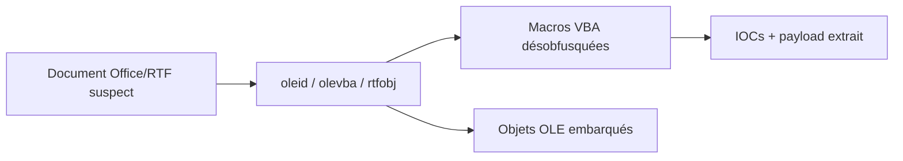
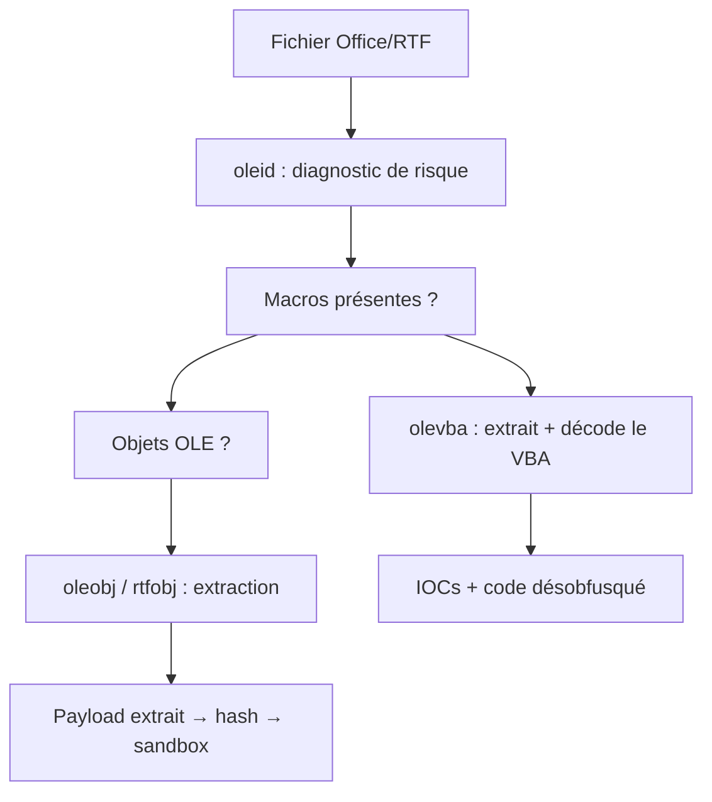

# oletools — Analyse des documents Office malveillants

> [!info] **En 1 phrase**
> oletools est la boîte à outils Python de référence pour inspecter les fichiers Office (doc, xls, ppt, rtf) et extraire ou désobfusquer les macros VBA, objets OLE et liens DDE utilisés par les malwares.

---

## Overview

| Champ | Valeur |
|---|---|
| Nom complet | oletools (OLE tools / suite d'analyse des documents Office) |
| Description | Boîte à outils Python en ligne de commande et en bibliothèque : diagnostic (`oleid`), extraction et désobfuscation de macros VBA (`olevba`), extraction d'objets OLE (`oleobj`), analyse RTF (`rtfobj`), métadonnées (`olemeta`), et plus |
| Catégorie | Malware & Sandbox |
| Sous-catégorie | Analyse statique de documents Office — macros VBA / OLE / DDE |
| Fonction principale | Détecter et extraire le contenu malveillant des documents Office (macro, OLE, DDE) sans les ouvrir |
| Type d'outil | Suite CLI + bibliothèque Python |
| Licence | BSD-3-Clause (à vérifier sur le dépôt) |
| Open source / propriétaire | Open source |
| Langage(s) de programmation | Python 3 (outils et bibliothèque) |
| Développeur / organisation | Philippe Lagadec (decalage2) |
| Projet officiel | decalage2/oletools |
| Dépôt officiel | https://github.com/decalage2/oletools |
| Documentation officielle | https://www.decalage.info/python/oletools |
| Date de création | 2011 (première version) |
| État du projet | actif |
| Dernière version connue | v0.60.3 (22 mai 2025) |
| Systèmes compatibles | Windows, Linux, macOS (Python 3) ; préinstallé sur REMnux |

> [!note] À vérifier
> La dernière version exacte se confirme sur PyPI (`pip index versions oletools`) ou la page Releases du dépôt. L'installation complète avec les dépendances optionnelles se fait via `pip install -U oletools[full]`.

---

## Concept

Les documents Office restent un vecteur d'intrusion majeur : macros VBA, objets OLE embarqués, DDE, équations OLE et liens externes permettent de délivrer des droppers en une interaction. oletools regroupe des utilitaires en ligne de commande spécialisés : `oleid` dresse un diagnostic rapide des risques, `olevba` extrait et analyse les macros VBA (avec désobfuscation et détection des IOCs comme `URLDownloadToFile`, `WScript.Shell`, `Shell`), `rtfobj` récupère les objets embarqués dans les fichiers RTF, `olemeta` lit les métadonnées, et `oleobj` extrait les objets OLE de fichiers OLE.

Il se place au stade du triage des pièces jointes : un analyste ou un SOC reçoit un fichier suspect et doit déterminer en minutes s'il est malveillant, extraire le code VBA désobfusqué, et récupérer les payloads pour la suite de l'analyse (hash, sandbox, YARA). C'est l'outil standard, pré-installé sur REMnux, et il complète parfaitement les sandbox pour les documents qui ne sont pas exécutés automatiquement. La suite inclut aussi `olebrowse`, `olemap`, `oletimes`, `vba_signature` et `pyxswf` (Flash), pour couvrir l'analyse OLE de bout en bout.



---

## Concepts fondamentaux

| Concept | Explication |
|---|---|
| OLE (Object Linking and Embedding) | Format de conteneur Microsoft (OLE2/CFB) utilisé par les fichiers Office ; il peut imbriquer d'autres objets (script, exe, équation) |
| Macros VBA | Code Visual Basic for Applications embarqué dans les documents ; les malwares l'utilisent pour télécharger/exécuter des payloads |
| Macros XLM (Excel 4.0) | Ancien format de macros Excel, silencieux, souvent ignoré des analyses classiques |
| DDE (Dynamic Data Exchange) | Mécanisme de communication inter-processus Office ; abusé pour exécuter des commandes à l'ouverture |
| Objets OLE embarqués | Fichiers imbriqués dans le conteneur (exe, docx, script) ; `oleobj` les extrait |
| Désobfuscation | Décodage des chaînes encodées (base64, `Chr()`, concaténation) pour reconstituer la commande finale |
| `olevba` | Extrait et analyse les macros VBA : résumé d'IOCs, code source, décodage des chaînes |
| `oleid` | Diagnostic rapide : présence de macros, DDE, objets OLE, liens externes — score de risque |
| `rtfobj` | Extrait les objets embarqués des fichiers RTF (souvent des documents OLE) |
| `msoffcrypto-tool` | Outil complémentaire pour déchiffrer les fichiers Office protégés par mot de passe |
| Format CFB (Compound File Binary) | Structure interne des fichiers .doc/.xls/.ppt ; les outils oletools la parcourent en lecture seule |

---

## Installation

Installation via pip (Python 3) :

```bash
pip install oletools
# Vérification des outils disponibles
oleid --help ; olevba --help
```

Sur REMnux, la suite est déjà installée. Les outils sont aussi utilisables comme bibliothèque Python : `from oletools.olevba import VBA_Parser`.

```python
# Exemple d'API Python : extraire les macros d'un fichier
from oletools.olevba import VBA_Parser
parser = VBA_Parser("facture.doc")
for path, filename, stream, code in parser.extract_macros():
    print(filename, code[:500])
```

> [!warning] Prérequis & problèmes potentiels
> - **Python 3** : oletools requiert Python 3.x (les anciennes versions de l'outil dépendaient de `olefile`, inclus par défaut).
> - **Fichiers chiffrés** : un document protégé par mot de passe doit d'abord être déchiffré avec `msoffcrypto-tool`.
> - **Fichiers OOXML (docx/xlsx)** : les macros y sont dans des fichiers `.bin` OLE séparés ; `olevba` les analyse via le flux approprié.

---

## Configuration

oletools est utilisé en ligne de commande, sans configuration globale. Les principaux réglages sont passés en arguments :

| Paramètre | Rôle | Valeur possible | Impact | Exemple |
|---|---|---|---|---|
| `olevba -a` | Analyse complète des macros (défaut) | `-a` / `--analyze` | Résume les IOCs (URLs, commandes, fichiers) | `olevba -a doc.doc` |
| `olevba -c` | Affiche le code source VBA | `-c` / `--code` | Sort le code brut pour lecture manuelle | `olevba -c doc.doc` |
| `olevba --decode` | Décode les chaînes encodées | `--decode` | Montre les chaînes déchiffrées (base64, escape) | `olevba -c --decode doc.doc` |
| `olevba -x` / `-j` | Sortie XML / JSON | `-x` / `-j` | Format exploitable par pipeline | `olevba -j doc.doc` |
| `olevba --suspicious` | Filtre les lignes suspectes | `--suspicious` | Ne montre que ce qui mérite attention | `olevba --suspicious doc.doc` |
| `oleid -i` | Répertoire d'entrée (lot) | `-i <dir>` | Analyse plusieurs fichiers d'un coup | `oleid -i /opt/attachments/` |

> [!note] À vérifier
> Les options exactes varient légèrement selon les versions ; `olevba --help` et `oleid --help` listent toutes les options disponibles.

---

## Architecture interne

- **`olefile`** : bibliothèque de lecture des fichiers OLE/CFB (métadonnées, flux, répertoires).
- **`oletools.olevba.VBA_Parser`** : analyseur de macros VBA — localise les flux `VBA`, décode les compressés, extrait le code et applique des heuristiques d'IOCs.
- **`oletools.oleobj` / `oletools.rtfobj`** : extraction des objets imbriqués (OLE dans OLE, OLE dans RTF).
- **`oletools.oleid`** : diagnostic rapide basé sur la présence de flags (macros, DDE, OLE, liens).
- **`oletools.olemeta`** : lecture des métadonnées du document (auteur, application, dates).
- **`oletools.mraptor`** : moteur de détection des macros malveillantes (heuristics de « macro ransomware »).
- **`vba_signature`** : vérification des signatures de macros (Adobe/Microsoft) pour identifier les auteurs.

Flux typique : `oleid` (diagnostic) → `olevba` (macros + décodage) → `oleobj`/`rtfobj` (extraction d'objets) → `olemeta` (métadonnées) → re-analyse des artefacts extraits.



---

## Commandes

### Commandes principales

```bash
oleid facture.doc                     # diagnostic rapide des risques
olevba -a -c --decode facture.xlsm    # analyse + code source désobfusqué
rtfobj -s piece-jointe.rtf            # extrait les objets embarqués d'un RTF
olemeta doc.docx                      # métadonnées du fichier
oleobj objet.ole                      # extrait l'objet OLE imbriqué
olevba --show-decoded -a -c doc.doc   # montre la désobfuscation étape par étape
```

| Option | Effet |
|---|---|
| `oleid <fichier>` | Score de risque : macros, DDE, OLE, lien externe |
| `olevba -a` | Analyse les macros et résume les IOCs (défaut) |
| `olevba -c` | Affiche le code source des macros VBA |
| `olevba --decode` | Décode les chaînes encodées (base64, escape) |
| `olevba -x` / `-j` | Sortie XML / JSON (pipeline) |
| `rtfobj -s <fichier>` | Sauvegarde les objets embarqués d'un RTF |
| `olemeta -l` | Liste les attributs de métadonnées disponibles |
| `olevba --suspicious` | Ne montre que les lignes jugées suspectes |

### Commandes avancées

```bash
# Analyse d'un lot de fichiers dans un dossier
for f in /opt/attachments/*.doc /opt/attachments/*.xls; do
    echo "== $f =="
    oleid "$f" | grep -E "VBA|DDE|OLE|risk"
done
# Sortie JSON pour ingestion SIEM/MISP
olevba -j -a dropper.xlsm > dropper_olevba.json
# Vérifier une macro sous suspicion de ransomware
mraptor -a dropper.doc
```

---

## Options et flags

| Option | Description | Exemple | Niveau |
|---|---|---|---|
| `olevba -a` | Analyse complète + résumé d'IOCs | `olevba -a doc.doc` | Basic |
| `olevba -c` | Afficher le code source | `olevba -c doc.doc` | Basic |
| `olevba --decode` | Décode les chaînes encodées | `olevba --decode -c doc.doc` | Intermediate |
| `olevba -j` / `-x` | Sortie JSON / XML | `olevba -j doc.doc` | Intermediate |
| `olevba --suspicious` | Lignes suspectes uniquement | `olevba --suspicious doc.doc` | Intermediate |
| `olevba --show-decoded` | Montre la désobfuscation étape par étape | `olevba --show-decoded -c doc.doc` | Advanced |
| `olevba --no-viper` | Désactive la connexion à VirusTotal | `olevba -a --no-viper doc.doc` | Advanced |
| `oleid -i` | Répertoire d'entrée | `oleid -i /opt/attachments/` | Intermediate |
| `rtfobj -s` | Sauvegarde les objets embarqués | `rtfobj -s piece.rtf` | Basic |
| `mraptor -a` | Détection de macro ransomware | `mraptor -a doc.doc` | Advanced |

> [!tip] Options les plus utiles au quotidien
> `olevba -c --decode` (code quasi-désobfusqué), `olevba -j` (JSON pour pipeline), `oleid` (diagnostic en 1 seconde), `rtfobj -s` (extraction des objets RTF).

---

## Exemples pratiques

### Beginner

```bash
# 1. Diagnostic rapide
oleid facture_2026.doc
# 2. Extraire le code VBA
olevba -c --decode facture_2026.doc > macro.vba
# 3. Chercher les indicateurs
grep -Ei "URLDownloadToFile|WScript.Shell|Shell |powershell|FromBase64" macro.vba
```

### Intermediate

```bash
# Document chiffré : déchiffrer d'abord
msoffcrypto-tool -t "" -p Password123 facture.doc decrypted.doc
olevba -a -c --decode decrypted.doc
# Fichier RTF avec objet OLE imbriqué
rtfobj -s piece-jointe.rtf
sha256sum extracted/*.ole
```

### Advanced

```bash
# Désobfuscation d'une commande PowerShell construite avec Chr()
olevba -c --decode dropper.xlsm | grep -oE "Chr\([0-9]+\)" | tr -d "Chr()" | awk '{printf "%c", $1}'
# Extraction complète d'une chaîne OLE imbriquée dans un RTF
rtfobj -s cve.rtf && oleobj -s extracted/*.ole
```

### Expert

```bash
# Pipeline JSON vers MISP/SIEM
olevba -j -a dropper.xlsm > dropper.json
jq -r '.macros[].suspicious' dropper.json 2>/dev/null | sort -u
# Détection de macro ransomware
mraptor -a dropper.doc
```

---

## Workflow complet (scénario pas à pas)

1. **Triage rapide** — identifier la menace sans l'ouvrir.

   ```bash
   oleid facture_2026.doc
   ```

2. **Extraire le code VBA** — récupérer la macro entière avec décodage des chaînes.

   ```bash
   olevba -c --decode facture_2026.doc > macro.vba
   ```

3. **Analyser le code** — chercher les fonctions dangereuses et la chaîne d'exécution.

   ```bash
   grep -Ei "URLDownloadToFile|WScript.Shell|Shell |powershell|FromBase64" macro.vba
   ```

4. **Extraire les objets** — les fichiers OLE et payloads embarqués rejoignent la liste des échantillons à hasher.

   ```bash
   rtfobj -s piece-jointe.rtf
   sha256sum *.bin *.exe 2>/dev/null
   ```

5. **Soumettre les artefacts** — hasher les payloads extraits et les interroger sur VirusTotal/YARA, puis pousser les IOCs dans MISP.

---

## Scénarios avancés

### Scénario 1 : Macro obfusquée avec charge PowerShell

Désobfuscation partielle : repérer les `Chr()` et les `String.Chr` de la macro pour reconstituer la commande PowerShell finale.

```bash
olevba -c --decode dropper.xlsm | grep -A5 "Chr\("
# puis reconstituer la chaîne :
olevba -c --decode dropper.xlsm | grep -oE "Chr\([0-9]+\)" | tr -d "Chr()" | tr "," "\n" | awk '{printf "%c", $1}'
```

### Scénario 2 : Fichier OLE imbriqué dans un RTF

Un RTF peut contenir un objet OLE qui contient lui-même un fichier : `rtfobj` extrait l'objet, puis `oleobj` le décompose à son tour.

```bash
rtfobj -s cve.rtf
oleobj -s extracted/*.ole
# re-analyser le fichier final avec oleid
```

### Scénario 3 : Triage automatisé d'un lot de fichiers

```bash
for f in *.doc *.xls *.ppt; do
  echo "== $f =="
  oleid "$f" | grep -E "VBA|DDE|OLE|risque"
done
```

### Scénario 4 : Macro Excel 4.0 (XLM) silencieuse

```bash
# oleid signale le flag "Excel 4.0" ; olevba analyse le flux XLM
oleid ancien-fichier.xls
olevba -c --decode ancien-fichier.xls | grep -iE "EXEC|RUN|CALL|FORMULA"
```

### Scénario 5 : Corrélation avec une sandbox pour confirmation

```bash
# Le statique ne suffit pas : soumettre le document à CAPE/Cuckoo pour
# observer le déclenchement réel des macros
python3 submit.py --package doc --timeout 120 facture.doc
```

---

## Cybersecurity use cases

| Phase | Utilisation |
|---|---|
| Triage de pièces jointes | `oleid` : décision rapide macros/OLE/DDE sans ouverture |
| Analyse de malware (statique) | `olevba` : extraction et désobfuscation du code VBA |
| CTI / Threat Intelligence | Collecte des IOCs (URLs, domaines, hahes de payloads) |
| DFIR | Recherche d'objets OLE/DDE dans les documents collectés |
| Sécurité offensive (phishing) | Étude des techniques de livraison pour les exercices |
| Automatisation SOC | `olevba -j` : ingestion JSON dans SIEM/MISP |

---

## MITRE ATT&CK

| Tactique | Technique / Sub-technique | ID | Raison | Détection | Mitigation |
|---|---|---|---|---|---|
| Execution | User Execution : Malicious File | T1204.002 | Le document est ouvert par l'utilisateur ; vecteur phishing | Triage e-mail, sandboxing | Contrôles d'exécution, restrictions d'accès |
| Execution | Command and Scripting Interpreter : Visual Basic | T1059.005 | Les macros VBA exécutent des commandes (`Shell`, `WScript.Shell`) | Sysmon EventID 1, AMSI | Bloquer les macros non signées, AMSI |
| Execution | Command and Scripting Interpreter : PowerShell | T1059.001 | Les macros délivrent des payloads PowerShell encodés | Sysmon EventID 1, AMSI | AMSI, Logging PowerShell |
| Execution | Windows Management Instrumentation | T1047 | Certains payloads invoquent WMI via les macros | Sysmon EventID 19/20 | Restriction WMI |
| Defense Evasion | Obfuscated Files or Information | T1027 | Chaînes encodées et `Chr()` dans les macros détectées | `olevba --decode`, YARA | Mise à jour des signatures |
| Initial Access | Phishing : Spearphishing Attachment | T1566.001 | Le document est le vecteur d'accès initial | Triage e-mail, sandboxing | Filtrage pièces jointes, sandbox |
| Collection | Input Capture | T1056 | Certaines macros récupèrent des données avant exfiltration | EDR | Segmentation, DLP |

> [!note] Ne renseigner que si l'association est réellement pertinente.
> oletools est un **outil d'analyse** : les techniques listées sont celles détectées dans les documents analysés, pas des techniques mises en œuvre par l'outil.

---

## Defensive Security

### Signes observables

| Indicateur | Détail |
|---|---|
| Macros actives avec `AutoOpen`/`AutoExec` | Bloquer les macros dans Office (GPO) et désactiver VBA non signé |
| DDE ou équations OLE externes | Désactiver DDE dans les politiques Office |
| `WScript.Shell`, `URLDownloadToFile`, `Shell` | Détecter via EDR/Sysmon (création de processus), bloquer les domaines |
| Macros XLM (Excel 4.0) silencieuses | Activer les politiques bloquant les macros XLM |
| Payload OLE embarqué (exe, script) | Extraire, hasher, re-analyse YARA/sandbox |
| Chaînes base64 très longues dans le code VBA | Alerte sur les blobs encodés + AMSI à l'exécution |

### Règles de détection (Sigma / Suricata / Snort / YARA)

```yaml
# Sigma — Windows : création de processus depuis Office (macro active) (exemple)
title: Suspicious Process Creation From Office
logsource:
    category: process_creation
    product: windows
detection:
    selection:
        ParentImage|endswith:
            - 'WINWORD.EXE'
            - 'EXCEL.EXE'
            - 'POWERPNT.EXE'
        Image|endswith:
            - 'powershell.exe'
            - 'cmd.exe'
    condition: selection
level: high
```

```yara
// YARA — repérage des documents avec macros VBA (exemple)
rule Office_Macro_VBA_Present
{
    condition:
        uint16(0) == 0x5A4D or
        // flux VBA compressés dans les fichiers OLE
        filesize > 0 and filesize < 5MB
}
```

---

## Automatisation

```bash
# Bash — triage d'un lot de pièces jointes et extraction des payloads
mkdir -p /opt/analysis
for f in /opt/incoming/*.doc /opt/incoming/*.xls /opt/incoming/*.rtf; do
    base=$(basename "$f")
    oleid "$f" | grep -E "VBA|DDE|OLE" | sed "s/^/[$base] /"
    olevba -c --decode "$f" 2>/dev/null | grep -Ei "URLDownloadToFile|WScript" >> /opt/analysis/iocs.txt
    rtfobj -s "$f" 2>/dev/null
done
sort -u /opt/analysis/iocs.txt -o /opt/analysis/iocs.txt
```

```python
# Python — extraction des IOCs depuis un rapport olevba JSON
import json

with open("dropper_olevba.json") as f:
    data = json.load(f)

for macro in data.get("macros", []):
    for s in macro.get("suspicious", []):
        print("SUSPICIOUS:", s["details"])
```

> [!note] À vérifier
> La structure du JSON de sortie de `olevba -j` dépend de la version ; adapter les chemins des clés à la sortie réelle.

---

## Output et parsing

- **`oleid`** : texte lisible (score de risque, flags macros/DDE/OLE).
- **`olevba -j`** : JSON structuré (IOCs, macros, décodages) pour les pipelines.
- **`olevba -c`** : code source VBA brut (à grepper).
- **`rtfobj -s` / `oleobj -s`** : fichiers extraits (payloads, OLE imbriqués).

```bash
# Extraire les URLs des macros
olevba -a dropper.xlsm | grep -iE "http" | sort -u
# Extraire les chaînes suspectes en JSON
olevba -j -a dropper.xlsm | jq -r '.macros[].suspicious[].details' 2>/dev/null
```

```python
# Python — collecte des URLs dans le code VBA
import re
from oletools.olevba import VBA_Parser

parser = VBA_Parser("facture.doc")
URL = re.compile(r"https?://[^\s'\"]+")
for _, _, _, code in parser.extract_macros():
    for m in URL.findall(code):
        print("URL", m)
```

---

## Intégrations

- [[Tools| Outils]] global
- [[Outil - REMnux]] — suite préinstallée sur la distribution d'analyse
- [[Outil - CAPE]] / [[Outil - Cuckoo Sandbox]] — exécution dynamique des documents (package `doc`) pour confirmer le comportement
- [[Outil - YARA]] — signatures sur les documents et payloads extraits
- [[Outil - MISP]] — publication des IOCs issus des macros
- [[Outil - Flare VM]] — distribution Windows avec oletools installable
- [[Outil - Ghidra]] — analyse du payload extrait (statique)
- [[09 - Reverse Engineering & Malware| Reverse Engineering & Malware]]

```text
Pièce jointe → oletools (oleid/olevba/rtfobj) → macro + payload → YARA + MISP → SOC
```

---

## Alternatives

| Outil | Avantages | Inconvénients | Cas d'usage |
|---|---|---|---|
| Microsoft OffVis / OLE viewer | Interne Microsoft, visuel | Obsolète, peu de fonctionnalités | Visualisation OLE basique |
| Didier Stevens tools (oledump.py) | Léger, dump des flux | Pas d'analyse VBA complète | Dump rapide des flux OLE |
| OfficeMalScanner | Analyse de macros et shellcode | Moins maintenu, Windows | Scans rapides |
| Vmonkey (VBA emulator) | Exécution instrumentée des macros | Complexe, jeune | Confirmation d'exécution |
| REMnux (bundled) | Tout-en-un prêt à l'emploi | VM lourde | Environnement d'analyse complet |

> **Quand utiliser oletools plutôt que la sandbox ?** Le statique donne les IOCs et le code SANS exécution : indispensable pour le triage massif ; la sandbox (package `doc`) complète pour confirmer la détonation réelle.

---

## Performance

- `oleid` : quasi instantané (parcours des flux OLE).
- `olevba -a -c --decode` : de l'ordre de la seconde pour un document classique ; plus lent sur les gros fichiers ou les macros XLM volumineuses.
- `olevba -j` : léger, adapté aux pipelines de triage automatisé (milliers de fichiers/heure).
- Les boucles d'analyse par lot sont CPU-bound Python : paralléliser avec `xargs -P` ou un pool Python pour les gros volumes.
- La sortie JSON est plus compacte et plus exploitable que le texte pour l'ingestion.

---

## Troubleshooting

### Common problems

#### Problème : « File not an OLE file » avec oleid

- **Cause** : le fichier est en réalité un RTF, un OOXML (docx/xlsx) ou un fichier sans structure OLE.
- **Solution** : utiliser `rtfobj` pour les RTF, `olevba`/`oleid` sur le flux OLE des OOXML, ou `file` pour identifier le format.
- **Vérification** : `file facture.doc` affiche le vrai type.

#### Problème : macros invisibles dans olevba

- **Cause** : fichier chiffré par mot de passe, macros XLM, ou stockage VBA non standard.
- **Solution** : déchiffrer avec `msoffcrypto-tool`, chercher le flag « Excel 4.0 » dans `oleid`.
- **Vérification** : `oleid` affiche la présence de macros et le type.

#### Problème : la désobfuscation échoue sur les constructions maison

- **Cause** : concaténation dynamique, XOR, appels indirects — olevba ne peut pas tout reconstruire.
- **Solution** : analyse manuelle du code, exécution contrôlée en sandbox.
- **Vérification** : comparer le code brut (`-c` sans `--decode`) et le décodé.

#### Problème : erreur de dépendance (olefile, xlrd)

- **Cause** : version partielle de l'installation.
- **Solution** : `pip install -U oletools[full]`.
- **Vérification** : `pip show oletools` et import de test `python -c "import oletools"`.

#### Problème : faux négatif sur un document OOXML

- **Cause** : les macros des docx/xlsx sont dans des flux OLE imbriqués, parfois ignorés.
- **Solution** : analyser le `.docm`/`.xlsm` directement ou dézipper et scanner les `vbaProject.bin`.
- **Vérification** : `unzip -l doc.docm | grep vbaProject`.

---

## Sécurité de l'outil

- **Lecture seule** : oletools n'exécute jamais le code des macros — analyse statique sûre.
- **Artefacts** : les fichiers extraits (`rtfobj -s`) sont des malwares potentiels ; les hasher et les conserver dans un emplacement contrôlé.
- **Mises à jour** : maintenir la version à jour (`pip install -U oletools`) pour les nouvelles heuristiques et les formats récents.
- **Flux externes** : désactiver les connexions optionnelles (ex. `--no-viper`) sur un poste isolé pour éviter les requêtes sortantes.
- **Environnement** : préférer REMnux (VM dédiée) pour l'analyse de documents non fiables.

---

## Limitations

- La désobfuscation n'est jamais totale : les constructions maison (concaténation, XOR, chiffrement custom) exigent de l'analyse manuelle.
- `olevba` n'exécute rien : certains comportements ne se révèlent qu'à l'exécution (sandbox).
- Les documents chiffrés par mot de passe doivent être déchiffrés au préalable.
- Les macros XLM (4.0) sont moins bien couvertes que le VBA.
- Les formats OOXML complexes (vbaProject.bin imbriqué) peuvent nécessiter une analyse en deux temps.
- Pas de support natif des PDF (autres outils) ni des fichiers `.bin` isolés.

---

## Cheatsheet

```bash
# Diagnostic rapide
oleid facture.doc

# Extraire le code VBA désobfusqué
olevba -c --decode facture.doc > macro.vba

# Analyse avec résumé d'IOCs
olevba -a facture.doc

# Sortie JSON pour pipeline
olevba -j -a facture.doc > facture.json

# Lignes suspectes uniquement
olevba --suspicious facture.doc

# Extraire les objets d'un RTF
rtfobj -s piece-jointe.rtf

# Extraire un objet OLE imbriqué
oleobj -s extracted/objet.ole

# Métadonnées
olemeta facture.docx

# Déchiffrer un document protégé
msoffcrypto-tool -t "" -p Password123 facture.doc decrypted.doc

# Détection de macro ransomware
mraptor -a facture.doc
```

---

## Quick reference

| | |
|---|---|
| **À quoi sert-il ?** | Analyser statiquement les documents Office/RTF : macros VBA, objets OLE, DDE, métadonnées |
| **Quand l'utiliser ?** | Triage des pièces jointes, extraction de payloads et désobfuscation de macros |
| **Commande principale** | `olevba -c --decode facture.doc` (code) · `oleid facture.doc` (diagnostic) |
| **Alternative principale** | Didier Stevens oledump · OfficeMalScanner · REMnux (bundled) |
| **Concepts importants** | OLE/CFB, macros VBA, XLM, DDE, désobfuscation, IOCs |
| **Liens associés** | [[Outil - REMnux]] · [[Outil - CAPE]] · [[Outil - Cuckoo Sandbox]] · [[Outil - YARA]] |

---

## Détection & Défense

| Signe | Défense |
|---|---|
| Macros actives avec `AutoOpen`/`AutoExec` | Bloquer les macros dans Office (GPO) et désactiver VBA non signé |
| DDE ou équations OLE externes | Désactiver DDE dans les politiques Office |
| `WScript.Shell`, `URLDownloadToFile`, `Shell` | Détecter via EDR/Sysmon (création de processus), bloquer les domaines |
| Macros XLM (Excel 4.0) silencieuses | Activer les politiques bloquant les macros XLM |
| Payload OLE embarqué (exe, script) | Extraire, hasher, re-analyse YARA/sandbox |

---

## Tips & Pièges

> [!tip] **Tips**
> - Lancez toujours `oleid` en premier : il dit en une seconde si le fichier mérite une analyse VBA approfondie.
> - `olevba -c --decode` donne le code quasi-désobfusqué : croisez les strings extraites avec les IOCs connus.
> - Pour les fichiers chiffrés par mot de passe, utilisez `msoffcrypto-tool` avant l'analyse.
> - Utilisez `olevba -j` en sortie JSON pour automatiser l'ingestion des IOCs dans un SIEM ou MISP.

> [!warning] **Pièges**
> - Un document sans macros n'est pas innocent : il peut encore contenir un objet OLE, du DDE ou un lien externe.
> - La désobfuscation n'est jamais totale : les constructions maison (concaténation, XOR) demandent encore de l'analyse manuelle.
> - Les macros XLM (4.0) sont invisibles pour certains scanners : vérifiez `oleid` pour le flag « Excel 4.0 » avant de conclure.
> - `olevba` n'exécute rien : certains payloads ne se révèlent qu'à l'exécution (sandbox) — le statique ne suffit pas seul.

---

## References

### Official

- Dépôt GitHub officiel : https://github.com/decalage2/oletools
- Documentation (decalage.info) : https://www.decalage.info/python/oletools
- PyPI oletools : https://pypi.org/project/oletools/

### Security references

- MITRE ATT&CK T1204.002 — User Execution : Malicious File : https://attack.mitre.org/techniques/T1204/002/
- MITRE ATT&CK T1059.005 — Visual Basic : https://attack.mitre.org/techniques/T1059/005/
- MITRE ATT&CK T1566.001 — Spearphishing Attachment : https://attack.mitre.org/techniques/T1566/001/

### Community

- mraptor (macro ransomware detection) : https://github.com/decalage2/mraptor
- msoffcrypto-tool (déchiffrement Office) : https://github.com/nolze/msoffcrypto-tool
- Vmonkey (émulateur VBA, futur) : https://github.com/decalage2/ViperMonkey

---

**Liens :** [[Tools| Outils]] · [[Outils/Outil - REMnux| REMnux]] · [[Outils/Outil - Cuckoo Sandbox| Cuckoo Sandbox]] · [[Outils/Outil - CAPE| CAPE]] · [[Outils/Outil - YARA| YARA]] · [[Techniques/09 - Reverse Engineering & Malware| Reverse Engineering & Malware]]
